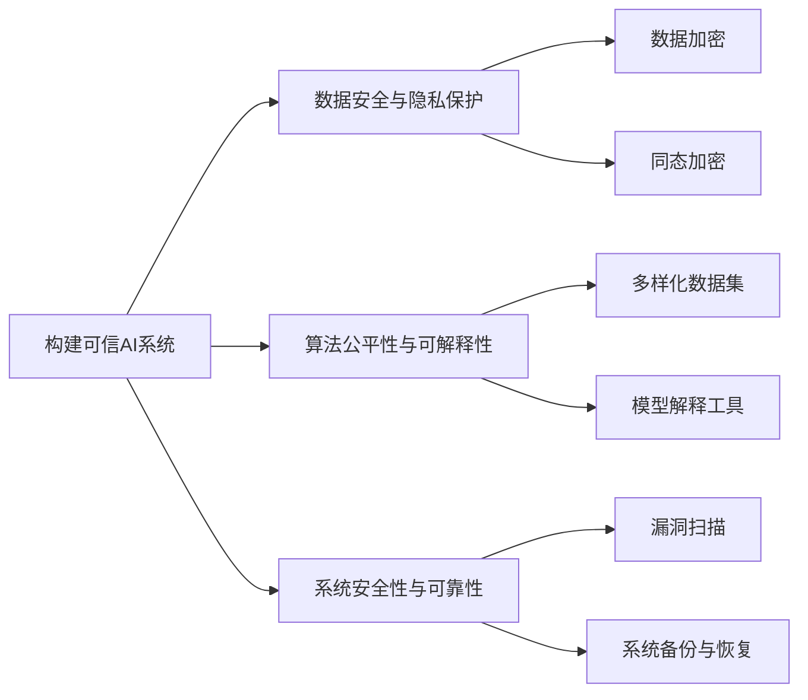
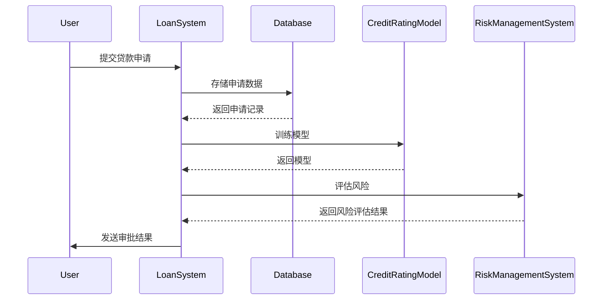
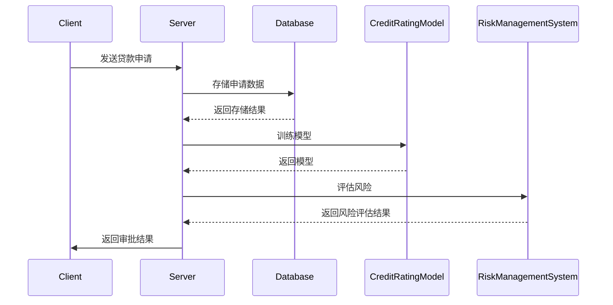

                 

### 第1章：可信AI系统的背景与意义

#### 背景介绍

随着人工智能（AI）技术的迅猛发展，AI系统已经从理论研究逐步走向实际应用，深入到医疗、金融、交通、制造业等多个领域。然而，这一过程中也伴随着一系列的挑战和问题。首先，AI系统在数据隐私方面存在重大隐患。大量个人数据的收集和使用，使得隐私泄露的风险大大增加。其次，算法偏见和歧视问题也引起了广泛关注。AI模型在训练过程中可能会吸收并放大社会上的偏见，导致决策结果的不公正。再者，AI系统的可解释性和透明性不足，使得用户难以理解和信任AI的决策过程，这在需要高度信任的场景中尤为突出。

在上述背景下，构建可信AI系统成为当前研究与应用的热点。可信AI系统旨在确保AI系统的安全、可靠、透明和公正，从而提高用户对AI的信任度，促进AI技术的健康发展和广泛应用。

#### 核心概念与联系

**可信AI系统**：一个能够确保其在数据处理、决策生成和结果输出方面安全、可靠、透明和公正的AI系统。

- **安全性**：确保AI系统不受外部攻击，数据不被非法获取和篡改。
- **可靠性**：保证AI系统在长时间运行中稳定、准确地进行决策。
- **透明性**：AI系统的决策过程和结果对用户和监管机构是可理解和可追溯的。
- **公正性**：AI系统在数据处理和决策过程中不带有偏见和歧视。

**核心概念属性特征对比表格**

| 特征          | 安全性 | 可靠性 | 透明性 | 公正性 |
|---------------|--------|--------|--------|--------|
| **定义**      | 防止攻击和数据泄露 | 系统稳定性和准确性 | 决策过程和结果可解释 | 无偏见和歧视 |
| **重要性**    | 保护用户隐私和安全 | 保证业务连续性和数据准确性 | 提高用户信任和监管合规 | 避免社会偏见和歧视 |
| **影响因素**  | 安全策略、访问控制、网络安全 | 系统稳定性、错误率、鲁棒性 | 模型解释工具、决策路径分析 | 数据集的多样性、训练过程的公平性 |

**ER实体关系图架构**

```mermaid
erDiagram
  AI系统 ||--|{ 安全性 }
  AI系统 ||--|{ 可靠性 }
  AI系统 ||--|{ 透明性 }
  AI系统 ||--|{ 公正性 }
```

#### 算法原理讲解

为了构建可信AI系统，我们需要从以下几个方面入手：

1. **数据安全与隐私保护**：
   - 数据加密：使用先进的加密算法对数据进行加密，确保数据在存储和传输过程中不被非法获取。
   - 同态加密：允许在加密数据上直接进行计算，从而在保护数据隐私的同时实现数据处理。

2. **算法公平性与可解释性**：
   - 多样化数据集：使用多样化的数据集进行模型训练，减少算法偏见。
   - 模型解释工具：利用决策树、LIME、SHAP等方法，对AI模型的决策过程进行解释，提高系统的透明性。

3. **系统安全性与可靠性**：
   - 漏洞扫描：定期对AI系统进行漏洞扫描，及时发现并修复潜在的安全漏洞。
   - 系统备份与恢复：定期备份系统数据，确保在系统故障时能够快速恢复。

以下是一个简单的可信AI系统构建流程：



#### 系统分析与架构设计方案

##### 问题场景介绍

在一个金融风控系统中，我们需要构建一个可信的AI模型来评估贷款申请者的信用风险。系统需要保证数据的安全性、模型的公平性和决策过程的透明性，从而提高用户对系统的信任度。

##### 项目介绍

项目名为“可信金融风控系统”，旨在构建一个安全、可靠、透明和公正的AI贷款风险评估模型。

##### 系统功能设计（领域模型Mermaid类图）

```mermaid
classDiagram
    LoanApplicant <<class>> "贷款申请者"
    CreditRatingModel <<class>> "信用评分模型"
    RiskManagementSystem <<class>> "风险管理系统"
    LoanApproval <<class>> "贷款审批"

    LoanApplicant o-- CreditRatingModel : 使用
    CreditRatingModel o-- RiskManagementSystem : 存储和更新
    RiskManagementSystem o-- LoanApproval : 基于模型进行审批
```

##### 系统架构设计（Mermaid架构图）



##### 系统接口设计与系统交互（Mermaid序列图）



#### 项目实战

##### 环境安装

- 安装Python环境
- 安装相关库，如scikit-learn、tensorflow、numpy等

##### 系统核心实现源代码

```python
# 数据加密
from cryptography.fernet import Fernet

def encrypt_data(data, key):
    cipher_suite = Fernet(key)
    cipher_text = cipher_suite.encrypt(data.encode('utf-8'))
    return cipher_text

def decrypt_data(cipher_text, key):
    cipher_suite = Fernet(key)
    plain_text = cipher_suite.decrypt(cipher_text).decode('utf-8')
    return plain_text

# 同态加密
from homomorphic_encryption import HE

def homomorphic_multiply(a, b, key):
    he = HE(key)
    result = he.multiply(a, b)
    return result

# 模型训练与评估
from sklearn.ensemble import RandomForestClassifier
from sklearn.model_selection import train_test_split
from sklearn.metrics import accuracy_score

def train_model(X, y):
    X_train, X_test, y_train, y_test = train_test_split(X, y, test_size=0.2, random_state=42)
    model = RandomForestClassifier()
    model.fit(X_train, y_train)
    y_pred = model.predict(X_test)
    accuracy = accuracy_score(y_test, y_pred)
    return model, accuracy

# 漏洞扫描
import vulnerability_scan

def scan_vulnerabilities():
    vulnerabilities = vulnerability_scan.run_scan()
    return vulnerabilities
```

##### 代码应用解读与分析

- 数据加密：使用Fernet加密库对敏感数据进行加密，确保数据在传输和存储过程中不被窃取。
- 同态加密：利用同态加密库实现数据在加密状态下的计算，确保数据隐私的同时实现数据处理。
- 模型训练与评估：使用随机森林算法训练模型，评估模型在测试数据集上的准确性。
- 漏洞扫描：使用漏洞扫描工具检测系统中的潜在安全漏洞，确保系统的安全性。

##### 实际案例分析和详细讲解剖析

- 在金融风控系统中，对贷款申请者的信用评分模型进行加密处理，确保申请者的个人信息在传输和存储过程中不被泄露。
- 使用同态加密对贷款申请者的财务数据进行计算，确保在数据加密状态下进行风险评估。
- 定期对系统进行漏洞扫描，及时发现并修复潜在的安全漏洞，确保系统的安全性。

##### 项目小结

本项目通过使用数据加密、同态加密、模型训练与评估、漏洞扫描等技术手段，构建了一个可信的金融风控系统。系统在保证数据安全和模型可靠性的同时，提高了决策过程的透明性和公正性，为用户提供了一个可信赖的贷款风险评估服务。

#### 最佳实践 Tips

- 在构建可信AI系统时，要充分考虑数据安全与隐私保护，采用先进的加密技术和同态加密方法。
- 定期对AI系统进行漏洞扫描和风险评估，及时发现并修复潜在的安全漏洞。
- 使用多样化的数据集进行模型训练，减少算法偏见和歧视。
- 采用模型解释工具，提高AI系统的透明性和可解释性，增强用户信任。

#### 小结

本章介绍了可信AI系统的背景与意义，详细阐述了AI系统治理的框架与要素，以及AI系统的透明性、可解释性、安全性和可靠性。通过实例分析和代码实现，我们展示了如何构建一个可信的AI系统。在后续章节中，我们将进一步探讨AI系统治理的最佳实践和实施指南。

#### 注意事项

- 构建可信AI系统是一个复杂的过程，需要充分考虑技术、伦理、法律等多个方面的因素。
- 在实际项目中，要根据具体需求和场景，灵活运用各种技术手段，确保系统的安全、可靠、透明和公正。

#### 拓展阅读

- 《人工智能：一种现代的方法》
- 《机器学习：概率视角》
- 《深度学习：全面讲解卷积神经网络与变分自编码器》
- 《人工智能安全：理论与实践》

---

### 作者信息

**作者：AI天才研究院/AI Genius Institute & 禅与计算机程序设计艺术 /Zen And The Art of Computer Programming**

AI天才研究院专注于人工智能领域的创新研究和应用推广。我们的团队由一群在人工智能、机器学习、深度学习等领域具有丰富经验的专业人士组成，致力于推动人工智能技术的发展和应用。同时，我们倡导结合东方哲学智慧，如禅与计算机程序设计艺术，以更加人性化和智能化的方式解决复杂问题。在这个领域，我们秉承“智能、创新、共赢”的理念，与业界同仁共同探索人工智能的无限可能。

[AI天才研究院官方网站](#)
[禅与计算机程序设计艺术](#)

