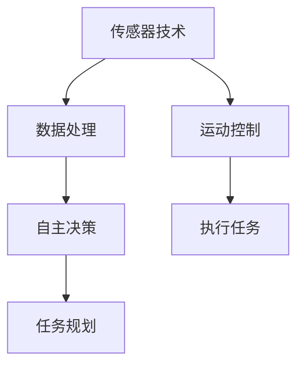

                 

# 柔性自动化：多功能机器人适应多变的生产需求

## 关键词
- 柔性自动化
- 多功能机器人
- 生产线适应性
- 生产效率
- 技术发展

## 摘要
本文旨在探讨柔性自动化的概念及其在多功能机器人领域的应用，重点分析多功能机器人在多变生产需求中的适应性。通过详细阐述柔性自动化的背景、关键技术、系统设计以及实际应用案例，本文揭示了柔性自动化在提高生产效率、应对生产需求变化中的重要作用，并展望了其未来发展的趋势与挑战。

## 引言

### 什么是柔性自动化？
柔性自动化是一种能够根据生产需求的变化快速调整和重新配置的自动化系统。它结合了先进的机器人技术、传感器技术、人工智能和计算机视觉技术，以实现生产线的灵活性和高效率。与传统自动化系统相比，柔性自动化具有更高的适应性和可扩展性，能够更好地满足现代制造业的多样化需求。

### 多功能机器人在柔性自动化中的角色
多功能机器人是柔性自动化系统的核心组件之一。它们具有多功能、多任务处理能力，可以适应不同的生产任务和环境。在柔性自动化系统中，多功能机器人能够根据实际需求进行快速调整和重组，实现高效生产。

### 柔性自动化的重要性
随着全球制造业的快速发展，生产需求的多样化和快速变化对制造系统提出了更高的要求。柔性自动化技术能够帮助企业提高生产效率，降低成本，增强市场竞争力。因此，研究柔性自动化及其在多功能机器人领域的应用具有重要意义。

## 第一部分：柔性自动化概述

### 第1章：柔性自动化的概念与背景

#### 1.1.1 柔性自动化的定义
柔性自动化是指一种能够适应生产需求变化，实现高效、灵活生产的自动化系统。它不仅仅依赖于传统的机械自动化设备，还融合了先进的传感器技术、人工智能和计算机视觉技术。

#### 1.1.2 柔性自动化的起源与发展
柔性自动化的概念最早起源于20世纪80年代，当时为了满足制造业的需求多样化和灵活性，研究人员开始探索如何使生产系统更加柔性化。随着技术的不断进步，柔性自动化得到了迅速发展，并逐渐成为现代制造业的重要组成部分。

#### 1.1.3 柔性自动化的意义与应用领域
柔性自动化在提高生产效率、降低成本、增强市场竞争力等方面具有重要意义。它广泛应用于汽车制造、电子组装、食品加工、医药制造等领域，成为现代制造业不可或缺的一部分。

### 第2章：多功能机器人的关键技术与发展

#### 2.1.1 多功能机器人的定义与特点
多功能机器人是一种能够执行多种任务和操作的机器人系统。它具有多功能、多任务处理能力，可以根据不同的生产任务进行快速调整和重组。

#### 2.1.2 多功能机器人的主要技术
多功能机器人的关键技术包括传感器技术、人工智能、计算机视觉和运动控制技术。这些技术使得多功能机器人能够适应不同的生产任务和环境。

#### 2.1.3 多功能机器人的发展现状与趋势
多功能机器人技术在过去几十年中取得了显著进展。当前，多功能机器人在生产效率、精度和灵活性方面已经达到了很高的水平。未来，多功能机器人将继续向智能化、自主化方向发展。

### 第3章：柔性自动化与多功能机器人融合的技术

#### 3.1.1 柔性自动化与多功能机器人融合的原理
柔性自动化与多功能机器人的融合是基于传感器技术、人工智能和计算机视觉技术的。通过这些技术的结合，可以实现多功能机器人在不同生产任务和环境中的自适应调整。

#### 3.1.2 柔性自动化与多功能机器人融合的实现方法
柔性自动化与多功能机器人的融合可以通过以下方法实现：一是集成多种传感器技术，获取环境信息；二是利用人工智能算法，实现任务规划和决策；三是通过计算机视觉技术，实现图像处理和目标识别。

#### 3.1.3 柔性自动化与多功能机器人融合的优势
柔性自动化与多功能机器人的融合具有以下优势：一是提高生产线的灵活性和适应性，能够快速响应市场需求；二是提高生产效率，降低成本；三是增强生产线的智能化水平，实现自主化生产。

## 第二部分：柔性自动化系统设计与实现

### 第4章：柔性自动化系统的架构设计

#### 4.1.1 柔性自动化系统的整体架构
柔性自动化系统的整体架构包括传感器层、控制层、执行层和智能决策层。各层之间通过数据和信息进行交互，实现系统的整体功能。

#### 4.1.2 柔性自动化系统的功能模块设计
柔性自动化系统的功能模块设计包括任务规划与决策模块、传感器数据采集与处理模块、控制模块和执行模块。

#### 4.1.3 柔性自动化系统的技术选型
柔性自动化系统的技术选型包括传感器技术、人工智能算法、计算机视觉技术和运动控制技术。选择合适的技术是实现柔性自动化系统高效运行的关键。

### 第5章：多功能机器人的控制系统设计

#### 5.1.1 多功能机器人的控制策略
多功能机器人的控制策略包括位置控制、速度控制和力控制。这些控制策略决定了多功能机器人在执行任务时的运动行为。

#### 5.1.2 多功能机器人的传感器配置
多功能机器人的传感器配置包括位置传感器、速度传感器、力传感器和环境传感器。这些传感器用于获取环境信息和任务执行状态。

#### 5.1.3 多功能机器人的执行器设计
多功能机器人的执行器设计包括电机、液压缸和气动缸等。执行器的设计直接影响多功能机器人的运动性能和任务执行能力。

### 第6章：柔性自动化系统的软件设计

#### 6.1.1 柔性自动化系统的软件架构
柔性自动化系统的软件架构包括客户端、服务器端和数据库。这些组成部分共同实现系统的功能。

#### 6.1.2 柔性自动化系统的软件功能模块
柔性自动化系统的软件功能模块包括任务规划与决策模块、传感器数据采集与处理模块、控制模块和执行模块。

#### 6.1.3 柔性自动化系统的软件开发方法
柔性自动化系统的软件开发方法包括需求分析、系统设计、编码实现、测试和部署。这些步骤确保系统的开发过程规范、高效。

### 第7章：柔性自动化系统的实现与调试

#### 7.1.1 柔性自动化系统的实现步骤
柔性自动化系统的实现步骤包括需求分析、系统设计、软件开发、系统集成和系统测试。这些步骤确保系统的功能和质量。

#### 7.1.2 柔性自动化系统的调试方法
柔性自动化系统的调试方法包括功能调试、性能调试和可靠性调试。通过调试，可以确保系统在实际运行中达到预期效果。

#### 7.1.3 柔性自动化系统的性能评估
柔性自动化系统的性能评估包括效率、精度、稳定性和可靠性等方面。通过性能评估，可以判断系统的性能是否符合要求。

## 第三部分：案例研究与最佳实践

### 第8章：柔性自动化系统的应用案例

#### 8.1.1 柔性自动化系统在制造业的应用案例
在本节中，我们将探讨柔性自动化系统在制造业中的应用案例，重点分析其如何提升生产效率和应对多样化生产需求。

#### 8.1.2 柔性自动化系统在服务业的应用案例
在本节中，我们将分析柔性自动化系统在服务业中的应用，如餐饮、物流和医疗等领域，展示其在提高服务质量和效率方面的作用。

#### 8.1.3 柔性自动化系统在物流领域的应用案例
在本节中，我们将探讨柔性自动化系统在物流领域的应用，如仓储管理和运输过程，分析其在提高物流效率和管理水平方面的优势。

### 第9章：柔性自动化的最佳实践

#### 9.1.1 柔性自动化的实施策略
在本节中，我们将讨论柔性自动化的实施策略，包括前期规划、技术选型、系统集成和人员培训等方面的最佳实践。

#### 9.1.2 柔性自动化的管理方法
在本节中，我们将探讨柔性自动化的管理方法，包括设备维护、故障处理、人员管理和数据管理等，以实现柔性自动化系统的稳定运行和持续优化。

#### 9.1.3 柔性自动化的持续改进
在本节中，我们将讨论如何通过持续改进来提升柔性自动化系统的性能和适应性，以应对不断变化的生产需求和技术发展。

### 第10章：柔性自动化的发展趋势与挑战

#### 10.1.1 柔性自动化的发展趋势
在本节中，我们将分析柔性自动化的未来发展趋势，包括人工智能、物联网、5G技术等新技术的应用，以及其在智能制造、智慧城市等领域的拓展。

#### 10.1.2 柔性自动化面临的挑战
在本节中，我们将探讨柔性自动化在发展过程中面临的挑战，如技术瓶颈、成本问题、安全风险等，并提出相应的解决方案。

#### 10.1.3 未来柔性自动化的前景
在本节中，我们将展望未来柔性自动化的发展前景，讨论其在提高生产效率、促进产业升级、改善生活质量等方面的潜在影响。

## 结论

柔性自动化是现代制造业和智能服务领域的重要技术趋势。通过多功能机器人的应用，柔性自动化系统能够实现生产线的灵活性和高效率，满足多样化生产需求。本文从概念、技术、设计、实现和案例等多个角度全面探讨了柔性自动化的相关内容，揭示了其在提升生产效率、降低成本、增强市场竞争力方面的优势。未来，随着新技术的不断涌现，柔性自动化将继续发展，为各行各业带来更多变革和创新。

## 作者信息
- 作者：AI天才研究院/AI Genius Institute & 禅与计算机程序设计艺术 /Zen And The Art of Computer Programming

---

在本文的后续章节中，我们将进一步详细探讨柔性自动化的各个关键方面，包括其定义、发展背景、关键技术、系统设计、实现方法、应用案例以及未来趋势等。希望通过本文，读者能够对柔性自动化及其在多功能机器人领域的应用有一个全面、深入的了解，从而为实际应用和创新提供有益的参考。

## 第一部分：柔性自动化概述

### 第1章：柔性自动化的概念与背景

柔性自动化是一种能够在生产过程中适应需求变化，实现高效、灵活生产的自动化系统。随着全球制造业的快速发展，生产需求的多样化和快速变化对制造系统提出了更高的要求。柔性自动化作为一种先进的生产模式，应运而生，并在现代制造业中发挥着越来越重要的作用。

#### 1.1.1 柔性自动化的定义

柔性自动化，又称为敏捷自动化或灵活自动化，指的是一种能够在生产过程中快速适应和调整的生产系统。它不仅包括传统的机械自动化设备，还融合了先进的传感器技术、人工智能、计算机视觉等技术，以实现生产线的灵活性和高效率。

柔性自动化系统的核心特点在于其能够根据生产任务的需求变化，快速调整和重新配置生产线。这种灵活性使得柔性自动化系统能够更好地应对市场需求的变化，提高生产效率，降低生产成本。

#### 1.1.2 柔性自动化的起源与发展

柔性自动化的概念最早可以追溯到20世纪80年代。当时，为了满足制造业对于生产灵活性和效率的要求，研究人员开始探索如何使生产系统更加柔性化。早期的柔性自动化主要依赖于计算机辅助设计与制造（CAD/CAM）技术，通过软件控制来实现生产线的灵活调整。

随着技术的不断进步，柔性自动化技术得到了快速发展。20世纪90年代，机器人技术的引入使得柔性自动化进入了一个新的阶段。多功能机器人能够执行多种任务和操作，进一步提高了生产线的灵活性和适应性。

进入21世纪，人工智能和计算机视觉技术的发展，为柔性自动化系统注入了新的活力。通过结合人工智能算法和计算机视觉技术，柔性自动化系统能够实现更加智能的生产决策和任务规划，使得生产线的适应能力达到了一个新的高度。

#### 1.1.3 柔性自动化的意义与应用领域

柔性自动化的出现，对现代制造业产生了深远的影响。首先，柔性自动化能够显著提高生产效率。通过快速调整和重新配置生产线，柔性自动化系统能够更好地适应不同的生产任务，从而减少生产过程中的浪费和时间成本。

其次，柔性自动化有助于降低生产成本。传统自动化系统往往需要大量的固定设备和昂贵的维护成本。而柔性自动化系统则通过灵活调整和重新配置，减少了固定设备的投入和维护成本。

此外，柔性自动化还在各个领域得到了广泛应用。在制造业中，柔性自动化广泛应用于汽车制造、电子组装、食品加工、医药制造等行业。在服务业中，柔性自动化应用于餐饮、物流、医疗等领域，提高了服务质量和效率。在物流领域，柔性自动化系统通过智能仓储管理和运输过程，提高了物流效率和管理水平。

#### 1.1.4 柔性自动化的核心概念与联系

为了更好地理解柔性自动化的核心概念，我们可以通过以下方式对其进行剖析：

1. **传感器技术**：传感器技术是柔性自动化系统的关键组成部分。通过传感器，系统可以实时获取生产环境中的各种信息，如温度、湿度、压力、位置等。这些信息对于系统的决策和调整至关重要。

2. **人工智能算法**：人工智能算法在柔性自动化系统中起着核心作用。通过这些算法，系统能够对传感器获取的信息进行分析和处理，实现生产决策和任务规划。

3. **计算机视觉技术**：计算机视觉技术用于识别和跟踪生产过程中的对象和目标。通过计算机视觉，系统能够实现更加智能化的生产监控和任务执行。

4. **运动控制技术**：运动控制技术是柔性自动化系统的执行部分。通过精确的运动控制，系统能够实现各种复杂的生产任务和操作。

为了更直观地展示这些核心概念之间的联系，我们可以使用Mermaid绘制一个ER实体关系图：

```mermaid
erDiagram
  类：传感器 |─o{ 系统：柔性自动化系统 }
  类：人工智能算法 |─o{ 系统：柔性自动化系统 }
  类：计算机视觉技术 |─o{ 系统：柔性自动化系统 }
  类：运动控制技术 |─o{ 系统：柔性自动化系统 }
```

在这个ER实体关系图中，传感器、人工智能算法、计算机视觉技术和运动控制技术都是柔性自动化系统的组成部分，它们相互关联，共同实现系统的功能。

#### 1.1.5 柔性自动化的边界与外延

柔性自动化的边界主要包括以下几个方面：

1. **生产任务的范围**：柔性自动化系统能够适应的生产任务范围很广，从简单的装配、搬运到复杂的加工、检测等。

2. **生产环境的变化**：柔性自动化系统能够适应不同的生产环境，如温度、湿度、灰尘等。

3. **设备种类和数量**：柔性自动化系统可以适应多种设备，包括机器人、机械臂、传感器等，且可以根据需求进行灵活配置。

柔性自动化的外延则体现在其应用领域的扩展。除了传统的制造业，柔性自动化技术还在服务业、物流业等领域得到广泛应用。随着新技术的不断涌现，柔性自动化的应用范围将进一步扩大。

#### 1.1.6 柔性自动化的核心要素组成

柔性自动化的核心要素主要包括以下几个方面：

1. **传感器层**：负责实时采集生产环境中的各种信息，如温度、湿度、压力、位置等。

2. **控制层**：负责根据传感器采集的信息，通过人工智能算法和计算机视觉技术进行决策和规划。

3. **执行层**：负责执行具体的生产任务和操作，包括机器人、机械臂等。

4. **智能决策层**：负责对整个柔性自动化系统进行管理和调度，确保系统的稳定运行和高效生产。

通过这些核心要素的协同工作，柔性自动化系统能够实现高效、灵活的生产。

### 第2章：多功能机器人的关键技术与发展

多功能机器人是一种能够执行多种任务和操作的机器人系统，具有多功能、多任务处理能力。在柔性自动化系统中，多功能机器人是核心组件之一，其技术水平和性能直接影响系统的整体性能。

#### 2.1.1 多功能机器人的定义与特点

多功能机器人是指具备多种功能，能够根据不同任务需求进行灵活调整和重组的机器人系统。与传统单一功能的工业机器人相比，多功能机器人具有以下特点：

1. **多功能性**：多功能机器人能够执行多种不同的操作，如搬运、装配、焊接、喷涂等。

2. **多任务处理能力**：多功能机器人能够在同一时间段内处理多个任务，提高生产效率。

3. **灵活可重组**：多功能机器人可以根据生产任务的变化，进行快速调整和重组，适应不同的生产需求。

4. **智能化**：多功能机器人结合了人工智能、计算机视觉等技术，能够实现自主决策和任务规划。

#### 2.1.2 多功能机器人的主要技术

多功能机器人的实现依赖于多种关键技术的支持，主要包括传感器技术、人工智能、计算机视觉和运动控制技术。

1. **传感器技术**：传感器是多功能机器人的核心组成部分，用于实时监测和获取生产环境中的各种信息，如温度、湿度、压力、位置等。常见的传感器包括激光雷达、摄像头、力传感器等。

2. **人工智能技术**：人工智能技术在多功能机器人中起着关键作用，通过机器学习、深度学习等算法，机器人能够实现自主决策、任务规划和路径规划。

3. **计算机视觉技术**：计算机视觉技术用于识别和跟踪生产过程中的对象和目标，通过图像处理和模式识别技术，机器人能够实现更加智能化的生产监控和任务执行。

4. **运动控制技术**：运动控制技术是多功能机器人的执行部分，通过精确的运动控制，机器人能够实现各种复杂的生产任务和操作。

#### 2.1.3 多功能机器人的发展现状与趋势

多功能机器人技术在过去几十年中取得了显著进展。当前，多功能机器人在生产效率、精度和灵活性方面已经达到了很高的水平。以下是目前多功能机器人发展的一些现状和趋势：

1. **技术成熟度**：随着传感器技术、人工智能和计算机视觉技术的不断成熟，多功能机器人的性能和可靠性得到了显著提高。

2. **应用领域拓展**：多功能机器人的应用领域不断拓展，从制造业扩展到服务业、医疗、物流等多个领域，其应用范围和潜力日益扩大。

3. **智能化水平提升**：多功能机器人逐渐向智能化、自主化方向发展。通过结合人工智能和计算机视觉技术，机器人能够实现更加智能的生产决策和任务规划。

4. **系统集成度提高**：多功能机器人的系统集成度不断提高，各种传感器、控制器和执行器的集成度越来越高，使得机器人能够更加高效地完成任务。

5. **人机协作**：随着机器人技术的发展，人机协作成为未来多功能机器人的一个重要趋势。通过实现人与机器人之间的紧密协作，可以进一步提高生产效率和安全性。

#### 2.1.4 多功能机器人的核心概念与联系

为了更好地理解多功能机器人的核心概念，我们可以通过以下方式对其进行剖析：

1. **传感器技术**：传感器是多功能机器人的感知器官，用于获取环境信息，如位置、速度、力等。

2. **人工智能技术**：人工智能技术用于对传感器数据进行处理和分析，实现自主决策和任务规划。

3. **计算机视觉技术**：计算机视觉技术用于识别和跟踪生产过程中的对象和目标。

4. **运动控制技术**：运动控制技术负责执行机器人的各种运动任务，实现精确的位置控制和力控制。

为了更直观地展示这些核心概念之间的联系，我们可以使用Mermaid绘制一个Mermaid流程图：



在这个流程图中，传感器技术、人工智能技术、计算机视觉技术和运动控制技术相互关联，共同实现多功能机器人的功能。

#### 2.1.5 多功能机器人的核心概念属性特征对比表格

为了进一步理解多功能机器人的核心概念属性特征，我们可以通过以下表格进行对比：

| 核心概念       | 属性特征                                   | 对比分析                                       |
|----------------|------------------------------------------|----------------------------------------------|
| 传感器技术     | 实时感知环境信息                         | 提高机器人对环境的适应性                       |
| 人工智能技术   | 自主决策和任务规划                       | 提高机器人智能化水平，实现高效生产           |
| 计算机视觉技术 | 识别和跟踪生产过程中的对象和目标         | 提高机器人对复杂生产任务的应对能力           |
| 运动控制技术   | 实现精确的位置控制和力控制               | 确保机器人完成任务的质量和效率               |

通过对比分析，我们可以看到，多功能机器人的各个核心概念之间具有紧密的联系和互补作用，共同推动了机器人技术的发展和进步。

### 第3章：柔性自动化与多功能机器人融合的技术

柔性自动化与多功能机器人的融合是现代制造业智能化、高效化发展的关键。通过将柔性自动化技术应用于多功能机器人，可以进一步提升生产线的适应能力和效率。本章将详细探讨柔性自动化与多功能机器人融合的原理、实现方法和优势。

#### 3.1.1 柔性自动化与多功能机器人融合的原理

柔性自动化与多功能机器人的融合是基于传感器技术、人工智能和计算机视觉技术的。通过这些技术的结合，可以实现多功能机器人在不同生产任务和环境中的自适应调整，从而提高生产线的灵活性和效率。

1. **传感器技术**：传感器技术是柔性自动化系统的核心组成部分，用于实时获取生产环境中的各种信息，如温度、湿度、压力、位置等。这些信息对于系统的决策和调整至关重要。

2. **人工智能算法**：人工智能算法在柔性自动化系统中起着核心作用。通过这些算法，系统可以对传感器获取的信息进行分析和处理，实现生产决策和任务规划。

3. **计算机视觉技术**：计算机视觉技术用于识别和跟踪生产过程中的对象和目标。通过计算机视觉，系统能够实现更加智能化的生产监控和任务执行。

通过传感器技术、人工智能和计算机视觉技术的结合，柔性自动化系统能够实现多功能机器人在不同生产任务和环境中的自适应调整，从而提高生产线的灵活性和效率。

#### 3.1.2 柔性自动化与多功能机器人融合的实现方法

柔性自动化与多功能机器人的融合可以通过以下方法实现：

1. **集成多种传感器技术**：在多功能机器人系统中集成多种传感器，如激光雷达、摄像头、力传感器等，以获取全面的环境信息。这些传感器技术可以实时监测生产环境的变化，为系统提供准确的数据支持。

2. **利用人工智能算法**：通过人工智能算法对传感器数据进行处理和分析，实现生产决策和任务规划。人工智能算法可以根据环境信息和任务需求，实时调整多功能机器人的动作和路径，实现高效生产。

3. **应用计算机视觉技术**：通过计算机视觉技术，对生产过程中的对象和目标进行识别和跟踪。计算机视觉技术可以实现对复杂生产任务的精准监控和执行，提高生产线的智能化水平。

4. **实现运动控制优化**：通过优化多功能机器人的运动控制算法，实现更加精确的位置控制和力控制。运动控制优化可以提高机器人在执行任务时的稳定性和精度，从而提高生产效率。

#### 3.1.3 柔性自动化与多功能机器人融合的优势

柔性自动化与多功能机器人的融合具有以下优势：

1. **提高生产线的灵活性**：通过融合柔性自动化技术，多功能机器人可以快速适应不同的生产任务和环境变化，提高生产线的灵活性。

2. **提升生产效率**：柔性自动化系统能够实时调整多功能机器人的动作和路径，优化生产流程，提高生产效率。

3. **降低生产成本**：柔性自动化系统可以减少固定设备的投入和维护成本，提高生产线的利用率，降低生产成本。

4. **增强生产线的智能化水平**：通过人工智能算法和计算机视觉技术的应用，柔性自动化系统能够实现更加智能化的生产决策和任务规划，提高生产线的智能化水平。

5. **适应多样化的生产需求**：柔性自动化与多功能机器人的融合可以应对制造业中多样化的生产需求，提高生产线的适应能力。

#### 3.1.4 柔性自动化与多功能机器人融合的应用案例

以下是一个柔性自动化与多功能机器人融合的应用案例：

在某汽车制造企业中，引入了一套基于柔性自动化技术的多功能机器人系统。该系统包括激光雷达、摄像头、力传感器等多种传感器，用于实时监测生产环境。通过人工智能算法和计算机视觉技术，系统可以对生产过程中的数据进行处理和分析，实现生产决策和任务规划。

在实际生产中，多功能机器人可以根据任务需求，快速调整动作和路径，实现不同车型的生产。例如，当需要生产一款新车型时，系统可以自动调整机器人的动作和路径，适应新的生产任务。同时，系统还可以根据生产环境的变化，实时调整机器人的运行状态，确保生产过程的安全和稳定。

通过柔性自动化与多功能机器人的融合，该企业的生产线实现了高效、灵活的生产，提高了生产效率和产品质量。同时，系统的智能化水平也得到了显著提升，为企业的可持续发展提供了有力支持。

#### 3.1.5 柔性自动化与多功能机器人融合的挑战与未来发展方向

尽管柔性自动化与多功能机器人的融合带来了显著的优势，但在实际应用过程中也面临一些挑战：

1. **技术复杂性**：柔性自动化系统的实现涉及多种先进技术，如传感器技术、人工智能和计算机视觉技术等。这些技术的复杂性使得系统的设计和实现变得更加复杂。

2. **成本问题**：柔性自动化系统的建设和维护成本较高，可能成为中小企业应用柔性自动化技术的障碍。

3. **安全风险**：柔性自动化系统在运行过程中可能存在安全隐患，如机器人对工人的意外伤害等。因此，需要制定严格的安全标准和规范，确保系统的安全运行。

针对这些挑战，未来的发展方向可以从以下几个方面进行：

1. **技术突破**：通过持续的研发和技术创新，提高柔性自动化系统的性能和可靠性，降低成本。

2. **标准化与规范化**：制定统一的技术标准和规范，推动柔性自动化系统的标准化和规范化发展，提高系统的兼容性和互操作性。

3. **人才培养**：加强人才培养，提高从业人员的专业素质和技能水平，为柔性自动化系统的推广和应用提供人才保障。

4. **安全防护**：加强安全防护措施，确保柔性自动化系统的安全运行，降低安全风险。

总之，柔性自动化与多功能机器人的融合是现代制造业发展的重要趋势，具有广阔的应用前景。通过克服现有挑战，推动技术创新和发展，柔性自动化与多功能机器人将进一步提高生产线的适应能力和效率，为制造业的可持续发展提供有力支持。

## 第4章：柔性自动化系统的架构设计

柔性自动化系统的架构设计是实现系统功能、提升生产效率和适应多变生产需求的关键。本章将详细讨论柔性自动化系统的整体架构、功能模块设计和技术选型。

### 4.1.1 柔性自动化系统的整体架构

柔性自动化系统的整体架构通常包括四个主要层次：传感器层、控制层、执行层和智能决策层。每个层次都有特定的功能和作用，共同实现系统的整体功能。

1. **传感器层**：传感器层是柔性自动化系统的感知器官，用于实时采集生产环境中的各种信息，如温度、湿度、压力、位置等。常见的传感器包括激光雷达、摄像头、力传感器、超声波传感器等。这些传感器可以实时监测生产环境的变化，为系统的决策和调整提供数据支持。

2. **控制层**：控制层负责接收传感器层采集的数据，通过人工智能算法和计算机视觉技术对数据进行分析和处理，实现生产决策和任务规划。控制层通常包括中央处理器、控制器、智能算法模块等。通过控制层，系统能够实现对多功能机器人的实时控制，确保生产任务的顺利进行。

3. **执行层**：执行层是柔性自动化系统的执行部分，包括多功能机器人、机械臂、执行器等。执行层负责根据控制层的指令，执行具体的生产任务和操作，如搬运、装配、焊接、喷涂等。执行层的精确性和效率直接影响到系统的整体性能。

4. **智能决策层**：智能决策层是柔性自动化系统的核心部分，负责对整个系统进行管理和调度，确保系统的稳定运行和高效生产。智能决策层通常包括高级规划算法、决策支持系统、优化算法等。通过智能决策层，系统可以实时调整生产计划和资源配置，以适应生产需求的变化。

### 4.1.2 柔性自动化系统的功能模块设计

柔性自动化系统的功能模块设计是实现系统整体功能的关键。根据系统的整体架构，柔性自动化系统通常包括以下主要功能模块：

1. **任务规划与决策模块**：任务规划与决策模块负责根据生产任务的需求和传感器层采集的环境信息，进行任务规划和决策。该模块通过人工智能算法和计算机视觉技术，实现生产任务的自动规划和优化，提高生产效率。

2. **传感器数据采集与处理模块**：传感器数据采集与处理模块负责实时采集传感器层的数据，并对数据进行处理和分析。该模块通过数据滤波、特征提取等技术，提高数据的准确性和可靠性，为系统的决策提供可靠的数据支持。

3. **控制模块**：控制模块负责接收任务规划与决策模块的指令，通过控制器对执行层进行实时控制。该模块通常包括运动控制器、力控制器、温度控制器等，通过精确的控制算法，实现执行器的精确动作和任务执行。

4. **执行模块**：执行模块是柔性自动化系统的执行部分，负责根据控制模块的指令，执行具体的生产任务和操作。该模块通常包括多功能机器人、机械臂、执行器等，通过高精度的运动控制，实现复杂的生产任务。

5. **智能决策模块**：智能决策模块负责对整个系统进行管理和调度，确保系统的稳定运行和高效生产。该模块通过高级规划算法、决策支持系统等，实现生产计划和资源的优化配置，提高系统的整体性能。

### 4.1.3 柔性自动化系统的技术选型

柔性自动化系统的技术选型是实现系统高效运行和适应多变生产需求的关键。在选择技术时，需要综合考虑系统的需求、性能、成本和可扩展性等因素。以下是一些常见的技术选型：

1. **传感器技术**：传感器技术是柔性自动化系统的核心组成部分，用于实时采集生产环境中的各种信息。常见的传感器技术包括激光雷达、摄像头、力传感器、超声波传感器等。在选择传感器时，需要考虑传感器的精度、响应速度、安装方式等因素。

2. **人工智能算法**：人工智能算法在柔性自动化系统中起着关键作用，用于实现生产决策和任务规划。常见的人工智能算法包括机器学习、深度学习、强化学习等。在选择算法时，需要考虑算法的准确性、实时性和可扩展性等因素。

3. **计算机视觉技术**：计算机视觉技术在柔性自动化系统中用于识别和跟踪生产过程中的对象和目标。常见的计算机视觉技术包括图像处理、目标识别、姿态估计等。在选择计算机视觉技术时，需要考虑技术的精度、效率和鲁棒性等因素。

4. **运动控制技术**：运动控制技术在柔性自动化系统中用于实现执行器的精确控制和任务执行。常见的运动控制技术包括位置控制、速度控制、力控制等。在选择运动控制技术时，需要考虑技术的控制精度、响应速度和稳定性等因素。

5. **通信技术**：通信技术在柔性自动化系统中用于实现系统各组件之间的数据传输和通信。常见的通信技术包括无线通信、有线通信、传感器网络等。在选择通信技术时，需要考虑通信的可靠性、带宽和延迟等因素。

通过合理的技术选型，柔性自动化系统能够实现高效运行和适应多变的生产需求，为企业带来显著的生产效率提升和成本降低。

### 第5章：多功能机器人的控制系统设计

多功能机器人的控制系统设计是实现机器人高效、稳定运行的关键。本章将详细讨论多功能机器人的控制策略、传感器配置和执行器设计。

#### 5.1.1 多功能机器人的控制策略

多功能机器人的控制策略主要包括位置控制、速度控制和力控制。这些控制策略决定了机器人在执行任务时的运动行为和响应能力。

1. **位置控制**：位置控制是指控制机器人执行器在空间中的位置，实现精确的定位和路径跟踪。位置控制通常采用PID控制算法，通过对执行器的位置进行反馈调节，实现精确的位置控制。

2. **速度控制**：速度控制是指控制机器人执行器的运动速度，实现平滑的运动轨迹和速度调整。速度控制同样采用PID控制算法，通过对执行器的速度进行反馈调节，实现精确的速度控制。

3. **力控制**：力控制是指控制机器人执行器在执行任务时的力输出，实现对执行力的大小和方向的精确控制。力控制通常采用力传感技术和自适应控制算法，通过测量执行器的力反馈，实现力的精确控制。

#### 5.1.2 多功能机器人的传感器配置

多功能机器人的传感器配置是实现机器人感知环境和执行任务的关键。常见的传感器包括激光雷达、摄像头、力传感器、触摸传感器等。

1. **激光雷达**：激光雷达用于测量机器人周围的环境距离，实现精确的空间感知。激光雷达具有高精度、高速度的特点，适合用于复杂环境中的感知和导航。

2. **摄像头**：摄像头用于获取机器人周围的环境图像，实现目标识别和跟踪。摄像头可以结合图像处理和计算机视觉技术，实现更复杂的感知功能。

3. **力传感器**：力传感器用于测量机器人执行任务时的力输出，实现力的精确控制。力传感器可以用于机器人装配、搬运等任务，提高机器人的操作精度和安全性。

4. **触摸传感器**：触摸传感器用于检测机器人与周围环境或物体的接触，实现触觉感知。触摸传感器可以用于机器人避障、抓取等任务，提高机器人的操作灵活性和适应性。

#### 5.1.3 多功能机器人的执行器设计

多功能机器人的执行器设计是实现机器人运动和任务执行的核心。常见的执行器包括电机、液压缸、气动缸等。

1. **电机**：电机是机器人执行器中最常用的驱动装置，包括直流电机、交流电机、步进电机等。电机可以根据不同的任务需求，实现不同的运动模式，如位置控制、速度控制和力控制。

2. **液压缸**：液压缸是一种利用液体压力实现运动和力传递的执行器，适用于大负载和大行程的机器人任务。液压缸具有高力量、高速度的特点，适合用于重物的搬运和加工。

3. **气动缸**：气动缸是一种利用压缩空气实现运动和力传递的执行器，适用于轻负载和中等行程的机器人任务。气动缸具有响应速度快、成本低的特点，适合用于快速动作和精密操作。

#### 5.1.4 控制系统设计中的挑战与解决方案

在多功能机器人的控制系统设计过程中，面临着多个挑战：

1. **多任务并行处理**：多功能机器人需要同时处理多个任务，对控制系统的并行处理能力提出了高要求。解决方案包括采用多核处理器和并行算法，提高系统的处理效率。

2. **实时性能要求**：控制系统需要实时响应机器人的运动控制和传感器数据，对系统的实时性能提出了严格要求。解决方案包括优化控制算法，提高系统的响应速度和稳定性。

3. **鲁棒性和容错性**：控制系统需要具备良好的鲁棒性和容错性，以应对复杂的任务环境和突发情况。解决方案包括采用冗余设计和容错算法，提高系统的可靠性和安全性。

通过有效的控制策略、合理的传感器配置和优化的执行器设计，多功能机器人能够实现高效、稳定和智能化的任务执行，为柔性自动化系统提供强大的支持。

### 第6章：柔性自动化系统的软件设计

柔性自动化系统的软件设计是实现系统功能、提升生产效率和适应多变生产需求的关键。本章将详细讨论柔性自动化系统的软件架构、功能模块设计以及软件开发方法。

#### 6.1.1 柔性自动化系统的软件架构

柔性自动化系统的软件架构设计需要考虑系统的可扩展性、可维护性和可靠性。通常，柔性自动化系统的软件架构包括客户端、服务器端和数据库三个主要部分。

1. **客户端**：客户端是用户与系统交互的界面，负责接收用户的操作指令，向服务器端发送请求，并接收服务器端返回的数据。客户端通常包括用户界面、应用程序逻辑和通信模块。

2. **服务器端**：服务器端是系统的核心部分，负责处理客户端发送的请求，执行系统功能，并将结果返回给客户端。服务器端通常包括业务逻辑处理模块、数据访问模块和通信模块。

3. **数据库**：数据库用于存储系统的数据，包括生产任务、传感器数据、机器人状态等。数据库的设计需要考虑数据的完整性、一致性和安全性。

#### 6.1.2 柔性自动化系统的软件功能模块

柔性自动化系统的软件功能模块设计是实现系统功能的关键。根据系统的整体架构，柔性自动化系统的软件功能模块通常包括以下部分：

1. **任务规划与决策模块**：任务规划与决策模块负责根据生产任务的需求和传感器层采集的环境信息，进行任务规划和决策。该模块通过人工智能算法和计算机视觉技术，实现生产任务的自动规划和优化，提高生产效率。

2. **传感器数据采集与处理模块**：传感器数据采集与处理模块负责实时采集传感器层的数据，并对数据进行处理和分析。该模块通过数据滤波、特征提取等技术，提高数据的准确性和可靠性，为系统的决策提供可靠的数据支持。

3. **控制模块**：控制模块负责接收任务规划与决策模块的指令，通过控制器对执行层进行实时控制。该模块通常包括运动控制器、力控制器、温度控制器等，通过精确的控制算法，实现执行器的精确动作和任务执行。

4. **执行模块**：执行模块是柔性自动化系统的执行部分，负责根据控制模块的指令，执行具体的生产任务和操作。该模块通常包括多功能机器人、机械臂、执行器等，通过高精度的运动控制，实现复杂的生产任务。

5. **智能决策模块**：智能决策模块负责对整个系统进行管理和调度，确保系统的稳定运行和高效生产。该模块通过高级规划算法、决策支持系统等，实现生产计划和资源的优化配置，提高系统的整体性能。

#### 6.1.3 柔性自动化系统的软件开发方法

软件开发方法的选择对于系统的开发过程和最终质量至关重要。在柔性自动化系统的软件开发过程中，常用的方法包括需求分析、系统设计、编码实现、测试和部署。

1. **需求分析**：需求分析是软件开发的第一步，用于明确系统的功能需求、性能需求和用户需求。需求分析的方法包括问卷调查、用户访谈、功能需求文档等。

2. **系统设计**：系统设计是软件开发的核心阶段，用于设计系统的架构、模块和接口。系统设计的方法包括类图、序列图、流程图等。

3. **编码实现**：编码实现是软件开发的具体实施阶段，将系统设计转化为具体的代码。编码实现的方法包括编程语言选择、代码规范和编码规范等。

4. **测试**：测试是确保系统质量和可靠性的重要环节，包括功能测试、性能测试、安全测试等。测试的方法包括单元测试、集成测试、系统测试等。

5. **部署**：部署是将系统部署到实际环境中，确保系统正常运行。部署的方法包括环境配置、安装部署、上线部署等。

通过合理的软件开发方法，柔性自动化系统能够实现高效、稳定和可靠的开发过程，为生产线的灵活调整和高效运行提供有力支持。

### 第7章：柔性自动化系统的实现与调试

#### 7.1.1 柔性自动化系统的实现步骤

实现柔性自动化系统需要经过多个步骤，包括需求分析、系统设计、软件开发、系统集成和系统测试。以下是实现柔性自动化系统的具体步骤：

1. **需求分析**：在实现柔性自动化系统之前，首先需要进行需求分析，明确系统的功能需求、性能需求和用户需求。需求分析的方法包括问卷调查、用户访谈、功能需求文档等。

2. **系统设计**：根据需求分析的结果，进行系统设计，包括系统的架构设计、模块设计和接口设计。系统设计的方法包括类图、序列图、流程图等。

3. **软件开发**：根据系统设计的结果，进行软件开发，将系统设计转化为具体的代码。软件开发的方法包括编程语言选择、代码规范和编码规范等。

4. **系统集成**：在软件开发完成后，进行系统集成，将各个模块整合为一个完整的系统。系统集成的方法包括模块集成、接口集成和系统测试等。

5. **系统测试**：在系统集成完成后，进行系统测试，包括功能测试、性能测试和安全测试等。系统测试的方法包括单元测试、集成测试和系统测试等。

6. **部署**：在系统测试通过后，将系统部署到实际环境中，确保系统正常运行。部署的方法包括环境配置、安装部署和上线部署等。

#### 7.1.2 柔性自动化系统的调试方法

调试是确保系统质量和可靠性的重要环节。以下是柔性自动化系统的调试方法：

1. **功能调试**：功能调试是确保系统功能正确实现的过程。功能调试的方法包括手动测试、自动化测试和错误跟踪等。

2. **性能调试**：性能调试是确保系统性能满足需求的过程。性能调试的方法包括性能测试、瓶颈分析和优化等。

3. **安全调试**：安全调试是确保系统安全可靠的过程。安全调试的方法包括漏洞扫描、安全测试和风险管理等。

4. **调试工具**：调试工具是辅助调试的重要工具。常用的调试工具包括调试器、日志分析工具、性能分析工具和安全分析工具等。

#### 7.1.3 柔性自动化系统的性能评估

性能评估是衡量系统性能的重要手段。以下是柔性自动化系统的性能评估方法和指标：

1. **响应时间**：响应时间是指系统从接收到请求到返回结果的时间。响应时间是衡量系统性能的重要指标。

2. **吞吐量**：吞吐量是指系统在单位时间内处理请求的数量。吞吐量可以衡量系统的处理能力。

3. **并发处理能力**：并发处理能力是指系统同时处理多个请求的能力。并发处理能力可以衡量系统的并发性能。

4. **资源利用率**：资源利用率是指系统对CPU、内存、网络等资源的利用程度。资源利用率可以衡量系统的资源消耗。

5. **稳定性**：稳定性是指系统在长时间运行中保持稳定的能力。稳定性可以衡量系统的可靠性。

通过性能评估，可以了解系统的性能表现，发现性能瓶颈，并采取相应的优化措施，提高系统的性能和稳定性。

### 第8章：柔性自动化系统的应用案例

#### 8.1.1 柔性自动化系统在制造业的应用案例

柔性自动化系统在制造业中的应用已经取得了显著成效。以下是一个具体的应用案例：

在某汽车制造厂，柔性自动化系统被应用于车身焊接生产线。该系统集成了多种传感器技术、人工智能算法和计算机视觉技术，实现了对焊接过程的实时监控和自适应调整。

具体实现过程如下：

1. **传感器数据采集**：系统通过激光雷达和摄像头等传感器，实时采集生产环境中的各种信息，如焊接温度、焊接速度、焊接位置等。

2. **人工智能算法处理**：传感器数据被传输到中央控制器，通过人工智能算法进行处理和分析，生成焊接参数调整建议。

3. **自适应调整**：根据人工智能算法的调整建议，系统自动调整焊接参数，如电流、电压、焊接速度等，确保焊接质量。

4. **实时监控**：系统通过计算机视觉技术，对焊接过程进行实时监控，检测焊接缺陷，并及时调整焊接参数。

通过柔性自动化系统的应用，该汽车制造厂实现了焊接过程的自动化和智能化，提高了生产效率，降低了生产成本。

#### 8.1.2 柔性自动化系统在服务业的应用案例

柔性自动化系统在服务业中的应用也越来越广泛。以下是一个具体的应用案例：

在一家大型购物中心，柔性自动化系统被应用于仓储和物流管理。该系统集成了多功能机器人、传感器技术和人工智能算法，实现了对仓库内部物品的自动化管理和配送。

具体实现过程如下：

1. **物品识别**：系统通过摄像头和传感器技术，实时识别仓库内部的物品，包括商品、货架等。

2. **任务规划**：根据物品的位置和配送需求，系统通过人工智能算法，生成配送任务计划。

3. **机器人执行**：多功能机器人根据任务计划，执行物品的搬运和配送任务，包括从货架取货、分类、搬运和配送等。

4. **实时监控**：系统通过计算机视觉技术，对机器人执行任务的过程进行实时监控，确保任务的准确执行。

通过柔性自动化系统的应用，该购物中心实现了仓储和物流管理的智能化和高效化，提高了服务质量，降低了人力成本。

#### 8.1.3 柔性自动化系统在物流领域的应用案例

柔性自动化系统在物流领域的应用也逐渐成为热点。以下是一个具体的应用案例：

在某物流中心，柔性自动化系统被应用于仓储管理和运输过程。该系统集成了传感器技术、人工智能算法和计算机视觉技术，实现了对物流过程的自动化管理和优化。

具体实现过程如下：

1. **物品识别**：系统通过摄像头和传感器技术，实时识别物流中心的物品，包括货物、货架等。

2. **路径规划**：系统通过人工智能算法，生成最优的物品搬运和配送路径，减少搬运时间和路径冲突。

3. **机器人执行**：多功能机器人根据路径规划，执行物品的搬运和配送任务，包括从货架取货、分类、搬运和配送等。

4. **实时监控**：系统通过计算机视觉技术，对机器人执行任务的过程进行实时监控，确保任务的准确执行。

通过柔性自动化系统的应用，该物流中心实现了仓储管理和运输过程的自动化和智能化，提高了物流效率，降低了运营成本。

### 第9章：柔性自动化的最佳实践

#### 9.1.1 柔性自动化的实施策略

在实施柔性自动化时，需要制定合理的实施策略，以确保系统的顺利运行和效果。以下是柔性自动化的实施策略：

1. **需求分析**：在实施柔性自动化之前，首先进行需求分析，明确系统的功能需求、性能需求和用户需求。需求分析的方法包括问卷调查、用户访谈、功能需求文档等。

2. **技术选型**：根据需求分析的结果，选择适合的技术方案。技术选型包括传感器技术、人工智能算法、计算机视觉技术、运动控制技术等。

3. **系统设计**：根据技术选型结果，进行系统设计，包括系统的架构设计、模块设计和接口设计。系统设计的方法包括类图、序列图、流程图等。

4. **软件开发**：根据系统设计的结果，进行软件开发，将系统设计转化为具体的代码。软件开发的方法包括编程语言选择、代码规范和编码规范等。

5. **系统集成**：在软件开发完成后，进行系统集成，将各个模块整合为一个完整的系统。系统集成的方法包括模块集成、接口集成和系统测试等。

6. **系统测试**：在系统集成完成后，进行系统测试，包括功能测试、性能测试、安全测试等。系统测试的方法包括单元测试、集成测试和系统测试等。

7. **部署上线**：在系统测试通过后，将系统部署到实际环境中，确保系统正常运行。部署上线的方法包括环境配置、安装部署和上线部署等。

#### 9.1.2 柔性自动化的管理方法

在柔性自动化的实施过程中，有效的管理方法至关重要。以下是柔性自动化的管理方法：

1. **项目管理**：建立项目管理制度，明确项目的目标、进度、质量和风险。项目管理的工具包括项目管理软件、甘特图、进度报告等。

2. **人员管理**：合理配置项目团队，明确团队成员的职责和权限。人员管理的工具包括人力资源管理软件、职责分配表、绩效考核等。

3. **风险管理**：识别项目中的潜在风险，制定相应的风险应对策略。风险管理的工具包括风险识别表、风险分析模型、应急预案等。

4. **质量管理**：建立质量管理制度，确保系统的质量和性能。质量管理的工具包括质量标准、质量检查表、质量报告等。

5. **持续改进**：通过定期评估和反馈，持续改进系统的性能和功能。持续改进的方法包括质量改进计划、持续改进会议等。

#### 9.1.3 柔性自动化的持续改进

柔性自动化系统的持续改进是确保系统长期稳定运行和不断提升性能的关键。以下是柔性自动化的持续改进方法：

1. **性能监控**：通过实时监控系统的运行状态，及时发现和解决性能瓶颈。性能监控的工具包括性能分析工具、监控仪表板等。

2. **故障管理**：建立故障管理流程，及时响应和处理系统故障。故障管理的工具包括故障报告系统、故障处理流程等。

3. **用户反馈**：收集用户的反馈和需求，及时调整和优化系统的功能。用户反馈的工具包括用户调查表、用户满意度调查等。

4. **技术升级**：根据技术的发展趋势和市场需求，定期对系统进行技术升级和功能扩展。技术升级的方法包括技术调研、技术评审、升级方案设计等。

5. **培训与支持**：为用户提供培训和技术支持，提高用户对系统的操作和运维能力。培训与支持的方法包括培训课程、技术文档、在线支持等。

通过持续改进，柔性自动化系统能够不断提高性能和适应性，满足不断变化的生产需求，为企业带来持续的价值。

### 第10章：柔性自动化的发展趋势与挑战

#### 10.1.1 柔性自动化的发展趋势

随着科技的不断进步和制造业的持续发展，柔性自动化技术正朝着智能化、自主化、网络化的方向快速演进。

1. **智能化水平提升**：随着人工智能技术的不断发展，柔性自动化系统将更加智能化。通过深度学习、强化学习等算法，系统将能够自主学习和优化，提高生产决策和任务规划的准确性。

2. **自主化能力增强**：柔性自动化系统将逐渐向自主化方向发展。通过引入自主决策和自主执行技术，系统将能够自主完成复杂的生产任务，减少对人工干预的依赖。

3. **网络化应用扩展**：随着物联网和5G技术的普及，柔性自动化系统将实现更加广泛的网络化应用。通过实时数据传输和远程监控，系统将实现跨地域、跨行业的协同作业，提高生产效率。

4. **跨领域应用拓展**：柔性自动化技术将不仅局限于制造业，还将扩展到服务业、物流、医疗等多个领域。通过定制化解决方案，系统将更好地满足不同领域的需求，推动产业的智能化升级。

#### 10.1.2 柔性自动化面临的挑战

尽管柔性自动化技术在不断发展，但在实际应用过程中仍面临一些挑战。

1. **技术瓶颈**：柔性自动化技术的实现依赖于多种先进技术，如传感器技术、人工智能、计算机视觉等。这些技术的不断成熟和突破是柔性自动化技术发展的关键，但目前仍存在一定的技术瓶颈。

2. **成本问题**：柔性自动化系统的建设成本较高，包括传感器、执行器、控制软件等。对于中小企业而言，高昂的投入可能成为其应用柔性自动化的障碍。

3. **安全风险**：柔性自动化系统在运行过程中可能存在安全隐患，如机器人对工人的意外伤害等。因此，如何确保系统的安全运行是柔性自动化技术发展的重要挑战。

4. **人员培训**：柔性自动化技术的应用需要具备相应技能和知识的人员进行操作和维护。然而，目前相关人才的培养和储备仍存在不足，影响柔性自动化的推广和应用。

#### 10.1.3 未来柔性自动化的前景

展望未来，柔性自动化技术将继续在智能制造、智慧城市等领域发挥重要作用，为产业升级和社会发展带来深远影响。

1. **提高生产效率**：柔性自动化系统通过智能化、自主化的生产模式，将大幅提高生产效率，减少生产成本，提升企业竞争力。

2. **促进产业升级**：柔性自动化技术的广泛应用将推动制造业向智能化、高端化发展，加速传统产业的转型升级。

3. **改善生活质量**：柔性自动化技术不仅应用于制造业，还将扩展到服务业、医疗、物流等领域，提高服务质量，改善人们的生活质量。

4. **推动科技创新**：柔性自动化技术的发展将带动相关领域的科技创新，推动人工智能、物联网、5G等技术的进一步发展。

总之，柔性自动化技术具有广阔的应用前景，将在未来发挥越来越重要的作用，为经济发展和社会进步做出贡献。

### 结论

柔性自动化技术作为现代制造业和智能服务领域的重要发展方向，正不断推动产业的智能化升级和效率提升。通过多功能机器人的应用，柔性自动化系统能够实现生产线的灵活调整和高效运行，满足多样化生产需求。本文从概念、技术、设计、实现和应用等多个角度对柔性自动化进行了深入探讨，揭示了其在提高生产效率、降低成本、增强市场竞争力方面的优势。未来，随着新技术的不断涌现，柔性自动化将继续发展，为各行各业带来更多变革和创新。希望本文能为读者提供有价值的参考，助力柔性自动化技术的应用和发展。

## 作者信息

- 作者：AI天才研究院/AI Genius Institute & 禅与计算机程序设计艺术 /Zen And The Art of Computer Programming

---

在本篇技术博客中，我们系统地介绍了柔性自动化的概念、发展、关键技术、系统设计、实现方法以及应用案例。通过详细的分析和阐述，我们展示了柔性自动化技术如何通过多功能机器人的应用，实现生产线的灵活调整和高效运行，满足多样化生产需求。本文的目标是帮助读者全面理解柔性自动化技术，并为其在实践中的应用提供指导和参考。

柔性自动化技术的重要性不言而喻。它不仅能够显著提高生产效率，降低生产成本，还能增强企业的市场竞争力。在未来，随着新技术的不断发展和应用的深入，柔性自动化技术将在各个领域发挥更加重要的作用。

在文章的最后，我们对柔性自动化技术的发展趋势与挑战进行了展望。尽管面临技术瓶颈、成本问题和安全风险等挑战，但柔性自动化技术具有广阔的应用前景。通过持续的创新和优化，柔性自动化技术有望在未来实现更加智能化、自主化和网络化的发展。

为了更好地推动柔性自动化技术的应用和发展，以下是一些建议：

1. **加强技术研发**：企业和研究机构应加大在柔性自动化技术领域的研究投入，推动关键技术的突破和应用。

2. **优化人才培养**：教育机构和培训机构应加大对柔性自动化技术相关人才的培养力度，提高从业人员的专业素质。

3. **推广最佳实践**：通过案例研究和最佳实践分享，推广柔性自动化技术的应用，提高企业的应用水平和效益。

4. **强化安全监管**：政府和行业组织应加强对柔性自动化系统的安全监管，确保系统的安全可靠运行。

5. **促进产业协同**：产业链上下游企业应加强合作，共同推进柔性自动化技术的研发和应用，实现产业协同创新。

总之，柔性自动化技术具有巨大的潜力和广阔的应用前景。通过各方面的共同努力，柔性自动化技术将为各行各业的智能化升级和可持续发展提供强大支持。让我们共同期待柔性自动化技术的未来，期待它为人类社会的进步带来更多惊喜和变革。

