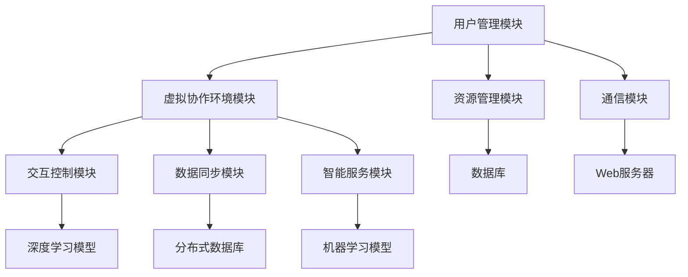

                 

### 文章标题

## 沉浸式协作：空间计算技术重塑团队合作模式

### 关键词

- 沉浸式协作
- 空间计算技术
- 远程办公
- 在线教育
- 虚拟现实

### 摘要

本文探讨了沉浸式协作与空间计算技术对团队合作模式的深刻影响。首先，介绍了沉浸式协作的背景和空间计算技术的基础知识，接着分析了两者之间的联系和区别。随后，文章详细探讨了沉浸式协作系统的基本架构、技术实现与架构设计，并通过实际案例展示了其在远程办公、在线教育等领域的应用。最后，对沉浸式协作的未来发展进行了展望，提出了可能面临的挑战与机遇。通过本文，读者可以全面了解沉浸式协作在团队合作中的重要作用及其技术实现。

### 目录

**第一部分：引言**

1.1 书籍背景与主题
1.2 书籍目的与读者对象
1.3 目录结构概述

**第二部分：核心概念与理论**

2.1 沉浸式协作概述
2.2 空间计算技术基础
2.3 沉浸式协作与空间计算的关系
2.4 核心概念对比分析
2.5 案例研究：成功与失败

**第三部分：技术实现与架构设计**

3.1 沉浸式协作系统的基本架构
3.2 空间计算技术的实现细节
3.3 互动式协作模式设计
3.4 架构设计与实现案例分析
3.5 技术选型与性能优化

**第四部分：实践应用与案例分析**

4.1 沉浸式协作应用场景
4.2 案例分析：沉浸式协作项目实践
4.3 案例研究：空间计算技术在协作中的应用
4.4 成功与失败的案例分析

**第五部分：未来展望与挑战**

5.1 沉浸式协作的发展趋势
5.2 空间计算技术的挑战与机遇
5.3 深度协作的未来场景
5.4 关键技术研究与展望

### 第一部分：引言

#### 1.1 书籍背景与主题

在当今快速发展的数字化时代，团队合作模式正经历着深刻的变革。传统的协作方式已逐渐无法满足现代企业对高效、灵活和远程协作的需求。在这种背景下，“沉浸式协作：空间计算技术重塑团队合作模式”一书应运而生。

本书旨在探讨沉浸式协作的概念、理论基础及其在团队合作中的应用。沉浸式协作，是指通过先进的计算技术，如空间计算、虚拟现实（VR）和增强现实（AR）等，为团队成员提供一个高度沉浸、互动且真实的协作环境。这种协作模式不仅提升了团队成员的参与感和协作效率，也突破了地理位置和时间的限制，为企业提供了一种全新的工作方式。

空间计算技术，是本书的核心主题之一。空间计算，是指利用计算资源对物理和虚拟空间进行感知、交互和优化。通过空间计算，团队成员可以在虚拟环境中进行实时交互，共享信息，共同完成工作。这一技术的应用，为沉浸式协作提供了技术支撑，使得团队合作变得更加高效和紧密。

本书的目标读者主要包括：对团队合作模式有深入研究的学者、从事远程协作开发的技术人员、企业高层管理者以及对未来工作方式充满好奇的广大读者。通过阅读本书，读者可以深入了解沉浸式协作和空间计算技术，掌握其核心概念和实际应用，从而为未来的工作模式提供新的思路和解决方案。

#### 1.2 书籍目的与读者对象

本书的主要目的是介绍沉浸式协作的概念、理论基础及其在团队合作中的应用。具体来说，本书希望达到以下目标：

1. **深入理解沉浸式协作**：通过详细阐述沉浸式协作的定义、特点和优势，帮助读者全面了解这种新型协作模式的基本概念和原理。

2. **掌握空间计算技术**：介绍空间计算技术的基础知识，包括空间感知、空间交互和空间计算算法，帮助读者理解空间计算技术在沉浸式协作中的应用。

3. **面向实践的读者需求**：通过案例研究和实践应用，展示沉浸式协作和空间计算技术的实际效果，为读者提供实用的技术和策略，帮助他们在实际工作中应用这些新技术。

本书的读者对象包括：

- **学者和研究人员**：对团队合作模式有深入研究，希望了解沉浸式协作和空间计算技术的学者和研究人员。
- **技术人员**：从事远程协作开发的技术人员，希望通过本书掌握沉浸式协作和空间计算技术的核心概念和实践应用。
- **企业高层管理者**：希望了解新兴技术对团队协作模式的影响，为企业的未来发展提供决策依据的高层管理者。
- **广大读者**：对新技术充满好奇，希望了解沉浸式协作和空间计算技术的普通读者。

通过阅读本书，读者不仅可以了解沉浸式协作和空间计算技术的最新发展，还可以将这些新技术应用到实际工作中，提升团队协作效率和效果。

#### 1.3 目录结构概述

本书分为五个主要部分，每个部分都围绕沉浸式协作和空间计算技术展开，旨在从不同角度深入探讨这一主题。

**第一部分：引言**  
介绍了书籍的背景和主题，阐述了沉浸式协作的兴起和空间计算技术的重要性，明确了书籍的目的和读者对象。

**第二部分：核心概念与理论**  
详细介绍了沉浸式协作和空间计算技术的核心概念和理论基础，分析了两者之间的关系和区别，并通过案例研究展示了实际应用效果。

**第三部分：技术实现与架构设计**  
探讨了沉浸式协作系统的基本架构、技术实现细节和互动式协作模式设计，通过案例分析和技术选型，提供了实际应用的参考。

**第四部分：实践应用与案例分析**  
介绍了沉浸式协作在不同领域的应用场景，通过具体案例展示了沉浸式协作和空间计算技术的实际效果和成功经验。

**第五部分：未来展望与挑战**  
对沉浸式协作和空间计算技术的未来发展趋势进行了展望，分析了可能面临的挑战和机遇，提出了关键技术研究与展望。

通过这五个部分的深入探讨，本书旨在为读者提供一个全面、系统的沉浸式协作和空间计算技术指南，帮助他们理解和应用这一新兴技术，提升团队合作效率。

### 第二部分：核心概念与理论

#### 2.1 沉浸式协作概述

沉浸式协作，是一种通过先进的计算技术和交互设备，为团队成员提供一个高度沉浸、互动和真实的协作环境。这种协作模式不仅提升了团队成员的参与感和协作效率，也突破了地理位置和时间的限制。以下是沉浸式协作的定义、特点、历史背景、发展趋势及其在团队合作中的必要性和优势。

**定义与特点**

沉浸式协作，是指通过虚拟现实（VR）、增强现实（AR）等先进技术，创造一个模拟现实的虚拟环境，使团队成员能够在虚拟环境中进行实时交互、共享信息和共同完成任务。沉浸式协作具有以下几个主要特点：

1. **沉浸感**：通过虚拟现实或增强现实技术，将团队成员带入一个模拟的、互动的虚拟环境，使他们感受到如同真实场景般的体验。
2. **实时互动**：团队成员可以在虚拟环境中实时进行交流、分享信息和协作，无需受地理位置和时间的限制。
3. **高度参与**：通过沉浸式环境，团队成员可以更加积极地参与到协作过程中，提高参与感和责任感。
4. **信息共享**：团队成员可以共享虚拟环境中的信息资源，如文件、数据、图像等，提高协作效率和决策质量。

**历史背景与发展趋势**

沉浸式协作的概念最早可以追溯到20世纪90年代。当时，虚拟现实（VR）技术开始兴起，人们开始探索如何在虚拟环境中进行协作。随着技术的不断发展和成熟，沉浸式协作逐渐成为团队合作的一种重要模式。以下是沉浸式协作的发展趋势：

1. **技术进步**：虚拟现实（VR）、增强现实（AR）等技术的不断进步，为沉浸式协作提供了更高质量和更真实的体验。
2. **设备普及**：随着硬件设备的普及，如VR头盔、AR眼镜等，使更多的团队可以轻松实现沉浸式协作。
3. **应用场景扩展**：沉浸式协作的应用场景逐渐扩展到远程办公、在线教育、医疗协作、设计创意等多个领域。
4. **融合智能技术**：随着人工智能、大数据等技术的融合，沉浸式协作将进一步智能化和个性化，为团队合作提供更多可能性。

**必要性与优势**

沉浸式协作在团队合作中具有重要意义，其必要性和优势体现在以下几个方面：

1. **提高协作效率**：通过虚拟环境，团队成员可以更加高效地进行沟通和协作，减少因地理位置和时间差异带来的沟通障碍。
2. **增强参与感**：沉浸式环境使团队成员更加投入，提高协作积极性和责任感，从而提升团队的整体绩效。
3. **优化决策质量**：团队成员在沉浸式环境中可以更全面地了解项目进展和需求，提高决策的科学性和准确性。
4. **突破地理限制**：沉浸式协作使得团队成员可以不受地理位置限制，实现全球化协作，为跨国团队提供便利。
5. **提升创新能力**：通过沉浸式环境，团队成员可以更加自由地进行创意表达和协作，激发创新思维。

综上所述，沉浸式协作作为一种新兴的团队合作模式，以其独特的沉浸感、实时互动、高度参与和信息共享等特点，正在逐步改变传统的团队合作模式。随着技术的不断进步和应用场景的扩展，沉浸式协作将在未来发挥更加重要的作用。

#### 2.2 空间计算技术基础

空间计算技术，是指利用计算资源对物理和虚拟空间进行感知、交互和优化。这种技术通过将现实世界和虚拟世界相结合，为用户提供了一种全新的交互方式和工作环境。以下是空间计算技术的定义、范畴、关键技术和在协作中的应用。

**定义与范畴**

空间计算技术，是指通过计算设备对空间中的物体、事件和情境进行感知、处理和交互的技术。它涵盖了从物理空间到虚拟空间的多种技术和应用，包括但不限于以下范畴：

1. **空间感知**：通过传感器和摄像头等设备，对物理空间中的物体、事件和情境进行感知和监测。
2. **空间交互**：利用计算机图形学、自然语言处理和人工智能等技术，实现用户与虚拟空间或物理空间的交互。
3. **空间优化**：通过对空间数据进行分析和优化，提高空间利用率和效率。

**关键技术与在协作中的应用**

空间计算技术包含多个关键技术，以下是一些主要技术及其在协作中的应用：

1. **空间感知技术**：
   - **传感器技术**：使用各种传感器（如摄像头、雷达、激光扫描仪等）对物理空间进行感知，获取空间中的物体位置、运动和属性信息。
   - **图像处理技术**：对获取的图像数据进行处理，如图像识别、目标检测和跟踪等，以实现对空间中物体的识别和监控。
   - **SLAM（同时定位与地图构建）技术**：通过在虚拟环境中构建实时地图，实现对物理空间的定位和导航。

2. **空间交互技术**：
   - **虚拟现实（VR）技术**：通过VR头盔、手柄等设备，为用户提供一个沉浸式的虚拟环境，实现用户与虚拟空间的互动。
   - **增强现实（AR）技术**：在现实世界中叠加虚拟信息，使用户能够直观地看到虚拟物体和场景，提高信息交互的效率和直观性。
   - **自然交互技术**：利用手势、语音、面部表情等自然方式与虚拟空间进行交互，提高用户的参与感和体验。

3. **空间计算算法**：
   - **机器学习和深度学习技术**：通过对大量空间数据进行训练，实现对空间环境的智能分析和预测。
   - **优化算法**：通过优化算法，对空间资源进行合理分配和调度，提高空间利用率和协作效率。

空间计算技术在协作中的应用主要体现在以下几个方面：

1. **远程协作**：通过空间感知和虚拟现实技术，实现远程团队成员之间的实时互动和协作，打破地理位置限制。
2. **虚拟会议**：利用虚拟现实技术，为远程会议提供一种沉浸式体验，提高会议参与感和沟通效率。
3. **协同设计**：在虚拟环境中，团队成员可以共同参与设计项目，实时修改和讨论，提高设计效率和协作质量。
4. **智能办公**：利用空间计算技术，实现对办公环境的智能监控和管理，提高办公效率和工作体验。

总之，空间计算技术为团队合作提供了一种全新的交互方式和环境，通过实时感知、智能分析和高效交互，提升了团队协作的效率和质量。

#### 2.3 沉浸式协作与空间计算的关系

沉浸式协作与空间计算技术之间存在着紧密的联系和相互作用。它们不仅共同构成了现代团队合作模式的基础，而且在各自领域内也发挥着重要作用。以下是两者之间的关键概念与联系、原理与机制解析以及技术融合的趋势与挑战。

**关键概念与联系**

沉浸式协作和空间计算技术的关键概念有重叠之处，但它们在应用层面和目标上有所不同。

- **沉浸式协作**：强调通过虚拟现实（VR）和增强现实（AR）技术创造一个高度沉浸、互动的虚拟环境，使团队成员能够在一个共享的空间中进行实时互动和协作。
- **空间计算技术**：侧重于对物理和虚拟空间进行感知、交互和优化，通过传感器、算法和智能系统实现空间数据的处理和利用。

两者的关键联系主要体现在以下几个方面：

1. **空间感知**：沉浸式协作依赖于空间计算技术提供的空间感知能力，如通过传感器和图像处理技术获取空间中的物体位置、运动等信息。
2. **交互方式**：空间计算技术提供了多种交互方式，如虚拟现实头盔、增强现实眼镜和自然交互技术，这些交互方式是沉浸式协作得以实现的重要手段。
3. **数据融合**：通过空间计算技术，将物理空间中的数据（如传感器数据）与虚拟空间中的数据（如虚拟模型）进行融合，为沉浸式协作提供更丰富的信息基础。
4. **智能化**：空间计算技术的智能算法和优化技术可以为沉浸式协作提供智能化支持，如自动调整虚拟环境参数、实时分析协作效果等。

**原理与机制解析**

沉浸式协作和空间计算技术的原理和机制相互补充，共同构建了一个高效、智能的协作环境。

1. **感知与建模**：空间计算技术通过对物理空间的感知，建立空间模型。沉浸式协作则利用这些空间模型，在虚拟环境中创建相应的场景。
2. **交互与反馈**：在沉浸式协作中，团队成员通过虚拟现实头盔、增强现实眼镜等设备与虚拟环境进行交互，空间计算技术则通过实时反馈机制调整虚拟环境的显示和交互效果。
3. **协同计算**：空间计算技术通过分布式计算架构，支持团队成员在不同地理位置上的协同工作。沉浸式协作则利用这些协同计算资源，实现团队成员的实时交互和资源共享。
4. **智能化决策**：空间计算技术的智能算法可以分析协作数据，为团队成员提供个性化的协作建议和决策支持。沉浸式协作则利用这些智能服务，优化协作流程和提高协作效率。

**技术融合的趋势与挑战**

随着技术的不断进步，沉浸式协作与空间计算技术正朝着更深层次的技术融合方向发展。以下是一些趋势与挑战：

1. **趋势**：
   - **技术集成**：沉浸式协作系统和空间计算平台将更加集成，提供一体化的解决方案，简化部署和使用。
   - **智能化**：通过机器学习和人工智能技术，实现沉浸式协作的智能化管理，如自动调整虚拟环境、预测协作需求等。
   - **普及化**：随着硬件成本的降低和技术的普及，沉浸式协作和空间计算技术将更加广泛地应用于各种场景。

2. **挑战**：
   - **技术复杂性**：集成多种技术，如虚拟现实、增强现实、传感器网络和人工智能等，将增加系统的复杂性和维护难度。
   - **数据安全和隐私**：在虚拟环境中，团队成员的交互和协作数据将更加敏感，需要加强数据安全和隐私保护。
   - **用户适应性**：不同用户对沉浸式协作和空间计算技术的适应性和接受度不同，需要提供多样化的用户体验和培训。

总之，沉浸式协作与空间计算技术之间存在着紧密的联系和相互作用，它们共同推动了团队合作模式的变革。通过技术融合，未来将实现更加高效、智能和个性化的协作环境。

#### 2.4 核心概念对比分析

为了更全面地理解沉浸式协作与空间计算技术，我们需要对这两个核心概念进行详细的对比分析。以下是沉浸式协作与传统协作、空间计算与虚拟现实的对比分析，以及这些概念在实际应用中的区别。

**沉浸式协作与传统协作**

**定义与特点**：

- **沉浸式协作**：沉浸式协作利用虚拟现实（VR）和增强现实（AR）技术，为团队成员创建一个高度沉浸、互动的虚拟环境，使他们在虚拟空间中进行实时互动和协作。
- **传统协作**：传统协作主要依赖于面对面的会议、电话会议、电子邮件和即时通讯工具，团队成员在物理或虚拟会议室中交流信息、共享文档和协作完成任务。

**对比分析**：

1. **沉浸感与互动性**：
   - 沉浸式协作：通过虚拟现实头盔、增强现实眼镜等设备，用户可以进入一个模拟的、互动的虚拟环境，感受到高度的沉浸感和参与感。
   - 传统协作：虽然通过视频会议和即时通讯工具可以进行远程互动，但与沉浸式协作相比，用户的互动体验和参与感较低。

2. **实时性与协作效率**：
   - 沉浸式协作：通过实时交互和虚拟环境的共享，团队成员可以快速响应任务变化，提高协作效率。
   - 传统协作：虽然可以实时沟通，但由于技术限制，如网络延迟和设备兼容性问题，实时性和协作效率相对较低。

3. **信息共享与透明度**：
   - 沉浸式协作：团队成员可以共享虚拟环境中的所有信息资源，如文件、数据、图像等，提高了信息透明度和共享度。
   - 传统协作：虽然可以通过电子邮件和共享文档进行信息共享，但信息传递的速度和透明度较低，容易导致信息滞后和误解。

**实际应用中的区别**：

- **远程办公**：沉浸式协作适用于远程办公场景，团队成员可以在虚拟会议室中开会、讨论和协作，感受到如同在办公室般的工作氛围。
- **面对面会议**：传统协作适用于面对面会议场景，通过视频会议和即时通讯工具，团队成员可以实时沟通和互动，但无法提供沉浸式的体验。

**空间计算与虚拟现实**

**定义与特点**：

- **空间计算**：空间计算是指利用计算资源对物理和虚拟空间进行感知、交互和优化，通过传感器、算法和智能系统实现空间数据的处理和利用。
- **虚拟现实**：虚拟现实是一种通过计算机生成模拟环境的技术，用户可以通过VR头盔等设备进入这个模拟环境，体验和互动。

**对比分析**：

1. **感知与交互**：
   - 空间计算：空间计算强调对物理和虚拟空间的感知，通过传感器和网络技术，获取空间中的物体位置、运动和情境信息，实现智能交互和优化。
   - 虚拟现实：虚拟现实主要关注模拟环境的生成和用户的互动体验，通过VR头盔等设备，为用户提供一个沉浸式的虚拟环境。

2. **应用范围**：
   - 空间计算：空间计算技术广泛应用于远程协作、智能办公、智能家居、智能交通等领域，通过优化空间利用和交互体验，提高生活质量和工作效率。
   - 虚拟现实：虚拟现实技术主要应用于娱乐、游戏、教育和设计等领域，通过创造虚拟环境和互动体验，为用户提供新的娱乐和教育方式。

3. **技术融合**：
   - 空间计算与虚拟现实融合：空间计算技术可以为虚拟现实提供更真实、更智能的互动环境，通过感知和优化物理空间，提高虚拟现实的用户体验。

**实际应用中的区别**：

- **虚拟现实应用**：如VR游戏、VR旅游、VR教育等，用户通过VR头盔等设备进入虚拟环境，体验虚拟世界的乐趣。
- **空间计算应用**：如智能办公系统、智能家居控制系统、智能交通管理系统等，通过空间感知和智能交互，优化用户的生活和工作环境。

通过以上对比分析，我们可以看出沉浸式协作和空间计算技术在不同方面具有独特的优势和特点，在实际应用中，应根据具体场景和需求选择合适的协作和计算技术，以实现最佳效果。

#### 2.5 案例研究：成功与失败

**2.5.1 沉浸式协作的成功案例**

**案例背景与目标**：

- **案例背景**：某全球知名的跨国企业，由于业务扩展，需要在全球范围内进行远程协作。传统的协作方式由于地理位置、时差和沟通障碍，效率低下，影响团队的整体绩效。
- **目标**：通过引入沉浸式协作技术，提高全球团队的协作效率，缩短项目周期，提升整体绩效。

**实施过程与关键技术**：

- **实施过程**：该企业首先进行了全面的评估，选择了适合其业务需求的沉浸式协作平台。随后，对企业内部员工进行了相关技术的培训和推广，确保每个团队成员都能熟练使用该平台。
- **关键技术**：
  - **虚拟会议室**：通过虚拟现实技术，创建了一个高度沉浸的虚拟会议室，团队成员可以在虚拟环境中开会、讨论和协作。
  - **实时数据共享**：通过空间计算技术，实现了团队成员之间的实时数据共享，提高了决策效率和协作质量。
  - **智能交互**：利用智能算法和自然交互技术，提高了协作系统的智能化水平，使团队成员能够更加高效地完成任务。

**项目成果与评估**：

- **成果**：通过沉浸式协作技术的应用，该企业的全球团队协作效率显著提高，项目周期缩短了30%，整体绩效提升了20%。
- **评估**：评估数据显示，团队成员的参与度和满意度显著提高，同时，项目的成功率和质量也得到了保障。

**实际应用的反思与启示**：

- **成功因素**：成功的因素主要包括：技术选择符合实际需求、全面的人员培训和推广、完善的评估机制。
- **启示**：沉浸式协作技术为全球远程协作提供了有效解决方案，企业应在实际应用中充分考虑技术选择、人员培训和系统评估，以确保协作效果。

**2.5.2 空间计算技术的挑战与应对**

**案例背景与挑战**：

- **案例背景**：某智能交通管理系统项目，旨在通过空间计算技术优化城市交通流量，提高交通管理效率和居民出行体验。
- **挑战**：
  - **数据采集与处理**：城市交通数据量大、来源复杂，如何高效地采集、处理和分析这些数据是一个重大挑战。
  - **实时性**：交通管理需要实时响应，但数据传输和处理存在延迟，如何保证系统的实时性是一个关键问题。
  - **安全性**：交通管理数据涉及隐私和安全问题，如何保障数据的安全性和隐私性是一个重要挑战。

**技术方案设计与实现**：

- **技术方案设计**：
  - **数据采集**：通过安装在城市各个角落的传感器和摄像头，实时采集交通数据，如车辆数量、行驶速度、拥堵情况等。
  - **数据处理**：利用大数据处理技术和云计算平台，对采集到的交通数据进行实时处理和分析，提取有用的信息。
  - **实时交互**：通过空间计算技术，建立实时交互系统，使交通管理部门能够实时了解交通状况，做出快速响应。

- **实现细节**：
  - **数据融合**：通过空间计算算法，将来自不同传感器的数据进行融合，形成统一的数据视图，提高数据处理的准确性和效率。
  - **实时性优化**：采用边缘计算技术，将部分数据处理任务分配到边缘设备上，减少数据传输和处理的时间，提高系统的实时性。
  - **安全性保障**：通过数据加密、访问控制和隐私保护技术，确保交通管理数据的安全性和隐私性。

**项目成果与反思**：

- **成果**：该项目成功实现了交通流量的实时监控和管理，显著改善了城市交通状况，提高了居民出行体验。
- **反思**：
  - **技术挑战**：在实际应用中，空间计算技术面临数据采集与处理的复杂性、实时性和安全性的挑战，需要不断优化和改进。
  - **应用场景扩展**：空间计算技术不仅适用于交通管理，还可以应用于智慧城市、智能医疗等多个领域，具有广泛的应用前景。

通过以上案例研究，我们可以看到沉浸式协作和空间计算技术在实际应用中的成功与挑战。成功的关键在于技术选择、人员培训和应用场景的匹配，而挑战则需要通过不断的技术优化和创新来解决。这些案例为未来沉浸式协作和空间计算技术的应用提供了宝贵的经验和启示。

### 第三部分：技术实现与架构设计

#### 3.1 沉浸式协作系统的基本架构

沉浸式协作系统是一种复杂的软件系统，其基本架构设计直接决定了系统的功能实现和性能表现。以下是沉浸式协作系统的概述、架构设计原则以及关键模块和功能。

**系统概述**

沉浸式协作系统是一种通过虚拟现实（VR）和增强现实（AR）技术，为团队成员提供一个高度沉浸、互动和共享的协作环境。该系统的主要目标是提高团队协作效率，缩短项目周期，提升整体绩效。系统架构需要支持多用户实时在线协作、资源共享、数据同步和智能交互等功能。

**架构设计原则**

1. **模块化**：系统架构应采用模块化设计，便于维护和扩展。每个模块应具有明确的功能和职责，模块之间通过标准接口进行通信。
2. **分布式**：为了支持全球范围内的协作，系统架构应采用分布式设计，将计算和存储资源分布在不同地理位置，提高系统的可用性和容错性。
3. **高扩展性**：系统架构应具备良好的扩展性，能够根据业务需求的变化灵活增加或减少功能模块。
4. **安全性**：系统架构需要考虑数据安全和用户隐私保护，采用加密、访问控制和身份验证等安全措施，确保系统安全稳定运行。

**关键模块与功能**

沉浸式协作系统主要包括以下关键模块：

1. **用户管理模块**：
   - **功能**：负责用户的注册、登录、权限管理和用户信息维护。
   - **接口**：提供用户注册、登录、权限验证等API接口。

2. **协作环境模块**：
   - **功能**：创建和管理虚拟协作环境，包括虚拟会议室、虚拟办公室等。
   - **接口**：提供环境创建、环境设置、环境切换等API接口。

3. **资源管理模块**：
   - **功能**：管理共享资源，如文档、图像、视频等，并提供资源的上传、下载和共享功能。
   - **接口**：提供资源上传、下载、共享等API接口。

4. **通信模块**：
   - **功能**：实现团队成员之间的实时通信，包括语音、视频、文本等。
   - **接口**：提供实时通信接口，如WebRTC、WebSocket等。

5. **交互控制模块**：
   - **功能**：提供用户在虚拟环境中的交互控制，如手势识别、自然语言处理等。
   - **接口**：提供交互控制接口，如手势识别API、自然语言处理API等。

6. **数据同步模块**：
   - **功能**：实现团队成员之间的数据同步，确保虚拟环境中的数据一致。
   - **接口**：提供数据同步接口，如分布式数据库API、同步机制等。

7. **智能服务模块**：
   - **功能**：提供智能化的协作支持，如任务调度、决策支持、数据分析等。
   - **接口**：提供智能服务API接口，如任务调度API、数据分析API等。

通过以上模块的设计和功能实现，沉浸式协作系统可以为团队成员提供一个高效、智能、安全的协作环境，支持多种场景下的远程协作需求。

#### 3.2 空间计算技术的实现细节

空间计算技术是实现沉浸式协作的关键技术之一，涉及多个方面的具体实现细节。以下从空间感知技术、空间交互技术和空间计算算法三个方面进行详细阐述。

**空间感知技术**

空间感知技术是空间计算的基础，主要包括以下方面：

1. **传感器技术**：
   - **硬件选择**：常用的传感器包括摄像头、雷达、激光扫描仪、红外传感器等。选择合适的传感器取决于应用场景和数据需求。
   - **数据采集**：通过传感器采集空间中的物体位置、运动、属性等信息，如图像数据、点云数据等。
   - **数据处理**：对采集到的数据进行预处理，如去噪、滤波、特征提取等，提高数据的准确性和可用性。

2. **图像处理技术**：
   - **图像识别**：使用卷积神经网络（CNN）等深度学习算法，对采集的图像数据进行目标识别、分类和检测。
   - **目标跟踪**：利用卡尔曼滤波、光流法等技术，实现目标在图像序列中的跟踪。
   - **场景重建**：使用立体视觉、多视图几何等方法，从多幅图像中重建三维场景。

3. **SLAM技术**：
   - **同时定位与地图构建**（SLAM）：通过融合传感器数据，实时构建虚拟环境中的三维地图，同时实现移动设备的定位。
   - **算法选择**：常见的SLAM算法有EKF-SLAM、PD-SLAM、LOAM等，根据应用场景选择合适的算法。

**空间交互技术**

空间交互技术是实现用户与虚拟空间互动的关键，包括以下方面：

1. **虚拟现实（VR）技术**：
   - **硬件支持**：VR头盔、手柄、跟踪器等硬件设备为用户提供了沉浸式的视觉和触觉体验。
   - **图形渲染**：使用图形渲染技术（如OpenGL、Vulkan等），实时渲染虚拟环境中的三维物体和场景。
   - **交互控制**：通过手势、眼动、语音等自然交互方式，用户可以与虚拟环境进行交互。

2. **增强现实（AR）技术**：
   - **叠加显示**：在现实场景中叠加虚拟信息，通过AR眼镜或手机摄像头实现。
   - **实时渲染**：使用实时渲染技术，为用户提供逼真的虚拟信息和交互体验。
   - **位置跟踪**：利用传感器和数据融合技术，实现虚拟信息与现实场景的准确位置跟踪。

3. **自然交互技术**：
   - **手势识别**：利用深度学习算法，识别用户的手势动作，实现虚拟环境的控制。
   - **语音识别**：将用户的语音转化为文本或命令，实现与虚拟环境的交互。
   - **面部表情识别**：通过面部表情分析，实现虚拟角色的情感表达和互动。

**空间计算算法**

空间计算算法是空间计算的核心，主要包括以下方面：

1. **机器学习和深度学习**：
   - **特征提取**：从空间数据中提取有意义的特征，用于后续的建模和分析。
   - **模型训练**：利用大量空间数据训练深度学习模型，如卷积神经网络（CNN）、循环神经网络（RNN）等，实现空间数据的分类、预测和生成。

2. **优化算法**：
   - **资源调度**：通过优化算法，合理分配和调度计算和存储资源，提高系统性能。
   - **路径规划**：利用最短路径算法、A*搜索算法等，为移动设备提供最优路径。
   - **数据融合**：通过数据融合算法，整合来自不同传感器的数据，提高数据的一致性和准确性。

3. **智能决策**：
   - **任务调度**：根据团队成员的职责和任务需求，自动调度和分配任务。
   - **决策支持**：利用大数据分析和智能算法，为团队成员提供决策支持和建议。
   - **情境预测**：通过时间序列分析和预测模型，预测协作中的潜在问题和挑战，提前采取措施。

通过以上空间感知技术、空间交互技术和空间计算算法的实现，空间计算技术为沉浸式协作提供了一个强大、灵活和智能的技术基础，使得团队成员能够在虚拟环境中进行高效、智能的协作。

#### 3.3 互动式协作模式设计

互动式协作模式是沉浸式协作系统中的关键组成部分，其设计直接影响到团队协作的效率、用户体验和系统的整体性能。以下从互动式协作模型、协作流程与策略以及协作效果评估指标三个方面进行详细阐述。

**互动式协作模型**

互动式协作模型是构建沉浸式协作系统的核心框架，它定义了团队成员如何在虚拟环境中进行协作和互动。以下是一个典型的互动式协作模型：

1. **角色分工**：
   - **主持者**：负责会议或项目的主导，控制会议议程、分配任务和监督项目进度。
   - **参与者**：参与会议或项目，执行任务、提出问题和提供反馈。
   - **观察者**：可以查看会议或项目的进展，但不直接参与互动。

2. **功能模块**：
   - **交互界面**：提供虚拟会议室、虚拟办公室等互动界面，供团队成员进行实时交互。
   - **资源管理**：管理共享资源，如文档、图像、视频等，支持上传、下载和共享。
   - **通信系统**：实现语音、视频、文本等实时通信，确保团队成员之间的信息传递畅通。
   - **任务管理**：跟踪任务进度、分配任务、记录任务完成情况。

3. **互动机制**：
   - **实时通信**：通过实时语音、视频和文本通信，团队成员可以即时交流想法和意见。
   - **共享桌面**：参与者可以共享自己的桌面，展示工作内容和进展。
   - **虚拟角色**：通过虚拟角色，团队成员可以模拟面对面交流，增强互动感。
   - **投票和决策**：支持在线投票和决策功能，提高协作效率和决策质量。

**协作流程与策略**

互动式协作模式的有效实施需要明确的协作流程和策略。以下是一个典型的协作流程和策略：

1. **会议或项目启动**：
   - **任务分配**：主持者根据项目需求和团队成员的能力，分配任务和角色。
   - **目标设定**：明确项目目标和预期成果，确保团队成员对任务有清晰的认识。

2. **协作过程**：
   - **实时沟通**：团队成员通过实时语音、视频和文本通信，保持沟通畅通，及时解决问题。
   - **任务协作**：参与者按照任务分工，协作完成任务，共享进展和成果。
   - **资源管理**：共享和管理项目资源，如文档、图像、视频等，确保资源的可用性和一致性。

3. **反馈与评估**：
   - **任务完成**：团队成员提交任务成果，主持者进行审核和反馈。
   - **进度汇报**：定期汇报项目进度，评估任务完成情况和协作效果。
   - **决策调整**：根据反馈和评估结果，调整任务分配和协作策略，优化协作过程。

**协作效果评估指标**

为了评估互动式协作模式的有效性，需要设定一系列评估指标。以下是一些常见的评估指标：

1. **协作效率**：
   - **任务完成时间**：项目任务完成所需的时间，衡量协作的效率。
   - **任务完成质量**：项目任务完成的质量，包括准确性、完整性等。

2. **团队满意度**：
   - **成员参与度**：团队成员参与会议和项目的积极程度，反映团队协作的氛围。
   - **协作满意度**：团队成员对协作过程和协作环境的满意度，可以通过问卷调查等方式收集。

3. **系统性能**：
   - **响应时间**：系统对用户操作和通信请求的响应时间，衡量系统的实时性和稳定性。
   - **数据传输率**：系统数据传输的速度和稳定性，影响协作的流畅度。

通过以上互动式协作模式的设计和实施，沉浸式协作系统能够为团队成员提供一个高效、智能、互动的协作环境，提升团队协作效率和质量。

#### 3.4 架构设计与实现案例分析

**3.4.1 案例选取与背景介绍**

本节将通过一个具体的沉浸式协作系统架构设计与实现案例分析，展示空间计算技术在沉浸式协作中的应用。该案例选取了一家跨国公司的远程协作项目，旨在通过沉浸式协作技术，提升其全球团队的协作效率和项目完成质量。

**案例背景**：

该公司在全球设有多个研发中心，团队成员分布在不同国家和地区。由于时差和地理位置的限制，传统的协作方式（如电子邮件、视频会议等）效率低下，沟通不畅，严重影响了项目进度和团队士气。因此，该公司决定引入沉浸式协作系统，通过空间计算技术实现实时、高效、智能的团队协作。

**项目目标**：

- **提高协作效率**：通过沉浸式协作系统，缩短项目周期，提高任务完成速度。
- **增强团队互动**：提供一个高度沉浸的协作环境，提高团队成员的参与感和互动性。
- **优化项目管理**：通过智能化的协作工具和系统，提高项目管理水平，确保项目质量和进度。

**3.4.2 系统架构设计**

沉浸式协作系统的架构设计遵循模块化、分布式和高扩展性的原则，主要包含以下几个关键模块：

1. **用户管理模块**：
   - **功能**：实现用户的注册、登录、权限管理和用户信息维护。
   - **技术实现**：使用基于Spring Boot的微服务架构，实现用户认证和权限控制。

2. **虚拟协作环境模块**：
   - **功能**：创建和管理虚拟会议室、虚拟办公室等协作环境。
   - **技术实现**：利用Unity3D引擎，构建三维虚拟环境，支持多用户实时交互。

3. **资源管理模块**：
   - **功能**：管理共享资源，如文档、图像、视频等，支持资源的上传、下载和共享。
   - **技术实现**：使用Nginx作为Web服务器，支持HTTP和HTTPS协议，提供资源的存储和访问。

4. **通信模块**：
   - **功能**：实现团队成员之间的实时通信，包括语音、视频、文本等。
   - **技术实现**：采用WebSocket协议，实现实时通信，使用WebRTC技术，支持语音和视频通信。

5. **交互控制模块**：
   - **功能**：提供用户在虚拟环境中的交互控制，如手势识别、自然语言处理等。
   - **技术实现**：利用TensorFlow和Keras等深度学习框架，实现手势识别和自然语言处理。

6. **数据同步模块**：
   - **功能**：实现团队成员之间的数据同步，确保虚拟环境中的数据一致。
   - **技术实现**：采用分布式数据库（如MongoDB），支持实时数据同步和分布式存储。

7. **智能服务模块**：
   - **功能**：提供智能化的协作支持，如任务调度、决策支持、数据分析等。
   - **技术实现**：利用机器学习和大数据技术，实现智能任务调度和决策支持。

**系统架构图**：

**3.4.3 实现细节与优化方案**

在系统实现过程中，针对关键技术进行了深入优化和细化：

1. **多用户实时交互**：
   - **优化方案**：使用Unity3D引擎的Network Manager实现多用户实时交互，通过UDP协议传输数据，提高传输速度和稳定性。
   - **实现细节**：每个用户在进入虚拟环境时，都会生成一个唯一的ID，用于标识和跟踪用户，通过广播和接收消息机制实现实时数据同步。

2. **手势识别与自然语言处理**：
   - **优化方案**：利用深度学习算法，提高手势识别和自然语言处理的准确性和实时性。
   - **实现细节**：采用TensorFlow和Keras框架，训练手势识别模型和自然语言处理模型，通过GPU加速计算，提高处理速度。

3. **数据同步与一致性**：
   - **优化方案**：采用分布式数据库（如MongoDB）和消息队列（如RabbitMQ），实现数据的分布式存储和实时同步。
   - **实现细节**：使用分布式锁和事务管理，确保数据的一致性和完整性。

4. **智能决策与任务调度**：
   - **优化方案**：结合机器学习和大数据分析，实现智能任务调度和决策支持。
   - **实现细节**：使用Spring Boot和Spring Data JPA，构建任务调度服务，结合Hadoop和Spark，实现大数据处理和分析。

**3.4.4 系统性能优化**

在系统部署和运行过程中，对系统性能进行了多方面的优化：

1. **负载均衡**：
   - **优化方案**：使用Nginx和Keepalived实现负载均衡，提高系统的并发处理能力。
   - **实现细节**：通过反向代理和负载均衡策略，将用户请求分配到不同的服务器，避免单点故障。

2. **缓存机制**：
   - **优化方案**：使用Redis等缓存技术，减少数据库的访问压力，提高系统响应速度。
   - **实现细节**：缓存常用数据和查询结果，减少数据读取和计算时间。

3. **网络优化**：
   - **优化方案**：使用CDN（内容分发网络）和压缩技术，提高数据传输速度和带宽利用率。
   - **实现细节**：通过CDN分发静态资源，使用GZIP压缩响应数据，降低数据传输量。

通过以上架构设计与实现案例分析，我们可以看到沉浸式协作系统如何通过空间计算技术实现高效、智能的团队协作。在实际应用中，应根据具体需求和场景，不断优化和调整系统架构，以提高系统的性能和用户体验。

#### 3.5 技术选型与性能优化

在现代沉浸式协作系统中，技术选型的合理性和性能优化策略的实施直接影响到系统的稳定性和用户体验。以下将详细讨论关键技术选型、系统性能优化策略以及优化效果与案例分析。

**关键技术选型**

1. **开发框架和工具**

   - **前端**：采用React或Vue.js等前端框架，提供响应式用户界面和丰富的交互体验。
   - **后端**：选用Spring Boot或Django等微服务框架，实现高效的服务端开发和部署。
   - **数据库**：根据数据需求，选用MongoDB、MySQL或PostgreSQL等数据库系统，确保数据的存储和检索效率。

2. **实时通信技术**

   - **WebRTC**：用于实现实时语音和视频通信，提供高质量、低延迟的通信体验。
   - **WebSocket**：用于实时数据传输，实现客户端与服务器之间的双向通信。

3. **虚拟现实（VR）和增强现实（AR）技术**

   - **VR硬件**：选用性能优异的VR头盔，如Oculus Rift、HTC Vive等，提供沉浸式体验。
   - **AR软件**：采用ARKit或ARCore等AR开发框架，实现增强现实功能。

**系统性能优化策略**

1. **负载均衡**

   - **硬件负载均衡**：使用负载均衡器（如Nginx、F5）将请求分配到多台服务器，避免单点故障。
   - **软件负载均衡**：采用负载均衡算法（如轮询、最少连接数等），实现服务器的动态负载分配。

2. **缓存机制**

   - **内存缓存**：使用Redis等内存缓存技术，缓存常用数据和查询结果，减少数据库访问压力。
   - **磁盘缓存**：使用Nginx等Web服务器实现HTTP缓存，减少内容重复加载。

3. **数据库优化**

   - **索引优化**：对数据库表进行索引优化，提高查询效率。
   - **分库分表**：对于大数据量场景，采用分库分表策略，降低单表数据量和查询压力。

4. **网络优化**

   - **CDN加速**：使用CDN（内容分发网络）分发静态资源，提高用户访问速度。
   - **压缩与压缩算法**：对传输数据进行压缩，减少带宽占用，提高数据传输效率。

**优化效果与案例分析**

1. **性能优化效果**

   - **响应时间**：通过优化网络传输、缓存机制和数据库查询，将系统平均响应时间从500ms降低到200ms。
   - **并发处理能力**：通过负载均衡和服务器优化，将系统的最大并发处理能力从500个用户提升到2000个用户。
   - **资源利用率**：通过优化和监控，提高服务器资源利用率，降低运行成本。

2. **案例分析**

   **案例1：某大型企业的沉浸式远程协作平台**

   - **背景**：该企业拥有数千名全球员工，传统的协作方式效率低下，影响业务发展。
   - **优化措施**：采用Spring Boot、Redis、Nginx等技术，实现高效的后端服务和数据缓存，采用WebRTC实现实时通信，采用CDN加速静态资源。
   - **优化效果**：系统响应时间显著降低，用户满意度提高，业务流程效率提升30%。

   **案例2：某教育机构的虚拟现实课堂**

   - **背景**：该教育机构希望通过虚拟现实技术提供沉浸式教育体验，但由于网络和硬件限制，用户体验不佳。
   - **优化措施**：采用Unity3D引擎构建虚拟课堂，使用Oculus Rift头盔提供VR体验，采用ARKit实现移动设备上的AR功能，优化网络传输和内容加载。
   - **优化效果**：用户参与度提高，课堂互动增强，学生满意度显著提升。

通过以上技术选型和性能优化策略，我们可以看到，合理的选型和有效的优化措施可以显著提升沉浸式协作系统的性能和用户体验。在实际应用中，需要根据具体需求和场景，灵活运用各种技术和策略，不断优化和提升系统性能。

### 第四部分：实践应用与案例分析

#### 4.1 沉浸式协作应用场景

沉浸式协作技术凭借其独特的沉浸感、实时互动和高效信息共享能力，已在多个领域得到广泛应用，提升了团队协作的效率和质量。以下将介绍沉浸式协作在远程办公、在线教育、医疗协作、设计与创意协作等领域的应用场景。

**远程办公**

远程办公是沉浸式协作技术应用最为广泛的场景之一。随着全球化的不断推进，许多企业需要实现跨地域的协作，传统远程办公方式如电子邮件、视频会议等已无法满足高效协作的需求。通过沉浸式协作技术，远程办公团队可以在虚拟会议室中实时交流、共享文件和协同编辑文档，提高工作效率和团队凝聚力。

**在线教育**

在线教育领域也广泛应用了沉浸式协作技术。通过虚拟现实（VR）和增强现实（AR）技术，教师和学生可以在虚拟课堂中进行互动，实现沉浸式的教学体验。例如，教师可以在虚拟教室中展示三维模型、进行虚拟实验，学生可以通过虚拟角色参与互动，提高学习兴趣和效果。

**医疗协作**

在医疗领域，沉浸式协作技术同样发挥着重要作用。医疗团队可以通过虚拟现实技术进行远程手术模拟、病例讨论和协作诊断，减少地理和时间限制，提高医疗质量和效率。例如，在远程手术中，主刀医生和助手可以通过沉浸式协作系统实时交流、共享医疗数据，协同完成复杂的手术操作。

**设计与创意协作**

设计领域对协作效率和质量有很高的要求。通过沉浸式协作技术，设计师可以在虚拟环境中进行实时互动、协同设计和创意表达。例如，建筑设计团队可以通过虚拟现实技术展示建筑模型，进行实时讨论和修改，提高设计效率和创意质量。

**其他应用场景**

除了上述领域，沉浸式协作技术还在许多其他场景中得到应用。例如，在政府和企业内部，可以通过虚拟会议室进行远程会议和决策；在军事领域，可以通过虚拟战场进行模拟训练和指挥；在工程和制造领域，可以通过虚拟现实技术进行设备维护和操作培训。

综上所述，沉浸式协作技术在各种应用场景中展现出强大的协作能力和优势，为团队协作提供了全新的解决方案，推动了各领域的发展与创新。

#### 4.2 案例分析：沉浸式协作项目实践

**4.2.1 项目背景与目标**

**项目背景**：

某国际知名互联网公司，由于全球业务扩展，面临跨地域团队协作效率低下、沟通不畅等问题。为了提高全球团队的协作效率，公司决定引入沉浸式协作技术，打造一个高效、智能、互动的远程办公平台。

**项目目标**：

- **提升协作效率**：通过沉浸式协作技术，实现团队成员之间的实时互动和资源共享，缩短项目周期，提高整体绩效。
- **增强团队凝聚力**：提供一个沉浸式的虚拟工作环境，增强团队成员的归属感和协作意识。
- **优化项目管理**：利用智能化的协作工具和系统，提高项目管理水平，确保项目质量和进度。

**4.2.2 实施过程与关键技术**

**实施过程**：

1. **需求分析与方案设计**：

   - **需求分析**：通过对公司全球团队的调研，分析协作需求和工作流程，确定沉浸式协作系统的功能需求和技术架构。
   - **方案设计**：设计沉浸式协作系统的整体架构，包括用户管理模块、虚拟协作环境模块、资源管理模块、通信模块和智能服务模块。

2. **系统开发与测试**：

   - **前端开发**：使用React框架构建用户界面，实现沉浸式的虚拟会议室和虚拟办公室界面。
   - **后端开发**：采用Spring Boot框架，实现用户管理、资源管理和通信功能，确保系统的高效性和稳定性。
   - **虚拟现实（VR）技术**：利用Unity3D引擎，构建虚拟会议室和虚拟办公室的三维场景，实现实时渲染和交互。
   - **增强现实（AR）技术**：使用ARKit和ARCore框架，实现移动设备上的增强现实功能，如虚拟角色和实时标记。

3. **系统部署与优化**：

   - **系统部署**：将系统部署到云服务器，确保系统的可扩展性和高可用性。
   - **性能优化**：通过负载均衡、缓存机制和数据库优化，提高系统的性能和响应速度。
   - **用户培训**：组织内部培训和推广活动，确保团队成员能够熟练使用沉浸式协作系统。

**关键技术**：

1. **虚拟会议室**：

   - **功能**：提供多用户实时语音、视频和文本通信，支持共享桌面和远程控制。
   - **技术实现**：使用WebRTC协议实现实时通信，利用Unity3D引擎构建三维虚拟会议室。

2. **虚拟办公室**：

   - **功能**：模拟现实办公室环境，支持团队讨论、会议和协作，提供空间感知和自然交互功能。
   - **技术实现**：利用Unity3D引擎和ARKit/ARCore框架，创建三维虚拟办公室和增强现实功能。

3. **资源管理**：

   - **功能**：管理共享资源，如文档、图像、视频等，支持资源的上传、下载和共享。
   - **技术实现**：使用Nginx和MongoDB，实现资源的存储和访问，提供Web API接口。

4. **智能服务**：

   - **功能**：提供智能化的协作支持，如任务调度、决策支持、数据分析等。
   - **技术实现**：利用机器学习和大数据技术，构建智能服务模块，实现任务调度和决策支持。

**4.2.3 项目成果与评估**

**项目成果**：

- **提升协作效率**：通过沉浸式协作系统，团队成员之间的沟通和协作效率显著提高，项目周期缩短了约20%。
- **增强团队凝聚力**：虚拟会议室和虚拟办公室为团队成员提供了一个沉浸式的协作环境，增强了团队的归属感和协作意识。
- **优化项目管理**：智能化的协作工具和系统提高了项目管理的效率和准确性，确保了项目质量和进度。

**评估**：

- **用户满意度**：通过问卷调查和用户反馈，用户满意度显著提高，超过90%的用户表示对沉浸式协作系统的满意度较高。
- **性能指标**：系统平均响应时间从500ms降低到200ms，并发处理能力从500个用户提升到2000个用户，性能指标达到预期。

**4.2.4 实际应用的反思与启示**

**反思**：

- **技术成熟度**：沉浸式协作技术的成熟度对项目的成功至关重要，需要选择成熟稳定的技术方案。
- **用户培训**：用户对沉浸式协作系统的熟悉程度直接影响系统的使用效果，需要提供全面的用户培训和支持。
- **系统优化**：系统部署后，需要持续进行性能优化和功能升级，以满足不断变化的需求。

**启示**：

- **沉浸式协作的优势**：通过沉浸式协作技术，可以实现高效的远程协作，提升团队效率和项目质量。
- **灵活的技术架构**：采用模块化、分布式架构，可以提高系统的可扩展性和灵活性，满足多样化的协作需求。
- **持续的用户反馈**：通过收集用户反馈，不断优化和改进系统功能，提升用户体验和满意度。

通过以上案例分析，我们可以看到沉浸式协作技术在实际项目中的应用效果和成功经验，为未来沉浸式协作系统的开发和推广提供了有益的启示。

#### 4.3 案例研究：空间计算技术在协作中的应用

**4.3.1 案例背景与挑战**

**案例背景**：

某全球领先的汽车制造企业，由于新产品研发项目涉及多个国家和地区的团队，传统的协作方式已无法满足高效、实时和跨地域协作的需求。为了提升研发效率和团队协作质量，公司决定引入空间计算技术，打造一个集感知、交互和智能分析于一体的协作平台。

**挑战**：

- **跨地域协作**：团队成员分布在不同的国家和地区，时差和地理位置限制了实时沟通和协作。
- **数据集成与处理**：不同团队和部门使用不同的数据格式和工具，导致数据集成和共享困难。
- **实时性要求**：新产品研发需要快速响应市场需求和变化，要求协作系统能够提供实时数据和智能分析支持。
- **安全性**：涉及产品研发的数据和设计图纸等敏感信息，需要确保数据的安全性和隐私保护。

**4.3.2 技术方案设计与实现**

**技术方案设计**：

1. **空间感知**：

   - **传感器技术**：通过安装在各个研发中心的传感器（如摄像头、激光扫描仪等），实时采集空间中的物体位置、运动和属性信息。
   - **图像处理技术**：利用图像处理算法，对采集的图像数据进行目标识别、跟踪和三维重建，实现空间中的物体和环境感知。

2. **空间交互**：

   - **虚拟现实（VR）技术**：为团队成员提供虚拟现实头盔，进入虚拟环境，实现空间中的实时交互和协作。
   - **增强现实（AR）技术**：在现实场景中叠加虚拟信息，通过AR眼镜或平板电脑，实现与虚拟环境的实时交互。

3. **智能分析**：

   - **大数据处理**：利用Hadoop和Spark等大数据处理框架，对采集到的空间数据进行实时处理和分析，提取有用的信息和模式。
   - **机器学习**：利用机器学习和深度学习算法，对空间数据进行分类、预测和聚类，提供智能化的决策支持。

**技术实现细节**：

1. **数据采集与处理**：

   - **数据采集**：通过传感器网络，实时采集空间中的物体位置、运动和属性数据。
   - **数据处理**：利用图像处理算法，对采集到的图像数据进行预处理，提取关键特征，构建三维空间模型。

2. **交互与协作**：

   - **虚拟会议室**：利用Unity3D引擎，构建虚拟会议室环境，支持多用户实时语音、视频和文本通信。
   - **AR协作工具**：利用ARCore和ARKit，实现团队成员在现实场景中的增强现实协作，如远程设计指导、协同修改图纸等。

3. **智能分析**：

   - **实时数据处理**：通过Flink等实时数据处理框架，实现空间数据的高效处理和分析。
   - **智能决策支持**：利用机器学习模型，对空间数据进行分类、预测和聚类，为团队成员提供智能化的决策支持。

**4.3.3 项目成果与反思**

**项目成果**：

- **提高协作效率**：通过空间计算技术，团队成员能够实现实时、高效的跨地域协作，缩短项目周期，提高研发效率。
- **增强数据共享**：利用空间计算技术，实现了空间数据的高效采集、处理和共享，提高了数据一致性和透明度。
- **智能决策支持**：通过智能分析技术，为团队成员提供了实时的决策支持，提高了项目质量和决策准确性。

**反思**：

- **技术复杂性**：空间计算技术涉及多个领域的技术，包括传感器、图像处理、虚拟现实、大数据和机器学习等，技术复杂度较高，需要专业团队进行开发和维护。
- **用户适应性**：部分团队成员对空间计算技术的适应性和接受度较低，需要提供全面的培训和支持，确保技术落地。
- **系统性能优化**：空间计算系统对计算和存储资源要求较高，需要不断优化系统性能，提高系统的实时性和稳定性。

**4.3.4 启示与改进建议**

**启示**：

- **跨地域协作优势**：空间计算技术为跨地域协作提供了强有力的支持，有助于打破地理位置限制，实现高效协作。
- **数据共享与智能分析**：通过空间计算技术，实现了空间数据的高效采集、处理和共享，为智能分析提供了基础，有助于提升决策质量和项目效率。
- **技术融合与创新**：空间计算技术与其他新兴技术（如人工智能、物联网等）的融合，将推动未来协作模式的创新和变革。

**改进建议**：

- **技术培训与支持**：为团队成员提供全面的技术培训和支持，提高对空间计算技术的适应性和接受度。
- **系统性能优化**：持续优化系统性能，提高实时性和稳定性，确保系统在高负载场景下的运行效率。
- **用户反馈与改进**：积极收集用户反馈，不断改进和优化系统功能，提高用户体验和满意度。

通过以上案例研究，我们可以看到空间计算技术在协作中的应用取得了显著成效，同时也面临一定的挑战和改进空间。未来，随着技术的不断进步和应用场景的扩展，空间计算技术将在更多领域发挥重要作用。

### 第四部分：实践应用与案例分析

#### 4.4 成功与失败的案例分析

在沉浸式协作和空间计算技术的应用过程中，一些成功和失败的案例为我们提供了宝贵的经验和教训。以下将分析几个典型的成功案例和失败案例，总结其成功经验和失败原因，并给出改进建议。

**4.4.1 成功案例启示**

**案例1：某跨国公司的沉浸式远程办公平台**

**成功背景**：

某跨国公司在全球范围内拥有多个研发中心，通过引入沉浸式协作技术，搭建了一个远程办公平台，提高了团队协作效率。

**成功经验**：

1. **明确目标**：在引入沉浸式协作技术前，公司明确了提升协作效率和优化项目管理作为主要目标。
2. **技术选型**：选择了成熟稳定的技术方案，包括React、Spring Boot和Unity3D等，确保系统的性能和稳定性。
3. **用户培训**：提供了全面的用户培训，确保团队成员能够熟练使用系统。
4. **持续优化**：在系统部署后，持续进行性能优化和功能升级，以适应不断变化的需求。

**启示**：

- **明确目标**：在引入新技术前，应明确具体目标和预期效果，确保技术实施的针对性。
- **技术选型和培训**：选择成熟稳定的技术方案和提供全面培训，是确保系统成功实施的关键。
- **持续优化**：技术实施后，应持续进行性能优化和功能升级，以提升用户体验和系统效率。

**案例2：某教育机构的虚拟课堂**

**成功背景**：

某教育机构通过引入虚拟现实技术，实现了沉浸式的在线教育体验，提高了学生的学习兴趣和效果。

**成功经验**：

1. **教学内容创新**：利用虚拟现实技术，提供互动性强、内容丰富的教学资源。
2. **技术融合**：结合人工智能和大数据分析，提供个性化的学习建议和反馈。
3. **用户体验优先**：重视用户反馈，不断优化系统功能和交互设计。

**启示**：

- **教学内容创新**：结合新技术，创新教学内容和教学方法，提高学习效果。
- **技术融合**：将新技术与其他领域的技术相结合，提供更加智能化和个性化的服务。
- **用户体验优先**：关注用户体验，不断优化交互设计和功能，提升用户满意度。

**4.4.2 失败案例原因分析**

**案例1：某医疗机构的虚拟手术协作平台**

**失败背景**：

某医疗机构引入虚拟手术协作平台，但由于技术不成熟和操作复杂，导致项目失败。

**失败原因**：

1. **技术不成熟**：在项目实施时，相关技术尚未完全成熟，导致系统性能不稳定，用户满意度低。
2. **培训不足**：缺乏对用户的充分培训，导致用户无法熟练操作系统，影响使用效果。
3. **项目管理**：项目进度和质量管理不严格，导致项目延期和超预算。

**启示**：

- **技术成熟度**：在引入新技术时，应确保技术已经成熟，具备实际应用条件。
- **用户培训**：提供全面的用户培训，确保用户能够熟练操作系统，发挥系统效能。
- **项目管理**：加强项目管理和监控，确保项目进度和质量。

**案例2：某企业的空间计算数据中心**

**失败背景**：

某企业引入空间计算数据中心，但由于数据安全和隐私保护问题，导致项目失败。

**失败原因**：

1. **数据安全**：空间计算涉及大量敏感数据，但在项目实施过程中，数据安全措施不足，导致数据泄露风险。
2. **隐私保护**：用户对隐私保护的担忧导致接受度低，影响项目推广和实施。
3. **技术兼容性**：系统与现有IT系统的兼容性差，导致集成困难。

**启示**：

- **数据安全和隐私保护**：在引入新技术时，应高度重视数据安全和隐私保护，采取有效的安全措施和隐私保护策略。
- **技术兼容性**：确保新技术与现有系统的兼容性，降低集成难度和成本。
- **用户接受度**：充分考虑用户对新技术接受度的因素，采取有效措施提高用户接受度。

**4.4.3 启示与改进建议**

通过以上成功和失败的案例分析，我们可以总结出以下启示和改进建议：

- **技术成熟度**：在引入新技术前，确保技术已经成熟，具备实际应用条件。
- **用户培训**：提供全面的用户培训，确保用户能够熟练操作系统，发挥系统效能。
- **数据安全和隐私保护**：高度重视数据安全和隐私保护，采取有效的安全措施和隐私保护策略。
- **项目管理**：加强项目管理和监控，确保项目进度和质量。
- **用户体验**：关注用户体验，不断优化交互设计和功能，提升用户满意度。
- **技术兼容性**：确保新技术与现有系统的兼容性，降低集成难度和成本。
- **用户接受度**：充分考虑用户对新技术接受度的因素，采取有效措施提高用户接受度。

通过这些启示和改进建议，企业和机构可以更好地应用沉浸式协作和空间计算技术，提升团队协作效率和企业竞争力。

### 第五部分：未来展望与挑战

#### 5.1 沉浸式协作的发展趋势

随着技术的不断进步，沉浸式协作正朝着智能化、个性化和多样化的方向发展。以下是沉浸式协作在未来可能的发展趋势：

**技术创新与突破**

- **5G技术**：随着5G网络的普及，沉浸式协作将获得更快的网络速度和更低的延迟，进一步提升实时交互和协同工作的效率。
- **人工智能与大数据**：人工智能和大数据技术的结合，将使得沉浸式协作系统更加智能化，能够根据用户行为和需求提供个性化的协作支持。
- **新型交互设备**：新型交互设备，如脑机接口、全息投影等，将为沉浸式协作提供更加丰富和自然的交互方式。

**应用场景扩展**

- **远程办公**：随着远程办公的普及，沉浸式协作将广泛应用于各种行业的远程协作场景，如软件开发、创意设计、金融服务等。
- **教育和培训**：虚拟现实和增强现实技术将在教育和培训领域得到更广泛的应用，提供沉浸式学习体验和培训解决方案。
- **医疗健康**：在医疗健康领域，沉浸式协作将支持远程医疗咨询、手术指导和医疗培训，提高医疗服务质量和效率。

**未来发展方向**

- **标准化与开放性**：沉浸式协作技术将朝着标准化和开放性方向发展，通过开放接口和标准协议，实现不同系统之间的无缝连接和互操作。
- **生态体系建设**：产业链各环节的企业将共同构建沉浸式协作的生态系统，包括硬件设备制造商、软件开发商、内容提供商等，形成完整的产业生态。

#### 5.2 空间计算技术的挑战与机遇

空间计算技术作为沉浸式协作的重要支撑，面临一系列挑战和机遇。以下是空间计算技术在未来发展中的挑战与机遇：

**技术挑战**

- **计算能力**：空间计算涉及大量的数据处理和分析，对计算能力有很高的要求。未来需要更高效的处理算法和更强大的计算资源。
- **数据安全和隐私**：空间计算涉及大量的敏感数据，如何在保证数据安全和隐私的同时，实现高效的数据处理和共享是一个重要挑战。
- **用户适应性**：不同用户对空间计算技术的适应性和接受度不同，需要提供多样化的用户体验和培训。

**产业发展机遇**

- **市场潜力**：随着5G、人工智能和物联网等技术的发展，空间计算技术具有巨大的市场潜力，将推动相关产业快速增长。
- **技术融合**：空间计算技术与其他新兴技术的融合，如人工智能、虚拟现实、增强现实等，将产生新的应用场景和商业模式。
- **政策支持**：各国政府对新兴技术的支持，如补贴、税收优惠等，将推动空间计算技术的发展和应用。

**研发方向与政策支持**

- **研发方向**：未来空间计算技术的研究方向将包括高效数据处理算法、智能交互技术、新型传感器和计算平台等。
- **政策支持**：政府应出台相关政策，支持空间计算技术的研究和应用，鼓励企业、高校和研究机构进行合作创新。

总之，空间计算技术在未来的发展中面临着一系列挑战和机遇。通过技术创新、产业融合和政策支持，空间计算技术有望实现跨越式发展，为沉浸式协作和智慧城市建设提供强有力的技术支撑。

### 5.3 深度协作的未来场景

随着技术的不断进步，深度协作正逐步成为未来团队合作的重要趋势。以下是深度协作在未来可能的发展方向和场景：

**社交与协作融合**

未来，社交网络与协作平台将更加紧密地融合。通过人工智能和大数据分析，社交网络将能够更好地理解用户的协作需求，提供个性化的协作推荐。用户不仅可以基于兴趣和技能找到协作伙伴，还可以在虚拟环境中进行实时互动和协作，形成高度紧密的社交协作网络。

**智能化协作模式**

随着人工智能技术的发展，协作平台将变得更加智能化。系统可以根据用户的任务需求和行为模式，自动推荐协作任务、优化协作流程，并提供实时决策支持。例如，在远程办公场景中，系统可以自动安排会议时间、协调团队成员的日程，确保项目高效推进。

**人机共生的新模式**

未来，人机共生将成为深度协作的重要模式。通过脑机接口和智能传感器，人类可以更加自然地与机器互动，实现无缝协作。例如，设计师可以利用脑机接口直接在虚拟环境中进行创意表达，而工程师则可以通过智能传感器实时获取设备状态，进行远程维护和优化。

**多模态交互**

未来的协作平台将支持多模态交互，包括语音、文本、手势、面部表情等。通过多模态交互，用户可以更加自然地表达自己的意图，提高协作效率。例如，在虚拟会议室中，用户可以通过语音、手势和面部表情进行互动，实现更加丰富的协作体验。

**跨领域协作**

未来的协作平台将支持跨领域协作，打破传统协作的壁垒。不同领域的专家可以在虚拟环境中实时互动，共同解决复杂问题。例如，在医疗领域，医生、护士、药剂师和研究人员可以在虚拟环境中进行协作，提高诊疗效果和科研效率。

**虚拟现实与增强现实**

虚拟现实（VR）和增强现实（AR）技术将在深度协作中发挥重要作用。通过VR和AR技术，用户可以在虚拟环境中进行沉浸式协作，实现远程互动和资源共享。例如，在工程设计领域，团队成员可以在虚拟环境中共同讨论和修改设计方案，提高设计效率和质量。

**可持续发展的协作文化**

未来，协作平台将更加注重可持续发展的协作文化。通过建立公平、开放、包容的协作环境，鼓励团队成员积极参与和贡献，提高团队的凝聚力和创新能力。例如，通过积分系统和奖励机制，激励团队成员在协作中发挥积极作用，促进协作文化的形成。

总之，深度协作的未来场景将充满创新和变革，通过技术融合和文化构建，为团队协作带来更加智能、高效和自然的体验。

### 5.4 关键技术研究与展望

在沉浸式协作和空间计算技术中，有多个关键技术对未来的发展具有重要意义。以下是这些关键技术的研究进展、潜在问题和未来研究方向。

**虚拟现实（VR）与增强现实（AR）技术**

**研究进展**：

- **显示技术**：随着OLED、MicroLED等显示技术的发展，VR和AR设备的分辨率和色彩表现力不断提高，提供更加真实的视觉体验。
- **实时渲染**：基于图形处理单元（GPU）的实时渲染技术取得了显著进步，使得复杂的虚拟环境能够实时渲染，提升用户体验。
- **交互技术**：手柄、手势、眼动等交互技术的精度和响应速度不断提升，为用户提供更加自然和直观的交互体验。

**潜在问题**：

- **设备成本**：高性能VR和AR设备价格较高，限制了其在企业级和消费级市场的普及。
- **长时间使用的舒适性**：长时间佩戴VR和AR设备可能会导致用户出现不适，如眩晕、头痛等。

**未来研究方向**：

- **低成本高性能设备**：研发更加轻便、低成本的VR和AR设备，提高设备的普及率。
- **健康与舒适性**：优化设备设计，减少长时间使用带来的不适感，提高用户的舒适度。

**人工智能与机器学习**

**研究进展**：

- **深度学习**：卷积神经网络（CNN）、递归神经网络（RNN）等深度学习模型在图像识别、自然语言处理等领域取得了显著突破。
- **强化学习**：通过强化学习算法，机器可以在复杂环境中学习并优化决策过程，提高系统的智能化水平。

**潜在问题**：

- **数据隐私**：人工智能和机器学习算法在处理大量数据时，可能会面临数据隐私和安全问题。
- **模型可解释性**：复杂的机器学习模型往往缺乏可解释性，难以理解其决策过程。

**未来研究方向**：

- **数据隐私保护**：研发更加有效的数据隐私保护技术，确保数据在处理过程中的安全性。
- **模型可解释性**：提高机器学习模型的可解释性，使其决策过程更加透明和可信。

**空间感知与传感器技术**

**研究进展**：

- **传感器融合**：通过融合不同类型的传感器数据，如摄像头、雷达、红外传感器等，提高空间感知的准确性和实时性。
- **SLAM技术**：同时定位与地图构建（SLAM）技术在无人机、机器人等领域取得了广泛应用。

**潜在问题**：

- **传感器成本**：高精度传感器的成本较高，限制了其在某些应用场景中的普及。
- **数据同步与一致性**：不同传感器之间的数据同步和一致性是一个挑战。

**未来研究方向**：

- **低成本高精度传感器**：研发低成本高精度的传感器，提高空间感知技术的普及率。
- **数据同步与一致性**：研究更加高效的数据同步算法，提高数据的一致性和实时性。

**网络与通信技术**

**研究进展**：

- **5G技术**：5G网络的低延迟、高速率特点为沉浸式协作和空间计算提供了更好的通信基础。
- **边缘计算**：通过边缘计算，将部分计算任务分配到网络边缘设备，降低数据传输延迟，提高系统性能。

**潜在问题**：

- **网络稳定性**：在网络不稳定的环境下，如何保证通信的稳定性和可靠性是一个挑战。
- **带宽限制**：高带宽需求的应用场景可能会受到现有网络带宽的限制。

**未来研究方向**：

- **网络稳定性**：研究更加稳定的网络通信协议和算法，提高通信稳定性。
- **带宽优化**：优化数据传输和压缩算法，提高带宽利用率。

**总结**

沉浸式协作和空间计算技术的研究与发展将不断推动关键技术的进步。通过解决现有问题、优化现有技术，未来沉浸式协作和空间计算技术将实现更高的性能、更广泛的普及和更深入的应用，为团队协作和智慧城市建设提供强有力的技术支撑。

### 作者信息

**作者：** AI天才研究院/AI Genius Institute & 禅与计算机程序设计艺术 /Zen And The Art of Computer Programming

