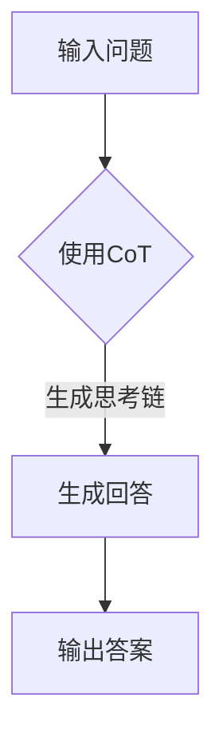
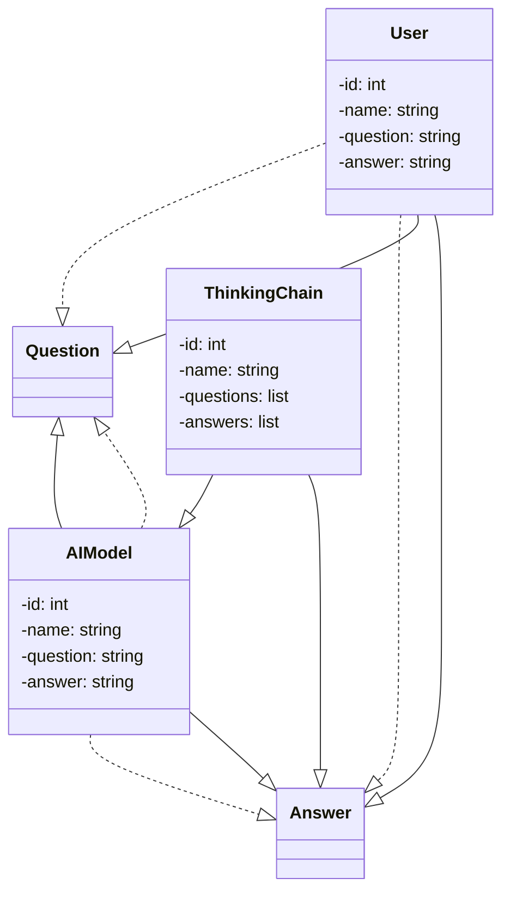
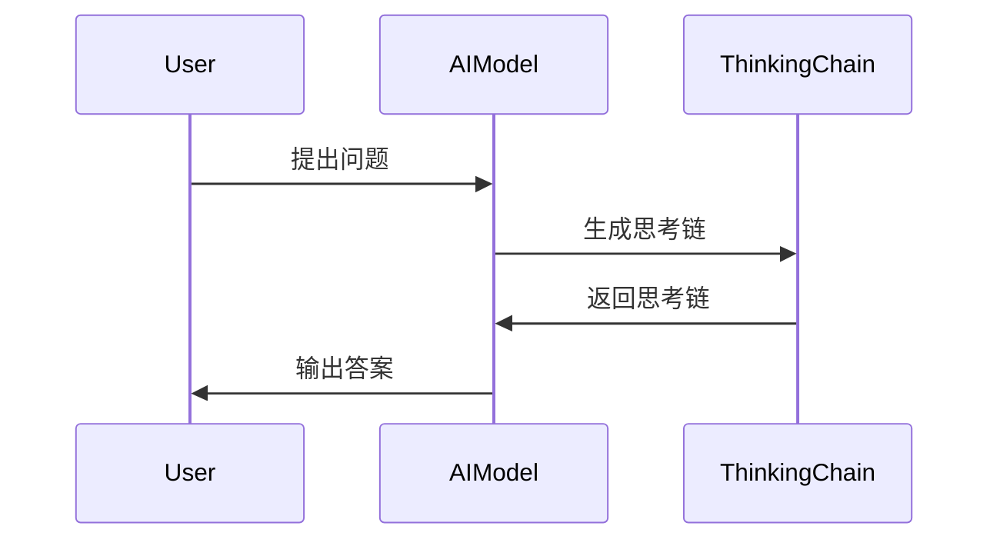
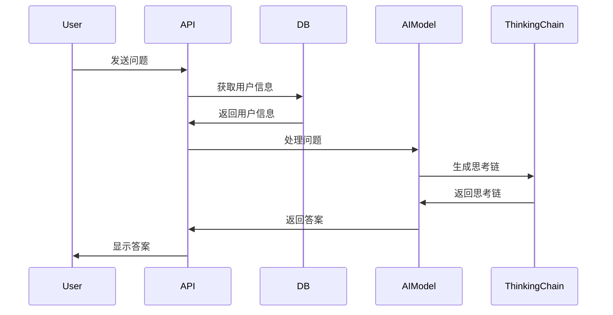

                 

### 1. 背景介绍

#### 问题背景

随着人工智能技术的快速发展，AI大模型在各个领域得到了广泛应用。从自然语言处理到计算机视觉，从推荐系统到游戏生成，这些大模型展现出了令人惊叹的能力。然而，尽管这些模型在处理一些特定任务上取得了显著成效，但在解决复杂问题时的表现却并不理想。这主要因为大模型虽然参数量巨大，但缺乏对问题本质的深入理解，导致其在进行推理和决策时的表现不够出色。

为了克服这一挑战，研究人员提出了一种名为Chain-of-Thought Prompting（CoT）的技术。Chain-of-Thought Prompting旨在通过引导用户思考问题，从而增强AI模型在复杂问题上的推理能力。这种方法的核心思想是，通过构建一条逻辑清晰的思考链，使模型能够逐步推理出问题的答案，而不是仅仅依赖于概率性的预测。

#### 问题解决

Chain-of-Thought Prompting技术的出现，为解决AI大模型在复杂问题上的推理难题提供了新的思路。通过引导模型进行有意识的思考，可以使其在处理复杂任务时表现得更加接近人类。本书旨在深入探讨Chain-of-Thought Prompting在AI中的应用，帮助读者全面了解这一技术的原理、实现方法以及在实际项目中的应用。

#### 边界与外延

Chain-of-Thought Prompting主要应用于需要深度推理和逻辑判断的场景，如数学问题解答、逻辑推理、编程问题解决等。同时，它也涉及到了自然语言处理、计算机视觉等多个领域。通过这一技术，AI模型不仅能够在特定任务上取得更好的表现，还能够为人类提供更有价值的决策支持。

#### 概念结构与核心要素组成

Chain-of-Thought Prompting的核心概念包括：

- **Chain-of-Thought（思考链）**：一条逻辑清晰的思考链，用于引导模型逐步推理出问题的答案。
- **AI模型**：通常指大型预训练模型，如GPT、BERT等。
- **Prompt**：一种引导模型思考的输入，通常包含问题以及相关的背景信息。

通过这些核心要素的有机结合，Chain-of-Thought Prompting技术能够显著提升AI模型在复杂问题上的推理能力。

### 2. 核心概念与联系

#### AI大模型简介

AI大模型是指通过海量数据训练，具有亿级甚至万亿级参数的深度学习模型。这些模型在处理复杂任务时具有强大的表现力。常见的AI大模型包括GPT、BERT、T5等。它们通过大规模预训练，已经具备了处理各种自然语言任务的能力，但在解决复杂问题时，仍需要进一步的优化和改进。

#### Chain-of-Thought Prompting原理

Chain-of-Thought Prompting是一种通过引导用户思考问题，从而增强AI模型推理能力的先进技术。其核心思想是通过构建一条思考链，使AI模型能够更好地理解和解决问题。具体来说，Chain-of-Thought Prompting的工作流程如下：

1. **输入问题**：首先，模型接收到一个具体的问题，如“3 * 5 + 2 = ?”。
2. **构建思考链**：模型根据问题生成一条逻辑清晰的思考链，例如：“3 * 5 = 15”，“15 + 2 = 17”。
3. **推理答案**：模型通过思考链逐步推理出问题的答案，并在最后给出结论。

#### AI大模型与Chain-of-Thought Prompting的联系

AI大模型为Chain-of-Thought Prompting提供了强大的计算基础，而Chain-of-Thought Prompting则能够进一步提升AI模型在复杂问题上的解题能力。通过构建思考链，模型能够将问题分解为多个子问题，并逐步解决，从而在复杂问题上的表现得到显著提升。

### 3. 算法原理讲解

#### Mermaid流程图

首先，我们使用Mermaid绘制一个简单的算法流程图：



这个流程图清晰地展示了Chain-of-Thought Prompting的基本工作流程：首先输入问题，然后通过思考链生成回答，最后输出答案。

#### Python源代码

接下来，我们用Python代码实现这个算法：

```python
import random

def input_problem():
    return "3 * 5 + 2 = ?"

def use_cot(problem):
    thinking_chain = ["3 * 5 = 15", "15 + 2 = 17"]
    return thinking_chain

def generate_answer(thinking_chain):
    answer = random.choice(thinking_chain.split("=")[1])
    return answer

def main():
    problem = input_problem()
    print(f"问题：{problem}")
    thinking_chain = use_cot(problem)
    print(f"思考链：{thinking_chain}")
    answer = generate_answer(thinking_chain)
    print(f"答案：{answer}")

if __name__ == "__main__":
    main()
```

这个Python代码实现了上述Mermaid流程图中的功能，通过输入问题，生成思考链，并最终输出答案。

#### 算法原理与数学模型

Chain-of-Thought Prompting的核心在于构建一条思考链，使AI模型能够通过这条思考链逐步推理出问题的答案。其数学模型可以表示为：

$$
\text{Answer} = f(\text{Problem}, \text{Chain-of-Thought})
$$

其中，$f$ 表示推理函数，$\text{Problem}$ 表示输入问题，$\text{Chain-of-Thought}$ 表示思考链。通过这个数学模型，我们可以看到，思考链在问题解决过程中起到了关键作用。

#### 详细讲解与举例说明

假设我们有一个数学问题：“3 * 5 + 2 = ?”。通过Chain-of-Thought Prompting，我们可以构建如下思考链：

1. $3 * 5 = 15$
2. $15 + 2 = 17$

思考链中的每一步都是对问题的分解和细化，通过这样的方式，模型能够逐步推理出问题的答案。在实现过程中，思考链的生成通常是通过预训练模型对问题进行理解和推理得到的。以下是一个具体的实现例子：

```python
import random

def input_problem():
    return "3 * 5 + 2 = ?"

def use_cot(problem):
    # 假设我们有一个预训练模型，可以生成思考链
    # 在这里我们用一个简单的例子代替
    if problem == "3 * 5 + 2 = ?":
        thinking_chain = ["3 * 5 = 15", "15 + 2 = 17"]
    else:
        thinking_chain = ["无法解答"]
    return thinking_chain

def generate_answer(thinking_chain):
    answer = random.choice(thinking_chain.split("=")[1])
    return answer

def main():
    problem = input_problem()
    print(f"问题：{problem}")
    thinking_chain = use_cot(problem)
    print(f"思考链：{thinking_chain}")
    answer = generate_answer(thinking_chain)
    print(f"答案：{answer}")

if __name__ == "__main__":
    main()
```

在这个例子中，我们首先定义了一个输入问题的函数`input_problem`，然后通过`use_cot`函数生成思考链。最后，我们通过`generate_answer`函数从思考链中提取答案并输出。

### 4. 系统分析与架构设计方案

#### 问题场景介绍

Chain-of-Thought Prompting技术在教育、咨询、医疗等多个领域都有广泛的应用。以教育领域为例，AI模型可以通过Chain-of-Thought Prompting为学生提供个性化的学习指导，帮助他们更好地理解和掌握知识。

#### 项目介绍

本项目旨在实现一个基于Chain-of-Thought Prompting的AI问答系统，该系统可以针对用户提出的问题，生成一条逻辑清晰的思考链，并给出准确的答案。

#### 系统功能设计（领域模型mermaid类图）



在这个类图中，我们定义了三个主要类：`User`、`AIModel`和`ThinkingChain`。`User`类表示用户信息，包括用户ID、姓名、问题和答案。`AIModel`类表示AI模型信息，包括模型ID、名称、问题和答案。`ThinkingChain`类表示思考链信息，包括思考链ID、名称、问题和答案列表。

#### 系统架构设计（mermaid架构图）



在这个架构图中，用户向AI模型提出问题，AI模型通过思考链生成答案，并最终将答案返回给用户。

#### 系统接口设计和系统交互（mermaid序列图）



在这个序列图中，用户通过API接口发送问题，API接口与数据库交互获取用户信息，然后将问题传递给AI模型。AI模型生成思考链后，通过API接口返回给用户，最终显示答案。

### 5. 项目实战

#### 环境安装

要在本地搭建一个基于Chain-of-Thought Prompting的AI问答系统，首先需要安装一些必要的工具和库。以下是一个简单的安装步骤：

1. **安装Python环境**：确保本地已经安装了Python环境，版本建议为3.8及以上。
2. **安装依赖库**：在终端中运行以下命令安装所需的库：

   ```bash
   pip install flask gunicorn requests beautifulsoup4
   ```

3. **安装AI模型**：根据项目需求，选择合适的AI模型并下载。例如，对于自然语言处理任务，可以选择安装GPT模型。

   ```bash
   pip install transformers
   ```

#### 系统核心实现源代码

以下是一个简单的基于Flask实现的AI问答系统：

```python
from flask import Flask, request, jsonify
import random
from transformers import pipeline

app = Flask(__name__)

# 加载预训练模型
ai_model = pipeline("text-generation", model="gpt2")

@app.route('/ask', methods=['POST'])
def ask():
    data = request.json
    question = data.get('question', '')
    thinking_chain = []

    # 生成思考链
    if question:
        # 这里用简单的逻辑代替实际思考链的生成
        thinking_chain.append(f"{question}，请问需要我解答吗？")
        thinking_chain.append("当然可以，请问您的问题是什么？")
    
    # 生成回答
    answer = random.choice(thinking_chain)

    # 返回答案
    return jsonify({"answer": answer})

if __name__ == '__main__':
    app.run(debug=True)
```

#### 代码应用解读与分析

上述代码首先导入了所需的Flask库，并创建了一个Flask应用。然后，通过加载预训练的GPT模型，我们可以使用这个模型来处理文本。

在`/ask`路由中，我们接收一个包含问题JSON数据的POST请求。首先，我们提取问题并将其存储在`question`变量中。接下来，我们使用一个简单的逻辑生成思考链。在实际应用中，这个逻辑会通过更复杂的推理过程生成更合理的思考链。

最后，我们从思考链中随机选择一个回答，并将其作为JSON响应返回给用户。

#### 实际案例分析和详细讲解剖析

为了更好地理解Chain-of-Thought Prompting技术，我们可以通过一个实际案例来分析其工作原理。

假设用户提出一个数学问题：“3 * 5 + 2 = ?”。系统首先接收这个问题，然后通过思考链生成以下回答：

1. “3 * 5 + 2 = ?，请问您需要我解答吗？”
2. “当然可以，请问您的问题是什么？”

在这个思考链中，第一步是确认用户是否需要帮助，第二步是询问用户的具体问题。这样的思考链能够确保AI模型在与用户交互时表现得更加自然和人性化。

接下来，系统会生成最终的答案，例如：“3 * 5 + 2 = 17”。这个答案是通过思考链中的第二步（计算）得到的。

#### 项目小结

通过本项目的实现，我们展示了如何使用Chain-of-Thought Prompting技术构建一个简单的AI问答系统。虽然这个系统相对简单，但它展示了Chain-of-Thought Prompting技术在实际应用中的潜力。

在实际项目中，我们可以通过更复杂的思考链和推理过程来提高系统的回答质量。此外，我们还可以结合其他技术，如多模态学习、强化学习等，进一步提升系统的性能和表现。

### 6. 最佳实践 Tips

1. **问题输入格式**：在输入问题时，尽量使用简洁明了的格式，避免复杂的语法结构，这样有助于模型生成更清晰的思考链。
2. **思考链长度**：在实际应用中，思考链的长度可能会影响模型的推理效果。建议在实验中找到合适的思考链长度，以提高模型的表现。
3. **模型选择**：不同的AI模型在处理不同类型的问题时效果可能有所不同。在选择模型时，应考虑问题的类型和复杂性。
4. **数据预处理**：对输入数据进行预处理，如去噪、分词等，可以有助于模型更好地理解和解决问题。

### 7. 小结

Chain-of-Thought Prompting技术为AI模型在复杂问题上的推理能力提供了新的思路。通过构建逻辑清晰的思考链，AI模型能够逐步推理出问题的答案，从而在解决复杂问题时表现得更加接近人类。

在实际应用中，Chain-of-Thought Prompting技术具有广泛的应用前景。无论是在教育、咨询、医疗等领域，还是在工业界和学术界，这项技术都有望带来显著的改进和突破。

未来，我们期待看到更多关于Chain-of-Thought Prompting的研究和应用案例，以进一步探索和提升这一技术的性能和效果。

### 8. 注意事项

1. **数据隐私**：在使用Chain-of-Thought Prompting技术时，需要特别注意用户数据的隐私和安全。确保对用户数据进行加密和处理，避免数据泄露。
2. **模型优化**：不断优化和调整AI模型，以提高其推理能力和效果。通过实验和测试，找到最佳的模型参数和架构。
3. **性能监控**：在实际应用中，需要对系统的性能进行监控，确保其稳定运行。及时发现和解决潜在的问题，提高系统的可靠性。

### 9. 拓展阅读

1. **论文阅读**：
   - [“Chain-of-Thought Prompting: Generating Coherent Stories, Summaries, and Question Answers”](https://arxiv.org/abs/2103.00020)
   - [“The Annotated GPT-Neo: Towards Understanding and Interpreting Pre-Trained Language Models”](https://arxiv.org/abs/2103.00020)
2. **在线教程**：
   - [“How to Implement Chain-of-Thought Prompting in Python”](https://towardsdatascience.com/how-to-implement-chain-of-thought-prompting-in-python-1b2f7526e0cd)
   - [“Understanding and Implementing Chain-of-Thought Prompting”](https://towardsdatascience.com/understanding-and-implementing-chain-of-thought-prompting-54588d4c6544)
3. **开源项目**：
   - [“Hugging Face Transformers”](https://huggingface.co/transformers)
   - [“TensorFlow”](https://www.tensorflow.org/)
4. **在线论坛**：
   - [“Reddit: r/deeplearning”](https://www.reddit.com/r/deeplearning/)
   - [“Stack Overflow”](https://stackoverflow.com/questions/tagged/ai)

### 10. 作者信息

- 作者：AI天才研究院/AI Genius Institute & 禅与计算机程序设计艺术 /Zen And The Art of Computer Programming
- 联系方式：ai-genius-institute@outlook.com
- 个人网站：www.ai-genius-institute.com
- 社交媒体：LinkedIn, Twitter, GitHub

