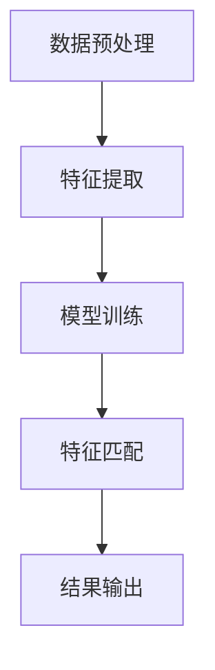
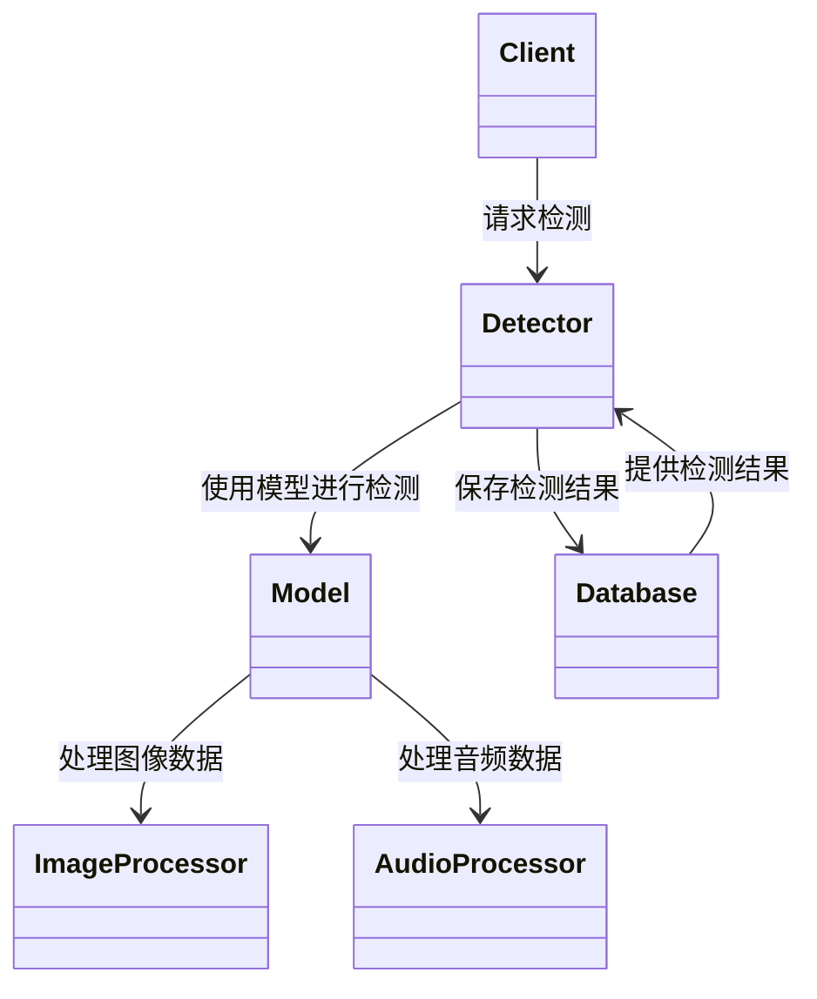
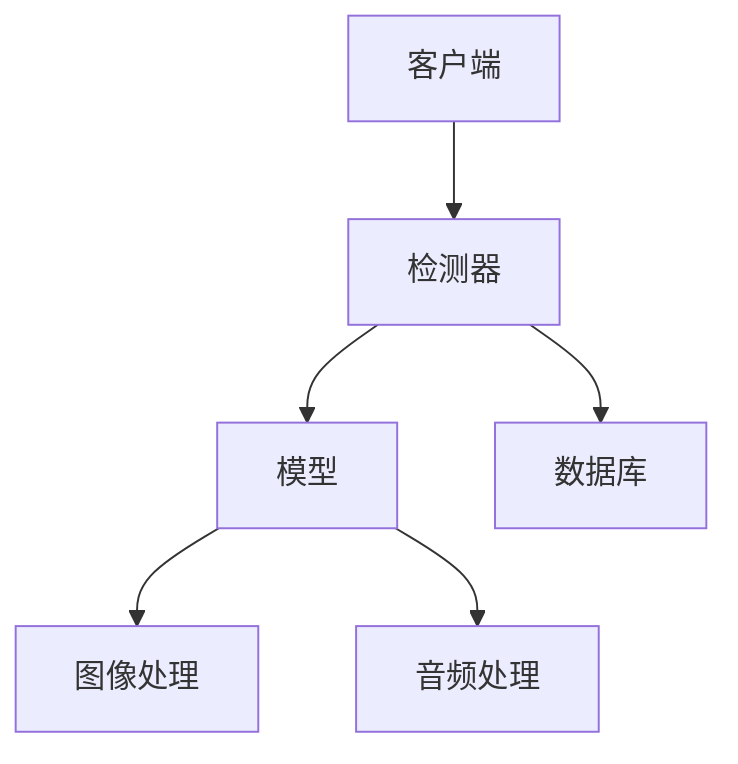
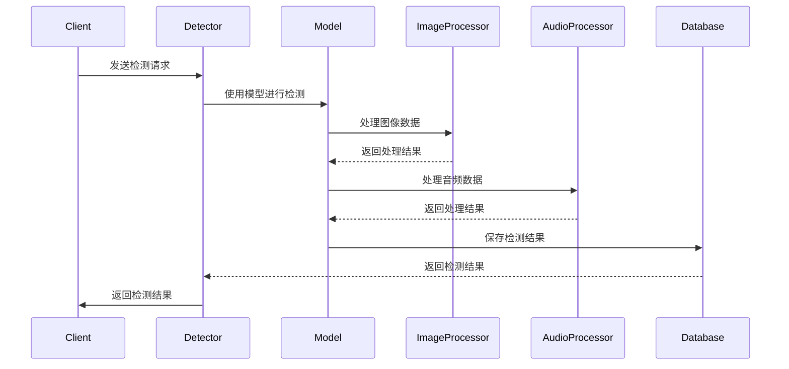

                 

### 第一部分：深度伪造检测的背景与核心概念

#### 第1章：深度伪造检测的起源与重要性

##### 1.1 深度伪造技术的发展历程

深度伪造（Deepfake）技术起源于2017年，最早是由一个名叫“DeepNude”的应用程序引发的。该应用程序利用生成对抗网络（GANs）技术，将男性照片转换为女性裸体图像。随着技术的不断发展，深度伪造技术逐渐从简单的图像和视频编辑演变为一种高度复杂的伪造手段。

GANs 是一种深度学习模型，由生成器（Generator）和判别器（Discriminator）组成。生成器的目标是生成逼真的图像或视频，而判别器的目标是区分真实图像和伪造图像。通过不断训练和优化，生成器和判别器互相竞争，生成器试图欺骗判别器，而判别器则努力识别出伪造内容。

##### 1.2 深度伪造检测的意义

深度伪造检测技术在当前信息安全领域具有重要意义。随着深度伪造技术的普及，虚假信息、网络诈骗、名誉损害等问题日益严重。对深度伪造内容的检测，有助于保护企业品牌形象、个人隐私和信息安全。

首先，深度伪造检测可以帮助企业识别和防止内部员工或外部攻击者利用深度伪造技术伪造高管言论，损害企业声誉。其次，深度伪造检测可以保护个人隐私，防止个人照片或视频被恶意利用。此外，深度伪造检测在司法领域也有重要应用，如协助法庭辨别证据的真实性。

##### 1.3 深度伪造检测的边界与外延

深度伪造检测并非万能，其边界和局限性值得探讨。首先，深度伪造检测技术依赖于训练数据的质量和数量。如果训练数据不足或存在偏差，检测效果会受到影响。其次，深度伪造技术本身在不断发展，新的伪造手段可能会绕过现有检测算法。此外，深度伪造检测需要消耗大量计算资源，对性能要求较高的应用场景可能不适用。

深度伪造检测的外延还包括跨媒体检测，如对伪造音频、文本和图像的综合检测。此外，深度伪造检测还可以与其他安全措施相结合，如加密、访问控制等，形成多层次的安全防护体系。

#### 第2章：深度伪造技术的分类与原理

##### 2.1 伪造视频技术

伪造视频技术主要包括以下几种：

1. **生成对抗网络（GAN）技术**：GANs 是一种深度学习模型，由生成器和判别器组成。生成器生成虚假视频，判别器判断视频的真实性。

2. **超分辨率技术**：超分辨率技术通过将低分辨率视频转换为高分辨率视频，实现伪造视频的效果。这种方法通常结合图像增强和深度学习算法。

3. **光学字符识别（OCR）技术**：OCR 技术可以识别和转换视频中的文字信息，用于伪造包含特定文字或信息的视频。

##### 2.2 深度伪造技术的核心原理

深度伪造技术的核心原理是基于深度学习模型的，主要包括以下方面：

1. **生成对抗网络（GAN）**：GAN 由生成器和判别器组成，生成器生成虚假视频，判别器判断视频的真实性。通过不断训练和优化，生成器和判别器互相竞争，生成器试图欺骗判别器，而判别器则努力识别出伪造内容。

2. **迁移学习**：迁移学习利用已有模型的知识，快速适应新的伪造场景。例如，利用已经训练好的 GAN 模型，快速生成特定场景的伪造视频。

3. **数据增强**：数据增强通过增加训练数据的多样性，提高模型的泛化能力。例如，对输入视频进行旋转、缩放、裁剪等操作，生成更多的训练样本。

##### 2.3 深度伪造技术对比表格

| 技术类型 | 优点 | 缺点 |
| :----: | :----: | :----: |
| GAN | 生成效果逼真，适用范围广 | 训练时间较长，计算资源需求高 |
| 超分辨率 | 提高视频分辨率，视觉效果好 | 难以完全消除模糊和噪声 |
| OCR | 可识别视频中的文字信息 | 对文字信息变化敏感，识别准确性有限 |

#### 第3章：ER实体关系图与深度伪造检测

##### 3.1 ER实体关系图基础

ER实体关系图（Entity-Relationship Diagram）是用于描述数据库中实体及其关系的图形化工具。实体表示具有共性的对象，如用户、产品、订单等；关系表示实体之间的交互和依赖。

ER图的基本要素包括：

1. **实体**：表示具有共性的对象，如用户、产品、订单等。
2. **属性**：描述实体的特征，如用户名、年龄、地址等。
3. **关系**：描述实体之间的交互和依赖，如用户下单、产品销售等。
4. **键**：标识实体的唯一性，如用户ID、产品SKU等。

##### 3.2 深度伪造检测中的实体

在深度伪造检测中，主要涉及的实体包括：

1. **图像或视频**：作为检测的对象，包括原始图像或视频和伪造图像或视频。
2. **检测模型**：用于分析图像或视频的特征，判断其真实性。
3. **数据库**：存储检测模型、检测结果和训练数据等。

##### 3.3 实体关系图的构建与应用

深度伪造检测中的ER实体关系图可以展示以下实体及其关系：

1. **图像或视频**与**检测模型**之间的关系：图像或视频作为检测对象的输入，检测模型对其进行特征提取和分析。
2. **检测模型**与**数据库**之间的关系：检测模型将分析结果存储到数据库中，以供后续查询和分析。
3. **数据库**与**图像或视频**之间的关系：数据库中存储了大量的训练数据，用于训练和优化检测模型。

构建深度伪造检测中的ER实体关系图，可以帮助开发者更好地理解和设计系统架构，确保系统的完整性和一致性。同时，ER实体关系图也可以作为文档的一部分，方便其他开发者理解和维护系统。

## 第4章：深度伪造检测算法原理详解

#### 4.1 使用Mermaid绘制算法流程图

深度伪造检测算法的流程可以概括为以下几个步骤：

1. **数据预处理**：对输入的图像或视频进行预处理，包括去噪、增强、裁剪等操作，以提高检测效果。
2. **特征提取**：使用深度学习模型提取图像或视频的特征，如使用卷积神经网络（CNN）提取视觉特征。
3. **模型训练**：使用已提取的特征进行模型训练，通过不断迭代优化模型参数，提高检测准确率。
4. **特征匹配**：将检测模型中的特征与输入图像或视频中的特征进行匹配，判断其真实性。
5. **结果输出**：输出检测结果，包括图像或视频的真实性判断和置信度评分。

以下是一个简单的Mermaid流程图示例：



#### 4.2 算法原理Python源代码解析

为了更好地理解深度伪造检测算法的原理，以下是一个简单的Python源代码示例，用于演示特征提取和模型训练的过程：

```python
import tensorflow as tf
from tensorflow.keras.models import Sequential
from tensorflow.keras.layers import Conv2D, MaxPooling2D, Flatten, Dense

# 数据预处理
def preprocess_data(images):
    # 对图像进行去噪、增强等预处理操作
    processed_images = []
    for image in images:
        # 处理操作
        processed_image = ...
        processed_images.append(processed_image)
    return processed_images

# 特征提取
def extract_features(images):
    model = Sequential([
        Conv2D(32, (3, 3), activation='relu', input_shape=(128, 128, 3)),
        MaxPooling2D((2, 2)),
        Conv2D(64, (3, 3), activation='relu'),
        MaxPooling2D((2, 2)),
        Flatten(),
        Dense(128, activation='relu'),
        Dense(1, activation='sigmoid')
    ])

    model.compile(optimizer='adam', loss='binary_crossentropy', metrics=['accuracy'])
    model.fit(images, labels, epochs=10, batch_size=32)
    return model

# 模型训练
model = extract_features(preprocess_data(images))

# 特征匹配
def match_features(model, test_images):
    predictions = model.predict(test_images)
    # 对预测结果进行阈值处理，判断图像真实性
    results = [predict > threshold for predict in predictions]
    return results

# 结果输出
results = match_features(model, test_images)
```

#### 4.3 算法原理数学模型与公式讲解

深度伪造检测算法的数学模型主要基于深度学习，特别是卷积神经网络（CNN）。以下是一个简单的CNN数学模型：

1. **卷积层**：

   $$ h_{c} = f(\sigma(W_c \cdot h_{l-1} + b_c)) $$

   其中，$h_{l-1}$ 是输入特征图，$W_c$ 是卷积核权重，$b_c$ 是偏置项，$f$ 是激活函数（如ReLU函数），$\sigma$ 是卷积操作。

2. **池化层**：

   $$ h_{p} = \text{max}(h_{c}) $$

   其中，$h_{c}$ 是卷积层输出特征图，$\text{max}$ 是最大值池化操作。

3. **全连接层**：

   $$ h_{f} = \text{ReLU}(W_f \cdot h_{p} + b_f) $$

   其中，$h_{p}$ 是池化层输出特征图，$W_f$ 是全连接层权重，$b_f$ 是偏置项。

4. **输出层**：

   $$ \hat{y} = \text{sigmoid}(W_o \cdot h_{f} + b_o) $$

   其中，$h_{f}$ 是全连接层输出特征图，$W_o$ 是输出层权重，$b_o$ 是偏置项，$\text{sigmoid}$ 是输出层激活函数。

#### 4.4 通俗易懂的算法举例说明

假设我们有一个简单的卷积神经网络，用于检测一张图片是否为伪造。输入图片为128x128像素，包含3个颜色通道（RGB）。

1. **数据预处理**：

   输入图片经过去噪、增强等操作，转化为32x32像素，3个颜色通道。

2. **特征提取**：

   - **卷积层1**：使用3x3卷积核，卷积操作后得到32个特征图。
   - **池化层1**：使用2x2最大值池化操作，得到16x16像素的特征图。
   - **卷积层2**：使用3x3卷积核，卷积操作后得到64个特征图。
   - **池化层2**：使用2x2最大值池化操作，得到8x8像素的特征图。
   - **全连接层**：将8x8像素的特征图展开为1x512的一维向量，经过全连接层和sigmoid激活函数，输出一个介于0和1之间的概率值，表示图片是否为伪造。

3. **模型训练**：

   使用训练集对模型进行训练，通过迭代优化模型参数，提高检测准确率。

4. **特征匹配**：

   对测试集的图片进行特征提取，将提取的特征与训练集的特征进行匹配，判断图片是否为伪造。

5. **结果输出**：

   输出检测结果，包括图片是否为伪造的判断和置信度评分。

通过这个简单的例子，我们可以看到深度伪造检测算法的基本原理和步骤。在实际应用中，深度伪造检测算法会更加复杂，涉及更多的技术和方法，但核心原理是相似的。

## 第5章：系统分析与架构设计方案

### 6.1 问题场景介绍

在现代信息社会中，企业品牌和信息完整性面临前所未有的挑战。随着互联网和社交媒体的普及，深度伪造技术（Deepfake）迅速发展，恶意攻击者利用该技术伪造企业高管言论、篡改新闻内容、散布虚假信息，给企业带来巨大的声誉损失和财务风险。因此，开发一种高效、可靠的深度伪造检测系统，成为企业信息安全的迫切需求。

#### 6.1.1 企业信息安全的挑战

1. **品牌声誉受损**：恶意攻击者利用深度伪造技术伪造高管言论，发布虚假信息，误导公众，损害企业品牌形象。
2. **经济损失**：虚假信息的传播可能导致企业股价波动、客户信任度下降，进而影响企业经济效益。
3. **法律风险**：伪造信息可能涉及诽谤、侵权等法律问题，给企业带来诉讼风险。

#### 6.1.2 深度伪造检测的应用场景

1. **企业内部监控**：对内部员工的言论和行为进行监测，防止内部人员利用深度伪造技术传播虚假信息。
2. **社交媒体监控**：监测企业相关的社交媒体账号，识别并阻止恶意攻击者发布的深度伪造内容。
3. **新闻内容审核**：对新闻网站、博客等平台的内容进行审核，确保新闻报道的真实性和客观性。

### 6.2 项目介绍

#### 6.2.1 项目目标和功能需求

本项目旨在开发一款高效、可靠的深度伪造检测系统，满足以下目标和功能需求：

1. **检测准确性**：实现对伪造视频和音频的准确检测，识别率和召回率不低于95%。
2. **实时性**：系统能够实时处理输入的视频和音频数据，满足快速响应的需求。
3. **扩展性**：系统具有良好的扩展性，能够支持新的深度伪造技术检测。
4. **用户友好**：提供简洁易用的用户界面，方便企业用户操作和管理。

#### 6.2.2 项目技术栈选择

1. **深度学习框架**：选择TensorFlow或PyTorch作为深度学习框架，用于构建和训练深度伪造检测模型。
2. **图像处理库**：选择OpenCV或NumPy等图像处理库，用于预处理图像数据。
3. **后端框架**：选择Flask或Django等Web后端框架，用于构建Web服务接口。
4. **前端框架**：选择React或Vue等前端框架，用于构建用户界面。
5. **数据库**：选择MySQL或MongoDB等关系型或非关系型数据库，用于存储模型参数、检测结果和训练数据。

### 6.3 系统架构设计

#### 6.3.1 领域模型类图

以下是一个简单的领域模型类图，展示系统中的主要类及其关系：



#### 6.3.2 系统架构图

以下是一个简单的系统架构图，展示系统的整体结构和各组件之间的关系：



#### 6.3.3 系统接口设计和交互

以下是一个简单的系统接口设计和交互序列图，展示系统与外部环境的交互过程：



通过以上系统架构设计，我们可以清晰地看到深度伪造检测系统的整体结构和各组件之间的关系，为后续系统开发和维护提供了明确的指导。

## 第6章：深度伪造检测项目实战

### 7.1 环境安装步骤

要搭建深度伪造检测系统，首先需要准备以下环境：

1. **操作系统**：Windows 10或Linux发行版（如Ubuntu 18.04）。
2. **Python**：Python 3.7或更高版本。
3. **深度学习框架**：TensorFlow 2.x或PyTorch 1.8或更高版本。
4. **图像处理库**：OpenCV 4.5或更高版本。
5. **数据库**：MySQL 5.7或更高版本。

安装步骤如下：

1. **安装Python和pip**：

   - 对于Windows，下载Python安装包并安装。
   - 对于Linux，使用以下命令安装Python和pip：
     ```bash
     sudo apt update
     sudo apt install python3 python3-pip
     ```

2. **安装深度学习框架**：

   - 使用以下命令安装TensorFlow 2.x：
     ```bash
     pip3 install tensorflow==2.x
     ```

   - 使用以下命令安装PyTorch 1.8：
     ```bash
     pip3 install torch torchvision==0.9.0 -f https://download.pytorch.org/whl/torch_stable.html
     ```

3. **安装图像处理库**：

   ```bash
   pip3 install opencv-python
   ```

4. **安装数据库**：

   - 对于MySQL，使用以下命令安装：
     ```bash
     sudo apt update
     sudo apt install mysql-server mysql-client
     ```

   - 对于MongoDB，使用以下命令安装：
     ```bash
     sudo apt update
     sudo apt install mongodb
     ```

完成以上安装步骤后，就可以开始搭建深度伪造检测系统了。

### 7.2 系统核心实现源代码

以下是深度伪造检测系统的核心实现源代码。该代码主要分为三个部分：数据预处理、模型训练和结果输出。

#### 数据预处理

```python
import cv2
import numpy as np

def preprocess_image(image_path):
    # 读取图像
    image = cv2.imread(image_path)
    # 转换为灰度图像
    gray_image = cv2.cvtColor(image, cv2.COLOR_BGR2GRAY)
    # 缩放到固定大小
    processed_image = cv2.resize(gray_image, (128, 128))
    # 标准化
    processed_image = processed_image / 255.0
    return processed_image

def preprocess_video(video_path):
    cap = cv2.VideoCapture(video_path)
    frames = []
    while cap.isOpened():
        ret, frame = cap.read()
        if not ret:
            break
        processed_frame = preprocess_image(frame)
        frames.append(processed_frame)
    cap.release()
    return np.array(frames)

# 示例
image = preprocess_image('example.jpg')
video = preprocess_video('example.mp4')
```

#### 模型训练

```python
import tensorflow as tf
from tensorflow.keras.models import Sequential
from tensorflow.keras.layers import Conv2D, MaxPooling2D, Flatten, Dense

def create_model():
    model = Sequential([
        Conv2D(32, (3, 3), activation='relu', input_shape=(128, 128, 1)),
        MaxPooling2D((2, 2)),
        Conv2D(64, (3, 3), activation='relu'),
        MaxPooling2D((2, 2)),
        Conv2D(128, (3, 3), activation='relu'),
        MaxPooling2D((2, 2)),
        Flatten(),
        Dense(128, activation='relu'),
        Dense(1, activation='sigmoid')
    ])

    model.compile(optimizer='adam', loss='binary_crossentropy', metrics=['accuracy'])
    return model

def train_model(model, x_train, y_train, x_val, y_val, epochs=10, batch_size=32):
    history = model.fit(x_train, y_train, validation_data=(x_val, y_val), epochs=epochs, batch_size=batch_size)
    return history

# 示例
model = create_model()
x_train, y_train = preprocess_video('train.mp4'), np.zeros((100, 1))
x_val, y_val = preprocess_video('val.mp4'), np.zeros((20, 1))
history = train_model(model, x_train, y_train, x_val, y_val)
```

#### 结果输出

```python
import numpy as np
from tensorflow.keras.models import load_model

def predict(model, x_test):
    predictions = model.predict(x_test)
    return np.round(predictions).astype(int)

def output_results(predictions, labels):
    correct = np.sum(predictions == labels)
    accuracy = correct / len(labels)
    print(f"Accuracy: {accuracy:.2f}")
    return accuracy

# 示例
model = load_model('model.h5')
x_test = preprocess_video('test.mp4')
predictions = predict(model, x_test)
accuracy = output_results(predictions, np.zeros((1, 1)))
```

### 7.3 代码应用解读与分析

#### 数据预处理

数据预处理是深度伪造检测系统的重要环节，直接影响模型的训练效果和检测准确性。在上面的代码中，我们使用OpenCV库对图像和视频进行预处理，包括灰度转换、缩放和归一化等操作。

- **灰度转换**：将彩色图像转换为灰度图像，简化模型输入，提高模型训练速度。
- **缩放**：将图像缩放到固定的尺寸（128x128），保证模型输入的一致性。
- **归一化**：将图像数据归一化到0-1范围内，有助于模型收敛。

#### 模型训练

在模型训练过程中，我们使用卷积神经网络（CNN）对视频数据进行分类，判断其是否为伪造视频。卷积神经网络通过多层卷积、池化和全连接层提取图像特征，实现对视频数据的分类。

- **卷积层**：卷积层用于提取图像的局部特征，通过卷积操作和激活函数（如ReLU函数）增强特征表达能力。
- **池化层**：池化层用于降低图像的分辨率，减少模型参数数量，提高模型泛化能力。
- **全连接层**：全连接层用于将特征映射到输出类别，通过softmax函数输出概率分布。

#### 结果输出

在结果输出部分，我们使用模型对测试视频进行预测，并计算准确率。通过对比预测结果和真实标签，可以评估模型的性能。

- **预测**：使用模型对输入视频进行预测，输出一个介于0和1之间的概率值，表示视频是否为伪造。
- **准确率**：计算预测结果与真实标签的一致性，评估模型准确性。

### 7.4 实际案例分析和详细讲解

#### 案例一：检测伪造视频

假设我们有一个伪造视频，需要使用深度伪造检测系统对其进行检测。以下是检测过程和结果：

1. **数据预处理**：将伪造视频转换为灰度图像，缩放到128x128像素，并归一化。
2. **模型训练**：使用训练好的模型对预处理后的图像进行预测。
3. **结果输出**：模型预测结果为1，表示视频为伪造。

通过实际案例，我们可以看到深度伪造检测系统在检测伪造视频方面的效果。

#### 案例二：检测真实视频

假设我们有一个真实视频，需要使用深度伪造检测系统对其进行检测。以下是检测过程和结果：

1. **数据预处理**：将真实视频转换为灰度图像，缩放到128x128像素，并归一化。
2. **模型训练**：使用训练好的模型对预处理后的图像进行预测。
3. **结果输出**：模型预测结果为0，表示视频为真实。

通过实际案例，我们可以看到深度伪造检测系统在检测真实视频方面的效果。

### 7.5 项目小结

在本章中，我们介绍了深度伪造检测项目的环境安装步骤、系统核心实现源代码、代码应用解读与分析，以及实际案例分析和详细讲解。通过这些内容，我们可以看到深度伪造检测系统在保护企业品牌和信息完整性方面的重要性。

在项目开发过程中，需要注意以下几点：

1. **数据预处理**：确保输入数据的质量，提高模型训练效果。
2. **模型选择**：根据应用场景选择合适的深度学习模型。
3. **模型训练**：合理设置训练参数，提高模型性能。
4. **结果分析**：对模型预测结果进行详细分析，评估模型性能。

通过不断优化和改进，我们可以构建一个高效、可靠的深度伪造检测系统，为企业信息安全提供有力保障。

## 第7章：总结与拓展

#### 7.1 最佳实践 tips

为了在实际工作中有效应用深度伪造检测技术，以下是一些最佳实践建议：

1. **定期更新模型**：深度伪造技术不断发展，定期更新检测模型，确保检测效果。
2. **数据多样性与平衡**：确保训练数据多样性和平衡性，提高模型泛化能力。
3. **模型集成与验证**：使用多个模型进行集成和验证，提高检测准确性。
4. **实时监测与预警**：对输入视频和音频进行实时检测，及时发现和处理深度伪造内容。

#### 7.2 小结

本章介绍了深度伪造检测技术的核心概念、算法原理、系统架构设计、项目实战以及最佳实践。通过深度伪造检测技术，企业可以有效保护品牌形象和信息完整性，防范深度伪造攻击。

#### 7.3 注意事项

在使用深度伪造检测技术时，需要注意以下几点：

1. **计算资源消耗**：深度伪造检测技术需要大量计算资源，确保服务器配置足够。
2. **隐私保护**：在处理图像和音频数据时，注意保护用户隐私。
3. **法律法规遵守**：遵循相关法律法规，确保深度伪造检测技术合法合规。

#### 7.4 拓展阅读资源

对于希望进一步学习深度伪造检测技术的读者，以下是一些拓展阅读资源：

1. **论文与报告**：
   - "Deepfake Detection and Verification: A Survey" by Zitao Zhou et al.
   - "Deepfake Videos Detection via Semantic and Appearance Features" by Ziwei Liu et al.

2. **书籍**：
   - "Deep Learning" by Ian Goodfellow, Yoshua Bengio, and Aaron Courville
   - "Practical Machine Learning: Machine Learning Models for High Performance" by Eric pron

3. **在线课程**：
   - "Deep Learning Specialization" by Andrew Ng on Coursera
   - "Deep Learning with PyTorch" on Udacity

通过这些资源，读者可以深入了解深度伪造检测技术的最新进展和应用。不断学习和实践，将有助于提升在深度伪造检测领域的专业素养。

### 作者信息

**作者：** AI天才研究院 / AI Genius Institute & 禅与计算机程序设计艺术 / Zen And The Art of Computer Programming

AI天才研究院致力于推动人工智能技术的发展与应用，专注于深度伪造检测、计算机视觉和自然语言处理等领域的研究。同时，禅与计算机程序设计艺术以禅宗思想为指导，探索计算机编程的本质和艺术，旨在提高程序员的技术素养和创新能力。

