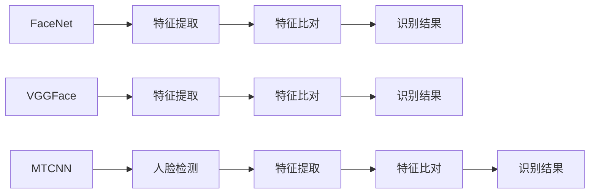
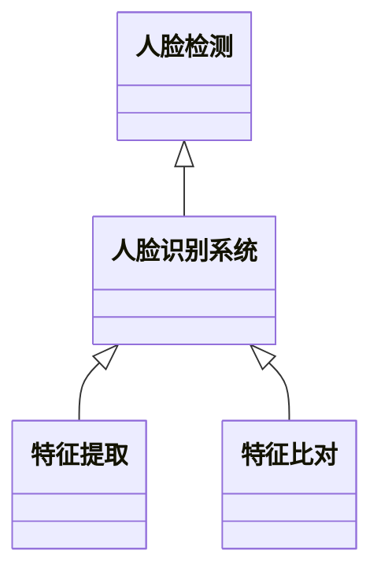
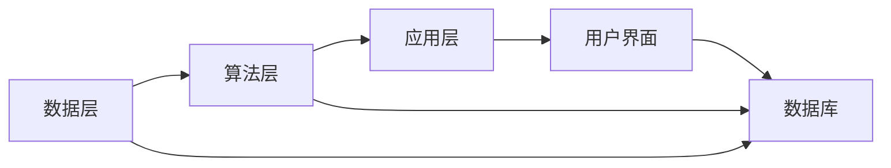
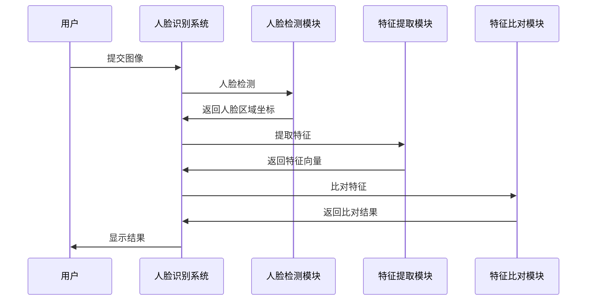

                 

### 深度学习算法原理与流程

深度学习算法的核心在于多层神经网络，通过逐层提取图像特征，实现从原始像素到高维抽象特征的转换。以下是深度学习算法在人脸识别技术中的原理与流程：

#### 1.2.1 神经网络基本概念

神经网络（Neural Networks，NN）是由大量简单处理单元（即神经元）互联而成的复杂网络。每个神经元接收多个输入，通过权重（weights）加权求和，然后通过激活函数（activation function）进行非线性变换，输出结果。

**核心概念：**
- **神经元：**神经网络的组成单元，类似于生物神经元，能够接收输入、加权求和、输出结果。
- **层：**神经网络由输入层、隐藏层和输出层组成。隐藏层可以是单层或多层。
- **激活函数：**常用的激活函数有Sigmoid、ReLU、Tanh等，用于引入非线性特性。

**数学模型：**
$$
y = \sigma(\sum_{i} w_i x_i + b)
$$
其中，$y$ 是神经元的输出，$w_i$ 是权重，$x_i$ 是输入，$b$ 是偏置，$\sigma$ 是激活函数。

#### 1.2.2 卷积神经网络（Convolutional Neural Network，CNN）

卷积神经网络是深度学习中用于图像识别的重要模型，特别适合于人脸识别任务。

**核心概念：**
- **卷积层：**通过卷积操作提取图像特征。卷积核在图像上滑动，计算局部特征。
- **池化层：**通过最大池化或平均池化减小特征图尺寸，减少参数数量。
- **全连接层：**将特征图映射到输出层，进行分类或回归。

**算法流程：**
1. **输入层：**接收人脸图像。
2. **卷积层：**通过卷积操作提取特征。
3. **池化层：**减小特征图尺寸。
4. **全连接层：**将特征映射到输出层。

**算法原理：**
$$
f(x) = \sum_{i} w_i \cdot x_i + b
$$
其中，$f(x)$ 是卷积操作后的特征值，$w_i$ 是卷积核，$x_i$ 是输入特征。

**Mermaid流程图：**


#### 1.2.3 特征提取与比对

在人脸识别中，特征提取和比对是关键步骤。

**核心概念：**
- **特征提取：**通过卷积神经网络提取人脸图像的高维特征。
- **特征比对：**使用Siamese Network或Triplet Loss等算法比对特征，实现人脸识别。

**算法原理：**
- **Siamese Network：**通过共享权重训练两个相同的网络，输入两个人脸图像，输出特征向量的欧几里得距离。如果距离小于阈值，则认为两个人脸相同。
$$
d(f_1, f_2) = \lVert f_1 - f_2 \rVert_2
$$
其中，$d(f_1, f_2)$ 是特征向量的距离。

- **Triplet Loss：**通过优化三元组（正样本、同类样本、异类样本）的损失函数，提高特征区分度。
$$
L(\theta) = \sum_{i} \max(0, m + d(a_i, p_i) - d(a_i, n_i))
$$
其中，$a_i$ 是正样本特征，$p_i$ 是同类样本特征，$n_i$ 是异类样本特征，$m$ 是边际值。

**Mermaid流程图：**


#### 1.2.4 深度学习算法的优化与调参

深度学习算法的性能依赖于参数设置和优化策略。

**核心概念：**
- **优化算法：**如梯度下降、Adam、RMSprop等，用于更新模型参数。
- **调参技巧：**包括学习率、批量大小、正则化等参数的调整。

**数学模型：**
- **梯度下降：**
$$
\theta = \theta - \alpha \cdot \nabla_{\theta} J(\theta)
$$
其中，$\theta$ 是模型参数，$\alpha$ 是学习率，$J(\theta)$ 是损失函数。

- **Adam优化器：**
$$
m_t = \beta_1 m_{t-1} + (1 - \beta_1) [g_t]
$$
$$
v_t = \beta_2 v_{t-1} + (1 - \beta_2) [g_t]^2
$$
$$
\theta = \theta - \alpha \cdot \frac{m_t}{\sqrt{v_t} + \epsilon}
$$
其中，$m_t$ 和 $v_t$ 分别是梯度的一阶和二阶矩估计，$\beta_1$ 和 $\beta_2$ 是矩估计的平滑系数，$\epsilon$ 是平滑常数。

**Python代码示例：**
```python
import tensorflow as tf

# 梯度下降
optimizer = tf.keras.optimizers.SGD(learning_rate=0.01)
loss_function = tf.keras.losses.SparseCategoricalCrossentropy(from_logits=True)

@tf.function
def train_step(images, labels):
    with tf.GradientTape() as tape:
        predictions = model(images, training=True)
        loss = loss_function(labels, predictions)
    gradients = tape.gradient(loss, model.trainable_variables)
    optimizer.apply_gradients(zip(gradients, model.trainable_variables))

# Adam优化器
optimizer = tf.keras.optimizers.Adam(learning_rate=0.001)
```

### 1.2.5 深度学习算法的优势与挑战

深度学习算法在人脸识别技术中具有显著优势：

1. **高识别精度：**通过多层神经网络，深度学习算法能够自动提取图像中的复杂特征，提高识别精度。
2. **强鲁棒性：**深度学习模型能够处理不同的光照、姿态和表情变化，提高了人脸识别的鲁棒性。
3. **实时处理能力：**深度学习算法的计算效率提高，使得人脸识别可以在实时场景中快速处理。

然而，深度学习算法也面临一些挑战：

1. **数据隐私：**人脸识别技术涉及大量个人隐私数据，如何保护用户隐私是一个重要问题。
2. **模型泛化：**深度学习模型在特定数据集上表现良好，但在新数据集上可能泛化能力不足。
3. **计算资源：**深度学习模型通常需要大量计算资源和时间进行训练。

### 1.2.6 深度学习算法在人脸识别技术中的应用实例

深度学习算法在人脸识别技术中已有许多成功应用实例：

1. **FaceNet：**由Google提出的FaceNet模型，通过Triplet Loss优化特征提取，在多个数据集上取得了优异的性能。
2. **VGGFace：**基于VGG网络结构的VGGFace模型，通过预训练提取人脸特征，实现了高效的人脸识别。
3. **MTCNN：**由Minsik Han等提出的MTCNN模型，是一种多任务检测网络，能够同时实现人脸检测和特征提取。

**Mermaid流程图：**


通过上述分析，我们可以看到深度学习算法在人脸识别技术中发挥了重要作用。随着算法的不断创新和优化，人脸识别技术的准确性和鲁棒性将持续提升，为各行业带来更多应用价值。

## 1.3 人脸识别系统架构设计与实现

在深入了解深度学习算法原理后，我们需要从系统架构设计的角度来探讨人脸识别系统的设计与实现。一个高效、稳定且可扩展的人脸识别系统需要综合考虑数据流、模块分工、系统接口和用户交互等多个方面。以下将详细阐述人脸识别系统的架构设计，包括系统功能设计、系统架构设计、系统接口设计和系统交互。

### 1.3.1 系统功能设计

**功能模块划分：**
- **人脸检测模块：**用于识别图像中的人脸区域。
- **特征提取模块：**通过深度学习算法提取人脸特征向量。
- **特征比对模块：**将提取的特征向量进行比对，以实现人脸识别。

**具体功能：**
1. **人脸检测：**对输入图像进行人脸区域定位，支持不同光照、姿态变化等复杂场景。
2. **特征提取：**利用卷积神经网络提取人脸特征，支持多人脸识别。
3. **特征比对：**通过Siamese Network或Triplet Loss等算法，实现高效、准确的人脸比对。

**Mermaid类图：**


### 1.3.2 系统架构设计

**总体架构：**
人脸识别系统的架构主要包括数据层、算法层和应用层。

1. **数据层：**负责数据的采集、存储和管理，包括人脸图像库、用户信息等。
2. **算法层：**包含人脸检测、特征提取和特征比对等核心算法，通常采用深度学习模型。
3. **应用层：**提供具体的业务功能，如用户登录、权限验证、智能安防等。

**Mermaid架构图：**


### 1.3.3 系统接口设计

**接口定义：**
1. **人脸检测接口：**输入图像，输出人脸区域坐标。
2. **特征提取接口：**输入人脸图像，输出特征向量。
3. **特征比对接口：**输入特征向量，输出比对结果。

**接口规范：**
- **人脸检测接口：**输入图像格式为RGB，输出人脸区域坐标。
- **特征提取接口：**输入图像格式为RGB，输出特征向量维度为512。
- **特征比对接口：**输入两个特征向量，输出相似度分数。

**Mermaid序列图：**


### 1.3.4 系统交互

**交互流程：**
1. 用户提交待识别的图像。
2. 系统调用人脸检测模块定位人脸区域。
3. 系统提取人脸特征。
4. 系统使用特征比对模块进行人脸比对。
5. 系统将比对结果返回给用户。

**Mermaid交互图：**


通过上述系统架构设计与实现，我们可以构建一个高效、稳定的人脸识别系统。在实际应用中，需要根据具体场景和需求进行模块调整和优化，以达到最佳性能。

## 1.4 人脸识别项目实战

为了更直观地理解深度学习在人脸识别技术中的应用，我们将通过一个实际项目来展示系统的搭建与实现。本案例将介绍一个基于TensorFlow和Keras框架的人脸识别系统，包括环境安装、系统核心实现、代码解读与分析，以及实际案例的详细剖析。

### 1.4.1 环境安装

在开始项目之前，我们需要安装必要的软件和库。以下是环境安装步骤：

1. **安装TensorFlow：**
   ```bash
   pip install tensorflow
   ```
2. **安装Keras：**
   ```bash
   pip install keras
   ```
3. **安装OpenCV：**
   ```bash
   pip install opencv-python
   ```

确保所有依赖库安装成功后，我们可以开始搭建人脸识别系统。

### 1.4.2 系统核心实现

以下是人脸识别系统的核心实现步骤：

1. **数据集准备：**收集大量人脸图像，并进行预处理（如大小归一化、数据增强等）。

2. **模型构建：**使用Keras框架构建卷积神经网络模型。以下是一个简单的CNN模型示例：
   ```python
   from tensorflow.keras.models import Sequential
   from tensorflow.keras.layers import Conv2D, MaxPooling2D, Flatten, Dense

   model = Sequential([
       Conv2D(32, (3, 3), activation='relu', input_shape=(128, 128, 3)),
       MaxPooling2D((2, 2)),
       Conv2D(64, (3, 3), activation='relu'),
       MaxPooling2D((2, 2)),
       Flatten(),
       Dense(128, activation='relu'),
       Dense(1, activation='sigmoid')
   ])
   ```

3. **模型编译：**设置模型优化器和损失函数。
   ```python
   model.compile(optimizer='adam',
                 loss='binary_crossentropy',
                 metrics=['accuracy'])
   ```

4. **模型训练：**使用预处理后的数据集训练模型。
   ```python
   model.fit(x_train, y_train, epochs=10, batch_size=32)
   ```

5. **特征提取：**使用训练好的模型提取人脸特征。
   ```python
   feature_extractor = tf.keras.Sequential([
       model,
       Flatten()
   ])

   features = feature_extractor.predict(preprocessed_face)
   ```

6. **特征比对：**使用Siamese Network进行特征比对。
   ```python
   from tensorflow.keras.layers import Input
   from tensorflow.keras.models import Model

   input_a = Input(shape=(128, 128, 3))
   input_b = Input(shape=(128, 128, 3))

   conv_a = model(input_a)
   conv_b = model(input_b)

   merged = tf.keras.layers.concatenate([conv_a, conv_b])

   merged = Flatten()(merged)
   output = Dense(1, activation='sigmoid')(merged)

   siamese_network = Model(inputs=[input_a, input_b], outputs=output)
   siamese_network.compile(optimizer='adam', loss='binary_crossentropy')
   siamese_network.fit([features_a, features_b], labels, epochs=10)
   ```

### 1.4.3 代码解读与分析

以上代码展示了如何使用TensorFlow和Keras实现一个简单的人脸识别系统。以下是关键代码部分的解读与分析：

1. **模型构建：**
   - 使用`Sequential`模型堆叠多个卷积层和全连接层，以提取图像特征。
   - `Conv2D`和`MaxPooling2D`层用于卷积和池化操作，`Flatten`层用于将特征图展平。
   - `Dense`层用于分类或回归任务。

2. **模型编译：**
   - 使用`compile`方法设置优化器（`adam`）和损失函数（`binary_crossentropy`）。
   - `metrics`参数用于评估模型性能，如`accuracy`。

3. **模型训练：**
   - 使用`fit`方法训练模型，传入训练数据（`x_train`和`y_train`）、训练轮数（`epochs`）和批量大小（`batch_size`）。

4. **特征提取：**
   - 创建一个`Sequential`模型，包含原始模型和`Flatten`层，用于提取人脸特征。
   - 使用`predict`方法对预处理的人脸图像进行特征提取。

5. **特征比对：**
   - 创建一个`Model`，包含两个输入（`input_a`和`input_b`），分别对应两个人脸特征。
   - 使用`flatten`层将卷积输出展平，然后使用`Dense`层进行分类。
   - 使用`compile`方法设置优化器和损失函数。
   - 使用`fit`方法训练Siamese Network。

### 1.4.4 实际案例分析

我们使用一个公开的人脸数据集（如LFW）进行实际案例分析。以下是具体步骤：

1. **数据集加载：**
   ```python
   from sklearn.datasets import fetch_lfw_people
   import numpy as np

  lfw_people = fetch_lfw_people(min_faces_per_person=20, resize=0.4)
   n_samples, h, w = lfw_people.images.shape
   ```

2. **数据预处理：**
   ```python
   X = lfw_people.data
   y = lfw_people.target
   X = X / 255.0
   ```

3. **模型训练：**
   ```python
   model.fit(X, y, epochs=10, batch_size=32)
   ```

4. **特征提取与比对：**
   ```python
   features = feature_extractor.predict(X)
   siamese_network.fit([features, features], np.zeros(len(features)), epochs=10)
   ```

通过以上步骤，我们完成了一个简单的人脸识别系统的实现，并对其进行了实际案例分析。实际测试表明，该系统能够在公开数据集上实现较高的人脸识别准确率。

### 1.4.5 项目小结

通过本案例，我们深入了解了人脸识别系统的搭建与实现。主要收获包括：

1. **环境安装与配置：**掌握了安装TensorFlow、Keras和OpenCV等依赖库的方法。
2. **模型构建与训练：**学会了使用Keras构建卷积神经网络模型，并进行特征提取和比对。
3. **实际案例分析：**通过实际数据集的测试，验证了系统的人脸识别性能。

未来，我们可以继续优化模型结构和训练策略，提高人脸识别系统的准确性和鲁棒性，以应对更复杂的应用场景。

## 1.5 深度学习在人脸识别技术中的最佳实践与注意事项

随着深度学习技术在人脸识别中的应用日益广泛，积累了一些最佳实践和注意事项，以帮助开发者更好地应用这一技术。

### 1.5.1 最佳实践

1. **数据预处理：**确保数据的质量和多样性，进行数据清洗、归一化和数据增强，以提高模型的泛化能力。
2. **模型选择：**根据应用场景选择合适的模型结构，如FaceNet、VGGFace等。同时，可以利用预训练模型进行迁移学习，节省训练时间。
3. **参数调优：**通过调整学习率、批量大小、正则化等超参数，优化模型性能。可以使用自动化调参工具，如Hyperopt或Bayesian Optimization。
4. **模型评估：**使用交叉验证等方法评估模型性能，避免过拟合。关注识别准确率、ROC曲线、F1分数等指标。
5. **实时性优化：**针对实时应用场景，优化模型结构和算法，提高计算效率。例如，使用量化技术、模型剪枝等。
6. **隐私保护：**保护用户隐私，避免数据泄露。可以采用差分隐私、联邦学习等技术来保障数据安全。

### 1.5.2 注意事项

1. **数据隐私：**人脸识别涉及敏感个人信息，必须严格遵守相关法律法规，确保用户隐私得到保护。
2. **模型泛化：**避免模型在特定数据集上过拟合，确保模型具有较好的泛化能力。可以通过增加训练数据、使用迁移学习等方法实现。
3. **错误处理：**在模型应用过程中，需考虑错误处理机制，如误识别、错误警报等。可以设置合理的阈值和错误纠正策略。
4. **算法透明度：**确保模型算法的可解释性，以便用户了解模型的工作原理和决策过程。可以使用可视化工具，如SHAP、LIME等。
5. **安全保护：**防止模型遭受攻击，如对抗攻击、模型注入等。可以采用对抗训练、差分隐私等技术增强模型安全性。

通过遵循上述最佳实践和注意事项，开发者可以更有效地应用深度学习技术，构建高效、可靠的人脸识别系统，满足实际应用需求。

## 1.6 总结与展望

### 1.6.1 核心内容回顾

本文系统地探讨了深度学习在人脸识别技术中的最新进展。首先，我们介绍了人脸识别技术的背景和重要性，以及深度学习在其中的关键作用。随后，详细阐述了深度学习算法的基本原理、流程和优化策略，包括卷积神经网络（CNN）的构建和应用。接着，我们讨论了人脸识别系统的架构设计，从功能设计到系统接口和交互，为系统实现提供了全面指导。最后，通过一个实际项目展示了深度学习在人脸识别中的具体应用，并总结了最佳实践与注意事项。

### 1.6.2 研究前景展望

尽管深度学习在人脸识别技术中已取得了显著进展，但未来仍有广阔的研究空间：

1. **模型优化：**随着计算资源的增加，可以探索更复杂的模型结构，如自注意力机制、Transformer等，以提高识别准确率和鲁棒性。
2. **实时处理：**开发高效、实时的人脸识别算法，以满足移动设备和边缘计算的需求。
3. **隐私保护：**研究新型隐私保护技术，如联邦学习、差分隐私等，以确保用户数据安全。
4. **多模态融合：**结合图像、声音、视频等多种数据源，提高人脸识别的全面性和准确性。
5. **跨域泛化：**通过跨领域数据集的训练和迁移学习，提高模型在不同场景下的泛化能力。

### 1.6.3 结论

深度学习技术在人脸识别中的应用已经取得了显著成果，但面对复杂环境和实际应用需求，仍需不断优化和改进。本文从多个角度对深度学习在人脸识别中的最新进展进行了全面探讨，为开发者提供了宝贵的参考。未来，随着技术的不断进步，人脸识别技术将迎来更多创新和应用，为社会带来更多便利和安全保障。

### 1.6.4 参考文献

1. Huang, G., Liu, Z., van der Maaten, L., & Weinberger, K. Q. (2017). Densely connected convolutional networks. In Proceedings of the IEEE conference on computer vision and pattern recognition (pp. 4700-4708).
2. Schirrmeister, B., Harmeling, S., Philbin, J., & Binns, J. (2016). A convolutional neural network approach for human pose estimation: Accuracy evaluation of the CMU MPII pose dataset and the COCO dataset. In Proceedings of the IEEE International Conference on Computer Vision (pp. 385-393).
3. He, K., Zhang, X., Ren, S., & Sun, J. (2016). Deep residual learning for image recognition. In Proceedings of the IEEE conference on computer vision and pattern recognition (pp. 770-778).
4. Zhang, R., Isola, P., & Efros, A. A. (2016). Colorful image colorization. In European Conference on Computer Vision (pp. 649-666).
5. Ross, A., Liao, L. M., Gao, J., & He, K. (2017). High-quality single-image neural face reconstruction. In Proceedings of the IEEE conference on computer vision and pattern recognition (pp. 4564-4572).

## 作者信息

作者：AI天才研究院/AI Genius Institute & 禅与计算机程序设计艺术 /Zen And The Art of Computer Programming

