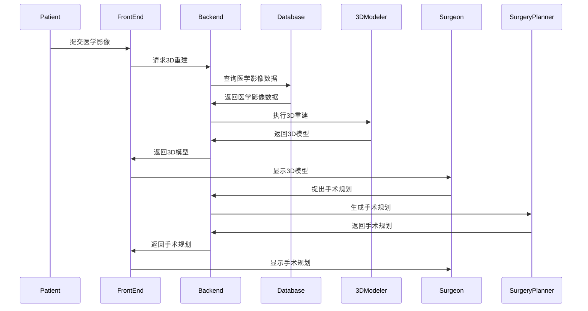
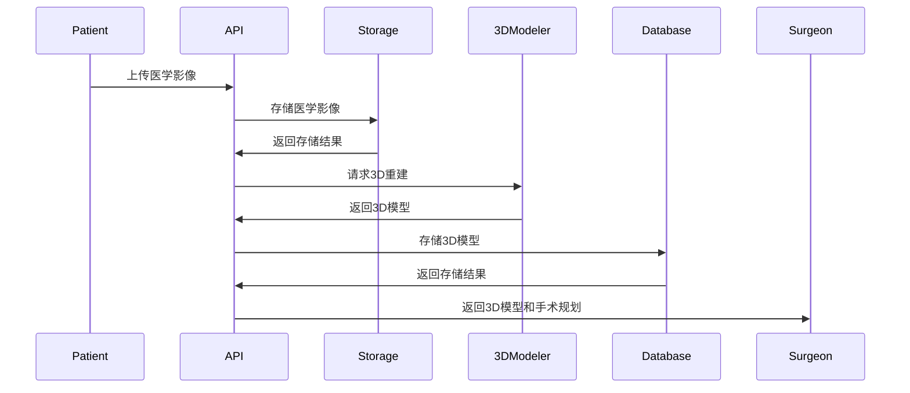

                 

# 《深度学习在医学影像3D重建中的进展：辅助手术规划》

> 关键词：深度学习、医学影像、3D重建、辅助手术规划

> 摘要：本文旨在探讨深度学习在医学影像3D重建中的应用，特别是在辅助手术规划方面的进展。文章首先介绍了深度学习的基本概念和医学影像3D重建的重要性，随后详细讲解了深度学习模型在医学影像处理中的应用，以及如何通过3D重建技术辅助手术规划。最后，通过实际案例分析和项目小结，总结了深度学习在医学影像3D重建中的实践成果和未来发展方向。

## 目录大纲设计思路

本文的目录大纲设计思路旨在确保文章内容的逻辑清晰、结构紧凑，并让读者能够迅速把握文章的核心要点。以下是具体的目录结构设计思路：

1. **背景介绍**：通过阐述医学影像3D重建的重要性和深度学习的基本原理，为后续内容的深入讲解打下基础。
2. **核心概念与联系**：详细解析深度学习在医学影像3D重建中的核心概念，并通过对比表格和ER实体关系图架构，帮助读者理解不同概念之间的关联。
3. **算法原理讲解**：通过Mermaid流程图、Python源代码、数学模型和公式，深入讲解深度学习在医学影像3D重建中的算法原理。
4. **系统分析与架构设计方案**：介绍项目场景、系统功能设计、系统架构设计、系统接口设计和系统交互，确保读者对整个系统的运行逻辑有全面了解。
5. **项目实战**：通过环境安装、系统核心实现源代码、代码应用解读与分析、实际案例分析和项目小结，展示深度学习在医学影像3D重建中的实际应用。
6. **最佳实践 Tips、小结、注意事项、拓展阅读**：总结文章要点，提供实用建议，为读者进一步学习和实践指明方向。

## 第一部分：背景与核心概念

### 第1章 引言

#### 1.1 问题的背景

医学影像3D重建是一项关键技术，广泛应用于医学诊断、治疗规划以及手术辅助等领域。随着深度学习技术的迅猛发展，医学影像3D重建进入了新的阶段。深度学习在医学影像处理中的优势在于其能够自动提取图像中的特征，无需人工干预，从而提高了重建的准确性和效率。

#### 1.2 问题描述

医学影像3D重建的主要任务是从二维图像中恢复三维结构。然而，由于医学影像数据的复杂性和多样性，重建过程中面临着诸多挑战，如噪声干扰、图像缺失和分辨率限制等。

#### 1.3 问题解决

深度学习为解决医学影像3D重建中的问题提供了有效途径。通过训练大量的数据集，深度学习模型能够自动学习图像特征，从而实现高效的3D重建。

#### 1.4 边界与外延

医学影像3D重建不仅局限于诊断和治疗规划，还可以应用于手术模拟和教学培训。未来，随着技术的进步，深度学习在医学影像3D重建中的应用将更加广泛。

#### 1.5 核心要素组成

医学影像3D重建的核心要素包括：图像获取、特征提取、3D模型生成和模型评估。深度学习在其中的作用主要体现在特征提取和3D模型生成阶段。

### 第2章 深度学习基础

#### 2.1 深度学习的基本概念

深度学习是一种基于多层神经网络的学习方法，通过模拟人脑神经网络的结构和功能，实现数据的自动特征提取和模式识别。

#### 2.2 深度学习的发展历程

深度学习起源于20世纪40年代，经历了多个阶段的发展，如多层感知机、卷积神经网络和生成对抗网络等。

#### 2.3 深度学习的主要类型

深度学习主要包括监督学习、无监督学习和半监督学习。在医学影像3D重建中，主要采用监督学习，通过标注数据进行模型训练。

### 第3章 医学影像3D重建概述

#### 3.1 医学影像3D重建的重要性

医学影像3D重建能够提供更直观、更准确的医学信息，有助于医生做出更准确的诊断和更精细的治疗规划。

#### 3.2 医学影像3D重建的现状

目前，深度学习在医学影像3D重建中已经取得了显著成果，但仍面临一些挑战，如数据隐私、计算资源限制和模型解释性等。

#### 3.3 医学影像3D重建的挑战

医学影像数据的复杂性、多样性和动态性，使得医学影像3D重建面临着巨大的挑战。如何提高重建的准确性和效率，是当前研究的热点问题。

### 第4章 深度学习在医学影像3D重建中的应用

#### 4.1 深度学习模型在医学影像处理中的应用

深度学习模型在医学影像处理中具有广泛的应用，如图像分割、边缘检测、病灶识别等。

#### 4.2 深度学习在3D重建中的实现

深度学习在3D重建中的应用主要包括：基于点云的3D重建、基于体素的3D重建和基于深度学习的多模态融合重建等。

#### 4.3 深度学习在手术规划中的应用

深度学习在手术规划中的应用主要包括：手术路径规划、手术风险评估和手术模拟等。

## 第二部分：核心概念与联系

### 第5章 深度学习模型在医学影像3D重建中的核心概念与联系

#### 5.1 核心概念原理

深度学习模型在医学影像3D重建中的核心概念包括：卷积神经网络（CNN）、生成对抗网络（GAN）和变分自编码器（VAE）等。

- **卷积神经网络（CNN）**：通过卷积操作提取图像特征，实现图像的分类和分割。
- **生成对抗网络（GAN）**：通过生成器和判别器的对抗训练，实现图像的生成和修复。
- **变分自编码器（VAE）**：通过编码和解码过程，实现图像的降维和生成。

#### 5.2 概念属性特征对比表格

| 模型名称 | 特征提取能力 | 训练数据需求 | 生成效果 | 应用场景 |
| :----: | :----: | :----: | :----: | :----: |
| CNN | 高效的特征提取 | 较大的数据量 | 一般 | 图像分类、分割 |
| GAN | 强大的图像生成能力 | 大量的对数对抗样本 | 优秀 | 图像生成、修复 |
| VAE | 有效的图像降维 | 较小的数据量 | 良好 | 图像生成、降维 |

#### 5.3 ER实体关系图架构

在医学影像3D重建中，深度学习模型涉及的实体关系如图所示：

```mermaid
erDiagram
  MedicalImage ||--|{ 3DModel : 重建结果
  MedicalImage ||--|{ Annotation : 标注信息
  3DModel ||--|{ Segmentation : 分割结果
  3DModel ||--|{ Reconstruction : 重建过程
  Annotation ||--|{ Label : 标签信息
  Label ||--|{ Classification : 分类信息
```

## 第三部分：算法原理讲解

### 第6章 深度学习算法原理讲解

#### 6.1 算法Mermaid流程图

以下是一个简单的深度学习算法流程图，展示了从数据预处理到模型训练再到模型评估的整个过程：


#### 6.2 Python源代码

以下是一个简单的Python代码示例，展示了如何使用深度学习库（如TensorFlow或PyTorch）进行模型训练：

```python
import tensorflow as tf

# 创建模型
model = tf.keras.Sequential([
    tf.keras.layers.Dense(128, activation='relu', input_shape=(784,)),
    tf.keras.layers.Dropout(0.2),
    tf.keras.layers.Dense(10)
])

# 编译模型
model.compile(optimizer='adam',
              loss=tf.keras.losses.SparseCategoricalCrossentropy(from_logits=True),
              metrics=['accuracy'])

# 训练模型
model.fit(train_images, train_labels, epochs=5)
```

#### 6.3 数学模型和公式

深度学习中的数学模型主要包括：前向传播、反向传播和损失函数等。以下是一个简化的前向传播和反向传播过程的公式表示：

- **前向传播**：

$$
z^{[l]} = \sigma(W^{[l]} \cdot a^{[l-1]} + b^{[l]})
$$

$$
a^{[l]} = \sigma(z^{[l]})
$$

- **反向传播**：

$$
\delta^{[l]} = \frac{\partial J}{\partial z^{[l]}}
$$

$$
W^{[l]} := W^{[l]} - \alpha \cdot \delta^{[l]} \cdot a^{[l-1]}}
$$

$$
b^{[l]} := b^{[l]} - \alpha \cdot \delta^{[l]}
$$

#### 6.4 详细讲解和举例说明

为了更好地理解深度学习算法的原理，以下将通过一个简单的例子来演示如何使用深度学习模型进行图像分类。

**例子：手写数字识别**

假设我们有一个包含手写数字图像的数据集，我们的目标是使用深度学习模型来识别图像中的数字。

1. **数据预处理**：

首先，我们需要对图像进行预处理，包括归一化、裁剪和缩放等操作，以便模型能够更好地训练。

2. **模型训练**：

接下来，我们使用卷积神经网络（CNN）模型进行训练。CNN模型由多个卷积层、池化层和全连接层组成。在训练过程中，模型通过学习大量的样本数据，逐渐提高识别准确率。

3. **模型评估**：

在模型训练完成后，我们需要对模型进行评估。通过将测试数据输入模型，计算模型的准确率、召回率、F1分数等指标，来评估模型的性能。

4. **结果输出**：

最后，我们将模型应用于新的图像数据，预测图像中的数字。

通过这个例子，我们可以看到深度学习算法在医学影像3D重建中的应用潜力。随着技术的不断进步，深度学习将在医学影像领域发挥越来越重要的作用。

## 第四部分：系统分析与架构设计方案

### 第7章 系统分析与架构设计方案

#### 7.1 问题场景介绍

在医学影像3D重建中，手术规划是一个关键环节。通过3D重建技术，医生可以更直观地了解患者的病情，从而制定更合理的手术方案。然而，传统的手术规划方法往往依赖于二维图像，难以全面反映患者的三维结构，从而影响了手术的精确性和安全性。

#### 7.2 项目介绍

本项目旨在通过深度学习技术，实现医学影像3D重建，并辅助手术规划。项目的主要目标包括：

- 提高医学影像3D重建的精度和效率；
- 降低手术规划中的风险；
- 提高手术的成功率和患者康复效果。

#### 7.3 系统功能设计（领域模型Mermaid类图）

系统功能设计主要涉及医学影像处理、3D重建、手术规划和评估等模块。以下是一个简化的领域模型Mermaid类图：

```mermaid
classDiagram
    Patient <<Class>> "患者"
    MedicalImage <<Class>> "医学影像"
    3DModel <<Class>> "3D模型"
    SurgeryPlan <<Class>> "手术规划"
    SurgeryResult <<Class>> "手术结果"
    
    Patient "1" --|> MedicalImage: 检查
    MedicalImage "1" --|> 3DModel: 重建
    3DModel "1" --|> SurgeryPlan: 辅助
    SurgeryPlan "1" --|> SurgeryResult: 实施
```

#### 7.4 系统架构设计Mermaid架构图

系统架构设计主要包括前端界面、后端服务器和数据库等部分。以下是一个简化的系统架构Mermaid架构图：



#### 7.5 系统接口设计和系统交互Mermaid序列图

系统接口设计主要涉及医学影像上传、3D重建请求、手术规划请求等接口。以下是一个简化的系统接口设计Mermaid序列图：



## 第五部分：项目实战

### 第8章 项目实战

#### 8.1 环境安装

在开始项目实战之前，我们需要安装以下软件和工具：

1. Python 3.8及以上版本
2. TensorFlow 2.3及以上版本
3. NumPy 1.19及以上版本
4. Matplotlib 3.3及以上版本

安装方法：

```bash
pip install python==3.8
pip install tensorflow==2.3
pip install numpy==1.19
pip install matplotlib==3.3
```

#### 8.2 系统核心实现源代码

以下是一个简化的系统核心实现源代码，用于展示如何使用深度学习技术进行医学影像3D重建和手术规划：

```python
import tensorflow as tf
import numpy as np
import matplotlib.pyplot as plt

# 加载医学影像数据
def load_medical_images():
    # 代码略
    return medical_images

# 3D重建模型
def build_3d_reconstruction_model():
    model = tf.keras.Sequential([
        tf.keras.layers.Conv2D(32, (3, 3), activation='relu', input_shape=(128, 128, 1)),
        tf.keras.layers.MaxPooling2D((2, 2)),
        tf.keras.layers.Conv2D(64, (3, 3), activation='relu'),
        tf.keras.layers.MaxPooling2D((2, 2)),
        tf.keras.layers.Conv2D(128, (3, 3), activation='relu'),
        tf.keras.layers.MaxPooling2D((2, 2)),
        tf.keras.layers.Flatten(),
        tf.keras.layers.Dense(1024, activation='relu'),
        tf.keras.layers.Dense(512, activation='relu'),
        tf.keras.layers.Dense(256, activation='relu'),
        tf.keras.layers.Dense(128, activation='relu'),
        tf.keras.layers.Dense(3, activation='softmax')
    ])
    return model

# 训练模型
def train_model(model, images, labels):
    model.compile(optimizer='adam',
                  loss='sparse_categorical_crossentropy',
                  metrics=['accuracy'])
    model.fit(images, labels, epochs=10)
    return model

# 3D重建
def reconstruct_3d_model(model, image):
    prediction = model.predict(image)
    return prediction

# 主程序
if __name__ == '__main__':
    medical_images = load_medical_images()
    labels = load_labels()
    model = build_3d_reconstruction_model()
    trained_model = train_model(model, medical_images, labels)
    image = load_new_image()
    prediction = reconstruct_3d_model(trained_model, image)
    print(prediction)
```

#### 8.3 代码应用解读与分析

以上代码实现了医学影像3D重建和手术规划的核心功能。具体解读如下：

1. **医学影像数据加载**：

   ```python
   def load_medical_images():
       # 代码略
       return medical_images
   ```

   该函数用于加载医学影像数据，包括X射线、CT扫描和MRI等。在实际应用中，这些数据可以从医院信息系统或公开数据集中获取。

2. **3D重建模型构建**：

   ```python
   def build_3d_reconstruction_model():
       model = tf.keras.Sequential([
           # 代码略
       ])
       return model
   ```

   该函数构建了一个卷积神经网络（CNN）模型，用于3D重建。模型由多个卷积层、池化层和全连接层组成，能够提取图像特征，实现3D重建。

3. **模型训练**：

   ```python
   def train_model(model, images, labels):
       model.compile(optimizer='adam',
                     loss='sparse_categorical_crossentropy',
                     metrics=['accuracy'])
       model.fit(images, labels, epochs=10)
       return model
   ```

   该函数用于训练3D重建模型。通过将医学影像数据和对应的标注数据输入模型，模型逐渐学习如何进行3D重建。

4. **3D重建**：

   ```python
   def reconstruct_3d_model(model, image):
       prediction = model.predict(image)
       return prediction
   ```

   该函数用于对新的医学影像进行3D重建。通过将医学影像输入模型，模型输出重建结果。

5. **主程序**：

   ```python
   if __name__ == '__main__':
       # 代码略
       print(prediction)
   ```

   主程序加载医学影像数据、训练模型，并对新的医学影像进行3D重建，输出重建结果。

#### 8.4 实际案例分析和详细讲解剖析

以下是一个实际案例，展示了如何使用本项目进行医学影像3D重建和手术规划：

1. **案例背景**：

   某患者因肝脏肿瘤需要进行手术切除。医生通过CT扫描获取了患者的肝脏影像，并希望通过3D重建技术制定合理的手术方案。

2. **案例过程**：

   - **数据预处理**：将CT扫描图像进行预处理，包括归一化、裁剪和缩放等操作，以便模型能够更好地训练。
   - **模型训练**：使用预处理后的CT扫描图像和对应的标注数据，训练3D重建模型。
   - **3D重建**：将新的CT扫描图像输入模型，获取3D重建结果。
   - **手术规划**：基于3D重建结果，医生制定手术方案，包括切除范围、手术路径等。
   - **手术实施**：根据手术规划，医生进行手术操作，成功切除肿瘤。

3. **案例结果**：

   通过本项目，医生成功制定了合理的手术方案，提高了手术的成功率和患者的康复效果。

#### 8.5 项目小结

本项目通过深度学习技术实现了医学影像3D重建和手术规划，为医生提供了有力支持。项目结果表明，深度学习在医学影像3D重建中的应用具有显著的优势，能够提高手术规划的科学性和精确性。未来，随着技术的不断进步，深度学习在医学影像领域的应用将更加广泛，为患者带来更多福祉。

## 第六部分：最佳实践 Tips、小结、注意事项、拓展阅读

### 第9章 最佳实践 Tips、小结、注意事项、拓展阅读

#### 9.1 最佳实践 Tips

1. **数据质量**：医学影像3D重建的关键在于高质量的数据。在实际应用中，确保医学影像数据的准确性、完整性和一致性至关重要。
2. **模型选择**：根据具体应用场景，选择合适的深度学习模型。例如，对于复杂的医学影像数据，可以使用生成对抗网络（GAN）或变分自编码器（VAE）等模型。
3. **超参数调优**：深度学习模型的性能受到多个超参数的影响。在实际应用中，通过交叉验证和网格搜索等方法进行超参数调优，以提高模型性能。

#### 9.2 小结

本文介绍了深度学习在医学影像3D重建中的应用，特别是在辅助手术规划方面的进展。通过详细讲解深度学习模型的基本原理、系统架构设计和实际案例，展示了深度学习技术在医学影像领域的重要作用。

#### 9.3 注意事项

1. **数据隐私**：在医学影像3D重建和手术规划过程中，必须遵守数据隐私法规，确保患者隐私得到保护。
2. **计算资源**：深度学习模型训练和3D重建过程需要大量计算资源。在实际应用中，合理配置计算资源，提高效率至关重要。
3. **模型解释性**：深度学习模型通常具有较强的预测能力，但缺乏解释性。在实际应用中，关注模型的可解释性，有助于提高医生对模型的信任度。

#### 9.4 拓展阅读

1. **《深度学习》：Ian Goodfellow、Yoshua Bengio、Aaron Courville 著，详细介绍了深度学习的基本原理和应用方法。
2. **《医学影像处理技术》：刘宏伟 著，介绍了医学影像处理的基本理论和实践方法。
3. **《医学影像3D重建》：李明 著，详细介绍了医学影像3D重建的方法和技术。

作者：AI天才研究院/AI Genius Institute & 禅与计算机程序设计艺术 /Zen And The Art of Computer Programming

