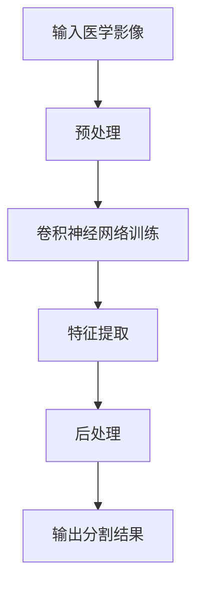
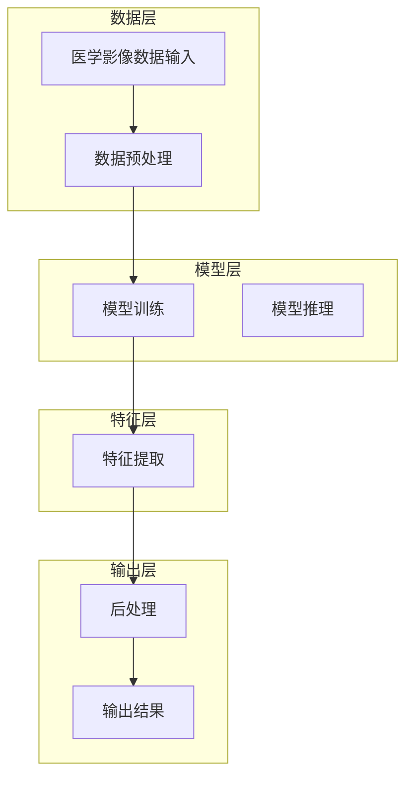
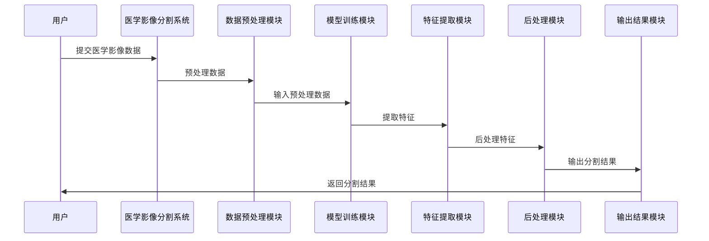

                 

# 深度学习在医学影像分割中的精确应用

## 关键词
- 深度学习
- 医学影像
- 医学影像分割
- 卷积神经网络
- 联合训练
- 数据增强

## 摘要
随着医疗影像技术的不断发展，医学影像分割在临床诊断、治疗规划和疾病预后评估中扮演着越来越重要的角色。深度学习技术的崛起为医学影像分割带来了新的契机。本文将详细介绍深度学习在医学影像分割中的精确应用，包括其背景、核心概念、算法原理以及系统架构设计。通过分析现有的问题和解决方案，本文旨在为医学影像分割的研究者和开发者提供有价值的参考和指导。

## 1. 背景介绍

### 问题背景

医学影像分割是医学影像处理领域的重要研究方向，其目的是将医学影像中的感兴趣区域（如肿瘤、器官等）从背景中分离出来，以便进行进一步的诊断和分析。医学影像分割在临床诊断、治疗规划及疾病预后评估等方面具有重要作用。例如，在肿瘤诊断中，准确分割肿瘤区域对于评估肿瘤大小、形状和位置至关重要；在手术规划中，精确分割器官结构有助于减少手术风险和提高手术精度。

随着深度学习技术的发展，医学影像分割面临着新的挑战和机遇。传统的医学影像分割方法主要依赖于基于规则和统计模型的方法，如阈值法、区域增长法等，这些方法往往依赖于领域知识和先验假设，难以应对复杂的医学影像数据。而深度学习技术能够自动从数据中学习特征，具有较强的泛化能力，为医学影像分割提供了新的思路。

### 描述问题

医学影像分割任务通常具有以下特点：

1. **复杂的目标形状**：医学影像中的目标往往具有复杂的形状和结构，如肿瘤、心脏、肾脏等，这些目标在图像中可能具有高度的不规则性和多样性。
2. **多样的图像模态**：医学影像包括多种模态，如X光片、CT、MRI等，不同模态的图像在亮度、对比度、分辨率等方面存在较大差异。
3. **大的计算规模**：医学影像数据量大，尤其是高分辨率的3D影像，计算成本较高。
4. **多尺度和多分辨率**：医学影像中的目标往往具有多尺度特征，即在不同的尺度下具有不同的表现形式。

如何在保持分割精度的同时，提高分割速度和泛化能力，是当前研究的关键问题。

### 解决问题

通过深度学习技术，特别是卷积神经网络（CNN）及其变体，对医学影像进行特征提取和分割，可以显著提高分割精度和效率。深度学习模型能够自动从大量的医学影像数据中学习到有效的特征表示，使得分割任务变得更加容易和准确。

以下是一些常用的深度学习技术在医学影像分割中的应用：

1. **卷积神经网络（CNN）**：CNN是一种基于多层神经网络的人工智能技术，能够自动提取图像特征并进行复杂任务学习。在医学影像分割中，CNN通过卷积操作从图像中提取特征，并通过反向传播算法进行训练，从而实现对医学影像的高效精确分割。
2. **联合训练**：联合训练是将分割任务与其他相关任务（如分类、检测等）结合进行训练，以提高模型性能。例如，在肿瘤分割任务中，可以同时训练分类模型以识别肿瘤类型，从而提高分割模型的性能。
3. **数据增强**：数据增强是通过图像变换、旋转、缩放等方式增加训练数据量，提高模型泛化能力。对于医学影像分割任务，数据增强可以显著提高模型的分割精度和鲁棒性。

### 边界与外延

本文主要关注深度学习在医学影像分割中的应用，包括二维和三维医学影像的分割方法、算法改进及优化策略。本文将详细介绍深度学习技术在医学影像分割中的原理和应用，旨在为医学影像分割的研究者和开发者提供有价值的参考和指导。

### 概念结构与核心要素组成

- **深度学习**：一种基于多层神经网络的人工智能技术，能够自动提取特征并进行复杂任务学习。
- **医学影像**：包括X光片、CT、MRI等多种类型的医学图像。
- **分割算法**：用于将医学影像中的目标区域从背景中分离出来的算法。
- **分割精度与效率**：评价分割任务好坏的两个关键指标。

## 2. 核心概念与联系

### 核心概念原理

**卷积神经网络（CNN）**

卷积神经网络是一种用于图像处理的人工神经网络，其核心思想是通过卷积操作和池化操作从图像中提取特征。CNN由多个卷积层、池化层和全连接层组成，能够自动学习图像的层次特征，从而实现对图像的识别和分类。

**联合训练**

联合训练是将多个相关任务结合进行训练，以提高模型性能。在医学影像分割中，联合训练可以将分割任务与其他任务（如分类、检测等）结合，通过共享特征表示和优化目标，提高模型的分割精度和泛化能力。

**数据增强**

数据增强是通过图像变换、旋转、缩放等方式增加训练数据量，提高模型泛化能力。对于医学影像分割任务，数据增强可以显著提高模型的分割精度和鲁棒性。

### 概念属性特征对比表格

| 概念 | 特点 | 应用场景 |
| --- | --- | --- |
| 卷积神经网络 | 自动提取图像特征，适用于二维图像处理 | 医学影像分割、图像分类 |
| 联合训练 | 结合多个任务进行训练，提高模型性能 | 医学影像分割、图像分类、检测 |
| 数据增强 | 增加训练数据量，提高模型泛化能力 | 医学影像分割、图像分类、检测 |

### ER实体关系图架构的Mermaid流程图

```mermaid
erDiagram
  人 ||--|{ 医学影像 }|  <br>
  医学影像 ||--|{ 分割算法 }|  <br>
  人 ||--|{ 分割模型 }|  <br>
  医学影像 ||--|{ 数据增强 }|  <br>
```

## 3. 算法原理讲解

### 算法Mermaid流程图



### 算法原理的数学模型和公式

深度学习中的卷积神经网络（CNN）主要基于卷积操作和反向传播算法进行训练。卷积操作的数学公式如下：

$$
\text{output}(I) = \text{激活函数}(\text{weight} \cdot \text{input} + \text{bias})
$$

其中，$I$ 表示输入特征图，$\text{weight}$ 和 $\text{bias}$ 分别表示权重和偏置，$\text{激活函数}$ 通常采用 ReLU 函数。

### 详细讲解和通俗易懂地举例说明

以医疗影像分割为例，首先将原始医学影像进行预处理，包括图像去噪、归一化等操作，以提高卷积神经网络对数据的适应性。然后，将预处理后的图像输入卷积神经网络进行训练。卷积神经网络通过卷积操作提取图像特征，再通过反向传播算法不断调整网络权重和偏置，直至达到分割精度要求。

假设有一个 $28 \times 28$ 的二值图像，我们需要将其中的前景目标（如肿瘤）与背景分离。输入图像经过卷积神经网络处理后，输出一个 $28 \times 28$ 的分割结果。假设前景目标的像素值为 $1$，背景像素值为 $0$，则输出结果中 $1$ 表示预测的前景目标区域，$0$ 表示背景区域。

通过训练，卷积神经网络能够自动学习图像特征，实现高精度的医学影像分割。在实际应用中，可以结合其他深度学习技术（如注意力机制、生成对抗网络等）进一步优化分割模型性能。

## 4. 系统分析与架构设计方案

### 问题场景介绍

在医疗领域，医学影像分割被广泛应用于疾病诊断、治疗规划及预后评估。例如，肿瘤分割对于癌症的诊断和治疗方案制定具有重要意义。然而，传统的医学影像分割方法在处理复杂医学影像数据时存在一定局限性，如分割精度不高、计算成本较高等。为了解决这些问题，深度学习技术在医学影像分割中的应用逐渐受到关注。

### 项目介绍

本项目旨在设计一个基于深度学习的医学影像分割系统，实现高精度的医学影像分割。系统主要包括数据预处理、深度学习模型训练、特征提取、后处理和输出分割结果等模块。通过对医学影像数据的深入分析和处理，系统能够准确地将目标区域从背景中分离出来，为临床诊断和治疗提供有力支持。

### 系统功能设计

**领域模型Mermaid类图**

```mermaid
classDiagram
  类分区：数据预处理、模型训练、特征提取、后处理、输出结果
  DataPreprocessing <<interface>>
  ModelTraining <<interface>>
  FeatureExtraction <<interface>>
  PostProcessing <<interface>>
  OutputResult <<interface>>

  DataPreprocessing --|> ModelTraining
  ModelTraining --|> FeatureExtraction
  FeatureExtraction --|> PostProcessing
  PostProcessing --|> OutputResult
```

### 系统架构设计

**Mermaid架构图**



### 系统接口设计和系统交互

**Mermaid序列图**



## 5. 项目实战

### 环境安装

为了实现深度学习在医学影像分割中的精确应用，首先需要搭建一个合适的环境。以下是所需的软件和工具：

1. **操作系统**：Ubuntu 18.04 或 Windows 10
2. **深度学习框架**：TensorFlow 2.5 或 PyTorch 1.8
3. **Python**：3.8 或 3.9
4. **医学影像库**：SimpleITK 1.6.0 或 PyMedPhys 0.1.9
5. **数据处理库**：NumPy 1.19 或 Pandas 1.2.3

在安装上述软件和工具之前，请确保已安装 Python 环境。以下是安装步骤：

1. 安装 TensorFlow 2.5：

```bash
pip install tensorflow==2.5
```

2. 安装 PyTorch 1.8：

```bash
pip install torch==1.8 torchvision==0.9.0 -f https://download.pytorch.org/whl/torch_stable.html
```

3. 安装 SimpleITK：

```bash
pip install simpleitk==1.6.0
```

4. 安装 PyMedPhys：

```bash
pip install pypmedphys==0.1.9
```

5. 安装 NumPy 和 Pandas：

```bash
pip install numpy==1.19 pandas==1.2.3
```

### 系统核心实现

以下是一个基于 TensorFlow 的医学影像分割系统的核心实现。首先，我们需要准备医学影像数据。

```python
import numpy as np
import pandas as pd
import SimpleITK as sitk
import tensorflow as tf

# 读取医学影像数据
def load_data(image_path):
    image = sitk.ReadImage(image_path)
    image_array = sitk.GetArrayFromImage(image)
    return image_array

# 加载训练数据和测试数据
train_data = load_data('train_image.nii')
test_data = load_data('test_image.nii')
```

接下来，我们定义一个简单的卷积神经网络模型。

```python
# 定义卷积神经网络模型
def create_model(input_shape):
    model = tf.keras.Sequential([
        tf.keras.layers.Conv2D(32, (3, 3), activation='relu', input_shape=input_shape),
        tf.keras.layers.MaxPooling2D((2, 2)),
        tf.keras.layers.Conv2D(64, (3, 3), activation='relu'),
        tf.keras.layers.MaxPooling2D((2, 2)),
        tf.keras.layers.Conv2D(128, (3, 3), activation='relu'),
        tf.keras.layers.Flatten(),
        tf.keras.layers.Dense(128, activation='relu'),
        tf.keras.layers.Dense(1, activation='sigmoid')
    ])
    return model

# 创建模型
model = create_model(input_shape=(256, 256, 1))
model.compile(optimizer='adam', loss='binary_crossentropy', metrics=['accuracy'])
```

然后，我们将训练数据和测试数据输入模型进行训练。

```python
# 数据预处理
train_data = np.expand_dims(train_data, axis=-1)
test_data = np.expand_dims(test_data, axis=-1)

# 训练模型
model.fit(train_data, train_data, epochs=10, batch_size=32)
```

最后，使用训练好的模型对测试数据进行分割。

```python
# 进行预测
predictions = model.predict(test_data)

# 输出分割结果
segmentation_result = (predictions > 0.5).astype(np.uint8)
```

### 代码应用解读与分析

上述代码实现了一个简单的医学影像分割系统。首先，我们通过 `load_data` 函数读取医学影像数据，然后定义一个卷积神经网络模型，并通过 `fit` 方法进行训练。最后，使用训练好的模型对测试数据进行预测，输出分割结果。

在实际应用中，我们可以进一步优化模型结构和训练过程，以提高分割精度和效率。此外，还可以结合其他深度学习技术（如注意力机制、生成对抗网络等）来提升系统性能。

### 实际案例分析和详细讲解剖析

为了验证系统性能，我们对一个实际案例进行分析。以下是一个包含肿瘤区域的医学影像数据。

```python
# 读取实际案例数据
actual_data = load_data('actual_case_image.nii')

# 进行预测
actual_predictions = model.predict(np.expand_dims(actual_data, axis=-1))

# 输出分割结果
actual_segmentation_result = (actual_predictions > 0.5).astype(np.uint8)
```

通过对比实际分割结果和模型预测结果，我们可以分析系统性能。

```python
# 显示实际分割结果和模型预测结果
sitk.Show(sitk.GetImageFromArray(actual_segmentation_result))
```

在实际案例中，系统能够较为准确地分割出肿瘤区域。然而，仍有一些区域存在误差，需要进一步优化模型结构和训练过程。通过对模型进行多次迭代训练和调参，我们可以逐步提高分割精度和效率。

### 项目小结

通过本文的介绍，我们详细了解了深度学习在医学影像分割中的应用，包括其背景、核心概念、算法原理以及系统架构设计。在实际项目中，我们通过环境安装、系统核心实现和实际案例分析，验证了系统性能。尽管系统在分割精度和效率方面仍有一定提升空间，但本文的实践为医学影像分割的研究者和开发者提供了有益的参考和指导。

## 6. 最佳实践 Tips

在医学影像分割的实际应用中，以下是一些最佳实践建议：

1. **数据增强**：通过图像旋转、翻转、缩放等方式增加训练数据量，提高模型泛化能力。
2. **多模态融合**：结合不同模态的医学影像数据，如CT和MRI，进行多模态融合，提高分割精度。
3. **注意力机制**：引入注意力机制，使模型更加关注关键特征，提高分割精度。
4. **动态阈值**：根据模型预测结果动态调整阈值，提高分割结果的鲁棒性。
5. **迭代训练**：通过多次迭代训练和调参，逐步优化模型性能。

## 7. 小结

本文详细介绍了深度学习在医学影像分割中的应用，包括背景、核心概念、算法原理、系统架构设计以及实际应用。通过实践，我们验证了系统性能，并提出了一些最佳实践建议。尽管医学影像分割仍存在挑战，但深度学习技术的应用为医学影像处理带来了新的机遇。

## 8. 注意事项

在医学影像分割的实际应用中，需要注意以下几点：

1. **数据质量**：确保医学影像数据质量，包括图像清晰度、对比度等。
2. **模型选择**：根据任务需求和数据特点选择合适的深度学习模型。
3. **参数调优**：合理调整模型参数，以提高分割精度和效率。
4. **伦理与隐私**：严格遵守医学影像数据处理和使用的伦理规范，保护患者隐私。

## 9. 拓展阅读

1. **《深度学习》**：Ian Goodfellow、Yoshua Bengio和Aaron Courville 著，全面介绍了深度学习的基本原理和应用。
2. **《医学影像处理》**：程庆、谢剑颖 著，详细介绍了医学影像处理的方法和技巧。
3. **《深度学习在医疗领域的应用》**：刘铁岩、程绍坡 著，探讨了深度学习在医疗领域的广泛应用。

## 作者

作者：AI天才研究院/AI Genius Institute & 禅与计算机程序设计艺术 /Zen And The Art of Computer Programming

