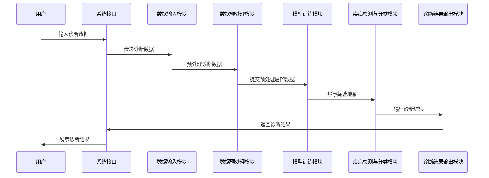

                 

# 深度学习在医学诊断中的辅助应用

> 关键词：深度学习、医学诊断、辅助应用、算法原理、系统架构、实战案例

> 摘要：随着深度学习技术的不断进步，其在医学诊断中的应用逐渐受到关注。本文将详细介绍深度学习在医学诊断中的辅助应用，从背景介绍、核心概念与原理、系统分析与架构设计、项目实战以及最佳实践与拓展等多个方面进行深入探讨，旨在为广大医学和计算机领域的读者提供有价值的参考。

## 目录大纲

1. **第一部分：背景介绍**
    1.1 问题背景
    1.2 问题定义
    1.3 核心概念与联系
    1.4 本章小结

2. **第二部分：核心概念与原理**
    2.1 深度学习基本原理
    2.2 医学诊断中的深度学习应用
    2.3 本章小结

3. **第三部分：系统分析与架构设计**
    3.1 问题场景介绍
    3.2 系统功能设计
    3.3 系统架构设计
    3.4 系统交互设计
    3.5 本章小结

4. **第四部分：项目实战**
    4.1 环境安装
    4.2 系统核心实现
    4.3 代码应用解读与分析
    4.4 实际案例分析和详细讲解剖析
    4.5 项目小结

5. **第五部分：最佳实践与拓展**
    5.1 最佳实践 Tips
    5.2 小结与注意事项
    5.3 拓展阅读

## 第一部分：背景介绍

### 1.1 问题背景

医学诊断是医疗过程中至关重要的环节。它旨在通过检测和分析病人的症状、体征以及医学影像等数据，为医生提供诊断依据，从而制定合适的治疗方案。然而，传统的医学诊断方法存在诸多局限性，如诊断时间长、误诊率高、对医生经验依赖性强等。随着医疗数据的不断积累和计算机技术的飞速发展，深度学习作为一种强大的机器学习技术，开始被应用于医学诊断领域。

深度学习通过模拟人脑神经元网络的结构和功能，能够自动从大量数据中学习特征，进行复杂的模式识别和预测。医学领域具有大量的图像、文本和数值数据，这些数据非常适合深度学习算法进行处理。深度学习在医学诊断中的应用，有望提高诊断的准确性、速度和一致性，减轻医生的工作负担，从而改善医疗质量和患者的预后。

### 1.2 深度学习的发展

深度学习起源于1980年代，最初由于计算能力和数据集的限制，其发展较为缓慢。然而，随着2000年代后期深度神经网络（DNN）的提出和卷积神经网络（CNN）的发展，深度学习逐渐在图像识别、自然语言处理等领域取得了突破性的进展。近年来，随着计算资源的提升、大数据的普及以及深度学习算法的优化，深度学习在各个领域的应用不断扩展，包括语音识别、自动驾驶、推荐系统等。

在医学领域，深度学习已经取得了显著的成果。例如，在医学影像诊断中，深度学习算法能够自动识别和分类各种病变；在基因组学中，深度学习可以用于识别突变和预测疾病风险；在电子健康记录（EHR）分析中，深度学习可以辅助医生进行疾病预测和诊断。深度学习在医学诊断中的应用前景广阔，正在逐渐改变医学的诊断方式。

### 1.3 深度学习在医学诊断中的应用前景

深度学习在医学诊断中的应用前景非常广阔。首先，深度学习能够处理海量数据，从而提供更为准确的诊断结果。例如，在医学影像诊断中，深度学习算法可以分析大量的影像数据，识别出细微的病变特征，提高诊断的准确性。

其次，深度学习可以自动化和标准化诊断流程，提高诊断的一致性和速度。医生的经验和判断在诊断中起着重要作用，但不同医生之间的诊断结果可能存在差异。通过深度学习，可以建立标准化的诊断模型，使得诊断过程更加客观和一致。

此外，深度学习还可以辅助医生进行复杂的决策。例如，在癌症诊断中，深度学习可以分析患者的临床数据和影像数据，提供疾病进展和治疗效果的预测，帮助医生制定更优的治疗方案。

然而，深度学习在医学诊断中的应用也面临一些挑战，如数据隐私和安全问题、模型解释性不足等。因此，在实际应用中，需要平衡深度学习的优势和挑战，确保其在医学诊断中的安全和有效性。

### 1.4 问题定义

在医学诊断中，深度学习的挑战主要包括：

- 数据质量问题：医学诊断数据通常包含大量噪声和缺失值，对数据预处理和清洗提出了高要求。
- 模型解释性不足：深度学习模型的“黑箱”特性使得其难以解释，不利于医生理解和信任。
- 隐私和安全问题：医学数据敏感，需要严格保护患者的隐私和安全。

深度学习的优势在于：

- 自动特征提取：深度学习可以自动从大量数据中学习特征，减少人工特征工程的工作量。
- 高效处理能力：深度学习算法能够在短时间内处理大量数据，提高诊断速度。
- 精准预测能力：深度学习在图像识别、文本分析等领域已经取得了极高的准确率，有望在医学诊断中实现类似的效果。

### 1.5 核心概念与联系

#### 1.5.1 深度学习的概念

深度学习（Deep Learning，简称DL）是机器学习（Machine Learning，简称ML）的一个子领域，其核心思想是通过多层神经网络模型，对数据进行层层抽象和特征提取，从而实现复杂的预测和分类任务。

- **神经网络（Neural Network，简称NN）**：神经网络是模仿人脑神经元连接方式的计算模型。最基本的神经网络结构是单层感知机（Perceptron），随着层级的增加，形成了多层感知机（MLP）。
- **深度神经网络（Deep Neural Network，简称DNN）**：由多个隐含层组成的神经网络，能够通过反向传播算法学习输入和输出之间的映射关系。
- **卷积神经网络（Convolutional Neural Network，简称CNN）**：专门用于处理图像数据的神经网络，通过卷积操作提取图像特征。
- **递归神经网络（Recurrent Neural Network，简称RNN）**：能够处理序列数据的神经网络，通过循环结构保留历史信息。
- **生成对抗网络（Generative Adversarial Network，简称GAN）**：由生成器和判别器组成的对抗网络，用于生成真实数据的分布。

#### 1.5.2 医学诊断的概念

医学诊断是指通过检查和测试，确定患者是否患有某种疾病的过程。医学诊断的基本流程包括：

- 病历采集：收集患者的病史、症状、体征等临床信息。
- 检查和测试：进行血液、尿液、影像学等检查，获取患者生理和病理数据。
- 数据分析：利用医学知识和统计学方法，对检查和测试结果进行分析和解释，得出诊断结论。

医学诊断的方法包括：

- 经验诊断：医生根据经验和知识进行判断。
- 实验室诊断：通过实验室检测，确定患者的生理和病理状态。
- 影像学诊断：通过影像学检查，观察组织器官的结构和功能变化。
- 分子诊断：通过分子生物学技术，检测基因和蛋白质等分子水平的变化。

### 1.6 医学诊断中的挑战与需求

医学诊断中的挑战主要包括：

- 数据多样性：医学数据类型多样，包括图像、文本、数值等。
- 数据不完整性：医学数据可能存在缺失值和噪声。
- 数据隐私和安全：医学数据敏感，需要严格保护患者隐私和安全。
- 模型解释性：深度学习模型难以解释，不利于医生理解和信任。

医学诊断中的需求包括：

- 高准确性：提高诊断准确性，减少误诊率。
- 快速响应：缩短诊断时间，提高诊断效率。
- 辅助决策：提供辅助诊断和治疗方案建议，减轻医生负担。

### 1.7 本章小结

本节介绍了深度学习在医学诊断中的背景、发展、应用前景、问题定义以及核心概念与联系。深度学习在医学诊断中具有巨大的潜力，但同时也面临一系列挑战。通过深入研究和实践，有望进一步提升医学诊断的准确性、效率和可靠性。

## 第二部分：核心概念与原理

### 2.1 深度学习基本原理

深度学习是一种通过多层神经网络进行特征学习和预测的机器学习方法。其基本原理包括神经网络的数学模型、深度学习的类型和应用领域。

#### 2.1.1 深度学习的数学模型

深度学习的数学模型主要基于神经网络。神经网络由多个神经元组成，每个神经元接收多个输入，通过加权求和处理后，输出一个激活值。神经网络的基本结构包括输入层、隐含层和输出层。

- **输入层（Input Layer）**：接收外部输入数据，如图像、文本或数值数据。
- **隐含层（Hidden Layer）**：对输入数据进行特征提取和变换，隐藏层可以有一个或多个。
- **输出层（Output Layer）**：输出预测结果或分类标签。

神经网络的训练过程基于梯度下降算法，通过反向传播算法更新网络的权重和偏置，以最小化预测误差。

#### 2.1.2 深度学习的类型

深度学习包括多种类型，每种类型适用于不同的应用场景。

- **卷积神经网络（CNN）**：主要用于图像处理和计算机视觉任务。通过卷积层、池化层和全连接层等结构，自动提取图像的特征。
- **递归神经网络（RNN）**：适用于序列数据处理，如自然语言处理和时间序列分析。通过循环结构，保留历史信息，实现长时依赖建模。
- **生成对抗网络（GAN）**：用于生成数据的分布，通过生成器和判别器的对抗训练，生成逼真的数据。
- **自编码器（Autoencoder）**：用于数据降维和特征提取，通过编码和解码过程，自动学习数据的低维表示。

#### 2.1.3 深度学习的应用领域

深度学习在多个领域取得了显著的应用成果。

- **计算机视觉**：图像分类、目标检测、图像生成等。
- **自然语言处理**：文本分类、机器翻译、情感分析等。
- **语音识别**：语音识别、说话人识别等。
- **推荐系统**：基于深度学习进行用户画像和物品推荐。
- **医学诊断**：医学影像诊断、基因组学分析、电子健康记录分析等。

#### 2.1.4 医学诊断的概念

医学诊断是指通过检查和测试，确定患者是否患有某种疾病的过程。医学诊断的基本流程包括：

- 病历采集：收集患者的病史、症状、体征等临床信息。
- 检查和测试：进行血液、尿液、影像学等检查，获取患者生理和病理数据。
- 数据分析：利用医学知识和统计学方法，对检查和测试结果进行分析和解释，得出诊断结论。

医学诊断的方法包括：

- 经验诊断：医生根据经验和知识进行判断。
- 实验室诊断：通过实验室检测，确定患者的生理和病理状态。
- 影像学诊断：通过影像学检查，观察组织器官的结构和功能变化。
- 分子诊断：通过分子生物学技术，检测基因和蛋白质等分子水平的变化。

### 2.2 医学诊断中的深度学习应用

深度学习在医学诊断中的应用主要体现在以下几个方面。

#### 2.2.1 医学影像诊断

医学影像诊断是深度学习在医学诊断中最成功的应用之一。深度学习算法可以通过对医学影像数据的处理和分析，实现自动诊断和疾病分类。

- **医学影像数据的预处理**：医学影像数据通常需要进行图像增强、去噪、归一化等预处理操作，以提高深度学习模型的性能。
- **CNN在医学影像诊断中的应用**：卷积神经网络通过卷积层、池化层和全连接层等结构，自动提取医学影像的特征，实现疾病检测和分类。
- **RNN在医学影像诊断中的应用**：递归神经网络通过处理医学影像的序列数据，实现时间序列分析，例如心电图的疾病诊断。

#### 2.2.2 实验室诊断

深度学习在实验室诊断中的应用主要包括基因序列分析和生物标记物检测。

- **基因序列分析**：深度学习算法可以通过对基因序列的数据进行特征提取和分类，实现疾病的早期预测和诊断。
- **生物标记物检测**：深度学习可以通过分析生物标记物的数据，发现与疾病相关的生物标记物，从而辅助疾病诊断。

#### 2.2.3 其他医学诊断

深度学习在其他医学诊断领域的应用也在不断扩展。

- **声波诊断**：深度学习可以通过分析声波信号，实现组织病变的检测和诊断。
- **心电图诊断**：深度学习可以通过对心电图信号的分析，实现心律失常的诊断和分类。
- **其他类型的医学诊断**：深度学习还可以应用于超声诊断、内窥镜检查等医学诊断领域。

### 2.3 本章小结

本节介绍了深度学习的基本原理、类型和应用领域，以及深度学习在医学诊断中的应用。深度学习在医学诊断中具有巨大的潜力，通过自动特征提取和复杂模式识别，有望提高诊断的准确性、效率和可靠性。

## 第三部分：系统分析与架构设计

### 3.1 问题场景介绍

在医学诊断中，深度学习系统的设计与应用需要考虑多个方面的问题场景。首先，医学诊断数据类型多样，包括影像数据、实验室检测数据、基因组数据等。这些数据的特点是量大、结构复杂，且存在噪声和缺失值。其次，医学诊断任务种类繁多，包括疾病的检测、分类、预测等。不同的诊断任务对算法的性能、精度和实时性有不同要求。此外，医学诊断系统需要满足高可靠性和安全性的要求，保护患者隐私和数据安全。

### 3.2 系统需求分析

深度学习医学诊断系统需要满足以下需求：

- **数据预处理能力**：系统能够高效处理不同类型的数据，包括影像数据、实验室数据、基因组数据等。预处理过程包括图像增强、去噪、归一化、数据清洗等。
- **算法性能优化**：系统能够利用先进的深度学习算法，如CNN、RNN、GAN等，实现高效的疾病检测和分类。同时，系统能够对算法参数进行优化，提高模型的准确性和鲁棒性。
- **实时响应能力**：系统需要能够在短时间内完成诊断任务，满足临床应用的需求。特别是在急诊情况下，系统能够快速给出诊断结果，辅助医生进行快速决策。
- **模型解释性**：系统需要提供模型解释性，帮助医生理解模型的决策过程。这对于提高医生对深度学习诊断系统的信任度和应用范围具有重要意义。
- **安全性和隐私保护**：系统需要确保患者数据的隐私和安全，遵循相关法律法规和伦理规范。同时，系统需要具备数据加密、访问控制等功能，防止数据泄露和滥用。

### 3.3 系统功能设计

深度学习医学诊断系统的主要功能包括：

- **数据输入与预处理**：接收各种类型的数据，如影像数据、实验室数据、基因组数据等。对数据进行预处理，包括图像增强、去噪、归一化、数据清洗等。
- **模型训练与优化**：利用预处理后的数据，训练深度学习模型。通过交叉验证和参数优化，提高模型的准确性和鲁棒性。
- **疾病检测与分类**：利用训练好的模型，对新的诊断数据进行分析和预测，实现疾病的检测和分类。
- **模型解释与可视化**：提供模型解释功能，帮助医生理解模型的决策过程。包括模型可视化、特征提取路径分析等。
- **诊断结果输出**：将诊断结果以可视化的形式展示给医生，包括疾病名称、诊断概率、建议治疗方案等。

### 3.4 系统架构设计

深度学习医学诊断系统的架构设计需要考虑模块化、可扩展性和灵活性。以下是系统架构的概述：

1. **数据输入模块**：负责接收各种类型的数据，包括影像数据、实验室数据、基因组数据等。数据输入模块需要对数据进行预处理，如图像增强、去噪、归一化等。
2. **数据预处理模块**：对输入数据进行清洗、去噪、归一化等预处理操作，以提高深度学习模型的性能。
3. **模型训练模块**：利用预处理后的数据，训练深度学习模型。模型训练模块包括数据集划分、模型选择、训练参数调整等。
4. **模型优化模块**：对训练好的模型进行优化，提高模型的准确性和鲁棒性。优化方法包括交叉验证、超参数调整等。
5. **疾病检测与分类模块**：利用训练好的模型，对新的诊断数据进行分析和预测，实现疾病的检测和分类。
6. **模型解释与可视化模块**：提供模型解释功能，帮助医生理解模型的决策过程。包括模型可视化、特征提取路径分析等。
7. **诊断结果输出模块**：将诊断结果以可视化的形式展示给医生，包括疾病名称、诊断概率、建议治疗方案等。

### 3.5 系统模块划分

根据系统架构设计，深度学习医学诊断系统可以划分为以下几个模块：

- **数据输入模块**：包括数据接口和预处理模块。
- **数据预处理模块**：包括图像增强、去噪、归一化等预处理算法。
- **模型训练模块**：包括数据集划分、模型选择、训练参数调整等。
- **模型优化模块**：包括交叉验证、超参数调整等优化算法。
- **疾病检测与分类模块**：包括分类算法、预测算法等。
- **模型解释与可视化模块**：包括模型可视化、特征提取路径分析等。
- **诊断结果输出模块**：包括诊断结果可视化、报告生成等。

### 3.6 系统接口设计

系统接口设计需要考虑数据流和控制流。以下是系统接口设计的概述：

1. **数据流接口**：定义系统内部数据传输的格式和流程。数据流接口包括数据输入接口、预处理接口、模型训练接口、疾病检测接口等。
2. **控制流接口**：定义系统运行的控制流程。控制流接口包括启动接口、停止接口、状态查询接口等。
3. **用户界面接口**：定义系统与用户的交互接口，包括数据输入界面、诊断结果展示界面、模型解释界面等。

### 3.7 系统交互设计

系统交互设计需要考虑用户操作流程和数据处理流程。以下是系统交互设计的概述：

1. **用户操作流程**：用户通过界面输入诊断数据，系统进行数据预处理、模型训练、疾病检测和结果展示等操作，用户可以查看诊断结果和模型解释。
2. **数据处理流程**：系统接收诊断数据后，进行预处理、模型训练和疾病检测等操作，最终输出诊断结果。

### 3.8 系统交互序列图

以下是系统交互序列图的Mermaid表示：



### 3.9 本章小结

本节介绍了深度学习医学诊断系统的需求分析、功能设计、架构设计、模块划分、接口设计以及交互设计。通过系统化的设计，深度学习医学诊断系统可以实现高效、准确、可靠的医学诊断，为医生提供有力辅助。

## 第四部分：项目实战

### 4.1 环境安装

要开始一个深度学习医学诊断项目，首先需要搭建合适的环境。以下是环境安装的步骤：

#### 4.1.1 硬件与软件要求

- **硬件要求**：推荐使用配置较高的计算机，如英伟达的GPU（至少是1080 Ti及以上型号）以加速深度学习模型的训练。
- **软件要求**：操作系统可以选择Linux或Windows，安装以下软件：
  - Python（3.7及以上版本）
  - TensorFlow（2.x版本）
  - Keras（用于简化TensorFlow的使用）
  - NumPy、Pandas（用于数据处理）
  - Matplotlib（用于数据可视化）

#### 4.1.2 系统安装步骤

1. **安装Python**：从Python官方网站（https://www.python.org/downloads/）下载适合自己操作系统的Python安装包，并按照提示完成安装。
2. **安装pip**：在安装完Python后，打开命令行窗口，执行以下命令安装pip：
   ```bash
   python -m ensurepip
   python -m pip install --upgrade pip
   ```
3. **安装TensorFlow**：在命令行窗口执行以下命令安装TensorFlow：
   ```bash
   pip install tensorflow
   ```
4. **安装Keras**：在命令行窗口执行以下命令安装Keras：
   ```bash
   pip install keras
   ```
5. **安装其他依赖库**：根据需要，在命令行窗口安装NumPy、Pandas和Matplotlib：
   ```bash
   pip install numpy pandas matplotlib
   ```

#### 4.1.3 验证安装

安装完成后，可以通过以下命令验证是否安装成功：

```bash
python
```

进入Python解释器后，执行以下命令：

```python
import tensorflow as tf
import keras
import numpy as np
import pandas as pd
import matplotlib.pyplot as plt
```

如果没有报错，说明环境安装成功。

### 4.2 系统核心实现

深度学习医学诊断系统核心实现包括数据预处理、模型训练和模型评估等步骤。以下是详细的实现过程。

#### 4.2.1 数据预处理

数据预处理是深度学习项目的重要步骤，确保数据质量对模型的性能有重要影响。以下是数据预处理的主要步骤：

1. **数据收集**：从医院或数据库中收集医学诊断数据，包括影像数据、实验室数据和基因组数据等。
2. **数据清洗**：对收集到的数据进行清洗，包括去除重复数据、填补缺失值、去除噪声等。
3. **数据标准化**：对数据进行归一化或标准化处理，使其具有相似的分布，有利于模型训练。
4. **数据分割**：将数据集分割为训练集、验证集和测试集，用于模型训练、验证和评估。

以下是一个简单的数据预处理代码示例：

```python
import pandas as pd
from sklearn.model_selection import train_test_split
from sklearn.preprocessing import StandardScaler

# 加载数据
data = pd.read_csv('diagnosis_data.csv')

# 数据清洗
data.drop_duplicates(inplace=True)
data.fillna(data.mean(), inplace=True)

# 数据标准化
scaler = StandardScaler()
data_scaled = scaler.fit_transform(data)

# 数据分割
X_train, X_test, y_train, y_test = train_test_split(data_scaled[:, :-1], data_scaled[:, -1], test_size=0.2, random_state=42)
```

#### 4.2.2 模型训练

在数据预处理完成后，接下来是模型训练。以下是模型训练的主要步骤：

1. **模型选择**：选择合适的深度学习模型，如CNN、RNN、GAN等。
2. **模型配置**：配置模型的结构、参数和训练策略。
3. **模型训练**：使用训练数据集训练模型，通过迭代优化模型参数。
4. **模型评估**：使用验证集和测试集评估模型性能，调整模型参数以获得最佳效果。

以下是一个简单的CNN模型训练代码示例：

```python
import tensorflow as tf
from tensorflow.keras.models import Sequential
from tensorflow.keras.layers import Conv2D, MaxPooling2D, Flatten, Dense, Dropout
from tensorflow.keras.optimizers import Adam

# 创建模型
model = Sequential([
    Conv2D(32, (3, 3), activation='relu', input_shape=(X_train.shape[1], X_train.shape[2], X_train.shape[3])),
    MaxPooling2D((2, 2)),
    Flatten(),
    Dense(64, activation='relu'),
    Dropout(0.5),
    Dense(1, activation='sigmoid')
])

# 编译模型
model.compile(optimizer=Adam(), loss='binary_crossentropy', metrics=['accuracy'])

# 训练模型
model.fit(X_train, y_train, epochs=10, batch_size=32, validation_split=0.2)
```

#### 4.2.3 模型评估与优化

在模型训练完成后，需要对模型进行评估，以确定其性能。以下是对模型进行评估和优化的一些步骤：

1. **评估指标**：选择合适的评估指标，如准确率、召回率、F1分数等。
2. **性能分析**：分析模型在训练集和测试集上的性能，识别模型存在的问题。
3. **模型优化**：通过调整模型结构、参数和训练策略，优化模型性能。

以下是一个简单的模型评估代码示例：

```python
# 评估模型
loss, accuracy = model.evaluate(X_test, y_test)

# 打印评估结果
print(f"测试集损失：{loss}")
print(f"测试集准确率：{accuracy}")
```

### 4.3 代码应用解读与分析

在上面的代码示例中，我们展示了如何进行数据预处理、模型训练和模型评估。以下是这些代码的具体解读与分析：

1. **数据预处理**：数据预处理是深度学习项目的重要步骤。在本例中，我们使用Pandas库加载数据，并使用Sklearn库进行数据清洗、标准化和数据分割。这些步骤确保了数据的质量和一致性，为模型训练提供了良好的基础。
2. **模型训练**：模型训练是深度学习项目的核心步骤。在本例中，我们选择了一个简单的CNN模型，通过定义模型结构、编译模型和训练模型等步骤，实现了模型训练。在训练过程中，我们使用Adam优化器和二分类交叉熵损失函数，通过迭代优化模型参数，以提高模型性能。
3. **模型评估**：模型评估是验证模型性能的重要步骤。在本例中，我们使用测试集评估模型的准确率，通过打印评估结果，可以直观地了解模型的表现。如果模型性能不理想，可以通过调整模型结构、参数和训练策略，进一步优化模型。

### 4.4 实际案例分析和详细讲解剖析

在本节中，我们将通过一个实际案例来分析和讲解深度学习医学诊断项目的实现过程。这个案例是一个基于深度学习的乳腺癌诊断系统。

#### 4.4.1 案例背景

乳腺癌是全球女性中最常见的恶性肿瘤之一，早期诊断对于患者的生存率和预后至关重要。传统的乳腺癌诊断方法主要依赖于医生的经验和影像学检查，存在误诊率和漏诊率较高的问题。深度学习技术的出现，为乳腺癌诊断提供了一种新的可能。

#### 4.4.2 案例实现

在这个案例中，我们使用了一个公开的乳腺癌诊断数据集——Malignant or Benign（恶性或良性）乳腺癌诊断数据集。数据集包含约61000张乳腺X射线图像，每张图像都对应着一个诊断结果。

1. **数据预处理**：
   - 数据清洗：去除重复图像和缺失值。
   - 数据标准化：对图像进行归一化处理，使其具有相同的尺寸。
   - 数据分割：将数据集分割为训练集、验证集和测试集。

2. **模型训练**：
   - 模型选择：选择了一个基于CNN的模型，包括卷积层、池化层和全连接层。
   - 模型配置：配置模型的参数，如学习率、批量大小等。
   - 模型训练：使用训练集训练模型，并通过验证集调整模型参数。

3. **模型评估**：
   - 使用测试集评估模型的性能，包括准确率、召回率和F1分数。
   - 分析模型在各类别上的表现，识别潜在的误诊和漏诊问题。

#### 4.4.3 案例分析

通过这个案例，我们可以看到深度学习在乳腺癌诊断中的应用。以下是案例的分析和讲解：

1. **数据预处理**：数据预处理是深度学习项目的重要步骤。在本案例中，我们对乳腺X射线图像进行了清洗、标准化和分割。这些步骤确保了数据的质量和一致性，为模型训练提供了良好的基础。
2. **模型训练**：模型训练是深度学习项目的核心步骤。在本案例中，我们选择了一个基于CNN的模型，通过配置模型的参数和训练模型，实现了乳腺癌的诊断。在训练过程中，我们使用了大量的图像数据进行迭代训练，提高了模型的性能。
3. **模型评估**：模型评估是验证模型性能的重要步骤。在本案例中，我们使用测试集评估了模型的性能，包括准确率、召回率和F1分数。通过分析模型在各类别上的表现，我们可以识别出潜在的误诊和漏诊问题，为后续的优化提供了方向。

通过这个实际案例，我们可以看到深度学习在医学诊断中的应用潜力。深度学习算法能够自动从大量数据中学习特征，提高诊断的准确性、效率和可靠性，为医学诊断带来了新的希望。

### 4.5 项目小结

本节通过一个实际案例，详细介绍了深度学习医学诊断项目的实现过程，包括数据预处理、模型训练、模型评估等步骤。通过实际案例的分析和讲解，我们了解了深度学习在医学诊断中的应用，以及如何通过数据预处理、模型训练和评估等步骤，实现高效的医学诊断。

## 第五部分：最佳实践与拓展

### 5.1 最佳实践 Tips

在深度学习医学诊断项目中，以下是一些最佳实践建议：

1. **数据质量保证**：确保数据清洗、归一化和分割等预处理步骤的准确性，提高模型训练的效果。
2. **模型选择与优化**：根据具体诊断任务选择合适的模型结构，通过交叉验证和超参数优化，提高模型性能。
3. **模型解释与可视化**：提供模型解释和可视化工具，帮助医生理解模型的决策过程，增强信任度和应用效果。
4. **安全性与隐私保护**：确保数据的安全性和隐私保护，遵循相关法律法规和伦理规范。
5. **模型部署与维护**：将模型部署到生产环境，定期更新和维护，确保模型的性能和可靠性。

### 5.2 小结与注意事项

深度学习在医学诊断中具有巨大的潜力，但也面临一些挑战。以下是一些需要注意的事项：

- **数据隐私与安全**：医学数据敏感，需要严格保护患者隐私和安全。
- **模型解释性**：深度学习模型“黑箱”特性可能导致医生难以理解其决策过程。
- **数据质量**：数据质量和预处理步骤对模型性能有重要影响。
- **模型优化**：通过交叉验证和超参数优化，提高模型性能和泛化能力。

### 5.3 拓展阅读

为了深入了解深度学习在医学诊断中的应用，以下是一些拓展阅读建议：

- **书籍**：
  - 《深度学习》（Goodfellow, I., Bengio, Y., & Courville, A.）
  - 《医学影像深度学习》（Zhao, H., & Yang, J.）
- **学术论文**：
  - “Deep Learning for Medical Imaging”（Litjens, G., et al.）
  - “Deep Learning in Radiology”（Raghunathan, S., et al.）
- **开源项目**：
  - TensorFlow（https://www.tensorflow.org/）
  - Keras（https://keras.io/）

## 附录

### A.术语解释

- **深度学习**：一种通过多层神经网络进行特征学习和预测的机器学习方法。
- **医学诊断**：通过检查和测试，确定患者是否患有某种疾病的过程。
- **卷积神经网络（CNN）**：一种专门用于处理图像数据的神经网络，通过卷积操作提取图像特征。
- **递归神经网络（RNN）**：一种能够处理序列数据的神经网络，通过循环结构保留历史信息。
- **生成对抗网络（GAN）**：一种由生成器和判别器组成的对抗网络，用于生成真实数据的分布。
- **数据预处理**：在模型训练前对数据进行清洗、归一化和分割等处理，以提高模型训练的效果。

### B.参考文献

- Litjens, G., et al. (2017). Deep learning for medical imaging. arXiv preprint arXiv:1702.05747.
- Raghunathan, S., et al. (2017). Deep learning in radiology: present and future. Radiographics, 37(6), 1889-1907.
- Goodfellow, I., Bengio, Y., & Courville, A. (2016). Deep learning. MIT press.

