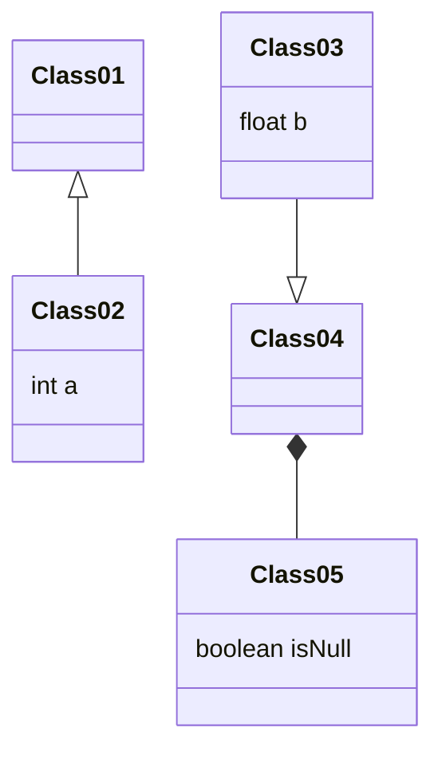
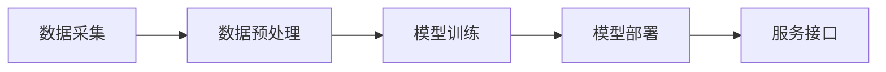
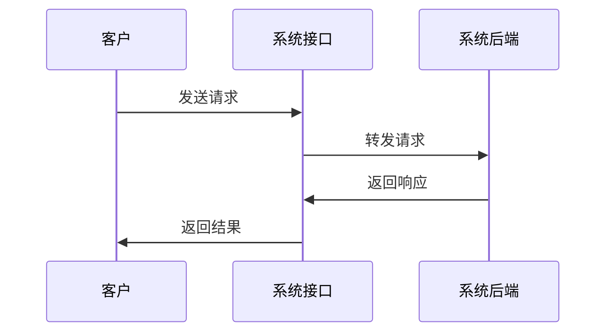

                 


# 深度学习在图像识别中的最新进展

关键词：图像识别、深度学习、卷积神经网络（CNN）、神经网络、算法优化、人工智能应用

摘要：本文从深度学习在图像识别中的应用出发，详细阐述了图像识别的重要性、深度学习的理论基础、CNN算法原理及其最新进展，并通过实例展示了深度学习在图像识别中的实际应用和系统设计。文章旨在为读者提供一个全面、深入的视角，了解当前深度学习在图像识别领域的最新技术和趋势。

## 引言：图像识别与深度学习的融合

### 1.1 图像识别的重要性

图像识别技术是计算机视觉领域的重要分支，它通过计算机算法对图像或视频中的内容进行识别、分类和标注。图像识别技术广泛应用于各种领域，如医疗诊断、自动驾驶、安全监控、金融风控等。例如，在医疗诊断中，图像识别可以帮助医生快速识别病变区域；在自动驾驶中，图像识别是实现车辆自动驾驶的关键技术之一；在安全监控中，图像识别可以实时识别异常行为，提高安全预警能力。

然而，传统图像识别技术受限于计算能力和算法复杂性，存在识别准确率低、实时性差等问题。随着深度学习技术的发展，深度学习在图像识别中的应用逐渐成熟，为图像识别领域带来了新的突破。

### 1.2 深度学习在图像识别中的应用

深度学习是一种基于多层的神经网络模型，通过模拟人脑神经元之间的连接和交互来实现对数据的自动学习和分类。深度学习在图像识别中的应用主要包括卷积神经网络（CNN）和循环神经网络（RNN）。CNN通过多个卷积层、池化层和全连接层，实现对图像特征的提取和分类；RNN则通过时间序列分析，实现对视频数据的识别。

### 1.3 最新进展概述

近年来，深度学习在图像识别领域取得了显著的进展。首先，在算法层面，研究人员提出了许多新的深度学习模型，如ResNet、Inception、MobileNet等，这些模型在图像分类、目标检测和图像分割等方面都取得了很好的效果。其次，在硬件层面，GPU和TPU等高性能计算设备的普及，为深度学习模型的训练和部署提供了强大的计算支持。最后，在应用层面，深度学习在图像识别领域的应用场景越来越广泛，从传统的计算机视觉任务到新兴的增强现实（AR）、虚拟现实（VR）等领域，都取得了显著的成果。

## 核心概念与理论基础

### 2.1 深度学习的理论基础

深度学习是一种基于多层神经网络的结构，它通过多个隐藏层的堆叠，实现对输入数据的逐层抽象和特征提取。深度学习的核心在于其能够自动学习数据的特征表示，从而实现复杂的分类和回归任务。

#### 2.1.1 神经网络的基本原理

神经网络是由大量神经元组成的计算模型，每个神经元通过加权连接与其他神经元相连。当输入数据通过神经网络传播时，每个神经元会对输入数据进行加权求和，并通过激活函数进行非线性变换，从而产生输出。神经网络的训练过程就是不断调整神经元之间的权重，使得网络能够对输入数据进行正确的分类或预测。

#### 2.1.2 卷积神经网络（CNN）

卷积神经网络是一种专门用于处理图像数据的神经网络，它在神经网络的基础上引入了卷积操作和池化操作，能够有效地提取图像的特征。

##### 2.1.2.1 CNN的结构

CNN主要由卷积层、池化层和全连接层组成。卷积层通过卷积操作提取图像的局部特征；池化层通过下采样操作减少特征图的尺寸，提高模型的计算效率；全连接层则将特征图映射到具体的类别或标签。

##### 2.1.2.2 CNN的工作原理

CNN的工作原理可以分为两个阶段：特征提取和分类。在特征提取阶段，CNN通过卷积操作提取图像的局部特征，然后通过池化操作降低特征图的维度。在分类阶段，CNN将特征图输入到全连接层，通过全连接层的计算，输出分类结果。

### 2.2 图像识别的基本概念

图像识别是指通过计算机算法对图像中的内容进行识别和分类。图像识别的基本概念包括图像特征提取、图像分类和标注。

#### 2.2.1 图像特征提取

图像特征提取是指从图像中提取出能够描述图像内容的关键特征。常见的图像特征提取方法包括颜色特征、纹理特征和形状特征。

#### 2.2.2 图像分类与标注

图像分类是指将图像分为不同的类别。常见的图像分类算法包括支持向量机（SVM）、决策树（DT）和神经网络（NN）等。图像标注是指对图像中的对象进行标注，以便后续处理和分析。

## 算法原理讲解

### 3.1 卷积神经网络（CNN）算法详解

#### 3.1.1 CNN的结构与功能

CNN主要由卷积层、池化层和全连接层组成。卷积层通过卷积操作提取图像的特征；池化层通过下采样操作降低特征图的维度；全连接层将特征图映射到具体的类别或标签。

##### 3.1.1.1 卷积层

卷积层是CNN的核心部分，它通过卷积操作提取图像的局部特征。卷积操作是指将卷积核（也称为滤波器）在图像上滑动，并对每个位置的像素进行加权求和，然后通过激活函数进行非线性变换。

##### 3.1.1.2 池化层

池化层通过下采样操作降低特征图的维度，从而提高模型的计算效率。常见的池化操作包括最大值池化和平均值池化。

##### 3.1.1.3 全连接层

全连接层将特征图映射到具体的类别或标签。它通过将特征图展平为一维向量，然后与类别标签进行一一对应。

#### 3.1.2 CNN算法的数学模型

CNN算法的数学模型包括卷积操作、激活函数、损失函数和优化算法。

##### 3.1.2.1 激活函数

激活函数是对卷积操作的输出进行非线性变换，常见的激活函数包括ReLU（Rectified Linear Unit）和Sigmoid函数。

##### 3.1.2.2 损失函数与优化算法

损失函数用于衡量模型预测值与真实值之间的差距，常见的损失函数包括交叉熵损失函数和均方误差损失函数。优化算法用于调整模型参数，常见的优化算法包括梯度下降和Adam优化器。

#### 3.1.3 CNN算法的Python实现

以下是一个简单的CNN算法实现的Python代码示例：

```python
import tensorflow as tf
from tensorflow.keras.models import Sequential
from tensorflow.keras.layers import Conv2D, MaxPooling2D, Flatten, Dense

model = Sequential()
model.add(Conv2D(filters=32, kernel_size=(3, 3), activation='relu', input_shape=(28, 28, 1)))
model.add(MaxPooling2D(pool_size=(2, 2)))
model.add(Conv2D(filters=64, kernel_size=(3, 3), activation='relu'))
model.add(MaxPooling2D(pool_size=(2, 2)))
model.add(Flatten())
model.add(Dense(units=64, activation='relu'))
model.add(Dense(units=10, activation='softmax'))

model.compile(optimizer='adam', loss='categorical_crossentropy', metrics=['accuracy'])
model.fit(x_train, y_train, epochs=10, batch_size=32)
```

### 3.2 优化与调整

#### 3.2.1 数据增强

数据增强是指通过多种方式对训练数据进行变换，从而增加模型的泛化能力。常见的数据增强方法包括随机裁剪、旋转、缩放等。

#### 3.2.2 超参数调优

超参数调优是指通过调整模型的超参数，如学习率、批次大小、卷积核大小等，来提高模型的性能。常见的超参数调优方法包括网格搜索和随机搜索。

#### 3.2.3 模型训练与验证

模型训练与验证是指通过训练数据和验证数据来评估模型的性能。训练数据用于训练模型，验证数据用于评估模型的泛化能力。常见的评估指标包括准确率、召回率、F1值等。

## 应用与案例分析

### 3.3.1 自动驾驶

自动驾驶是深度学习在图像识别领域的重要应用之一。自动驾驶系统需要通过图像识别技术来识别道路标志、行人和车辆等交通元素，从而实现自主驾驶。

#### 3.3.1.1 应用场景

自动驾驶的应用场景包括城市道路、高速公路和复杂环境等。

#### 3.3.1.2 案例分析

特斯拉的自动驾驶系统通过使用深度学习算法来识别道路标志和行人的位置，从而实现自主驾驶。根据特斯拉公布的数据，其自动驾驶系统能够在复杂环境中保持稳定行驶，降低了交通事故的风险。

### 3.3.2 医疗诊断

医疗诊断是深度学习在图像识别领域的另一个重要应用。通过深度学习算法，医生可以更快速、准确地诊断疾病。

#### 3.3.2.1 应用场景

医疗诊断的应用场景包括肿瘤检测、骨折诊断、视网膜病变等。

#### 3.3.2.2 案例分析

IBM的Watson系统通过深度学习算法对医疗影像进行分析，能够准确诊断肿瘤，帮助医生制定更有效的治疗方案。根据研究表明，Watson系统能够提高医生的诊断准确率，降低误诊率。

## 系统设计与实现

### 4.1 系统功能设计

系统功能设计包括图像识别、分类和标注等功能。

#### 4.1.1 领域模型

领域模型主要包括图像、标签、分类器等实体。



### 4.2 系统架构设计

系统架构设计包括数据采集、预处理、模型训练、模型部署等模块。



### 4.3 系统接口设计与交互

系统接口设计包括API接口、Web界面等。



## 项目实战

### 5.1 环境安装

安装深度学习环境，包括TensorFlow、Keras等。

```bash
pip install tensorflow
pip install keras
```

### 5.2 系统核心实现

实现图像识别系统，包括数据预处理、模型训练、模型评估等。

```python
from tensorflow.keras.models import Sequential
from tensorflow.keras.layers import Conv2D, MaxPooling2D, Flatten, Dense

model = Sequential()
model.add(Conv2D(filters=32, kernel_size=(3, 3), activation='relu', input_shape=(28, 28, 1)))
model.add(MaxPooling2D(pool_size=(2, 2)))
model.add(Conv2D(filters=64, kernel_size=(3, 3), activation='relu'))
model.add(MaxPooling2D(pool_size=(2, 2)))
model.add(Flatten())
model.add(Dense(units=64, activation='relu'))
model.add(Dense(units=10, activation='softmax'))

model.compile(optimizer='adam', loss='categorical_crossentropy', metrics=['accuracy'])
model.fit(x_train, y_train, epochs=10, batch_size=32)
```

### 5.3 代码应用解读与分析

对系统核心代码进行解读和分析，包括数据预处理、模型训练和模型评估等。

### 5.4 实际案例分析和详细讲解

通过实际案例，如医学影像识别、自动驾驶等，对深度学习在图像识别中的应用进行详细讲解。

### 5.5 项目小结

对项目进行总结，包括项目成果、不足之处和改进方向。

## 最佳实践 tips

- 数据预处理：合理的数据预处理可以提高模型的训练效果和泛化能力。
- 超参数调优：合理调整超参数可以提升模型的性能。
- 模型评估：选择合适的评估指标可以更准确地衡量模型的性能。

## 小结

本文从深度学习在图像识别中的应用出发，详细阐述了图像识别的重要性、深度学习的理论基础、CNN算法原理及其最新进展，并通过实例展示了深度学习在图像识别中的实际应用和系统设计。文章旨在为读者提供一个全面、深入的视角，了解当前深度学习在图像识别领域的最新技术和趋势。

## 注意事项

- 在实际应用中，需要根据具体场景调整模型结构和参数。
- 深度学习模型训练需要大量数据和计算资源，需合理分配资源。

## 拓展阅读

- [1] Goodfellow, I., Bengio, Y., & Courville, A. (2016). *Deep Learning*. MIT Press.
- [2] Krizhevsky, A., Sutskever, I., & Hinton, G. E. (2012). *ImageNet classification with deep convolutional neural networks*. In Advances in neural information processing systems (pp. 1097-1105).
- [3] Simonyan, K., & Zisserman, A. (2014). *Very deep convolutional networks for large-scale image recognition*. arXiv preprint arXiv:1409.1556.

## 作者信息

作者：AI天才研究院/AI Genius Institute & 禅与计算机程序设计艺术 /Zen And The Art of Computer Programming

