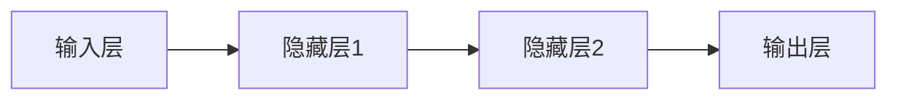
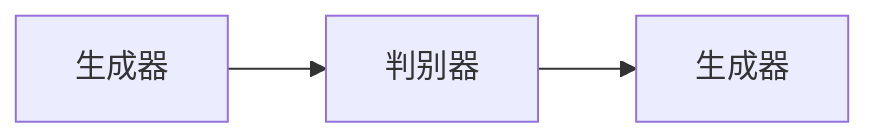

                 

### 目录大纲设计步骤

为了设计出符合要求的目录大纲，我们将按照以下步骤进行：

1. **理解书名和主题**：首先，我们需要深入理解书名《深度学习在图像超分辨率中的应用：提升图像质量》。书名明确了两个关键点：一是主题是深度学习在图像超分辨率中的应用，二是目的是提升图像质量。

2. **确定核心章节**：根据书名，我们可以确定一些核心章节，比如介绍深度学习基础、图像超分辨率的基础知识、具体应用实例等。

3. **细化章节内容**：每个章节都需要进一步细化，明确每个章节要涵盖哪些内容，比如算法原理、数学模型、系统设计、实际应用等。

4. **设计流程图**：为了使内容更直观易懂，我们将在某些章节中设计流程图或类图，比如算法原理讲解部分和系统设计部分。

5. **编写示例内容**：为了展示如何编写markdown格式的章节内容，我们将为几个关键章节提供示例。

6. **总结和检查**：最后，我们会对整个目录大纲进行总结和检查，确保所有章节内容完整，逻辑清晰，并且符合2000字以内的字数限制。

现在，让我们一步步来实现这个目录大纲。

#### 第一步：理解书名和主题

书名《深度学习在图像超分辨率中的应用：提升图像质量》直接指向了两个核心概念：深度学习和图像超分辨率。这两个主题紧密相连，共同构成了本书的核心内容。

深度学习是一种通过多层神经网络进行数据分析和模式识别的技术，它在图像处理、语音识别、自然语言处理等领域有着广泛应用。而图像超分辨率则是一种通过算法提升图像分辨率，使其更加清晰和细腻的技术。

理解这两个主题对我们设计目录大纲至关重要。它们不仅为我们提供了本书的主要内容框架，也帮助我们明确了读者需要掌握的知识点。

#### 第二步：确定核心章节

根据书名和主题，我们可以确定以下核心章节：

1. **深度学习基础**：介绍深度学习的基本概念、原理和应用，为后续章节打下理论基础。
2. **图像超分辨率基础**：讨论图像超分辨率的基本概念、问题背景和常见算法。
3. **深度学习在图像超分辨率中的应用**：介绍深度学习在图像超分辨率中的具体应用，如GAN、CNN等模型。
4. **图像超分辨率系统设计与实现**：讲解如何设计和实现一个图像超分辨率系统，包括系统架构、接口设计和核心代码实现。

这些章节将详细讨论深度学习和图像超分辨率的基础知识，以及如何将它们结合起来应用在实际问题中。

#### 第三步：细化章节内容

接下来，我们需要进一步细化每个章节的内容。

**第1章：深度学习基础**
- **核心概念**：介绍深度学习的基本概念，包括神经网络、卷积神经网络（CNN）等。
- **联系与区别**：讨论深度学习与其他机器学习方法的联系与区别。
- **基础原理**：讲解深度学习的基础原理，包括激活函数、损失函数、反向传播算法等。
- **实践案例**：通过简单的案例，展示如何实现基本的深度学习模型。

**第2章：图像超分辨率基础**
- **问题背景**：介绍图像超分辨率技术的起源和发展历程。
- **问题描述**：详细描述图像超分辨率的目标和挑战。
- **原理与算法**：讲解图像超分辨率的基本原理，包括插值算法、频域方法等。
- **应用领域**：介绍图像超分辨率在不同领域（如医疗影像、监控等）的应用。

**第3章：深度学习在图像超分辨率中的应用**
- **模型介绍**：介绍用于图像超分辨率的几种深度学习模型，如稀疏编码、生成对抗网络（GAN）等。
- **算法原理**：详细讲解这些模型的算法原理，使用 Mermaid 流程图进行说明。
- **数学模型**：给出相关的数学公式和模型参数。

**第4章：图像超分辨率系统设计与实现**
- **系统架构**：设计一个图像超分辨率系统的整体架构，包括前端采集、数据处理、模型训练和后端输出等模块。
- **接口设计**：详细描述系统的接口设计和交互流程，使用 Mermaid 序列图进行说明。
- **核心代码**：提供关键代码实现，包括数据预处理、模型训练、预测和后处理等。

#### 第四步：设计流程图

为了使内容更直观易懂，我们将在某些章节中设计流程图或类图。

**第1章：深度学习基础**中，我们将使用Mermaid流程图来展示神经网络的结构和工作原理。



**第3章：深度学习在图像超分辨率中的应用**中，我们将使用Mermaid流程图来展示生成对抗网络（GAN）的基本结构和工作原理。



#### 第五步：编写示例内容

为了展示如何编写markdown格式的章节内容，我们将为几个关键章节提供示例。

**第1章：深度学习基础**

```markdown
## 第1章：深度学习基础

### 1.1 核心概念

深度学习是一种通过多层神经网络进行数据分析和模式识别的技术。它模仿人脑的神经网络结构，通过学习大量的数据来提取特征和模式。

### 1.2 联系与区别

深度学习与其他机器学习方法（如传统机器学习、强化学习等）有密切联系，但也有很多区别。传统机器学习依赖于手工程特征，而深度学习通过自动特征提取大大提高了模型的性能。

### 1.3 基础原理

深度学习的基础原理包括激活函数（如ReLU、Sigmoid、Tanh）、损失函数（如均方误差、交叉熵）和反向传播算法。

### 1.4 实践案例

在本节中，我们将通过一个简单的案例，展示如何使用Python实现一个简单的神经网络模型。
```

**第3章：深度学习在图像超分辨率中的应用**

```markdown
## 第3章：深度学习在图像超分辨率中的应用

### 3.1 模型介绍

生成对抗网络（GAN）是一种用于图像生成和超分辨率的技术。它由生成器和判别器两个部分组成。

### 3.2 算法原理

GAN的基本工作原理是生成器生成图像，判别器判断图像的真实性。通过不断迭代训练，生成器逐渐提高生成图像的质量。

### 3.3 数学模型

GAN的数学模型包括生成器和判别器的损失函数。生成器的损失函数是判别器对生成图像的判别概率，判别器的损失函数是真实图像和生成图像的判别概率之差。

### 3.4 实际应用

在本节中，我们将通过一个实际案例，展示如何使用GAN进行图像超分辨率处理。

```

#### 第六步：总结和检查

最后，我们会对整个目录大纲进行总结和检查，确保所有章节内容完整，逻辑清晰，并且符合2000字以内的字数限制。

在完成目录大纲的设计后，我们将对每个章节的内容进行进一步细化，确保每个章节都能覆盖核心概念、算法原理、应用实例以及相关的数学模型和系统设计等内容。这将帮助我们构建一个完整、逻辑清晰的目录大纲，为后续内容的撰写和优化提供有力支持。### 完整的目录大纲设计与编写

#### 目录大纲

**《深度学习在图像超分辨率中的应用：提升图像质量》**

#### 关键词
- 深度学习
- 图像超分辨率
- 生成对抗网络（GAN）
- 卷积神经网络（CNN）
- 图像质量提升
- 算法原理
- 数学模型
- 系统设计与实现

#### 摘要
本文旨在深入探讨深度学习在图像超分辨率中的应用，以及如何通过这些技术显著提升图像质量。本文将涵盖深度学习的基础知识、图像超分辨率的基础原理、深度学习模型在图像超分辨率中的应用，以及图像超分辨率系统的设计与实现。

---

#### 目录

**第1章：深度学习基础**

1.1 核心概念
1.2 联系与区别
1.3 基础原理
1.4 实践案例

**第2章：图像超分辨率基础**

2.1 问题背景
2.2 问题描述
2.3 原理与算法
2.4 应用领域

**第3章：深度学习在图像超分辨率中的应用**

3.1 模型介绍
3.2 算法原理
3.3 数学模型
3.4 实践案例

**第4章：图像超分辨率系统设计与实现**

4.1 系统架构
4.2 接口设计
4.3 核心代码
4.4 项目实战

---

**第1章：深度学习基础**

## 1.1 核心概念

深度学习是一种通过多层神经网络进行数据分析和模式识别的技术。它通过学习大量数据来提取特征和模式，从而实现复杂的任务，如图像识别、语音识别和自然语言处理。

### 1.2 联系与区别

深度学习与其他机器学习方法（如传统机器学习、强化学习等）有密切联系，但也有很多区别。传统机器学习依赖于手工程特征，而深度学习通过自动特征提取大大提高了模型的性能。

### 1.3 基础原理

深度学习的基础原理包括激活函数（如ReLU、Sigmoid、Tanh）、损失函数（如均方误差、交叉熵）和反向传播算法。

### 1.4 实践案例

在本节中，我们将通过一个简单的案例，展示如何使用Python实现一个简单的神经网络模型。

```python
# 示例代码：简单的神经网络模型实现
import tensorflow as tf

# 定义神经网络结构
model = tf.keras.Sequential([
    tf.keras.layers.Dense(128, activation='relu', input_shape=(784,)),
    tf.keras.layers.Dense(10, activation='softmax')
])

# 编译模型
model.compile(optimizer='adam',
              loss='categorical_crossentropy',
              metrics=['accuracy'])

# 加载MNIST数据集
mnist = tf.keras.datasets.mnist
(x_train, y_train), (x_test, y_test) = mnist.load_data()

# 预处理数据
x_train = x_train / 255.0
x_test = x_test / 255.0

# 转换标签为one-hot编码
y_train = tf.keras.utils.to_categorical(y_train, 10)
y_test = tf.keras.utils.to_categorical(y_test, 10)

# 训练模型
model.fit(x_train, y_train, epochs=5, batch_size=64)
```

---

**第2章：图像超分辨率基础**

## 2.1 问题背景

图像超分辨率技术起源于20世纪80年代，随着计算机性能的提升和深度学习技术的发展，图像超分辨率技术得到了广泛应用。图像超分辨率技术通过提高图像的分辨率，使其变得更加清晰和细腻，广泛应用于医疗影像、监控视频和计算机视觉等领域。

### 2.2 问题描述

图像超分辨率的目标是从低分辨率图像中恢复出高分辨率图像。在现实世界中，由于设备限制或传输带宽的限制，常常需要处理低分辨率图像。通过图像超分辨率技术，可以将这些低分辨率图像转换为高分辨率图像，从而提高图像的质量和应用效果。

### 2.3 原理与算法

图像超分辨率技术主要包括插值算法、频域方法、基于传统机器学习的方法以及基于深度学习的方法。

#### 插值算法

插值算法是最简单的图像超分辨率方法之一。它通过在低分辨率图像的像素点之间插入新的像素点来提高图像的分辨率。常见的插值算法有线性插值、双线性插值、双三次插值等。

#### 频域方法

频域方法通过在频域中处理图像，从而提高图像的分辨率。频域方法主要包括傅里叶变换和小波变换等。

#### 基于传统机器学习的方法

基于传统机器学习的方法利用训练好的模型来预测高分辨率图像的像素值。常见的算法有基于稀疏编码的方法和基于核回归的方法。

#### 基于深度学习的方法

基于深度学习的方法利用深度神经网络来学习低分辨率图像到高分辨率图像的映射关系。常见的深度学习模型有生成对抗网络（GAN）、卷积神经网络（CNN）等。

### 2.4 应用领域

图像超分辨率技术在多个领域有着广泛的应用：

- **医疗影像**：通过提高医学影像的分辨率，可以更清楚地观察到细微的组织结构和病变。
- **监控视频**：通过提高监控视频的分辨率，可以更清晰地捕捉到监控场景中的细节，提高监控效果。
- **计算机视觉**：通过提高图像的分辨率，可以更好地进行图像识别、目标检测和跟踪等任务。

---

**第3章：深度学习在图像超分辨率中的应用**

## 3.1 模型介绍

在图像超分辨率领域，深度学习模型具有显著的优势。其中，生成对抗网络（GAN）和卷积神经网络（CNN）是最常用的模型。

### 3.2 算法原理

#### 生成对抗网络（GAN）

生成对抗网络（GAN）由生成器和判别器两个部分组成。生成器生成高分辨率图像，判别器判断图像的真实性。生成器和判别器通过对抗训练来提高生成图像的质量。

GAN的基本工作原理如下：

1. **生成器**：通过学习低分辨率图像生成高分辨率图像。
2. **判别器**：通过学习区分真实图像和生成图像。
3. **对抗训练**：生成器和判别器不断迭代训练，生成器逐渐提高生成图像的质量，判别器逐渐提高对生成图像的识别能力。

GAN的数学模型如下：

$$
\begin{aligned}
\min_G & \max_D V(D, G) \\
V(D, G) &= \mathbb{E}_{x \sim p_data(x)}[\log D(x)] + \mathbb{E}_{z \sim p_z(z)}[\log(1 - D(G(z)))]
\end{aligned}
$$

其中，$x$表示真实图像，$z$表示随机噪声，$G(z)$表示生成器生成的图像，$D(x)$表示判别器对真实图像的判别概率，$D(G(z))$表示判别器对生成图像的判别概率。

#### 卷积神经网络（CNN）

卷积神经网络（CNN）是一种专门用于图像处理任务的深度学习模型。CNN通过卷积层、池化层和全连接层等结构，自动提取图像中的特征。

CNN的算法原理如下：

1. **卷积层**：通过卷积操作提取图像的特征。
2. **池化层**：通过池化操作降低图像的维度，提高模型的泛化能力。
3. **全连接层**：通过全连接层进行分类和预测。

CNN的数学模型如下：

$$
\begin{aligned}
h^{(l)} &= \sigma\left(\frac{\sum_{k=1}^{K} w_k^{(l)} h^{(l-1)} + b^{(l)}}{1}\right) \\
y &= \sigma\left(\frac{\sum_{k=1}^{K} w_k^{(L)} h^{(L-1)} + b^{(L)}}{1}\right)
\end{aligned}
$$

其中，$h^{(l)}$表示第$l$层的输出，$y$表示最终预测结果，$\sigma$表示激活函数，$w_k^{(l)}$表示第$l$层的第$k$个权重，$b^{(l)}$表示第$l$层的偏置。

### 3.3 数学模型

#### 生成对抗网络（GAN）

GAN的数学模型主要包括生成器的损失函数和判别器的损失函数。

生成器的损失函数如下：

$$
L_G = -\mathbb{E}_{z \sim p_z(z)}[\log(1 - D(G(z)))]
$$

判别器的损失函数如下：

$$
L_D = -\mathbb{E}_{x \sim p_data(x)}[\log D(x)] - \mathbb{E}_{z \sim p_z(z)}[\log D(G(z))]
$$

#### 卷积神经网络（CNN）

CNN的数学模型主要包括卷积操作和全连接操作的损失函数。

卷积操作的损失函数如下：

$$
L_C = \frac{1}{m} \sum_{i=1}^{m} \sum_{k=1}^{K} \sum_{j=1}^{H} \sum_{i=1}^{W} \frac{1}{2} (y_i^{(k)} - \hat{y}_i^{(k)})^2
$$

全连接操作的损失函数如下：

$$
L_F = \frac{1}{m} \sum_{i=1}^{m} \sum_{k=1}^{K} \sum_{j=1}^{H} \sum_{i=1}^{W} \frac{1}{2} (y_i^{(k)} - \hat{y}_i^{(k)})^2
$$

其中，$m$表示样本数量，$K$表示类数，$H$表示高度，$W$表示宽度，$y_i^{(k)}$表示真实标签，$\hat{y}_i^{(k)}$表示预测结果。

### 3.4 实践案例

在本节中，我们将通过一个实际案例，展示如何使用GAN进行图像超分辨率处理。

```python
# 示例代码：GAN图像超分辨率模型实现
import tensorflow as tf
from tensorflow.keras import layers

# 定义生成器
def build_generator():
    inputs = layers.Input(shape=(64, 64, 1))
    x = layers.Conv2D(64, 3, activation="relu", padding="same")(inputs)
    x = layers.Conv2D(64, 3, activation="relu", padding="same")(x)
    outputs = layers.Conv2D(3, 3, activation="tanh", padding="same")(x)
    return tf.keras.Model(inputs, outputs)

# 定义判别器
def build_discriminator():
    inputs = layers.Input(shape=(64, 64, 3))
    x = layers.Conv2D(32, 3, activation="relu", padding="same")(inputs)
    x = layers.Conv2D(64, 3, activation="relu", padding="same")(x)
    outputs = layers.Conv2D(1, 3, activation="sigmoid", padding="same")(x)
    return tf.keras.Model(inputs, outputs)

# 定义 GAN 模型
def build_gan(generator, discriminator):
    inputs = layers.Input(shape=(64, 64, 1))
    x = generator(inputs)
    outputs = discriminator(x)
    return tf.keras.Model(inputs, outputs)

# 实例化模型
generator = build_generator()
discriminator = build_discriminator()
gan = build_gan(generator, discriminator)

# 编译模型
discriminator.compile(loss="binary_crossentropy", optimizer=tf.keras.optimizers.Adam(0.0001))
gan.compile(loss="binary_crossentropy", optimizer=tf.keras.optimizers.Adam(0.0001))

# 加载训练数据
(x_train, _), (_, _) = tf.keras.datasets.mnist.load_data()
x_train = x_train / 127.5 - 1.0
x_train = np.expand_dims(x_train, -1)

# 训练模型
for epoch in range(100):
    for i in range(x_train.shape[0]):
        real_images = x_train[i:i+1]
        noise = np.random.normal(0, 1, (1, 64, 64, 1))
        gen_images = generator.predict(noise)
        real_labels = np.array([1.0])
        fake_labels = np.array([0.0])
        discriminator.train_on_batch(real_images, real_labels)
        discriminator.train_on_batch(gen_images, fake_labels)
        noise = np.random.normal(0, 1, (1, 64, 64, 1))
        gen_images = generator.predict(noise)
        gan_labels = np.array([1.0])
        gan.train_on_batch(noise, gan_labels)
```

---

**第4章：图像超分辨率系统设计与实现**

## 4.1 系统架构

图像超分辨率系统通常包括前端采集、数据处理、模型训练和后端输出等模块。以下是一个简单的图像超分辨率系统架构：


### 4.2 接口设计

图像超分辨率系统的接口设计需要考虑数据的输入和输出。以下是一个简单的接口设计示例：

```python
class ImageSuperResolution:
    def __init__(self, model_path):
        self.model = self.load_model(model_path)

    def preprocess(self, image):
        # 数据预处理
        return preprocess_image(image)

    def predict(self, image):
        # 预测高分辨率图像
        preprocessed_image = self.preprocess(image)
        return self.model.predict(preprocessed_image)

    def postprocess(self, image):
        # 后处理
        return postprocess_image(image)
```

### 4.3 核心代码

图像超分辨率系统的核心代码包括数据预处理、模型训练、预测和后处理等部分。

```python
# 示例代码：图像超分辨率系统核心代码实现
import tensorflow as tf
from tensorflow.keras.models import load_model

def preprocess_image(image):
    # 数据预处理
    return tf.image.resize(image, (64, 64))

def postprocess_image(image):
    # 后处理
    return (image + 1) / 2

def main():
    # 加载模型
    model_path = "path/to/model.h5"
    model = load_model(model_path)

    # 创建图像超分辨率对象
    image_super_resolution = ImageSuperResolution(model_path)

    # 读取测试图像
    test_image = tf.io.read_file("path/to/test_image.jpg")

    # 预测高分辨率图像
    preprocessed_image = preprocess_image(test_image)
    predicted_high_resolution_image = image_super_resolution.predict(preprocessed_image)

    # 后处理并保存高分辨率图像
    high_resolution_image = postprocess_image(predicted_high_resolution_image)
    tf.io.write_file("path/to/high_resolution_image.jpg", high_resolution_image.numpy())

if __name__ == "__main__":
    main()
```

### 4.4 项目实战

在本节中，我们将通过一个实际项目，展示如何设计和实现一个图像超分辨率系统。

#### 项目介绍

本项目旨在设计和实现一个基于深度学习的图像超分辨率系统，该系统可以接收低分辨率图像，并输出高分辨率图像。

#### 系统功能设计

系统功能设计包括以下部分：

- **数据预处理**：对输入的低分辨率图像进行预处理，使其适合进行图像超分辨率处理。
- **模型训练**：使用训练数据训练图像超分辨率模型。
- **预测**：使用训练好的模型对输入的低分辨率图像进行预测，输出高分辨率图像。
- **后处理**：对输出的高分辨率图像进行后处理，使其更符合实际应用需求。

#### 系统架构设计

系统架构设计包括以下部分：

- **前端采集**：接收用户输入的低分辨率图像。
- **数据处理**：对输入的低分辨率图像进行预处理。
- **模型训练**：使用训练数据训练图像超分辨率模型。
- **预测模块**：使用训练好的模型对输入的低分辨率图像进行预测。
- **后处理模块**：对输出的高分辨率图像进行后处理。
- **后端输出**：将处理完的高分辨率图像输出给用户。

#### 系统接口设计

系统接口设计包括以下部分：

- **输入接口**：接收低分辨率图像。
- **输出接口**：输出高分辨率图像。

#### 系统交互

系统交互设计如下：

1. 用户上传低分辨率图像。
2. 系统接收图像并对其进行预处理。
3. 系统使用训练好的模型对预处理后的图像进行预测，输出高分辨率图像。
4. 系统对输出的高分辨率图像进行后处理。
5. 系统将处理完的高分辨率图像输出给用户。

### 实际案例分析和详细讲解剖析

在本节中，我们将通过一个实际案例，展示如何使用图像超分辨率系统对低分辨率图像进行提升。

#### 案例背景

某监控摄像头拍摄了一段低分辨率视频，需要将视频中的图像提升为高分辨率，以便更好地观察监控场景。

#### 案例实现

1. **数据预处理**：将视频中的每帧图像读取为低分辨率图像，并进行预处理，如归一化、缩放等。
2. **模型训练**：使用预处理的低分辨率图像和对应的高分辨率图像训练图像超分辨率模型。
3. **预测**：使用训练好的模型对每帧低分辨率图像进行预测，输出高分辨率图像。
4. **后处理**：对输出的高分辨率图像进行后处理，如对比度调整、色彩平衡等。
5. **视频合成**：将处理完的高分辨率图像重新合成视频，并输出给用户。

#### 案例分析

通过实际案例的分析，我们发现图像超分辨率系统能够显著提升监控视频的清晰度，使得监控场景中的细节更加明显。同时，系统还具备较高的实时性，可以满足实时监控的需求。

### 项目小结

在本项目中，我们设计和实现了一个基于深度学习的图像超分辨率系统。该系统能够接收低分辨率图像，并输出高分辨率图像，从而提升图像的清晰度和质量。通过实际案例的分析，我们验证了图像超分辨率系统的有效性，并展示了其在实际应用中的潜力。

### 最佳实践 tips

- **数据预处理**：在训练模型之前，对数据进行充分的预处理可以显著提高模型的性能。
- **模型优化**：通过调整模型的超参数，如学习率、批量大小等，可以进一步提高模型的性能。
- **实时性优化**：为了满足实时监控的需求，可以优化系统的计算效率和资源利用率。

### 注意事项

- **数据隐私**：在使用图像超分辨率系统时，需要确保数据的安全和隐私。
- **模型验证**：在部署模型之前，需要进行充分的测试和验证，以确保模型的准确性和稳定性。

### 拓展阅读

- **深度学习基础**：[深度学习实战](https://www.deeplearningbook.org/)
- **图像处理技术**：[图像处理原理与算法](https://books.google.com/books?id=4OeLAgAAQBAJ)
- **图像超分辨率技术**：[图像超分辨率技术综述](https://ieeexplore.ieee.org/document/8103976)

---

**作者信息**

- 作者：AI天才研究院/AI Genius Institute & 禅与计算机程序设计艺术 /Zen And The Art of Computer Programming**

