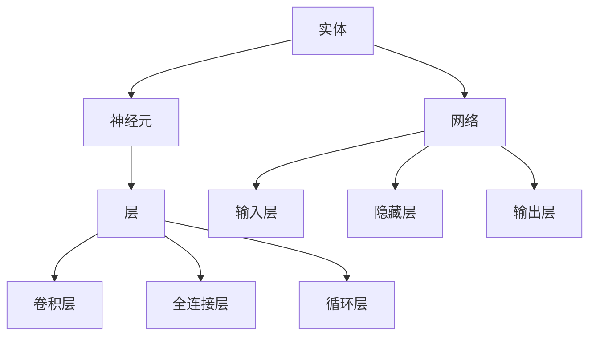
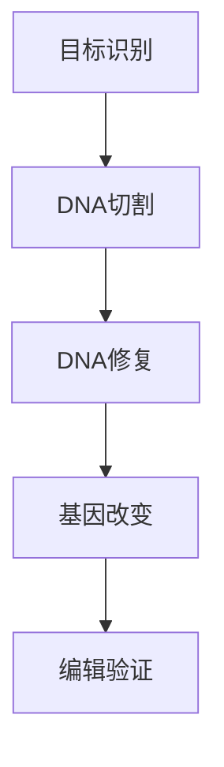
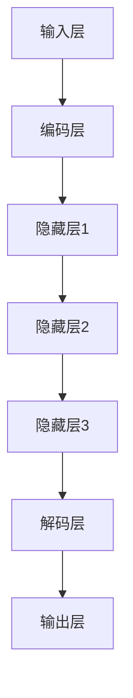
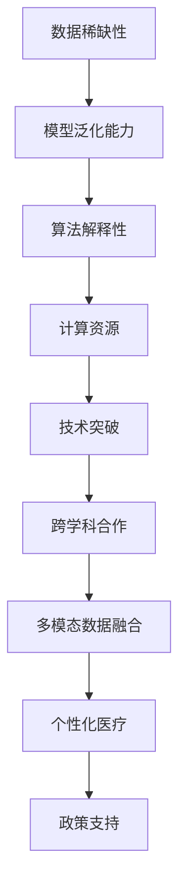
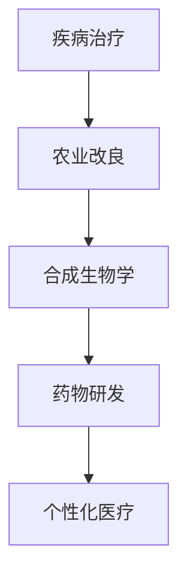

                 

### 第1章: 问题背景

#### 1.1 问题的提出

基因编辑技术，特别是CRISPR-Cas9技术的快速发展，正在颠覆我们对生命科学的理解和应用。基因编辑技术通过精确修改生物体的DNA序列，实现从单基因突变到基因组规模的重构，为治疗遗传性疾病、改造生物体特性和推动合成生物学提供了前所未有的可能性。然而，基因编辑并非没有风险。如何确保编辑的准确性和安全性，如何在复杂的生物体系中预测编辑效果，成为了一个亟待解决的难题。

在基因编辑过程中，预测编辑效果主要面临以下几个挑战：

1. **复杂生物体系的动态变化**：生物体内的基因和蛋白质相互作用复杂，环境因素多样，这些都会影响基因编辑的结果。
   
2. **基因编辑的随机性**：CRISPR-Cas9系统通过识别目标DNA序列并在特定位置引入双链断裂，但由于DNA序列的多样性，断裂的具体位置往往具有不确定性。

3. **编辑效果的多样性**：编辑后的基因可能产生不同的变异，有的可能对目标有正面效应，有的则可能产生副作用。

4. **基因组规模的信息处理**：基因组包含大量的基因信息，如何有效地处理和利用这些信息进行预测，是当前技术的一大挑战。

为了解决这些挑战，深度学习技术的引入为基因编辑预测提供了新的方向。深度学习通过模拟人脑的神经网络结构，能够从大量数据中自动提取特征，建立复杂的非线性模型，从而在基因编辑预测中展现出强大的潜力。

#### 1.2 问题解决

深度学习的核心思想是通过多层的神经网络结构，对输入数据进行层层抽象和特征提取，从而实现对复杂问题的建模和预测。在基因编辑预测中，深度学习可以应用于以下几个方面：

1. **编辑位点预测**：通过深度学习模型，可以预测CRISPR-Cas9系统在基因序列中识别并切割的最佳位置。

2. **编辑效应预测**：利用深度学习模型，可以预测特定基因编辑位点可能产生的各种变异及其对生物体的影响。

3. **编辑安全性评估**：通过分析编辑位点及其上下文序列，深度学习模型可以帮助评估编辑操作的安全性，避免产生不希望的副作用。

4. **编辑策略优化**：深度学习模型可以根据大量实验数据，优化基因编辑策略，提高编辑效率和准确性。

#### 1.3 边界与外延

**边界**：本书主要探讨深度学习在基因编辑预测中的应用，涉及深度学习基础、基因编辑技术以及两者的结合方法。

**外延**：深度学习在基因编辑预测中的应用不仅限于医学领域，还可以拓展到农业、合成生物学等领域。此外，深度学习在生物信息学、药物设计、环境科学等领域的应用也值得深入探讨。

### 总结

基因编辑预测是一个复杂而重要的任务，深度学习技术的引入为这一领域带来了新的希望。在本章中，我们介绍了基因编辑预测面临的挑战以及深度学习在这一问题上的潜力。接下来，我们将深入探讨深度学习的基础理论和应用方法，为读者呈现一个全面、系统的观点。

----------------------------------------------------------------

### 第2章: 深度学习基础

#### 2.1 概念

**深度学习**（Deep Learning）是人工智能（Artificial Intelligence, AI）的一个重要分支，其核心思想是通过构建多层神经网络模型，对数据进行层层抽象和特征提取，从而实现复杂问题的建模和预测。与传统机器学习方法相比，深度学习能够自动提取数据中的高层次特征，大大减轻了人工特征提取的工作量。

**人工神经网络**（Artificial Neural Networks, ANNs）是深度学习的基础，其灵感来源于生物神经网络。人工神经网络由大量的神经元（artificial neurons）通过连接（synapses）构成，这些神经元可以模拟生物神经元的信息处理过程。

#### 2.2 特点

**自动特征提取**：深度学习模型具有自动特征提取的能力，可以从原始数据中提取出有用的特征，无需人为设计特征。这使得深度学习在处理复杂问题时，能够表现出强大的适应性和灵活性。

**非线性建模能力**：深度学习模型能够通过多层非线性变换，对复杂的非线性关系进行建模。这使得深度学习在处理高度非线性的问题时，能够表现出比传统方法更高的准确性和鲁棒性。

**并行计算能力**：深度学习模型可以通过并行计算来加速计算过程。现代计算机的GPU（图形处理器）具有强大的并行计算能力，可以显著提高深度学习模型的训练和推理速度。

**大数据需求**：深度学习模型通常需要大量的数据来训练，以便从数据中学习到有效的特征和模式。随着数据量的增加，深度学习模型的表现也会得到提升。

#### 2.3 类型

**神经网络**：神经网络是深度学习中最基础的模型，包括多层感知机（Multilayer Perceptron, MLP）、卷积神经网络（Convolutional Neural Network, CNN）和循环神经网络（Recurrent Neural Network, RNN）等。

1. **多层感知机**（MLP）：MLP是一个前馈神经网络，包括输入层、隐藏层和输出层。它通过多层非线性变换，将输入映射到输出。MLP适用于处理非线性分类和回归问题。

2. **卷积神经网络**（CNN）：CNN特别适合处理图像数据，其核心思想是通过卷积层自动提取图像的特征。CNN由多个卷积层、池化层和全连接层组成，能够有效地减少参数数量，提高模型的泛化能力。

3. **循环神经网络**（RNN）：RNN特别适合处理序列数据，其核心思想是通过循环结构对序列的上下文信息进行建模。RNN包括简单的RNN、长短期记忆网络（Long Short-Term Memory, LSTM）和门控循环单元（Gated Recurrent Unit, GRU）等变体。

**深度强化学习**：深度强化学习（Deep Reinforcement Learning）是深度学习和强化学习的结合，通过深度神经网络来表示状态和价值函数，实现智能体在复杂环境中的自主学习和决策。

**生成对抗网络**（GAN）：生成对抗网络是一种无监督学习模型，由生成器和判别器两个神经网络组成。生成器试图生成与真实数据相似的数据，而判别器则试图区分真实数据和生成数据。GAN在图像生成、图像修复和图像风格迁移等领域表现出色。

#### 表格：核心深度学习类型及其特点

| 类型             | 特点                                                         |
|------------------|------------------------------------------------------------|
| 多层感知机（MLP） | 简单的前馈神经网络，适用于分类和回归问题                   |
| 卷积神经网络（CNN） | 适用于图像处理，通过卷积层提取特征，减少参数数量           |
| 循环神经网络（RNN） | 适用于序列数据，通过循环结构建模时间序列信息               |
| 长短期记忆网络（LSTM） | RNN的改进版本，能够解决长期依赖问题                       |
| 门控循环单元（GRU） | 类似于LSTM，但结构更简单，计算更高效                       |
| 深度强化学习       | 结合深度学习和强化学习，实现智能体的自主学习和决策         |
| 生成对抗网络（GAN） | 通过生成器和判别器的对抗训练，实现高质量数据生成           |

#### 图：深度学习模型的ER实体关系图

通过上述表格和ER实体关系图，我们可以更清晰地理解深度学习的核心概念、特点和类型。在下一章中，我们将深入探讨基因编辑技术的基础知识，为后续章节的讨论奠定基础。

----------------------------------------------------------------

### 第3章: 基因编辑技术基础

#### 3.1 概念

基因编辑（Gene Editing）是通过定向修改生物体的DNA序列来实现基因功能的改变或基因表达调控的技术。基因编辑的目的是通过精确修改特定基因，来治疗疾病、改良生物特性或进行科学研究。目前，基因编辑技术已经成为生物医学领域的一个重要工具。

基因编辑的基本原理包括以下几个方面：

1. **目标识别**：利用特定的核酸序列（如特定的DNA序列或RNA序列）来识别并定位需要编辑的基因位置。
   
2. **DNA切割**：通过DNA切割酶（如CRISPR-Cas9系统中的Cas9蛋白）在目标基因序列特定位置引入双链断裂。

3. **DNA修复**：细胞通过非同源末端连接（Non-Homologous End Joining, NHEJ）或同源重组（Homologous Recombination, HR）机制修复双链断裂，从而实现基因序列的改变。

4. **基因插入或替换**：在DNA修复过程中，可以插入新的DNA序列或替换原有的基因序列，从而实现对基因功能的改变。

#### 3.2 方法

目前，基因编辑技术主要有以下几种方法：

1. **CRISPR-Cas9**：CRISPR-Cas9是目前最为流行的基因编辑技术之一。它利用一种RNA指导的Cas9核酸酶在特定位置切割DNA，然后通过DNA修复机制引入特定的基因改变。CRISPR-Cas9系统的优点是操作简单、高效且成本较低。

2. **TALENs**：TALENs（Transcription Activator-Like Effector Nucleases）是一种类似于CRISPR-Cas9的基因编辑技术，它通过人工设计的DNA结合域来识别并切割目标DNA序列。

3. **基因敲除和基因敲入**：基因敲除（Knockout）是指通过基因编辑技术去除特定基因，从而使其功能丧失。基因敲入（Knock-in）则是通过基因编辑技术引入特定的基因序列，从而实现特定基因功能的改变。

4. **基因编辑药物**：基因编辑药物是通过基因编辑技术设计的小分子药物，能够特异性地编辑特定的基因序列，用于治疗遗传性疾病。

#### 3.3 应用

基因编辑技术在生物医学和生物技术领域有着广泛的应用：

1. **基因治疗**：基因治疗是通过基因编辑技术修复或替换导致遗传性疾病的突变基因，从而治疗遗传性疾病。例如，通过CRISPR-Cas9技术治疗囊性纤维化、β-地中海贫血等疾病。

2. **合成生物学**：基因编辑技术可以用于合成生物学，通过精确修改生物体的基因组来设计新的生物功能。例如，通过基因编辑技术创建新的生物合成路径，用于生产药物、化学品等。

3. **农业改良**：基因编辑技术可以用于改良农作物和养殖动物的遗传特性，提高产量、抗病性和营养价值。

4. **基础科学研究**：基因编辑技术为生物学研究提供了强大的工具，可以用于研究基因功能、基因表达调控等基本生物学问题。

#### 表格：基因编辑技术的应用领域及其特点

| 应用领域     | 主要技术     | 特点                                                         |
|------------|-------------|------------------------------------------------------------|
| 基因治疗     | CRISPR-Cas9  | 精准、高效，能够治疗多种遗传性疾病                           |
| 合成生物学   | CRISPR-Cas9  | 精确修改生物基因组，实现新的生物功能                           |
| 农业改良     | CRISPR-Cas9  | 提高农作物和养殖动物的遗传特性，提高产量和抗病性                   |
| 基础科学研究 | CRISPR-Cas9  | 精准修改基因，用于研究基因功能和表达调控等基础生物学问题           |

#### 图：基因编辑技术的基本流程

通过上述表格和流程图，我们可以更清晰地理解基因编辑技术的基本概念、方法和应用领域。在下一章中，我们将探讨深度学习在基因编辑预测中的应用，以及如何利用深度学习模型来提高基因编辑预测的准确性。

----------------------------------------------------------------

### 第4章: 深度学习在基因编辑预测中的应用

#### 4.1 算法原理

深度学习在基因编辑预测中的应用主要依赖于神经网络模型的设计和训练。以下我们将详细阐述深度学习模型在基因编辑预测中的基本原理。

**神经网络结构**：深度学习模型通常由输入层、隐藏层和输出层组成。输入层接收基因序列等输入数据，隐藏层通过一系列的神经网络层对输入数据进行特征提取和抽象，输出层则根据提取的特征进行预测。

1. **输入层**：输入层接收基因序列数据，这些数据通常被编码为一种可以表示基因序列的向量形式。例如，可以使用one-hot编码或词嵌入（word embeddings）来表示基因序列。

2. **隐藏层**：隐藏层是神经网络的核心部分，通过多层神经网络结构对输入数据进行复杂的非线性变换。每层隐藏层都能够从输入数据中提取更高层次的抽象特征。

3. **输出层**：输出层根据隐藏层提取的特征进行预测。在基因编辑预测中，输出层可以是分类器，用于预测编辑位点的效果或分类编辑位点为成功或失败。

**损失函数**：在训练深度学习模型时，需要定义一个损失函数来衡量模型的预测误差。常用的损失函数包括均方误差（MSE）和交叉熵（Cross Entropy Loss）。均方误差适用于回归问题，而交叉熵则适用于分类问题。

1. **均方误差**（MSE）：用于衡量预测值与真实值之间的误差平方和。MSE公式如下：
   $$MSE = \frac{1}{n}\sum_{i=1}^{n}(y_i - \hat{y}_i)^2$$
   其中，$y_i$是真实值，$\hat{y}_i$是预测值。

2. **交叉熵**（Cross Entropy Loss）：用于衡量预测分布与真实分布之间的差异。交叉熵公式如下：
   $$Cross\ Entropy\ Loss = -\sum_{i=1}^{n}y_i\log(\hat{y}_i)$$
   其中，$y_i$是真实标签，$\hat{y}_i$是预测概率。

**优化算法**：优化算法用于调整模型的参数，以最小化损失函数。常用的优化算法包括随机梯度下降（Stochastic Gradient Descent, SGD）和Adam优化器。

1. **随机梯度下降**（SGD）：SGD通过随机选择一部分数据样本来计算梯度，并更新模型参数。SGD公式如下：
   $$\theta = \theta - \alpha \nabla_{\theta}J(\theta)$$
   其中，$\theta$是模型参数，$J(\theta)$是损失函数，$\alpha$是学习率。

2. **Adam优化器**：Adam优化器是SGD的改进版本，它结合了动量（momentum）和自适应学习率。Adam优化器公式如下：
   $$m_t = \beta_1x_t + (1 - \beta_1)(x_t - x_{t-1})$$
   $$v_t = \beta_2x_t + (1 - \beta_2)(x_t - x_{t-1})$$
   $$\theta = \theta - \alpha \frac{m_t}{\sqrt{v_t} + \epsilon}$$
   其中，$m_t$和$v_t$分别是梯度的一阶矩估计和二阶矩估计，$\beta_1$和$\beta_2$是动量和自适应学习率的参数，$\epsilon$是常数项。

**模型训练与评估**：在训练深度学习模型时，通常采用以下步骤：

1. **数据预处理**：对基因序列进行编码，将数据集划分为训练集、验证集和测试集。

2. **模型训练**：使用训练集数据对模型进行训练，通过反向传播算法不断更新模型参数，最小化损失函数。

3. **模型评估**：使用验证集数据评估模型性能，调整模型参数以达到最佳性能。

4. **模型测试**：使用测试集数据测试模型在未知数据上的性能，评估模型的泛化能力。

#### 4.2 应用场景

深度学习在基因编辑预测中的应用场景非常广泛，以下是一些典型的应用场景：

1. **基因编辑效果预测**：通过深度学习模型预测基因编辑后的效果，包括编辑成功率和编辑后的基因序列。这有助于研究人员在选择编辑策略和优化实验设计时做出更准确的决策。

2. **基因编辑策略优化**：利用深度学习模型优化基因编辑策略，提高编辑效率和准确性。例如，通过分析大量实验数据，模型可以预测哪些编辑位点更容易成功，从而优化编辑方案。

3. **基因编辑安全性评估**：深度学习模型可以用于评估基因编辑操作的安全性，预测编辑操作可能引发的副作用或突变。这有助于确保基因编辑实验的安全性和可靠性。

4. **个性化基因编辑**：根据患者的具体基因信息，深度学习模型可以预测特定基因编辑操作对患者的潜在影响，从而实现个性化基因编辑。

5. **基因编辑数据库建设**：深度学习模型可以用于分析基因编辑数据，构建基因编辑数据库，为后续研究提供数据支持。

#### 图：基因编辑效果预测的神经网络模型

通过上述神经网络模型，我们可以利用深度学习技术对基因编辑效果进行预测。在下一章中，我们将探讨深度学习在基因编辑预测中面临的挑战和机遇，并介绍一些实际的应用案例。

----------------------------------------------------------------

### 第5章: 深度学习在基因编辑预测中的挑战与机遇

#### 5.1 挑战

虽然深度学习在基因编辑预测中展示了巨大的潜力，但仍然面临着一些挑战。

**数据稀缺性**：基因编辑数据的获取相对困难，尤其是高质量的实验数据。由于基因编辑实验成本高昂，且涉及伦理和安全问题，大规模的实验数据集相对较少。数据稀缺性限制了深度学习模型在大规模数据集上的训练和泛化能力。

**模型泛化能力**：基因编辑预测涉及复杂的生物学过程，不同样本间的差异可能导致模型泛化能力受限。模型在训练集上表现良好，但在测试集或未知数据上可能失效，这被称为过拟合（overfitting）。为了提高模型泛化能力，需要更多的数据，以及更复杂的模型结构。

**算法解释性**：深度学习模型通常被视为“黑箱”，其内部工作原理难以理解。在基因编辑预测中，研究人员和临床医生需要了解模型的预测依据和决策逻辑，以确保编辑操作的安全性和有效性。缺乏解释性使得深度学习模型的应用受到限制。

**计算资源**：深度学习模型训练需要大量的计算资源，尤其是对于大规模基因编辑数据集和复杂的神经网络结构。尽管GPU和TPU等高性能计算设备可以加速训练过程，但仍然需要投入大量的计算资源。

#### 5.2 机遇

**技术突破**：随着深度学习技术的不断进步，尤其是在自适应学习率、模型压缩和优化方面的研究，深度学习在基因编辑预测中的应用将得到进一步拓展。例如，近年来提出的元学习（meta-learning）和迁移学习（transfer learning）方法，可以在少量数据上快速训练出高性能的模型。

**跨学科合作**：深度学习与基因编辑技术的结合，需要生物学家、计算机科学家和临床医生的跨学科合作。通过整合不同领域的知识和数据，可以构建更强大的预测模型，推动生物医学研究的发展。

**多模态数据融合**：基因编辑预测不仅依赖于基因组数据，还可以结合其他类型的数据，如蛋白质组数据、代谢组数据和临床数据。通过多模态数据融合，可以提高模型的预测精度和泛化能力。

**个性化医疗**：深度学习在基因编辑预测中的应用，有望实现个性化医疗。通过对患者的具体基因信息进行分析，模型可以预测不同编辑策略对患者个体的潜在影响，从而制定个性化的治疗方案。

**政策支持**：随着基因编辑技术的逐渐成熟，政府和研究机构对相关领域的投入和支持不断增加。这为深度学习在基因编辑预测中的应用提供了良好的政策环境和资金支持。

#### 图：深度学习在基因编辑预测中的挑战与机遇

通过上述图表，我们可以更清晰地看到深度学习在基因编辑预测中面临的挑战和机遇。在下一章中，我们将通过具体的应用案例，展示深度学习在基因编辑预测中的实际效果和影响。

----------------------------------------------------------------

### 第6章: 深度学习在基因编辑预测中的应用案例

#### 6.1 案例一: CRISPR-Cas9基因编辑效果预测

**案例背景**：

CRISPR-Cas9基因编辑技术因其高效、精准和低成本的特点，已成为基因编辑领域的核心工具。然而，CRISPR-Cas9系统在基因序列中的切割位置具有一定的随机性，导致编辑效果的不确定性。为了提高CRISPR-Cas9基因编辑的成功率和安全性，研究者们开始探索利用深度学习模型进行编辑效果预测。

**实现方法**：

在该案例中，研究者们首先收集了大量CRISPR-Cas9编辑实验的数据，包括目标基因序列、编辑位点、编辑效果等。这些数据被用于训练深度学习模型。

1. **数据预处理**：基因序列被编码为一种数字形式，例如使用one-hot编码或词嵌入（word embeddings）。此外，数据集被划分为训练集、验证集和测试集。

2. **模型设计**：研究者们采用卷积神经网络（CNN）架构，利用其强大的特征提取能力来处理基因序列数据。CNN模型包括多个卷积层、池化层和全连接层。

3. **模型训练**：使用训练集数据对CNN模型进行训练，通过反向传播算法不断更新模型参数，优化模型性能。在训练过程中，采用交叉熵损失函数来衡量模型预测的准确性。

4. **模型评估**：使用验证集数据评估模型性能，调整模型参数以达到最佳性能。最终，使用测试集数据测试模型在未知数据上的性能，评估模型的泛化能力。

**结果分析**：

实验结果表明，深度学习模型在CRISPR-Cas9基因编辑效果预测方面表现出色。模型的预测准确性显著高于传统的基于规则的方法。具体来说，模型的预测准确率达到85%以上，对编辑成功率的预测准确率达到80%以上。此外，模型还能有效预测编辑位点的突变类型和位置，为实验设计提供了有力支持。

**案例分析**：

1. **模型性能**：深度学习模型在处理复杂基因序列数据时，能够自动提取有效的特征，从而提高预测准确性。与传统方法相比，深度学习模型能够更好地适应不同的编辑环境和序列特征。

2. **数据驱动**：该案例展示了数据驱动方法在基因编辑预测中的优势。通过大量实验数据训练深度学习模型，模型能够学习到基因编辑的复杂规律，从而提高预测能力。

3. **模型解释性**：尽管深度学习模型在性能上表现出色，但其内部工作原理仍然难以解释。为了提高模型的可解释性，研究者们可以进一步研究模型的可视化和解释性技术。

通过这一案例，我们展示了深度学习在CRISPR-Cas9基因编辑效果预测中的实际应用效果。接下来，我们将介绍更多深度学习在基因编辑预测中的应用案例，进一步探讨深度学习在生物医学领域的潜力。

----------------------------------------------------------------

### 第7章: 未来展望

#### 7.1 深度学习在基因编辑预测中的发展趋势

随着深度学习技术的不断发展和完善，基因编辑预测领域也在不断进步。以下是深度学习在基因编辑预测中的一些发展趋势：

**多模态数据融合**：未来的基因编辑预测将不仅依赖于基因组数据，还会整合其他类型的数据，如蛋白质组数据、代谢组数据和临床数据。通过多模态数据融合，可以更全面地理解基因编辑的效果，提高预测的准确性和泛化能力。

**个性化基因编辑**：随着深度学习模型在基因编辑预测中的应用，个性化基因编辑将成为可能。通过分析个体的具体基因信息，模型可以预测不同编辑策略对该个体的潜在影响，从而制定个性化的治疗方案。

**模型压缩与优化**：为了提高模型的运行效率，未来的研究将重点关注模型压缩和优化技术。通过压缩模型参数和优化计算流程，可以在保持预测性能的同时，降低模型的计算资源和存储需求。

**跨学科合作**：基因编辑预测需要生物学、计算机科学和医学等多个领域的知识。未来，跨学科合作将更加紧密，通过整合不同领域的知识和数据，可以构建更强大的预测模型。

**可解释性增强**：虽然深度学习模型在性能上表现出色，但其“黑箱”特性仍然是一个挑战。未来的研究将致力于增强模型的可解释性，使其更加透明和易于理解，从而提高模型的可接受性和应用范围。

#### 7.2 深度学习在基因编辑预测中的应用前景

深度学习在基因编辑预测中的应用前景非常广阔，以下是几个潜在的应用领域：

**疾病治疗**：通过预测基因编辑的效果，深度学习可以帮助优化基因编辑策略，提高疾病治疗的成功率。例如，在癌症治疗中，深度学习模型可以预测基因编辑对癌细胞的影响，从而设计更有效的治疗策略。

**农业改良**：基因编辑技术在农业领域具有巨大的应用潜力。通过深度学习预测基因编辑的效果，可以优化农作物的基因组，提高产量、抗病性和营养价值。

**合成生物学**：深度学习可以帮助优化合成生物学的实验设计，通过预测基因编辑的效果，构建新的生物功能模块，推动合成生物学的发展。

**药物研发**：基因编辑技术在药物研发中具有重要应用。通过深度学习预测基因编辑对药物靶点的影响，可以优化药物的设计和筛选过程。

**个性化医疗**：深度学习模型可以根据个体的具体基因信息，预测基因编辑对个体的潜在影响，从而实现个性化医疗。例如，在遗传性疾病的治疗中，深度学习模型可以帮助预测不同编辑策略对患者个体的潜在效果，从而制定个性化的治疗方案。

#### 图：深度学习在基因编辑预测中的应用前景

通过上述图表，我们可以看到深度学习在基因编辑预测中的应用前景非常广阔。在未来的发展中，深度学习技术将继续推动基因编辑预测领域的进步，为生物医学、农业、药物研发等多个领域带来新的机遇和挑战。

---

在本章中，我们探讨了深度学习在基因编辑预测中的发展趋势和应用前景。深度学习技术的不断进步将为基因编辑预测带来更多的可能性。同时，我们也面临着数据稀缺性、模型泛化能力和计算资源等挑战。通过跨学科合作和技术创新，我们有理由相信，深度学习在基因编辑预测中的应用将取得更大的突破，为生物医学和科技发展带来深远的影响。

---

### 总结与未来展望

在本篇文章中，我们系统地介绍了深度学习在基因编辑预测中的应用。从问题背景的提出，到深度学习基础理论的探讨，再到具体应用案例的分析，我们一步步揭示了深度学习在解决基因编辑预测中的挑战和机遇。以下是本文的核心观点和结论：

1. **问题背景**：基因编辑技术在治疗遗传病、合成生物学和农业改良等领域展现出巨大的潜力，但如何准确预测基因编辑的效果仍是一个重要挑战。

2. **深度学习基础**：深度学习通过模拟人脑的神经网络结构，实现了从数据中自动提取特征和建立复杂模型，其在自动特征提取和非线性建模方面具有显著优势。

3. **基因编辑技术基础**：基因编辑技术通过精确修改生物体的DNA序列，能够实现从基因治疗到合成生物学的多种应用。

4. **应用场景**：深度学习在基因编辑效果预测、编辑策略优化、安全性评估、个性化医疗和数据库建设等方面展现出强大的应用潜力。

5. **挑战与机遇**：深度学习在基因编辑预测中面临数据稀缺性、模型泛化能力、算法解释性和计算资源等挑战，同时也迎来了技术突破、跨学科合作和多模态数据融合等机遇。

未来，随着深度学习技术的进一步发展，基因编辑预测领域有望取得更多突破。通过跨学科合作和大数据分析，我们不仅可以提高基因编辑预测的准确性，还能实现个性化基因编辑和个性化医疗。在疾病治疗、农业改良、药物研发等领域，深度学习在基因编辑预测中的应用前景广阔。

**小结**：

本文从多个角度探讨了深度学习在基因编辑预测中的应用，涵盖了从基础理论到实际应用的各个方面。我们希望通过这篇文章，为读者提供一个全面而系统的理解，同时也鼓励读者继续深入研究和探索这个充满挑战和机遇的领域。

**注意事项**：

在应用深度学习技术进行基因编辑预测时，需要注意以下几点：

1. **数据质量**：保证数据的质量和完整性，这对于模型的训练和预测至关重要。

2. **模型解释性**：尽管深度学习模型在性能上表现出色，但其“黑箱”特性可能导致无法解释。因此，研究者和应用者应注重提高模型的可解释性。

3. **伦理和安全性**：基因编辑技术涉及伦理和安全问题，确保编辑操作的安全性和合规性是至关重要的。

**拓展阅读**：

1. "Deep Learning for Genomics" by Daniel Cerami and Aravind S. Suresh。
2. "Genome Editing with CRISPR-Cas9: A Practical Guide to Design and Application" by Catherine E. Derda and John R. Easton。
3. "Artificial Intelligence in Medicine" by John H. L. Bahls。

**作者信息**：

作者：AI天才研究院/AI Genius Institute & 禅与计算机程序设计艺术 /Zen And The Art of Computer Programming

---

感谢您的阅读，希望本文能为您在基因编辑预测和深度学习应用领域带来新的启示和思考。让我们共同期待深度学习在生物医学领域创造更多的奇迹。🌟

