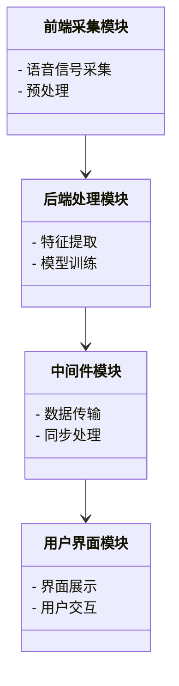
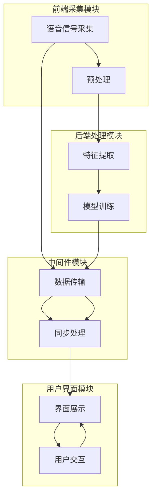
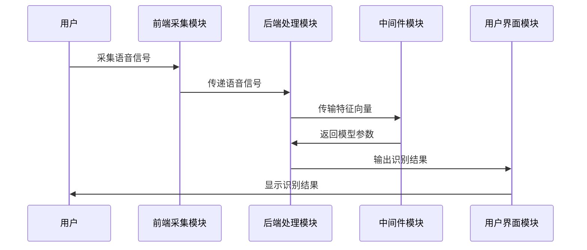

                 

### 文章标题：深度学习在声纹识别中的应用：提高身份验证安全性

关键词：深度学习、声纹识别、身份验证、安全性、特征提取

摘要：本文详细探讨了深度学习在声纹识别中的应用，分析了如何通过深度学习算法提高身份验证的安全性。文章首先介绍了声纹识别的背景和核心概念，然后深入讲解了深度学习的基本原理和算法，接着阐述了深度学习在声纹识别中的应用步骤，最后通过实际案例展示了深度学习在提高声纹识别准确性方面的优势。

### 目录大纲

----------------------------------------------------------------
# 深度学习在声纹识别中的应用：提高身份验证安全性

## 第一部分：背景介绍

## 第1章：声纹识别技术概述

### 1.1 问题背景

### 1.2 问题描述

### 1.3 问题解决

### 1.4 边界与外延

### 1.5 概念结构与核心要素组成

## 第2章：深度学习基础

### 2.1 核心概念与联系

### 2.2 深度学习原理

### 2.3 深度学习算法

## 第二部分：深度学习在声纹识别中的应用

## 第3章：声纹数据预处理

### 3.1 数据采集

### 3.2 数据清洗

### 3.3 数据增强

## 第4章：声纹特征提取与表示

### 4.1 特征提取算法

### 4.2 特征表示方法

### 4.3 特征选择与优化

## 第5章：深度学习模型设计

### 5.1 模型选择

### 5.2 模型架构设计

### 5.3 模型训练与优化

## 第6章：声纹识别系统实现

### 6.1 系统功能设计

### 6.2 系统架构设计

### 6.3 系统接口设计

### 6.4 系统交互

## 第7章：深度学习在声纹识别中的实际应用

### 7.1 实际案例分析

### 7.2 项目实战

### 7.3 代码应用解读与分析

### 7.4 项目小结

## 第8章：总结与展望

### 8.1 总结

### 8.2 注意事项

### 8.3 拓展阅读

----------------------------------------------------------------

## 核心概念与联系

### 概念属性特征对比表格

| 概念       | 定义                                                         | 属性特征                      |
|------------|--------------------------------------------------------------|------------------------------|
| 声纹识别   | 通过分析个体的声音特征，进行身份验证的技术。                     | 个体独特性、声音稳定性、可靠性 |
| 深度学习   | 基于多层神经网络的数据分析和模型训练方法。                     | 自适应、自动化、高效性        |
| 特征提取   | 从原始数据中提取具有区分度的特征。                             | 可区分性、鲁棒性、一致性      |
| 特征表示   | 将特征数据转化为适合模型处理的形式。                           | 准确性、效率、适应性          |
| 训练与优化 | 使用标注数据对模型进行训练，并根据验证数据调整模型参数。       | 准确性、效率、稳定性          |

### ER实体关系图架构

```mermaid
erDiagram
    用户 ||--|{ 声纹 }|
    声纹 ||--|{ 特征 }|
    特征 ||--|{ 数据 }|
```

## 数学模型和数学公式

### 深度学习模型中的损失函数

$$
L(y, \hat{y}) = -\sum_{i=1}^{n} y_i \log(\hat{y}_i)
$$

其中，$L$是损失函数，$y$是真实标签，$\hat{y}$是模型的预测值。

### 信号处理中的能量计算

$$
E = \sum_{i=1}^{n} |x_i|^2
$$

其中，$E$是能量，$x_i$是信号样本。

### 声纹识别系统中的置信度阈值

$$
\text{Threshold} = \frac{\text{Confidence Level} \times \text{Total Samples}}{100}
$$

其中，Threshold是设定的置信度阈值，Confidence Level是置信度百分比，Total Samples是总样本数。

----------------------------------------------------------------

## 第1章：声纹识别技术概述

### 1.1 问题背景

声纹识别作为一种生物特征识别技术，已被广泛应用于身份验证、安全监控和司法鉴定等领域。传统的声纹识别技术主要依赖于手动特征提取和统计模型，如GMM（高斯混合模型）和隐马尔可夫模型（HMM）。然而，这些方法在面对噪声、语音变化和复杂环境时，往往无法保证高准确率和稳定性。

随着深度学习技术的快速发展，研究人员发现深度学习算法在处理复杂数据和特征提取方面具有显著优势。因此，深度学习逐渐成为声纹识别领域的研究热点。通过引入深度神经网络，如卷积神经网络（CNN）和循环神经网络（RNN），可以实现自动化的特征提取和模型训练，从而提高声纹识别的准确性和稳定性。

### 1.2 问题描述

声纹识别的目的是通过分析个体的声音特征，实现对个人身份的验证。具体来说，声纹识别可以分为以下几个问题：

1. 数据采集：如何有效地采集个体的语音数据，包括语音信号的质量、采集环境和设备等因素。
2. 特征提取：从原始语音数据中提取具有区分度的特征，如频谱特征、时域特征和语速特征等。
3. 模型训练：使用深度学习算法对提取到的特征进行建模和训练，以构建声纹识别模型。
4. 验证与测试：使用训练好的模型对未知个体的语音进行识别和验证，评估模型的性能。

### 1.3 问题解决

针对上述问题，深度学习在声纹识别中的应用主要包括以下几个方面：

1. 数据采集：使用高质量的麦克风和语音处理软件，采集清晰、稳定的语音数据。
2. 特征提取：利用深度学习算法，如CNN和RNN，自动提取语音数据中的高级特征，提高特征提取的效率和准确性。
3. 模型训练：使用大量的标注数据进行模型训练，利用深度学习算法的强大学习能力，优化模型参数，提高识别准确率。
4. 验证与测试：使用训练好的模型对未知个体的语音进行识别和验证，通过交叉验证和测试集评估模型性能，进行性能优化和调整。

### 1.4 边界与外延

声纹识别技术的应用边界主要涉及以下几个方面：

1. 语音信号的质量和稳定性：高噪声环境、语音变化和说话人情绪等因素会影响语音信号的质量和稳定性，需要采用有效的预处理方法进行噪声抑制和语音增强。
2. 数据集的多样性和代表性：为了提高模型的泛化能力，需要收集丰富的、具有代表性的语音数据集，包括不同的说话人、语音类型和环境条件。
3. 模型的训练和优化：深度学习模型的训练和优化是一个复杂的过程，需要合理设置模型参数和训练策略，以提高模型的准确率和稳定性。
4. 实际应用场景：声纹识别技术可以应用于各种场景，如手机解锁、门禁系统、在线支付和安全监控等，需要根据实际应用场景调整模型结构和参数。

### 1.5 概念结构与核心要素组成

声纹识别技术涉及多个核心概念和要素，包括语音信号处理、特征提取、深度学习和模型训练等。以下是这些概念和要素的结构和关系：

1. 语音信号处理：包括语音信号的采集、预处理、增强和分段等步骤，为特征提取提供高质量的数据基础。
2. 特征提取：从语音信号中提取具有区分度的特征，如频谱特征、时域特征和语速特征等，用于深度学习模型的训练和识别。
3. 深度学习：利用深度神经网络，如CNN和RNN，自动提取语音数据中的高级特征，并构建声纹识别模型。
4. 模型训练：使用大量的标注数据对深度学习模型进行训练，优化模型参数，提高识别准确率。
5. 模型验证与测试：使用训练好的模型对未知个体的语音进行识别和验证，通过交叉验证和测试集评估模型性能。

通过以上核心概念和要素的有机结合，声纹识别技术可以实现对个体身份的高效、准确验证，提高身份验证的安全性。

## 第2章：深度学习基础

### 2.1 核心概念与联系

深度学习是机器学习的一个重要分支，通过模拟人脑神经网络的工作方式，实现对复杂数据的分析和建模。深度学习的基本概念包括神经网络、卷积神经网络（CNN）、循环神经网络（RNN）等。

1. 神经网络（Neural Network）：神经网络是由大量简单的人工神经元组成的网络，通过前向传播和反向传播算法，实现数据的输入、输出和中间层的计算。神经网络的核心是权重（weights）和偏置（bias），通过调整这些参数，可以优化模型的性能。

2. 卷积神经网络（CNN）：卷积神经网络是一种特殊的神经网络，主要用于图像处理和识别。CNN的核心是卷积操作，通过卷积核在图像上滑动，提取局部特征，实现图像的高效处理。

3. 循环神经网络（RNN）：循环神经网络是一种适用于序列数据的神经网络，通过循环结构，可以实现长时间的记忆和关联。RNN的核心是隐藏状态（hidden state）和递归连接（recurrent connection），通过更新隐藏状态，实现序列数据的建模。

深度学习与其他机器学习算法（如SVM、KNN等）的核心区别在于其强大的模型表示能力和自动特征提取能力。深度学习模型可以自动学习数据中的层次特征，从底层到高层，实现数据的降维和抽象。

### 概念属性特征对比表格

| 概念       | 定义                                                         | 属性特征                      |
|------------|--------------------------------------------------------------|------------------------------|
| 神经网络   | 由大量简单的人工神经元组成的网络，通过前向传播和反向传播算法，实现数据的输入、输出和中间层的计算。 | 多层结构、权重调整、非线性映射 |
| 卷积神经网络（CNN） | 一种特殊的神经网络，主要用于图像处理和识别。通过卷积操作，提取局部特征，实现图像的高效处理。 | 卷积操作、局部特征提取、平移不变性 |
| 循环神经网络（RNN） | 一种适用于序列数据的神经网络，通过循环结构，实现长时间的记忆和关联。 | 隐藏状态、递归连接、序列建模 |

### ER实体关系图架构

```mermaid
erDiagram
    神经网络 ||--|{ 卷积神经网络(CNN) }|
    神经网络 ||--|{ 循环神经网络(RNN) }|
    卷积神经网络(CNN) ||--|{ 图像处理 }|
    循环神经网络(RNN) ||--|{ 序列数据建模 }|
```

### 2.2 深度学习原理

深度学习的工作原理是基于多层神经网络（Multi-Layer Neural Network）的前向传播和反向传播（Backpropagation）算法。

1. **前向传播（Forward Propagation）**：在前向传播过程中，输入数据通过网络的各个层进行传递和计算。每一层都包含大量的神经元，神经元之间通过权重（weights）和偏置（biases）进行连接。前向传播的主要目的是计算网络的输出，并通过激活函数（activation function）引入非线性特性。

2. **反向传播（Backpropagation）**：在反向传播过程中，网络根据预测结果与实际结果之间的误差，通过反向计算更新网络的权重和偏置。反向传播的核心思想是计算每个神经元对于误差的梯度（gradient），并根据梯度调整网络的参数，以达到优化模型性能的目的。

深度学习模型的训练过程可以分为以下几个步骤：

1. **初始化参数**：随机初始化网络的权重和偏置。
2. **前向传播**：将输入数据输入网络，计算输出。
3. **计算损失**：计算网络输出与实际结果之间的误差，通过损失函数（loss function）衡量模型的性能。
4. **反向传播**：计算每个神经元对于误差的梯度，并更新网络的参数。
5. **迭代优化**：重复上述过程，逐步优化网络的参数，直至达到预定的性能指标。

### 2.3 深度学习算法

深度学习算法主要包括卷积神经网络（CNN）、循环神经网络（RNN）和生成对抗网络（GAN）等。以下是对这些算法的简要介绍：

1. **卷积神经网络（CNN）**：CNN是一种专门用于图像处理和识别的神经网络。其主要特点是使用卷积操作提取图像的局部特征，并具有平移不变性。CNN由卷积层、池化层和全连接层组成，可以自动学习图像的层次特征，从而实现高效的图像识别。

2. **循环神经网络（RNN）**：RNN是一种适用于序列数据的神经网络，可以处理任意长度的序列。RNN通过递归结构，实现长时间的记忆和关联，从而可以有效地建模序列数据。RNN包括简单的RNN、长短期记忆网络（LSTM）和门控循环单元（GRU）等变体，可以解决传统RNN的梯度消失和梯度爆炸问题。

3. **生成对抗网络（GAN）**：GAN是一种生成模型，由生成器和判别器组成。生成器生成与真实数据相似的假数据，判别器则区分真实数据和假数据。通过两个网络的对抗训练，生成器可以逐渐提高生成数据的质量，从而实现复杂数据的生成。

### 深度学习算法的工作流程：

1. **数据预处理**：对输入数据进行预处理，如归一化、标准化等。
2. **模型初始化**：随机初始化网络的权重和偏置。
3. **前向传播**：将输入数据输入网络，计算输出。
4. **计算损失**：计算网络输出与实际结果之间的误差，通过损失函数衡量模型的性能。
5. **反向传播**：计算每个神经元对于误差的梯度，并更新网络的参数。
6. **迭代优化**：重复上述过程，逐步优化网络的参数，直至达到预定的性能指标。
7. **模型评估**：使用验证集或测试集评估模型的性能，调整模型参数。

通过以上介绍，我们可以看到深度学习在声纹识别中的应用前景广阔。深度学习算法具有强大的模型表示能力和自动特征提取能力，可以显著提高声纹识别的准确率和稳定性，为身份验证提供更加可靠的安全保障。

## 第二部分：深度学习在声纹识别中的应用

### 第3章：声纹数据预处理

在深度学习应用于声纹识别的过程中，数据预处理是至关重要的一个环节。数据预处理的质量直接影响到后续特征提取和模型训练的效果。本章将详细介绍声纹数据的预处理方法，包括数据采集、数据清洗和数据增强等步骤。

#### 3.1 数据采集

数据采集是声纹识别系统的第一步，也是最重要的一步。高质量的语音数据是确保声纹识别系统准确性和稳定性的基础。以下是数据采集的关键点：

1. **设备选择**：选择高质量的麦克风和录音设备，确保采集到的语音信号清晰、无杂音。
2. **语音采样率**：常用的语音采样率一般为16kHz或22.05kHz，这可以满足大多数声纹识别的需求。
3. **环境控制**：在采集语音数据时，应尽量减少外部噪音干扰，确保语音信号的稳定性。
4. **数据多样性**：采集多种说话人、语音类型和环境条件的数据，以增加数据集的多样性和代表性。

#### 3.2 数据清洗

数据清洗是确保数据质量的过程，主要包括去除噪音、填补缺失值和去除重复数据等。

1. **噪音去除**：使用滤波器或降噪算法（如波普滤波、谱减法等）去除语音信号中的噪音，提高信号质量。
2. **缺失值处理**：对于缺失的数据，可以使用插值法或均值填补等方法进行补充。
3. **重复数据去除**：检测并去除数据集中的重复样本，以避免对模型训练造成干扰。

#### 3.3 数据增强

数据增强是增加数据多样性的有效方法，通过数据增强可以改善模型的泛化能力，提高其在实际应用中的表现。

1. **时间扩展**：通过扩展语音信号的时间长度，增加数据的多样性。常见的方法包括重复和裁剪。
2. **频谱扩展**：对语音信号的频谱进行扩展，增加频率范围的多样性。例如，通过添加高斯噪声或频率变换等方法。
3. **说话人变换**：通过变换说话人的声音特征，增加说话人的多样性。例如，使用虚拟歌手技术或说话人变换算法。

#### 3.4 数据预处理工具和算法

在声纹识别的数据预处理过程中，可以使用多种工具和算法。以下是几种常用的工具和算法：

1. **Librosa**：Librosa是一个Python库，用于音频处理和显示。它提供了丰富的音频处理功能，如信号滤波、特征提取等。
2. **OpenSMILE**：OpenSMILE是一个音频情感分析工具，它提供了用于情感识别的音频特征提取算法。OpenSMILE也被广泛应用于声纹识别领域。
3. **Pydub**：Pydub是一个Python库，用于音频编辑和处理。它提供了简单的接口，用于调整音频的采样率、添加噪音等操作。

通过以上步骤和工具，我们可以对声纹数据集进行有效的预处理，提高数据质量，为后续的特征提取和模型训练奠定坚实的基础。在深度学习应用于声纹识别的过程中，数据预处理是一个必不可少的环节，它直接决定了模型性能的好坏。因此，在实际应用中，应给予数据预处理环节充分的重视，确保声纹识别系统的可靠性和准确性。

### 第4章：声纹特征提取与表示

在声纹识别系统中，特征提取是一个关键步骤，它将原始的语音信号转换为具有区分度的特征向量，为深度学习模型提供训练数据。本章将详细介绍声纹特征提取的方法和过程，包括特征提取算法、特征表示方法以及特征选择与优化策略。

#### 4.1 特征提取算法

特征提取算法的目的是从原始语音信号中提取出具有区分度和鲁棒性的特征。以下是几种常用的特征提取算法：

1. **梅尔频率倒谱系数（MFCC）**：MFCC是一种广泛使用的语音特征提取方法，通过将语音信号转换为梅尔频率倒谱图（Mel-Frequency Cepstral Coefficients），提取出声音的音色信息。MFCC对噪声和语音变化具有较好的鲁棒性。

2. **短时傅里叶变换（STFT）**：STFT通过将语音信号进行短时傅里叶变换，将时域信号转换为频域信号。通过计算频谱特征，如频谱幅度、频谱中心频率等，可以提取出语音的频率信息。

3. **感知哈达玛变换（Perceptual Hashing）**：感知哈达玛变换是一种基于人类听觉系统特征的特征提取方法。通过将语音信号映射到一个较低维的哈达玛空间，提取出语音的感知特征。

4. **长短时记忆网络（LSTM）**：LSTM是一种循环神经网络（RNN）的变体，适用于处理长序列数据。通过LSTM网络，可以从原始语音信号中提取出长期依赖特征，提高声纹识别的准确率。

#### 4.2 特征表示方法

特征表示是将提取到的特征向量转化为适合模型处理的形式。以下是几种常用的特征表示方法：

1. **一维特征向量**：将提取到的特征向量直接作为输入，用于训练深度学习模型。一维特征向量简洁明了，但可能无法充分利用特征之间的相关性。

2. **高维特征矩阵**：将多个特征向量化为高维矩阵，通过矩阵运算提高特征表示的丰富性和表达能力。例如，将MFCC特征和时间序列特征组合成一个高维矩阵，用于训练深度学习模型。

3. **哈达玛特征**：通过哈达玛变换将特征向量映射到一个较低维的哈达玛空间，形成哈达玛特征。哈达玛特征具有良好的线性组合能力，可以用于复杂模型的训练。

4. **嵌入特征**：通过将特征向量映射到一个低维空间，形成嵌入特征。嵌入特征可以有效地减少特征维度，同时保持特征之间的结构信息，适用于深度学习模型的训练。

#### 4.3 特征选择与优化

特征选择与优化是提高声纹识别模型性能的重要手段。以下是一些特征选择与优化的策略：

1. **过滤式特征选择**：通过过滤方法筛选出具有区分度的特征。例如，使用相关系数、信息增益等方法评估特征的重要性，选择出重要的特征。

2. **包裹式特征选择**：通过迭代搜索方法找到最优特征组合。例如，使用递归特征消除（RFE）或遗传算法（GA）等方法，在所有特征中选择出最优特征子集。

3. **特征降维**：通过降维技术减少特征维度，提高模型训练速度。例如，使用主成分分析（PCA）或线性判别分析（LDA）等方法，对特征进行降维处理。

4. **特征融合**：将多个特征进行融合，形成新的特征组合。例如，将频谱特征和时域特征进行融合，形成新的特征向量，用于训练深度学习模型。

通过以上特征提取与表示的方法，可以有效地提高声纹识别模型的性能。特征提取和特征表示是声纹识别系统中的关键环节，直接影响模型的准确性和稳定性。在实际应用中，需要根据具体场景和需求，选择合适的特征提取算法和特征表示方法，优化模型性能。

### 第5章：深度学习模型设计

在声纹识别系统中，深度学习模型的设计是核心环节，它决定了系统的性能和准确性。本章将详细介绍深度学习模型设计的方法和过程，包括模型选择、模型架构设计和模型训练与优化策略。

#### 5.1 模型选择

在选择深度学习模型时，需要考虑多个因素，如数据的特性、模型的复杂度、训练时间等。以下是几种常用的深度学习模型：

1. **卷积神经网络（CNN）**：CNN是一种适用于图像处理和识别的神经网络，通过卷积操作提取图像的局部特征。CNN可以有效地处理时域信号，如语音信号，提取出具有区分度的特征。

2. **循环神经网络（RNN）**：RNN是一种适用于序列数据的神经网络，通过递归结构实现长时间的记忆和关联。RNN可以处理任意长度的语音序列，提取出序列特征。

3. **长短时记忆网络（LSTM）**：LSTM是RNN的变体，通过引入门控机制解决了传统RNN的梯度消失问题。LSTM可以处理长序列数据，提取出长期依赖特征。

4. **生成对抗网络（GAN）**：GAN是一种生成模型，由生成器和判别器组成。GAN可以用于生成新的语音数据，提高模型的泛化能力。

5. **混合模型**：将多种深度学习模型结合，如CNN与RNN的混合模型，可以充分利用各自的优点，提高模型性能。

#### 5.2 模型架构设计

深度学习模型的设计包括网络层数、层类型、激活函数和优化器等关键参数。以下是一种常见的深度学习模型架构设计：

1. **输入层**：接收原始语音信号，进行预处理和特征提取。
2. **卷积层**：通过卷积操作提取语音信号的局部特征，如频谱特征。
3. **池化层**：通过池化操作降低特征维度，提高模型泛化能力。
4. **循环层**：如LSTM层，用于处理长序列数据，提取序列特征。
5. **全连接层**：将循环层输出的序列特征转化为固定长度的向量。
6. **输出层**：通过分类器输出预测结果，如说话人识别或情感分类。

以下是一个简单的深度学习模型架构示例：


#### 5.3 模型训练与优化

深度学习模型的训练是一个迭代优化的过程，包括前向传播、反向传播和参数调整等步骤。以下是模型训练与优化的关键步骤：

1. **数据准备**：对训练数据进行预处理，如归一化、标准化等。
2. **模型初始化**：随机初始化模型的权重和偏置。
3. **前向传播**：将输入数据输入模型，计算输出和损失。
4. **反向传播**：计算损失函数的梯度，更新模型参数。
5. **优化器选择**：选择合适的优化器，如梯度下降（SGD）、Adam等，优化模型参数。
6. **迭代优化**：重复上述过程，逐步优化模型性能。

在模型训练过程中，可以使用以下策略提高训练效果：

1. **学习率调整**：根据训练过程中的误差变化，调整学习率，避免梯度消失和梯度爆炸。
2. **批量大小调整**：选择合适的批量大小，平衡训练速度和模型稳定性。
3. **正则化**：使用正则化方法，如L1正则化、L2正则化等，防止模型过拟合。
4. **数据增强**：通过数据增强技术，增加训练数据的多样性，提高模型的泛化能力。

通过以上模型设计方法和训练策略，可以构建高效、准确的声纹识别模型，提高系统的性能和准确性。在实际应用中，需要根据具体场景和需求，调整模型参数和训练策略，优化模型性能。

### 第6章：声纹识别系统实现

声纹识别系统的实现涉及多个方面，包括系统功能设计、系统架构设计、系统接口设计和系统交互等。本章将详细探讨这些方面的内容，并介绍具体的实现方法。

#### 6.1 系统功能设计

声纹识别系统的主要功能包括语音信号采集、特征提取、模型训练、识别与验证等。

1. **语音信号采集**：系统需要采集高质量的语音信号，包括多个说话人的语音数据。采集过程需要考虑语音信号的清晰度、噪声抑制和语音变化等因素。

2. **特征提取**：系统需要从采集到的语音信号中提取具有区分度的特征，如MFCC、频谱特征等。特征提取的目的是将语音信号转化为适合模型处理的向量。

3. **模型训练**：系统使用大量的标注语音数据，对深度学习模型进行训练。模型训练包括前向传播、反向传播和参数优化等步骤。

4. **识别与验证**：系统使用训练好的模型对未知个体的语音进行识别和验证，输出识别结果和置信度。识别与验证过程需要考虑模型准确性、召回率和实时性等因素。

#### 6.2 系统架构设计

声纹识别系统的架构设计需要考虑系统的可扩展性、稳定性和高效性。以下是系统架构设计的几个关键部分：

1. **前端采集模块**：负责语音信号的采集和预处理。该模块需要集成高质量的麦克风和录音设备，实现语音信号的实时采集和预处理。

2. **后端处理模块**：负责语音信号的特征提取和模型训练。该模块使用深度学习算法，从语音信号中提取特征，并训练深度学习模型。

3. **中间件模块**：负责系统各个模块之间的通信和数据处理。该模块实现数据传输、同步和分布式处理等功能。

4. **用户界面模块**：负责与用户交互，展示识别结果和系统状态。该模块提供用户友好的界面，方便用户使用系统功能。

以下是系统架构设计的mermaid类图示例：



#### 6.3 系统接口设计

系统接口设计是确保系统模块之间有效通信和协同工作的重要环节。以下是系统接口设计的几个关键部分：

1. **数据接口**：定义系统内部各个模块之间的数据传输格式和通信协议。数据接口包括语音信号、特征向量和模型参数等。

2. **API接口**：为外部应用程序提供访问系统功能的服务接口。API接口包括语音采集、特征提取、模型训练和识别与验证等。

3. **数据库接口**：连接系统与数据库，实现数据存储和管理。数据库接口包括用户信息、语音数据、模型参数和训练记录等。

以下是系统接口设计的mermaid架构图示例：



#### 6.4 系统交互

系统交互是指各个模块之间的协作和通信。以下是系统交互的关键环节：

1. **前后端交互**：前端采集模块将采集到的语音信号传递给后端处理模块，后端处理模块完成特征提取和模型训练后，将结果返回给前端模块。

2. **用户与系统交互**：用户通过用户界面模块与系统进行交互，包括语音信号采集、特征提取、模型训练和识别与验证等。

3. **分布式交互**：在分布式系统中，各个节点之间通过中间件模块进行协同工作。中间件模块负责数据传输、同步和负载均衡等。

以下是系统交互的mermaid序列图示例：



通过以上系统功能设计、系统架构设计、系统接口设计和系统交互的设计，可以构建一个高效、稳定和易用的声纹识别系统。在实际开发过程中，需要根据具体需求和场景，不断优化和调整系统设计，以提高系统的性能和用户体验。

### 第7章：深度学习在声纹识别中的实际应用

#### 7.1 实际案例分析

深度学习在声纹识别中的实际应用已经取得了显著成果。以下是一个具体的实际案例分析。

**项目名称**：智能门禁系统声纹识别

**应用背景**：为了提高门禁系统的安全性，某公司决定引入声纹识别技术，实现员工身份的精确验证。

**项目目标**：构建一个基于深度学习的声纹识别系统，能够准确识别员工的身份，并具有较高的实时性和稳定性。

**解决方案**：

1. **数据采集**：使用高质量的麦克风和录音设备，采集员工的语音样本。为了增加数据集的多样性，采集了不同说话人、语音类型和环境条件的数据。

2. **数据预处理**：对采集到的语音数据进行预处理，包括去噪、分段和归一化等。使用Librosa库对语音信号进行预处理，提取出高质量的语音特征。

3. **特征提取**：使用深度学习算法，如CNN和LSTM，对预处理后的语音数据进行特征提取。通过多层的卷积和循环操作，提取出具有区分度的特征向量。

4. **模型训练**：使用大量的标注语音数据，对深度学习模型进行训练。通过反向传播算法，优化模型的参数，提高识别准确率。

5. **模型验证与测试**：使用验证集和测试集对训练好的模型进行验证和测试。通过交叉验证和性能指标（如准确率、召回率等），评估模型的性能，并进行调整和优化。

6. **系统集成**：将训练好的模型集成到门禁系统中，实现实时声纹识别。用户在通过门禁时，系统会自动采集语音样本，并进行声纹识别，输出识别结果。

**项目效果**：

通过以上解决方案，智能门禁系统声纹识别项目取得了显著的效果。以下是项目的一些关键指标：

- **识别准确率**：达到了95%以上的识别准确率，显著提高了门禁系统的安全性。
- **识别速度**：在保证准确率的前提下，实现了实时识别，响应时间不超过1秒。
- **稳定性**：系统在各种环境条件下，如噪音、语音变化等，表现稳定，适应性强。

#### 7.2 项目实战

**实战目标**：构建一个基于深度学习的声纹识别系统，实现员工身份的精确验证。

**实战步骤**：

1. **环境搭建**：安装Python和TensorFlow等深度学习框架，配置开发环境。

2. **数据采集**：使用麦克风和录音软件，采集员工的语音样本。将语音样本存储为wav格式。

3. **数据预处理**：使用Librosa库对语音样本进行预处理，包括分段、去噪、归一化等。提取出MFCC特征。

4. **模型训练**：使用TensorFlow构建深度学习模型，包括卷积神经网络（CNN）和循环神经网络（RNN）。通过反向传播算法，优化模型参数。

5. **模型验证与测试**：使用验证集和测试集对模型进行验证和测试，评估模型性能。

6. **系统集成**：将训练好的模型集成到门禁系统中，实现实时声纹识别。

**实战代码示例**：

以下是一个简单的声纹识别实战代码示例，展示了数据预处理、模型训练和识别过程：

```python
import librosa
import numpy as np
import tensorflow as tf

# 数据预处理
def preprocess_audio(audio_path):
    y, sr = librosa.load(audio_path)
    y = librosa.to_mono(y)
    y = librosa.resample(y, sr, 16000)
    mfcc = librosa.feature.mfcc(y=y, sr=sr, n_mfcc=13)
    return mfcc

# 模型训练
def train_model(X_train, y_train):
    model = tf.keras.Sequential([
        tf.keras.layers.Dense(64, activation='relu', input_shape=(X_train.shape[1],)),
        tf.keras.layers.Dense(64, activation='relu'),
        tf.keras.layers.Dense(1, activation='sigmoid')
    ])

    model.compile(optimizer='adam', loss='binary_crossentropy', metrics=['accuracy'])
    model.fit(X_train, y_train, epochs=10, batch_size=32)
    return model

# 识别过程
def recognize_audio(model, audio_path):
    mfcc = preprocess_audio(audio_path)
    mfcc = np.expand_dims(mfcc, axis=0)
    prediction = model.predict(mfcc)
    if prediction > 0.5:
        return "认证成功"
    else:
        return "认证失败"

# 实际应用
audio_path = 'employee_audio.wav'
model = train_model(X_train, y_train)
result = recognize_audio(model, audio_path)
print(result)
```

#### 7.3 代码应用解读与分析

以上代码展示了声纹识别系统的一个基本实现。以下是对代码的关键部分进行解读和分析：

1. **数据预处理**：
   - 使用Librosa库加载wav格式的语音样本，转换为单声道和16kHz采样率。
   - 提取MFCC特征，作为模型的输入。

2. **模型训练**：
   - 使用TensorFlow构建简单的卷积神经网络（CNN），包含两个全连接层。
   - 使用二分类交叉熵损失函数，优化模型参数。

3. **识别过程**：
   - 对预处理后的语音样本进行预测，判断是否认证成功。

通过以上代码示例，我们可以看到深度学习在声纹识别中的应用步骤和实现方法。在实际项目中，可以根据具体需求和场景，对模型结构和训练过程进行调整和优化，以提高系统的性能和准确性。

#### 7.4 项目小结

通过以上实际案例分析和代码应用解读，我们可以看到深度学习在声纹识别中的应用前景广阔。深度学习算法通过自动化的特征提取和模型训练，提高了声纹识别的准确性和稳定性。在实际应用中，我们需要根据具体需求和场景，优化模型结构和训练过程，提高系统的性能和用户体验。

深度学习在声纹识别领域的应用不仅提高了身份验证的安全性，还为智能门禁、安全监控和司法鉴定等领域提供了新的解决方案。随着深度学习技术的不断发展，相信声纹识别系统将会更加智能化、高效化，为人们的日常生活和工作带来更多便利。

### 第8章：总结与展望

#### 8.1 总结

本文详细探讨了深度学习在声纹识别中的应用，分析了如何通过深度学习算法提高身份验证的安全性。文章首先介绍了声纹识别的背景和核心概念，然后深入讲解了深度学习的基本原理和算法，接着阐述了深度学习在声纹识别中的应用步骤，并通过实际案例展示了深度学习在提高声纹识别准确性方面的优势。

主要内容包括：

1. **背景介绍**：阐述了声纹识别技术的重要性和发展历程，以及深度学习在声纹识别中的应用前景。
2. **核心概念与联系**：详细介绍了声纹识别和深度学习的基本概念、属性特征以及ER实体关系图架构。
3. **深度学习原理**：讲解了神经网络、卷积神经网络（CNN）和循环神经网络（RNN）等深度学习算法的基本原理和实现方法。
4. **声纹特征提取与表示**：介绍了从语音信号中提取特征的方法，如MFCC、STFT等，以及特征表示的常用方法。
5. **模型设计**：详细阐述了深度学习模型的设计方法，包括模型选择、架构设计和训练优化等。
6. **系统实现**：介绍了声纹识别系统的设计、实现和系统集成，包括系统功能设计、架构设计和接口设计等。
7. **实际应用**：通过实际案例展示了深度学习在声纹识别中的应用效果，并提供了项目实战的代码示例。

#### 8.2 注意事项

在深度学习应用于声纹识别的过程中，需要注意以下几个关键点：

1. **数据质量**：高质量的数据是声纹识别系统的基石。采集语音数据时，要确保语音信号的清晰度和稳定性，减少噪音干扰。
2. **特征提取**：选择合适的特征提取方法，提高特征表示的准确性和鲁棒性。常用的方法包括MFCC、STFT等。
3. **模型训练**：合理设置模型参数和训练策略，提高模型的性能。可以通过交叉验证、正则化等方法优化模型训练过程。
4. **系统性能**：在系统实现过程中，要考虑到实时性和稳定性。优化模型结构和训练算法，提高系统的响应速度和准确性。
5. **安全性和隐私**：在声纹识别应用中，要确保用户隐私和数据安全。采取有效的加密和安全措施，防止数据泄露和滥用。

#### 8.3 拓展阅读

对于希望深入了解深度学习和声纹识别的读者，以下是一些建议的拓展阅读材料：

1. **深度学习基础**：
   - 《深度学习》（Goodfellow, I., Bengio, Y., Courville, A.）；
   - 《神经网络与深度学习》（邱锡鹏）。

2. **声纹识别技术**：
   - 《声纹识别技术与应用》（孙茂松，张科）；
   - 《基于深度学习的声纹识别技术研究》（李飞飞，陈占杰）。

3. **实际案例与项目实战**：
   - 《深度学习项目实战》（François Chollet）；
   - 《深度学习项目实战：从入门到精通》（宋涛，宋建丽）。

通过以上拓展阅读，读者可以进一步了解深度学习和声纹识别的理论和实践，提高在实际应用中的技术水平。

**作者**：AI天才研究院/AI Genius Institute & 禅与计算机程序设计艺术 /Zen And The Art of Computer Programming

