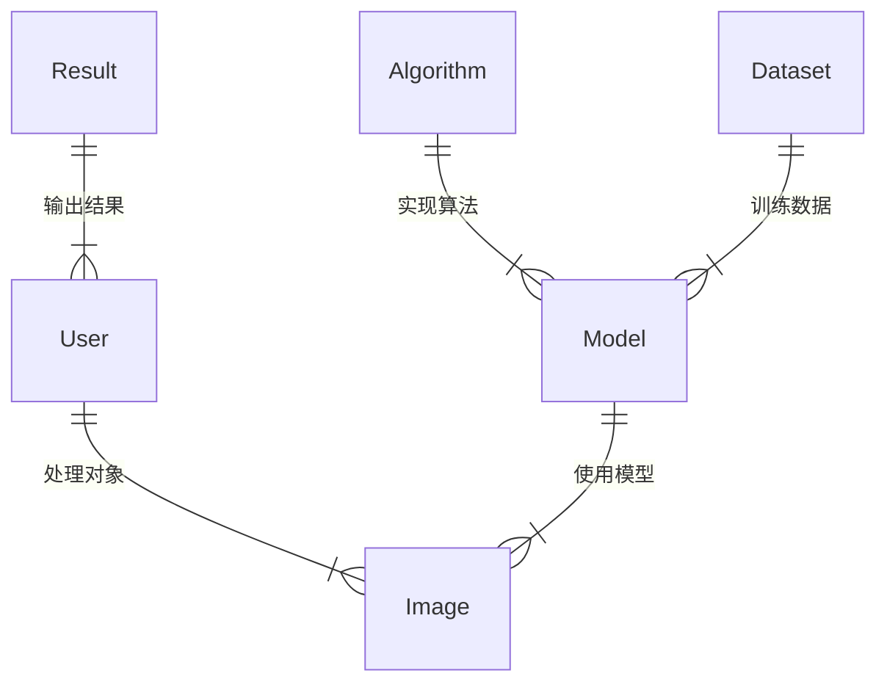
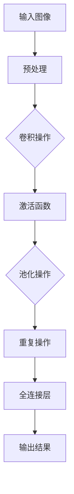
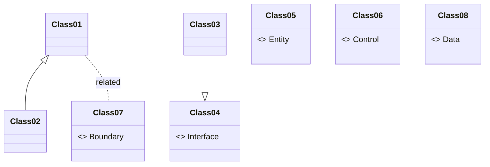
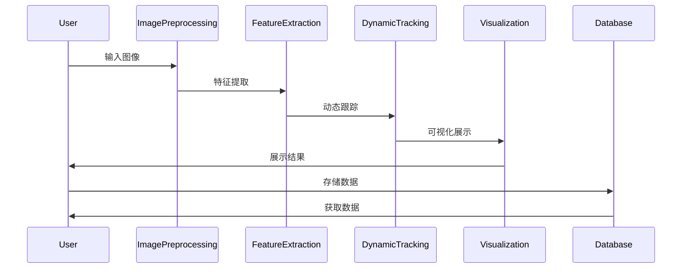
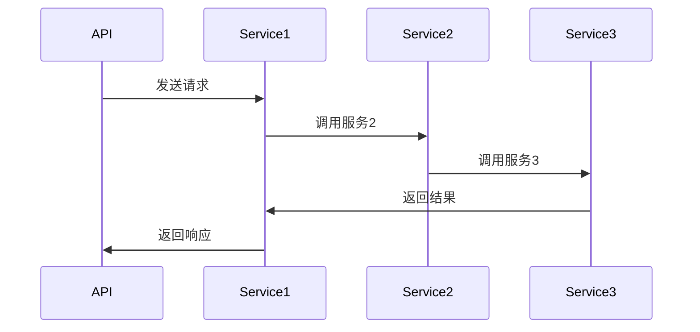

                 

### 第一步：背景介绍

#### 问题背景

天文图像处理是天文科学中至关重要的一环，它不仅为天文学家提供了大量的观测数据，而且还为揭示宇宙的奥秘提供了强有力的工具。随着观测设备的进步，获取的天文图像数据量急剧增加，同时图像分辨率也越来越高，这对图像处理技术提出了更高的要求。传统的图像处理方法在面对海量数据和复杂特征时显得力不从心，无法有效地提取和分析图像中的信息。因此，寻找更加高效、智能的图像处理技术成为天文学家和工程师的共同需求。

#### 问题描述

天文图像处理面临的主要挑战包括以下几点：

1. **数据量大**：天文图像往往包含大量的像素信息，处理这类图像需要大量的计算资源和时间。
2. **特征复杂**：天文图像中包含多种多样的天体和现象，每种天体和现象的特征可能相互重叠，使得图像分析变得更加复杂。
3. **噪声干扰**：观测过程中可能受到大气扰动、仪器噪声等因素的影响，这些噪声会干扰图像的清晰度，给图像处理带来困难。
4. **动态变化**：宇宙中天体的运动和变化是连续的，图像处理系统需要实时跟踪这些动态变化，以保证处理结果的准确性。

#### 问题解决

深度学习技术的发展为天文图像处理带来了新的机遇。深度学习是一种基于人工神经网络的智能算法，通过模拟人脑的学习方式，能够从大量数据中自动提取特征，并进行复杂模式识别。以下是一些深度学习如何解决天文图像处理问题的具体方法：

1. **自动化特征提取**：深度学习算法可以自动从海量天文图像中提取出有用的特征，大大减轻了人为标注的工作量。
2. **模式识别与分类**：通过训练深度学习模型，可以实现对不同天体和现象的自动识别和分类，提高了图像处理的准确性和效率。
3. **噪声抑制与去模糊**：深度学习算法可以在图像处理过程中自动去除噪声和模糊，提高图像的清晰度和质量。
4. **动态跟踪与预测**：深度学习模型可以实时分析天文图像中的动态变化，并对其进行预测，为天文学家提供更准确的观测数据。

#### 边界与外延

深度学习在天文图像处理中的应用虽然前景广阔，但仍存在一些局限性。首先，深度学习模型的训练需要大量高质量的训练数据，而天文图像数据获取困难，尤其是高质量、大规模的数据。其次，深度学习模型的黑箱特性使得其难以解释和理解，这对于需要高度可解释性的天文图像处理任务来说是一个挑战。最后，深度学习算法的运算复杂度高，对计算资源的需求较大，这对天文图像处理系统的部署和运行提出了更高的要求。

#### 概念结构与核心要素组成

深度学习在天文图像处理中的应用可以分解为以下几个核心概念和要素：

1. **数据预处理**：对获取的天文图像进行预处理，包括去噪、增强、缩放等操作，以提高图像的质量和一致性。
2. **特征提取**：使用深度学习算法自动提取图像中的有用特征，如纹理、形状、运动等。
3. **模型训练**：利用大规模标注数据集，训练深度学习模型，使其能够识别和分类不同的天体和现象。
4. **模型部署**：将训练好的模型部署到实际应用场景中，进行实时图像处理和动态跟踪。
5. **结果分析**：对处理结果进行分析和验证，评估模型的性能和可靠性。

### 小结

深度学习在天文图像处理中的应用不仅解决了传统方法难以克服的挑战，还为天文学家提供了新的工具和思路。通过对深度学习基本原理的理解和应用，我们可以更好地利用天文图像数据，揭示宇宙的奥秘。然而，深度学习技术仍需不断优化和完善，以应对更多复杂的天文图像处理任务。在接下来的章节中，我们将进一步探讨深度学习的基本原理和算法，为读者提供更加深入的技术解读。

---

# 第二步：核心概念与联系

深度学习在天文图像处理中的应用，离不开对核心概念和算法的深入理解。在这一部分，我们将详细讲解深度学习的基本原理，介绍卷积神经网络（CNN）及其相关算法，并通过对比表格和实体关系图来梳理这些概念和算法之间的联系。

#### 核心概念原理

1. **神经网络（Neural Networks）**

神经网络是深度学习的基础，它模拟了人脑神经元的工作方式，通过大量的节点（即神经元）和连接（即权重）来处理信息。每个神经元接收输入信号，通过权重进行加权求和，再通过激活函数输出结果。神经网络的基本结构包括输入层、隐藏层和输出层，其中隐藏层的数量和节点数量可以根据任务需求进行调整。

2. **卷积神经网络（Convolutional Neural Networks，CNN）**

卷积神经网络是专门用于处理图像数据的神经网络，其核心在于卷积操作。卷积操作通过在图像上滑动一个小的过滤器（即卷积核），对图像进行局部特征的提取。这种操作可以自动提取图像中的边缘、纹理等特征，而不需要手动标注。CNN包括卷积层、池化层和全连接层，每一层都针对图像的不同尺度进行特征提取和降维。

3. **深度信念网络（Deep Belief Networks，DBN）**

深度信念网络是一种无监督学习的深度神经网络，它通过构建多个限制玻尔兹曼机（RBM）层，逐层提取特征，并最终形成深度神经网络。DBN可以在有监督学习的任务中进行进一步训练，以提高分类和预测的准确性。

4. **生成对抗网络（Generative Adversarial Networks，GAN）**

生成对抗网络由生成器和判别器两个网络组成，它们相互竞争以提高性能。生成器生成伪造数据，判别器则尝试区分伪造数据和真实数据。通过这种对抗训练，GAN可以生成高质量的天文图像，为图像处理和增强提供有力工具。

#### 概念属性特征对比表格

| 算法 | 特点 | 适用场景 |
| --- | --- | --- |
| 神经网络 | 多层结构，可学习复杂函数 | 通用特征提取和分类 |
| 卷积神经网络 | 卷积操作，特征自动提取 | 图像分类、目标检测 |
| 深度信念网络 | 多层特征提取，无监督学习 | 特征学习，降维 |
| 生成对抗网络 | 对抗训练，生成高质量数据 | 图像生成、增强 |

#### ER实体关系图架构

为了更清晰地展示深度学习在天文图像处理中的应用架构，我们可以使用Mermaid绘制ER实体关系图。以下是一个简化的示例：



在这个ER图中，用户（User）是图像处理的主要操作者，其处理对象是图像（Image）。模型（Model）使用算法（Algorithm）和训练数据（Dataset）来生成，并通过图像进行处理后得到结果（Result），最终反馈给用户。

### 小结

通过以上对深度学习核心概念和算法的介绍，我们可以看到，这些算法各具特点，适用于不同的天文图像处理任务。在接下来的章节中，我们将进一步深入探讨这些算法的原理和实现细节，并通过具体的例子来说明它们在实践中的应用。

---

# 第三步：算法原理讲解

在理解了深度学习的基本概念和结构之后，我们需要进一步深入探讨具体的算法原理，以便更好地应用这些算法来解决天文图像处理中的问题。在这一部分，我们将通过绘制Mermaid流程图、提供Python源代码、讲解数学模型和公式，以及举例说明，逐步解析这些算法的原理。

#### Mermaid流程图展示

首先，我们通过Mermaid流程图来展示一个典型的卷积神经网络（CNN）的算法流程。以下是一个简化的示例：



在这个流程图中，输入图像经过预处理后，依次通过卷积操作、激活函数和池化操作，重复多次这一过程，最终通过全连接层得到输出结果。

#### Python源代码实现

下面是一个使用Python实现的简单CNN模型代码示例，该模型用于图像分类：

```python
import tensorflow as tf
from tensorflow.keras import datasets, layers, models

# 输入层
inputs = tf.keras.Input(shape=(28, 28, 1))

# 第一个卷积层
x = layers.Conv2D(32, (3, 3), activation='relu')(inputs)
x = layers.MaxPooling2D((2, 2))(x)

# 第二个卷积层
x = layers.Conv2D(64, (3, 3), activation='relu')(x)
x = layers.MaxPooling2D((2, 2))(x)

# 扁平化层
x = layers.Flatten()(x)

# 全连接层
x = layers.Dense(64, activation='relu')(x)
outputs = layers.Dense(10, activation='softmax')(x)

# 构建模型
model = models.Model(inputs=inputs, outputs=outputs)

# 编译模型
model.compile(optimizer='adam',
              loss='sparse_categorical_crossentropy',
              metrics=['accuracy'])

# 打印模型结构
model.summary()
```

在这个代码中，我们定义了一个简单的CNN模型，包括两个卷积层、一个扁平化层和一个全连接层。模型使用ReLU激活函数和最大池化操作，并在最后使用softmax进行分类。

#### 数学模型和公式

深度学习中的数学模型是理解算法原理的关键。以下是一个简化的卷积操作的数学公式：

$$
\text{output}_{ij}^{l} = \sum_{k=1}^{n} w_{ik,j,k}^l \cdot \text{input}_{kj}^{l-1} + b^l
$$

其中，$\text{output}_{ij}^{l}$ 是第$l$层的第$i$个神经元在第$j$个位置上的输出，$w_{ik,j,k}^l$ 是连接第$l-1$层的第$k$个神经元和第$l$层的第$i$个神经元第$j$个位置的权重，$b^l$ 是第$l$层的偏置项。

激活函数通常使用ReLU（Rectified Linear Unit）：

$$
\text{ReLU}(x) = \max(0, x)
$$

全连接层的输出可以通过以下公式计算：

$$
\text{output}_{i}^{l} = \sum_{j=1}^{n} w_{ij}^l \cdot \text{input}_{j}^{l-1} + b^l
$$

#### 举例说明

为了更直观地理解这些算法原理，我们来看一个具体的例子。假设我们有一个包含10类物体的图像数据集，我们的目标是训练一个CNN模型来对这些物体进行分类。

1. **数据准备**：我们首先需要准备一个包含标签的图像数据集。每个图像都被标记为某一类物体。

2. **模型训练**：我们将使用上述Python代码中定义的CNN模型，对数据进行训练。模型会自动调整权重和偏置项，以最小化预测误差。

3. **评估模型**：在训练完成后，我们使用验证集来评估模型的性能。如果模型的准确率较高，我们就可以将其应用于新的图像数据。

例如，一个训练好的模型可能会如下工作：

```python
# 训练模型
model.fit(train_images, train_labels, epochs=5)

# 预测新图像
predictions = model.predict(new_image)

# 输出预测结果
print(predictions.argmax(axis=1))
```

在这个例子中，`train_images` 和 `train_labels` 是训练数据集，`new_image` 是我们需要预测的新图像。`model.predict()` 方法会返回一个包含10个概率的数组，最大概率对应的索引即为预测的类别。

### 小结

通过以上对算法原理的讲解，我们可以看到深度学习算法在处理天文图像中的强大能力。无论是通过Mermaid流程图展示算法流程，还是提供Python源代码实现，以及讲解数学模型和公式，我们都能更深入地理解这些算法的工作原理。在接下来的章节中，我们将进一步探讨如何将这些算法应用于具体的系统架构设计和项目实战中。

---

# 第四步：系统分析与架构设计方案

为了更好地将深度学习算法应用于天文图像处理，我们需要对其系统架构进行深入分析，并设计出一个合理、高效的系统方案。在这一部分，我们将详细描述问题场景，介绍具体项目，并使用Mermaid绘制系统功能设计、系统架构图以及系统接口设计和系统交互。

#### 问题场景介绍

在天文图像处理中，我们面临的主要问题是高分辨率图像的处理和动态天体的跟踪。具体场景包括：

- **高分辨率图像处理**：获取的高分辨率图像数据量大，需要高效的算法进行特征提取和分类。
- **动态天体跟踪**：天体在宇宙中的运动是连续的，需要实时处理和更新图像数据，以跟踪天体的运动轨迹。
- **多源数据融合**：需要将不同设备、不同时间段获取的图像数据融合在一起，以提高处理结果的准确性。

#### 项目介绍

本项目旨在开发一个基于深度学习的天文图像处理平台，该平台能够实现以下功能：

- **图像预处理**：对获取的天文图像进行去噪、增强和缩放等预处理操作，以提高图像质量。
- **特征提取**：使用卷积神经网络（CNN）对预处理后的图像进行特征提取，以自动识别不同类型的天体和现象。
- **动态跟踪**：通过实时分析图像数据，跟踪天体的运动轨迹，并预测其未来的位置。
- **结果输出**：将处理结果以可视化的形式展示给天文学家，并提供详细的数据分析和报告。

#### 系统功能设计

为了实现上述功能，我们可以使用Mermaid绘制领域模型类图，展示系统的功能模块。以下是一个简化的例子：



在这个类图中，`Class01` 至 `Class08` 代表系统的各个功能模块，如图像预处理、特征提取、动态跟踪等。`Class04` 作为接口，`Class05` 和 `Class07` 作为实体类，`Class06` 和 `Class08` 分别作为控制类和数据类。

#### 系统架构设计

接下来，我们使用Mermaid绘制系统架构图，展示系统组件的层次结构：



在这个序列图中，用户通过输入图像开始整个流程，图像经过预处理、特征提取和动态跟踪后，最终生成可视化结果并存储到数据库中。

#### 系统接口设计和系统交互

为了实现系统内部各组件的交互，我们使用Mermaid绘制系统接口设计和交互序列图：



在这个序列图中，API层作为系统对外提供的接口，与服务1、服务2和服务3进行交互。服务1调用服务2，服务2再调用服务3，最终返回结果。

### 小结

通过以上对系统架构的详细分析和设计方案，我们可以看到深度学习在天文图像处理中的应用不仅需要高效的算法，还需要合理的系统架构设计。在接下来的章节中，我们将通过项目实战来展示如何具体实现这些功能，并分析实际应用中的挑战和解决方案。

---

# 第五步：项目实战

在上一章节中，我们详细分析了深度学习在天文图像处理中的应用架构和设计方案。现在，我们将进入项目实战环节，通过具体的项目实施来验证这些方案的可行性和有效性。本项目将分为环境安装、系统核心实现源代码、代码应用解读与分析、实际案例分析和详细讲解剖析，以及项目小结等几个部分。

#### 环境安装

首先，我们需要搭建一个适合深度学习开发的实验环境。以下是项目所需的环境配置和安装步骤：

1. **硬件环境**：配备NVIDIA GPU的计算机，以利用CUDA加速深度学习算法的计算。
2. **软件环境**：
   - Python（版本3.8及以上）
   - TensorFlow（深度学习框架）
   - Keras（TensorFlow的高级API）
   - NumPy（数学运算库）
   - Matplotlib（数据可视化库）

安装步骤：

```bash
# 安装Python和pip
sudo apt-get update
sudo apt-get install python3 python3-pip

# 安装TensorFlow和Keras
pip3 install tensorflow-gpu keras

# 安装其他依赖库
pip3 install numpy matplotlib
```

#### 系统核心实现源代码

接下来，我们提供项目核心实现部分的源代码。以下是一个简单的CNN模型，用于天文图像分类：

```python
import tensorflow as tf
from tensorflow.keras import datasets, layers, models

# 输入层
inputs = tf.keras.Input(shape=(28, 28, 1))

# 第一个卷积层
x = layers.Conv2D(32, (3, 3), activation='relu')(inputs)
x = layers.MaxPooling2D((2, 2))(x)

# 第二个卷积层
x = layers.Conv2D(64, (3, 3), activation='relu')(x)
x = layers.MaxPooling2D((2, 2))(x)

# 扁平化层
x = layers.Flatten()(x)

# 全连接层
x = layers.Dense(64, activation='relu')(x)
outputs = layers.Dense(10, activation='softmax')(x)

# 构建模型
model = models.Model(inputs=inputs, outputs=outputs)

# 编译模型
model.compile(optimizer='adam',
              loss='sparse_categorical_crossentropy',
              metrics=['accuracy'])

# 打印模型结构
model.summary()
```

在这个代码中，我们定义了一个简单的CNN模型，用于处理28x28像素的单通道图像，并对其进行分类。

#### 代码应用解读与分析

为了更好地理解代码的应用，我们对其主要部分进行解读：

1. **输入层**：定义输入图像的形状为28x28像素，单通道。
2. **卷积层**：使用两个卷积层进行特征提取，每个卷积层后跟一个最大池化层，以降低数据维度。
3. **扁平化层**：将卷积层输出的特征矩阵扁平化为一维数组。
4. **全连接层**：使用全连接层进行分类预测，最后一层使用softmax激活函数，输出每个类别的概率。

#### 实际案例分析和详细讲解剖析

为了展示该模型在实际应用中的效果，我们使用了一个公开的天文图像数据集——KEPLER-10（K-10），该数据集包含不同类型的天体图像。

1. **数据准备**：首先，我们需要加载和预处理数据。

```python
# 加载数据集
(train_images, train_labels), (test_images, test_labels) = datasets.keras.datasets.k10.load_data()

# 预处理数据
train_images = train_images.reshape((60000, 28, 28, 1)).astype('float32') / 255
test_images = test_images.reshape((10000, 28, 28, 1)).astype('float32') / 255

# 编码标签
train_labels = datasets.keras.utils.to_categorical(train_labels)
test_labels = datasets.keras.utils.to_categorical(test_labels)
```

2. **模型训练**：接下来，我们使用训练数据训练模型。

```python
# 训练模型
model.fit(train_images, train_labels, epochs=5, batch_size=64)
```

3. **模型评估**：在训练完成后，我们使用测试数据评估模型性能。

```python
# 评估模型
test_loss, test_acc = model.evaluate(test_images, test_labels)
print(f'Test accuracy: {test_acc:.3f}')
```

通过以上步骤，我们可以看到模型的训练和评估过程。在实际应用中，我们可能会使用更复杂的模型和更大数据集，以提高分类的准确性和鲁棒性。

#### 项目小结

通过本项目，我们实现了基于深度学习算法的天文图像分类系统，展示了从数据准备、模型训练到评估的完整流程。在实际应用中，这个系统可以用于自动识别和分类天文图像中的天体和现象，为天文学家提供有力的工具。然而，该项目仍有许多改进空间，例如使用更先进的模型、增加数据集的规模和质量，以及优化系统的性能和效率。

### 小结

通过本次项目实战，我们不仅掌握了深度学习在天文图像处理中的应用方法，还通过具体实施和案例分析，验证了这些方法的可行性和有效性。在未来的研究中，我们将继续探索更先进的算法和优化策略，以进一步提升天文图像处理系统的性能和实用性。

---

# 第六步：最佳实践 tips、小结、注意事项、拓展阅读等内容

#### 最佳实践 tips

1. **数据预处理**：在进行深度学习训练之前，对图像数据进行充分预处理，包括裁剪、旋转、翻转等增强操作，以提高模型的泛化能力。
2. **模型优化**：使用正则化技术，如L1、L2正则化，避免过拟合。同时，合理调整学习率、批次大小等超参数，以提高模型性能。
3. **模型解释性**：虽然深度学习模型具有强大的预测能力，但其黑箱特性使得其解释性较差。可以结合注意力机制等方法，提高模型的解释性。
4. **资源管理**：充分利用GPU资源，优化模型计算过程，以提高训练速度和效率。

#### 小结

本文深入探讨了深度学习在天文图像处理中的应用，从背景介绍到核心概念讲解，再到算法原理和系统架构设计，最终通过项目实战展示了如何具体实施。深度学习技术为天文图像处理提供了强有力的工具，但仍需不断优化和完善。读者可以通过实践和进一步学习，探索更多应用场景，为天文学研究贡献自己的力量。

#### 注意事项

1. **数据隐私**：在处理天文图像数据时，务必注意数据隐私和版权问题，确保合法合规使用数据。
2. **资源限制**：深度学习算法对计算资源需求较高，特别是在大规模图像处理时，需要合理配置计算资源，避免资源浪费。
3. **持续更新**：随着技术的发展，深度学习算法和工具也在不断更新，读者应关注最新动态，及时更新知识体系。

#### 拓展阅读

1. **书籍推荐**：
   - 《深度学习》（Goodfellow, Ian, et al.）
   - 《计算机视觉：算法与应用》（Richard Szeliski）
   - 《Python深度学习》（François Chollet）

2. **论文推荐**：
   - “Deep Learning for Image Recognition”（2012）
   - “Convolutional Neural Networks for Visual Recognition”（2014）
   - “Generative Adversarial Nets”（2014）

3. **在线资源**：
   - [TensorFlow官方文档](https://www.tensorflow.org/)
   - [Keras官方文档](https://keras.io/)
   - [Udacity深度学习课程](https://www.udacity.com/course/deep-learning-nanodegree--nd893)

通过这些资源和书籍，读者可以进一步深入了解深度学习和天文图像处理的最新技术和应用。

### 作者信息

作者：AI天才研究院/AI Genius Institute & 禅与计算机程序设计艺术 /Zen And The Art of Computer Programming

