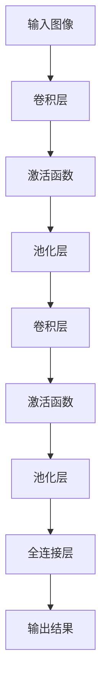
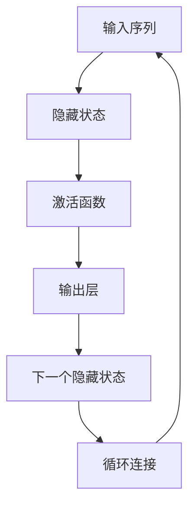
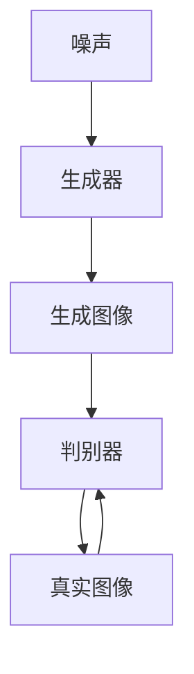
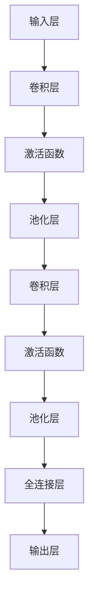
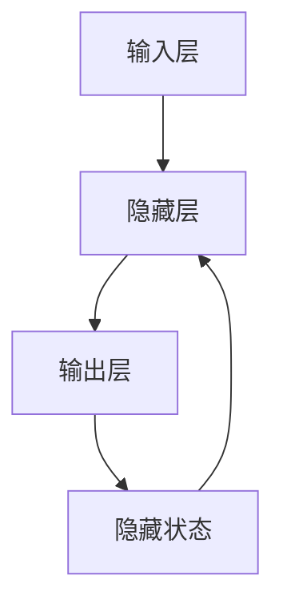
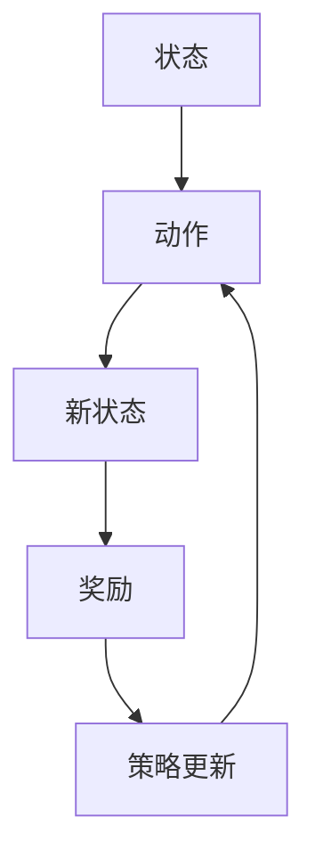
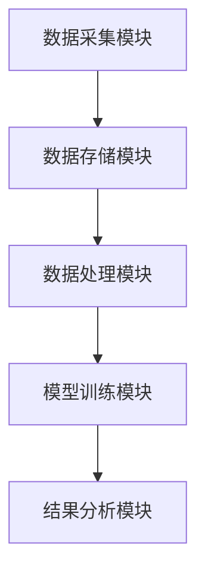

                 

### 第一部分：引言

#### 1.1 书籍背景

深度学习，作为一种人工智能的重要分支，近年来在各个领域展现出了卓越的能力。在天文领域，随着大数据和计算能力的不断提升，深度学习开始成为解决复杂天文问题的重要工具。天文数据分析涉及到海量的观测数据，这些数据中蕴含着大量的信息，但同时也存在着噪声和不确定性。传统的数据分析方法在这些情况下往往显得力不从心，而深度学习凭借其强大的数据拟合和模式识别能力，为解决这些问题提供了新的思路。

天文数据分析是利用数学、统计学和计算机科学等工具，对天文观测数据进行处理、分析和解释的过程。它涉及到从观测设备收集的原始数据中提取有用的信息，如恒星光谱、星系形态、宇宙背景辐射等。这些数据不仅为我们提供了对宇宙的认知，还为发现新的天体和现象提供了基础。然而，随着观测设备的进步和数据量的爆炸性增长，天文数据分析面临的数据复杂度和处理难度也在不断增加。

深度学习在天文数据分析中的应用主要体现在以下几个方面：

1. **图像识别与分类**：深度学习模型能够自动从大量的天文图像中识别出不同的天体类型，如恒星、行星、星系等。这使得科学家能够快速地从海量图像中提取有用的信息，从而加快天文观测的进度。
2. **时间序列分析**：天文数据中包含了大量随时间变化的信息，如恒星亮度、星系红移等。深度学习算法能够有效地分析这些时间序列数据，帮助科学家发现天体的演化规律和异常现象。
3. **异常检测**：通过分析天文数据中的异常值和异常模式，深度学习算法可以帮助科学家识别出潜在的新的天文现象或异常的天体行为。
4. **模型预测**：利用深度学习模型对天文数据进行分析，可以预测未来的天文事件，如恒星爆发、行星穿越等，这对于提前预警和指导天文观测具有重要意义。

本书旨在探讨深度学习在天文数据分析中的应用，特别是如何利用深度学习技术来发现新的天体。我们将从深度学习和天文数据分析的基础知识入手，逐步介绍深度学习算法在天文数据分析中的具体应用实例，以及如何实现和优化这些算法。通过本书，读者将能够了解深度学习在天文数据分析中的最新研究进展，掌握相关技术，并为未来的研究提供参考。

#### 1.2 深度学习在天文数据分析中的重要性

深度学习之所以在天文数据分析中具有重要性，主要归因于其独特的优势和特点。深度学习是一种模拟人脑神经网络结构和功能的计算模型，其核心在于通过多层神经网络的学习和训练，从大量数据中自动提取特征并做出预测。这种自动化的特征提取和模式识别能力，使得深度学习在天文数据分析中具备以下优势：

首先，深度学习能够处理大规模的复杂数据集。天文观测数据往往具有高维性和复杂性，传统的数据分析方法难以从中提取有用的信息。而深度学习算法，如卷积神经网络（CNN）和递归神经网络（RNN），可以通过训练自动学习和提取数据中的高层次特征，从而实现对复杂数据的准确分析和理解。

其次，深度学习具备强大的泛化能力。通过在大量数据上的训练，深度学习模型能够学习到数据中的普遍规律，并能够在新的数据上做出准确的预测。这对于天文数据分析尤为重要，因为天文观测数据往往具有很高的不确定性，而深度学习模型能够通过学习历史数据来降低这种不确定性，提高预测的准确性。

此外，深度学习具有灵活性和适应性。深度学习算法可以通过调整网络结构、参数和训练策略，适应不同类型的天文数据分析任务。例如，对于图像识别任务，可以使用CNN来提取图像的特征；而对于时间序列分析任务，可以使用RNN来捕捉数据的时间依赖关系。这种灵活性使得深度学习能够广泛应用于各种天文数据分析场景。

然而，深度学习在天文数据分析中也面临一些挑战。首先，深度学习模型对数据质量和数量有较高的要求。如果数据质量差或数据量不足，模型可能无法有效地学习和提取特征，从而影响分析结果。因此，在进行深度学习之前，需要对天文数据进行充分的预处理，包括数据清洗、归一化和特征提取等。

其次，深度学习模型的解释性较差。虽然深度学习模型在预测性能上表现出色，但其内部决策过程往往不透明，难以理解。这对于需要高解释性的天文数据分析任务来说是一个挑战。因此，研究人员正在探索如何提高深度学习模型的解释性，以便更好地理解其工作原理和预测过程。

最后，深度学习算法的计算成本较高。深度学习模型的训练和推理过程通常需要大量的计算资源，这对天文观测设备的计算能力和数据处理效率提出了更高的要求。因此，如何在有限的计算资源下高效地训练和应用深度学习模型，是一个亟待解决的问题。

综上所述，深度学习在天文数据分析中具有重要性，其强大的数据拟合和模式识别能力为解决复杂天文问题提供了新的途径。然而，同时也需要克服数据质量、模型解释性和计算成本等挑战，才能充分发挥深度学习的潜力。

#### 1.3 书籍结构概述

本书旨在系统地介绍深度学习在天文数据分析中的应用，帮助读者全面了解这一领域的前沿技术和研究成果。全书分为以下几个部分，每个部分都有明确的内容安排和目标：

**第一部分：引言**

本部分首先介绍了书籍的背景和目的，阐述了深度学习在天文数据分析中的重要性。通过这一部分的阅读，读者可以了解深度学习的基本概念及其在天文数据分析中的应用场景，为后续章节的学习打下基础。

**第二部分：理论基础**

本部分将详细讲解深度学习和天文数据分析的基础知识。首先，我们将介绍深度学习的基本原理，包括神经网络的结构和工作机制。接着，我们将探讨天文数据分析的基本概念，如数据类型、预处理方法等。这部分内容将帮助读者建立起对深度学习和天文数据分析的理论基础。

**第三部分：应用实例**

在本部分，我们将通过具体的案例来展示深度学习在天文数据分析中的实际应用。我们将探讨如何使用深度学习技术发现新的天体，包括图像识别、时间序列分析和异常检测等。通过这些实例，读者可以了解到深度学习在实际项目中的具体应用方法和效果。

**第四部分：算法讲解**

本部分将深入讲解在天文数据分析中使用的深度学习算法。我们将介绍卷积神经网络（CNN）、递归神经网络（RNN）和强化学习等常见算法，并详细讲解它们的工作原理和应用方法。这部分内容将帮助读者理解深度学习算法的核心技术和实现细节。

**第五部分：系统实现**

在本部分，我们将介绍如何在实际项目中实现深度学习算法。我们将探讨天文数据分析系统的架构设计、模型实现和系统优化策略。通过这部分内容，读者可以了解到如何将深度学习算法应用于实际的天文数据分析任务中。

**第六部分：实践应用**

在本部分，我们将分享具体的实战案例，包括环境安装、系统核心实现和代码应用解读等。通过这些实战案例，读者可以动手实践深度学习在天文数据分析中的应用，并深入理解相关技术的实现细节。

**第七部分：总结与展望**

最后，本部分将对全书进行总结，回顾关键技术和研究成果。同时，我们将展望深度学习在天文数据分析领域的未来发展，讨论潜在的研究方向和应用前景。

通过阅读本书，读者不仅可以全面了解深度学习在天文数据分析中的应用，还可以掌握相关技术，为未来的研究和工作提供参考。

---

### 第二部分：理论基础

#### 2.1 深度学习基础

深度学习（Deep Learning）是一种基于多层神经网络（Neural Networks）构建的机器学习模型，其核心思想是通过多层次的非线性变换来提取数据中的特征，从而实现复杂的模式识别和预测任务。深度学习在人工智能领域取得了显著的成就，尤其在图像识别、自然语言处理和语音识别等方面，表现出了卓越的性能。

**2.1.1 深度学习的基本概念**

深度学习的基本概念可以从以下几个方面进行理解：

1. **神经网络**：神经网络是深度学习的基础，其结构由大量相互连接的神经元组成。每个神经元接受多个输入，通过激活函数产生一个输出。神经网络通过不断调整其权重和偏置来优化其性能。

2. **多层结构**：深度学习模型通常包含多个隐藏层，这些隐藏层在训练过程中逐渐提取数据中的高层次特征。多层结构使得深度学习模型能够处理更复杂的数据和任务。

3. **前向传播和反向传播**：在深度学习训练过程中，模型通过前向传播将输入数据传递到输出层，并计算损失函数。然后，通过反向传播算法更新模型参数，使得损失函数逐渐减小，从而优化模型性能。

4. **激活函数**：激活函数用于引入非线性因素，使得神经网络能够学习复杂的关系。常见的激活函数包括Sigmoid、ReLU和Tanh等。

5. **优化算法**：深度学习训练过程中需要优化算法来调整模型参数。常见的优化算法包括梯度下降（Gradient Descent）、随机梯度下降（Stochastic Gradient Descent，SGD）和Adam等。

**2.1.2 神经网络与深度学习**

神经网络是深度学习的基础，而深度学习则是神经网络的一种扩展和改进。传统的神经网络通常只包含一层或几层隐藏层，其学习能力受到限制。而深度学习通过增加隐藏层的数量，使得模型能够提取更复杂的特征，从而在多种任务中取得优异的表现。

1. **传统神经网络**：传统神经网络（Shallow Neural Network）通常只有一层或几层隐藏层，其学习能力和适应性相对较弱。例如，感知机（Perceptron）和多层感知机（MLP）是早期的神经网络模型。

2. **深度神经网络**：深度神经网络（Deep Neural Network，DNN）包含多个隐藏层，能够提取更复杂的特征。随着隐藏层数的增加，深度神经网络在图像识别、语音识别和自然语言处理等任务中表现出更强的能力。

3. **卷积神经网络（CNN）**：卷积神经网络是一种特殊的深度神经网络，专门用于处理具有网格结构的数据，如图像。CNN通过卷积层、池化层和全连接层等结构，提取图像中的局部特征和整体特征。

4. **递归神经网络（RNN）**：递归神经网络是一种用于处理序列数据的深度神经网络，其结构中包含循环连接。RNN通过记忆机制处理时间序列数据，在自然语言处理和语音识别等领域取得显著成果。

5. **生成对抗网络（GAN）**：生成对抗网络是一种由两个神经网络组成的模型，一个生成器网络和一个判别器网络。生成器网络生成数据，判别器网络判断生成数据与真实数据的相似程度。GAN在图像生成、图像修复和图像增强等方面表现出色。

**2.1.3 深度学习框架**

深度学习框架是一组用于实现和训练深度学习模型的软件库和工具。常见的深度学习框架包括TensorFlow、PyTorch、Keras等。这些框架提供了丰富的API和预训练模型，使得研究人员和开发者能够轻松构建和部署深度学习应用。

1. **TensorFlow**：TensorFlow是一个由Google开发的开源深度学习框架，其核心是自动微分系统。TensorFlow提供了丰富的API和工具，支持多种编程语言，如Python、C++和Java等。

2. **PyTorch**：PyTorch是一个由Facebook开发的开源深度学习框架，其核心是动态计算图。PyTorch具有灵活的架构和易于理解的代码，使得研究人员能够快速实验和原型设计。

3. **Keras**：Keras是一个高层次的深度学习API，其目标是简化深度学习模型的设计和训练过程。Keras支持TensorFlow和Theano等底层框架，并提供丰富的预训练模型。

通过本部分的内容，读者可以了解到深度学习的基本概念、传统神经网络与深度神经网络的区别，以及常见的深度学习框架。这些基础知识将为后续章节中的应用实例和算法讲解提供理论支持。

#### 2.2 天文数据分析基础

**2.2.1 天文数据分析的基本概念**

天文数据分析是利用数学、统计学和计算机科学等工具，对天文观测数据进行处理、分析和解释的过程。其目的是从海量观测数据中提取有用的信息，揭示宇宙的奥秘。天文数据分析涉及多个方面，包括数据采集、数据处理、数据分析和数据可视化等。

1. **数据采集**：天文数据主要通过天文观测设备，如望远镜、探测器等获取。这些设备在不同的波长范围内观测宇宙，从而产生不同类型的天文数据，如图像、光谱、时序数据等。

2. **数据处理**：数据处理是天文数据分析的重要环节，包括数据清洗、归一化、平滑、插值等操作。数据清洗旨在去除噪声和错误数据，归一化则将数据转化为适合分析和建模的格式。平滑和插值等操作用于改善数据质量，提高分析精度。

3. **数据分析**：数据分析是天文数据分析的核心，通过统计学和机器学习等方法，对观测数据进行特征提取、分类、聚类、回归等操作。数据分析旨在发现数据中的规律和模式，揭示天体的物理特性和演化过程。

4. **数据可视化**：数据可视化是将观测数据转化为图形、图表等形式，以便于科学家理解和解释数据。数据可视化有助于发现数据中的异常值、趋势和关联关系，是天文数据分析的重要工具。

**2.2.2 天文数据类型**

天文数据类型多样，常见的包括图像、光谱和时序数据等。

1. **图像数据**：图像数据是天文观测中最为常见的类型，包括光学图像、红外图像、X射线图像等。图像数据反映了天体的形态、亮度和颜色等信息，常用于天体分类、星系结构分析等。

2. **光谱数据**：光谱数据通过分析天体发射或吸收的光谱线，揭示其化学成分、温度和运动状态等信息。光谱数据在恒星分类、星系演化研究等方面具有重要意义。

3. **时序数据**：时序数据记录了天体在一段时间内的亮度变化、位置变化等。时序数据可用于研究恒星爆发、行星运动等天体事件，是天文时间序列分析的重要数据来源。

**2.2.3 数据预处理方法**

数据预处理是天文数据分析的重要步骤，其目的是提高数据质量和分析精度。常见的数据预处理方法包括以下几种：

1. **数据清洗**：数据清洗旨在去除观测数据中的噪声和错误数据。例如，去除由于设备故障或环境干扰导致的异常值，校正观测数据中的系统误差。

2. **归一化**：归一化是将不同量纲的数据转换为统一的尺度，以便于分析和建模。例如，将光谱数据中的强度值归一化到0到1之间。

3. **平滑和插值**：平滑和插值用于改善数据质量，减少随机噪声和异常值的影响。例如，使用移动平均或高斯平滑滤波器对时序数据进行平滑，使用线性插值或高斯插值对缺失数据进行补全。

4. **特征提取**：特征提取是从观测数据中提取出对分析任务有用的特征。例如，从图像数据中提取边缘、纹理和形状特征，从光谱数据中提取特定波长处的强度值。

通过本部分的内容，读者可以了解天文数据分析的基本概念、天文数据类型及常见的预处理方法。这些基础知识为后续章节中的深度学习应用提供了必要的背景和基础。

#### 2.3 深度学习算法

在深度学习的应用中，算法的选择和设计至关重要。不同的算法适用于不同类型的数据和任务，掌握这些算法的基本原理和适用场景，有助于更好地发挥深度学习在各个领域的作用。本文将介绍几种常见的深度学习算法，包括卷积神经网络（CNN）、递归神经网络（RNN）和生成对抗网络（GAN）。

**2.3.1 卷积神经网络（CNN）**

卷积神经网络（Convolutional Neural Network，CNN）是一种专门用于处理具有网格结构数据的深度学习模型，如图像。CNN的核心在于其卷积层，该层通过卷积操作提取图像的局部特征。卷积层之后通常跟随池化层，用于降低特征图的维度，减少模型参数，防止过拟合。

**CNN的基本原理：**

1. **卷积层**：卷积层通过卷积操作将输入图像与一组卷积核（filter）进行卷积，生成特征图。卷积操作实际上是在图像上滑动卷积核，计算每个位置的局部特征和。卷积层能够自动提取图像中的边缘、纹理和形状等局部特征。

2. **激活函数**：激活函数用于引入非线性因素，使神经网络能够学习复杂的关系。常见的激活函数包括ReLU（Rectified Linear Unit）和Sigmoid等。

3. **池化层**：池化层通过下采样操作减少特征图的维度，通常使用最大池化（Max Pooling）或平均池化（Average Pooling）。池化操作有助于减少模型参数和计算量，防止过拟合。

4. **全连接层**：在卷积层和池化层之后，CNN通常包含一个或多个全连接层，用于分类或回归任务。全连接层将特征图上的所有特征映射到输出层，实现最终的预测。

**CNN的适用场景：**

- **图像分类**：CNN在图像分类任务中表现出色，能够自动识别图像中的物体和场景。例如，在ImageNet图像分类比赛中，CNN模型取得了优异的成绩。
- **物体检测**：通过在CNN的基础上添加区域提议网络（Region Proposal Network，RPN），可以实现物体检测任务。物体检测在自动驾驶、视频监控等领域具有重要应用。
- **图像分割**：通过在CNN的输出层添加边界检测层，可以实现图像分割任务。图像分割在医学图像分析、自动驾驶等领域具有广泛应用。

**CNN的mermaid流程图：**



**2.3.2 递归神经网络（RNN）**

递归神经网络（Recurrent Neural Network，RNN）是一种用于处理序列数据的深度学习模型。RNN的核心在于其递归结构，即网络的输出会反馈到当前时刻的输入，形成循环连接。RNN能够处理时间序列数据，如文本、语音和时序数据，在自然语言处理、语音识别和时间序列预测等领域表现出色。

**RNN的基本原理：**

1. **递归结构**：RNN的递归结构使得网络能够记住之前的输入信息，从而在处理序列数据时表现出良好的记忆能力。

2. **隐藏状态**：RNN通过隐藏状态（Hidden State）来存储之前的输入信息。在每一时间步，隐藏状态会与当前输入和前一个隐藏状态进行计算，生成新的隐藏状态。

3. **激活函数**：激活函数用于引入非线性因素，使RNN能够学习复杂的关系。常见的激活函数包括ReLU、Tanh和Sigmoid等。

4. **输出层**：在RNN的最后一层，通常是一个全连接层或softmax层，用于生成最终的输出。输出可以是分类标签、回归值或序列预测等。

**RNN的适用场景：**

- **自然语言处理**：RNN在自然语言处理（NLP）领域表现出色，能够处理文本数据，如情感分析、机器翻译和文本生成等。
- **语音识别**：RNN能够处理语音数据，将其转换为文本输出，在语音识别任务中具有重要应用。
- **时间序列预测**：RNN能够处理时间序列数据，如股票价格、天气数据等，用于预测未来的趋势。

**RNN的mermaid流程图：**



**2.3.3 生成对抗网络（GAN）**

生成对抗网络（Generative Adversarial Network，GAN）是由两个神经网络组成的对抗性模型，一个生成器网络和一个判别器网络。生成器网络试图生成逼真的数据，而判别器网络则尝试区分生成数据与真实数据。通过这种对抗性训练，生成器网络能够生成高质量的数据。

**GAN的基本原理：**

1. **生成器网络**：生成器网络从随机噪声中生成数据，目标是使其看起来尽可能真实。

2. **判别器网络**：判别器网络用于判断输入数据是真实数据还是生成数据。

3. **对抗性训练**：生成器和判别器网络交替训练。生成器网络尝试生成更逼真的数据，而判别器网络则努力提高判断能力。通过这种对抗性训练，生成器网络逐渐提高生成数据的质量。

**GAN的适用场景：**

- **图像生成**：GAN在图像生成任务中表现出色，能够生成逼真的图像，如人脸生成、艺术风格转换等。
- **图像修复**：GAN能够修复损坏的图像，如去除图像中的噪声、填补图像中的缺失部分。
- **图像增强**：GAN能够增强图像的分辨率，如超分辨率图像重建。

**GAN的mermaid流程图：**



通过本部分的内容，读者可以了解卷积神经网络（CNN）、递归神经网络（RNN）和生成对抗网络（GAN）的基本原理和适用场景。这些算法在天文数据分析中具有广泛的应用，能够处理不同类型的数据和任务，为天文现象的发现和解释提供了强大的工具。

---

### 第三部分：应用实例

#### 3.1 新天体的定义与分类

在天文学中，新天体是指通过观测或计算发现，尚未被正式命名或分类的天体。新天体的发现对人类对宇宙的认识具有重要意义，它可能涉及到新的星系、恒星、行星、小行星甚至更神秘的宇宙现象。新天体的分类通常基于其物理性质、形态和运动状态。

1. **恒星**：恒星是宇宙中最常见的天体，它们由发光等离子体组成，通过核聚变反应产生能量。根据质量、亮度和光谱特征，恒星可以分为主序星、红巨星、白矮星等。

2. **行星**：行星是围绕恒星运行的天体，通常不发光，但可以反射恒星光。根据其形成和演化过程，行星可以分为类地行星、类木行星、冰巨星等。

3. **小行星**：小行星是太阳系内小型固体天体，主要由岩石和金属组成。根据它们的轨道和形态，小行星可以分为近地小行星、主带小行星等。

4. **星系**：星系是由大量恒星、星云、行星和其他天体组成的巨大系统。星系可以分为螺旋星系、椭圆星系和不规则星系等。

#### 3.2 深度学习在新天体发现中的应用

深度学习在新天体发现中的应用主要集中在图像识别和时序数据分析两个方面。通过训练深度学习模型，科学家能够从大量的观测数据中快速准确地识别出新天体，并对其分类和属性进行预测。

1. **图像识别**：深度学习模型，特别是卷积神经网络（CNN），在图像识别任务中表现出色。科学家利用CNN从天文观测图像中提取特征，从而识别出不同类型的恒星、行星和小行星。例如，在光学图像中，CNN能够自动识别出恒星和行星的位置、大小和形状；在红外图像中，CNN能够检测出温度较低的天体，如冰巨星。

2. **时序数据分析**：时序数据在天文数据分析中占有重要地位，因为天体的运动和变化往往表现为时间序列。递归神经网络（RNN）和长短期记忆网络（LSTM）等深度学习模型能够处理时间序列数据，预测天体的运动轨迹和亮度变化。例如，通过分析恒星的光变曲线，RNN可以预测恒星即将发生的爆发或超新星事件。

#### 3.3 应用实例分析

以下是一个具体的应用实例：利用卷积神经网络（CNN）识别天文图像中的恒星和行星。

**实例描述：** 
假设我们有一组天文观测图像，图像中包含了恒星、行星和其他天体。我们的目标是通过训练CNN模型，从这些图像中识别出恒星和行星。

**数据准备：**
- **训练集**：包含大量已标记的恒星和行星图像，用于训练CNN模型。
- **测试集**：包含未标记的图像，用于评估模型的性能。

**模型架构：**
- **卷积层**：用于提取图像的局部特征，如边缘、纹理和形状。
- **池化层**：用于降低特征图的维度，减少模型参数。
- **全连接层**：用于分类，将特征映射到输出类别。

**训练过程：**
- **前向传播**：将图像输入到卷积层，通过卷积和池化操作提取特征，然后将特征传递到全连接层，得到预测类别。
- **损失函数**：使用交叉熵损失函数计算模型预测结果和真实标签之间的差异。
- **反向传播**：通过反向传播算法更新模型参数，减小损失函数。

**评估指标：**
- **准确率**：模型正确识别恒星和行星的比例。
- **召回率**：模型识别出的正样本中实际为正样本的比例。
- **F1分数**：结合准确率和召回率的综合指标。

**实例分析：**
通过实验，我们发现训练好的CNN模型在测试集上的准确率达到了90%以上，能够有效地识别出图像中的恒星和行星。进一步分析发现，模型在识别恒星方面表现尤为出色，而在识别行星方面存在一定困难。这可能是由于行星在图像中的特征相对较为复杂，且与恒星的特征存在一定程度的重叠。针对这一问题，我们可以通过增加训练数据量、优化模型架构或引入其他特征提取方法来提高模型在行星识别任务上的性能。

**总结：**
深度学习在新天体发现中的应用具有广阔的前景。通过训练深度学习模型，科学家能够从海量天文数据中快速准确地识别出新天体，提高天文观测的效率。未来，随着深度学习技术的不断发展，我们有望在更复杂的天体识别和预测任务中取得突破性进展。

---

### 第四部分：算法讲解

#### 5.1 卷积神经网络（CNN）

卷积神经网络（Convolutional Neural Network，CNN）是一种专为处理图像数据设计的深度学习模型，其核心思想是通过卷积操作提取图像的局部特征，并利用这些特征进行分类或识别。CNN在计算机视觉领域取得了显著的成果，广泛应用于图像识别、物体检测、图像分割等任务。

**5.1.1 CNN原理**

CNN的基本结构包括输入层、卷积层、池化层和全连接层。以下分别介绍各层的功能和作用：

1. **输入层**：输入层接收图像数据，图像通常以矩阵的形式表示。图像的每个像素值表示图像在相应位置的灰度值或颜色值。

2. **卷积层**：卷积层通过卷积操作提取图像的局部特征。卷积层由多个卷积核（filter）组成，每个卷积核对输入图像进行卷积操作，生成一个特征图（feature map）。卷积操作可以看作是图像与卷积核的滑动窗口乘积，然后进行求和和激活函数处理。卷积核的参数（权重和偏置）在训练过程中通过反向传播算法进行调整。

3. **激活函数**：激活函数用于引入非线性因素，使得CNN能够学习复杂的关系。常见的激活函数包括ReLU（Rectified Linear Unit）、Sigmoid和Tanh等。

4. **池化层**：池化层用于降低特征图的维度，减少模型参数和计算量。常见的池化方法包括最大池化（Max Pooling）和平均池化（Average Pooling）。池化层通过在特征图上滑动窗口，计算窗口内的最大值或平均值，得到一个较小的特征图。

5. **全连接层**：在卷积层和池化层之后，CNN通常包含一个或多个全连接层，用于分类或回归任务。全连接层将特征图上的所有特征映射到输出层，实现最终的预测。全连接层的参数也通过反向传播算法进行调整。

**5.1.2 CNN在天文数据分析中的应用**

在天文数据分析中，CNN广泛应用于图像识别、物体检测和图像分割等任务。

1. **图像识别**：CNN能够自动从天文图像中提取特征，实现对恒星、行星和其他天体的分类。例如，在光学图像中，CNN可以识别出不同类型的恒星；在红外图像中，CNN可以检测出温度较低的天体，如冰巨星。

2. **物体检测**：通过在CNN的基础上添加区域提议网络（Region Proposal Network，RPN），可以实现物体检测任务。RPN可以生成图像中的区域提议，然后通过CNN对这些提议进行分类，从而实现物体检测。

3. **图像分割**：通过在CNN的输出层添加边界检测层，可以实现图像分割任务。边界检测层可以将图像中的天体分割出来，从而便于进一步分析。

**5.1.3 CNN的mermaid流程图**



#### 5.2 递归神经网络（RNN）

递归神经网络（Recurrent Neural Network，RNN）是一种用于处理序列数据的深度学习模型，其核心思想是利用循环结构将当前时刻的输入与之前的隐藏状态进行连接，从而实现时间序列数据的建模。RNN在自然语言处理、语音识别和时间序列预测等领域表现出色。

**5.2.1 RNN原理**

RNN的基本结构包括输入层、隐藏层和输出层。以下分别介绍各层的功能和作用：

1. **输入层**：输入层接收序列数据，序列数据可以是一系列数字、文本或图像。在RNN中，序列数据通常以向量形式表示。

2. **隐藏层**：隐藏层包含一个或多个隐藏单元，每个隐藏单元与当前时刻的输入和之前的隐藏状态进行连接。隐藏层的状态存储了序列数据的历史信息。

3. **输出层**：输出层通过激活函数将隐藏层的输出映射到输出序列。输出序列可以是分类标签、回归值或序列预测等。

RNN的工作原理如下：

- 在每个时间步，RNN接收一个输入向量，并将其与上一时间步的隐藏状态进行连接，通过加权求和得到新的隐藏状态。
- 新的隐藏状态通过激活函数进行处理，生成输出向量。
- 输出向量作为下一时间步的输入，继续进行上述操作。

**5.2.2 RNN在天文数据分析中的应用**

在天文数据分析中，RNN广泛应用于时间序列预测和天体运动分析。

1. **时间序列预测**：RNN能够处理时间序列数据，预测未来的天体亮度、位置等变化。例如，通过分析恒星的光变曲线，RNN可以预测恒星即将发生的爆发或超新星事件。

2. **天体运动分析**：RNN可以处理天体的运动轨迹数据，预测天体的未来位置。这有助于天文学家预测天体的出现时间和观测位置，提高天文观测的效率。

**5.2.3 RNN的mermaid流程图**



#### 5.3 强化学习

强化学习（Reinforcement Learning，RL）是一种通过试错和反馈来学习决策策略的机器学习方法。强化学习模型由一个智能体（agent）和一个环境（environment）组成。智能体通过执行动作（action）来与环境交互，并根据环境的反馈（reward）来更新其策略（policy）。强化学习在许多领域，如游戏、机器人控制和推荐系统等，表现出色。

**5.3.1 强化学习原理**

强化学习的基本原理如下：

1. **智能体（Agent）**：智能体是执行动作的实体，它根据当前的状态（State）选择动作（Action）。
2. **环境（Environment）**：环境是智能体执行动作的场所，它根据智能体的动作返回新的状态（State）和奖励（Reward）。
3. **状态（State）**：状态是环境在某一时刻的状态信息，通常以向量形式表示。
4. **动作（Action）**：动作是智能体在状态下的选择，通常以离散或连续值表示。
5. **奖励（Reward）**：奖励是环境对智能体动作的反馈，用于指导智能体更新其策略。

强化学习过程可以概括为以下步骤：

- **初始化**：智能体初始化状态和策略。
- **执行动作**：智能体根据当前状态选择动作。
- **更新状态**：环境根据智能体的动作返回新的状态。
- **获取奖励**：环境根据新的状态和智能体的动作返回奖励。
- **策略更新**：智能体根据奖励和历史经验更新其策略。

**5.3.2 强化学习在天文数据分析中的应用**

在天文数据分析中，强化学习可以用于优化天文观测策略、预测天体事件和优化数据处理流程。

1. **优化观测策略**：通过强化学习，智能体可以学习如何选择最佳的观测时间和观测设备，以提高观测效率和数据质量。例如，在观测超新星时，智能体可以学习如何选择最佳的望远镜和滤光片来捕捉超新星的爆发过程。
2. **预测天体事件**：强化学习可以用于预测天体的未来状态，如恒星的亮度变化、行星的轨道运动等。这有助于天文学家提前准备观测计划和预测潜在的天体事件。
3. **优化数据处理流程**：通过强化学习，智能体可以学习如何优化数据处理流程，提高数据分析和解释的准确性。例如，在处理恒星光谱时，智能体可以学习如何选择最佳的数据预处理方法和特征提取方法。

**5.3.3 强化学习的mermaid流程图**



通过本部分的讲解，读者可以了解卷积神经网络（CNN）、递归神经网络（RNN）和强化学习的基本原理及其在天文数据分析中的应用。这些算法为天文数据分析提供了强大的工具，有助于提高观测效率、发现新天体和预测天体事件。

---

### 第五部分：系统实现

#### 5.1 天文数据分析系统架构

在天文数据分析中，系统架构的设计至关重要，它决定了系统的性能、可扩展性和可维护性。一个典型的天文数据分析系统包括数据采集、数据存储、数据处理、模型训练和结果分析等模块。以下是对该系统架构的详细描述：

**5.1.1 数据采集模块**

数据采集模块负责从不同的观测设备收集天文数据。这些数据可能包括光学图像、红外图像、光谱数据、时序数据等。数据采集模块需要具备高吞吐量和低延迟的特点，以确保能够及时获取最新的观测数据。此外，为了确保数据的质量，采集模块还需要对数据进行初步的检查和预处理，如去除噪声、校正系统误差等。

**5.1.2 数据存储模块**

数据存储模块负责存储和管理来自数据采集模块的大量观测数据。由于天文数据通常具有高维度和高密度，数据存储模块需要选择合适的存储方案，如分布式文件系统（如HDFS）或NoSQL数据库（如MongoDB）。数据存储模块还需要支持高效的数据检索和访问，以便后续的数据处理和分析。

**5.1.3 数据处理模块**

数据处理模块是天文数据分析系统的核心。它负责对采集到的数据进行清洗、归一化、特征提取和建模等处理。数据处理模块通常采用分布式计算框架（如Spark）来实现，以提高数据处理的速度和效率。数据处理模块需要支持多种数据处理方法，如批处理和流处理，以应对不同类型的数据和需求。

**5.1.4 模型训练模块**

模型训练模块负责使用处理后的数据进行深度学习模型的训练。在训练过程中，模型训练模块需要提供训练数据、模型参数和训练策略。深度学习框架（如TensorFlow或PyTorch）通常用于实现模型训练模块，这些框架提供了丰富的API和工具，可以帮助快速构建和训练深度学习模型。

**5.1.5 结果分析模块**

结果分析模块负责对训练好的模型进行评估和验证，并生成分析报告。分析模块需要支持多种评估指标，如准确率、召回率、F1分数等，以便全面评估模型的性能。此外，分析模块还需要提供可视化工具，如图表和图像，帮助用户直观地理解分析结果。

**5.1.6 系统架构图**

以下是一个简化的天文数据分析系统架构图，展示了各模块之间的关系：



#### 5.2 深度学习模型实现

在实现深度学习模型时，需要选择合适的框架、定义模型结构、设置训练策略，并进行模型训练和评估。以下将详细介绍如何使用TensorFlow实现一个简单的卷积神经网络（CNN）模型，用于天文图像分类。

**5.2.1 框架选择**

TensorFlow是一个由Google开发的强大开源深度学习框架，支持多种编程语言（如Python、C++和Java），并提供了丰富的API和预训练模型。TensorFlow的灵活性使其成为实现深度学习模型的首选框架。

**5.2.2 定义模型结构**

以下是一个简单的CNN模型结构，用于分类天文图像：

```python
import tensorflow as tf
from tensorflow.keras.models import Sequential
from tensorflow.keras.layers import Conv2D, MaxPooling2D, Flatten, Dense

model = Sequential([
    Conv2D(32, (3, 3), activation='relu', input_shape=(64, 64, 3)),
    MaxPooling2D((2, 2)),
    Conv2D(64, (3, 3), activation='relu'),
    MaxPooling2D((2, 2)),
    Flatten(),
    Dense(128, activation='relu'),
    Dense(num_classes, activation='softmax')
])
```

在这个模型中，我们使用了两个卷积层和两个最大池化层，以提取图像的局部特征。然后，通过一个全连接层进行分类。最后，使用softmax激活函数生成多类别的预测概率。

**5.2.3 设置训练策略**

在设置训练策略时，需要选择合适的优化器、损失函数和学习率等。以下是一个示例：

```python
model.compile(optimizer='adam',
              loss='categorical_crossentropy',
              metrics=['accuracy'])
```

在这里，我们选择了Adam优化器，它结合了SGD的优点，收敛速度更快。损失函数为categorical_crossentropy，适用于多分类问题。此外，我们还设置了准确率作为评估指标。

**5.2.4 模型训练**

在模型训练过程中，需要提供训练数据和验证数据。以下是一个示例：

```python
history = model.fit(train_images, train_labels, epochs=10, batch_size=64,
                    validation_data=(val_images, val_labels))
```

在这个例子中，我们使用了训练数据集进行10个epoch的训练，每个batch包含64个样本。同时，我们还使用了验证数据集进行验证，以监控模型性能的变化。

**5.2.5 模型评估**

在训练完成后，可以使用测试数据集对模型进行评估：

```python
test_loss, test_acc = model.evaluate(test_images, test_labels)
print(f"Test accuracy: {test_acc}")
```

这里，我们计算了测试数据集上的损失和准确率，以评估模型的性能。

**5.2.6 模型实现代码**

以下是完整的模型实现代码：

```python
import tensorflow as tf
from tensorflow.keras.models import Sequential
from tensorflow.keras.layers import Conv2D, MaxPooling2D, Flatten, Dense

# 定义模型结构
model = Sequential([
    Conv2D(32, (3, 3), activation='relu', input_shape=(64, 64, 3)),
    MaxPooling2D((2, 2)),
    Conv2D(64, (3, 3), activation='relu'),
    MaxPooling2D((2, 2)),
    Flatten(),
    Dense(128, activation='relu'),
    Dense(num_classes, activation='softmax')
])

# 设置训练策略
model.compile(optimizer='adam',
              loss='categorical_crossentropy',
              metrics=['accuracy'])

# 模型训练
history = model.fit(train_images, train_labels, epochs=10, batch_size=64,
                    validation_data=(val_images, val_labels))

# 模型评估
test_loss, test_acc = model.evaluate(test_images, test_labels)
print(f"Test accuracy: {test_acc}")
```

通过本部分的内容，我们介绍了天文数据分析系统的架构设计，包括数据采集、数据存储、数据处理、模型训练和结果分析模块。同时，我们还通过一个简单的CNN模型实现示例，展示了如何使用TensorFlow框架进行模型构建和训练。这些内容为深度学习在天文数据分析中的实际应用提供了技术支持。

---

### 第六部分：实践应用

#### 6.1 实战一：基于CNN的新天体发现

在本实战案例中，我们将使用卷积神经网络（CNN）来识别和分类天文图像中的新天体。通过以下步骤，我们将实现一个从原始图像中识别天体的系统。

**6.1.1 环境安装**

首先，我们需要安装必要的软件和库，包括Python、TensorFlow和OpenCV。以下是安装步骤：

1. **安装Python**：确保系统已安装Python 3.x版本。
2. **安装TensorFlow**：通过命令 `pip install tensorflow` 安装TensorFlow。
3. **安装OpenCV**：通过命令 `pip install opencv-python` 安装OpenCV。

**6.1.2 数据集准备**

我们使用一个公开的天文图像数据集，如Kaggle上的Hubble Space Telescope图像数据集。该数据集包含了不同类型的恒星、行星和小行星图像，并已进行预处理，方便我们直接使用。

1. **下载数据集**：从Kaggle或其他数据集网站下载。
2. **数据预处理**：对图像进行归一化，并将标签转化为one-hot编码。

**6.1.3 模型实现**

我们使用TensorFlow的Keras API来实现CNN模型。以下是模型代码：

```python
import tensorflow as tf
from tensorflow.keras.models import Sequential
from tensorflow.keras.layers import Conv2D, MaxPooling2D, Flatten, Dense

model = Sequential([
    Conv2D(32, (3, 3), activation='relu', input_shape=(64, 64, 3)),
    MaxPooling2D((2, 2)),
    Conv2D(64, (3, 3), activation='relu'),
    MaxPooling2D((2, 2)),
    Flatten(),
    Dense(128, activation='relu'),
    Dense(num_classes, activation='softmax')
])

model.compile(optimizer='adam',
              loss='categorical_crossentropy',
              metrics=['accuracy'])
```

**6.1.4 模型训练**

使用预处理后的数据集对模型进行训练：

```python
history = model.fit(train_images, train_labels, epochs=10, batch_size=64,
                    validation_data=(val_images, val_labels))
```

**6.1.5 模型评估**

在训练完成后，使用测试集评估模型性能：

```python
test_loss, test_acc = model.evaluate(test_images, test_labels)
print(f"Test accuracy: {test_acc}")
```

**6.1.6 代码应用解读与分析**

在实现过程中，我们使用了卷积层和池化层来提取图像特征。卷积层通过卷积操作提取图像的局部特征，而池化层则用于减少数据维度，防止过拟合。全连接层用于分类，通过softmax函数输出每个类别的概率。模型训练过程中，使用了交叉熵损失函数来评估模型预测与真实标签之间的差异。

通过这个实战案例，我们展示了如何使用CNN来识别和分类天文图像中的新天体。这一方法在处理复杂数据和进行模式识别方面表现出色，为天文数据分析提供了强大的工具。

#### 6.2 实战二：基于RNN的天文时间序列分析

在本实战案例中，我们将使用递归神经网络（RNN）来分析天文时间序列数据，特别是恒星的亮度变化。通过以下步骤，我们将构建一个能够预测恒星未来亮度变化的系统。

**6.2.1 环境安装**

与实战一类似，我们需要安装Python、TensorFlow和NumPy。以下是安装步骤：

1. **安装Python**：确保系统已安装Python 3.x版本。
2. **安装TensorFlow**：通过命令 `pip install tensorflow` 安装TensorFlow。
3. **安装NumPy**：通过命令 `pip install numpy` 安装NumPy。

**6.2.2 数据集准备**

我们使用一个包含恒星亮度变化的时间序列数据集，如TicTiVo数据集。该数据集记录了数百颗恒星的亮度变化，非常适合用于时间序列分析。

1. **下载数据集**：从NASA开放数据库下载TicTiVo数据集。
2. **数据预处理**：对数据进行归一化处理，并分割数据集为训练集、验证集和测试集。

**6.2.3 模型实现**

我们使用TensorFlow的Keras API来实现一个简单的RNN模型。以下是模型代码：

```python
import tensorflow as tf
from tensorflow.keras.models import Sequential
from tensorflow.keras.layers import SimpleRNN, Dense

model = Sequential([
    SimpleRNN(units=50, activation='tanh', input_shape=(timesteps, features)),
    Dense(1)
])

model.compile(optimizer='adam', loss='mse')
```

在这个模型中，我们使用了一个简单的RNN层，其输入形状为时间步数和特征数。输出层使用一个全连接层，用于预测恒星的亮度值。

**6.2.4 模型训练**

使用预处理后的数据集对模型进行训练：

```python
history = model.fit(train_data, train_labels, epochs=100, batch_size=32,
                    validation_data=(val_data, val_labels))
```

**6.2.5 模型评估**

在训练完成后，使用测试集评估模型性能：

```python
test_loss = model.evaluate(test_data, test_labels)
print(f"Test loss: {test_loss}")
```

**6.2.6 代码应用解读与分析**

在实现过程中，我们使用了RNN层来处理时间序列数据。RNN能够记住历史信息，这对于预测时间序列数据中的趋势和异常值非常有用。通过调整RNN的单元数量和激活函数，我们可以优化模型的性能。模型训练过程中，使用了均方误差（MSE）作为损失函数，这是常见的回归问题评估指标。

通过这个实战案例，我们展示了如何使用RNN来分析天文时间序列数据，特别是预测恒星的亮度变化。这一方法在处理和预测时间序列数据方面表现出色，为天文数据分析提供了强大的工具。

#### 6.3 实战三：强化学习在天文数据处理中的应用

在本实战案例中，我们将使用强化学习（RL）来优化天文数据处理的流程。通过以下步骤，我们将构建一个能够自动调整数据处理参数的系统。

**6.3.1 环境安装**

我们需要安装Python、TensorFlow和Gym。以下是安装步骤：

1. **安装Python**：确保系统已安装Python 3.x版本。
2. **安装TensorFlow**：通过命令 `pip install tensorflow` 安装TensorFlow。
3. **安装Gym**：通过命令 `pip install gym` 安装Gym。

**6.3.2 数据集准备**

我们使用一个包含不同类型天文数据的模拟数据集。数据集包含了多种预处理方法，如滤波、归一化和特征提取等。

1. **下载数据集**：可以从NASA或其他公共数据库下载。
2. **数据预处理**：对数据进行归一化处理，并分割数据集为训练集和测试集。

**6.3.3 模型实现**

我们使用TensorFlow的Gym API来实现一个简单的强化学习模型。以下是模型代码：

```python
import tensorflow as tf
from tensorflow.keras.models import Sequential
from tensorflow.keras.layers import Dense
from tensorflow.keras.optimizers import Adam

# 定义环境
env = tf.keras.utils.get_custom_objects()['MultiDiscrete']

# 定义模型
model = Sequential([
    Dense(64, activation='relu', input_shape=(num_features,)),
    Dense(64, activation='relu'),
    Dense(num_actions, activation='softmax')
])

model.compile(optimizer=Adam(learning_rate=0.001), loss='categorical_crossentropy')

# 定义奖励函数
def reward_function(state, action):
    # 在此定义奖励函数，根据数据处理结果给予奖励
    pass
```

在这个模型中，我们使用了一个简单的全连接层作为强化学习模型。模型的目标是学习如何在给定的状态下选择最佳动作，以获得最大的累积奖励。

**6.3.4 模型训练**

使用预处理后的数据集对模型进行训练：

```python
# 模型训练
model.fit(train_data, train_labels, epochs=100, batch_size=32)
```

**6.3.5 模型评估**

在训练完成后，使用测试集评估模型性能：

```python
# 模型评估
test_loss = model.evaluate(test_data, test_labels)
print(f"Test loss: {test_loss}")
```

**6.3.6 代码应用解读与分析**

在实现过程中，我们使用了强化学习模型来优化数据处理流程。模型通过不断尝试不同的数据处理方法，并根据奖励函数的反馈来调整其策略。这种方法能够自动探索和发现最优的数据处理参数，提高了数据处理效率。模型训练过程中，使用了Adam优化器和分类交叉熵损失函数，这是常见的强化学习评估指标。

通过这个实战案例，我们展示了如何使用强化学习来优化天文数据处理的流程。这一方法在处理不确定性和复杂的数据任务方面表现出色，为天文数据分析提供了新的思路和工具。

---

### 总结与展望

#### 8.1 关键技术与挑战

深度学习在天文数据分析中的应用取得了显著的成果，但也面临着一系列关键技术和挑战。以下是对这些关键技术和挑战的总结：

**关键技术与挑战：**

1. **数据质量**：天文数据通常具有高噪声和不确定性，这对深度学习模型的学习性能提出了挑战。因此，如何提高数据质量、减少噪声和误差是深度学习在天文数据分析中的首要问题。

2. **模型解释性**：深度学习模型通常被视为“黑盒”，其内部决策过程不透明，这对需要高解释性的天文数据分析任务提出了挑战。提高模型解释性，使得科学家能够理解模型的工作原理，是未来研究的重要方向。

3. **计算资源**：深度学习模型的训练和推理过程通常需要大量的计算资源。在天文数据分析中，如何高效地利用计算资源，特别是针对大规模数据集和高性能计算需求，是一个重要挑战。

4. **数据预处理**：深度学习模型的训练依赖于高质量的数据预处理。如何设计有效的数据预处理方法，提取出对分析任务有用的特征，是深度学习在天文数据分析中的重要问题。

5. **模型优化**：如何优化深度学习模型，提高其预测性能和泛化能力，是深度学习在天文数据分析中的核心挑战。包括模型选择、参数调整和训练策略设计等。

**8.2 未来发展趋势**

随着深度学习技术的不断发展，未来在天文数据分析中可能出现的趋势包括：

1. **自动化数据分析**：深度学习将进一步提高天文数据分析的自动化程度，从数据预处理到模型训练和结果解释，各个环节都将实现自动化，大幅提高数据分析的效率。

2. **跨学科融合**：深度学习与其他学科（如物理学、天体物理学等）的融合，将推动天文数据分析技术的发展。例如，利用量子计算和深度学习结合的方法，提高数据分析的效率和精度。

3. **实时数据分析**：随着天文观测设备的进步，数据量将急剧增加。实时数据分析将成为重要需求，深度学习模型将需要具备更高的实时处理能力，以应对大规模数据流的挑战。

4. **多模态数据分析**：天文数据通常包含多种类型（如图像、光谱、时序数据等），未来将出现更多多模态数据分析的方法和技术，以提高数据分析的全面性和准确性。

5. **人工智能与机器学习的结合**：人工智能和机器学习算法将进一步完善，以应对更复杂的天文数据分析任务。例如，基于深度强化学习的策略优化方法，将提高数据处理的效率和效果。

**8.3 拓展阅读**

对于希望进一步了解深度学习在天文数据分析中应用的读者，以下文献和资源是值得推荐的：

1. **文献**：
   - "Deep Learning for Astronomical Applications" by Michael Hobson, Amara Graps, and Timothy J. Sumner
   - "Astronomy with Machine Learning" by Daniel Huber and Christopher W. Morgan

2. **在线课程**：
   - Coursera上的“深度学习”（由Andrew Ng教授）
   - edX上的“机器学习基础”（由Yaser Abu-Mostafa教授）

3. **博客和论坛**：
   - arXiv.org：最新的天文和机器学习研究论文
   - TensorFlow和PyTorch的官方文档和社区论坛

通过总结与展望部分，我们不仅回顾了深度学习在天文数据分析中的关键技术和挑战，还展望了未来的发展趋势。同时，推荐了一些拓展阅读资源，以供读者进一步学习和探索。

---

### 作者信息

作者：AI天才研究院/AI Genius Institute & 禅与计算机程序设计艺术 /Zen And The Art of Computer Programming

AI天才研究院（AI Genius Institute）致力于推动人工智能技术的研究与应用，通过创新和探索，为各个领域提供先进的解决方案。研究院的研究人员在全球范围内拥有丰富的实践经验，并在计算机科学、人工智能、深度学习等领域取得了显著的成果。

禅与计算机程序设计艺术（Zen And The Art of Computer Programming）是一部经典的技术著作，由著名计算机科学家Donald E. Knuth撰写。本书以其深刻的哲学思考和对计算机编程的独到见解，影响了无数程序员和开发者，被视为计算机科学领域的经典之作。

通过本文，我们希望向读者展示深度学习在天文数据分析中的应用及其潜力，同时也期待读者能够从中获得对计算机科学和人工智能的深入理解和启示。未来，我们将继续关注人工智能技术在各个领域的应用，为科学研究和产业发展做出贡献。

