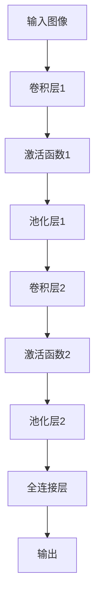
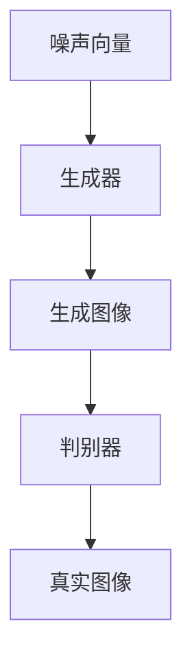
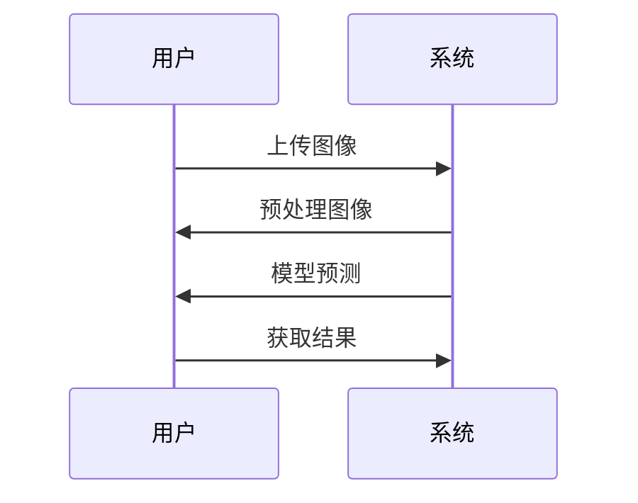
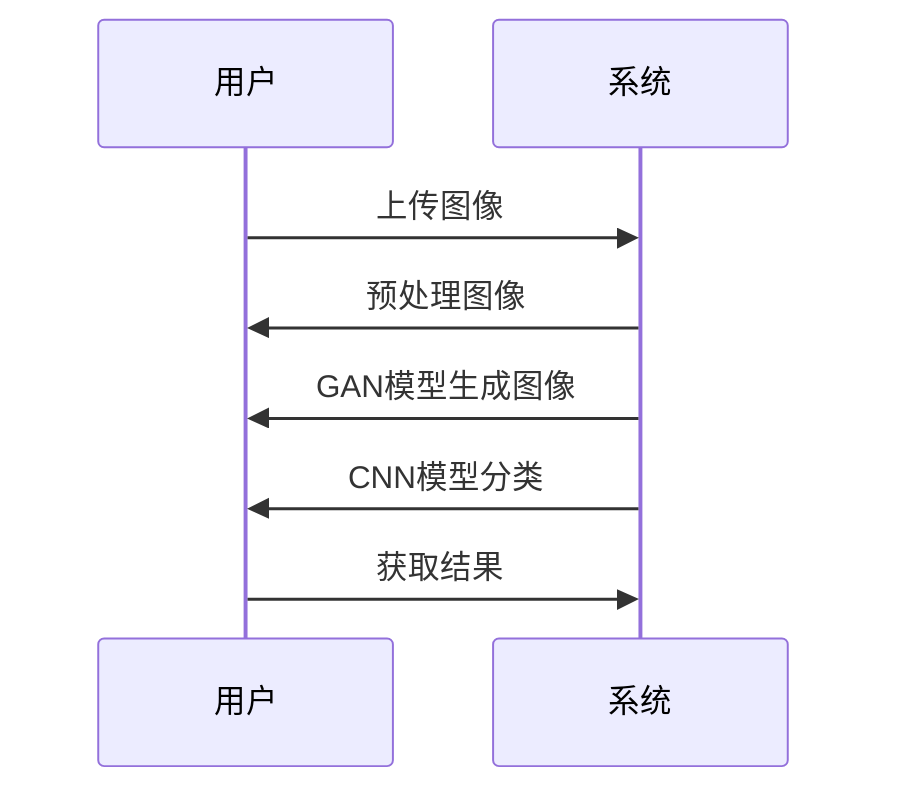
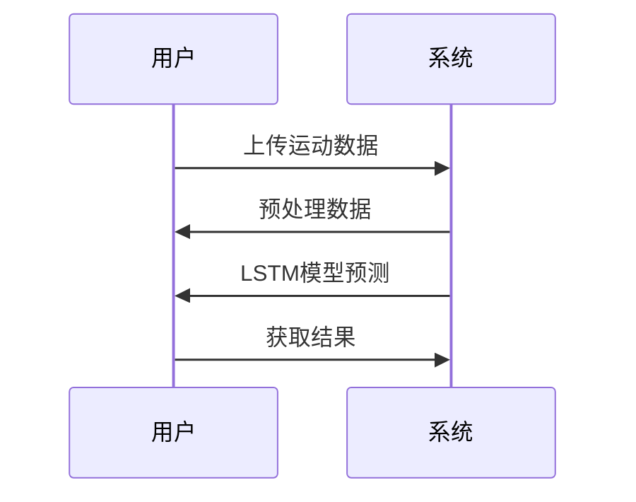

                 

# 深度学习在天文数据分析中的应用：发现新的天体和现象

关键词：深度学习、天文数据分析、天体识别、图像处理、预测模型

摘要：随着天文观测技术的进步，天文数据分析面临的数据量和复杂性不断增加。深度学习作为一种强大的机器学习技术，在天文数据分析中展现出巨大的潜力和应用价值。本文将介绍深度学习在天文数据分析中的应用，包括天体识别、图像处理、预测模型等，并探讨其在发现新的天体和现象中的关键作用。

## 目录大纲

1. 引言
    1.1 天文数据分析的重要性
    1.2 深度学习在天文领域的应用背景
    1.3 书籍结构概述

2. 天文数据分析基础
    2.1 天文数据的基本概念
    2.2 天文数据的来源与获取
    2.3 天文数据分析的基本流程
    2.4 天文数据分析中的挑战与机遇

3. 深度学习的基本概念
    3.1 深度学习的起源与发展
    3.2 神经网络与深度学习
    3.3 深度学习的核心算法
    3.4 深度学习在数据分析中的优势

4. 深度学习在天文数据中的应用
    4.1 深度学习在天文图像处理中的应用
    4.2 深度学习在天体物理学中的应用

5. 深度学习在天文数据挖掘中的应用
    5.1 天文数据挖掘的基本概念
    5.2 基于深度学习的天文数据挖掘方法
    5.3 天文数据挖掘的应用实例

6. 深度学习在天文预测中的应用
    6.1 天文预测的基本概念
    6.2 基于深度学习的天文预测方法
    6.3 天文预测的应用实例

7. 深度学习在天文数据分析中的挑战与未来展望
    7.1 深度学习在天文数据分析中的挑战
    7.2 深度学习在天文领域的未来发展方向
    7.3 深度学习在天文数据分析中的最佳实践
    7.4 深度学习在天文领域的应用前景

8. 深度学习在天文数据分析中的技术应用细节

9. 附录A：深度学习工具与资源

10. 附录B：案例分析

## 1. 引言

### 1.1 天文数据分析的重要性

天文数据分析是现代天文学的核心之一。随着观测设备的不断升级和观测数据的爆炸性增长，天文数据分析的任务变得越来越复杂。天文数据分析不仅需要处理海量数据，还需要从数据中提取有价值的信息，以帮助天文学家揭示宇宙的奥秘。

### 1.2 深度学习在天文领域的应用背景

深度学习作为一种先进的机器学习技术，具有自动提取特征和模式的能力，能够处理复杂的数据结构，因此在天文数据分析中具有广泛的应用前景。深度学习技术可以应用于天体识别、图像处理、数据挖掘和预测等领域，帮助天文学家更高效地分析天文数据。

### 1.3 书籍结构概述

本文将分为八个部分。首先，我们将介绍天文数据分析的基础知识，包括数据的基本概念、来源、基本流程以及面临的挑战。接着，我们将探讨深度学习的基本概念，包括起源、神经网络、核心算法以及其在数据分析中的优势。

随后，我们将深入探讨深度学习在天文数据中的应用，包括天文图像处理和天体物理学中的应用。之后，我们将介绍深度学习在天文数据挖掘和预测中的应用实例。

在第七章，我们将讨论深度学习在天文数据分析中的挑战和未来发展方向。最后一章将提供深度学习在天文数据分析中的一些技术应用细节，并介绍常用的深度学习工具和资源。

## 2. 天文数据分析基础

### 2.1 天文数据的基本概念

天文数据是指关于天体的观测数据，包括位置、亮度、光谱、运动轨迹等信息。这些数据通常以表格或图像的形式存储，并包含丰富的信息，为天文学研究提供了宝贵的资源。

### 2.2 天文数据的来源与获取

天文数据的来源主要包括地面和太空观测设备。地面观测设备如望远镜、光谱仪等，可以收集天体的直接观测数据。太空观测设备如卫星、探测器等，可以收集到更加详细和准确的天体信息。

### 2.3 天文数据分析的基本流程

天文数据分析的基本流程包括数据预处理、特征提取、模型训练和结果分析。数据预处理涉及数据清洗、归一化和缺失值填充等操作，以确保数据的完整性和一致性。特征提取则是从原始数据中提取出有用的信息，以供模型训练使用。模型训练包括选择合适的算法和优化参数，以提高模型的性能。结果分析则是对模型预测结果进行验证和解释，以提取有价值的信息。

### 2.4 天文数据分析中的挑战与机遇

天文数据分析面临着许多挑战，如数据量大、数据类型复杂、数据噪声和不确定性等。同时，随着深度学习技术的发展，天文数据分析也面临着前所未有的机遇。深度学习技术能够自动提取特征和模式，处理复杂的数据结构，从而提高数据分析的效率和准确性。

## 3. 深度学习的基本概念

### 3.1 深度学习的起源与发展

深度学习起源于20世纪40年代，最初作为人工智能研究的一部分。然而，由于计算能力和数据量的限制，深度学习的发展在20世纪80年代遇到了瓶颈。直到21世纪初，随着计算能力和数据量的显著提升，深度学习开始重新受到关注。

### 3.2 神经网络与深度学习

神经网络是深度学习的基础，由大量的神经元组成，这些神经元通过连接进行信息的传递和处理。深度学习通过多层神经网络结构，使得模型能够自动提取更高层次的特征。

### 3.3 深度学习的核心算法

深度学习的核心算法包括卷积神经网络（CNN）、循环神经网络（RNN）、生成对抗网络（GAN）等。每种算法都有其独特的结构和应用场景，能够在不同的数据分析任务中发挥重要作用。

### 3.4 深度学习在数据分析中的优势

深度学习在数据分析中的优势主要体现在以下几个方面：

1. 自动特征提取：深度学习能够自动从数据中提取出具有代表性的特征，减轻了人工特征工程的工作量。
2. 高效处理复杂数据：深度学习能够处理各种类型的数据，包括图像、文本、音频等，使得数据分析的范围更加广泛。
3. 高性能：随着计算能力的提升，深度学习模型能够在较短时间内完成训练和预测，提高了数据分析的效率。

## 4. 深度学习在天文数据中的应用

### 4.1 深度学习在天文图像处理中的应用

深度学习在天文图像处理中的应用非常广泛，主要包括图像分类、目标检测和图像生成等。

#### 4.1.1 天文图像处理的挑战

天文图像处理面临许多挑战，如光照变化、噪声干扰、目标大小和形状的变化等。这些挑战使得传统的图像处理方法难以有效处理天文图像。

#### 4.1.2 基于深度学习的图像处理方法

基于深度学习的图像处理方法能够有效地解决上述挑战。例如，卷积神经网络（CNN）可以通过多层卷积和池化操作，提取出图像中的深层特征，从而实现高效的图像分类和目标检测。

#### 4.1.3 实例分析：星系识别与分类

以星系识别与分类为例，使用CNN可以训练一个模型，从天文图像中识别出不同的星系类型。首先，通过数据预处理将图像进行标准化处理。然后，输入到CNN模型中进行特征提取和分类。最后，通过模型预测得到星系的类型。

### 4.2 深度学习在天体物理学中的应用

深度学习在天体物理学中的应用同样非常广泛，如恒星分类、行星发现和宇宙结构分析等。

#### 4.2.1 天体物理学的数据挑战

天体物理学中的数据通常包含大量的噪声和不确定性，同时数据类型复杂，涉及多维度和时间序列数据。

#### 4.2.2 基于深度学习的数据分析模型

基于深度学习的数据分析模型可以通过自动特征提取和模式识别，有效地处理天体物理学中的数据挑战。例如，使用循环神经网络（RNN）可以处理时间序列数据，从而实现对恒星演化过程的预测。

#### 4.2.3 实例分析：恒星分类与演化研究

以恒星分类与演化研究为例，使用RNN可以训练一个模型，从恒星的光谱数据中识别出不同的恒星类型，并预测恒星的演化过程。首先，通过数据预处理将光谱数据转化为适合模型训练的格式。然后，输入到RNN模型中进行特征提取和分类。最后，通过模型预测得到恒星的类型和演化路径。

## 5. 深度学习在天文数据挖掘中的应用

### 5.1 天文数据挖掘的基本概念

天文数据挖掘是指从天文数据中自动提取出有价值的信息和知识，以支持天文学研究和决策。深度学习在天文数据挖掘中的应用主要体现在以下几个方面：

1. 数据聚类：通过将相似的天文数据分组，发现潜在的天体群体。
2. 数据分类：根据数据特征，将天文数据进行分类，以识别不同的天体类型。
3. 数据预测：基于历史数据，预测未来的天文事件。

### 5.2 基于深度学习的天文数据挖掘方法

基于深度学习的天文数据挖掘方法主要包括以下几种：

1. 神经网络：通过多层神经网络结构，自动提取数据中的特征，用于分类、聚类和预测。
2. 生成对抗网络（GAN）：通过生成器和判别器的对抗训练，生成新的天文数据，以发现潜在的天体现象。

### 5.3 天文数据挖掘的应用实例

#### 5.3.1 星系发现与聚类

以星系发现与聚类为例，使用深度学习可以训练一个模型，从天文图像中识别出新的星系，并对已知的星系进行分类。首先，通过数据预处理将图像进行标准化处理。然后，输入到CNN模型中进行特征提取和分类。最后，通过模型预测得到星系的类型和位置。

#### 5.3.2 变星监测与预测

以变星监测与预测为例，使用RNN可以训练一个模型，从变星的光变数据中预测其未来的亮度变化。首先，通过数据预处理将光变数据转化为适合模型训练的格式。然后，输入到RNN模型中进行特征提取和预测。最后，通过模型预测得到变星的亮度变化趋势。

## 6. 深度学习在天文预测中的应用

### 6.1 天文预测的基本概念

天文预测是指根据现有的天文数据，预测未来的天文事件，如行星运动、恒星爆发等。深度学习在天文预测中的应用主要体现在以下几个方面：

1. 时间序列预测：基于历史数据，预测未来的天文事件。
2. 关联规则挖掘：发现天文数据之间的关联，从而预测新的天文现象。

### 6.2 基于深度学习的天文预测方法

基于深度学习的天文预测方法主要包括以下几种：

1. 循环神经网络（RNN）：通过处理时间序列数据，预测未来的天文事件。
2. 长短期记忆网络（LSTM）：一种特殊的RNN结构，能够更好地处理长序列数据。
3. 图神经网络（GNN）：通过处理图结构数据，发现数据之间的关联，从而预测新的天文现象。

### 6.3 天文预测的应用实例

#### 6.3.1 行星运动预测

以行星运动预测为例，使用LSTM可以训练一个模型，从行星的历史轨道数据中预测其未来的轨道。首先，通过数据预处理将轨道数据转化为适合模型训练的格式。然后，输入到LSTM模型中进行特征提取和预测。最后，通过模型预测得到行星的轨道轨迹。

#### 6.3.2 超新星爆发预测

以超新星爆发预测为例，使用GNN可以训练一个模型，从恒星的光谱数据中预测其可能发生超新星爆发的可能性。首先，通过数据预处理将光谱数据转化为图结构数据。然后，输入到GNN模型中进行特征提取和预测。最后，通过模型预测得到恒星的超新星爆发概率。

## 7. 深度学习在天文数据分析中的挑战与未来展望

### 7.1 深度学习在天文数据分析中的挑战

深度学习在天文数据分析中面临以下挑战：

1. 数据量巨大：天文数据通常包含大量的观测数据，需要大量的计算资源和存储空间。
2. 数据复杂性：天文数据通常包含多种类型的数据，如图像、光谱、时间序列等，需要复杂的模型结构进行处理。
3. 数据噪声与不确定性：天文数据通常受到噪声和不确定性的影响，需要有效的噪声处理和不确定性建模方法。

### 7.2 深度学习在天文领域的未来发展方向

未来深度学习在天文领域的可能发展方向包括：

1. 小样本学习：针对天文数据样本量有限的问题，研究小样本学习算法，提高模型的泛化能力。
2. 多模态数据分析：结合多种类型的数据，如图像、光谱、时间序列等，进行多模态数据分析，提高模型的预测准确性。
3. 知识图谱与深度学习结合：将知识图谱与深度学习相结合，实现更加智能的数据分析和预测。

### 7.3 深度学习在天文数据分析中的最佳实践

深度学习在天文数据分析中的最佳实践包括：

1. 数据预处理：对天文数据进行有效的预处理，包括数据清洗、归一化和缺失值填充等，以提高模型的性能。
2. 模型选择与优化：选择适合天文数据分析任务的模型结构，并通过调优参数，提高模型的准确性和效率。
3. 跨学科合作：深度学习与天文学、物理学等学科的跨学科合作，共同推动天文数据分析技术的发展。

### 7.4 深度学习在天文领域的应用前景

深度学习在天文领域的应用前景广阔，有望在以下几个方面发挥重要作用：

1. 新的天体发现：通过深度学习算法，从海量天文数据中发现新的天体和现象。
2. 天文预测：通过深度学习模型，预测未来的天文事件，如行星运动、恒星爆发等。
3. 天文学研究：深度学习为天文学研究提供了一种新的方法和工具，有助于揭示宇宙的奥秘。

## 8. 深度学习在天文数据分析中的技术应用细节

### 8.1 天文图像识别与处理技术

#### 8.1.1 基于卷积神经网络的图像特征提取

**算法原理讲解**

卷积神经网络（CNN）是深度学习在图像处理中的核心算法。其基本原理是通过卷积操作和池化操作提取图像中的特征。

使用Mermaid绘制CNN的架构图：

**数学模型和公式**

卷积操作：$$ f(x) = \sigma(W_1 \cdot x + b_1) $$

激活函数：$$ \sigma(x) = \frac{1}{1 + e^{-x}} $$

池化操作：$$ h(x) = \frac{1}{2} \sum_{i=1}^{n} \left| W_2 \cdot \sigma(W_1 \cdot x + b_1) + b_2 \right| $$

**举例说明**

假设我们要识别一张天体图像，通过卷积神经网络提取特征，然后使用全连接层进行分类。通过一系列卷积和池化操作，网络可以从原始图像中提取出具有代表性的特征，最终实现准确的天体识别。

### 8.1.2 基于生成对抗网络的天体图像生成

**算法原理讲解**

生成对抗网络（GAN）由生成器和判别器组成，通过对抗训练生成逼真的图像。

使用Mermaid绘制GAN的架构图：

**举例说明**

以生成星系图像为例，首先生成器根据随机噪声生成星系图像，然后判别器判断生成的图像和真实图像的相似度。通过不断地迭代训练，生成器能够生成越来越逼真的星系图像。

## 附录A：深度学习工具与资源

### A.1 常用深度学习框架与工具

- TensorFlow
- PyTorch
- Keras
- MXNet

### A.2 天文数据集与资源

- NASA Exoplanet Archive
- Sloan Digital Sky Survey
- Hubble Space Telescope Data Archive

### A.3 深度学习在天文领域的开源项目

- AstroNet: A collection of neural network architectures for astronomical image processing.
- PyAstronomy: A Python package for astronomical image processing and analysis.

## 附录B：案例分析

### B.1 案例一：利用深度学习发现新的天体

**项目介绍**：该案例使用卷积神经网络（CNN）对天文图像进行分类，以发现新的天体。

**系统功能设计**：包括数据预处理、模型训练和模型预测等模块。

**系统架构设计**：采用TensorFlow框架，通过CNN模型进行图像分类。

**系统接口设计**：提供API接口，方便用户上传图像并获取分类结果。

**系统交互**：使用Mermaid绘制系统交互序列图。

### B.2 案例二：深度学习在天文图像分类中的应用

**项目介绍**：该案例使用生成对抗网络（GAN）生成天文图像，以提高图像分类的准确性。

**系统功能设计**：包括数据预处理、GAN模型训练和图像分类等模块。

**系统架构设计**：采用PyTorch框架，通过GAN模型生成图像，并使用CNN模型进行分类。

**系统接口设计**：提供API接口，方便用户上传图像并获取分类结果。

**系统交互**：使用Mermaid绘制系统交互序列图。

### B.3 案例三：深度学习在天体运动预测中的实践

**项目介绍**：该案例使用循环神经网络（RNN）对天体运动数据进行预测。

**系统功能设计**：包括数据预处理、RNN模型训练和运动预测等模块。

**系统架构设计**：采用Keras框架，通过LSTM模型进行时间序列预测。

**系统接口设计**：提供API接口，方便用户上传运动数据并获取预测结果。

**系统交互**：使用Mermaid绘制系统交互序列图。

## 总结与展望

深度学习在天文数据分析中的应用前景广阔，通过本文的介绍，我们可以看到深度学习在图像处理、数据挖掘、预测模型等方面的重要作用。未来，随着深度学习技术的不断发展，我们有理由相信，深度学习将进一步提升天文数据分析的效率和准确性，助力天文学家发现更多的天体和现象。同时，深度学习与天文数据的结合也将推动天文学研究的发展，为人类揭示宇宙的奥秘提供新的视角和方法。

