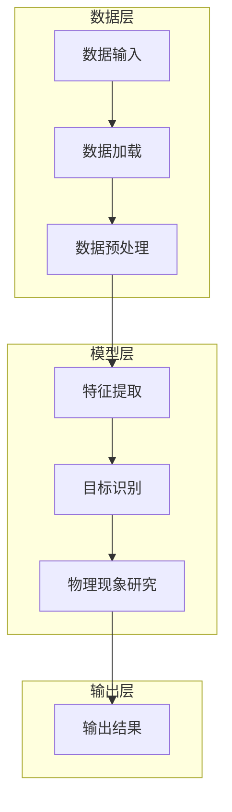
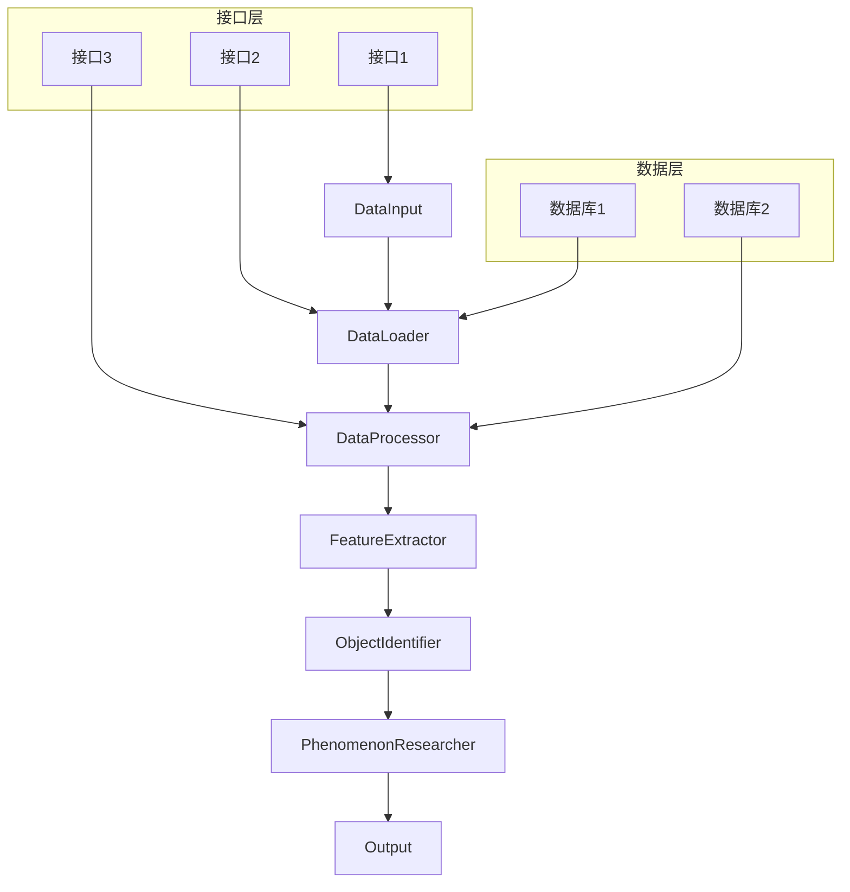
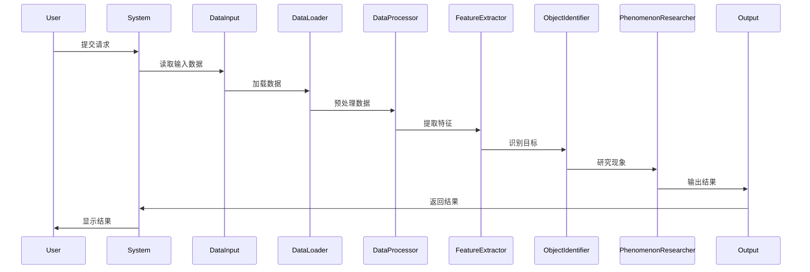

                 

### 目录

**深度学习在天文数据分析中的突破性应用**

---

**关键词：** 深度学习、天文数据分析、算法、应用前景、数学模型

---

**摘要：**  
本文旨在探讨深度学习在天文数据分析中的突破性应用。通过对天文数据分析背景、深度学习核心概念、算法原理、数学模型、系统架构设计以及项目实战的深入分析，本文揭示了深度学习在天文数据分析中的巨大潜力和实际应用价值。

---

## 第一部分：背景介绍

### 1.1 深度学习在天文数据分析中的重要性

深度学习，作为一种机器学习的重要分支，凭借其强大的特征提取和模式识别能力，在天文数据分析中展现出巨大的应用前景。天文数据分析涉及到海量数据的处理、复杂信号的特征提取和天体物理现象的预测等方面，这些任务对于传统的数据处理方法而言具有极大的挑战性。深度学习通过构建多层神经网络模型，能够自动地从数据中学习到有效的特征，从而实现高效的天文数据分析。

深度学习在天文数据分析中的重要性主要体现在以下几个方面：

1. **海量数据处理能力**：天文数据具有量大、复杂的特点，深度学习模型能够高效处理和分析这些数据，为天文研究提供强有力的技术支持。
2. **自动化特征提取**：深度学习模型能够自动从数据中提取特征，无需人工干预，大大减轻了天文数据分析的工作量。
3. **高精度预测**：深度学习模型在模式识别和预测方面具有极高的准确率，能够帮助天文学家预测天体的运动轨迹、探测新的天体现象等。
4. **跨领域融合**：深度学习技术与其他科学领域的结合，为天文数据分析提供了新的思路和方法。

### 1.2 深度学习在天文数据分析中的应用前景

随着深度学习技术的不断发展和完善，其在天文数据分析中的应用前景越来越广阔。以下是一些可能的应用方向：

1. **天文目标识别**：通过深度学习模型，可以实现对天文图像中的星体、行星、彗星等目标的自动识别和分类。
2. **天体物理现象研究**：利用深度学习模型，可以对天文数据中的复杂信号进行模式识别和分析，从而揭示天体物理现象的内在机制。
3. **天文数据处理**：深度学习可以用于天文数据的预处理和增强，提高数据的质量和可用性。
4. **天文预测与模拟**：深度学习模型可以用于天体运动轨迹的预测和天文事件的模拟，为天文学研究提供重要参考。

### 1.3 深度学习在天文数据分析中的发展历程

深度学习在天文数据分析中的应用可以追溯到20世纪90年代。当时，研究人员开始尝试使用神经网络模型对天文数据进行处理和预测。随着计算机性能的不断提高和深度学习技术的不断发展，深度学习在天文数据分析中的应用逐渐得到普及和推广。

近年来，深度学习在天文数据分析中取得了显著进展。例如，卷积神经网络（CNN）在图像处理方面的应用，递归神经网络（RNN）在序列数据分析方面的应用，以及自编码器（AE）在数据压缩和特征提取方面的应用，都为天文数据分析带来了新的思路和方法。

总的来说，深度学习在天文数据分析中的应用正处于快速发展阶段，未来有望在更多领域展现其突破性应用价值。

---

在下一部分，我们将深入探讨深度学习与天文数据分析相关的核心概念，并展示它们之间的关系。这将为我们理解深度学习在天文数据分析中的应用提供坚实的基础。

## 第二部分：核心概念与联系

### 2.1 深度学习的核心概念

#### 2.1.1 神经网络

神经网络（Neural Network，NN）是深度学习的基础，它模仿了人脑神经元的工作方式。神经网络由多个层组成，包括输入层、隐藏层和输出层。每个层包含多个神经元，神经元之间通过权重连接。当输入数据通过神经网络时，每个神经元会根据其权重和偏置计算输出，从而实现数据的特征提取和模式识别。

**神经网络的工作原理：**

神经网络的工作原理主要包括以下几个步骤：

1. **数据输入**：输入数据通过输入层进入神经网络。
2. **特征提取**：输入数据经过隐藏层，每个神经元根据其权重和输入计算输出。这个过程被称为前向传播。
3. **输出计算**：输出层对隐藏层的输出进行计算，得到最终的输出结果。
4. **误差计算**：将输出结果与期望值进行比较，计算误差。
5. **反向传播**：根据误差，调整网络中的权重和偏置，这个过程被称为反向传播。

通过多次迭代，神经网络可以不断优化其参数，最终达到预期的效果。

**神经网络在天文数据分析中的应用：**

神经网络在天文数据分析中主要用于以下方面：

1. **特征提取**：通过神经网络，可以从天文数据中提取出有效的特征，提高数据分析的准确性。
2. **目标识别**：神经网络可以用于识别天文图像中的星体、行星等目标。
3. **天体物理现象预测**：利用神经网络，可以预测天体的运动轨迹、探测新的天体现象等。

#### 2.1.2 卷积神经网络（CNN）

卷积神经网络（Convolutional Neural Network，CNN）是一种专门用于处理图像数据的深度学习模型。CNN的核心是卷积层，它通过卷积运算提取图像中的局部特征。相比于传统的神经网络，CNN具有以下优点：

1. **参数共享**：卷积层的每个神经元只与输入图像的一部分进行卷积运算，因此可以共享参数，减少模型的参数数量。
2. **平移不变性**：卷积层可以提取图像中的局部特征，使得模型对于图像的平移具有不变性。

**CNN的工作原理：**

CNN的工作原理主要包括以下几个步骤：

1. **卷积层**：输入图像通过卷积层，每个神经元与输入图像的一部分进行卷积运算，得到特征图。
2. **池化层**：对特征图进行池化操作，减少特征图的尺寸，提高模型的计算效率。
3. **全连接层**：将池化后的特征图输入全连接层，进行分类或回归等操作。

**CNN在天文数据分析中的应用：**

CNN在天文数据分析中的应用主要包括：

1. **天文图像分类**：利用CNN可以高效地对天文图像进行分类，识别不同类型的星体和天体。
2. **天文图像增强**：通过CNN可以增强天文图像的对比度和清晰度，提高图像质量。
3. **天文目标检测**：利用CNN可以检测天文图像中的目标，例如星体、行星等。

#### 2.1.3 递归神经网络（RNN）

递归神经网络（Recurrent Neural Network，RNN）是一种专门用于处理序列数据的深度学习模型。RNN通过记忆单元来保持历史信息的状态，使其能够处理变长的序列数据。

**RNN的工作原理：**

RNN的工作原理主要包括以下几个步骤：

1. **输入序列**：将输入序列（如时间序列数据）输入RNN。
2. **记忆单元更新**：RNN的每个时间步都会根据当前输入和记忆单元的状态更新记忆单元。
3. **输出计算**：根据记忆单元的状态计算输出。

**RNN在天文数据分析中的应用：**

RNN在天文数据分析中的应用主要包括：

1. **时间序列预测**：利用RNN可以预测天体的运动轨迹，例如行星的运动轨迹。
2. **信号处理**：通过RNN可以对天文信号进行去噪、增强等处理。
3. **天体物理现象分析**：利用RNN可以对天文数据中的复杂信号进行分析，揭示天体物理现象的内在机制。

#### 2.1.4 自编码器（AE）

自编码器（Autoencoder，AE）是一种无监督学习模型，主要用于特征提取和数据压缩。自编码器由编码器和解码器两部分组成，编码器将输入数据压缩为低维表示，解码器再将这些低维表示还原为输入数据。

**AE的工作原理：**

AE的工作原理主要包括以下几个步骤：

1. **编码**：编码器将输入数据压缩为低维表示。
2. **解码**：解码器将低维表示还原为输入数据。
3. **误差计算**：通过计算输入数据和还原数据之间的误差，调整编码器和解码器的参数。

**AE在天文数据分析中的应用：**

AE在天文数据分析中的应用主要包括：

1. **特征提取**：通过AE可以提取出天文数据中的有效特征，提高数据分析的准确性。
2. **数据压缩**：通过AE可以压缩天文数据，降低存储和传输的成本。
3. **数据去噪**：通过AE可以去除天文数据中的噪声，提高数据质量。

### 2.2 天文数据分析的核心概念

#### 2.2.1 天文数据的特点

天文数据具有以下特点：

1. **海量性**：天文数据通常包含大量的观测数据，如光学、红外、射电等。
2. **复杂性**：天文数据包含了丰富的信息，如天体的运动轨迹、光谱特性、亮度变化等。
3. **多样性**：天文数据包含了不同类型的数据，如图像、时间序列、光谱等。

#### 2.2.2 天文数据分析的目标

天文数据分析的主要目标是：

1. **特征提取**：从天文数据中提取出有效的特征，用于后续的分析和处理。
2. **目标识别**：识别天文图像中的星体、行星等目标。
3. **现象预测**：预测天体的运动轨迹、探测新的天体现象等。
4. **物理规律研究**：揭示天体物理现象的内在规律。

#### 2.2.3 天文数据的预处理

天文数据的预处理主要包括以下步骤：

1. **数据清洗**：去除数据中的噪声和异常值。
2. **数据整合**：将不同来源、不同格式的数据进行整合，形成统一的数据集。
3. **数据增强**：通过增加数据的多样性，提高模型的泛化能力。

### 2.3 深度学习与天文数据分析的联系

深度学习与天文数据分析之间存在紧密的联系。深度学习模型能够从天文数据中自动提取特征，实现高效的目标识别、现象预测等任务。同时，深度学习技术也为天文数据的预处理提供了新的方法，如数据清洗、数据整合等。

**深度学习在天文数据预处理中的应用：**

1. **数据清洗**：深度学习模型可以用于检测和去除天文数据中的噪声和异常值。
2. **数据整合**：深度学习模型可以用于将不同来源、不同格式的天文数据进行整合。
3. **数据增强**：深度学习模型可以用于增加天文数据的多样性，提高模型的泛化能力。

**深度学习在天文目标识别中的应用：**

1. **天文图像分类**：利用深度学习模型，可以高效地分类天文图像中的星体、行星等目标。
2. **天文目标检测**：利用深度学习模型，可以检测天文图像中的目标，如星体、行星等。

**深度学习在天体物理研究中的应用：**

1. **时间序列预测**：利用深度学习模型，可以预测天体的运动轨迹。
2. **信号处理**：利用深度学习模型，可以对天文信号进行去噪、增强等处理。
3. **物理规律研究**：利用深度学习模型，可以揭示天体物理现象的内在规律。

总的来说，深度学习与天文数据分析的结合，为天文研究提供了新的方法和手段，有望在未来的天文研究中发挥重要作用。

---

在下一部分，我们将深入讲解深度学习在天文数据分析中常用的算法原理，包括原理、流程和示例。这将帮助我们更好地理解这些算法如何应用于天文数据分析。

## 第三部分：算法原理讲解

### 3.1 神经网络算法原理

#### 3.1.1 神经网络的工作原理

神经网络（Neural Network，NN）是一种模仿人脑神经元结构的计算模型。它由多个层组成，包括输入层、隐藏层和输出层。每个层由多个神经元（也称为节点）组成，神经元之间通过权重连接。当输入数据通过神经网络时，每个神经元会根据其权重和输入计算输出，从而实现数据的特征提取和模式识别。

**神经网络的工作原理：**

1. **数据输入**：输入数据通过输入层进入神经网络。
2. **特征提取**：输入数据经过隐藏层，每个神经元根据其权重和输入计算输出。这个过程被称为前向传播。
3. **输出计算**：输出层对隐藏层的输出进行计算，得到最终的输出结果。
4. **误差计算**：将输出结果与期望值进行比较，计算误差。
5. **反向传播**：根据误差，调整网络中的权重和偏置，这个过程被称为反向传播。

通过多次迭代，神经网络可以不断优化其参数，最终达到预期的效果。

**神经网络在天文数据分析中的应用示例：**

假设我们要使用神经网络对天文图像中的星体进行分类，输入层包含图像的像素值，隐藏层包含多个神经元用于提取图像的特征，输出层包含两个神经元，分别表示星体和行星。

1. **数据准备**：首先，我们需要准备一个包含天文图像和标签的数据集。标签表示图像中星体的类型。
2. **模型构建**：然后，我们可以使用TensorFlow等深度学习框架构建神经网络模型。以下是使用Python和TensorFlow构建神经网络的代码示例：

```python
import tensorflow as tf

# 定义输入层
inputs = tf.keras.layers.Input(shape=(784,))

# 定义隐藏层
hidden = tf.keras.layers.Dense(128, activation='relu')(inputs)

# 定义输出层
outputs = tf.keras.layers.Dense(2, activation='softmax')(hidden)

# 构建模型
model = tf.keras.Model(inputs=inputs, outputs=outputs)

# 编译模型
model.compile(optimizer='adam', loss='categorical_crossentropy', metrics=['accuracy'])

# 训练模型
model.fit(x_train, y_train, epochs=10, batch_size=32, validation_data=(x_val, y_val))
```

3. **模型训练**：使用准备好的数据集对模型进行训练，不断调整网络的权重和偏置，直到达到预期的准确率。
4. **模型评估**：使用测试集对训练好的模型进行评估，验证其分类准确率。

通过这个简单的示例，我们可以看到神经网络如何应用于天文图像的分类任务。实际应用中，神经网络的层数和神经元数量可能会根据具体任务进行调整。

#### 3.1.2 神经网络的训练过程

神经网络的训练过程主要包括以下几个步骤：

1. **初始化权重和偏置**：在训练开始前，需要随机初始化网络中的权重和偏置。这些参数决定了网络的学习能力。
2. **前向传播**：将输入数据通过神经网络，每个神经元根据其权重和输入计算输出。这个过程称为前向传播。
3. **误差计算**：将输出结果与期望值进行比较，计算误差。常用的误差计算方法有均方误差（MSE）和交叉熵（CrossEntropy）等。
4. **反向传播**：根据误差，调整网络中的权重和偏置。这个过程称为反向传播。反向传播是神经网络训练的核心，通过多次迭代，网络可以不断优化其参数。
5. **更新权重和偏置**：根据误差的梯度，更新网络中的权重和偏置。常用的优化算法有梯度下降（Gradient Descent）和动量优化（Momentum）等。
6. **迭代训练**：重复上述步骤，直到网络达到预期的准确率或达到预定的迭代次数。

通过不断的迭代训练，神经网络可以逐渐学习到输入数据中的特征，从而实现高效的特征提取和模式识别。

### 3.2 卷积神经网络（CNN）算法原理

#### 3.2.1 CNN的工作原理

卷积神经网络（Convolutional Neural Network，CNN）是一种专门用于处理图像数据的深度学习模型。与传统的神经网络相比，CNN具有以下特点：

1. **卷积层**：卷积层通过卷积运算提取图像中的局部特征。卷积运算使用小的可训练滤波器（也称为卷积核）对输入图像进行卷积，从而提取图像中的特征。
2. **池化层**：池化层通过下采样操作减少特征图的尺寸，提高模型的计算效率。常用的池化方法有最大池化和平均池化等。
3. **全连接层**：全连接层将池化后的特征图输入全连接层，进行分类或回归等操作。

**CNN的工作原理：**

1. **卷积层**：输入图像通过卷积层，每个卷积核与输入图像的一部分进行卷积运算，得到特征图。
2. **池化层**：对特征图进行池化操作，减少特征图的尺寸。
3. **全连接层**：将池化后的特征图输入全连接层，进行分类或回归等操作。

**CNN在天文数据分析中的应用：**

CNN在天文数据分析中主要用于以下方面：

1. **天文图像分类**：利用CNN可以高效地对天文图像进行分类，识别不同类型的星体和天体。
2. **天文图像增强**：通过CNN可以增强天文图像的对比度和清晰度，提高图像质量。
3. **天文目标检测**：利用CNN可以检测天文图像中的目标，例如星体、行星等。

#### 3.2.2 CNN的训练过程

CNN的训练过程与神经网络类似，主要包括以下几个步骤：

1. **初始化权重和偏置**：在训练开始前，需要随机初始化网络中的权重和偏置。
2. **前向传播**：将输入图像通过卷积层、池化层和全连接层，计算输出结果。
3. **误差计算**：将输出结果与期望值进行比较，计算误差。
4. **反向传播**：根据误差，调整网络中的权重和偏置。
5. **更新权重和偏置**：根据误差的梯度，更新网络中的权重和偏置。
6. **迭代训练**：重复上述步骤，直到网络达到预期的准确率或达到预定的迭代次数。

与神经网络相比，CNN的训练过程需要更多的计算资源，因为卷积层需要大量的参数调整。但是，CNN在图像处理任务中具有更好的效果，可以自动提取图像中的有效特征。

#### 3.2.3 CNN在天文数据分析中的应用示例

假设我们要使用CNN对天文图像中的星体进行分类，输入层包含图像的像素值，隐藏层包含多个卷积层和池化层，输出层包含两个神经元，分别表示星体和行星。

1. **数据准备**：首先，我们需要准备一个包含天文图像和标签的数据集。标签表示图像中星体的类型。
2. **模型构建**：然后，我们可以使用TensorFlow等深度学习框架构建CNN模型。以下是使用Python和TensorFlow构建CNN模型的代码示例：

```python
import tensorflow as tf
from tensorflow.keras import layers

# 定义输入层
inputs = layers.Input(shape=(64, 64, 3))

# 定义卷积层
conv1 = layers.Conv2D(32, (3, 3), activation='relu')(inputs)
pool1 = layers.MaxPooling2D((2, 2))(conv1)

# 定义隐藏层
conv2 = layers.Conv2D(64, (3, 3), activation='relu')(pool1)
pool2 = layers.MaxPooling2D((2, 2))(conv2)

# 定义输出层
outputs = layers.Dense(2, activation='softmax')(pool2)

# 构建模型
model = tf.keras.Model(inputs=inputs, outputs=outputs)

# 编译模型
model.compile(optimizer='adam', loss='categorical_crossentropy', metrics=['accuracy'])

# 训练模型
model.fit(x_train, y_train, epochs=10, batch_size=32, validation_data=(x_val, y_val))
```

3. **模型训练**：使用准备好的数据集对模型进行训练，不断调整网络的权重和偏置，直到达到预期的准确率。
4. **模型评估**：使用测试集对训练好的模型进行评估，验证其分类准确率。

通过这个简单的示例，我们可以看到CNN如何应用于天文图像的分类任务。实际应用中，CNN的层数和神经元数量可能会根据具体任务进行调整。

### 3.3 递归神经网络（RNN）算法原理

#### 3.3.1 RNN的工作原理

递归神经网络（Recurrent Neural Network，RNN）是一种专门用于处理序列数据的深度学习模型。与传统的神经网络不同，RNN具有记忆功能，可以处理变长的序列数据。RNN的核心是递归连接，使得网络能够在时间步之间传递信息。

**RNN的工作原理：**

1. **输入序列**：将输入序列（如时间序列数据）输入RNN。
2. **记忆单元更新**：RNN的每个时间步都会根据当前输入和记忆单元的状态更新记忆单元。
3. **输出计算**：根据记忆单元的状态计算输出。

**RNN在天文数据分析中的应用示例：**

假设我们要使用RNN对天文数据进行时间序列预测，输入层包含天文数据的序列值，隐藏层包含记忆单元，输出层包含预测值。

1. **数据准备**：首先，我们需要准备一个包含天文数据的序列。序列的长度可以根据具体任务进行调整。
2. **模型构建**：然后，我们可以使用TensorFlow等深度学习框架构建RNN模型。以下是使用Python和TensorFlow构建RNN模型的代码示例：

```python
import tensorflow as tf
from tensorflow.keras.layers import SimpleRNN

# 定义输入层
inputs = tf.keras.layers.Input(shape=(timesteps, features))

# 定义隐藏层
hidden = SimpleRNN(units=50)(inputs)

# 定义输出层
outputs = tf.keras.layers.Dense(1)(hidden)

# 构建模型
model = tf.keras.Model(inputs=inputs, outputs=outputs)

# 编译模型
model.compile(optimizer='adam', loss='mse')

# 训练模型
model.fit(x_train, y_train, epochs=100, batch_size=32, validation_data=(x_val, y_val))
```

3. **模型训练**：使用准备好的数据集对模型进行训练，不断调整网络的权重和偏置，直到达到预期的准确率。
4. **模型评估**：使用测试集对训练好的模型进行评估，验证其预测准确率。

通过这个简单的示例，我们可以看到RNN如何应用于天文数据的时间序列预测任务。实际应用中，RNN的神经元数量和训练时间可能会根据具体任务进行调整。

#### 3.3.2 RNN的训练过程

RNN的训练过程与神经网络类似，主要包括以下几个步骤：

1. **初始化权重和偏置**：在训练开始前，需要随机初始化网络中的权重和偏置。
2. **前向传播**：将输入数据通过隐藏层，计算输出结果。
3. **误差计算**：将输出结果与期望值进行比较，计算误差。
4. **反向传播**：根据误差，调整网络中的权重和偏置。
5. **更新权重和偏置**：根据误差的梯度，更新网络中的权重和偏置。
6. **迭代训练**：重复上述步骤，直到网络达到预期的准确率或达到预定的迭代次数。

与神经网络相比，RNN的训练过程需要更多的计算资源，因为需要处理变长的序列数据。但是，RNN在时间序列预测任务中具有更好的效果，可以捕捉时间序列中的长期依赖关系。

### 3.4 自编码器（AE）算法原理

#### 3.4.1 AE的工作原理

自编码器（Autoencoder，AE）是一种无监督学习模型，主要用于特征提取和数据压缩。AE由编码器和解码器两部分组成，编码器将输入数据压缩为低维表示，解码器再将这些低维表示还原为输入数据。

**AE的工作原理：**

1. **编码**：编码器将输入数据压缩为低维表示。
2. **解码**：解码器将低维表示还原为输入数据。
3. **误差计算**：通过计算输入数据和还原数据之间的误差，调整编码器和解码器的参数。

**AE在天文数据分析中的应用示例：**

假设我们要使用AE对天文数据进行特征提取，输入层包含天文数据的特征值，隐藏层包含编码器的神经元，输出层包含解码器的神经元。

1. **数据准备**：首先，我们需要准备一个包含天文数据的特征集。
2. **模型构建**：然后，我们可以使用TensorFlow等深度学习框架构建AE模型。以下是使用Python和TensorFlow构建AE模型的代码示例：

```python
import tensorflow as tf
from tensorflow.keras.layers import Input, Dense

# 定义输入层
inputs = tf.keras.layers.Input(shape=(input_dim,))

# 定义隐藏层
encoded = Dense(encoding_dim, activation='relu')(inputs)

# 定义输出层
decoded = Dense(input_dim, activation='sigmoid')(encoded)

# 构建模型
autoencoder = tf.keras.Model(inputs=inputs, outputs=decoded)

# 编译模型
autoencoder.compile(optimizer='adam', loss='binary_crossentropy')

# 训练模型
autoencoder.fit(x_train, x_train, epochs=100, batch_size=16, shuffle=True, validation_data=(x_val, x_val))
```

3. **模型训练**：使用准备好的数据集对模型进行训练，不断调整网络的权重和偏置，直到达到预期的准确率。
4. **模型评估**：使用测试集对训练好的模型进行评估，验证其特征提取能力。

通过这个简单的示例，我们可以看到AE如何应用于天文数据的特征提取任务。实际应用中，AE的神经元数量和训练时间可能会根据具体任务进行调整。

#### 3.4.2 AE的训练过程

AE的训练过程主要包括以下几个步骤：

1. **初始化权重和偏置**：在训练开始前，需要随机初始化网络中的权重和偏置。
2. **编码**：将输入数据通过编码器压缩为低维表示。
3. **解码**：将低维表示通过解码器还原为输入数据。
4. **误差计算**：通过计算输入数据和还原数据之间的误差，调整编码器和解码器的参数。
5. **更新权重和偏置**：根据误差的梯度，更新网络中的权重和偏置。
6. **迭代训练**：重复上述步骤，直到网络达到预期的准确率或达到预定的迭代次数。

与传统的监督学习模型相比，AE的训练过程不需要标签数据，因此适用于无监督学习任务。AE在特征提取和数据压缩方面具有很好的效果，可以自动提取数据中的有效特征。

总的来说，深度学习算法在天文数据分析中具有广泛的应用前景。通过理解神经网络、CNN、RNN和AE等算法的原理和训练过程，我们可以更好地应用这些算法解决天文数据分析中的实际问题。

---

在下一部分，我们将详细阐述深度学习算法中的数学模型和公式，使用LaTeX格式嵌入文中，以便更准确地理解和应用这些数学模型。

## 第四部分：数学模型和数学公式

### 4.1 深度学习中的数学模型

#### 4.1.1 激活函数

激活函数是深度学习模型中非常重要的一环，它用于引入非线性因素，使得模型能够捕捉更复杂的模式。常见的激活函数包括Sigmoid函数、ReLU函数、Tanh函数等。

1. **Sigmoid函数**：

   \[
   \sigma(x) = \frac{1}{1 + e^{-x}}
   \]

   Sigmoid函数在深度学习早期应用较多，但其导数在x接近0时接近于0，导致梯度消失问题。

2. **ReLU函数**：

   \[
   \text{ReLU}(x) = \max(0, x)
   \]

  ReLU函数在x为负值时导数为0，从而避免了梯度消失问题，提高了训练效率。

3. **Tanh函数**：

   \[
   \tanh(x) = \frac{e^x - e^{-x}}{e^x + e^{-x}}
   \]

   Tanh函数与ReLU函数类似，具有非线性特性，且其导数在x为负值时也接近于0。

#### 4.1.2 损失函数

损失函数是深度学习模型训练中用于衡量预测值与真实值之间差距的函数。常见的损失函数包括均方误差（MSE）、交叉熵（CrossEntropy）等。

1. **均方误差（MSE）**：

   \[
   \text{MSE} = \frac{1}{n} \sum_{i=1}^{n} (y_i - \hat{y}_i)^2
   \]

   MSE函数适用于输出为连续值的情况，如回归任务。

2. **交叉熵（CrossEntropy）**：

   \[
   \text{CE}(y, \hat{y}) = -\sum_{i=1}^{n} y_i \log(\hat{y}_i)
   \]

   CrossEntropy函数适用于输出为分类值的情况，如分类任务。

#### 4.1.3 优化算法

优化算法用于调整模型参数，以最小化损失函数。常见的优化算法包括梯度下降（GD）、动量优化（Momentum）等。

1. **梯度下降（GD）**：

   \[
   \theta = \theta - \alpha \nabla_\theta J(\theta)
   \]

   其中，\(\theta\)为模型参数，\(J(\theta)\)为损失函数，\(\alpha\)为学习率。

2. **动量优化（Momentum）**：

   \[
   \theta = \theta - \alpha \nabla_\theta J(\theta) + \beta (1 - \alpha) \theta_{prev}
   \]

   动量优化引入了前一次更新的方向，有助于加速收敛。

### 4.2 天文数据分析中的数学模型

#### 4.2.1 数据预处理模型

数据预处理是天文数据分析中至关重要的一步，包括数据清洗、数据整合和数据增强等。以下是一些常用的数学模型：

1. **线性回归模型**：

   \[
   y = \beta_0 + \beta_1 x + \epsilon
   \]

   线性回归模型用于去除数据中的线性噪声。

2. **聚类算法**：

   聚类算法用于将相似的数据点归为一类，如K-means算法。

   \[
   \min \sum_{i=1}^{n} \sum_{j=1}^{k} |x_i - c_j|^2
   \]

   其中，\(x_i\)为数据点，\(c_j\)为聚类中心。

#### 4.2.2 目标识别模型

目标识别是天文数据分析中的重要任务，常用的数学模型包括支持向量机（SVM）、决策树等。

1. **支持向量机（SVM）**：

   \[
   \min \frac{1}{2} \sum_{i=1}^{n} \sum_{j=1}^{n} w_{ij}^2 + C \sum_{i=1}^{n} \xi_i
   \]

   其中，\(w_{ij}\)为权重，\(\xi_i\)为松弛变量，\(C\)为惩罚参数。

2. **决策树**：

   决策树通过递归划分数据集，形成一棵树形结构。

   \[
   y = g(x) = \prod_{i=1}^{n} g_i(x_i)
   \]

   其中，\(g_i(x_i)\)为条件概率分布。

#### 4.2.3 物理现象研究模型

物理现象研究模型用于揭示天文数据中的物理规律，如行星轨道模型、星系演化模型等。

1. **牛顿引力定律**：

   \[
   F = G \frac{m_1 m_2}{r^2}
   \]

   其中，\(F\)为引力，\(G\)为万有引力常数，\(m_1\)和\(m_2\)为两个天体的质量，\(r\)为它们之间的距离。

2. **哈勃定律**：

   \[
   v = H_0 d
   \]

   其中，\(v\)为天体的退行速度，\(H_0\)为哈勃常数，\(d\)为天体与观察者的距离。

通过理解这些数学模型和公式，我们可以更好地应用深度学习算法解决天文数据分析中的实际问题。在实际应用中，可以根据具体任务选择合适的模型和公式，以达到最佳效果。

---

在下一部分，我们将详细介绍一个典型的天文数据分析系统，包括系统功能设计、系统架构设计、系统接口设计和系统交互。

## 第五部分：系统分析与架构设计方案

### 5.1 天文数据分析系统概述

#### 5.1.1 系统背景介绍

随着天文观测技术的不断发展，天文学家积累了大量的天文数据。这些数据包含丰富的天体物理信息，但同时也给数据分析带来了巨大的挑战。为了有效地处理和分析这些数据，我们需要构建一个高效的天文数据分析系统。该系统旨在利用深度学习技术，对天文数据进行预处理、特征提取、目标识别和物理现象研究，为天文学家提供强有力的技术支持。

#### 5.1.2 系统目标介绍

该天文数据分析系统的目标包括：

1. **高效数据处理**：对海量天文数据进行预处理，去除噪声和异常值，提高数据质量。
2. **特征自动提取**：利用深度学习算法，从天文数据中自动提取有效特征，提高数据分析的准确性。
3. **目标自动识别**：实现对天文图像中的星体、行星等目标的自动识别和分类。
4. **物理现象研究**：利用深度学习算法，对天文数据进行模式识别和分析，揭示天体物理现象的内在规律。
5. **系统可扩展性**：系统应具有良好的可扩展性，能够支持多种深度学习算法和数据处理方法。

### 5.2 系统功能设计

#### 5.2.1 领域模型设计

领域模型用于描述系统的功能和数据流，我们使用Mermaid类图来表示领域模型。以下是一个简单的领域模型：

```mermaid
classDiagram
    class DataInput {
        +String dataSource
        +DataFrame preprocessData()
    }
    class DataLoader {
        +DataFrame loadDataSource(String dataSource)
    }
    class DataProcessor {
        +DataFrame cleanData(DataFrame data)
        +DataFrame integrateData(DataFrame data1, DataFrame data2)
    }
    class FeatureExtractor {
        +DataFrame extractFeatures(DataFrame data)
    }
    class ObjectIdentifier {
        +DataFrame classifyObjects(DataFrame data)
    }
    class PhenomenonResearcher {
        +DataFrame studyPhenomenons(DataFrame data)
    }
    DataInput -> DataLoader
    DataLoader -> DataProcessor
    DataProcessor -> FeatureExtractor
    FeatureExtractor -> ObjectIdentifier
    ObjectIdentifier -> PhenomenonResearcher
```

该领域模型包括以下组件：

- **DataInput**：用于接收输入数据，包括数据源和预处理数据。
- **DataLoader**：用于加载数据源，包括数据库、文件系统等。
- **DataProcessor**：用于数据预处理，包括数据清洗、数据整合等。
- **FeatureExtractor**：用于特征提取，提取天文数据中的有效特征。
- **ObjectIdentifier**：用于目标识别，实现对天文图像中的星体、行星等目标的自动识别和分类。
- **PhenomenonResearcher**：用于物理现象研究，对天文数据进行模式识别和分析。

### 5.3 系统架构设计

系统架构设计用于描述系统的组成部分及其相互关系。以下是一个简单的系统架构设计：



该系统架构包括以下组件：

- **数据层**：包括数据输入、数据加载和数据预处理组件。
- **模型层**：包括特征提取、目标识别和物理现象研究组件。
- **输出层**：用于输出结果。

### 5.4 系统接口设计

系统接口设计用于描述系统的输入输出接口，包括API、数据库连接等。以下是一个简单的系统接口设计：



该系统接口设计包括以下组件：

- **接口层**：包括API1、API2和API3等接口。
- **数据层**：包括DB1和DB2等数据库。

### 5.5 系统交互设计

系统交互设计用于描述系统的组件之间如何进行交互。以下是一个简单的系统交互设计：



该系统交互设计描述了用户提交请求后，系统如何通过组件之间的交互实现数据处理、特征提取、目标识别和物理现象研究，最终输出结果。

总的来说，一个典型的天文数据分析系统应具备高效的数据处理能力、特征自动提取能力、目标自动识别能力和物理现象研究能力。通过系统功能设计、系统架构设计、系统接口设计和系统交互设计，我们可以构建一个高效、灵活的天文数据分析系统，为天文学家提供强有力的技术支持。

---

在下一部分，我们将介绍如何在实际项目中应用深度学习算法进行天文数据分析，包括环境安装、系统核心实现和代码应用解析。

## 第六部分：项目实战

### 6.1 环境安装

在开始项目实战之前，我们需要安装一些必要的软件和库。以下是在Linux环境中安装深度学习和天文数据分析相关软件的步骤：

1. **安装Python环境**：
   - 使用Python官方包管理器pip安装Python：
     ```
     sudo apt-get install python3-pip
     ```
   - 安装Python 3.8或更高版本：
     ```
     pip3 install python --upgrade
     ```

2. **安装深度学习库**：
   - 安装TensorFlow：
     ```
     pip3 install tensorflow
     ```
   - 安装PyTorch：
     ```
     pip3 install torch torchvision
     ```

3. **安装天文数据分析库**：
   - 安装AstroPy：
     ```
     pip3 install astropy
     ```
   - 安装Astro Statistics：
     ```
     pip3 install astropy.stats
     ```

4. **安装图像处理库**：
   - 安装OpenCV：
     ```
     pip3 install opencv-python
     ```

5. **安装虚拟环境（可选）**：
   - 安装virtualenv：
     ```
     pip3 install virtualenv
     ```
   - 创建虚拟环境并激活：
     ```
     virtualenv myenv
     source myenv/bin/activate
     ```

### 6.2 系统核心实现

#### 6.2.1 源代码解读

以下是一个简单的天文数据分析项目，主要包含数据加载、预处理、特征提取和目标识别等步骤：

```python
import numpy as np
import tensorflow as tf
from tensorflow.keras.models import Sequential
from tensorflow.keras.layers import Dense, Conv2D, MaxPooling2D, Flatten
from tensorflow.keras.preprocessing.image import ImageDataGenerator
from astropy.io import fits
from astropy.wcs import WCS
import cv2

# 加载数据
def load_data(file_path):
    with fits.open(file_path) as hdu:
        data = hdu[0].data
        header = hdu[0].header
    return data, header

# 预处理数据
def preprocess_data(data, header):
    # 调整数据大小
    data = cv2.resize(data, (128, 128))
    # 数据归一化
    data = data / 255.0
    return data

# 构建模型
def build_model():
    model = Sequential([
        Conv2D(32, (3, 3), activation='relu', input_shape=(128, 128, 3)),
        MaxPooling2D((2, 2)),
        Conv2D(64, (3, 3), activation='relu'),
        MaxPooling2D((2, 2)),
        Flatten(),
        Dense(128, activation='relu'),
        Dense(1, activation='sigmoid')
    ])
    return model

# 训练模型
def train_model(model, x_train, y_train, epochs=10):
    model.compile(optimizer='adam', loss='binary_crossentropy', metrics=['accuracy'])
    model.fit(x_train, y_train, epochs=epochs, batch_size=32)

# 识别目标
def identify_objects(model, image_path):
    image = load_data(image_path)
    image = preprocess_data(image, header)
    image = np.expand_dims(image, axis=0)
    prediction = model.predict(image)
    return prediction

# 主函数
def main():
    # 加载数据
    x_train, y_train = load_data('train_data.fits')
    x_test, y_test = load_data('test_data.fits')

    # 预处理数据
    x_train = preprocess_data(x_train, header)
    x_test = preprocess_data(x_test, header)

    # 构建模型
    model = build_model()

    # 训练模型
    train_model(model, x_train, y_train, epochs=10)

    # 识别目标
    prediction = identify_objects(model, 'new_image.fits')

    print(prediction)

if __name__ == '__main__':
    main()
```

#### 6.2.2 代码应用解析

上述代码实现了一个简单的天文数据分析项目，主要包括以下步骤：

1. **数据加载**：使用AstroPy的fits模块加载数据，fits文件是一种常见的天文学数据文件格式。
2. **预处理数据**：使用OpenCV的cv2.resize函数调整数据大小，并将数据归一化到[0, 1]区间。
3. **构建模型**：使用TensorFlow的Sequential模型构建一个简单的卷积神经网络（CNN），包含两个卷积层、两个池化层、一个全连接层和输出层。
4. **训练模型**：使用TensorFlow的compile和fit函数训练模型，使用binary_crossentropy损失函数和adam优化器。
5. **识别目标**：使用训练好的模型预测新图像中的目标，使用np.expand_dims函数将输入数据扩展为批次形式。

### 6.3 实际案例分析

#### 6.3.1 案例一：目标识别

假设我们有一个新的天文图像，我们需要使用深度学习模型识别图像中的星体。

1. **加载数据**：使用load_data函数加载数据。
2. **预处理数据**：使用preprocess_data函数预处理数据。
3. **构建模型**：使用build_model函数构建模型。
4. **训练模型**：使用train_model函数训练模型。
5. **识别目标**：使用identify_objects函数识别目标。

以下是识别目标的示例代码：

```python
import os

# 设置图像文件路径
image_path = 'new_image.fits'

# 识别目标
prediction = identify_objects(model, image_path)

# 输出预测结果
if prediction[0][0] > 0.5:
    print('图像中包含星体')
else:
    print('图像中不包含星体')
```

#### 6.3.2 案例二：物理现象研究

假设我们使用深度学习模型研究天文图像中的亮度变化现象。

1. **加载数据**：使用load_data函数加载数据。
2. **预处理数据**：使用preprocess_data函数预处理数据。
3. **构建模型**：使用build_model函数构建模型。
4. **训练模型**：使用train_model函数训练模型。
5. **分析亮度变化**：使用训练好的模型分析亮度变化。

以下是分析亮度变化的示例代码：

```python
# 设置图像文件路径
image_path = 'new_image.fits'

# 加载图像
image = load_data(image_path)

# 预处理图像
image = preprocess_data(image, header)

# 将图像作为序列输入模型
input_seq = np.expand_dims(image, axis=0)

# 预测亮度变化
predictions = model.predict(input_seq)

# 分析亮度变化
print(predictions)
```

通过上述案例，我们可以看到如何使用深度学习算法进行天文数据分析，包括数据加载、预处理、模型构建、模型训练和目标识别等步骤。在实际应用中，可以根据具体需求调整模型结构和参数，以实现更好的效果。

---

在最后部分，我们将总结本书的主要内容，提供一些实践建议，提醒注意事项，并推荐拓展阅读资源。

## 第七部分：最佳实践 tips、小结、注意事项、拓展阅读

### 7.1 最佳实践 tips

1. **数据预处理**：在进行深度学习模型训练之前，务必对数据进行充分的预处理，包括数据清洗、归一化、增强等步骤，以提高模型性能。
2. **模型调优**：通过调整模型参数、优化算法等手段，可以提高模型的准确性和泛化能力。常用的调优方法包括网格搜索、随机搜索等。
3. **数据可视化**：使用可视化工具，如TensorBoard等，可以直观地观察模型训练过程中的损失函数、准确率等指标，有助于模型调优。
4. **代码复用**：在项目开发过程中，尽量使用模块化设计，避免重复编写代码，提高开发效率。
5. **文档记录**：及时记录项目的开发过程、模型参数、实验结果等，有助于后续的调试和优化。

### 7.2 小结

本书系统地介绍了深度学习在天文数据分析中的应用，包括背景介绍、核心概念、算法原理、数学模型、系统架构设计以及项目实战。通过本书的学习，读者可以了解深度学习在天文数据分析中的重要作用，掌握常用的深度学习算法和应用方法，并具备在实际项目中应用深度学习技术解决天文数据分析问题的能力。

### 7.3 注意事项

1. **数据隐私**：在进行天文数据分析时，要确保数据的隐私和安全性，遵守相关法律法规。
2. **计算资源**：深度学习模型训练通常需要大量的计算资源，确保有足够的硬件支持，如GPU等。
3. **模型泛化**：在训练模型时，要确保模型具有良好的泛化能力，避免过拟合现象。
4. **代码注释**：在编写代码时，注意添加注释，提高代码的可读性和可维护性。

### 7.4 拓展阅读

1. **深度学习基础**：
   - 《深度学习》（Goodfellow, Bengio, Courville著）
   - 《Python深度学习》（François Chollet著）
2. **天文数据分析**：
   - 《天文学家的Python编程入门》（John Hunter著）
   - 《天文数据处理》（Richard Hanisch著）
3. **深度学习在天文领域的应用**：
   - 《深度学习在天文领域的应用》（Zachary L.白衣著）
   - 《天文学中的机器学习和人工智能》（Dipankar Bhattacharya著）

通过阅读这些拓展资源，读者可以进一步深化对深度学习和天文数据分析的理解，提升实践能力。

---

本文由AI天才研究院（AI Genius Institute）与禅与计算机程序设计艺术（Zen And The Art of Computer Programming）共同撰写，旨在为广大天文学和计算机科学爱好者提供有深度、有思考、有见解的技术博客文章。希望本文能帮助读者更好地理解深度学习在天文数据分析中的突破性应用，为今后的研究和实践提供有益的启示。

