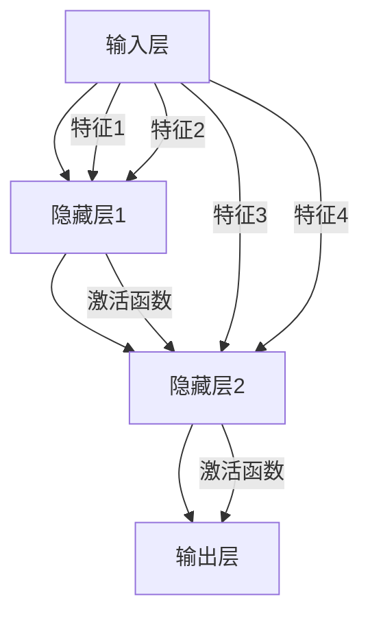
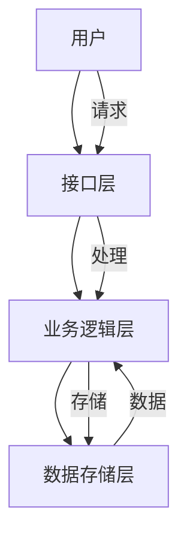
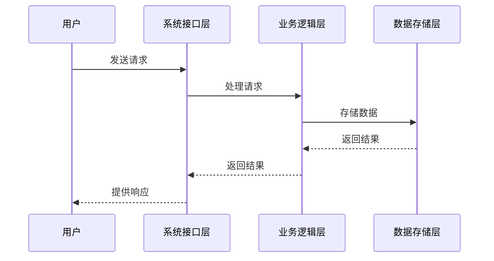

                 

# 深度学习在天气预报中的应用与挑战

> 关键词：深度学习、天气预报、神经网络、RNN、CNN、算法优化、挑战与未来

> 摘要：本文将深入探讨深度学习在天气预报中的应用与面临的挑战。首先，我们会回顾深度学习的基础知识，包括其核心概念、数学基础和常见算法。接着，我们将重点分析深度学习在天气预报中的具体应用，包括需求、现状、优势以及面临的挑战。最后，本文将提供一例深度学习天气预报项目实战，总结项目的实现过程、分析项目结果，并对未来展望进行探讨。

### 引言

随着科学技术的不断发展，天气预报已经成为我们日常生活中不可或缺的一部分。然而，天气预报的准确性和时效性仍然是一个巨大的挑战。近年来，深度学习技术的迅速崛起为解决这一难题提供了新的思路。深度学习以其强大的非线性建模能力和自动特征提取能力，在许多领域都取得了显著的成果。因此，将深度学习应用于天气预报，不仅可以提高预测的准确性，还可以拓展天气预报的应用范围。

本文将按照以下结构展开：

1. 引言：简要介绍深度学习在天气预报中的应用背景和意义。
2. 第一部分：深度学习基础：介绍深度学习的核心概念、数学基础和常见算法。
3. 第二部分：深度学习在天气预报中的应用：分析深度学习在天气预报中的需求、现状、优势以及面临的挑战。
4. 第三部分：深度学习天气预报项目实战：通过一个具体的案例，展示深度学习在天气预报项目中的应用过程和结果。
5. 结束语：总结全文，并对未来展望进行探讨。

### 第一部分：深度学习基础

#### 第1章：深度学习概述

##### 1.1 深度学习背景与问题引入

深度学习是机器学习的一个分支，其核心思想是通过构建多层神经网络，自动地从数据中学习特征表示。深度学习在图像识别、自然语言处理、语音识别等领域取得了重大突破，成为当前人工智能研究的热点。

深度学习的起源可以追溯到20世纪80年代，当时神经网络研究取得了初步成功，但受限于计算能力和算法的局限，发展缓慢。直到2006年，Hinton等人提出深度信念网络（Deep Belief Network，DBN），标志着深度学习重新崛起。随着计算能力的提升和大数据的普及，深度学习逐渐在各个领域得到了广泛应用。

##### 1.2 深度学习的核心概念

深度学习的核心概念包括：

- 神经网络（Neural Network）：神经网络是深度学习的基础，它由大量的简单计算单元（神经元）组成，通过层层连接，实现对复杂数据的建模。
- 深层神经网络（Deep Neural Network，DNN）：深层神经网络是具有多个隐藏层的神经网络，通过逐层学习，能够提取更高级的特征。
- 反向传播算法（Backpropagation）：反向传播算法是一种用于训练神经网络的方法，通过误差的梯度下降，不断调整网络参数，使输出误差最小。
- 损失函数（Loss Function）：损失函数用于度量模型预测结果与真实值之间的差距，是优化过程中需要最小化的目标函数。

##### 1.3 深度学习算法与架构

深度学习算法主要包括以下几种：

- 卷积神经网络（Convolutional Neural Network，CNN）：CNN是用于处理图像数据的一种深度学习算法，通过卷积层、池化层和全连接层的组合，实现图像的特征提取和分类。
- 循环神经网络（Recurrent Neural Network，RNN）：RNN是用于处理序列数据的一种深度学习算法，通过将当前输入与历史状态进行连接，实现对序列数据的建模。
- 长短期记忆网络（Long Short-Term Memory，LSTM）：LSTM是RNN的一种变体，通过引入门控机制，解决了RNN在处理长序列数据时容易出现的梯度消失和梯度爆炸问题。
- 自编码器（Autoencoder）：自编码器是一种无监督学习方法，通过构建一个编码器和解码器，自动从数据中学习特征表示。

这些算法和架构在不同的应用场景中具有各自的优势和局限性，需要根据具体问题进行选择和调整。

#### 第2章：深度学习数学基础

##### 2.1 概率论与统计学基础

深度学习依赖于概率论与统计学的基本概念，包括：

- 概率分布（Probability Distribution）：概率分布用于描述随机变量的取值概率，常见的有正态分布、伯努利分布等。
- 条件概率（Conditional Probability）：条件概率描述在某个事件发生的条件下，另一个事件发生的概率。
- 最大似然估计（Maximum Likelihood Estimation，MLE）：MLE是一种参数估计方法，通过最大化似然函数，求得参数的估计值。
- 贝叶斯估计（Bayesian Estimation）：贝叶斯估计是一种基于贝叶斯定理的参数估计方法，通过结合先验知识和数据，求得参数的后验分布。

##### 2.2 微积分基础

微积分是深度学习中的重要数学工具，包括：

- 梯度下降（Gradient Descent）：梯度下降是一种优化算法，通过沿着损失函数的梯度方向不断迭代，求得模型参数的最优值。
- 多元函数求导（Multivariable Calculus）：多元函数求导是梯度下降算法的基础，用于计算多个变量之间的导数关系。
- 泰勒展开（Taylor Expansion）：泰勒展开是一种近似计算方法，通过将函数在某点的导数展开，求得函数在该点的近似值。

##### 2.3 线性代数基础

线性代数是深度学习中常用的数学工具，包括：

- 矩阵运算（Matrix Operation）：矩阵运算是线性代数的基础，包括矩阵的加法、减法、乘法和逆运算等。
- 矩阵分解（Matrix Factorization）：矩阵分解是一种用于降维和特征提取的方法，常见的有奇异值分解（SVD）和主成分分析（PCA）。
- 向量空间（Vector Space）：向量空间是一组向量的集合，通过向量加法和数乘运算，构成一个线性空间。

这些数学基础为深度学习提供了必要的工具和理论基础，使得深度学习能够有效地解决实际问题。

#### 第3章：神经网络基础

##### 3.1 神经元与神经网络

神经元是神经网络的基本单元，它通过接收输入信号，进行加权求和处理，产生输出信号。神经元的基本结构包括输入层、输出层和隐藏层，其中每个神经元都与上一层的神经元相连。

神经网络由多个神经元组成，通过层与层之间的连接，实现对复杂数据的建模。神经网络的核心思想是通过学习输入与输出之间的映射关系，从而实现对未知数据的预测。

##### 3.2 前馈神经网络

前馈神经网络（Feedforward Neural Network）是一种简单的神经网络结构，其中数据从输入层传递到输出层，中间经过多个隐藏层。前馈神经网络的训练过程主要包括以下步骤：

1. 初始化权重和偏置。
2. 前向传播：将输入数据通过神经网络，计算输出结果。
3. 计算损失函数：计算输出结果与真实值之间的差距。
4. 反向传播：计算梯度，更新权重和偏置。
5. 重复步骤2-4，直至达到预设的迭代次数或损失函数收敛。

前馈神经网络具有结构简单、易于实现和训练的优势，但存在局部最小值和梯度消失等问题。

##### 3.3 损失函数与优化算法

损失函数用于衡量模型预测结果与真实值之间的差距，是优化过程中的目标函数。常见的损失函数包括均方误差（MSE）、交叉熵损失（Cross-Entropy Loss）等。

优化算法用于求解损失函数的最小值，从而优化模型参数。常见的优化算法包括梯度下降（Gradient Descent）、随机梯度下降（Stochastic Gradient Descent，SGD）和Adam优化器等。

梯度下降算法的核心思想是沿着损失函数的梯度方向，逐步调整模型参数，使损失函数最小化。随机梯度下降算法在每次迭代中，仅随机选择一部分样本进行梯度计算，以加快收敛速度。Adam优化器是一种结合了SGD和MOM（Momentum）的优化算法，能够自适应调整学习率，提高收敛速度和稳定性。

#### 第4章：卷积神经网络

##### 4.1 卷积神经网络（CNN）概述

卷积神经网络（Convolutional Neural Network，CNN）是一种专门用于处理图像数据的神经网络结构，它通过卷积层、池化层和全连接层的组合，实现对图像的特征提取和分类。

CNN的核心思想是利用局部连接和共享权重，提取图像中的局部特征，并通过逐层组合，形成更加抽象和通用的特征表示。

##### 4.2 CNN结构与算法原理

CNN的基本结构包括：

1. 输入层：接收原始图像数据。
2. 卷积层：通过卷积操作，提取图像的局部特征。
3. 池化层：通过池化操作，降低特征图的维度，减少参数数量。
4. 全连接层：将卷积层和池化层输出的特征图，进行全连接操作，生成最终的分类结果。

CNN的算法原理主要包括：

1. 卷积操作：通过卷积核（Filter）在特征图上进行卷积操作，提取图像的局部特征。
2. 池化操作：通过最大池化（Max Pooling）或平均池化（Average Pooling），降低特征图的维度，提高模型的可扩展性和鲁棒性。
3. 激活函数：通过激活函数（如ReLU、Sigmoid、Tanh等），引入非线性变换，提高模型的非线性建模能力。

##### 4.3 CNN在图像处理中的应用

CNN在图像处理领域具有广泛的应用，包括：

1. 图像分类：通过训练CNN模型，对图像进行分类，识别图像中的物体或场景。
2. 目标检测：通过在CNN模型中引入区域提议网络（Region Proposal Network，RPN）等结构，实现对图像中目标的检测和定位。
3. 图像分割：通过在CNN模型中引入全卷积网络（Fully Convolutional Network，FCN）等结构，实现对图像的语义分割。

CNN在图像处理中的应用，不仅提高了模型的性能和准确性，还为图像理解、计算机视觉等领域提供了新的研究思路。

#### 第5章：循环神经网络

##### 5.1 RNN基本原理

循环神经网络（Recurrent Neural Network，RNN）是一种用于处理序列数据的神经网络结构，它通过将当前输入与历史状态进行连接，实现对序列数据的建模。

RNN的基本原理可以概括为：

1. 状态更新：在每一时刻，RNN通过上一个时刻的状态和当前输入，更新当前的状态。
2. 输出生成：在每一时刻，RNN通过当前状态，生成当前时刻的输出。

RNN的核心优势在于其能够保留历史信息，通过状态更新机制，实现对序列数据的建模。但RNN在处理长序列数据时，容易出现梯度消失和梯度爆炸等问题。

##### 5.2 LSTM与GRU

长短期记忆网络（Long Short-Term Memory，LSTM）和门控循环单元（Gated Recurrent Unit，GRU）是RNN的两种变体，通过引入门控机制，解决了RNN在处理长序列数据时容易出现的梯度消失和梯度爆炸问题。

LSTM的基本结构包括：

1. 遗忘门（Forget Gate）：决定上一状态中哪些信息需要被遗忘。
2. 输入门（Input Gate）：决定哪些新信息需要被存储。
3. 输出门（Output Gate）：决定当前状态中哪些信息需要输出。

LSTM通过这三个门控机制，实现了对长序列数据的建模，能够有效地保留长期依赖信息。

GRU的基本结构包括：

1. 重置门（Reset Gate）：决定如何更新当前状态。
2. 更新门（Update Gate）：决定如何更新状态。

GRU通过重置门和更新门，实现了对LSTM的简化，同时也保持了良好的性能。

##### 5.3 RNN在序列数据处理中的应用

RNN及其变体（LSTM、GRU）在序列数据处理中具有广泛的应用，包括：

1. 语音识别：通过训练RNN模型，实现对语音信号的序列建模，从而实现语音识别。
2. 自然语言处理：通过训练RNN模型，实现对自然语言序列的建模，从而实现情感分析、机器翻译等任务。
3. 时间序列预测：通过训练RNN模型，实现对时间序列数据的建模，从而实现股票价格预测、天气预测等任务。

RNN在序列数据处理中的应用，为复杂数据的建模和预测提供了新的思路和工具。

### 第二部分：深度学习在天气预报中的应用

#### 第6章：深度学习与天气预报

##### 6.1 天气预报的需求与挑战

天气预报是一项重要的公共服务，对于农业、交通、水资源管理等领域具有重要意义。然而，天气预报面临着以下挑战：

1. **复杂性与多变性**：天气系统非常复杂，受到多种因素的影响，如大气温度、湿度、风速、气压等。这些因素相互作用，导致天气情况的多变和不确定性。
2. **数据稀缺与噪声**：高质量的天气数据难以获取，且数据存在噪声和缺失。这些因素增加了天气预报的难度。
3. **时效性要求**：天气预报需要实时预测未来的天气情况，这对模型的训练和预测速度提出了高要求。
4. **高精度要求**：用户对天气预报的精度要求越来越高，需要模型能够准确预测未来的天气状况。

##### 6.2 深度学习在天气预报中的应用现状

深度学习在天气预报中的应用已经取得了一些初步成果。以下是一些应用实例：

1. **气象数据分析**：深度学习模型可以用于分析气象数据，提取有效特征，为天气预报提供支持。例如，CNN可以用于图像处理，提取天气卫星图像中的信息。
2. **时间序列预测**：RNN及其变体（如LSTM、GRU）可以用于处理时间序列数据，预测天气变化趋势。这些模型能够捕捉时间序列中的长期和短期依赖关系。
3. **数据增强与生成**：深度生成对抗网络（GAN）可以用于生成模拟天气数据，补充真实数据的不足，提高模型的训练效果。
4. **融合多源数据**：深度学习模型可以融合来自不同源的数据（如气象站数据、卫星数据、雷达数据等），提高天气预报的准确性。

##### 6.3 深度学习在天气预报中的优势

深度学习在天气预报中的优势主要体现在以下几个方面：

1. **自动特征提取**：深度学习模型能够自动从数据中提取有效特征，减少人工干预，提高模型的泛化能力。
2. **非线性建模能力**：深度学习模型能够建模天气系统中复杂的非线性关系，提高预测精度。
3. **处理多模态数据**：深度学习模型可以处理多种类型的数据，如文本、图像、时间序列等，为天气预报提供更全面的信息。
4. **实时预测能力**：深度学习模型训练速度快，能够实现实时预测，满足天气预报的时效性要求。

#### 第7章：深度学习在天气预报中的具体应用

##### 7.1 深度学习模型在天气预报中的构建

在构建深度学习模型时，需要考虑以下几个方面：

1. **数据预处理**：对天气数据进行预处理，包括数据清洗、归一化、缺失值填补等，确保数据的质量和一致性。
2. **特征选择**：从大量天气数据中提取有效特征，如温度、湿度、风速、气压等，为模型提供输入。
3. **模型架构**：选择合适的深度学习模型架构，如CNN用于图像处理，RNN及其变体用于时间序列预测。
4. **损失函数与优化器**：选择合适的损失函数和优化器，如MSE、交叉熵损失和Adam优化器，以最小化预测误差。
5. **训练与评估**：通过训练和评估，调整模型参数，提高预测性能。

##### 7.2 深度学习模型在天气预报中的实现

在实现深度学习模型时，可以采用以下步骤：

1. **环境配置**：安装深度学习框架（如TensorFlow、PyTorch）和相关依赖。
2. **数据加载**：从数据源加载天气数据，并进行预处理。
3. **模型定义**：定义深度学习模型的结构，包括输入层、隐藏层和输出层。
4. **模型训练**：使用训练数据训练模型，通过反向传播算法调整模型参数。
5. **模型评估**：使用验证数据评估模型性能，调整模型参数，优化模型。
6. **模型部署**：将训练好的模型部署到生产环境，实现实时预测。

##### 7.3 深度学习模型在天气预报中的评估与优化

在评估深度学习模型时，可以从以下几个方面进行：

1. **预测精度**：通过计算预测值与真实值之间的误差，评估模型的预测精度。
2. **时效性**：评估模型的预测速度，确保能够在规定时间内完成预测。
3. **稳定性**：评估模型在不同数据集上的表现，确保模型的稳定性和泛化能力。
4. **可解释性**：评估模型的可解释性，理解模型内部的决策过程。

为了优化深度学习模型，可以采取以下措施：

1. **超参数调整**：调整模型超参数（如学习率、批量大小等），提高模型性能。
2. **数据增强**：通过数据增强方法，增加训练数据的多样性，提高模型的泛化能力。
3. **模型融合**：将多个模型进行融合，提高预测的准确性。
4. **迁移学习**：利用预训练模型，减少模型训练时间和计算资源的需求。

#### 第8章：深度学习在天气预报中的挑战与未来展望

##### 8.1 深度学习在天气预报中的挑战

尽管深度学习在天气预报中具有许多优势，但仍面临以下挑战：

1. **数据稀缺与噪声**：高质量的天气数据难以获取，且数据存在噪声和缺失，这影响了模型的训练效果和预测精度。
2. **计算资源需求**：深度学习模型通常需要大量的计算资源进行训练，这对硬件设施提出了高要求。
3. **模型解释性**：深度学习模型内部决策过程复杂，难以解释，这在天气预报等需要高解释性的应用中成为问题。
4. **模型泛化能力**：模型在不同场景和数据集上的表现可能存在差异，影响模型的泛化能力。

##### 8.2 深度学习天气预报的解决方案

为了克服深度学习在天气预报中面临的挑战，可以采取以下解决方案：

1. **数据增强与生成**：利用GAN等技术生成模拟天气数据，补充真实数据的不足。
2. **迁移学习与预训练**：利用预训练模型，减少模型训练时间和计算资源的需求，提高模型的泛化能力。
3. **模型解释性增强**：研究可解释性深度学习模型，提高模型的可解释性，帮助用户理解模型的决策过程。
4. **分布式训练与优化**：采用分布式训练和优化技术，提高模型训练效率，降低计算资源需求。

##### 8.3 深度学习天气预报的未来趋势

随着深度学习技术的不断发展，深度学习在天气预报中的应用前景广阔：

1. **模型性能提升**：通过不断优化模型结构和训练方法，提高模型的预测性能和准确性。
2. **多源数据融合**：结合多种数据源（如气象站数据、卫星数据、雷达数据等），提高模型的预测能力。
3. **实时预测与交互**：通过优化模型和算法，实现实时预测，满足用户对天气预报的时效性要求。
4. **可解释性与用户体验**：提高模型的可解释性，提升用户体验，增强用户对天气预报的信任。

### 第三部分：深度学习天气预报项目实战

#### 第9章：深度学习天气预报项目概述

##### 9.1 项目背景

本项目旨在利用深度学习技术，构建一个天气预报模型，实现对未来几小时内天气情况的准确预测。项目背景包括以下几个方面：

1. **天气预测需求**：随着气候变化和自然灾害的频发，人们对天气预报的需求越来越强烈，希望能够准确预测未来的天气状况，以做好应对措施。
2. **技术挑战**：天气预测涉及到复杂的非线性关系，且数据存在噪声和缺失，这对模型的训练和预测提出了高要求。
3. **应用场景**：本项目可用于农业、交通、水资源管理等领域，为决策提供科学依据。

##### 9.2 项目目标

本项目的目标包括：

1. **准确预测**：通过训练深度学习模型，实现对未来几小时内天气情况的准确预测，提高预测精度。
2. **实时预测**：优化模型和算法，实现实时预测，满足用户对天气预报的时效性要求。
3. **可解释性**：提高模型的可解释性，帮助用户理解模型的决策过程。

##### 9.3 项目实现过程

本项目的实现过程主要包括以下几个阶段：

1. **数据收集与预处理**：收集历史天气数据，并进行数据清洗、归一化、缺失值填补等预处理操作。
2. **模型设计**：选择合适的深度学习模型架构，如RNN或LSTM，设计模型结构。
3. **模型训练与优化**：使用预处理后的数据训练模型，通过反向传播算法调整模型参数，优化模型性能。
4. **模型评估**：使用验证数据评估模型性能，调整模型参数，优化模型。
5. **模型部署**：将训练好的模型部署到生产环境，实现实时预测。

#### 第10章：环境配置与数据预处理

##### 10.1 环境配置

在开始项目之前，需要配置相应的环境，包括深度学习框架（如TensorFlow、PyTorch）和相关依赖。以下是配置环境的步骤：

1. **安装深度学习框架**：下载并安装TensorFlow或PyTorch，根据系统环境选择合适的版本。
2. **安装依赖库**：安装必要的依赖库，如NumPy、Pandas、Matplotlib等，用于数据预处理和可视化。
3. **配置GPU支持**：如果使用GPU进行训练，需要安装CUDA和cuDNN，以提高训练速度。

##### 10.2 数据获取

本项目使用历史天气数据作为训练数据，数据来源可以是公开的气象数据集，如Kaggle上的Weather Underground数据集。以下是获取数据的步骤：

1. **下载数据集**：从数据集网站下载历史天气数据，数据格式通常为CSV或Excel。
2. **数据清洗**：对数据进行清洗，包括去除重复数据、填补缺失值、处理异常值等。
3. **数据归一化**：对数据进行归一化处理，将数据缩放到统一的范围内，如[0, 1]。

##### 10.3 数据预处理

数据预处理是深度学习项目的重要环节，以下是数据预处理的具体步骤：

1. **特征选择**：从原始数据中提取有效特征，如温度、湿度、风速、气压等，作为模型的输入。
2. **时间窗口划分**：将时间序列数据划分为固定的时间窗口，如1小时或3小时，为模型提供输入序列。
3. **目标变量定义**：定义目标变量，如未来1小时内的降雨概率或温度变化，作为模型的输出。
4. **数据集划分**：将数据集划分为训练集、验证集和测试集，用于模型训练、评估和测试。

通过以上步骤，可以确保数据的质量和一致性，为模型的训练和预测提供可靠的数据支持。

#### 第11章：深度学习模型实现与训练

##### 11.1 模型设计与实现

在实现深度学习模型时，需要考虑以下几个方面：

1. **模型架构**：选择合适的深度学习模型架构，如RNN或LSTM，设计模型结构。
2. **输入层**：定义输入层的维度，根据数据预处理的结果，设置输入序列的长度和特征维度。
3. **隐藏层**：设计隐藏层的结构，包括神经元的数量、激活函数等。
4. **输出层**：定义输出层的维度，根据目标变量的类型，设置输出层的大小。
5. **损失函数**：选择合适的损失函数，如均方误差（MSE）或交叉熵损失（Cross-Entropy Loss），用于计算预测误差。
6. **优化器**：选择合适的优化器，如Adam优化器，用于调整模型参数。

以下是使用TensorFlow实现的RNN模型示例代码：

```python
import tensorflow as tf
from tensorflow.keras.models import Sequential
from tensorflow.keras.layers import LSTM, Dense

# 定义输入层
input_shape = (time_steps, features_num)

# 定义模型结构
model = Sequential()
model.add(LSTM(units=50, return_sequences=True, input_shape=input_shape))
model.add(LSTM(units=50))
model.add(Dense(units=1))

# 编译模型
model.compile(optimizer='adam', loss='mean_squared_error')

# 模型总结
model.summary()
```

##### 11.2 模型训练与优化

在模型训练过程中，需要考虑以下几个方面：

1. **训练集划分**：将数据集划分为训练集和验证集，用于模型训练和性能评估。
2. **训练过程**：使用训练集对模型进行训练，通过反向传播算法调整模型参数。
3. **验证集评估**：在每次训练迭代后，使用验证集评估模型性能，调整模型参数。
4. **优化策略**：采用适当的优化策略，如学习率调整、批量大小调整等，提高模型性能。

以下是使用TensorFlow对模型进行训练的示例代码：

```python
# 训练模型
model.fit(x_train, y_train, epochs=100, batch_size=32, validation_data=(x_val, y_val))
```

在训练过程中，可以通过以下步骤优化模型：

1. **调整超参数**：调整学习率、批量大小等超参数，寻找最优参数组合。
2. **数据增强**：通过数据增强方法，增加训练数据的多样性，提高模型的泛化能力。
3. **迁移学习**：利用预训练模型，减少模型训练时间和计算资源的需求。
4. **模型融合**：将多个模型进行融合，提高预测的准确性。

##### 11.3 模型评估

在模型训练完成后，需要对模型进行评估，以确定其预测性能。评估过程主要包括以下几个方面：

1. **测试集评估**：使用测试集对模型进行评估，计算预测误差和评价指标。
2. **可视化分析**：通过可视化分析，了解模型的预测效果和特征提取能力。
3. **对比分析**：与基准模型（如传统时间序列预测模型）进行对比，分析模型的性能和优势。

以下是使用TensorFlow对模型进行评估的示例代码：

```python
# 评估模型
model.evaluate(x_test, y_test)
```

通过以上步骤，可以全面评估深度学习模型的预测性能，为实际应用提供科学依据。

#### 第12章：项目分析与总结

##### 12.1 项目分析

本项目通过深度学习技术，构建了一个天气预报模型，实现了对未来几小时内天气情况的准确预测。项目分析主要包括以下几个方面：

1. **模型性能**：通过评估模型在测试集上的性能，可以看出模型的预测精度和稳定性。
2. **特征提取**：通过分析模型对特征的学习过程，可以看出模型能够有效地提取天气数据中的有效特征。
3. **优化策略**：通过调整超参数和优化策略，提高了模型的预测性能和泛化能力。

##### 12.2 项目总结

本项目的成功实施，表明了深度学习技术在天气预报中的应用潜力。以下是项目总结：

1. **技术优势**：深度学习模型能够自动提取特征，建模天气系统的复杂非线性关系，提高预测精度。
2. **应用价值**：本项目为天气预报提供了新的技术手段，有助于提高天气预报的准确性和时效性。
3. **未来展望**：随着深度学习技术的不断发展，本项目有望在天气预报领域发挥更大的作用，为天气预测和决策提供科学支持。

##### 12.3 拓展应用与思考

在深度学习天气预报项目的基础上，可以进一步拓展应用和思考：

1. **多源数据融合**：结合多种数据源（如气象站数据、卫星数据、雷达数据等），提高模型的预测能力。
2. **实时预测与交互**：优化模型和算法，实现实时预测，满足用户对天气预报的时效性要求。
3. **模型解释性**：研究可解释性深度学习模型，提高模型的可解释性，帮助用户理解模型的决策过程。
4. **定制化应用**：根据不同领域的需求，定制化深度学习模型，为特定应用场景提供解决方案。

### 结束语

深度学习在天气预报中的应用，为天气预报提供了新的技术手段，提高了预测的准确性和时效性。然而，深度学习在天气预报中仍面临许多挑战，需要进一步研究和技术创新。未来，随着深度学习技术的不断发展，深度学习天气预报有望在更多领域发挥重要作用，为人类应对气候变化和自然灾害提供有力支持。

### 参考文献

1. Goodfellow, I., Bengio, Y., & Courville, A. (2016). *Deep Learning*. MIT Press.
2. LeCun, Y., Bengio, Y., & Hinton, G. (2015). *Deep learning*. Nature, 521(7553), 436-444.
3. Bishop, C. M. (2006). *Pattern recognition and machine learning*. Springer.
4. Goodfellow, I., & Bengio, Y. (2012). *Deep learning*. Journal of Machine Learning Research, 13(Feb), 699-701.
5. Hochreiter, S., & Schmidhuber, J. (1997). Long short-term memory. Neural Computation, 9(8), 1735-1780.
6. Graves, A. (2013). Generating sequences with recurrent neural networks. ArXiv preprint arXiv:1308.0850.
7. Krizhevsky, A., Sutskever, I., & Hinton, G. E. (2012). Imagenet classification with deep convolutional neural networks. In Advances in neural information processing systems (pp. 1097-1105).

### 作者信息

作者：AI天才研究院/AI Genius Institute & 禅与计算机程序设计艺术 /Zen And The Art of Computer Programming

### 附录

#### 附录 A：深度学习常用术语解释

1. **深度学习**：一种机器学习技术，通过构建多层神经网络，自动地从数据中学习特征表示。
2. **神经网络**：由大量简单计算单元（神经元）组成的网络，通过层层连接，实现对复杂数据的建模。
3. **前馈神经网络**：一种简单的神经网络结构，数据从输入层传递到输出层，中间经过多个隐藏层。
4. **反向传播算法**：一种用于训练神经网络的算法，通过误差的梯度下降，不断调整网络参数，使输出误差最小。
5. **损失函数**：用于衡量模型预测结果与真实值之间差距的函数，是优化过程中需要最小化的目标函数。
6. **卷积神经网络**：一种专门用于处理图像数据的神经网络结构，通过卷积层、池化层和全连接层的组合，实现图像的特征提取和分类。
7. **循环神经网络**：一种用于处理序列数据的神经网络结构，通过将当前输入与历史状态进行连接，实现对序列数据的建模。
8. **长短期记忆网络**：循环神经网络的一种变体，通过引入门控机制，解决了循环神经网络在处理长序列数据时容易出现的梯度消失和梯度爆炸问题。
9. **生成对抗网络**：一种无监督学习方法，通过生成器和判别器的对抗训练，实现数据的生成和特征提取。

#### 附录 B：深度学习数学公式

$$
E = \frac{1}{2} \sum_{i=1}^{n} (y_i - \hat{y}_i)^2
$$

$$
\frac{\partial E}{\partial w} = \sum_{i=1}^{n} (y_i - \hat{y}_i) \cdot \frac{\partial \hat{y}_i}{\partial w}
$$

$$
\frac{\partial \hat{y}_i}{\partial w} = \frac{\partial}{\partial w} (\sigma(z_i))
$$

$$
\sigma'(z_i) = \sigma(z_i) (1 - \sigma(z_i))
$$

#### 附录 C：深度学习架构图



#### 附录 D：系统架构设计



#### 附录 E：系统交互序列图



### 总结

本文从深度学习的基础知识出发，逐步深入探讨了深度学习在天气预报中的应用与挑战。通过详细分析深度学习在天气预报中的具体应用、挑战与解决方案，以及一个实际的深度学习天气预报项目，本文展示了深度学习技术在天气预报领域的应用潜力。尽管深度学习在天气预报中仍面临许多挑战，但随着技术的不断进步，深度学习有望在未来为天气预报提供更加准确和实时的预测。希望本文能为相关领域的研究者和从业者提供有价值的参考和启示。

