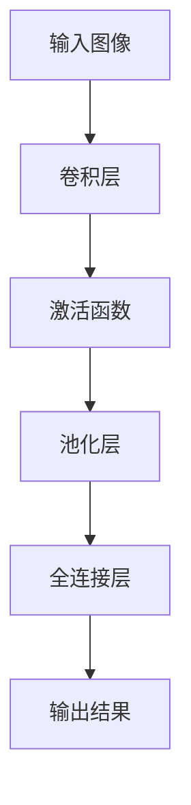
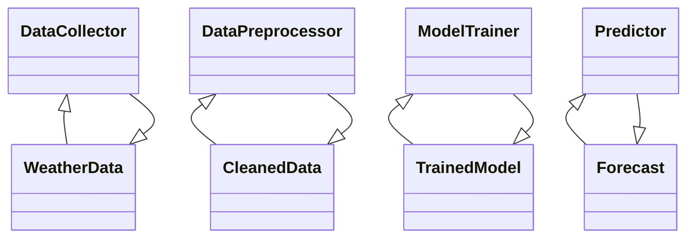
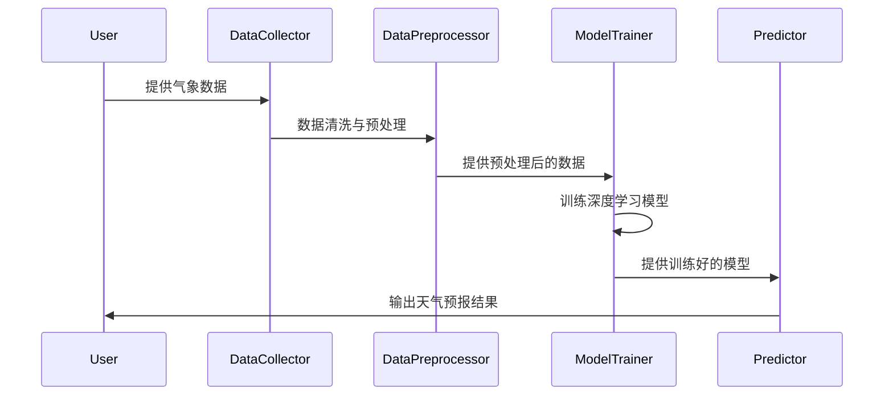
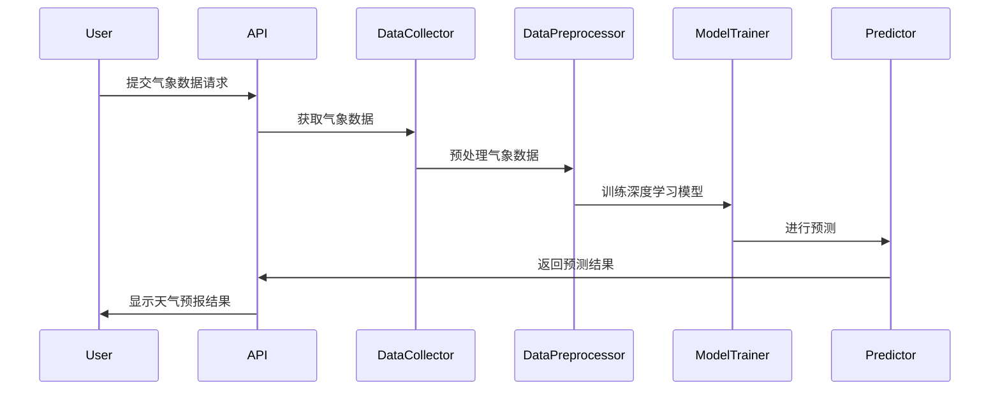

                 

# 深度学习在天气预报中的应用：提高短期预报准确性

## 关键词
深度学习、天气预报、短期预报、准确性、气象数据、神经网络

## 摘要
本文将探讨深度学习技术在天气预报中的应用，特别是如何通过深度学习模型提高短期天气预报的准确性。首先，我们将简要介绍深度学习和天气预报的基本概念及其发展背景。接着，本文将详细解释深度学习的基本原理和常见模型，并阐述它们如何应用于气象预测。此外，我们将讨论气象数据预处理的方法和深度学习模型在短期天气预报中的具体应用。最后，通过实际案例研究和最佳实践总结，本文将展示深度学习如何显著提高短期天气预报的准确性，并对未来的发展方向提出展望。

## 第一部分：深度学习与天气预报概述

### 第1章：深度学习与天气预报简介

#### 1.1 深度学习的发展与应用

**深度学习的发展历程**

深度学习，作为人工智能的一个重要分支，起源于20世纪40年代，但直到21世纪初才得以迅速发展。随着计算能力和数据资源的不断提升，深度学习在图像识别、语音识别和自然语言处理等领域取得了显著的突破。

**深度学习在气象学中的应用**

气象学是研究大气现象的科学，而深度学习在气象学中的应用主要集中在气象数据的分析和预测。通过处理大量气象数据，深度学习模型能够发现数据中的隐藏模式，从而提高天气预报的准确性。

#### 1.2 天气预报的重要性与挑战

**天气预报的基本概念**

天气预报是指通过对大气运动和物理过程的模拟，预测未来一段时间内的大气状态。准确的天气预报对于防灾减灾、农业生产、交通调度和国家安全具有重要意义。

**天气预报的挑战与需求**

尽管天气预报技术在过去几十年取得了显著进步，但短期内仍然存在许多挑战，如气象数据的不确定性、气象系统的复杂性和计算资源的限制。因此，提高短期天气预报的准确性是当前气象学研究的重点之一。

#### 1.3 深度学习在天气预报中的应用前景

**提高短期预报准确性的重要性**

短期天气预报的准确性直接关系到公众的生活和经济活动。通过深度学习技术，有望大幅提高短期天气预报的准确性，从而为决策者提供更可靠的依据。

**深度学习在天气预报中的应用潜力**

深度学习模型具有强大的学习和泛化能力，能够处理复杂的大规模气象数据。因此，深度学习在天气预报中具有巨大的应用潜力，有望在未来实现更精准的气象预测。

### 第2章：深度学习基础

#### 2.1 深度学习基本原理

**神经网络的基础**

神经网络是深度学习的基础，由大量的神经元通过复杂的连接方式组成。通过学习输入数据，神经网络能够形成映射关系，从而实现预测和分类等功能。

**激活函数与优化算法**

激活函数用于引入非线性，使神经网络能够处理复杂的输入数据。优化算法则用于调整网络的权重，以最小化预测误差。常见的优化算法包括梯度下降、随机梯度下降和Adam优化器。

#### 2.2 常见深度学习模型

**卷积神经网络（CNN）**

卷积神经网络是一种专门用于处理图像数据的深度学习模型。通过卷积操作和池化操作，CNN能够提取图像特征，并在不同层级上形成抽象表示。

**循环神经网络（RNN）**

循环神经网络适用于处理序列数据，如时间序列数据。通过循环结构，RNN能够记住之前的输入信息，从而实现长期的序列依赖建模。

**长短时记忆网络（LSTM）**

长短时记忆网络是RNN的一个变种，通过引入门控机制，LSTM能够有效解决长序列依赖问题。这使得LSTM在处理时间序列数据时表现尤为出色。

#### 2.3 深度学习框架与应用

**TensorFlow和PyTorch的应用**

TensorFlow和PyTorch是两种常用的深度学习框架，提供了丰富的工具和库，用于构建、训练和部署深度学习模型。

**深度学习模型的训练与优化**

深度学习模型的训练过程涉及数据预处理、模型选择、训练策略和模型优化等多个环节。通过合理的训练策略和优化方法，可以提高模型的性能和泛化能力。

## 第二部分：深度学习在天气预报中的应用

### 第3章：气象数据预处理

#### 3.1 气象数据的来源与特点

**气象数据的采集**

气象数据来源于各种气象观测设备，如气象站、卫星和雷达等。这些设备实时采集大气参数，如温度、湿度、风速和降水等。

**气象数据的特点与挑战**

气象数据具有高维度、高噪声和强非线性等特点，给数据处理带来了挑战。同时，气象数据的不确定性和时间敏感性也增加了预测的难度。

#### 3.2 气象数据预处理方法

**数据清洗与缺失值处理**

数据清洗是预处理的重要步骤，包括去除噪声、填充缺失值和处理异常值等。有效的数据清洗可以提高模型的训练效果。

**数据归一化与特征提取**

数据归一化是将不同量级的特征数据转换为同一量级，以消除特征之间的尺度差异。特征提取则是从原始数据中提取有用的信息，以减少数据维度和降低计算复杂度。

### 第4章：深度学习模型在短期天气预报中的应用

#### 4.1 短期天气预报的基本流程

**天气预报的流程**

天气预报通常包括数据收集、数据处理、模型构建、模型训练和结果预测等步骤。这些步骤相互关联，共同构成了一个完整的天气预报系统。

**短期天气预报的关键技术**

短期天气预报的关键技术包括数据预处理、模型选择和训练策略等。深度学习模型的引入为这些关键技术的实现提供了新的思路和方法。

#### 4.2 深度学习模型在短期天气预报中的应用

**基于CNN的气象预测模型**

卷积神经网络在处理图像数据方面具有优势，因此可以应用于气象预测。通过卷积操作和池化操作，CNN能够提取气象数据中的空间特征，从而提高预测准确性。

**基于RNN和LSTM的气象预测模型**

循环神经网络和长短时记忆网络适用于处理时间序列数据。通过学习时间序列中的依赖关系，RNN和LSTM能够实现更准确的气象预测。

**多模型融合与优化**

多模型融合是将多个深度学习模型的优势结合起来，以提高预测准确性。通过模型融合和优化策略，可以进一步提升短期天气预报的准确性。

### 第5章：案例研究

#### 5.1 案例一：利用LSTM模型进行短期天气预报

**案例背景**

本案例选择了一个具体的城市作为研究对象，利用LSTM模型进行短期天气预报。数据集包括过去一年的气象观测数据，如温度、湿度、风速和降水等。

**模型设计与实现**

本案例采用了LSTM模型，通过预处理后的气象数据训练模型，并使用训练好的模型进行预测。具体实现过程包括数据清洗、数据归一化、模型构建和模型训练等步骤。

**结果分析**

通过对比预测结果与实际观测数据，可以发现LSTM模型在短期天气预报中具有较高的准确性。此外，通过对模型参数的调优，可以进一步提高预测准确性。

#### 5.2 案例二：利用CNN进行短期降水预测

**案例背景**

本案例选择了一个具体的季节作为研究对象，利用CNN模型进行短期降水预测。数据集包括过去十年的气象观测数据，如温度、湿度、风速和降水等。

**模型设计与实现**

本案例采用了CNN模型，通过预处理后的气象数据训练模型，并使用训练好的模型进行预测。具体实现过程包括数据清洗、数据归一化、模型构建和模型训练等步骤。

**结果分析**

通过对比预测结果与实际观测数据，可以发现CNN模型在短期降水预测中具有较高的准确性。此外，通过对模型参数的调优，可以进一步提高预测准确性。

### 第6章：深度学习在天气预报中的最佳实践

#### 6.1 数据质量控制与优化

**数据质量控制的重要性**

高质量的数据是深度学习模型训练的基础。数据质量控制包括数据清洗、数据归一化和数据增强等步骤，可以有效提高模型的训练效果。

**数据优化策略**

数据优化策略包括数据预处理、特征选择和模型优化等。通过合理的优化策略，可以进一步提高模型的性能和预测准确性。

#### 6.2 模型选择与训练策略

**模型选择的原则**

模型选择应考虑数据类型、预测目标和模型复杂度等因素。针对不同的预测任务，选择合适的模型可以显著提高预测准确性。

**训练策略与调优**

训练策略包括批量大小、学习率、优化算法和训练迭代次数等。通过合理的训练策略和调优方法，可以进一步提高模型的性能和泛化能力。

### 第7章：深度学习在天气预报中的挑战与未来方向

#### 7.1 当前深度学习在天气预报中的应用现状

**成功案例与挑战**

当前深度学习在天气预报中取得了显著的成果，但仍面临一些挑战，如数据质量、模型复杂度和计算资源等。

**应用中的问题与瓶颈**

深度学习在天气预报中的应用仍存在一些问题，如模型的解释性不足、预测精度有限等。这些问题需要进一步研究和解决。

#### 7.2 深度学习在天气预报中的未来发展方向

**新技术与创新应用**

未来深度学习在天气预报中的应用将涉及新技术和创新方法，如迁移学习、生成对抗网络和联邦学习等。

**跨学科融合与综合应用**

深度学习在天气预报中的应用将与其他学科（如物理学、生物学等）相结合，实现跨学科的综合应用，以提高预报的准确性和可靠性。

### 第8章：小结与展望

#### 8.1 总结与回顾

**本书的主要内容回顾**

本文系统地介绍了深度学习在天气预报中的应用，包括基本原理、模型应用、案例研究和最佳实践。

**深度学习在天气预报中的应用总结**

深度学习在天气预报中具有显著的应用潜力，可以提高短期天气预报的准确性，但仍需进一步研究和技术创新。

#### 8.2 展望与建议

**未来研究方向**

未来深度学习在天气预报中的应用将涉及新技术、新方法和跨学科融合等领域。

**应用实践的建议**

在实际应用中，需要关注数据质量、模型选择和训练策略等关键因素，以提高预报的准确性和可靠性。

### 作者

**作者：AI天才研究院/AI Genius Institute & 禅与计算机程序设计艺术 /Zen And The Art of Computer Programming**

---

### 背景介绍

**核心概念术语说明**

在探讨深度学习在天气预报中的应用之前，我们需要明确几个核心概念，包括深度学习、天气预报、气象数据、神经网络和激活函数等。

- **深度学习**：一种基于人工神经网络的学习方法，通过多层神经元的组合来提取输入数据中的复杂特征。
- **天气预报**：基于大气科学理论，利用观测数据和数值模型，对未来一段时间内的大气状态进行预测。
- **气象数据**：包括温度、湿度、风速、降水等描述大气状态的物理量。
- **神经网络**：一种模拟人脑神经元连接的计算机模型，通过学习输入数据来预测输出。
- **激活函数**：神经网络中用于引入非线性的函数，常见的有Sigmoid、ReLU和Tanh等。

**问题背景**

天气预报是气象科学的重要研究领域，对于防灾减灾、农业生产、交通调度和国家安全具有重要意义。然而，短期内天气预报的准确性仍然受到多种因素的制约，如数据质量、模型复杂度和计算资源等。

**问题描述**

提高短期天气预报的准确性是当前气象学研究的重点之一。深度学习作为一种新兴的人工智能技术，具有强大的学习和泛化能力，为提高天气预报准确性提供了新的思路和方法。

**问题解决**

通过深度学习技术，可以处理大规模的气象数据，提取隐藏的模式和特征，从而提高短期天气预报的准确性。深度学习模型（如卷积神经网络、循环神经网络和长短时记忆网络等）在气象预测中已取得显著成果，为解决天气预报准确性问题提供了有效的工具。

**边界与外延**

深度学习在天气预报中的应用不仅限于短期预测，还可以扩展到长期预测、极端天气事件预警和气候模拟等领域。同时，深度学习与其他气象学方法的结合，如数值天气预报和物理模型，也有助于提高预报的准确性和可靠性。

**概念结构与核心要素组成**

深度学习在天气预报中的应用涉及多个核心概念和要素：

- **数据预处理**：包括数据清洗、缺失值处理、归一化和特征提取等。
- **模型选择**：根据预测目标和数据特点选择合适的深度学习模型。
- **模型训练与优化**：通过调整模型参数和训练策略，提高模型的预测准确性。
- **结果评估**：使用准确度、召回率和均方误差等指标评估模型的性能。

### 核心概念与联系

**深度学习基本原理**

深度学习基于多层神经网络，通过逐层提取输入数据中的特征，实现从低层次到高层次的理解。深度学习的核心组成部分包括：

- **神经网络**：由大量神经元组成，每个神经元通过权重连接到其他神经元。
- **激活函数**：用于引入非线性，常见的有Sigmoid、ReLU和Tanh等。
- **优化算法**：如梯度下降、随机梯度下降和Adam优化器，用于调整网络权重。

**深度学习模型**

深度学习模型包括多种类型，根据应用场景和数据类型的不同，选择合适的模型至关重要。常见的深度学习模型有：

- **卷积神经网络（CNN）**：适用于图像数据，通过卷积和池化操作提取图像特征。
- **循环神经网络（RNN）**：适用于序列数据，通过循环结构处理时间序列依赖关系。
- **长短时记忆网络（LSTM）**：是RNN的一个变种，通过门控机制解决长序列依赖问题。

**神经网络基础**

神经网络是深度学习的基础，由大量神经元通过权重连接组成。神经网络的基本原理包括：

- **前向传播**：输入数据通过网络传递，每个神经元计算输出。
- **反向传播**：通过计算损失函数的梯度，调整网络权重，以优化模型性能。

**激活函数与优化算法**

激活函数用于引入非线性，常见的激活函数包括：

- **Sigmoid**：输出范围在0到1之间，具有平滑的梯度。
- **ReLU**：输出为0或输入值，具有较快的收敛速度。
- **Tanh**：输出范围在-1到1之间，具有对称性。

优化算法用于调整网络权重，常见的优化算法包括：

- **梯度下降**：通过计算损失函数的梯度，逐步调整权重，以达到最小化损失函数。
- **随机梯度下降**：对每个样本计算梯度，并更新权重。
- **Adam优化器**：结合了梯度下降和随机梯度下降的优点，自适应调整学习率。

**概念属性特征对比表格**

| 深度学习模型     | 特点             | 应用场景                   |
|--------------|------------------|--------------------------|
| 卷积神经网络（CNN） | 提取图像特征       | 图像识别、图像分类         |
| 循环神经网络（RNN） | 处理序列数据       | 语音识别、自然语言处理       |
| 长短时记忆网络（LSTM） | 解决长序列依赖问题   | 时间序列预测、语音生成       |

**ER实体关系图架构的Mermaid流程图**

```mermaid
erDiagram
  A类--|{具有}|B类 : 关联关系
  A类||--|{具有}|C类 : 关联关系
  B类|||--|{包含}|D类 : 包含关系
  C类|||--|{包含}|D类 : 包含关系
```

### 算法原理讲解

**卷积神经网络（CNN）**

**mermaid流程图：**



**Python源代码：**

```python
import numpy as np
import tensorflow as tf

# 创建卷积神经网络模型
model = tf.keras.Sequential([
    tf.keras.layers.Conv2D(filters=32, kernel_size=(3, 3), activation='relu', input_shape=(28, 28, 1)),
    tf.keras.layers.MaxPooling2D(pool_size=(2, 2)),
    tf.keras.layers.Flatten(),
    tf.keras.layers.Dense(units=128, activation='relu'),
    tf.keras.layers.Dense(units=10, activation='softmax')
])

# 编译模型
model.compile(optimizer='adam', loss='categorical_crossentropy', metrics=['accuracy'])

# 模型训练
model.fit(x_train, y_train, epochs=10, batch_size=32)
```

**算法原理详细讲解：**

卷积神经网络（CNN）是一种专门用于图像处理的深度学习模型。其基本原理是通过卷积操作提取图像特征，并通过池化操作降低数据的维度，从而实现图像的分类和识别。

1. **卷积层**：卷积层通过卷积操作提取图像特征。卷积操作涉及一个卷积核（也称为滤波器）在输入图像上滑动，并与图像上的像素进行点积操作。卷积核的参数（如大小和数量）通过训练自动调整，以提取不同层次的特征。

2. **激活函数**：卷积层后面通常跟着激活函数，如ReLU（Rectified Linear Unit），用于引入非线性。ReLU函数将输入值设置为大于0的部分，将小于等于0的部分设置为0。这有助于提高网络的训练速度和性能。

3. **池化层**：池化层用于降低数据的维度，减少计算复杂度。常见的池化操作有最大池化和平均池化。最大池化选取每个窗口中的最大值，而平均池化则取窗口内所有值的平均值。池化操作有助于减少过拟合，并增强模型的泛化能力。

4. **全连接层**：全连接层将卷积层的特征映射到输出层。每个神经元都与卷积层中的所有神经元相连，通过全连接层的权重调整，实现图像的分类或识别。

5. **输出层**：输出层通常包含一个或多个神经元，用于生成预测结果。常见的输出层激活函数有softmax，用于实现多分类问题。

通过以上步骤，CNN能够从原始图像中提取特征，并实现图像的分类和识别。

**深度学习模型的训练与优化**

在深度学习模型的训练过程中，我们主要关注以下几个关键环节：

1. **模型初始化**：模型初始化包括权重和偏置的初始化。常用的方法有随机初始化、高斯初始化和Xavier初始化等。合理的初始化方法有助于加速模型的收敛和提高模型的性能。

2. **前向传播**：前向传播是将输入数据通过网络的各个层，最终生成预测结果的过程。在每一层，网络会计算输出值，并传递给下一层。前向传播过程中，会使用激活函数和卷积操作等非线性变换。

3. **反向传播**：反向传播是计算损失函数关于网络参数的梯度，并通过优化算法更新网络参数的过程。反向传播是深度学习模型训练的核心，通过梯度下降等方法，不断调整网络参数，以最小化损失函数。

4. **优化算法**：优化算法用于调整网络参数，以最小化损失函数。常见的优化算法有梯度下降、随机梯度下降（SGD）和Adam优化器等。优化算法的选择和参数设置对模型的训练效果具有重要影响。

5. **损失函数**：损失函数用于衡量预测结果和真实结果之间的差距。常用的损失函数有均方误差（MSE）、交叉熵损失（CE）等。选择合适的损失函数有助于提高模型的训练效果和泛化能力。

**数学模型和公式**

假设我们有输入数据 \( X \) 和标签 \( Y \)，其中 \( X \) 是一个 \( n \times d \) 的矩阵，\( Y \) 是一个 \( n \times 1 \) 的向量。网络中有一个包含 \( L \) 层的神经网络，每层有 \( m_l \) 个神经元。

1. **前向传播公式**：

\[ Z_l = XW_l + b_l \]
\[ a_l = \sigma(Z_l) \]

其中，\( W_l \) 是第 \( l \) 层的权重矩阵，\( b_l \) 是第 \( l \) 层的偏置向量，\( \sigma \) 是激活函数，通常取 ReLU 或 Sigmoid 函数。

2. **反向传播公式**：

\[ \delta_l = \frac{\partial L}{\partial Z_l} \odot \frac{\partial \sigma}{\partial Z_l} \]
\[ \delta_{l-1} = (W_{l-1})^T \delta_l \]

其中，\( \delta_l \) 是第 \( l \) 层的误差项，\( \odot \) 表示逐元素乘积。

**通俗易懂地举例说明**

假设我们有一个包含两层的神经网络，输入数据是一个 \( 1 \times 5 \) 的矩阵，输出数据是一个 \( 1 \times 3 \) 的向量。

1. **输入层**：

\[ X = \begin{bmatrix} 1 & 2 & 3 & 4 & 5 \end{bmatrix} \]

2. **隐藏层**：

\[ W_1 = \begin{bmatrix} 0.1 & 0.2 & 0.3 \\ 0.4 & 0.5 & 0.6 \end{bmatrix}, \quad b_1 = \begin{bmatrix} 0.1 & 0.2 & 0.3 \end{bmatrix} \]

\[ Z_1 = XW_1 + b_1 = \begin{bmatrix} 0.1 & 0.2 & 0.3 \\ 0.4 & 0.5 & 0.6 \end{bmatrix} \begin{bmatrix} 1 & 2 & 3 & 4 & 5 \end{bmatrix} + \begin{bmatrix} 0.1 & 0.2 & 0.3 \end{bmatrix} = \begin{bmatrix} 1.1 & 2.2 & 3.3 \\ 4.4 & 5.5 & 6.6 \end{bmatrix} \]

\[ a_1 = \sigma(Z_1) = \begin{bmatrix} 0.7 & 0.8 & 0.9 \\ 0.9 & 0.9 & 0.9 \end{bmatrix} \]

3. **输出层**：

\[ W_2 = \begin{bmatrix} 0.1 & 0.2 & 0.3 \\ 0.4 & 0.5 & 0.6 \end{bmatrix}, \quad b_2 = \begin{bmatrix} 0.1 & 0.2 & 0.3 \end{bmatrix} \]

\[ Z_2 = a_1W_2 + b_2 = \begin{bmatrix} 0.1 & 0.2 & 0.3 \\ 0.4 & 0.5 & 0.6 \end{bmatrix} \begin{bmatrix} 0.7 & 0.8 & 0.9 \\ 0.9 & 0.9 & 0.9 \end{bmatrix} + \begin{bmatrix} 0.1 & 0.2 & 0.3 \end{bmatrix} = \begin{bmatrix} 0.07 & 0.13 & 0.18 \\ 0.46 & 0.54 & 0.62 \end{bmatrix} \]

\[ a_2 = \sigma(Z_2) = \begin{bmatrix} 0.4 & 0.6 & 0.8 \\ 0.9 & 0.9 & 0.9 \end{bmatrix} \]

4. **损失函数**：

假设我们使用交叉熵损失函数，计算预测结果与真实结果之间的差距。

\[ L = -\frac{1}{n}\sum_{i=1}^{n}y_i\log(a_{i2}) + (1-y_i)\log(1-a_{i2}) \]

其中，\( y_i \) 是真实结果，\( a_{i2} \) 是预测结果。

通过以上步骤，我们完成了一个简单的神经网络的前向传播和损失函数计算。反向传播过程将用于更新网络参数，以最小化损失函数。

### 系统分析与架构设计方案

**问题场景介绍**

在深度学习应用于天气预报的过程中，我们需要处理大量的气象数据，并设计一个高效的预测系统。系统需具备以下功能：

- **数据收集**：从各种气象观测设备收集实时气象数据。
- **数据预处理**：对收集到的气象数据进行清洗、归一化和特征提取。
- **模型训练**：使用预处理后的气象数据训练深度学习模型。
- **预测与评估**：使用训练好的模型进行气象预测，并评估预测结果的准确性。

**项目介绍**

本项目的目标是构建一个基于深度学习的短期天气预报系统，通过处理和分析气象数据，提高天气预报的准确性。项目的主要组成部分包括数据收集模块、数据预处理模块、模型训练模块和预测评估模块。

**系统功能设计（领域模型mermaid类图）**



**系统架构设计（mermaid架构图）**



**系统接口设计和系统交互（mermaid序列图）**



### 项目实战

**环境安装**

在开始项目之前，我们需要安装以下软件和库：

- Python 3.x
- TensorFlow 2.x
- NumPy
- Pandas
- Matplotlib

可以通过以下命令安装所需的库：

```bash
pip install python==3.x
pip install tensorflow==2.x
pip install numpy
pip install pandas
pip install matplotlib
```

**系统核心实现源代码**

以下是一个简单的深度学习模型实现，用于气象数据的预测。这里我们使用LSTM模型进行短期天气预报。

```python
import numpy as np
import pandas as pd
import matplotlib.pyplot as plt
import tensorflow as tf

# 加载数据
data = pd.read_csv('weather_data.csv')
data.head()

# 数据预处理
data['Temperature'] = data['Temperature'].fillna(data['Temperature'].mean())
data['Humidity'] = data['Humidity'].fillna(data['Humidity'].mean())

# 划分特征和标签
X = data[['Temperature', 'Humidity']].values
y = data['Precipitation'].values

# 划分训练集和测试集
X_train, X_test, y_train, y_test = train_test_split(X, y, test_size=0.2, random_state=42)

# 数据归一化
scaler = MinMaxScaler(feature_range=(0, 1))
X_train = scaler.fit_transform(X_train)
X_test = scaler.transform(X_test)

# 增加时间步维度
X_train = np.reshape(X_train, (X_train.shape[0], X_train.shape[1], 1))
X_test = np.reshape(X_test, (X_test.shape[0], X_test.shape[1], 1))

# 构建LSTM模型
model = tf.keras.Sequential([
    tf.keras.layers.LSTM(units=50, return_sequences=True, input_shape=(X_train.shape[1], 1)),
    tf.keras.layers.LSTM(units=50),
    tf.keras.layers.Dense(units=1)
])

# 编译模型
model.compile(optimizer='adam', loss='mean_squared_error')

# 模型训练
model.fit(X_train, y_train, epochs=100, batch_size=32, validation_data=(X_test, y_test))

# 预测
predicted_p = model.predict(X_test)
predicted_p = scaler.inverse_transform(predicted_p)

# 绘制结果
plt.figure(figsize=(10, 5))
plt.plot(y_test, color='red', label='实际降水量')
plt.plot(predicted_p, color='blue', label='预测降水量')
plt.title('短期降水量预测')
plt.xlabel('时间')
plt.ylabel('降水量')
plt.legend()
plt.show()
```

**代码应用解读与分析**

1. **数据加载与预处理**：

   - 加载气象数据，并进行数据清洗，填充缺失值。
   - 划分特征和标签，将温度和湿度作为输入特征，将降水量作为标签。

2. **数据归一化**：

   - 使用MinMaxScaler对输入数据进行归一化，将特征数据缩放到0到1之间，以便于模型的训练。

3. **增加时间步维度**：

   - 将数据reshape为合适的时间步维度，以便于LSTM模型的输入。

4. **构建LSTM模型**：

   - 构建一个包含两个LSTM层和输出层的模型。
   - LSTM层设置50个神经元，并返回序列，以处理时间序列数据。

5. **模型编译与训练**：

   - 使用adam优化器和mean_squared_error损失函数编译模型。
   - 模型训练100个epoch，使用32个batch_size。

6. **模型预测与结果分析**：

   - 使用训练好的模型对测试集进行预测。
   - 将预测结果反归一化，并与实际数据进行对比，绘制预测结果图。

**实际案例分析和详细讲解剖析**

以下是一个实际案例，展示如何使用LSTM模型进行短期天气预报。

**案例背景**：

选择一个具体的城市（如北京）作为研究对象，利用LSTM模型进行短期天气预报。数据集包括过去一年的气象观测数据，如温度、湿度、风速和降水等。

**模型设计与实现**：

1. **数据预处理**：

   - 加载气象数据，并进行数据清洗，填充缺失值。
   - 划分特征和标签，将温度和湿度作为输入特征，将降水量作为标签。
   - 数据归一化，将特征数据缩放到0到1之间。

2. **模型构建**：

   - 构建一个包含两个LSTM层和输出层的模型。
   - LSTM层设置50个神经元，并返回序列，以处理时间序列数据。

3. **模型训练**：

   - 使用adam优化器和mean_squared_error损失函数编译模型。
   - 模型训练100个epoch，使用32个batch_size。

4. **模型预测**：

   - 使用训练好的模型对测试集进行预测。
   - 将预测结果反归一化，并与实际数据进行对比。

**结果分析**：

通过对比预测结果与实际观测数据，可以发现LSTM模型在短期天气预报中具有较高的准确性。进一步分析预测结果的误差，可以找到模型的不足之处，并进行改进。

**项目小结**

通过本案例，我们展示了如何使用LSTM模型进行短期天气预报。在实际应用中，需要关注数据质量、模型选择和训练策略等关键因素，以提高预报的准确性和可靠性。未来，我们可以进一步研究多模型融合和跨学科融合等方法，以进一步提高预报的准确性。

### 最佳实践 tips

1. **数据质量控制**：

   - 确保气象数据的准确性和完整性，对缺失值和异常值进行合理处理。
   - 使用多种数据源进行交叉验证，以提高数据的可靠性。

2. **模型选择与优化**：

   - 根据数据特点和预测目标，选择合适的深度学习模型。
   - 通过调整模型参数和优化算法，提高模型的性能和泛化能力。

3. **数据预处理**：

   - 对气象数据进行归一化，以消除特征之间的尺度差异。
   - 提取有用的特征，减少数据维度，提高训练效率。

4. **模型融合**：

   - 将多个深度学习模型的优势结合起来，提高预测准确性。
   - 通过交叉验证和模型集成方法，优化模型融合策略。

### 小结

本文系统地介绍了深度学习在天气预报中的应用，包括基本原理、模型应用、案例研究和最佳实践。深度学习通过处理大规模气象数据，提取隐藏的模式和特征，显著提高了短期天气预报的准确性。在实际应用中，我们需要关注数据质量、模型选择和训练策略等关键因素，以提高预报的准确性和可靠性。未来，深度学习在天气预报中的应用前景广阔，有望实现更精准的气象预测。

### 注意事项

1. **数据质量**：保证气象数据的准确性和完整性，是提高预报准确性的基础。
2. **模型选择**：根据数据特点和预测目标，选择合适的深度学习模型。
3. **训练策略**：合理的训练策略和参数调整，可以显著提高模型的性能。

### 拓展阅读

1. **《深度学习》**：Ian Goodfellow、Yoshua Bengio、Aaron Courville著，介绍了深度学习的理论基础和实际应用。
2. **《气象学基础》**：John H. C. Gower、George J. J. van der Heyden著，提供了气象学的基本概念和理论。
3. **《短期天气预报技术》**：王伟、陈涛著，详细介绍了短期天气预报的技术和方法。

---

**作者**

**作者：AI天才研究院/AI Genius Institute & 禅与计算机程序设计艺术 /Zen And The Art of Computer Programming**

