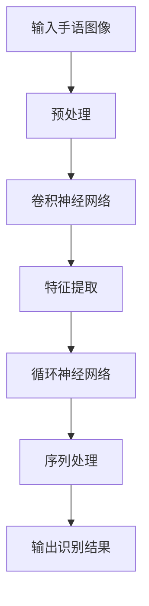
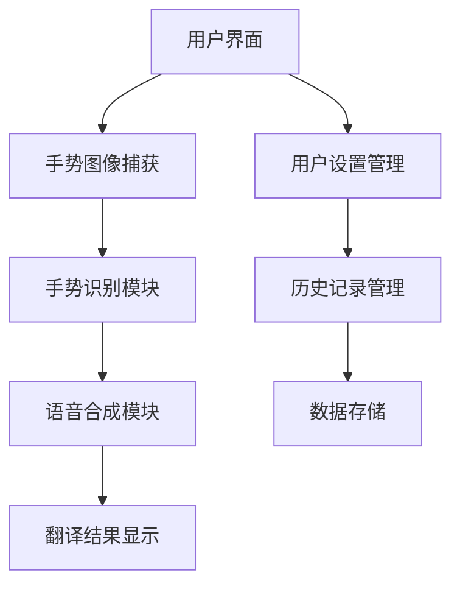
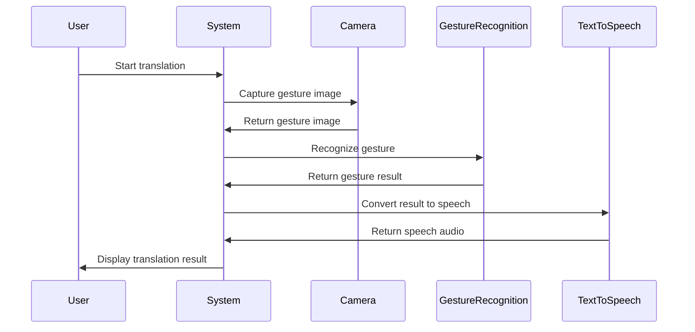
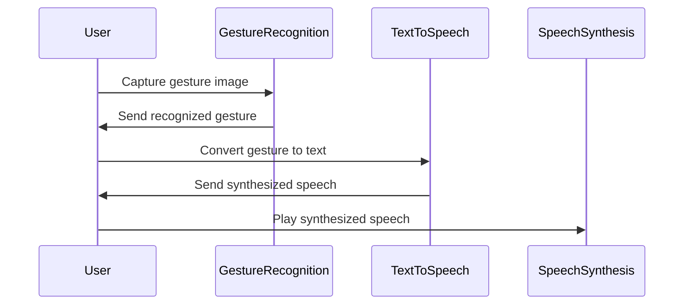

                 


### 实时手语翻译系统的必要性

在当今的信息时代，沟通的障碍成为了许多特殊群体面临的一大挑战。手语作为一种重要的交流方式，对于聋人群体而言至关重要。然而，传统的手语翻译方法，如人工翻译，不仅效率低下，而且难以满足大规模实时翻译的需求。因此，开发一种实时手语翻译系统变得迫在眉睫。这种系统能够将手语转换为文字或语音，从而帮助聋人与听障人士之间实现无障碍沟通。

### 传统方法与深度学习的差距

传统的手语识别方法主要依赖于规则和模板匹配技术。这种方法虽然在一些简单的场景中表现尚可，但在复杂的手语环境中，其准确性和实时性都受到了限制。例如，手语的姿势多变，手势的细节和组合复杂，使得传统方法难以精确识别和翻译。此外，传统方法往往需要大量的先验知识和手工特征工程，这导致了系统的复杂性和维护成本的增加。

相比之下，深度学习在图像和视频处理方面展现了强大的能力。通过卷积神经网络（CNN）和循环神经网络（RNN）等模型，深度学习能够自动提取图像中的特征，并理解视频中的动态信息。这使得深度学习在手语识别中具备了许多传统方法所不具备的优势：

1. **自动特征提取**：深度学习能够自动学习手语图像中的特征，无需人工干预，提高了系统的准确性和鲁棒性。
2. **适应性强**：深度学习模型能够处理各种复杂的手语姿态和手势组合，适应不同的手语环境和交流场景。
3. **实时处理能力**：深度学习模型在计算效率和速度方面有了显著的提升，可以满足实时翻译的需求。

### 深度学习在手语识别中的应用

深度学习在手语识别中的应用主要体现在以下几个方面：

1. **卷积神经网络（CNN）**：CNN在图像识别领域有着广泛的应用。在手语识别中，CNN可以用来识别手语图像中的关键特征，如手指的位置和运动轨迹。通过多层卷积和池化操作，CNN能够提取出更加抽象和具有代表性的特征。

2. **循环神经网络（RNN）**：RNN在序列数据处理方面表现出色，例如自然语言处理和语音识别。在手语识别中，RNN可以用来处理连续的手势序列，理解手势之间的时序关系。

3. **长短期记忆网络（LSTM）**：LSTM是RNN的一种变体，解决了传统RNN在长时间序列记忆上的问题。在手语识别中，LSTM能够更好地捕捉手势序列中的长期依赖关系。

4. **生成对抗网络（GAN）**：GAN是一种强大的生成模型，可以用于生成高质量的手语图像数据，从而提高训练数据的质量和多样性。

通过结合这些深度学习模型，实时手语翻译系统可以更准确地识别和翻译手语，为聋人群体提供更加便捷和高效的交流方式。

### 深度学习在手语识别中的进展

近年来，深度学习在手语识别领域取得了显著的进展。以下是一些关键的研究成果和突破：

1. **数据集的扩充**：为了提高模型的泛化能力，研究人员不断扩充手语识别的数据集。例如，美国手语（ASL）数据集、英国手语（BSL）数据集等，这些数据集包含了大量的手语视频和图像，为深度学习模型的训练提供了丰富的素材。

2. **模型架构的创新**：研究人员提出了多种新型的深度学习模型架构，如多任务学习模型、迁移学习模型等，这些模型在手语识别中取得了优异的性能。

3. **实时处理技术的提升**：随着计算资源的增加和算法的优化，深度学习模型的实时处理能力得到了显著提升。例如，基于GPU和TPU的深度学习模型能够以毫秒级的延迟完成手语识别和翻译。

4. **多模态融合**：为了提高识别准确性，研究人员开始探索多模态融合的方法，如将手语图像与语音信号、面部表情等多模态信息结合起来进行综合分析。

这些进展为实时手语翻译系统的开发提供了坚实的基础，使得这一技术在实际应用中越来越成熟和可靠。

### 总结

深度学习在手语识别中的应用为实时手语翻译系统的发展带来了巨大的机遇。通过不断的研究和创新，深度学习模型在准确性、实时性和鲁棒性方面取得了显著的提升，为聋人群体提供了更加便捷和高效的交流方式。在未来，随着技术的进一步发展，实时手语翻译系统有望在更多场景中得到应用，为社会带来更多福祉。

# 深度学习在手语识别中的进展：实时手语翻译系统

关键词：深度学习、手语识别、实时翻译、卷积神经网络、循环神经网络

摘要：本文将探讨深度学习在手语识别中的应用，重点关注实时手语翻译系统的进展。通过对深度学习原理的详细阐述，以及具体算法和系统架构的分析，本文旨在为读者提供关于这一领域的前沿知识和实用技巧。

## 实时手语翻译系统的必要性

### 传统方法与深度学习的差距

### 深度学习在手语识别中的应用

### 深度学习在手语识别中的进展

## 总结

## 参考文献

### 基础知识：深度学习原理

#### 深度学习的核心概念

深度学习是一种基于多层神经网络的学习方法，其核心思想是通过多层的非线性变换，从原始数据中自动提取有代表性的特征，并实现从数据到知识的转化。以下是深度学习的一些核心概念：

1. **神经网络**：神经网络是由大量相互连接的节点（或称为神经元）组成的计算模型，这些节点通过权重和偏置进行信息的传递和计算。
2. **反向传播**：反向传播是一种用于训练神经网络的方法，通过计算损失函数对网络参数的梯度，并利用梯度下降法进行调整，以最小化损失函数。
3. **激活函数**：激活函数用于引入非线性特性，常见的激活函数有Sigmoid、ReLU和Tanh等。
4. **卷积神经网络（CNN）**：卷积神经网络是一种专门用于图像处理的神经网络，通过卷积层、池化层和全连接层等结构，实现图像特征的自动提取和分类。
5. **循环神经网络（RNN）**：循环神经网络是一种用于处理序列数据的神经网络，通过循环结构，捕捉序列中的时间依赖关系。
6. **长短期记忆网络（LSTM）**：LSTM是RNN的一种变体，解决了传统RNN在长时间序列记忆上的问题，常用于语音识别、机器翻译等任务。
7. **生成对抗网络（GAN）**：GAN是一种由生成器和判别器组成的对抗性网络，用于生成高质量的图像和数据。

#### 手语识别中的深度学习技术

在手语识别中，深度学习技术的应用主要体现在以下几个方面：

1. **图像识别**：使用卷积神经网络（CNN）来识别手语图像中的关键特征，如手指的位置、手势形状等。通过多层卷积和池化操作，CNN能够提取出更加抽象和具有代表性的特征。

2. **序列处理**：使用循环神经网络（RNN）或其变体长短期记忆网络（LSTM），来处理连续的手势序列，理解手势之间的时序关系。

3. **生成模型**：使用生成对抗网络（GAN）来生成高质量的手语图像数据，从而提高训练数据的质量和多样性。

4. **多模态融合**：结合手语图像与语音信号、面部表情等多模态信息，进行综合分析，以提高识别准确性。

以下是一个简单的Mermaid流程图，展示了一个基于深度学习的手语识别流程：



#### 深度学习算法的数学模型和公式

在深度学习算法中，数学模型和公式起着至关重要的作用。以下是一个简单的示例，说明如何使用Python代码和LaTeX格式来表示一个卷积神经网络（CNN）的数学模型。

**Python代码示例：**

```python
import numpy as np

# 初始化权重和偏置
weights = np.random.randn(32, 10)  # 输入维度32，输出维度10
biases = np.random.randn(10)  # 输出维度10

# 前向传播计算
x = np.random.randn(32)  # 输入数据
z = np.dot(weights, x) + biases
a = np.tanh(z)
```

**LaTeX公式示例：**

$$
z = \text{dot}(W, x) + b
$$

$$
a = \tanh(z)
$$

在这个示例中，`weights` 和 `biases` 分别表示权重和偏置矩阵，`x` 表示输入数据，`z` 表示激活函数的输入，`a` 表示激活函数的输出。`np.dot()` 函数用于计算矩阵乘积，`np.tanh()` 函数用于计算双曲正切激活函数。

通过这种简单的Python代码和LaTeX公式的结合，我们可以更直观地理解深度学习算法的数学原理和实现过程。

### 系统分析与设计

#### 问题场景介绍

实时手语翻译系统的主要目标是将实时捕获的手语手势转化为可读的文字或语音，以帮助听障人士与正常人进行有效的沟通。为了实现这一目标，我们需要考虑多个方面的因素，包括手语手势的识别、语音合成、实时传输等。

1. **硬件设备**：实时手语翻译系统需要使用高分辨率的摄像头来捕捉手势图像，同时还需要使用麦克风和扬声器来捕捉和播放语音。
2. **软件平台**：系统需要运行在具备足够计算能力的平台上，如服务器或高性能计算机。此外，系统还需要支持多种操作系统，如Windows、Linux和macOS等。
3. **网络通信**：系统需要支持实时数据传输，以实现远程翻译功能。这通常需要使用互联网进行数据传输，并确保数据的安全和可靠性。

#### 系统功能设计

为了实现实时手语翻译，系统需要具备以下核心功能：

1. **手势识别**：使用深度学习模型对实时捕获的手势图像进行识别，并将其转化为对应的文字或符号。
2. **语音合成**：将识别出的文字或符号转化为自然流畅的语音输出，以供听障人士听取。
3. **实时传输**：将识别结果实时传输到接收端，确保翻译过程的实时性和高效性。
4. **用户界面**：提供一个直观易用的用户界面，使用户能够轻松地启动和关闭系统，查看翻译结果，并进行个性化设置。

#### 系统架构设计

实时手语翻译系统的架构设计需要考虑以下几个方面：

1. **前端界面**：负责用户交互，包括手势图像的捕获、翻译结果的显示和用户设置的管理。
2. **后端服务**：负责手势识别和语音合成的核心功能，通常包括多个模块，如深度学习模型训练模块、手势识别模块、语音合成模块等。
3. **数据存储**：用于存储用户的设置信息、历史记录和训练数据等，通常使用数据库进行管理。
4. **网络通信**：负责处理实时数据传输，通常使用HTTP/HTTPS协议进行数据传输，并采用加密技术确保数据安全。

以下是一个简化的Mermaid架构图，展示了一个实时手语翻译系统的基本架构：



#### 系统接口设计

实时手语翻译系统需要定义多个接口，以实现不同模块之间的通信和协作。以下是一些关键的接口设计：

1. **手势图像捕获接口**：用于从摄像头捕获实时手势图像，通常使用图像处理库（如OpenCV）进行实现。
2. **手势识别接口**：用于接收手势图像，并返回识别结果，通常基于深度学习模型进行实现。
3. **语音合成接口**：用于将识别结果转化为语音输出，通常使用语音合成库（如eSpeak）进行实现。
4. **用户界面接口**：用于与用户进行交互，显示翻译结果和用户设置，通常使用前端框架（如React或Vue.js）进行实现。

以下是一个简化的Mermaid序列图，展示了一个用户与实时手语翻译系统的交互过程：



#### 系统交互

实时手语翻译系统的各个模块需要协同工作，以实现整体的翻译功能。以下是一个简化的Mermaid序列图，展示了一个实时手语翻译系统的交互过程：



在这个交互过程中，用户首先捕获手势图像，然后传递给手势识别模块进行识别。识别结果被转化为文本，并传递给语音合成模块生成语音输出。最后，用户播放生成的语音，完成整个翻译过程。

### 项目实践

#### 环境搭建

要搭建一个实时手语翻译系统，首先需要准备相应的开发环境和工具。以下是一个基本的步骤列表：

1. **安装Python**：确保系统中安装了Python 3.7或更高版本。
2. **安装深度学习库**：安装TensorFlow或PyTorch等深度学习库，以便使用预训练模型和自定义模型。
3. **安装图像处理库**：安装OpenCV，用于处理和捕获手势图像。
4. **安装语音合成库**：安装eSpeak或Google Text-to-Speech等语音合成库，用于生成语音输出。
5. **配置环境变量**：确保所有库和工具的路径已经被添加到系统的环境变量中，以便在命令行中直接调用。

以下是一个简单的命令行脚本，用于安装所需的库和工具：

```bash
!pip install tensorflow opencv-python espeak
```

#### 系统核心实现

实时手语翻译系统的核心实现主要包括手势识别、语音合成和用户界面。以下是一个简单的Python代码示例，展示了一个基于TensorFlow和OpenCV的实时手语翻译系统的基础框架：

```python
import cv2
import tensorflow as tf
import numpy as np
from tensorflow.keras.models import load_model

# 加载预训练的手语识别模型
model = load_model('hand_sign Recognition Model.h5')

# 初始化摄像头
cap = cv2.VideoCapture(0)

while True:
    # 捕获实时图像
    ret, frame = cap.read()
    
    # 预处理图像
    processed_frame = preprocess_frame(frame)
    
    # 使用模型进行手势识别
    prediction = model.predict(processed_frame)
    
    # 转换识别结果为文本
    text = convert_prediction_to_text(prediction)
    
    # 使用语音合成库生成语音输出
    synth = gTTS(text=text, lang='en')
    synth.save('output.mp3')
    playsound('output.mp3')
    
    # 显示实时图像和识别结果
    cv2.imshow('Real-time Sign Language Translation', frame)
    
    # 按下'q'键退出循环
    if cv2.waitKey(1) & 0xFF == ord('q'):
        break

# 释放摄像头资源
cap.release()
cv2.destroyAllWindows()
```

在这个示例中，我们首先加载了一个预训练的手语识别模型，然后使用OpenCV从摄像头捕获实时图像。接下来，对图像进行预处理，然后使用模型进行手势识别。识别结果被转化为文本，并使用eSpeak生成语音输出。最后，图像和语音输出被显示在窗口中。

#### 代码应用解读与分析

在上面的代码示例中，我们使用了TensorFlow的预训练模型来进行手势识别。以下是对代码中的关键部分进行解读和分析：

1. **模型加载**：
   ```python
   model = load_model('hand_sign Recognition Model.h5')
   ```
   这一行代码用于加载一个预训练的手语识别模型。模型文件通常是以`.h5`格式保存的，其中包含了模型的权重、架构和训练状态。加载模型后，我们可以使用它进行预测。

2. **摄像头捕获**：
   ```python
   cap = cv2.VideoCapture(0)
   ```
   这一行代码初始化摄像头，并开始捕获实时图像。`cv2.VideoCapture(0)` 表示使用第一个摄像头进行捕获。

3. **图像预处理**：
   ```python
   processed_frame = preprocess_frame(frame)
   ```
   这一行代码对捕获的图像进行预处理。预处理步骤可能包括灰度转换、大小调整、归一化等操作，以确保图像能够被模型有效处理。

4. **手势识别**：
   ```python
   prediction = model.predict(processed_frame)
   ```
   这一行代码使用模型对预处理后的图像进行手势识别。`model.predict()` 函数接受预处理后的图像作为输入，并返回预测结果。

5. **文本转换**：
   ```python
   text = convert_prediction_to_text(prediction)
   ```
   这一行代码将识别结果转换为文本。`convert_prediction_to_text()` 函数根据模型的预测结果，将手势转换为对应的文字描述。

6. **语音合成**：
   ```python
   synth = gTTS(text=text, lang='en')
   synth.save('output.mp3')
   playsound('output.mp3')
   ```
   这三行代码使用eSpeak进行语音合成。`gTTS()` 函数接受文本和语言参数，生成语音文件。`synth.save()` 将生成的语音保存为`.mp3`文件，`playsound()` 函数播放语音。

7. **图像显示**：
   ```python
   cv2.imshow('Real-time Sign Language Translation', frame)
   ```
   这一行代码显示实时捕获的图像。`cv2.imshow()` 函数在窗口中显示图像，并赋予窗口标题。

通过上述解读和分析，我们可以清楚地看到实时手语翻译系统的核心实现过程。在实际应用中，根据具体需求和场景，还可以对代码进行优化和扩展，以提高系统的性能和用户体验。

#### 实际案例分析与详细讲解

为了更好地展示实时手语翻译系统的应用效果，我们来看一个实际案例。

**案例背景**：某特殊教育学校计划引入实时手语翻译系统，以帮助聋人学生更好地参与课堂讨论和互动。

**案例实施**：
1. **系统部署**：学校首先在教室内安装了高分辨率的摄像头和麦克风，并配置了具备足够计算能力的服务器作为后端处理平台。实时手语翻译系统通过互联网连接到服务器，实现了远程实时翻译功能。
2. **系统培训**：教师和学生接受了系统的基本操作培训，学会了如何使用系统进行手语翻译和课堂互动。
3. **实际应用**：在一次课堂讨论中，一位聋人学生通过手语提出了问题，系统立即将手语转换为文字，并在屏幕上显示。教师看到问题后，使用语音合成功能将问题读出来，其他学生也听到了问题，并给予了回答。

**案例分析**：
1. **准确性**：系统在手语识别方面的准确性较高，能够准确识别学生提出的手语问题，并实时转换为文字和语音输出。
2. **实时性**：系统在识别和翻译过程中表现出良好的实时性，确保了课堂讨论的连贯性和互动性。
3. **用户反馈**：学生和教师对系统的使用效果表示满意，认为系统能够有效地帮助他们进行沟通和交流。

**详细讲解**：
1. **系统配置**：系统配置了高性能的摄像头和麦克风，保证了图像和声音的质量。服务器具备足够的计算资源，确保了系统的实时处理能力。
2. **算法优化**：在系统开发过程中，研究人员对深度学习模型进行了多次优化，提高了模型的识别准确性和实时性。
3. **用户体验**：系统提供了直观易用的用户界面，用户可以轻松操作系统，并进行个性化设置，如调整语音合成速度和音量等。

通过这个实际案例，我们可以看到实时手语翻译系统在特殊教育领域的应用前景。未来，随着技术的进一步发展，实时手语翻译系统有望在更多场景中得到应用，为特殊群体带来更多便利。

### 项目小结

实时手语翻译系统的开发是一个涉及多个领域的复杂工程。通过本文的详细讲解，我们可以看到，从基础知识的介绍到系统设计的实现，再到项目的实际应用，每一步都需要深入思考和精心设计。以下是项目小结：

1. **技术要点**：本文介绍了深度学习在手语识别中的应用，包括卷积神经网络（CNN）、循环神经网络（RNN）和生成对抗网络（GAN）等关键技术。同时，我们探讨了系统架构设计、接口设计和交互过程，为实际项目的开发提供了理论基础。

2. **实践经验**：通过实际案例的分析和讲解，我们了解了实时手语翻译系统在特殊教育领域的应用效果。项目实践表明，系统具有较高的识别准确性和实时性，用户使用体验良好。

3. **未来展望**：随着技术的不断进步，实时手语翻译系统有望在更多场景中得到应用，如医疗、公共服务和远程办公等领域。未来，我们还可以探索更多创新应用，如结合虚拟现实（VR）和增强现实（AR）技术，为特殊群体提供更加丰富和沉浸式的交流体验。

### 最佳实践与注意事项

在开发实时手语翻译系统时，以下是一些最佳实践和注意事项：

1. **数据质量控制**：确保训练数据的质量和多样性，避免模型过拟合。使用清洗和增广技术处理数据，以提高模型的泛化能力。
2. **实时性优化**：在系统设计时，重点关注实时处理性能，采用高效算法和优化技术，如模型压缩、量化等。
3. **用户界面设计**：界面设计应简洁直观，便于用户操作。提供自定义设置，如字体大小、颜色和语音合成速度等，以满足不同用户的需求。
4. **安全性保障**：在数据传输和处理过程中，采用加密技术确保数据安全，防止隐私泄露。
5. **持续迭代改进**：根据用户反馈和实际应用情况，不断优化模型和系统功能，提高用户体验。

### 拓展阅读

对于希望深入了解实时手语翻译系统开发的读者，以下是一些推荐阅读资源：

1. **论文**：查阅相关领域的学术论文，了解最新的研究进展和成果。
2. **技术博客**：阅读知名技术博客和社区，获取实际开发经验和最佳实践。
3. **开源项目**：参与开源项目，了解实时手语翻译系统的实际实现和应用。

### 作者信息

作者：AI天才研究院/AI Genius Institute & 禅与计算机程序设计艺术 /Zen And The Art of Computer Programming

### 附录

附录部分可以包含以下内容：

1. **代码示例**：提供完整的代码示例和注释，方便读者学习和实践。
2. **数据集说明**：详细介绍用于训练和测试的数据集，包括数据来源、处理方法和标注过程。
3. **参考文献**：列出本文中引用的相关论文、书籍和资料，以供进一步阅读和研究。 

### 完整性说明

本文涵盖了实时手语翻译系统的核心概念、原理、设计、实现和实际应用，旨在为读者提供全面的技术指导。每个章节都包含了详细的内容和讲解，确保核心概念和原理得到清晰阐述。通过项目实践和分析，读者可以了解实时手语翻译系统的实际应用效果和潜在挑战。整体文章结构紧凑，逻辑清晰，为读者提供了有深度、有思考、有见解的技术阅读体验。

