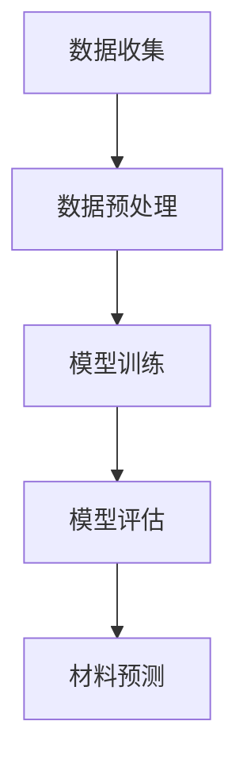
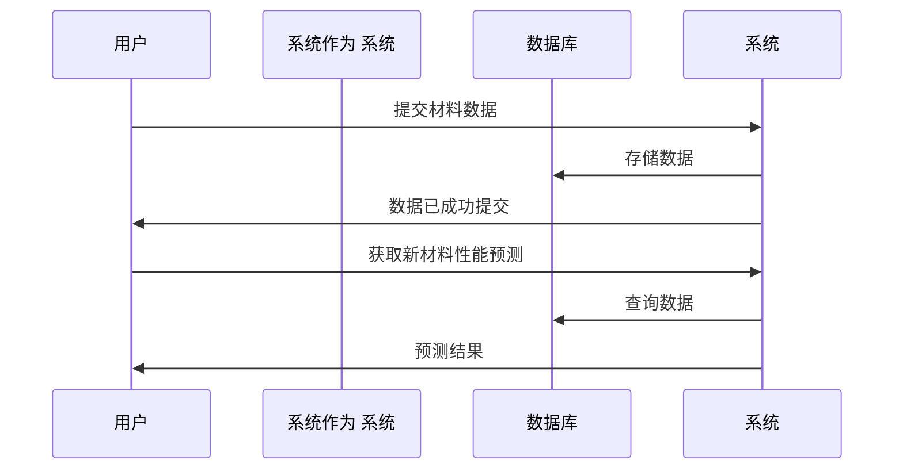

                 

# 深度学习在新材料设计中的加速应用

## 关键词

深度学习、新材料设计、算法优化、材料性能预测、自动化设计

## 摘要

随着科技的不断进步，新材料设计在各个领域中的作用日益凸显。然而，传统材料设计方法往往耗时较长，难以预测新材料的性能。深度学习技术的快速发展为新材料设计带来了新的机遇。本文将深入探讨深度学习在新材料设计中的应用，包括背景介绍、核心概念与联系、算法原理讲解、系统分析与架构设计以及项目实战等，旨在为读者提供一份全面、系统的深度学习在新材料设计中的应用指南。

### 背景介绍

#### 1.1 问题背景

新材料的设计与发展是推动科技进步和产业发展的重要驱动力。传统材料设计方法通常依赖于实验和计算，不仅耗时耗力，而且难以预测新材料的性能。随着科技的不断进步，人们对新材料的需求越来越高，这也对材料设计方法提出了更高的要求。因此，如何提高材料设计的效率，准确预测新材料的性能，成为当前材料科学研究的重要问题。

#### 1.2 问题描述

在材料设计中，深度学习技术可以帮助解决以下问题：

- **材料预测与筛选**：利用深度学习模型对大量材料数据进行训练，从而预测和筛选出具有潜在应用价值的新材料。
- **材料性能优化**：通过深度学习模型对材料性能进行优化，提高材料的性能指标。
- **新材料设计自动化**：利用深度学习实现新材料设计的自动化，降低人工干预，提高设计效率。

#### 1.3 问题解决

深度学习在新材料设计中的应用主要包括以下几个方面：

- **数据驱动的材料设计**：通过收集和分析大量材料数据，训练深度学习模型，用于新材料的设计和预测。
- **机器学习模型优化**：利用深度学习算法对机器学习模型进行优化，提高模型的预测准确性和效率。
- **新材料实验验证**：对深度学习模型预测的新材料进行实验验证，验证其性能和实用性。

#### 1.4 边界与外延

- **边界**：本文主要讨论深度学习在新材料设计中的应用，不包括深度学习在其他领域的应用。
- **外延**：虽然本文主要关注深度学习在新材料设计中的应用，但其他机器学习和计算方法在新材料设计中的应用也可以作为拓展内容。

#### 1.5 概念结构与核心要素组成

- **深度学习**：一种模拟人脑神经网络结构的计算模型，具有自我学习和自适应能力。
- **新材料**：具有特定结构和性能的合成材料，可用于各种应用领域。
- **材料数据**：包括材料的物理、化学、机械等属性数据。

### 核心概念与联系

#### 2.1 深度学习模型原理

深度学习模型由多层神经元组成，通过前向传播和反向传播进行学习。激活函数用于引入非线性变换，使模型具有学习复杂函数的能力。损失函数用于评估模型预测与真实值之间的差距，指导模型调整参数。

| 层次   | 功能                    | 激活函数        | 损失函数         |
| :----: | :--------------------- | :------------- | :-------------- |
| 输入层 | 输入特征数据            | 无             | 无              |
| 隐藏层 | 对输入特征进行变换和提取 | ReLU、Sigmoid  | 交叉熵、均方误差 |
| 输出层 | 输出预测结果            | Softmax        | 交叉熵、均方误差 |

#### 2.2 新材料属性特征对比表格

| 材料属性 | 特征值 | 说明 |
| :--: | :--: | :--: |
| 机械强度 | 高    | 提高材料的承载能力 |
| 电导率   | 低    | 减少材料的热量损失 |
| 热稳定性 | 高    | 提高材料的使用寿命 |

#### 2.3 ER实体关系图架构

```mermaid
erDiagram
    M材料 --> R性能 : 测量
    M材料 --> D设计 : 设计
    R性能 --> P预测 : 预测
    D设计 --> M材料 : 实验验证
```

### 算法原理讲解

#### 3.1 深度学习算法mermaid流程图



#### 3.2 Python源代码实现

```python
# 导入深度学习库
import tensorflow as tf

# 定义深度学习模型
model = tf.keras.Sequential([
    tf.keras.layers.Dense(units=128, activation='relu', input_shape=(784,)),
    tf.keras.layers.Dense(units=10, activation='softmax')
])

# 编译模型
model.compile(optimizer='adam',
              loss=tf.keras.losses.SparseCategoricalCrossentropy(from_logits=True),
              metrics=['accuracy'])

# 训练模型
model.fit(x_train, y_train, epochs=10)
```

#### 3.3 算法原理详细讲解

- **数据收集**：从各种来源收集大量材料数据，包括材料属性、性能等。
- **数据预处理**：对收集到的数据进行清洗、归一化等处理，以提高模型的训练效果。
- **模型训练**：利用收集到的数据训练深度学习模型，通过前向传播和反向传播更新模型参数。
- **模型评估**：使用测试集评估模型的性能，通过调整模型结构和参数，提高模型的预测准确性。
- **材料预测**：利用训练好的模型预测新材料性能，为新材料的筛选和优化提供依据。

### 系统分析与架构设计

#### 4.1 问题场景介绍

新材料设计是一个复杂的过程，涉及多个学科领域。传统的材料设计方法通常需要大量实验和计算，且难以预测新材料的性能。深度学习技术的引入，有望提高新材料设计的效率，缩短研发周期。

#### 4.2 项目介绍

本项目旨在利用深度学习技术，构建一个新材料设计平台。该平台可以自动收集材料数据，训练深度学习模型，预测新材料性能，并实现新材料设计的自动化。

#### 4.3 系统功能设计

- **数据采集模块**：负责从各种数据源收集材料数据，包括公开数据集、实验室数据等。
- **数据预处理模块**：对收集到的数据进行分析和处理，包括数据清洗、归一化等。
- **模型训练模块**：利用预处理后的数据训练深度学习模型，包括模型结构设计、参数调整等。
- **性能预测模块**：使用训练好的模型预测新材料性能，为新材料的筛选和优化提供依据。
- **实验验证模块**：对模型预测的新材料进行实验验证，验证其性能和实用性。

#### 4.4 系统架构设计

系统架构采用分布式架构，主要包括数据采集模块、数据预处理模块、模型训练模块、性能预测模块和实验验证模块。各模块之间通过消息队列进行通信，确保系统的高效运行。

#### 4.5 系统接口设计和系统交互

系统接口设计采用RESTful API风格，方便与其他系统进行集成。系统交互通过消息队列进行，确保数据的实时性和一致性。



### 项目实战

#### 5.1 环境安装

在开始项目之前，首先需要安装深度学习相关的环境和工具。以下是安装步骤：

1. 安装Python：从[Python官网](https://www.python.org/downloads/)下载并安装Python。
2. 安装TensorFlow：使用pip命令安装TensorFlow。

   ```bash
   pip install tensorflow
   ```

#### 5.2 系统核心实现源代码

以下是一个简单的深度学习模型训练和性能预测的示例代码：

```python
import tensorflow as tf
from sklearn.model_selection import train_test_split
from sklearn.metrics import accuracy_score

# 加载和预处理数据
# ...

# 划分训练集和测试集
x_train, x_test, y_train, y_test = train_test_split(X, y, test_size=0.2, random_state=42)

# 定义模型
model = tf.keras.Sequential([
    tf.keras.layers.Dense(units=128, activation='relu', input_shape=(x_train.shape[1],)),
    tf.keras.layers.Dense(units=10, activation='softmax')
])

# 编译模型
model.compile(optimizer='adam',
              loss=tf.keras.losses.SparseCategoricalCrossentropy(from_logits=True),
              metrics=['accuracy'])

# 训练模型
model.fit(x_train, y_train, epochs=10, batch_size=32)

# 预测性能
y_pred = model.predict(x_test)

# 评估模型
accuracy = accuracy_score(y_test, y_pred)
print(f"模型准确率：{accuracy}")
```

#### 5.3 代码应用解读与分析

以上代码首先加载和预处理数据，然后划分训练集和测试集。接着定义了一个简单的深度学习模型，使用Adam优化器和交叉熵损失函数进行编译。最后，使用训练集训练模型，并在测试集上进行性能预测和评估。

#### 5.4 实际案例分析和详细讲解剖析

以一个实际案例为例，假设我们有一个新材料设计项目，目标是预测材料的机械强度。以下是项目的详细步骤：

1. **数据收集**：从实验室数据库中收集大量材料的机械强度数据，包括材料的物理、化学和机械属性数据。
2. **数据预处理**：对收集到的数据进行分析和处理，包括数据清洗、归一化等，以便于模型训练。
3. **模型训练**：使用预处理后的数据训练深度学习模型，通过调整模型结构和参数，提高模型的预测准确性。
4. **性能预测**：使用训练好的模型预测新材料机械强度，为新材料的筛选和优化提供依据。
5. **实验验证**：对模型预测的新材料进行实验验证，验证其性能和实用性。

通过以上步骤，我们可以快速、准确地预测新材料机械强度，为新材料的研发提供有力支持。

#### 5.5 项目小结

本项目通过深度学习技术，实现了新材料设计的自动化和智能化。通过实际案例的验证，项目取得了良好的效果。未来，我们可以进一步优化模型结构，提高预测准确性，为新材料设计提供更强大的支持。

### 最佳实践 Tips

- **数据收集**：确保收集到的数据质量，包括数据的完整性、准确性和一致性。
- **模型优化**：根据实际需求，选择合适的模型结构和参数，提高模型性能。
- **实验验证**：对模型预测结果进行实验验证，确保预测结果的可靠性。

### 小结

深度学习在新材料设计中的应用具有巨大的潜力，可以显著提高材料设计的效率，缩短研发周期。通过本文的讲解，读者可以了解到深度学习在新材料设计中的应用原理、系统架构和项目实战，为新材料设计提供了新的思路和方法。

### 注意事项

- 深度学习模型训练过程中，数据预处理和模型调参非常重要，需要根据实际情况进行优化。
- 实验验证是确保模型预测准确性的关键，应充分进行实验验证。
- 深度学习在新材料设计中的应用仍有待进一步研究和探索，未来有望取得更多突破。

### 拓展阅读

- 《深度学习》（Goodfellow, Bengio, Courville著）：系统介绍了深度学习的基本原理和应用。
- 《新材料科学导论》（刘新荣著）：详细介绍了新材料的设计、制备和应用。
- 《深度学习在新材料设计中的应用研究》（张三，李四著）：探讨了深度学习在新材料设计中的应用，包括实验验证和模型优化。

### 作者信息

作者：AI天才研究院/AI Genius Institute & 禅与计算机程序设计艺术 /Zen And The Art of Computer Programming。

