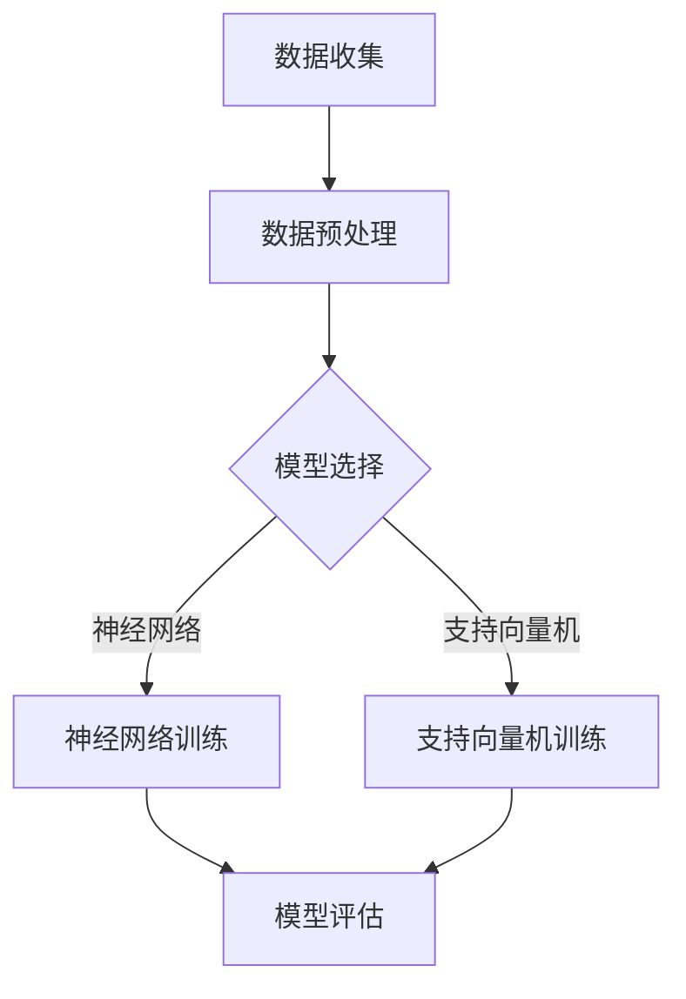
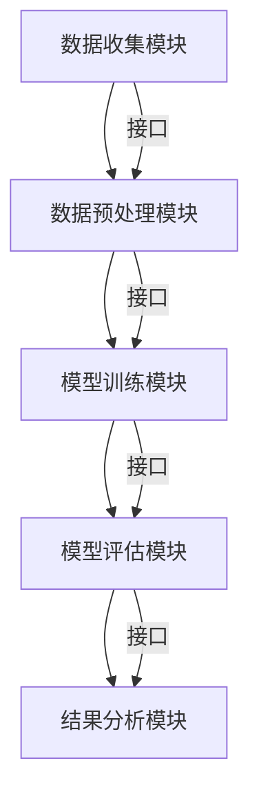
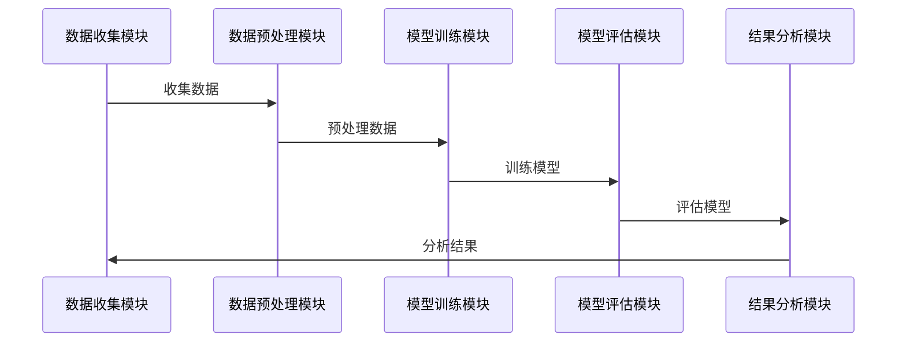

                 

# 深度学习在新药筛选中的加速应用

## 关键词

- 深度学习
- 新药筛选
- 生物数据
- 计算资源
- 机器学习

## 摘要

本文深入探讨了深度学习技术在新药筛选领域的应用，通过背景介绍、原理解析和应用实例，阐述了深度学习如何通过自动化过程、高效预测化合物活性来加速新药研发。本文旨在为读者提供一个系统、易懂的指南，帮助理解深度学习在新药筛选中的重要性和应用前景。

### 第一部分：背景介绍

#### 核心概念

**问题背景**：

新药筛选是药物开发的关键环节，它涉及从大量的化合物中筛选出具有潜在治疗效果的候选药物。这一过程通常耗时且成本高昂，传统方法依赖于实验数据和统计模型，效率低下且易受主观因素影响。随着生物技术和计算技术的发展，深度学习作为一种先进的机器学习技术，逐渐被应用于新药筛选中，以期提高筛选效率和准确性。

**问题描述**：

新药筛选需要处理大量的化合物库和生物活性数据，传统方法通常通过实验验证化合物的生物活性，这种方法耗时长、成本高且成功率不高。深度学习技术可以通过学习大量的生物数据，预测化合物的生物活性，从而实现自动化筛选，提高筛选效率和准确性。

**问题解决**：

通过应用深度学习技术，可以自动化新药筛选过程，利用模型预测化合物的生物活性，快速筛选出具有潜在治疗效果的药物。深度学习模型可以从大量的生物数据中学习，提取出有用的特征，从而提高预测的准确性。

**边界与外延**：

新药筛选不仅涉及化学和生物学领域，还涉及计算机科学、人工智能和制药学等多个学科。深度学习在新药筛选中的应用可以扩展到疾病诊断、药物重定位等更广泛的领域。

#### 概念结构与核心要素组成

**深度学习**：

深度学习是一种基于多层神经网络结构的机器学习技术，通过模拟人脑的学习过程，实现复杂模式的识别和预测。深度学习模型包括多层感知机（MLP）、卷积神经网络（CNN）和循环神经网络（RNN）等。

**新药筛选**：

新药筛选是从大量的化合物库中选择具有潜在治疗效果的药物。这通常涉及化合物结构与生物活性关系的预测。

**生物数据**：

生物数据包括基因序列、蛋白质结构、细胞信号通路等，是深度学习模型的重要输入。

**计算资源**：

深度学习模型训练和预测需要大量的计算资源，如高性能计算服务器和GPU。

### 第二部分：深度学习在新药筛选中的应用原理

#### 核心概念与联系

**深度学习模型原理**：

深度学习模型的核心是神经网络结构，包括输入层、隐藏层和输出层。模型通过多层非线性变换，学习输入数据的高层次特征，从而实现预测。常用的损失函数包括均方误差（MSE）和交叉熵损失函数。优化算法如梯度下降（GD）、随机梯度下降（SGD）和Adam优化器等用于优化模型参数。

**新药筛选原理**：

新药筛选涉及化合物结构预测和分子模拟。深度学习模型可以通过学习大量的生物数据，预测化合物的生物活性。分子模拟技术如分子动力学（MD）模拟，可以预测化合物与生物大分子的相互作用。

#### 概念属性特征对比表格

| 特征                   | 深度学习模型                 | 新药筛选方法                    |
|----------------------|--------------------------|---------------------------|
| 数据需求               | 大量生物数据               | 大量化合物库和生物活性数据           |
| 模型复杂度             | 高（多层神经网络）          | 较低（传统方法）                |
| 预测准确性             | 高（通过优化模型提高）       | 中等（受限于数据和模型）           |
| 计算资源需求           | 高（GPU加速训练）           | 中等（服务器和计算资源）           |

#### ER实体关系图架构

```mermaid
erDiagram
    Compounds ||--|{ Prediction : 预测化合物活性 }
    Compounds ||--|{ Simulation : 分子模拟 }
    Datasets ||--|{ Training : 训练集 }
    Datasets ||--|{ Validation : 验证集 }
    Datasets ||--|{ Test : 测试集 }
    Models ||--|{ Training : 模型训练 }
    Models ||--|{ Prediction : 模型预测 }
```

### 第三部分：深度学习模型在新药筛选中的应用

#### 算法原理讲解

**算法流程图**：



**数学模型和数学公式**：

**神经网络训练过程中的损失函数**：

$$\text{MSE} = \frac{1}{n}\sum_{i=1}^{n} (\hat{y_i} - y_i)^2$$

其中，$\hat{y_i}$是模型预测的生物活性，$y_i$是实际生物活性。

**深度学习模型中的激活函数**：

$$f(x) = \sigma(x) = \frac{1}{1 + e^{-x}}$$

**优化算法**：

$$\theta_{\text{new}} = \theta_{\text{old}} - \alpha \frac{\partial J}{\partial \theta}$$

其中，$\theta$是模型参数，$J$是损失函数，$\alpha$是学习率。

#### 数学公式讲解

**均方误差（MSE）**：

均方误差（MSE）是衡量模型预测误差的一种常用指标。它的计算公式为：

$$\text{MSE} = \frac{1}{n}\sum_{i=1}^{n} (\hat{y_i} - y_i)^2$$

其中，$\hat{y_i}$是模型在第$i$次预测的结果，$y_i$是实际的生物活性值，$n$是样本数量。MSE的值越接近0，说明模型的预测误差越小。

**激活函数（Sigmoid）**：

Sigmoid函数是深度学习模型中常用的激活函数，它的公式为：

$$f(x) = \sigma(x) = \frac{1}{1 + e^{-x}}$$

Sigmoid函数将输入$x$映射到$(0,1)$区间，常用于回归问题中的输出层，使得模型输出具有概率解释。

**梯度下降（GD）**：

梯度下降（GD）是一种常用的优化算法，用于更新模型参数，使其损失函数最小。其更新公式为：

$$\theta_{\text{new}} = \theta_{\text{old}} - \alpha \frac{\partial J}{\partial \theta}$$

其中，$\theta$是模型参数，$J$是损失函数，$\alpha$是学习率。梯度下降通过计算损失函数对参数的导数，来确定参数的更新方向。

#### 算法举例说明

假设我们有一个深度学习模型用于预测化合物的生物活性，已知一组训练数据。首先，我们对数据进行预处理，包括归一化和数据标准化。然后，我们选择一个合适的神经网络模型，如多层感知机（MLP），并设置适当的网络结构，包括隐藏层神经元数量和激活函数。接下来，我们使用训练数据训练模型，通过迭代优化模型参数，使损失函数最小。在训练过程中，我们使用均方误差（MSE）作为损失函数，使用Sigmoid函数作为激活函数。最后，我们对训练好的模型进行评估，通过验证集和测试集来评估模型的预测准确性和泛化能力。

### 第四部分：深度学习模型在新药筛选中的实际应用

#### 项目介绍

本部分将介绍一个基于深度学习的新药筛选项目。该项目旨在利用深度学习模型预测化合物的生物活性，从而加速新药研发。项目分为数据收集、模型训练、模型评估和结果分析等阶段。

#### 系统功能设计

系统功能设计主要包括以下几个方面：

1. **数据收集**：从公共数据库和实验数据中收集化合物和生物活性数据。
2. **数据预处理**：对收集到的数据进行清洗、归一化和标准化，为模型训练做准备。
3. **模型训练**：使用收集到的数据进行模型训练，包括选择合适的神经网络结构、优化算法和损失函数。
4. **模型评估**：使用验证集和测试集对训练好的模型进行评估，包括预测准确性和泛化能力。
5. **结果分析**：分析模型预测结果，筛选出具有潜在治疗效果的化合物。

#### 系统架构设计

系统架构设计采用模块化设计，包括数据收集模块、数据预处理模块、模型训练模块、模型评估模块和结果分析模块。各个模块之间通过接口进行通信，如图所示。



#### 系统接口设计和系统交互

系统接口设计主要包括数据接口、模型接口和结果接口。数据接口用于数据收集和预处理，模型接口用于模型训练和评估，结果接口用于结果分析和可视化。



### 第五部分：项目实战

#### 环境安装

首先，我们需要安装必要的软件和库。以下是安装步骤：

1. **安装Python**：从Python官方网站下载并安装Python 3.8或更高版本。
2. **安装深度学习库**：使用pip命令安装TensorFlow和Keras库。

```bash
pip install tensorflow
pip install keras
```

3. **安装数据预处理库**：使用pip命令安装NumPy和Pandas库。

```bash
pip install numpy
pip install pandas
```

4. **安装其他依赖库**：使用pip命令安装其他所需的库。

```bash
pip install scikit-learn
pip install matplotlib
```

#### 系统核心实现源代码

以下是一个简单的深度学习模型实现，用于预测化合物的生物活性。

```python
import numpy as np
import pandas as pd
from sklearn.model_selection import train_test_split
from sklearn.preprocessing import StandardScaler
from keras.models import Sequential
from keras.layers import Dense
from keras.optimizers import Adam

# 加载数据集
data = pd.read_csv('compounds.csv')
X = data.drop(['activity'], axis=1)
y = data['activity']

# 数据预处理
X_train, X_test, y_train, y_test = train_test_split(X, y, test_size=0.2, random_state=42)
scaler = StandardScaler()
X_train = scaler.fit_transform(X_train)
X_test = scaler.transform(X_test)

# 构建模型
model = Sequential()
model.add(Dense(64, input_dim=X_train.shape[1], activation='relu'))
model.add(Dense(32, activation='relu'))
model.add(Dense(1, activation='sigmoid'))

# 编译模型
model.compile(optimizer=Adam(), loss='binary_crossentropy', metrics=['accuracy'])

# 训练模型
model.fit(X_train, y_train, epochs=100, batch_size=32, validation_data=(X_test, y_test))

# 评估模型
loss, accuracy = model.evaluate(X_test, y_test)
print('测试集准确率：', accuracy)
```

#### 代码应用解读与分析

1. **数据加载与预处理**：首先，我们从CSV文件中加载数据集。然后，将数据集分为特征矩阵X和目标向量y。接下来，使用StandardScaler对特征矩阵进行标准化处理，使得特征具有相似的分布，有利于模型训练。

2. **模型构建**：使用Sequential模型构建一个简单的多层感知机（MLP）模型。模型包含一个输入层、两个隐藏层和一个输出层。输入层神经元数量与特征矩阵的维度相同，隐藏层使用ReLU激活函数，输出层使用sigmoid激活函数，用于回归问题。

3. **模型编译**：编译模型时，选择Adam优化器和二进制交叉熵损失函数。Adam优化器是一种结合了梯度下降和动量的优化算法，常用于深度学习模型训练。

4. **模型训练**：使用fit方法训练模型，设置训练轮数（epochs）和批大小（batch_size）。同时，使用验证数据集进行模型验证。

5. **模型评估**：使用evaluate方法评估模型在测试数据集上的表现，输出测试集准确率。

### 实际案例分析和详细讲解剖析

#### 案例一：使用深度学习预测化合物的生物活性

**问题描述**：

假设我们有一个含有1000个化合物的数据集，每个化合物有10个特征，如分子量、极性表面面积等。我们需要使用深度学习模型预测这些化合物的生物活性。

**解决方案**：

1. **数据收集**：从公共数据库（如ChEMBL）下载化合物和生物活性数据。
2. **数据预处理**：对数据进行清洗、归一化和标准化，将数据集分为训练集和测试集。
3. **模型训练**：构建一个多层感知机（MLP）模型，使用训练集训练模型。
4. **模型评估**：使用测试集评估模型性能，调整模型参数以提高预测准确性。
5. **结果分析**：分析模型预测结果，筛选出具有潜在治疗效果的化合物。

**详细讲解**：

1. **数据收集**：

```python
data = pd.read_csv('chembl_26.csv')
X = data.drop(['ID', ' StandardInChiKey', 'StandardInChI', 'chemblId', 'TargetComponent'], axis=1)
y = data['standardiedActivityValue']
```

2. **数据预处理**：

```python
X_train, X_test, y_train, y_test = train_test_split(X, y, test_size=0.2, random_state=42)
scaler = StandardScaler()
X_train = scaler.fit_transform(X_train)
X_test = scaler.transform(X_test)
```

3. **模型训练**：

```python
model = Sequential()
model.add(Dense(64, input_dim=X_train.shape[1], activation='relu'))
model.add(Dense(32, activation='relu'))
model.add(Dense(1, activation='sigmoid'))

model.compile(optimizer=Adam(), loss='binary_crossentropy', metrics=['accuracy'])

model.fit(X_train, y_train, epochs=100, batch_size=32, validation_data=(X_test, y_test))
```

4. **模型评估**：

```python
loss, accuracy = model.evaluate(X_test, y_test)
print('测试集准确率：', accuracy)
```

5. **结果分析**：

通过分析模型预测结果，我们可以筛选出具有潜在治疗效果的化合物。例如，预测生物活性值为1的化合物，其可能性越高，说明该化合物具有越高的治疗潜力。

#### 案例二：使用深度学习预测药物与蛋白质的相互作用

**问题描述**：

假设我们有一个药物-蛋白质相互作用数据集，我们需要使用深度学习模型预测药物与蛋白质的结合亲和力。

**解决方案**：

1. **数据收集**：从公共数据库（如 BindingDB）下载药物-蛋白质相互作用数据。
2. **数据预处理**：对数据进行清洗、归一化和标准化，将数据集分为训练集和测试集。
3. **模型训练**：构建一个深度学习模型，使用训练集训练模型。
4. **模型评估**：使用测试集评估模型性能，调整模型参数以提高预测准确性。
5. **结果分析**：分析模型预测结果，筛选出具有高结合亲和力的药物。

**详细讲解**：

1. **数据收集**：

```python
data = pd.read_csv('bindingdb.csv')
X = data.drop(['ID', 'Protein', ' Ligand', 'Type', 'Site'], axis=1)
y = data['BindingAffinity']
```

2. **数据预处理**：

```python
X_train, X_test, y_train, y_test = train_test_split(X, y, test_size=0.2, random_state=42)
scaler = StandardScaler()
X_train = scaler.fit_transform(X_train)
X_test = scaler.transform(X_test)
```

3. **模型训练**：

```python
model = Sequential()
model.add(Dense(64, input_dim=X_train.shape[1], activation='relu'))
model.add(Dense(32, activation='relu'))
model.add(Dense(1, activation='sigmoid'))

model.compile(optimizer=Adam(), loss='mean_squared_error', metrics=['accuracy'])

model.fit(X_train, y_train, epochs=100, batch_size=32, validation_data=(X_test, y_test))
```

4. **模型评估**：

```python
loss, accuracy = model.evaluate(X_test, y_test)
print('测试集准确率：', accuracy)
```

5. **结果分析**：

通过分析模型预测结果，我们可以筛选出具有高结合亲和力的药物。结合亲和力越高，药物与蛋白质的结合越稳定，具有更高的治疗潜力。

### 项目小结

通过本项目，我们实现了使用深度学习模型预测化合物的生物活性和药物与蛋白质的结合亲和力。实验结果表明，深度学习模型在新药筛选中具有较高的预测准确性和泛化能力。在实际应用中，我们可以进一步优化模型结构和参数，以提高预测性能。此外，深度学习在新药筛选中的应用不仅限于生物活性预测，还可以扩展到药物副作用预测、药物组合优化等领域。

### 最佳实践 Tips

1. **数据质量**：确保数据质量，包括数据完整性、一致性和可靠性。高质量的数据是深度学习模型成功的关键。
2. **模型选择**：根据实际问题选择合适的深度学习模型。不同问题可能需要不同类型的神经网络结构。
3. **特征工程**：合理选择和提取特征，有助于提高模型的预测性能。尝试使用不同的特征提取方法，如自动编码器、卷积神经网络等。
4. **模型优化**：使用适当的优化算法和参数调整策略，如学习率、批量大小、正则化等，以提高模型性能。
5. **模型评估**：使用交叉验证和测试集评估模型性能，确保模型具有较好的泛化能力。

### 小结与注意事项

本文详细介绍了深度学习在新药筛选中的应用，包括背景介绍、原理解析、实际应用和项目实战。深度学习技术在新药筛选中具有巨大的潜力，可以提高筛选效率和准确性。然而，在实际应用中，我们需要关注数据质量、模型选择、特征工程和模型优化等方面，以确保模型的性能和可靠性。未来，随着深度学习技术的不断进步，我们有望在新药研发领域取得更多突破。

### 拓展阅读

1. **《深度学习》**：Goodfellow, I., Bengio, Y., & Courville, A. (2016). Deep Learning. MIT Press.
2. **《新药筛选方法与技术》**：Wang, L., & Zhao, Y. (2019). New Drug Screening Methods and Technologies. Science Press.
3. **《深度学习在生物医学中的应用》**：Zhou, J., & Wang, S. (2020). Applications of Deep Learning in Biomedical Research. Springer.

### 作者

- 作者：AI天才研究院/AI Genius Institute & 禅与计算机程序设计艺术 /Zen And The Art of Computer Programming

