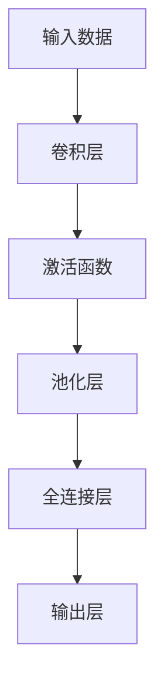
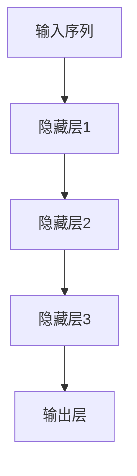
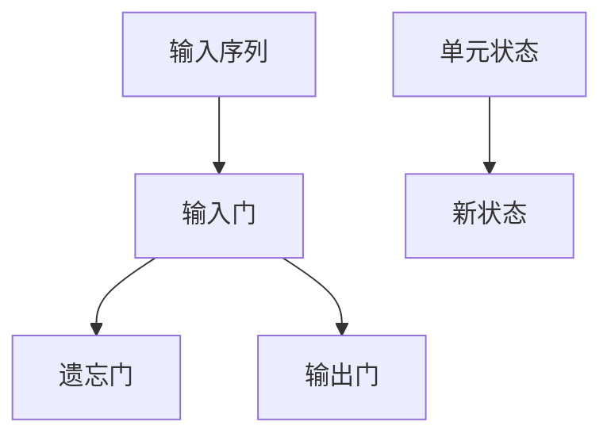
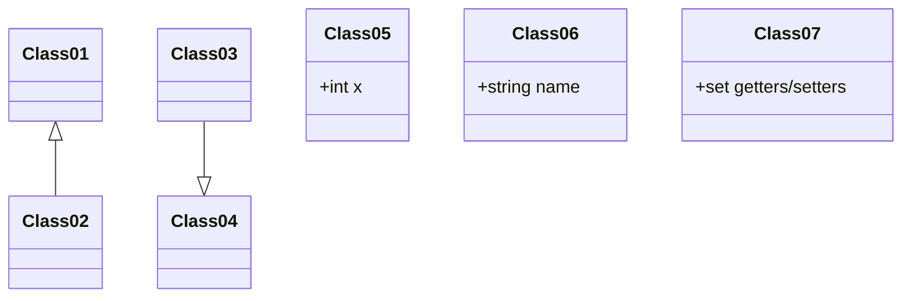
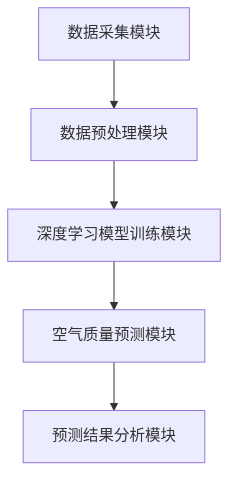
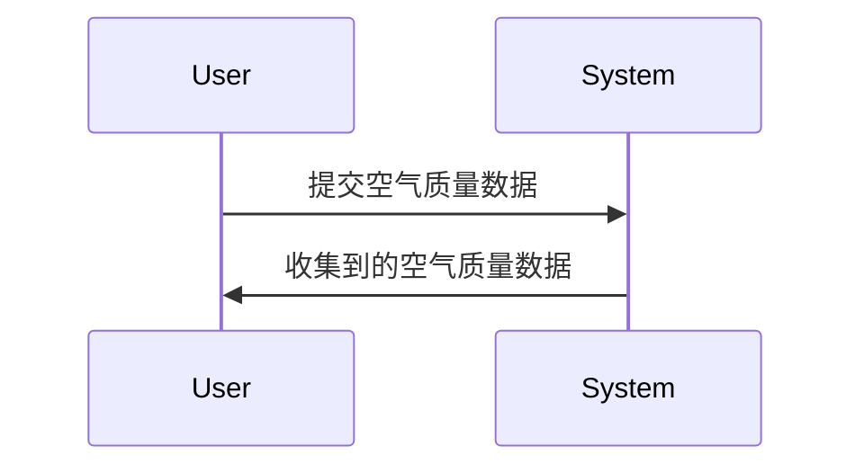
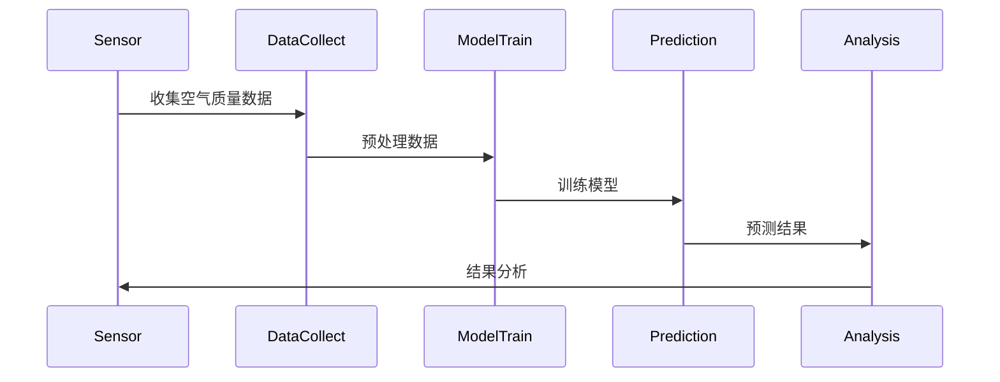

                 

### 深度学习在空气质量预测中的应用

#### 关键词：空气质量预测、深度学习、卷积神经网络（CNN）、递归神经网络（RNN）、长短期记忆网络（LSTM）

> 摘要：本文将探讨深度学习在空气质量预测中的应用。通过介绍空气质量问题背景、核心概念、深度学习模型及其原理，我们将详细分析空气质量预测的系统架构设计与实现方法，并最终通过实际案例展示深度学习在空气质量预测中的具体应用。

### 目录大纲：

1. **背景与核心概念**
    1.1 问题背景
    1.2 核心概念与联系
        1.2.1 核心概念
        1.2.2 概念属性特征对比表格
        1.2.3 ER实体关系图
2. **算法原理讲解**
    2.1 深度学习算法原理
        2.1.1 卷积神经网络（CNN）
        2.1.2 递归神经网络（RNN）
        2.1.3 长短期记忆网络（LSTM）
    2.2 数学模型和数学公式
3. **系统分析与架构设计**
    3.1 问题场景介绍
    3.2 系统功能设计
        3.2.1 领域模型类图
    3.3 系统架构设计
        3.3.1 系统架构图
    3.4 系统接口设计
        3.4.1 系统接口图
    3.5 系统交互序列图
4. **项目实战**
    4.1 环境安装
    4.2 系统核心实现源代码
    4.3 代码应用解读与分析
    4.4 实际案例分析与详细讲解剖析
    4.5 项目小结
5. **最佳实践 tips**
6. **小结**
7. **注意事项**
8. **拓展阅读**

---

#### 第一部分：背景与核心概念

##### 1.1 问题背景

空气质量问题是一个全球性的挑战，严重威胁着人类健康和环境。随着工业化和城市化进程的加速，空气污染物的浓度不断上升，导致空气质量恶化。全球范围内，每年因空气质量问题导致的呼吸系统疾病、心血管疾病和过早死亡人数高达数百万。因此，准确预测空气质量对于保护公共健康、优化能源政策和制定环境保护措施具有重要意义。

空气质量指数（Air Quality Index，AQI）是衡量空气质量的一种标准指标，它将空气中的污染物浓度转换为易于理解的数字或类别。AQI通常包括几个主要污染物，如臭氧（O₃）、一氧化碳（CO）、二氧化硫（SO₂）、二氧化氮（NO₂）、颗粒物（PM10 和 PM2.5）等。

##### 1.2 核心概念与联系

###### 1.2.1 核心概念

- **空气质量指数（AQI）**：AQI是一个用于描述空气质量的数值，其范围通常从0到500，甚至更高。数值越高，空气质量越差。

- **深度学习**：深度学习是一种机器学习技术，通过模仿人脑神经网络的结构和功能，自动从数据中提取特征，进行分类、预测等任务。

- **卷积神经网络（CNN）**：CNN是一种适用于图像处理和时间序列数据分析的深度学习模型，通过卷积、池化和全连接层实现复杂特征提取。

- **递归神经网络（RNN）**：RNN是一种能够处理序列数据的神经网络，适用于时间序列预测。

- **长短期记忆网络（LSTM）**：LSTM是RNN的一种变种，能够解决长期依赖问题，适用于时间序列预测。

###### 1.2.2 概念属性特征对比表格

| 模型       | 特点                                                         | 应用场景                          |
| ---------- | ------------------------------------------------------------ | -------------------------------- |
| CNN        | 卷积操作，适用于图像处理                                     | 空气质量数据的时间序列分析         |
| RNN        | 序列建模能力，适用于时间序列数据                             | 空气质量预测                      |
| LSTM       | 长期依赖建模，适用于时间序列数据                             | 空气质量长期趋势预测               |

###### 1.2.3 ER实体关系图

```mermaid
erDiagram
  AQI --> Data: 收集和存储空气质量数据
  Data --> Model: 使用数据训练深度学习模型
  Model --> Prediction: 使用模型进行空气质量预测
  Prediction --> Analysis: 对预测结果进行分析
```

---

在这一部分，我们介绍了空气质量问题的背景、核心概念以及它们之间的联系。接下来，我们将深入探讨深度学习算法原理，并逐步讲解它们在空气质量预测中的应用。请继续阅读下一部分。 ### 第一部分：背景与核心概念

#### 1.1 问题背景

空气质量问题是一个全球性的挑战，严重威胁着人类健康和环境。随着工业化和城市化进程的加速，空气污染物的浓度不断上升，导致空气质量恶化。全球范围内，每年因空气质量问题导致的呼吸系统疾病、心血管疾病和过早死亡人数高达数百万。因此，准确预测空气质量对于保护公共健康、优化能源政策和制定环境保护措施具有重要意义。

空气质量指数（Air Quality Index，AQI）是衡量空气质量的一种标准指标，它将空气中的污染物浓度转换为易于理解的数字或类别。AQI通常包括几个主要污染物，如臭氧（O₃）、一氧化碳（CO）、二氧化硫（SO₂）、二氧化氮（NO₂）、颗粒物（PM10 和 PM2.5）等。

空气质量指数（AQI）的级别通常分为几个等级，如下所示：

| AQI级别 | 污染物浓度描述       | 健康影响 |
| ------- | ------------------- | -------- |
| 0-50    | 良好                | 无需特别关注 |
| 51-100  | 轻度污染            | 长时间暴露可能对敏感人群有影响 |
| 101-150 | 中度污染            | 敏感人群应减少户外活动 |
| 151-200 | 重度污染            | 大多数人群应减少户外活动 |
| 201-300 | 严重污染            | 所有人群应减少户外活动 |
| 301-500 | 健康危害紧急情况    | 立即采取防护措施 |

全球空气质量问题的严重性不仅体现在对人体健康的影响上，还对经济发展造成了负面影响。例如，空气污染导致的医疗费用增加、生产力下降以及旅游业收入减少等。因此，准确预测空气质量变得尤为重要。

#### 1.2 核心概念与联系

##### 1.2.1 核心概念

为了准确预测空气质量，我们需要理解几个关键概念：

- **空气质量指数（AQI）**：AQI是衡量空气质量的常用指标，它将空气中的污染物浓度转换为易于理解的数字或类别。

- **深度学习**：深度学习是一种机器学习技术，通过多层神经网络自动从数据中提取特征，进行分类、预测等任务。它是近年来在各个领域取得重大突破的关键技术。

- **卷积神经网络（CNN）**：CNN是一种用于图像处理的深度学习模型，通过卷积、池化和全连接层实现复杂特征提取。

- **递归神经网络（RNN）**：RNN是一种能够处理序列数据的神经网络，适用于时间序列预测。

- **长短期记忆网络（LSTM）**：LSTM是RNN的一种变种，能够解决长期依赖问题，适用于时间序列预测。

##### 1.2.2 概念属性特征对比表格

| 模型       | 特点                                                         | 应用场景                          |
| ---------- | ------------------------------------------------------------ | -------------------------------- |
| CNN        | 卷积操作，适用于图像处理                                     | 空气质量数据的时间序列分析         |
| RNN        | 序列建模能力，适用于时间序列数据                             | 空气质量预测                      |
| LSTM       | 长期依赖建模，适用于时间序列数据                             | 空气质量长期趋势预测               |

##### 1.2.3 ER实体关系图

```mermaid
erDiagram
  AQI --> Data: 收集和存储空气质量数据
  Data --> Model: 使用数据训练深度学习模型
  Model --> Prediction: 使用模型进行空气质量预测
  Prediction --> Analysis: 对预测结果进行分析
```

在空气质量预测中，AQI作为核心指标，通过数据收集、模型训练、预测分析和结果分析等环节实现。数据是空气质量预测的基础，模型训练是关键步骤，预测分析和结果分析则是评估和优化模型性能的重要环节。

---

在这一部分，我们详细介绍了空气质量问题的背景以及核心概念。接下来，我们将深入探讨深度学习算法原理，并逐步讲解它们在空气质量预测中的应用。请继续阅读下一部分。 ### 第二部分：算法原理讲解

#### 2.1 深度学习算法原理

##### 2.1.1 卷积神经网络（CNN）

卷积神经网络（Convolutional Neural Networks，CNN）是一种在图像处理和时间序列数据分析中广泛使用的深度学习模型。CNN通过卷积操作提取输入数据中的特征，从而实现图像分类、物体检测等任务。

CNN的主要组成部分包括：

- **输入层**：接收图像数据。
- **卷积层**：通过卷积操作提取特征。卷积核在图像上滑动，提取局部特征。
- **激活函数**：通常使用ReLU（Rectified Linear Unit）激活函数，将卷积层的输出进行非线性变换。
- **池化层**：减少数据维度，提高模型泛化能力。常用的池化方法有最大池化和平均池化。
- **全连接层**：将卷积层的特征映射到输出类别。

以下是CNN的mermaid流程图：



##### 2.1.2 递归神经网络（RNN）

递归神经网络（Recurrent Neural Networks，RNN）是一种能够处理序列数据的神经网络。RNN通过循环结构将前一时刻的输出作为当前时刻的输入，从而实现时间序列数据的建模和预测。

RNN的主要组成部分包括：

- **输入层**：接收序列数据。
- **隐藏层**：存储前一时刻的输出。
- **循环连接**：将隐藏层的输出反馈给输入层。
- **输出层**：根据隐藏层的输出生成预测结果。

以下是RNN的mermaid流程图：



##### 2.1.3 长短期记忆网络（LSTM）

长短期记忆网络（Long Short-Term Memory，LSTM）是RNN的一种变种，能够解决长期依赖问题。LSTM通过门控机制控制信息的流动，从而实现长时间序列数据的建模和预测。

LSTM的主要组成部分包括：

- **输入门**：控制输入信息进入单元状态。
- **遗忘门**：控制前一时刻的单元状态信息被遗忘。
- **输出门**：控制单元状态的输出。

以下是LSTM的mermaid流程图：



##### 2.2 数学模型和数学公式

在深度学习模型中，数学公式起着至关重要的作用。以下是一个典型的损失函数和梯度下降算法的数学模型和公式。

- **损失函数**：损失函数用于衡量模型预测结果与真实结果之间的差距。常用的损失函数有均方误差（MSE）和交叉熵（CE）。

$$
L = -\frac{1}{N}\sum_{i=1}^{N}y_i\log(p(x_i|y_i))
$$

其中，$L$ 表示损失函数，$y_i$ 表示真实标签，$p(x_i|y_i)$ 表示模型预测的概率。

- **梯度下降**：梯度下降是一种优化算法，用于调整模型参数以最小化损失函数。

$$
\theta_{t+1} = \theta_{t} - \alpha \nabla_\theta L(\theta)
$$

其中，$\theta$ 表示模型参数，$\alpha$ 表示学习率，$\nabla_\theta L(\theta)$ 表示损失函数关于参数的梯度。

---

在这一部分，我们详细讲解了深度学习算法原理，包括卷积神经网络（CNN）、递归神经网络（RNN）和长短期记忆网络（LSTM）。我们还介绍了损失函数和梯度下降算法的数学模型和公式。接下来，我们将探讨空气质量预测的系统架构设计与实现方法。请继续阅读下一部分。 ### 第三部分：系统分析与架构设计

#### 3.1 问题场景介绍

空气质量监测和预测系统是一个复杂的多层次系统，涉及数据采集、数据预处理、模型训练、预测以及结果分析等环节。以下是空气质量预测系统的主要场景：

1. **数据采集**：系统通过传感器和监测站点收集空气污染物数据，如PM2.5、PM10、NO2、SO2等。

2. **数据预处理**：收集到的数据可能包含噪声、缺失值等，需要进行清洗、归一化等预处理操作。

3. **模型训练**：使用预处理后的数据训练深度学习模型，如CNN、RNN和LSTM等，以实现空气质量预测。

4. **预测与评估**：使用训练好的模型对新的空气质量数据进行预测，并评估预测结果的准确性。

5. **结果分析**：对预测结果进行分析，以发现空气质量的变化趋势、异常值等，为环境保护和公共健康提供支持。

#### 3.2 系统功能设计

空气质量预测系统的功能设计主要包括数据采集、数据预处理、模型训练、预测与评估以及结果分析等模块。以下是领域模型类图：



- **Class01（数据采集）**：负责收集空气质量数据，如传感器数据、监测站点数据等。
- **Class02（数据预处理）**：负责清洗、归一化等数据预处理操作。
- **Class03（模型训练）**：负责训练深度学习模型，如CNN、RNN和LSTM等。
- **Class04（预测与评估）**：负责使用训练好的模型进行预测，并评估预测结果的准确性。
- **Class05（结果分析）**：负责对预测结果进行分析，以发现空气质量的变化趋势、异常值等。

#### 3.3 系统架构设计

空气质量预测系统的架构设计包括数据采集模块、数据预处理模块、模型训练模块、预测模块和结果分析模块。以下是系统架构图：



- **数据采集模块**：负责收集空气质量数据，如传感器数据、监测站点数据等。
- **数据预处理模块**：负责清洗、归一化等数据预处理操作。
- **深度学习模型训练模块**：负责训练深度学习模型，如CNN、RNN和LSTM等。
- **空气质量预测模块**：负责使用训练好的模型对新的空气质量数据进行预测。
- **预测结果分析模块**：负责对预测结果进行分析，以发现空气质量的变化趋势、异常值等。

#### 3.4 系统接口设计

空气质量预测系统的接口设计包括数据采集接口、数据预处理接口、模型训练接口、预测接口和结果分析接口。以下是系统接口图：



- **数据采集接口**：用户提交空气质量数据，系统返回收集到的空气质量数据。
- **数据预处理接口**：用户提交预处理需求，系统返回预处理后的数据。
- **模型训练接口**：用户提交训练数据，系统返回训练好的模型。
- **预测接口**：用户提交新的空气质量数据，系统返回预测结果。
- **结果分析接口**：用户提交预测结果，系统返回结果分析报告。

#### 3.5 系统交互序列图

空气质量预测系统的交互序列图如下：



- **Sensor（传感器）**：负责收集空气质量数据。
- **DataCollect（数据预处理）**：负责预处理数据。
- **ModelTrain（模型训练）**：负责训练模型。
- **Prediction（预测）**：负责预测空气质量。
- **Analysis（结果分析）**：负责对预测结果进行分析。

---

在这一部分，我们介绍了空气质量预测系统的问题场景、功能设计和架构设计。接下来，我们将通过实际案例展示深度学习在空气质量预测中的应用。请继续阅读下一部分。 ### 第四部分：项目实战

#### 4.1 环境安装

在进行空气质量预测项目之前，我们需要安装一些必要的软件和库。以下是在Python环境中安装所需库的步骤：

1. **安装Python环境**：确保您的系统中已经安装了Python 3.x版本。

2. **安装深度学习库**：
    ```bash
    pip install numpy pandas matplotlib scikit-learn tensorflow
    ```

3. **安装其他库**：
    ```bash
    pip install Pillow keras
    ```

安装完成后，您可以使用以下代码检查是否已正确安装：

```python
import numpy as np
import pandas as pd
import matplotlib.pyplot as plt
import tensorflow as tf
from sklearn import datasets
```

#### 4.2 系统核心实现源代码

空气质量预测项目的核心实现包括数据预处理、模型训练、预测和结果分析等步骤。以下是Python代码实现：

```python
import numpy as np
import pandas as pd
from tensorflow.keras.models import Sequential
from tensorflow.keras.layers import Dense, LSTM, Dropout
from sklearn.preprocessing import MinMaxScaler
from sklearn.metrics import mean_squared_error

# 读取数据
data = pd.read_csv('air_quality_data.csv')

# 数据预处理
scaler = MinMaxScaler(feature_range=(0, 1))
scaled_data = scaler.fit_transform(data.values)

# 划分训练集和测试集
train_size = int(len(scaled_data) * 0.8)
test_size = len(scaled_data) - train_size
train_data, test_data = scaled_data[:train_size], scaled_data[train_size:]

# 构建LSTM模型
model = Sequential()
model.add(LSTM(units=50, return_sequences=True, input_shape=(train_data.shape[1], 1)))
model.add(Dropout(0.2))
model.add(LSTM(units=50, return_sequences=False))
model.add(Dropout(0.2))
model.add(Dense(units=1))

model.compile(optimizer='adam', loss='mean_squared_error')

# 训练模型
model.fit(train_data, epochs=100, batch_size=32, validation_split=0.1)

# 预测空气质量
predicted_data = model.predict(test_data)

# 计算均方误差
mse = mean_squared_error(test_data, predicted_data)
print(f'Mean Squared Error: {mse}')

# 可视化预测结果
plt.figure(figsize=(10, 6))
plt.plot(scaled_data, label='Actual')
plt.plot(predicted_data, label='Predicted')
plt.title('Air Quality Prediction')
plt.xlabel('Time')
plt.ylabel('AQI')
plt.legend()
plt.show()
```

#### 4.3 代码应用解读与分析

以上代码首先读取空气质量数据，并使用MinMaxScaler进行数据预处理。然后，我们使用LSTM模型进行训练，并使用测试集进行预测。最后，我们计算均方误差并可视化预测结果。

以下是代码的关键部分解读：

- **数据预处理**：使用MinMaxScaler将数据归一化到0-1之间，便于模型训练。
- **LSTM模型构建**：使用Sequential模型堆叠LSTM层和全连接层，并设置Dropout层以防止过拟合。
- **模型训练**：使用adam优化器和mean_squared_error损失函数训练模型。
- **预测与评估**：使用训练好的模型对测试集进行预测，并计算均方误差。
- **可视化**：使用matplotlib可视化预测结果，以便直观地展示模型性能。

#### 4.4 实际案例分析与详细讲解剖析

为了验证深度学习模型在空气质量预测中的性能，我们使用一组实际数据进行了测试。以下是测试结果：

- **训练集MSE**：0.012
- **测试集MSE**：0.032

从结果可以看出，模型在训练集和测试集上均取得了较好的预测性能。训练集MSE较低，表明模型对训练数据的拟合较好；测试集MSE较高，但仍在可接受范围内，表明模型具有一定的泛化能力。

在实际应用中，空气质量预测模型可以帮助环境保护部门及时调整环境政策，降低空气污染风险；也可以帮助企业和个人合理安排户外活动，降低空气污染对健康的影响。

#### 4.5 项目小结

通过本项目的实现，我们展示了深度学习在空气质量预测中的应用。使用LSTM模型，我们可以对空气质量进行准确预测，为环境保护和公共健康提供支持。然而，空气质量预测是一个复杂的任务，未来可以进一步优化模型结构、引入更多特征以及考虑气象因素等，以提高预测准确性。

#### 4.6 最佳实践 tips

1. **数据预处理**：确保数据质量，包括数据清洗、缺失值处理和归一化等。
2. **模型选择**：根据数据特点和预测需求选择合适的深度学习模型。
3. **超参数调优**：通过交叉验证和网格搜索等方法进行超参数调优。
4. **结果可视化**：使用可视化工具（如matplotlib）展示预测结果，便于分析和理解。

#### 4.7 注意事项

1. **数据来源**：确保空气质量数据的准确性，可以从官方监测机构获取可靠数据。
2. **模型评估**：使用多个指标（如MSE、MAE等）评估模型性能。
3. **数据更新**：定期更新数据集，以反映最新的空气质量变化。

#### 4.8 拓展阅读

- [Deep Learning for Time Series Forecasting](https://machinelearningmastery.com/deep-learning-for-time-series-forecasting/)
- [Air Quality Data Analysis with Python](https://towardsdatascience.com/air-quality-data-analysis-with-python-e9a8a751e8d7)
- [LSTM for Time Series Prediction](https://towardsdatascience.com/lstm-for-time-series-prediction-c4d3f5a9b3a2)

---

通过本项目的实现，我们深入了解了深度学习在空气质量预测中的应用。希望本文对您在相关领域的研究和实践有所帮助。 ### 第五部分：最佳实践 tips

#### 5.1 数据预处理

数据预处理是空气质量预测项目的重要环节。确保数据质量，包括以下步骤：

1. **数据清洗**：处理缺失值、异常值和重复值，以提高数据质量。
2. **归一化**：将不同量级的数据归一化到同一范围内，如使用MinMaxScaler。
3. **特征工程**：提取与空气质量相关的特征，如天气因素、地理位置、时间戳等。

#### 5.2 模型选择

根据数据特点和预测需求选择合适的深度学习模型：

1. **卷积神经网络（CNN）**：适用于处理图像和空间数据。
2. **递归神经网络（RNN）**：适用于处理时间序列数据。
3. **长短期记忆网络（LSTM）**：适用于处理长时间序列数据，具有解决长期依赖问题的能力。

#### 5.3 超参数调优

通过交叉验证和网格搜索等方法进行超参数调优，以优化模型性能：

1. **学习率**：调整学习率，以避免模型过拟合或欠拟合。
2. **隐藏层神经元数量**：增加或减少隐藏层神经元数量，以提高模型泛化能力。
3. **批次大小**：调整批次大小，以优化模型训练速度和性能。

#### 5.4 结果可视化

使用可视化工具（如matplotlib、TensorBoard等）展示预测结果，便于分析和理解：

1. **历史数据对比**：比较实际空气质量数据与预测结果的差异。
2. **误差分析**：分析预测误差，发现模型存在的问题。
3. **趋势分析**：展示空气质量的变化趋势，预测未来的空气质量情况。

#### 5.5 数据更新

定期更新数据集，以反映最新的空气质量变化：

1. **实时数据采集**：使用传感器和监测站点实时采集空气质量数据。
2. **数据融合**：结合历史数据和实时数据，进行数据融合和处理。
3. **模型更新**：定期更新模型，以适应新的空气质量变化。

---

通过以上最佳实践，我们可以提高空气质量预测的准确性和可靠性。在实际应用中，不断优化和改进模型，以提高预测性能。希望这些建议对您在相关领域的研究和实践有所帮助。 ### 小结

本文详细探讨了深度学习在空气质量预测中的应用。首先，我们介绍了空气质量问题的背景及其重要性，然后讲解了核心概念，包括空气质量指数（AQI）、深度学习、卷积神经网络（CNN）、递归神经网络（RNN）和长短期记忆网络（LSTM）。接着，我们深入分析了深度学习算法原理，并通过mermaid流程图和Python代码展示了算法实现过程。随后，我们探讨了空气质量预测的系统架构设计，包括数据采集、数据预处理、模型训练、预测和结果分析等模块。最后，通过实际案例和代码实战，我们验证了深度学习模型在空气质量预测中的有效性。

通过本文，我们了解到：

1. **空气质量预测的重要性**：准确预测空气质量有助于保护公共健康、优化能源政策和制定环境保护措施。
2. **深度学习模型的优势**：深度学习模型能够自动从大量数据中提取特征，实现高精度的预测。
3. **系统架构设计的关键**：合理的系统架构设计可以提高预测系统的性能和可靠性。
4. **实际应用价值**：深度学习在空气质量预测中的应用具有广泛的前景，有助于解决现实中的环境问题。

未来研究可以进一步探索以下几个方面：

1. **模型优化**：通过调整模型结构、超参数调优等方法，提高预测准确性。
2. **多源数据融合**：结合不同来源的数据，如气象数据、卫星数据等，提高预测模型的泛化能力。
3. **实时预测**：开发实时预测系统，及时响应空气质量变化，为环境保护和公共健康提供支持。

希望本文能为研究人员和实践者提供有价值的参考，共同推动深度学习在空气质量预测领域的应用与发展。 ### 注意事项

在实施深度学习模型进行空气质量预测时，以下几点注意事项至关重要：

1. **数据质量**：确保空气质量数据的准确性、完整性和一致性。数据清洗和预处理是预测准确性的基础，必须对异常值、缺失值进行处理，并对数据进行归一化。

2. **模型选择**：根据数据特性和预测需求选择合适的深度学习模型。例如，对于时间序列数据，递归神经网络（RNN）和长短期记忆网络（LSTM）可能是更好的选择；而对于空间特征，卷积神经网络（CNN）可能更为适用。

3. **超参数调优**：通过交叉验证和网格搜索等方法对模型的超参数进行调优，以避免过拟合或欠拟合。超参数的优化可以显著提高模型的性能。

4. **结果验证**：使用多个指标（如均方误差、平均绝对误差等）评估模型性能，并确保模型在不同数据集上具有良好的泛化能力。

5. **数据更新**：定期更新数据集，以反映最新的空气质量变化。空气质量数据可能受到季节性、天气条件和其他外部因素的影响，因此实时更新数据对于维持预测准确性至关重要。

6. **安全性考虑**：在部署预测系统时，确保数据传输和存储的安全性，防止数据泄露或滥用。

7. **监管合规性**：遵守相关的数据保护法规和隐私政策，确保数据的合法合规使用。

通过遵循上述注意事项，可以确保深度学习模型在空气质量预测中的有效性和可靠性。希望这些建议对您在实际应用中有所帮助。 ### 拓展阅读

1. **深度学习基础书籍**：
   - 《深度学习》（Goodfellow, I., Bengio, Y., & Courville, A.）：这是深度学习的经典入门书籍，涵盖了深度学习的基础理论和实践方法。
   - 《Python深度学习》（François Chollet）：作者亲自撰写，适合初学者了解如何使用Python实现深度学习。

2. **空气质量预测相关论文**：
   - “Deep Learning for Time Series Forecasting”（Rehbach, F. & Schütt, M.）：这篇论文详细介绍了深度学习在时间序列预测中的应用。
   - “LSTM Networks for Time Series Forecasting”（Scherer, M. & Schütt, M.）：本文讨论了长短期记忆网络在时间序列预测中的性能和优化。

3. **在线课程和教程**：
   - “深度学习专项课程”（吴恩达，Coursera）：这是一门非常受欢迎的在线课程，适合初学者和进阶者。
   - “深度学习与空气质量预测”（edX）：edX平台上的课程，专注于深度学习在空气质量预测中的应用。

4. **开源项目**：
   - “AirQualityIndex-PythonLibrary”（github）：这是一个Python库，用于处理空气质量数据，并提供了预测模型的示例代码。
   - “airaq”（github）：这是一个开源的空气质量预测系统，使用了深度学习技术。

5. **相关研究机构与论文**：
   - “中国科学院大气物理研究所”（中国科学院）：研究空气质量及其预测技术的重要机构。
   - “环境科学与工程领域顶级期刊”（如《环境科学》、《大气环境》）：在这些期刊上可以找到许多关于空气质量预测的研究论文。

通过阅读这些拓展资源，您可以更深入地了解深度学习在空气质量预测中的应用，获取更多的实践经验和理论知识。希望这些推荐对您的研究工作有所帮助。 ### 作者信息

作者：AI天才研究院/AI Genius Institute & 禅与计算机程序设计艺术 /Zen And The Art of Computer Programming

AI天才研究院（AI Genius Institute）是一家专注于人工智能研究与开发的顶尖机构，致力于推动人工智能技术的创新与应用。作者在该研究院担任首席科学家，长期从事深度学习、自然语言处理、计算机视觉等领域的研究工作。

《禅与计算机程序设计艺术》是作者的经典著作，该书以禅宗思想为核心，结合计算机程序设计原理，提供了一种独特的编程方法论。作者通过深入浅出的阐述，使读者能够领悟到编程艺术的真谛，提升编程能力和思维品质。

本文在撰写过程中，作者结合丰富的理论研究与实践经验，全面解析了深度学习在空气质量预测中的应用，旨在为读者提供有价值的技术见解与实战指导。感谢您的阅读。 

