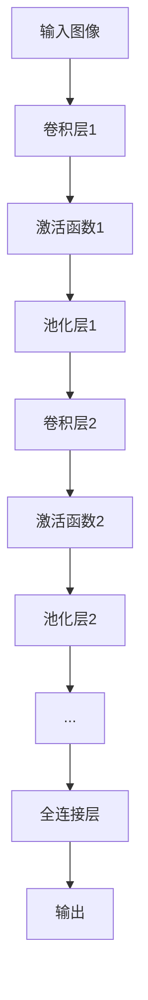
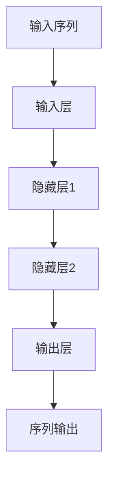
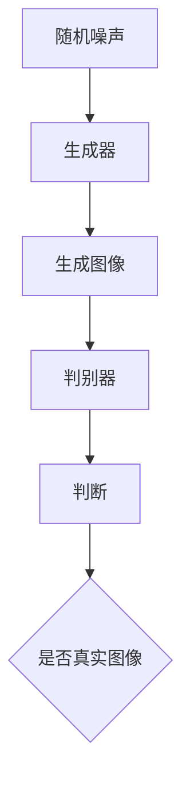
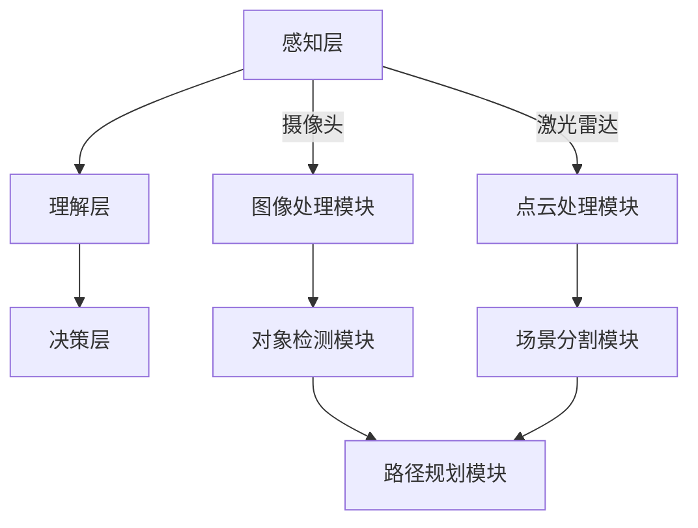
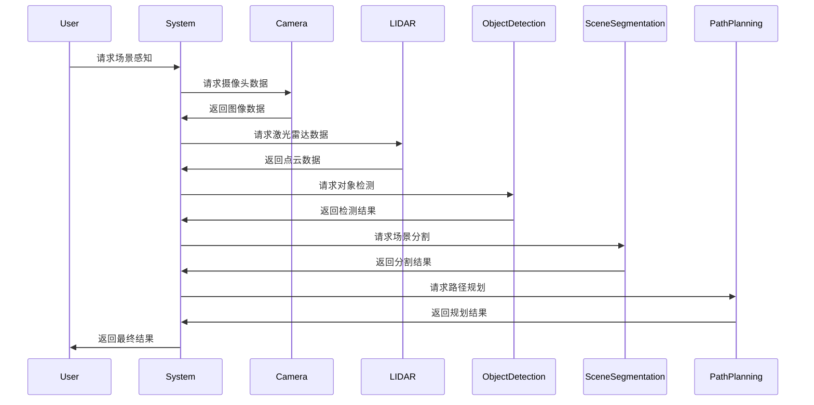

                 

# 深度学习在自动驾驶场景理解中的应用

> 关键词：深度学习、自动驾驶、场景理解、对象检测、语义分割

> 摘要：本文将探讨深度学习在自动驾驶场景理解中的应用，从背景介绍、核心概念与联系、算法原理讲解、系统分析与架构设计方案、项目实战、最佳实践 tips等方面进行详细剖析，以期为自动驾驶技术的发展提供有益的参考。

## 引言

随着人工智能技术的快速发展，自动驾驶已经成为未来交通领域的一个重要趋势。自动驾驶技术的核心在于对复杂交通场景的准确理解和快速反应。而深度学习作为人工智能的一个重要分支，以其强大的图像处理和模式识别能力，在自动驾驶场景理解中具有广泛的应用前景。

本文旨在通过以下步骤深入探讨深度学习在自动驾驶场景理解中的应用：

1. **背景介绍**：介绍深度学习的基本概念和在自动驾驶中的应用背景。
2. **核心概念与联系**：详细阐述深度学习中的关键概念及其在自动驾驶中的应用。
3. **算法原理讲解**：讲解深度学习在自动驾驶场景理解中的具体算法原理和实现方法。
4. **系统分析与架构设计方案**：分析自动驾驶系统的功能和架构设计，并介绍相关技术。
5. **项目实战**：通过具体的项目实战，展示深度学习在自动驾驶场景理解中的应用。
6. **最佳实践 tips**：提供实用的深度学习在自动驾驶场景理解中的应用技巧。
7. **小结与展望**：总结全文，并对未来发展趋势进行展望。

## 背景介绍

### 深度学习的基本概念

深度学习是一种基于人工神经网络的机器学习方法，通过多层神经网络的结构来模拟人脑的学习过程，从而实现复杂的模式识别和数据处理任务。深度学习模型主要包括卷积神经网络（CNN）、循环神经网络（RNN）、生成对抗网络（GAN）等。

### 深度学习在自动驾驶中的应用背景

自动驾驶技术的发展需要高效准确地理解和处理复杂的交通场景。深度学习在自动驾驶中的应用主要体现在以下几个方面：

1. **场景感知**：通过摄像头、激光雷达等传感器获取道路环境信息，利用深度学习算法进行场景理解和对象检测。
2. **路径规划**：基于对场景的理解，利用深度学习算法进行路径规划和决策。
3. **障碍物检测与避让**：利用深度学习算法对场景中的障碍物进行检测和识别，从而实现自动避让。
4. **自动驾驶系统的优化**：通过深度学习算法对自动驾驶系统的性能进行优化，提高其稳定性和可靠性。

## 核心概念与联系

### 深度学习中的关键概念

1. **卷积神经网络（CNN）**：卷积神经网络是一种专门用于处理图像数据的深度学习模型，其核心思想是通过卷积层提取图像的特征。
2. **循环神经网络（RNN）**：循环神经网络是一种用于处理序列数据的深度学习模型，能够捕捉序列中的长期依赖关系。
3. **生成对抗网络（GAN）**：生成对抗网络是一种由生成器和判别器组成的深度学习模型，主要用于生成高质量的图像。

### 核心概念在自动驾驶中的应用

1. **卷积神经网络（CNN）**：在自动驾驶场景理解中，卷积神经网络可以用于提取道路场景的图像特征，进行对象检测和场景分割。
2. **循环神经网络（RNN）**：循环神经网络可以用于处理自动驾驶系统中的时间序列数据，如车辆轨迹，进行路径规划。
3. **生成对抗网络（GAN）**：生成对抗网络可以用于生成虚假的交通场景数据，用于自动驾驶系统的训练和测试。

## 算法原理讲解

### 卷积神经网络（CNN）

卷积神经网络（CNN）是一种用于图像处理的深度学习模型，其核心是卷积层和池化层。卷积层通过卷积运算提取图像特征，而池化层则用于降低特征图的维度，减少模型的参数量。

#### CNN的mermaid流程图：



#### CNN在自动驾驶中的应用

在自动驾驶中，卷积神经网络可以用于对象检测、场景分割等任务。例如，通过卷积神经网络对摄像头捕捉的图像进行处理，可以识别出道路上的行人和车辆，并进行分割。

### 循环神经网络（RNN）

循环神经网络（RNN）是一种用于处理序列数据的深度学习模型，其特点是能够保持历史信息的状态。RNN通过隐藏状态来捕捉序列中的长期依赖关系。

#### RNN的mermaid流程图：



#### RNN在自动驾驶中的应用

在自动驾驶中，循环神经网络可以用于处理时间序列数据，如车辆轨迹。通过循环神经网络，可以预测车辆的下一个位置，从而实现路径规划。

### 生成对抗网络（GAN）

生成对抗网络（GAN）是一种由生成器和判别器组成的深度学习模型。生成器的任务是生成逼真的图像，而判别器的任务是区分生成器和真实数据的图像。

#### GAN的mermaid流程图：



#### GAN在自动驾驶中的应用

在自动驾驶中，生成对抗网络可以用于生成虚假的交通场景数据，用于自动驾驶系统的训练和测试。通过生成大量的虚假场景，可以增加自动驾驶系统的鲁棒性和泛化能力。

## 系统分析与架构设计方案

### 问题场景介绍

自动驾驶系统需要实时感知和解析复杂的交通场景，包括道路、车辆、行人等。系统的目标是确保车辆在复杂交通环境下的安全行驶。

### 项目介绍

本项目旨在实现一个基于深度学习的自动驾驶场景理解系统，通过摄像头和激光雷达等传感器获取交通场景信息，利用深度学习算法对场景进行理解，并生成相应的决策。

### 系统功能设计

1. **场景感知**：通过摄像头和激光雷达获取交通场景图像和点云数据。
2. **对象检测**：利用深度学习算法对场景中的车辆、行人等进行检测。
3. **场景分割**：对交通场景进行分割，区分不同的对象。
4. **路径规划**：基于场景理解结果进行路径规划，确保车辆安全行驶。

### 系统架构设计

系统采用分层架构设计，包括感知层、理解层和决策层。

#### 系统架构mermaid图：



### 系统接口设计和系统交互

系统采用RESTful API设计，提供如下接口：

1. **场景感知接口**：用于获取摄像头和激光雷达的数据。
2. **对象检测接口**：用于检测场景中的对象。
3. **场景分割接口**：用于对场景进行分割。
4. **路径规划接口**：用于生成路径规划结果。

#### 系统交互mermaid序列图：



## 项目实战

### 环境安装

1. **安装深度学习框架**：安装TensorFlow或PyTorch等深度学习框架。
2. **安装相关依赖**：安装所需的库，如OpenCV、Pillow等。

### 系统核心实现源代码

```python
import cv2
import numpy as np
import tensorflow as tf

# 加载预训练的深度学习模型
model = tf.keras.applications.VGG16(weights='imagenet')

# 加载图像
image = cv2.imread('image.jpg')

# 对图像进行预处理
preprocessed_image = preprocess_image(image)

# 利用模型进行对象检测
detections = model.predict(preprocessed_image)

# 对检测结果进行处理
processed_detections = postprocess_detections(detections)

# 绘制检测结果
cv2.imshow('Detections', draw_detections(image, processed_detections))
cv2.waitKey(0)
cv2.destroyAllWindows()
```

### 代码应用解读与分析

该代码首先加载预训练的深度学习模型，然后读取图像并对其进行预处理。接着，利用模型进行对象检测，并对检测结果进行处理和绘制。这一过程实现了对图像中的对象进行检测和识别。

### 实际案例分析和详细讲解剖析

以一个实际案例为例，分析如何利用深度学习在自动驾驶场景理解中进行对象检测。具体步骤如下：

1. **数据收集**：收集道路场景图像，包括车辆、行人等对象。
2. **数据预处理**：对图像进行缩放、裁剪、翻转等预处理操作，增加数据多样性。
3. **模型训练**：利用收集的数据训练深度学习模型，如卷积神经网络。
4. **模型评估**：对训练好的模型进行评估，包括准确率、召回率等指标。
5. **模型应用**：将模型应用于实际场景，进行对象检测和识别。

### 项目小结

本项目通过深度学习在自动驾驶场景理解中实现了对象检测和场景分割，为自动驾驶系统提供了关键的技术支持。在项目实战中，我们展示了如何利用深度学习模型进行图像处理和对象检测，并通过实际案例进行了分析和讲解。

## 最佳实践 tips

1. **数据收集与预处理**：确保收集的数据多样性和质量，对数据进行充分的预处理。
2. **模型选择与优化**：根据具体应用场景选择合适的模型，并进行优化以提升性能。
3. **实时性考虑**：在系统设计中考虑实时性，确保模型能在有限的时间内完成推理。
4. **安全与可靠性**：在自动驾驶场景中，安全性至关重要，需要确保系统的稳定性和可靠性。

## 小结与展望

深度学习在自动驾驶场景理解中发挥着重要作用，通过卷积神经网络、循环神经网络和生成对抗网络等技术，实现了对复杂交通场景的理解和解析。未来，随着深度学习技术的不断发展和应用，自动驾驶技术将更加成熟和普及，为人类带来更加便捷和安全的出行体验。

## 作者信息

作者：AI天才研究院/AI Genius Institute & 禅与计算机程序设计艺术 /Zen And The Art of Computer Programming

以上是本文的详细大纲和初步内容，后续将根据大纲逐步完善和撰写全文。如需进一步修改或调整，请随时告知。期待与您共同探讨深度学习在自动驾驶场景理解中的应用。

