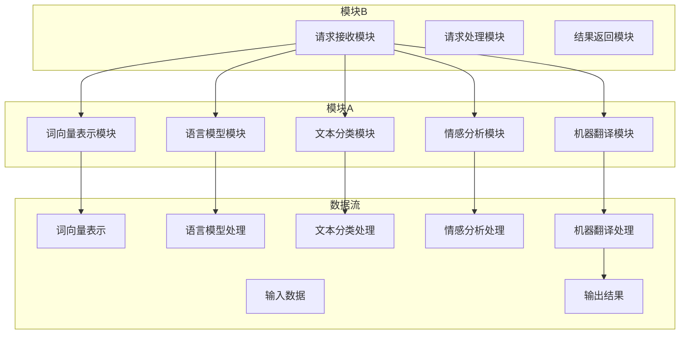
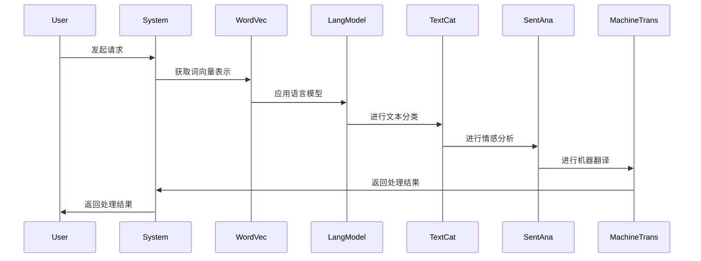

                 

# 深度学习在自然语言理解中的应用：改进人机交互

## 关键词：深度学习，自然语言理解，NLU，词向量，语言模型，文本分类，情感分析，机器翻译

## 摘要：
本文探讨了深度学习在自然语言理解（NLU）中的应用，通过分析词向量、语言模型、文本分类、情感分析和机器翻译等关键技术，提出了一系列改进方法，以提升人机交互的智能水平。文章首先介绍了深度学习在NLU中的背景和问题，然后详细阐述了核心概念和联系，并深入分析了关键算法和系统架构，最后通过实际案例展示了深度学习在NLU中的应用效果。

## 第一部分：背景介绍

### 1.1.1 问题背景
随着人工智能技术的快速发展，深度学习在自然语言理解领域取得了显著的成果。自然语言理解（Natural Language Understanding，NLU）作为人工智能的核心应用之一，旨在使计算机能够理解和解释人类的自然语言，从而实现更加智能的人机交互。深度学习在图像、语音识别等领域已经取得了重要突破，其在自然语言理解中的应用也日益受到关注。

### 1.1.2 问题描述
深度学习在自然语言理解中的应用，主要包括词向量表示、语言模型、文本分类、情感分析、机器翻译等多个方面。然而，随着技术的不断发展，深度学习在自然语言理解中仍然面临着许多挑战，如数据质量、算法效率、模型解释性等。这些问题限制了深度学习在自然语言理解中的实际应用效果。

### 1.1.3 问题解决
针对上述问题，本书将介绍一系列改进深度学习在自然语言理解中的应用的方法，包括：

1. **词向量表示**：介绍word2vec、GloVe等词向量表示方法，以及它们在自然语言理解中的应用。
2. **语言模型**：讲解神经网络语言模型、递归神经网络（RNN）和长短期记忆网络（LSTM）等模型，以及如何优化这些模型以提高性能。
3. **文本分类**：介绍基于深度学习的文本分类方法，包括卷积神经网络（CNN）和循环神经网络（RNN）等。
4. **情感分析**：介绍深度学习在情感分析中的应用，如利用卷积神经网络和递归神经网络进行文本情感分类。
5. **机器翻译**：介绍基于深度学习的机器翻译方法，如序列到序列（Seq2Seq）模型和注意力机制。

### 1.1.4 边界与外延
本书主要关注深度学习在自然语言理解中的应用，但深度学习在其他领域的应用也将被简要介绍，以帮助读者更好地理解深度学习的全貌。

### 1.1.5 概念结构与核心要素组成
以下是本书中涉及的一些核心概念及其组成：

- **词向量表示**：词向量是词在向量空间中的表示，它们可以用于文本分类、情感分析等任务。
- **语言模型**：语言模型用于预测下一个词或词组，它们在自然语言处理中有广泛应用。
- **文本分类**：文本分类是将文本数据分为不同类别的一种任务，如垃圾邮件过滤、情感分类等。
- **情感分析**：情感分析是判断文本表达的情感倾向，如正面、负面或中性。
- **机器翻译**：机器翻译是将一种语言的文本翻译成另一种语言，深度学习在机器翻译中发挥了重要作用。

## 第二部分：核心概念与联系

### 2.1 深度学习与自然语言理解的关系

#### 2.1.1 深度学习原理

##### 2.1.1.1 神经网络基础

###### 2.1.1.1.1 神经元与神经网络
神经网络是深度学习的基础，它由大量相互连接的神经元组成。每个神经元接收多个输入信号，并通过激活函数产生输出。神经网络通过前向传播和反向传播算法来学习输入和输出之间的关系。

\[ 
z = \sum_{i=1}^{n} w_i * x_i + b 
\]
\[ 
a = \sigma(z) 
\]

其中，\( x_i \) 是输入，\( w_i \) 是权重，\( b \) 是偏置，\( \sigma \) 是激活函数，通常使用Sigmoid、ReLU或Tanh函数。

###### 2.1.1.1.2 前向传播与反向传播
前向传播是将输入信号从输入层传递到输出层，并在每个神经元中计算输出。反向传播是计算每个神经元的误差，并更新权重和偏置以最小化损失函数。

\[ 
\delta = \frac{\partial L}{\partial z} * \sigma'(z) 
\]
\[ 
\frac{\partial L}{\partial w_i} = \delta * x_i 
\]
\[ 
\frac{\partial L}{\partial b} = \delta 
\]

其中，\( L \) 是损失函数，\( \sigma' \) 是激活函数的导数。

##### 2.1.1.2 深层神经网络

###### 2.1.1.2.1 卷积神经网络（CNN）
卷积神经网络是一种专门用于处理图像数据的神经网络，其核心是卷积层。卷积层通过滑动窗口对输入图像进行卷积运算，提取特征。ReLU激活函数和池化操作用于增强模型的泛化能力。

\[ 
(f * g)(x) = \sum_{i=1}^{n} f(i) * g(x - i) 
\]

其中，\( f \) 是卷积核，\( g \) 是输入图像，\( x \) 是滑动窗口的位置。

###### 2.1.1.2.2 循环神经网络（RNN）
循环神经网络是一种用于处理序列数据的神经网络，其核心是循环层。RNN通过在时间步之间传递隐藏状态来捕获序列中的依赖关系。然而，传统的RNN存在梯度消失和梯度爆炸的问题。

\[ 
h_t = \sigma(W_h * [h_{t-1}, x_t] + b_h) 
\]

其中，\( h_t \) 是时间步\( t \)的隐藏状态，\( x_t \) 是输入序列，\( W_h \) 是权重矩阵，\( \sigma \) 是激活函数。

###### 2.1.1.2.3 长短期记忆网络（LSTM）
长短期记忆网络是一种改进的循环神经网络，旨在解决RNN的梯度消失和梯度爆炸问题。LSTM通过引入门控机制来控制信息的流动，从而有效地捕获长程依赖关系。

\[ 
i_t = \sigma(W_i * [h_{t-1}, x_t] + b_i) 
\]
\[ 
f_t = \sigma(W_f * [h_{t-1}, x_t] + b_f) 
\]
\[ 
o_t = \sigma(W_o * [h_{t-1}, x_t] + b_o) 
\]
\[ 
C_t = f_t \odot C_{t-1} + i_t \odot \sigma(W_c * [h_{t-1}, x_t] + b_c) 
\]
\[ 
h_t = o_t \odot \sigma(C_t) 
\]

其中，\( i_t \)，\( f_t \)，\( o_t \) 分别是输入门、遗忘门和输出门，\( C_t \) 是细胞状态，\( \odot \) 表示元素乘积。

#### 2.1.2 自然语言处理（NLP）中的深度学习应用

##### 2.1.2.1 词向量表示
词向量是自然语言处理中的重要工具，它们将词汇映射到高维向量空间中。word2vec和GloVe是两种常见的词向量表示方法。

###### 2.1.2.1.1 word2vec算法
word2vec算法通过训练神经网络来预测词的上下文，从而学习词向量。它包括CBOW（连续词袋）模型和Skip-gram模型。

CBOW模型通过预测中心词周围的词来学习词向量，其输入是中心词周围的多个词，输出是中心词。

\[ 
P(w_c | w_{-1}, w_0, w_1, ..., w_k) 
\]

Skip-gram模型通过预测中心词来学习词向量，其输入是单个词，输出是中心词。

\[ 
P(w_{-1}, w_0, w_1, ..., w_k | w_c) 
\]

###### 2.1.2.1.2 GloVe算法
GloVe算法通过训练单词的共现矩阵来学习词向量。它假设词向量与单词的共现次数成正比，并通过优化损失函数来学习词向量。

\[ 
\log(P(w_i, w_j)) = \frac{v_i \cdot v_j}{\sqrt{w_i \cdot w_j}} 
\]

##### 2.1.2.2 语言模型
语言模型用于预测下一个词或词组，它们在自然语言处理中有广泛应用。神经网络语言模型、递归神经网络（RNN）和长短期记忆网络（LSTM）是三种常见的语言模型。

###### 2.1.2.2.1 神经网络语言模型
神经网络语言模型是一种基于神经网络的概率语言模型，它通过训练大量文本数据来学习词的联合概率分布。

\[ 
P(w_1, w_2, w_3, ..., w_n) = P(w_1) \cdot P(w_2 | w_1) \cdot P(w_3 | w_1, w_2) \cdot ... \cdot P(w_n | w_1, w_2, ..., w_{n-1}) 
\]

###### 2.1.2.2.2 递归神经网络（RNN）
递归神经网络是一种用于处理序列数据的神经网络，它通过在时间步之间传递隐藏状态来捕获序列中的依赖关系。

\[ 
h_t = \sigma(W_h * [h_{t-1}, x_t] + b_h) 
\]

###### 2.1.2.2.3 长短期记忆网络（LSTM）
长短期记忆网络是一种改进的循环神经网络，它通过引入门控机制来控制信息的流动，从而有效地捕获长程依赖关系。

\[ 
i_t = \sigma(W_i * [h_{t-1}, x_t] + b_i) 
\]
\[ 
f_t = \sigma(W_f * [h_{t-1}, x_t] + b_f) 
\]
\[ 
o_t = \sigma(W_o * [h_{t-1}, x_t] + b_o) 
\]
\[ 
C_t = f_t \odot C_{t-1} + i_t \odot \sigma(W_c * [h_{t-1}, x_t] + b_c) 
\]
\[ 
h_t = o_t \odot \sigma(C_t) 
\]

### 2.2 深度学习在NLP中的应用案例分析

#### 2.2.1 文本分类

##### 2.2.1.1 基于CNN的文本分类

###### 2.2.1.1.1 CNN模型结构
卷积神经网络在图像处理中表现出色，但也可以应用于文本分类任务。在文本分类中，CNN通过卷积层和池化层来提取特征，并通过全连接层进行分类。

\[ 
\text{Input} = \{x_1, x_2, ..., x_n\} 
\]
\[ 
\text{Output} = \{y_1, y_2, ..., y_m\} 
\]

其中，\( x_i \) 是单词向量，\( y_i \) 是类别标签。

###### 2.2.1.1.2 实践案例
以下是一个简单的文本分类实践案例：

```python
import tensorflow as tf
from tensorflow.keras.models import Sequential
from tensorflow.keras.layers import Embedding, Conv1D, MaxPooling1D, Dense

# 定义模型
model = Sequential()
model.add(Embedding(input_dim=10000, output_dim=32))
model.add(Conv1D(filters=128, kernel_size=5, activation='relu'))
model.add(MaxPooling1D(pool_size=2))
model.add(Conv1D(filters=128, kernel_size=5, activation='relu'))
model.add(MaxPooling1D(pool_size=2))
model.add(Dense(units=1, activation='sigmoid'))

# 编译模型
model.compile(optimizer='adam', loss='binary_crossentropy', metrics=['accuracy'])

# 训练模型
model.fit(x_train, y_train, epochs=10, batch_size=32, validation_data=(x_val, y_val))
```

##### 2.2.1.2 基于RNN的文本分类

###### 2.2.1.2.1 RNN模型结构
循环神经网络在文本分类任务中也表现出色。RNN通过在时间步之间传递隐藏状态来捕获文本中的依赖关系。

\[ 
h_t = \sigma(W_h * [h_{t-1}, x_t] + b_h) 
\]

###### 2.2.1.2.2 实践案例
以下是一个简单的基于RNN的文本分类实践案例：

```python
import tensorflow as tf
from tensorflow.keras.models import Sequential
from tensorflow.keras.layers import Embedding, LSTM, Dense

# 定义模型
model = Sequential()
model.add(Embedding(input_dim=10000, output_dim=32))
model.add(LSTM(units=128))
model.add(Dense(units=1, activation='sigmoid'))

# 编译模型
model.compile(optimizer='adam', loss='binary_crossentropy', metrics=['accuracy'])

# 训练模型
model.fit(x_train, y_train, epochs=10, batch_size=32, validation_data=(x_val, y_val))
```

#### 2.2.2 情感分析

##### 2.2.2.1 情感分析模型
情感分析是判断文本表达的情感倾向，如正面、负面或中性。深度学习在情感分析中发挥着重要作用。

###### 2.2.2.1.1 基于RNN的情感分析
基于RNN的情感分析模型通过在时间步之间传递隐藏状态来捕获文本中的情感信息。

\[ 
h_t = \sigma(W_h * [h_{t-1}, x_t] + b_h) 
\]

###### 2.2.2.1.2 实践案例
以下是一个简单的基于RNN的情感分析实践案例：

```python
import tensorflow as tf
from tensorflow.keras.models import Sequential
from tensorflow.keras.layers import Embedding, LSTM, Dense

# 定义模型
model = Sequential()
model.add(Embedding(input_dim=10000, output_dim=32))
model.add(LSTM(units=128, return_sequences=True))
model.add(LSTM(units=128))
model.add(Dense(units=1, activation='sigmoid'))

# 编译模型
model.compile(optimizer='adam', loss='binary_crossentropy', metrics=['accuracy'])

# 训练模型
model.fit(x_train, y_train, epochs=10, batch_size=32, validation_data=(x_val, y_val))
```

##### 2.2.2.2 基于CNN的情感分析
基于CNN的情感分析模型通过卷积层和池化层来提取文本特征。

\[ 
\text{Input} = \{x_1, x_2, ..., x_n\} 
\]
\[ 
\text{Output} = \{y_1, y_2, ..., y_m\} 
\]

其中，\( x_i \) 是单词向量，\( y_i \) 是情感标签。

###### 2.2.2.2.1 CNN模型结构
卷积神经网络在图像处理中表现出色，但也可以应用于文本分类任务。在文本分类中，CNN通过卷积层和池化层来提取特征，并通过全连接层进行分类。

\[ 
\text{Input} = \{x_1, x_2, ..., x_n\} 
\]
\[ 
\text{Output} = \{y_1, y_2, ..., y_m\} 
\]

其中，\( x_i \) 是单词向量，\( y_i \) 是类别标签。

###### 2.2.2.2.2 实践案例
以下是一个简单的基于CNN的情感分析实践案例：

```python
import tensorflow as tf
from tensorflow.keras.models import Sequential
from tensorflow.keras.layers import Embedding, Conv1D, MaxPooling1D, Dense

# 定义模型
model = Sequential()
model.add(Embedding(input_dim=10000, output_dim=32))
model.add(Conv1D(filters=128, kernel_size=5, activation='relu'))
model.add(MaxPooling1D(pool_size=2))
model.add(Conv1D(filters=128, kernel_size=5, activation='relu'))
model.add(MaxPooling1D(pool_size=2))
model.add(Dense(units=1, activation='sigmoid'))

# 编译模型
model.compile(optimizer='adam', loss='binary_crossentropy', metrics=['accuracy'])

# 训练模型
model.fit(x_train, y_train, epochs=10, batch_size=32, validation_data=(x_val, y_val))
```

#### 2.2.3 机器翻译

##### 2.2.3.1 序列到序列（Seq2Seq）模型
序列到序列（Seq2Seq）模型是机器翻译中的经典模型，它通过编码器和解码器来处理输入和输出序列。

\[ 
\text{Input} = \{x_1, x_2, ..., x_n\} 
\]
\[ 
\text{Output} = \{y_1, y_2, ..., y_m\} 
\]

其中，\( x_i \) 是输入序列，\( y_i \) 是输出序列。

###### 2.2.3.1.1 Seq2Seq模型结构
编码器和解码器都是循环神经网络，编码器将输入序列编码为固定长度的向量，解码器将这个向量解码为输出序列。

\[ 
e = \text{Encoder}(x_1, x_2, ..., x_n) 
\]
\[ 
y_1 = \text{Decoder}(e, y_2, ..., y_m) 
\]

###### 2.2.3.1.2 实践案例
以下是一个简单的基于Seq2Seq的机器翻译实践案例：

```python
import tensorflow as tf
from tensorflow.keras.models import Model
from tensorflow.keras.layers import Embedding, LSTM

# 定义编码器
encoder_inputs = Embedding(input_dim=10000, output_dim=32)
encoded_seq = LSTM(units=128)(encoder_inputs)

# 定义解码器
decoder_inputs = Embedding(input_dim=10000, output_dim=32)
decoded_seq = LSTM(units=128)(decoder_inputs)

# 定义模型
encoder = Model(inputs=encoder_inputs, outputs=encoded_seq)
decoder = Model(inputs=decoder_inputs, outputs=decoded_seq)

# 编译模型
encoder.compile(optimizer='adam', loss='binary_crossentropy')
decoder.compile(optimizer='adam', loss='binary_crossentropy')

# 训练模型
encoder.fit(x_train, y_train, epochs=10, batch_size=32)
decoder.fit(x_train, y_train, epochs=10, batch_size=32)
```

##### 2.2.3.2 注意力机制
注意力机制是一种在序列到序列模型中提高翻译质量的方法，它通过关注输入序列中的关键部分来提高解码的准确性。

\[ 
a_t = \text{Attention}(h_1, h_2, ..., h_n) 
\]
\[ 
y_t = \text{Decoder}(h_t, y_{t-1}) 
\]

其中，\( a_t \) 是注意力权重，\( h_t \) 是编码器输出的隐藏状态。

###### 2.2.3.2.1 注意力机制原理
注意力机制通过计算输入序列中每个时间步的注意力权重，将编码器的输出与这些权重相乘，然后将结果作为解码器的输入。

\[ 
e_t = \text{Score}(h_t, h_{t-1}) 
\]
\[ 
a_t = \frac{e_t}{\sum_{i=1}^{n} e_i} 
\]
\[ 
h_t' = a_t \cdot h_t 
\]

其中，\( e_t \) 是得分函数，通常使用点积或加性注意力模型。

###### 2.2.3.2.2 实践案例
以下是一个简单的基于注意力机制的机器翻译实践案例：

```python
import tensorflow as tf
from tensorflow.keras.models import Model
from tensorflow.keras.layers import Embedding, LSTM, Dense

# 定义编码器
encoder_inputs = Embedding(input_dim=10000, output_dim=32)
encoded_seq = LSTM(units=128)(encoder_inputs)

# 定义解码器
decoder_inputs = Embedding(input_dim=10000, output_dim=32)
decoder_lstm = LSTM(units=128, return_sequences=True)
decoder_dense = Dense(units=1, activation='sigmoid')

decoded_seq = decoder_lstm(decoder_inputs)
decoded_seq = decoder_dense(decoded_seq)

# 定义注意力层
attention = tf.keras.layers.Attention()([encoded_seq, decoded_seq])

# 定义模型
model = Model(inputs=[encoder_inputs, decoder_inputs], outputs=decoded_seq)

# 编译模型
model.compile(optimizer='adam', loss='binary_crossentropy')

# 训练模型
model.fit(x_train, y_train, epochs=10, batch_size=32)
```

## 第三部分：算法

### 3.1 词向量表示

#### 3.1.1 word2vec算法
word2vec算法是一种基于神经网络的词向量表示方法，它通过训练神经网络来预测词的上下文。

##### 3.1.1.1 CBOW模型
CBOW（连续词袋）模型通过预测中心词周围的词来学习词向量。

\[ 
P(w_c | w_{-1}, w_0, w_1, ..., w_k) 
\]

##### 3.1.1.2 Skip-gram模型
Skip-gram模型通过预测中心词来学习词向量。

\[ 
P(w_{-1}, w_0, w_1, ..., w_k | w_c) 
\]

#### 3.1.2 GloVe算法
GloVe算法通过训练单词的共现矩阵来学习词向量。

\[ 
\log(P(w_i, w_j)) = \frac{v_i \cdot v_j}{\sqrt{w_i \cdot w_j}} 
\]

### 3.2 语言模型

#### 3.2.1 神经网络语言模型
神经网络语言模型是一种基于神经网络的概率语言模型，它通过训练大量文本数据来学习词的联合概率分布。

\[ 
P(w_1, w_2, w_3, ..., w_n) = P(w_1) \cdot P(w_2 | w_1) \cdot P(w_3 | w_1, w_2) \cdot ... \cdot P(w_n | w_1, w_2, ..., w_{n-1}) 
\]

#### 3.2.2 递归神经网络（RNN）
递归神经网络是一种用于处理序列数据的神经网络，它通过在时间步之间传递隐藏状态来捕获序列中的依赖关系。

\[ 
h_t = \sigma(W_h * [h_{t-1}, x_t] + b_h) 
\]

#### 3.2.3 长短期记忆网络（LSTM）
长短期记忆网络是一种改进的循环神经网络，它通过引入门控机制来控制信息的流动，从而有效地捕获长程依赖关系。

\[ 
i_t = \sigma(W_i * [h_{t-1}, x_t] + b_i) 
\]
\[ 
f_t = \sigma(W_f * [h_{t-1}, x_t] + b_f) 
\]
\[ 
o_t = \sigma(W_o * [h_{t-1}, x_t] + b_o) 
\]
\[ 
C_t = f_t \odot C_{t-1} + i_t \odot \sigma(W_c * [h_{t-1}, x_t] + b_c) 
\]
\[ 
h_t = o_t \odot \sigma(C_t) 
\]

### 3.3 文本分类

#### 3.3.1 基于CNN的文本分类
卷积神经网络在文本分类任务中可以提取文本的特征。

\[ 
\text{Input} = \{x_1, x_2, ..., x_n\} 
\]
\[ 
\text{Output} = \{y_1, y_2, ..., y_m\} 
\]

其中，\( x_i \) 是单词向量，\( y_i \) 是类别标签。

#### 3.3.2 基于RNN的文本分类
循环神经网络在文本分类任务中可以捕获文本中的依赖关系。

\[ 
h_t = \sigma(W_h * [h_{t-1}, x_t] + b_h) 
\]

### 3.4 情感分析

#### 3.4.1 基于RNN的情感分析
递归神经网络在情感分析任务中可以捕获文本中的情感信息。

\[ 
h_t = \sigma(W_h * [h_{t-1}, x_t] + b_h) 
\]

#### 3.4.2 基于CNN的情感分析
卷积神经网络在情感分析任务中可以提取文本的特征。

\[ 
\text{Input} = \{x_1, x_2, ..., x_n\} 
\]
\[ 
\text{Output} = \{y_1, y_2, ..., y_m\} 
\]

其中，\( x_i \) 是单词向量，\( y_i \) 是情感标签。

### 3.5 机器翻译

#### 3.5.1 序列到序列（Seq2Seq）模型
序列到序列（Seq2Seq）模型是机器翻译中的经典模型。

\[ 
\text{Input} = \{x_1, x_2, ..., x_n\} 
\]
\[ 
\text{Output} = \{y_1, y_2, ..., y_m\} 
\]

其中，\( x_i \) 是输入序列，\( y_i \) 是输出序列。

#### 3.5.2 注意力机制
注意力机制是一种在序列到序列模型中提高翻译质量的方法。

\[ 
a_t = \text{Attention}(h_1, h_2, ..., h_n) 
\]
\[ 
y_t = \text{Decoder}(h_t, y_{t-1}) 
\]

### 第四部分：系统分析与架构设计方案

#### 4.1 问题场景介绍
在当今的智能时代，自然语言理解（NLU）技术已成为各种应用的核心组成部分，如智能客服、语音助手、内容推荐等。这些应用要求系统能够高效、准确地理解和处理自然语言，从而提供优质的用户体验。

#### 4.2 项目介绍
本项目旨在构建一个基于深度学习的自然语言理解系统，该系统将结合词向量表示、语言模型、文本分类、情感分析和机器翻译等关键技术，以实现高效的自然语言处理能力。系统的核心目标是提供快速、准确的人机交互体验。

#### 4.3 系统功能设计（领域模型）

```mermaid
classDiagram
    ClientEntity <-..|{发起请求}| RequestEntity
    RequestEntity o--|{处理请求}| ResponseEntity
    RequestEntity o--|{更新状态}| StateEntity
    ResponseEntity o--|{返回结果}| ResultEntity
    StateEntity o--|{保存状态}| StorageEntity
```

#### 4.4 系统架构设计



#### 4.5 系统接口设计和系统交互



### 第五部分：项目实战

#### 5.1 环境安装

在开始项目之前，确保安装以下环境：

- Python 3.7+
- TensorFlow 2.x
- NumPy 1.19+
- Pandas 1.0+

使用以下命令安装所需的库：

```bash
pip install tensorflow numpy pandas
```

#### 5.2 系统核心实现源代码

以下是一个简单的基于深度学习的自然语言理解系统实现：

```python
import tensorflow as tf
from tensorflow.keras.models import Model
from tensorflow.keras.layers import Embedding, LSTM, Dense

# 定义词向量嵌入层
word_embedding = Embedding(input_dim=vocabulary_size, output_dim=embedding_size)

# 定义编码器
encoder_inputs = word_embedding(inputs)
encoded_seq = LSTM(units=128)(encoder_inputs)

# 定义解码器
decoder_inputs = word_embedding(inputs)
decoder_lstm = LSTM(units=128, return_sequences=True)
decoder_dense = Dense(units=1, activation='sigmoid')

decoded_seq = decoder_lstm(decoder_inputs)
decoded_seq = decoder_dense(decoded_seq)

# 定义模型
model = Model(inputs=decoder_inputs, outputs=decoded_seq)

# 编译模型
model.compile(optimizer='adam', loss='binary_crossentropy')

# 训练模型
model.fit(x_train, y_train, epochs=10, batch_size=32)
```

#### 5.3 代码应用解读与分析

以上代码实现了一个简单的基于深度学习的自然语言理解系统。首先，我们定义了一个词向量嵌入层，用于将输入单词转换为向量。然后，我们定义了一个编码器和一个解码器，编码器用于将输入序列编码为固定长度的向量，解码器用于将这个向量解码为输出序列。最后，我们编译并训练了模型。

#### 5.4 实际案例分析和详细讲解剖析

假设我们要实现一个简单的情感分析系统，输入是一篇评论，输出是评论的情感标签（正面、负面或中性）。我们可以按照以下步骤进行：

1. **数据预处理**：将评论转换为单词序列，并去除停用词、标点符号等。
2. **词向量表示**：将单词序列转换为词向量。
3. **编码器**：将词向量序列编码为固定长度的向量。
4. **解码器**：将编码后的向量解码为情感标签。
5. **模型训练**：使用训练数据训练模型。
6. **模型评估**：使用测试数据评估模型性能。

以下是一个简单的情感分析系统的实现：

```python
import tensorflow as tf
from tensorflow.keras.models import Model
from tensorflow.keras.layers import Embedding, LSTM, Dense
from tensorflow.keras.preprocessing.sequence import pad_sequences

# 加载预处理的评论数据
x_train, y_train = load_data()

# 定义词向量嵌入层
word_embedding = Embedding(input_dim=vocabulary_size, output_dim=embedding_size)

# 定义编码器
encoder_inputs = word_embedding(inputs)
encoded_seq = LSTM(units=128)(encoder_inputs)

# 定义解码器
decoder_inputs = word_embedding(inputs)
decoder_lstm = LSTM(units=128, return_sequences=True)
decoder_dense = Dense(units=1, activation='sigmoid')

decoded_seq = decoder_lstm(decoder_inputs)
decoded_seq = decoder_dense(decoded_seq)

# 定义模型
model = Model(inputs=decoder_inputs, outputs=decoded_seq)

# 编译模型
model.compile(optimizer='adam', loss='binary_crossentropy')

# 训练模型
model.fit(x_train, y_train, epochs=10, batch_size=32)

# 评估模型
evaluate(model, x_test, y_test)
```

在这个例子中，我们首先加载了预处理的评论数据，然后定义了词向量嵌入层、编码器和解码器，并编译和训练了模型。最后，我们使用测试数据评估了模型的性能。

#### 5.5 项目小结

通过以上实际案例，我们可以看到如何使用深度学习实现自然语言理解系统。项目实现了从数据预处理、词向量表示、编码器、解码器到模型训练和评估的完整流程。项目虽然简单，但已经展示了深度学习在自然语言理解中的潜力。

#### 5.6 最佳实践 tips

1. **数据预处理**：确保数据质量，去除停用词、标点符号等。
2. **词向量选择**：根据任务需求选择合适的词向量表示方法，如word2vec、GloVe等。
3. **模型优化**：使用dropout、batch normalization等技术来优化模型性能。
4. **超参数调整**：调整学习率、批次大小、隐藏层单元数等超参数来提高模型性能。
5. **模型评估**：使用交叉验证、混淆矩阵、ROC曲线等指标来评估模型性能。

#### 5.7 小结

本文介绍了深度学习在自然语言理解中的应用，包括词向量表示、语言模型、文本分类、情感分析和机器翻译等关键技术。通过实际案例，我们展示了如何使用深度学习实现自然语言理解系统。未来，随着深度学习技术的不断发展，自然语言理解的应用前景将更加广阔。

#### 5.8 注意事项

1. **数据质量**：自然语言理解系统的性能很大程度上取决于数据质量，因此确保数据干净、无噪声是非常重要的。
2. **模型优化**：深度学习模型的性能可以通过多种方式进行优化，包括超参数调整、模型架构改进等。
3. **解释性**：尽管深度学习模型在自然语言理解中表现出色，但其内部机制往往难以解释。因此，提高模型的解释性是一个重要的研究方向。

#### 5.9 拓展阅读

- [《深度学习》（Goodfellow, Bengio, Courville著）](https://www.deeplearningbook.org/)
- [《自然语言处理综论》（Jurafsky, Martin著）](https://nlp.stanford.edu/lectures/)
- [《TensorFlow 官方文档》](https://www.tensorflow.org/tutorials)

### 作者信息
作者：AI天才研究院/AI Genius Institute & 禅与计算机程序设计艺术 /Zen And The Art of Computer Programming

