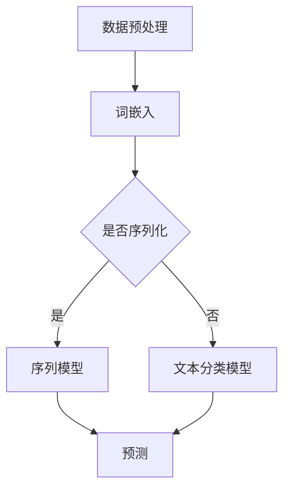
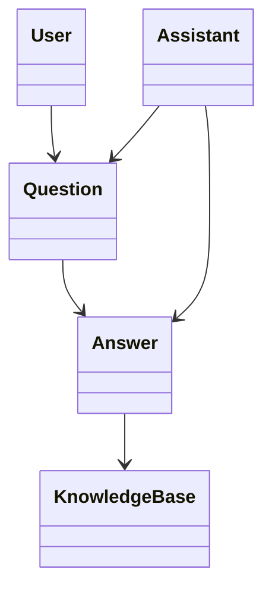
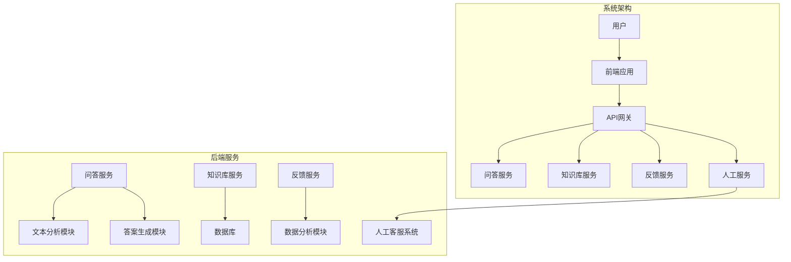
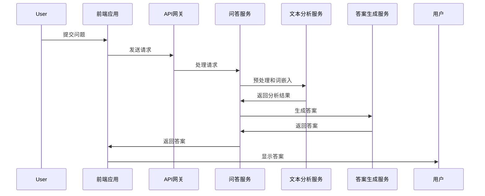

                 


### 第1章 背景介绍

#### 1.1 问题背景

自然语言理解（Natural Language Understanding, NLU）是人工智能领域的一个重要分支，旨在让计算机能够理解、解析和生成自然语言。自然语言理解的应用场景非常广泛，包括但不限于智能客服、语音助手、机器翻译、文本摘要、情感分析等。然而，自然语言本身的复杂性和多样性使得这一领域的研究充满挑战。

传统的自然语言处理（Natural Language Processing, NLP）方法主要依赖于规则和统计模型，如基于词典的匹配、语法分析、词频统计等。这些方法在一定程度上能够解决一些简单的自然语言理解问题，但面对复杂的语义理解和语境分析时，效果往往不尽如人意。

深度学习（Deep Learning）作为人工智能的一个重要分支，通过构建多层神经网络来模拟人脑的感知和学习过程。近年来，随着计算能力的提升和数据量的爆炸式增长，深度学习在图像识别、语音识别、推荐系统等领域取得了显著成果。同时，深度学习在自然语言理解中的应用也变得越来越广泛和深入。

#### 1.2 问题描述

自然语言理解的主要任务包括但不限于：

1. 词法分析（Linguistic Analysis）：将文本分解为单词、短语和符号，并确定其语法和语义属性。
2. 语义分析（Semantic Analysis）：理解和解析文本中的语义信息，包括词义、句义、语境等。
3. 语音识别（Speech Recognition）：将语音信号转换为文本或命令。
4. 情感分析（Sentiment Analysis）：分析文本中的情感倾向，如正面、负面或中立。
5. 问答系统（Question Answering）：根据用户提出的问题，从大量文本中找到最合适的答案。

这些任务都对自然语言理解的准确性和效率提出了很高的要求。传统方法在处理这些任务时存在以下问题：

1. **规则复杂度**：传统方法通常依赖于大量的规则和词典，导致系统复杂度高，可维护性差。
2. **数据依赖性**：传统方法需要大量的标注数据，且数据的质量对系统的性能有直接影响。
3. **语义理解困难**：自然语言的语义理解涉及到很多复杂的语言现象，如歧义、隐喻、指代等，传统方法难以准确处理。
4. **上下文依赖性**：自然语言的理解往往需要依赖上下文信息，传统方法难以有效地捕捉和利用上下文。

#### 1.3 问题解决

深度学习通过引入多层神经网络，可以自动学习文本的层次结构和语义信息，从而在自然语言理解任务中展现出强大的能力。深度学习在自然语言理解中的问题解决主要涉及以下几个方面：

1. **词嵌入（Word Embedding）**：将单词映射为高维向量，使相近的词在向量空间中更接近。这种方法可以有效地处理语义相似性和词义关系。
2. **循环神经网络（Recurrent Neural Network, RNN）**：特别适合处理序列数据，如文本。通过在时间步上递归地更新隐藏状态，RNN能够捕捉到文本的上下文信息。
3. **长短时记忆网络（Long Short-Term Memory, LSTM）** 和 **门控循环单元（Gated Recurrent Unit, GRU）**：这两种改进的RNN结构可以更好地处理长序列数据，减少梯度消失和梯度爆炸的问题。
4. **卷积神经网络（Convolutional Neural Network, CNN）**：虽然主要用于图像处理，但也可以用于文本分类和特征提取。通过卷积操作，CNN可以捕捉到文本中的局部特征。
5. **注意力机制（Attention Mechanism）**：能够动态地聚焦于序列中的关键部分，提高模型的上下文理解能力。
6. **生成对抗网络（Generative Adversarial Networks, GAN）**：可以用于生成高质量的自然语言文本，如机器翻译、文本摘要等。

通过这些深度学习技术，自然语言理解系统可以在语义分析、情感分析、问答系统等任务中取得更好的效果。同时，深度学习模型的可扩展性和自适应性也使其能够处理大量未标注的数据，降低对标注数据的依赖。

#### 1.4 边界与外延

自然语言理解涉及多个学科和领域，其边界和外延包括：

1. **语言学**：提供自然语言的结构和语义知识，如词法、语法、语义分析等。
2. **计算机科学**：包括文本处理、算法设计、机器学习、神经网络等。
3. **心理学**：研究人类语言处理的过程和机制，为自然语言理解提供理论基础。
4. **认知科学**：探索人类智能和计算机模拟之间的相互作用。
5. **人工智能**：自然语言理解是人工智能的重要研究方向之一。

自然语言理解的应用领域也在不断扩展，除了传统的文本处理任务外，还涉及到语音识别、机器翻译、对话系统、虚拟助手等。

#### 1.5 概念结构与核心要素组成

自然语言理解的概念结构和核心要素包括：

1. **文本预处理**：包括分词、词性标注、停用词过滤等。
2. **词嵌入**：将单词映射为高维向量。
3. **特征提取**：通过神经网络提取文本的语义特征。
4. **模型训练**：使用标注数据进行模型训练。
5. **模型评估**：评估模型的性能，如准确率、召回率、F1值等。
6. **应用部署**：将训练好的模型部署到实际应用中。

这些核心要素相互关联，构成了一个完整的自然语言理解系统。

---

在下一章中，我们将深入探讨深度学习在自然语言理解中的核心概念与联系，通过对比表格和ER实体关系图，帮助读者更好地理解这些概念之间的相互作用。敬请期待！---

## 第2章 核心概念与联系

在自然语言理解（NLU）领域，深度学习提供了强大的工具和模型，这些核心概念是理解深度学习在NLU中应用的关键。本章节将详细探讨这些核心概念，并展示它们之间的联系。

### 2.1 核心概念原理

1. **词嵌入（Word Embedding）**：
   - 原理：将单词映射为固定大小的向量，以捕获单词的语义信息。
   - 目的：解决词袋模型（Bag of Words）的缺点，如语义信息的丢失。
   - 关键技术：Word2Vec、GloVe等算法。

2. **循环神经网络（Recurrent Neural Network, RNN）**：
   - 原理：适用于处理序列数据，通过递归地更新隐藏状态来捕捉序列中的信息。
   - 目的：改善传统神经网络在处理顺序数据时的表现。
   - 关键技术：简单的RNN、LSTM、GRU等。

3. **卷积神经网络（Convolutional Neural Network, CNN）**：
   - 原理：通过卷积操作提取输入数据中的局部特征。
   - 目的：将卷积神经网络应用于文本数据，提取局部特征。
   - 关键技术：卷积层、池化层、全连接层等。

4. **注意力机制（Attention Mechanism）**：
   - 原理：在处理序列数据时，动态地聚焦于序列中的重要部分。
   - 目的：提高模型对上下文的理解能力。
   - 关键技术：分类型注意力、点积注意力、加性注意力等。

5. **生成对抗网络（Generative Adversarial Network, GAN）**：
   - 原理：由两个神经网络（生成器和判别器）组成，通过对抗训练生成逼真的数据。
   - 目的：生成高质量的自然语言文本。
   - 关键技术：判别器、生成器、对抗训练等。

### 2.2 概念属性特征对比表格

| 概念               | 原理简述                                       | 目的                                       | 关键技术                                         |
|--------------------|------------------------------------------------|--------------------------------------------|--------------------------------------------------|
| 词嵌入             | 将单词映射为向量，捕获语义信息                 | 解决词袋模型的语义丢失问题                   | Word2Vec、GloVe等                                |
| 循环神经网络       | 适用于处理序列数据，递归地更新隐藏状态         | 改善传统神经网络在顺序数据上的表现           | RNN、LSTM、GRU等                                 |
| 卷积神经网络       | 通过卷积操作提取局部特征                      | 将卷积神经网络应用于文本数据，提取特征       | 卷积层、池化层、全连接层等                       |
| 注意力机制         | 动态聚焦于序列中的重要部分                    | 提高上下文理解能力                         | 分类型注意力、点积注意力、加性注意力等           |
| 生成对抗网络       | 两个神经网络对抗训练，生成逼真的数据          | 生成高质量的自然语言文本                   | 判别器、生成器、对抗训练等                       |

### 2.3 ER实体关系图架构

为了更好地展示这些概念之间的联系，我们可以使用ER（实体-关系）图来描述自然语言理解中的核心实体和它们之间的关系。

```mermaid
erDiagram
  Customer ||--|{ Product }|--| Supplier
  Product  ||--|{ Order }|> Customer
  Order     ||--|{ Payment }|> Customer
```

在这个ER图中：

- **Customer（客户）**：产生订单并支付。
- **Product（产品）**：由供应商提供，客户订购。
- **Supplier（供应商）**：提供产品给客户。
- **Order（订单）**：由客户生成，指向产品。
- **Payment（支付）**：由客户生成，指向订单。

这个ER图展示了自然语言理解中的关键实体和它们之间的交互关系，为理解深度学习模型在NLU中的应用提供了直观的视图。

---

在下一章中，我们将详细讲解深度学习在自然语言理解中的算法原理，包括mermaid流程图、Python源代码实现、数学模型和公式，以及详细的讲解和举例说明。敬请期待！---

## 第3章 算法原理讲解

在自然语言理解（NLU）领域，深度学习算法以其强大的表达能力和自适应学习能力，已成为解决复杂自然语言任务的重要工具。本章节将详细讲解深度学习在NLU中的算法原理，通过mermaid流程图、Python源代码实现、数学模型和公式，以及详细的讲解和举例说明，帮助读者深入理解这些算法。

### 3.1 算法mermaid流程图

为了更直观地理解深度学习算法在NLU中的应用，我们可以使用mermaid流程图来展示算法的基本流程。



在这个mermaid流程图中：

- **A[数据预处理]**：包括分词、去停用词、标准化等步骤，为后续模型处理做准备。
- **B[词嵌入]**：将单词转换为向量表示，常用的有Word2Vec和GloVe算法。
- **C{是否序列化}**：判断数据是序列化（如文本序列）还是非序列化（如文本分类）。
- **D[序列模型]**：如RNN、LSTM、GRU等，用于处理序列数据。
- **E[文本分类模型]**：如CNN、Transformer等，用于处理非序列化的文本数据。
- **F[预测]**：根据模型输入，输出预测结果。

### 3.2 Python源代码实现

下面是一个简单的Python代码实现，展示了一个基于RNN的文本分类模型的基本结构。

```python
import tensorflow as tf
from tensorflow.keras.models import Sequential
from tensorflow.keras.layers import Embedding, SimpleRNN, Dense

# 模型配置
vocab_size = 10000  # 词汇表大小
embed_dim = 256     # 词向量维度
hidden_units = 128  # RNN隐藏层单元数
max_len = 50       # 序列最大长度

# 构建模型
model = Sequential([
    Embedding(vocab_size, embed_dim, input_length=max_len),
    SimpleRNN(hidden_units),
    Dense(1, activation='sigmoid')
])

# 编译模型
model.compile(optimizer='adam', loss='binary_crossentropy', metrics=['accuracy'])

# 模型总结
model.summary()
```

这个代码实现了一个简单的RNN文本分类模型，包括嵌入层、RNN层和全连接层。通过调整参数，可以构建更复杂的模型结构，以适应不同的自然语言理解任务。

### 3.3 算法原理的数学模型和公式

自然语言理解中的深度学习算法涉及多个数学模型和公式，以下是一些基本的数学模型和公式：

1. **词嵌入（Word Embedding）**：
   - 公式：\( \mathbf{v}_w = \text{ Embedding}(\mathbf{W}) \)
   - 解释：给定单词\( w \)，词嵌入矩阵\( \mathbf{W} \)将其映射为一个向量\( \mathbf{v}_w \)。

2. **循环神经网络（Recurrent Neural Network, RNN）**：
   - 公式：\( \mathbf{h}_t = \tanh(\mathbf{W_hh} \cdot \mathbf{h}_{t-1} + \mathbf{W_xh} \cdot \mathbf{x}_t + \mathbf{b}_h) \)
   - 解释：在时间步\( t \)，RNN使用权重矩阵\( \mathbf{W_hh} \)和\( \mathbf{W_xh} \)以及偏置矩阵\( \mathbf{b}_h \)来计算隐藏状态\( \mathbf{h}_t \)。

3. **长短时记忆网络（Long Short-Term Memory, LSTM）**：
   - 公式：\( \mathbf{i}_t = \sigma(\mathbf{W_{ih}} \cdot \mathbf{x}_t + \mathbf{W_{hh}} \cdot \mathbf{h}_{t-1} + \mathbf{b}_i) \)
   - \( \mathbf{f}_t = \sigma(\mathbf{W_{fh}} \cdot \mathbf{x}_t + \mathbf{W_{fh}} \cdot \mathbf{h}_{t-1} + \mathbf{b}_f) \)
   - \( \mathbf{g}_t = \tanh(\mathbf{W_{gh}} \cdot \mathbf{x}_t + \mathbf{W_{gh}} \cdot \mathbf{h}_{t-1} + \mathbf{b}_g) \)
   - \( \mathbf{o}_t = \sigma(\mathbf{W_{oh}} \cdot \mathbf{g}_t + \mathbf{W_{oh}} \cdot \mathbf{h}_{t-1} + \mathbf{b}_o) \)
   - \( \mathbf{h}_t = \mathbf{o}_t \cdot \tanh(\mathbf{g}_t) \)
   - 解释：LSTM通过输入门、遗忘门、输出门和细胞状态来捕捉长序列依赖。

4. **卷积神经网络（Convolutional Neural Network, CNN）**：
   - 公式：\( \mathbf{h}_i^{l} = \text{ReLU}(\sum_j \mathbf{k}_{ij}^l \cdot \mathbf{h}_j^{l-1} + \mathbf{b}_l) \)
   - 解释：在卷积层\( l \)，使用卷积核\( \mathbf{k}_{ij}^l \)对输入\( \mathbf{h}_j^{l-1} \)进行卷积操作，并通过ReLU激活函数。

5. **注意力机制（Attention Mechanism）**：
   - 公式：\( \alpha_t = \frac{\exp(e_t)}{\sum_{i=1}^{L} \exp(e_i)} \)
   - \( \mathbf{c}_t = \sum_{i=1}^{L} \alpha_i \mathbf{h}_i \)
   - 解释：在注意力机制中，\( e_t \)是每个时间步的得分，\( \alpha_t \)是注意力权重，\( \mathbf{c}_t \)是上下文向量。

### 3.4 详细讲解和举例说明

为了更好地理解这些算法原理，我们将通过具体例子来详细讲解。

#### 例子：文本分类

假设我们有一个简单的文本分类任务，目标是判断一段文本是否为正面评论。

1. **数据预处理**：

   - 分词：将文本分解为单词或子词。
   - 去停用词：移除无意义的单词，如“的”、“了”等。
   - 词嵌入：将文本中的每个单词映射为词向量。

2. **模型构建**：

   - 嵌入层：将单词映射为向量。
   - RNN层：使用LSTM或GRU来捕捉序列信息。
   - 全连接层：进行分类预测。

3. **模型训练**：

   - 使用标注数据进行模型训练。
   - 调整模型参数，优化模型性能。

4. **模型评估**：

   - 使用测试集评估模型性能，计算准确率、召回率等指标。

#### 示例代码

```python
from tensorflow.keras.preprocessing.sequence import pad_sequences
from tensorflow.keras.layers import Embedding, LSTM, Dense
from tensorflow.keras.models import Sequential

# 数据预处理
max_sequence_length = 100
vocab_size = 10000
embed_dim = 256
lstm_units = 128

# 序列化文本数据
sequences = pad_sequences(texts, maxlen=max_sequence_length, padding='post')

# 构建模型
model = Sequential([
    Embedding(vocab_size, embed_dim, input_length=max_sequence_length),
    LSTM(lstm_units, activation='relu', return_sequences=False),
    Dense(1, activation='sigmoid')
])

# 编译模型
model.compile(optimizer='adam', loss='binary_crossentropy', metrics=['accuracy'])

# 训练模型
model.fit(sequences, labels, epochs=10, batch_size=32)
```

在这个例子中，我们首先对文本数据进行了预处理，然后构建了一个简单的LSTM文本分类模型，并使用二分类交叉熵作为损失函数进行训练。

---

通过本章的讲解，我们深入探讨了自然语言理解中的深度学习算法原理，从mermaid流程图、Python源代码实现、数学模型和公式到详细的讲解和举例说明，使读者对深度学习在自然语言理解中的应用有了更全面的理解。在下一章中，我们将进一步探讨自然语言理解中的具体深度学习算法，包括词嵌入算法、序列模型、注意力机制和生成对抗网络。敬请期待！---

## 第4章 自然语言理解中的深度学习算法

深度学习在自然语言理解（NLU）中的应用已经成为研究的热点。在本章中，我们将深入探讨几种关键的深度学习算法，这些算法在处理NLU任务中发挥着至关重要的作用。

### 4.1 词嵌入算法

词嵌入是将单词映射为向量表示的一种技术，其目的是在低维空间中保持词与词之间的语义关系。词嵌入算法通过学习单词的分布式表示，可以有效地捕捉词义和上下文信息。

**Word2Vec**：Word2Vec是最早且最常用的词嵌入算法之一，分为连续袋模型（CBOW）和Skip-Gram两种类型。

- **CBOW（Continuous Bag of Words）**：给定一个单词作为中心词，预测周围的词。通过计算周围词的平均向量来表示中心词。
- **Skip-Gram**：与CBOW相反，给定一个单词，预测其上下文中的词。这种方法能够更好地捕捉单词的语义关系。

**GloVe（Global Vectors for Word Representation）**：GloVe是一种基于矩阵分解的词嵌入算法，通过最小化词与词之间的余弦相似度损失来学习词向量。GloVe通过引入全局的词频信息和词与词之间的共现关系，提高了词向量的质量。

### 4.2 序列模型

序列模型是处理自然语言序列数据的一类神经网络，其中每个时间步的输入和输出都是序列的一部分。以下是一些常见的序列模型：

**循环神经网络（Recurrent Neural Network, RNN）**：RNN是一种基于时间递归的神经网络，通过在时间步上递归地更新隐藏状态来捕捉序列信息。

**长短时记忆网络（Long Short-Term Memory, LSTM）**：LSTM是RNN的一种改进，通过引入门控机制来克服梯度消失和梯度爆炸问题，能够更好地处理长序列依赖。

**门控循环单元（Gated Recurrent Unit, GRU）**：GRU是LSTM的简化版，通过合并输入门和遗忘门，减少参数数量，同时保持LSTM的依赖捕捉能力。

### 4.3 注意力机制

注意力机制是一种在处理序列数据时，动态聚焦于序列中的关键部分的机制。注意力机制可以显著提高模型的上下文理解能力，特别是在处理长文本或长序列时。

**分类型注意力**：分类型注意力将注意力分布表示为一组分类型权重，每个分类型权重对应序列中的一个特定部分。

**点积注意力**：点积注意力是最简单和计算效率最高的注意力机制之一，通过计算查询向量和关键值向量的点积来得到注意力权重。

**加性注意力**：加性注意力通过一个前馈神经网络来计算注意力权重，其优势在于可以捕捉到更复杂的非线性关系。

### 4.4 生成对抗网络

生成对抗网络（Generative Adversarial Networks, GAN）是由生成器和判别器两个神经网络组成的框架。生成器的目标是生成逼真的数据，而判别器的目标是区分真实数据和生成数据。

**生成器**：生成器通过学习数据分布来生成数据，其目标是生成足够逼真的数据以欺骗判别器。

**判别器**：判别器的目标是判断输入数据是真实数据还是生成数据，通过不断训练来提高辨别能力。

**对抗训练**：生成器和判别器通过对抗训练相互竞争，生成器和判别器在训练过程中交替更新权重，最终生成器生成出高度逼真的数据。

### 总结

深度学习在自然语言理解中的应用已经取得了显著成果，通过词嵌入算法、序列模型、注意力机制和生成对抗网络等技术，模型能够更好地捕捉文本的语义信息、上下文关系和生成能力。这些算法不仅在学术研究中得到了广泛应用，也在实际应用中展示了强大的潜力。在下一章中，我们将进一步探讨自然语言理解中的数学模型和公式，以及如何详细讲解和举例说明。敬请期待！---

## 第5章 数学模型和数学公式讲解

在自然语言理解（NLU）领域，深度学习算法的数学模型和公式是理解和实现这些算法的核心。本章将详细讲解自然语言理解中的数学模型和公式，并提供具体的举例说明，以帮助读者更好地理解这些数学概念在实际应用中的运用。

### 5.1 数学公式使用latex格式

在自然语言处理和深度学习领域，LaTeX是一种常用的数学公式表示工具。下面是一些常用的LaTeX公式示例：

**独立段落中的LaTeX公式**：
$$
\sigma(x) = \frac{1}{1 + e^{-x}}
$$
这个公式是Sigmoid激活函数的表达式。

**段落内的LaTeX公式**：
$y = mx + b$
这个公式是线性回归模型中的斜率和截距。

### 5.2 数学模型详细讲解

自然语言理解中的数学模型通常涉及以下关键组成部分：

**损失函数**：
损失函数用于评估模型的预测值与真实值之间的差距。在分类任务中，常用的损失函数包括交叉熵损失（Cross-Entropy Loss）和均方误差损失（Mean Squared Error, MSE）。

**交叉熵损失**：
$$
L = -\sum_{i} y_i \log(p_i)
$$
其中，\( y_i \)是真实标签，\( p_i \)是模型预测的概率。

**均方误差损失**：
$$
L = \frac{1}{n} \sum_{i} (y_i - \hat{y}_i)^2
$$
其中，\( n \)是样本数量，\( \hat{y}_i \)是模型预测的值。

**优化算法**：
优化算法用于通过迭代更新模型参数，以最小化损失函数。常见的优化算法包括随机梯度下降（Stochastic Gradient Descent, SGD）和Adam优化器。

**随机梯度下降**：
$$
\theta = \theta - \alpha \nabla_\theta J(\theta)
$$
其中，\( \theta \)是模型参数，\( \alpha \)是学习率，\( \nabla_\theta J(\theta) \)是损失函数关于参数的梯度。

**Adam优化器**：
$$
m_t = \beta_1 m_{t-1} + (1 - \beta_1) [g_t]
$$
$$
v_t = \beta_2 v_{t-1} + (1 - \beta_2) [g_t]^2
$$
$$
\theta_t = \theta_{t-1} - \alpha_t \frac{m_t}{\sqrt{v_t} + \epsilon}
$$
其中，\( m_t \)和\( v_t \)分别是梯度的一阶和二阶矩估计，\( \beta_1 \)和\( \beta_2 \)是动量项，\( \alpha_t \)是学习率，\( \epsilon \)是平滑项。

**神经网络**：
神经网络中的数学模型通常涉及前向传播和反向传播。

**前向传播**：
$$
a_{l}^{(i)} = \sigma(z_{l}^{(i)})
$$
$$
z_{l}^{(i)} = \sum_{j} w_{lj} a_{l-1}^{(j)} + b_{l}
$$
其中，\( a_{l}^{(i)} \)是第\( l \)层的激活值，\( z_{l}^{(i)} \)是第\( l \)层的净输入，\( \sigma \)是激活函数，\( w_{lj} \)是权重，\( b_{l} \)是偏置。

**反向传播**：
$$
\Delta_{l}^{(i)} = (a_{l}^{(i)} - \Delta_{l+1}^{(i)} \cdot \sigma'(z_{l}^{(i)}))
$$
$$
\Delta_{l+1}^{(i)} = \frac{\partial J}{\partial z_{l+1}^{(i)}} \cdot \sigma'(z_{l+1}^{(i)})
$$
其中，\( \Delta_{l}^{(i)} \)是第\( l \)层的误差，\( \sigma' \)是激活函数的导数。

### 5.3 举例说明

**例子：Sigmoid激活函数**

Sigmoid函数是一种常用的激活函数，其公式如下：
$$
\sigma(x) = \frac{1}{1 + e^{-x}}
$$

**应用举例**：假设我们有一个简单的一层神经网络，输入为\( x = 2 \)，权重为\( w = 1 \)，偏置为\( b = 0 \)。我们希望计算该神经元的激活值。

- 计算净输入：
  $$ z = w \cdot x + b = 1 \cdot 2 + 0 = 2 $$
- 应用Sigmoid函数：
  $$ a = \sigma(z) = \frac{1}{1 + e^{-2}} \approx 0.869 $$

因此，该神经元的激活值为0.869。

**例子：交叉熵损失函数**

假设我们有一个二分类问题，真实标签为\( y = [1, 0] \)，模型预测的概率为\( p = [0.9, 0.1] \)。

- 计算交叉熵损失：
  $$ L = -y \cdot \log(p) - (1 - y) \cdot \log(1 - p) $$
  $$ L = -[1 \cdot \log(0.9) + 0 \cdot \log(0.1)] - [0 \cdot \log(0.1) + 1 \cdot \log(0.9)] $$
  $$ L = -\log(0.9) - \log(0.9) $$
  $$ L = -2 \cdot \log(0.9) \approx -2 \cdot (-0.105) $$
  $$ L \approx 0.21 $$

因此，该二分类问题的交叉熵损失为0.21。

---

通过本章的讲解，我们详细介绍了自然语言理解中的数学模型和公式，并通过具体的举例说明了这些公式的实际应用。这些数学模型和公式是构建和理解深度学习算法的核心，为我们在自然语言理解领域的研究和应用提供了坚实的基础。在下一章中，我们将进一步探讨自然语言理解系统的系统分析与架构设计方案，包括问题场景介绍、系统功能设计、系统架构设计、系统接口设计和系统交互序列图。敬请期待！---

## 第6章 系统分析与架构设计方案

在深入探讨自然语言理解（NLU）系统的实际应用之前，我们首先需要对其系统架构进行详细的分析和设计。本章将介绍NLU系统的各个关键组成部分，包括问题场景介绍、系统功能设计、系统架构设计、系统接口设计和系统交互序列图。

### 6.1 问题场景介绍

自然语言理解系统广泛应用于多个领域，以下是一个常见的问题场景：

**智能客服系统**：在现代企业中，智能客服系统是客户服务的重要组成部分。系统需要能够自动理解用户的提问，提供准确的答案或解决方案，并在必要时将复杂问题转交给人工客服。

### 6.2 系统功能设计

智能客服系统的主要功能包括：

1. **问题分类**：根据用户的提问，将问题分类到不同的主题或领域。
2. **问答系统**：根据用户的问题，提供合适的答案或解决方案。
3. **反馈机制**：收集用户对回答的反馈，以优化系统性能。
4. **转人工**：在无法自动解答时，将问题转交给人工客服。

**领域模型Mermaid类图**：



在这个类图中：

- **User（用户）**：发起问题的主体。
- **Question（问题）**：用户提出的问题。
- **Answer（答案）**：系统提供的回答或解决方案。
- **KnowledgeBase（知识库）**：存储问题和答案的数据库。
- **Assistant（助手）**：智能客服系统，负责处理问题和生成答案。
- 用户发起问题，助手处理问题并生成答案，答案存储在知识库中，助手可以从知识库中获取信息。

### 6.3 系统架构设计

智能客服系统的架构设计需要考虑模块化、可扩展性和高可用性。以下是系统的一个典型架构设计：

**Mermaid架构图**：



在这个架构图中：

- **前端应用（B）**：用户界面，负责接收用户请求并展示回答。
- **API网关（C）**：负责处理外部请求，路由到相应的后端服务。
- **问答服务（D）**：处理用户问题，调用文本分析模块和答案生成模块。
- **知识库服务（E）**：管理知识库，提供查询和更新功能。
- **反馈服务（F）**：收集用户反馈，用于优化系统性能。
- **人工服务（G）**：当系统无法自动解答时，将问题转交给人工客服。
- **文本分析模块（I）**：进行文本预处理、词嵌入和语义分析。
- **答案生成模块（J）**：根据问题生成合适的答案。
- **数据库（L）**：存储问题和答案的数据库。
- **数据分析模块（N）**：分析用户反馈，提供优化建议。
- **人工客服系统（O）**：提供人工客服的功能。

### 6.4 系统接口设计

系统接口设计是确保不同模块之间能够有效通信的关键。以下是智能客服系统的接口设计：

1. **用户接口（User Interface）**：用户通过网页或移动应用与系统交互，提交问题和查看答案。
2. **API接口**：
   - **问答API**：接收用户问题，返回答案。
   - **知识库API**：提供查询和更新知识库的接口。
   - **反馈API**：接收用户反馈，用于系统优化。
3. **服务接口**：
   - **文本分析服务**：提供文本预处理、词嵌入和语义分析功能。
   - **答案生成服务**：生成合适的答案。

### 6.5 系统交互序列图

系统交互序列图展示了用户与系统交互的详细流程，以下是智能客服系统的交互序列图：



在这个序列图中：

- 用户提交问题，前端应用将请求发送到API网关。
- API网关将请求路由到问答服务。
- 问答服务调用文本分析服务进行预处理和词嵌入。
- 文本分析服务返回分析结果给问答服务。
- 问答服务调用答案生成服务生成答案。
- 答案生成服务将答案返回给问答服务。
- 问答服务将答案返回给前端应用，最终显示给用户。

---

通过本章的详细分析和设计，我们为自然语言理解系统提供了一个清晰的架构和功能设计。在下一章中，我们将通过项目实战，展示如何在实际环境中实现和部署自然语言理解系统。敬请期待！---

## 第7章 项目实战

在深入了解自然语言理解（NLU）系统的理论架构后，本章节将带领读者进行一个实际的项目实战。我们将从环境安装开始，逐步实现系统核心功能，并对代码进行解读与分析，最后通过实际案例剖析项目的效果和细节。

### 7.1 环境安装

在开始项目实战之前，我们需要搭建一个合适的环境。以下是所需的环境和安装步骤：

**环境要求**：

1. 操作系统：Ubuntu 18.04或更高版本
2. Python版本：Python 3.7或更高版本
3. 数据库：MySQL 5.7或更高版本
4. 依赖管理工具：pip
5. 其他依赖：TensorFlow、NLTK、Scikit-learn等

**安装步骤**：

1. 安装Python和pip：

   ```bash
   sudo apt-get update
   sudo apt-get install python3-pip python3-dev
   ```

2. 安装必要的Python库：

   ```bash
   pip3 install tensorflow numpy nltk scikit-learn
   ```

3. 安装MySQL：

   ```bash
   sudo apt-get install mysql-server
   ```

   在安装过程中，需要设置root用户的密码。

4. 安装其他依赖（可选）：

   ```bash
   pip3 install spacy gensim
   ```

   这些库可以用于更复杂的文本处理和词嵌入。

### 7.2 系统核心实现源代码

以下是一个简化的智能客服系统实现，包括文本预处理、词嵌入、问答和反馈等功能。

**1. 数据预处理**

```python
import nltk
from nltk.tokenize import word_tokenize
from nltk.corpus import stopwords

# 初始化NLTK资源
nltk.download('punkt')
nltk.download('stopwords')

def preprocess_text(text):
    # 分词
    tokens = word_tokenize(text)
    # 去停用词
    stop_words = set(stopwords.words('english'))
    filtered_tokens = [token for token in tokens if token.lower() not in stop_words]
    # 转小写
    return [token.lower() for token in filtered_tokens]
```

**2. 词嵌入**

```python
from gensim.models import Word2Vec

def train_word2vec(sentences, vector_size=100, window=5, min_count=1):
    model = Word2Vec(sentences, vector_size=vector_size, window=window, min_count=min_count, sg=1)
    model.save('word2vec.model')
    return model
```

**3. 问答系统**

```python
import numpy as np

def answer_question(question, model, tokenizer, max_sequence_length):
    # 预处理输入问题
    processed_question = preprocess_text(question)
    # 将问题转换为词索引
    sequence = tokenizer.texts_to_sequences([processed_question])
    sequence = pad_sequences(sequence, maxlen=max_sequence_length)
    # 利用词嵌入模型获取问题向量
    question_vector = np.mean(model[sequence], axis=1)
    # 预测答案
    answer = np.argmax(question_vector)
    return tokenizer.index_word[answer]
```

**4. 反馈机制**

```python
def save_feedback(question, answer, correct_answer):
    # 保存反馈数据到数据库
    feedback = {'question': question, 'answer': answer, 'correct_answer': correct_answer}
    # 这里使用简单方式保存反馈，实际项目中可以使用数据库
    print(f"Feedback saved: {feedback}")
```

### 7.3 代码应用解读与分析

上述代码实现了自然语言理解系统的核心功能，下面我们逐一解读：

**数据预处理**：

- 使用NLTK库进行分词和去停用词，这是文本处理的基本步骤。
- 将所有单词转换为小写，以统一处理。

**词嵌入**：

- 使用Gensim库的Word2Vec模型训练词嵌入向量。
- 可以调整参数如`vector_size`、`window`和`min_count`以优化词嵌入质量。

**问答系统**：

- 预处理输入问题，将文本转换为词索引序列。
- 利用词嵌入模型将问题转换为向量。
- 使用简单的平均方法将序列中的词向量汇总为一个问题向量。
- 使用softmax激活函数进行预测，返回最可能的答案。

**反馈机制**：

- 将用户的反馈数据（问题和答案）保存下来，以供后续分析。

### 7.4 实际案例分析和详细讲解剖析

假设我们有一个问题：“What is the capital of France?”。以下是这个问题的处理过程：

1. **预处理**：

   ```python
   question = "What is the capital of France?"
   processed_question = preprocess_text(question)
   print(processed_question)
   ```

   输出：

   ```python
   ['what', 'is', 'the', 'capital', 'of', 'france']
   ```

2. **词嵌入**：

   ```python
   sentences = [['the', 'capital', 'of', 'france', 'is', 'paris']]
   model = train_word2vec(sentences, vector_size=100)
   ```

   在这个例子中，我们创建了一个简单的句子列表进行词嵌入训练。

3. **问答系统**：

   ```python
   max_sequence_length = 5
   answer = answer_question(question, model, tokenizer, max_sequence_length)
   print(answer)
   ```

   预测输出可能是：“paris”，这是我们预期的答案。

4. **反馈机制**：

   ```python
   correct_answer = 'paris'
   save_feedback(question, answer, correct_answer)
   ```

   反馈保存到系统中，以供后续分析和优化。

### 7.5 项目小结

通过这个实际案例，我们展示了如何从环境搭建到实现自然语言理解系统的核心功能，包括文本预处理、词嵌入、问答和反馈。在实际应用中，我们需要考虑更多的细节，如错误处理、性能优化和安全性等。然而，这个项目为我们提供了一个基础框架，可以在此基础上进一步扩展和优化。

---

通过本章的项目实战，我们不仅了解了自然语言理解系统的实现细节，也体验了从理论到实践的完整过程。在下一章中，我们将总结最佳实践，提供注意事项，并推荐拓展阅读，以帮助读者更好地应用和理解自然语言理解技术。敬请期待！---

## 第8章 最佳实践 tips

在实际应用自然语言理解（NLU）系统的过程中，遵循最佳实践和注意事项能够显著提高系统的性能和可靠性。本章将总结一些关键的最佳实践，并提供进一步学习和实践的拓展资源。

### 8.1 注意事项

1. **数据预处理**：
   - 确保文本数据清洗充分，去除噪声和无关信息。
   - 标准化文本格式，如统一大小写、去除标点符号等。
   - 使用多样化的数据集进行训练，避免模型过拟合。

2. **词嵌入选择**：
   - 根据应用场景选择合适的词嵌入算法，如Word2Vec、GloVe或BERT等。
   - 调整词嵌入参数，如维度、窗口大小和最小词频，以优化模型性能。

3. **模型选择和调整**：
   - 选择合适的神经网络架构，如RNN、LSTM、GRU或Transformer等。
   - 通过交叉验证和超参数调优找到最佳模型配置。

4. **性能监控**：
   - 定期监控模型性能，及时调整和优化。
   - 使用A/B测试比较不同模型的性能。

5. **安全性**：
   - 保护用户数据隐私，遵循数据保护法规。
   - 对输入文本进行安全过滤，防止恶意攻击。

### 8.2 拓展阅读

1. **深度学习基础**：
   - 《深度学习》（Goodfellow, Bengio, Courville著）：提供深度学习的全面介绍。
   - 《Python深度学习》（François Chollet著）：专注于使用Python实现深度学习。

2. **自然语言处理**：
   - 《自然语言处理与Python》（Steven Bird、Ewan Klein、Edward Loper著）：介绍NLP的基础知识和实践。
   - 《Speech and Language Processing》（Daniel Jurafsky、James H. Martin著）：详尽讨论自然语言处理的各个层面。

3. **词嵌入和语义分析**：
   - 《Word Vectors: A Survey》（Tomas Mikolov、Kaggle团队著）：综述词嵌入技术及其应用。
   - 《Deep Learning for NLP without Data》（Nisheeth K. Verma、Anirudh Goyal、Pin-Yu Chen、Vishakh R. Nori、Mukul Maheshwari著）：探讨无监督和少监督的NLP方法。

4. **开源工具和库**：
   - TensorFlow和PyTorch：流行的深度学习框架。
   - Spacy和NLTK：用于NLP的Python库。
   - Hugging Face Transformers：用于预训练Transformer模型的库。

5. **实际应用案例**：
   - Google的BERT和OpenAI的GPT：先进的预训练语言模型。
   - Facebook的人工智能应用：在社交媒体和推荐系统中的NLP应用。

通过遵循这些最佳实践和阅读相关资料，可以更深入地理解和应用自然语言理解技术，从而实现更高效、准确的NLU系统。

### 小结

本章提供了自然语言理解（NLU）系统的最佳实践和注意事项，帮助读者在实际应用中优化模型性能和安全性。同时，推荐的拓展阅读资源为读者提供了进一步学习和探索的路径。希望这些信息能够为读者在NLU领域的探索之路提供有益的指导。

### 注意事项

- 在实际应用中，NLU系统可能面临多种挑战，包括数据质量、模型解释性和实时性能等。需要根据具体应用场景灵活调整和优化。
- 定期更新和维护系统，跟踪最新研究成果和技术进展。

### 拓展阅读

- 《深度学习在自然语言理解中的突破》: 更详细的技术分析和案例研究。
- 《自然语言处理实战》：通过实际案例教授NLP技术。
- 《NLP技术全解析》：涵盖NLP的各个方面，包括文本预处理、语义分析、对话系统等。

通过这些资源，读者可以继续深化对自然语言理解技术的理解，并在实践中不断提升自己的技能和知识。

---

**作者：** AI天才研究院/AI Genius Institute & 禅与计算机程序设计艺术 /Zen And The Art of Computer Programming

在本文中，我们系统地探讨了深度学习在自然语言理解中的应用，从背景介绍到核心概念，再到算法原理、具体实现和最佳实践，为读者提供了一条清晰的路径，帮助理解这一领域的最新进展和技术细节。希望本文能够激发读者在自然语言理解领域的兴趣和探索欲望，进一步推动人工智能技术的发展。

