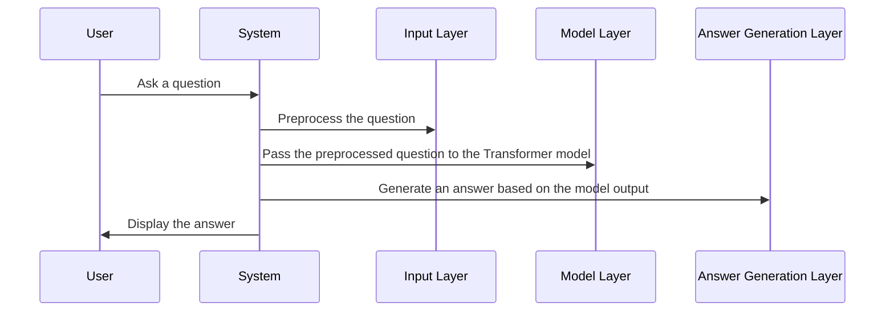
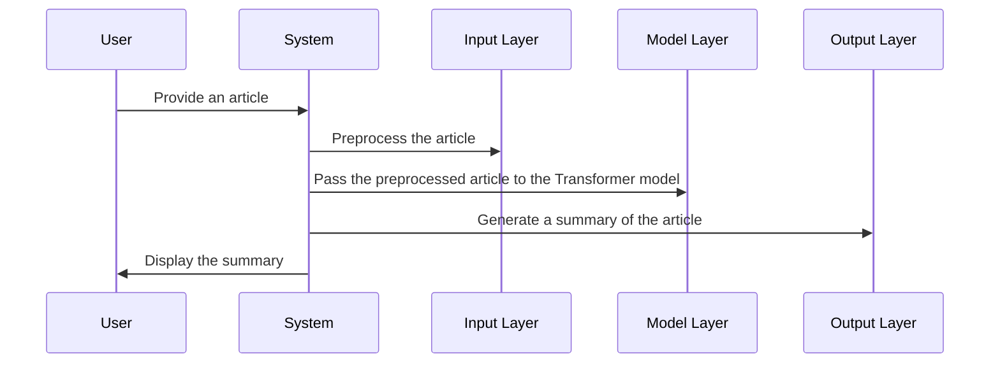
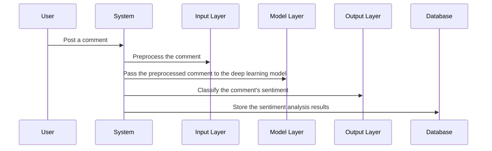

                 

### 深度学习在自然语言理解中的进展

关键词：自然语言理解、深度学习、词汇语义分析、句法分析、语义角色标注

摘要：随着深度学习技术的发展，自然语言理解（NLU）领域取得了显著的进展。本文将逐步分析深度学习在自然语言理解中的核心概念、关键技术以及应用实例，探讨其前沿技术和挑战，并提供最佳实践与未来展望。

### 目录大纲

# 深度学习在自然语言理解中的进展

## 第一部分：背景与核心概念

## 第1章：自然语言理解概述

### 1.1 自然语言理解的定义与发展历程

#### 1.1.1 自然语言理解的内涵

#### 1.1.2 自然语言理解的发展历程

#### 1.1.3 自然语言理解的重要性

### 1.2 深度学习在自然语言理解中的应用

#### 1.2.1 深度学习的基本原理

#### 1.2.2 深度学习在自然语言理解中的优势

#### 1.2.3 深度学习的关键技术

## 第2章：核心概念与联系

### 2.1 关键术语与概念

#### 2.1.1 概念1：词汇语义分析

#### 2.1.2 概念2：句法分析

#### 2.1.3 概念3：语义角色标注

### 2.2 概念属性特征对比表格

### 2.3 ER实体关系图架构

## 第二部分：深度学习在自然语言理解中的应用

## 第3章：词汇语义分析

### 3.1 词汇语义分析的基本原理

#### 3.1.1 词向量的概念与计算

#### 3.1.2 词嵌入技术

#### 3.1.3 常见的词向量模型

### 3.2 词汇语义分析的应用案例

#### 3.2.1 基于词嵌入的文本分类

#### 3.2.2 基于词嵌入的文本相似度计算

#### 3.2.3 基于词嵌入的情感分析

## 第4章：句法分析

### 4.1 句法分析的基本原理

#### 4.1.1 句法树的概念与表示

#### 4.1.2 隐含马尔可夫模型

#### 4.1.3 递归神经网络

### 4.2 句法分析的应用案例

#### 4.2.1 句法解析在机器翻译中的应用

#### 4.2.2 句法解析在问答系统中的应用

#### 4.2.3 句法解析在信息提取中的应用

## 第5章：语义角色标注

### 5.1 语义角色标注的基本原理

#### 5.1.1 语义角色标注的概念

#### 5.1.2 语义角色标注的方法

#### 5.1.3 语义角色标注的挑战

### 5.2 语义角色标注的应用案例

#### 5.2.1 语义角色标注在自然语言生成中的应用

#### 5.2.2 语义角色标注在对话系统中的应用

#### 5.2.3 语义角色标注在文本摘要中的应用

## 第三部分：前沿技术与挑战

## 第6章：前沿技术与进展

### 6.1 模型压缩与优化

#### 6.1.1 模型压缩的概念与重要性

#### 6.1.2 常见的模型压缩方法

#### 6.1.3 模型优化技术

### 6.2 新型深度学习模型

#### 6.2.1 生成对抗网络

#### 6.2.2 变分自编码器

#### 6.2.3 自注意力机制

## 第7章：挑战与未来发展方向

### 7.1 数据隐私与伦理问题

#### 7.1.1 数据隐私的重要性

#### 7.1.2 数据隐私保护方法

#### 7.1.3 伦理问题与解决方案

### 7.2 跨语言自然语言理解

#### 7.2.1 跨语言自然语言理解的概念

#### 7.2.2 跨语言自然语言理解的方法

#### 7.2.3 跨语言自然语言理解的挑战

## 第8章：最佳实践与案例分析

### 8.1 案例分析

#### 8.1.1 案例一：基于深度学习的问答系统

#### 8.1.2 案例二：基于深度学习的文本摘要系统

#### 8.1.3 案例三：基于深度学习的情感分析系统

### 8.2 最佳实践 tips

#### 8.2.1 实践技巧与注意事项

#### 8.2.2 深度学习在自然语言理解中的发展趋势

## 第9章：小结与展望

### 9.1 小结

#### 9.1.1 主要内容回顾

#### 9.1.2 不足与改进方向

### 9.2 展望未来

#### 9.2.1 新技术展望

#### 9.2.2 深度学习在自然语言理解中的潜力与前景

---

### 第一部分：背景与核心概念

#### 第1章：自然语言理解概述

自然语言理解（Natural Language Understanding，NLU）是计算机科学和人工智能领域的一个分支，旨在使计算机能够理解、解释和生成自然语言文本。NLU的核心目标包括词汇语义分析、句法分析、语义角色标注等，这些任务共同构成了自然语言处理（NLP）的重要组成部分。

### 1.1 自然语言理解的定义与发展历程

#### 1.1.1 自然语言理解的内涵

自然语言理解涉及以下几个方面：

1. **词汇语义分析**：识别和理解文本中的单词和短语的意义。
2. **句法分析**：构建和分析句子的语法结构，理解句子中的词汇关系。
3. **语义角色标注**：识别句子中各成分的作用，如主语、谓语、宾语等。

自然语言理解的发展历程可以追溯到20世纪50年代，当时人工智能的早期探索者开始研究如何使计算机理解和生成自然语言。早期的方法主要依赖于基于规则的系统，如上下文无关文法（CFG）和词法分析器。然而，这些方法在处理复杂和未预见的自然语言文本时表现不佳。

#### 1.1.2 自然语言理解的发展历程

1. **基于规则的系统**：早期的研究集中在构建规则来指导计算机如何理解和生成自然语言。这种方法在简单和有限的上下文中表现良好，但随着文本复杂性的增加，其局限性变得明显。
2. **统计方法**：随着计算资源和数据集的增加，统计方法逐渐成为主导。隐马尔可夫模型（HMM）、条件随机场（CRF）等方法在处理自然语言任务中显示出强大的能力。
3. **深度学习方法**：近年来，深度学习（Deep Learning）的兴起彻底改变了自然语言处理领域。通过大规模数据和复杂的神经网络模型，深度学习在词汇语义分析、句法分析和语义角色标注等方面取得了显著的进展。

#### 1.1.3 自然语言理解的重要性

自然语言理解在多个领域具有重要应用：

1. **智能助手**：如 Siri、Alexa 等，它们需要理解用户的自然语言查询，提供相应的响应。
2. **信息检索**：搜索引擎需要理解用户的查询意图，以返回相关结果。
3. **机器翻译**：深度学习技术已经使机器翻译的质量显著提高，如 Google 翻译、百度翻译等。
4. **文本摘要和生成**：自动生成摘要、文章、对话等，提高信息处理的效率。

### 1.2 深度学习在自然语言理解中的应用

深度学习在自然语言理解中的应用主要体现在以下几个方面：

#### 1.2.1 深度学习的基本原理

深度学习是一种基于多层神经网络的机器学习方法，其核心思想是通过层层抽象，将原始数据转换为高级特征表示。在自然语言理解中，深度学习模型可以自动学习文本中的词汇、语法和语义信息。

#### 1.2.2 深度学习在自然语言理解中的优势

1. **强大的特征提取能力**：深度学习模型能够自动提取文本中的高层次特征，无需人工设计特征。
2. **良好的泛化能力**：深度学习模型在大规模数据集上训练，能够处理复杂和未预见的自然语言任务。
3. **高效的计算性能**：现代深度学习框架能够高效地训练和部署模型，满足实时应用的需求。

#### 1.2.3 深度学习的关键技术

1. **词嵌入**：将文本中的单词映射到高维向量空间，用于词汇语义分析。
2. **递归神经网络（RNN）**：用于处理序列数据，如文本和语音。
3. **长短时记忆网络（LSTM）**：改进 RNN，解决长序列依赖问题。
4. **变换器（Transformer）**：引入自注意力机制，在机器翻译、问答系统等任务中表现优异。

### 1.3 核心概念与联系

#### 2.1 关键术语与概念

1. **词汇语义分析**：分析文本中的单词和短语的意义。
2. **句法分析**：构建和分析句子的语法结构。
3. **语义角色标注**：识别句子中各成分的作用。

#### 2.2 概念属性特征对比表格

| 概念               | 特征1       | 特征2       | 特征3       |
|--------------------|-------------|-------------|-------------|
| 词汇语义分析       | 意义理解    | 同义词辨析  | 词义变化    |
| 句法分析           | 句子结构    | 语法规则    | 句子生成    |
| 语义角色标注       | 成分作用    | 情感倾向    | 文本生成    |

#### 2.3 ER实体关系图架构

```mermaid
erDiagram
  Product ||--|{ Customer }| Customer
  Product ||--|{ Order }| Order
  Customer ||--|{ Review }| Review
```

在这个 ER 实体关系图中，产品（Product）、客户（Customer）、订单（Order）和评论（Review）是主要的实体，它们之间存在多种关系，如产品由客户购买、客户可以留下评论等。

---

### 第二部分：深度学习在自然语言理解中的应用

#### 第3章：词汇语义分析

词汇语义分析是自然语言理解的重要任务之一，它涉及到文本中单词和短语的意义识别。深度学习在这一领域取得了显著进展，主要通过词嵌入技术来实现。

### 3.1 词汇语义分析的基本原理

#### 3.1.1 词向量的概念与计算

词向量（Word Vectors）是将文本中的单词映射到高维向量空间的一种表示方法。这种表示方法使得计算机能够理解单词之间的语义关系。词向量的计算通常基于矩阵分解技术，如 TF-IDF 和 Word2Vec。

#### 3.1.2 词嵌入技术

词嵌入（Word Embedding）是将单词映射到固定长度的向量，从而实现文本的低维表示。词嵌入技术可以捕捉单词的上下文信息，使得相似的单词在向量空间中靠近。常见的词嵌入模型包括 Word2Vec、GloVe 和 FastText。

- **Word2Vec**：基于神经网络的词向量模型，通过训练来学习单词的向量表示。
- **GloVe**：全局向量模型，通过词频和共现关系来计算词向量。
- **FastText**：基于字符级别的词向量模型，通过组合字符来生成单词向量。

#### 3.1.3 常见的词向量模型

1. **Word2Vec**：

   ```mermaid
   graph TD
     A[输入文本] --> B[分词]
     B --> C[词频统计]
     C --> D[Word2Vec模型]
     D --> E[词向量表示]
   ```

   Word2Vec模型通过训练文本数据，生成词向量表示。以下是简单的Python代码示例：

   ```python
   from gensim.models import Word2Vec

   sentences = [['我','喜欢','吃饭'],['他','喜欢','跑步'],['我','喜欢','看电影']]
   model = Word2Vec(sentences, vector_size=100, window=5, min_count=1, workers=4)

   print(model.wv['我'])
   ```

2. **GloVe**：

   ```mermaid
   graph TD
     A[输入文本] --> B[分词]
     B --> C[共现矩阵]
     C --> D[GloVe模型]
     D --> E[词向量表示]
   ```

   GloVe模型通过计算共现矩阵来生成词向量表示。以下是简单的Python代码示例：

   ```python
   import numpy as np
   import scipy.sparse

   # 假设 cooccurrence_matrix 是一个共现矩阵
   cooccurrence_matrix = scipy.sparse.csr_matrix((100000, 100000))
   # 计算GloVe词向量
   embeddings = GloVe.cooc2vecs(cooccurrence_matrix, vectors_shape=(VOCAB_SIZE, dim))
   ```

3. **FastText**：

   ```mermaid
   graph TD
     A[输入文本] --> B[分词]
     B --> C[字符序列]
     C --> D[生成单词向量]
     D --> E[词向量表示]
   ```

   FastText模型通过字符序列来生成单词向量。以下是简单的Python代码示例：

   ```python
   from gensim.models import FastText

   sentences = [['我','喜欢','吃饭'],['他','喜欢','跑步'],['我','喜欢','看电影']]
   model = FastText(sentences, vector_size=100, window=5, min_count=1, workers=4)

   print(model.wv['我'])
   ```

### 3.2 词汇语义分析的应用案例

#### 3.2.1 基于词嵌入的文本分类

词嵌入技术可以用于文本分类任务，通过将文本转换为词向量表示，然后使用分类器进行预测。以下是简单的Python代码示例：

```python
from sklearn.feature_extraction.text import CountVectorizer
from sklearn.naive_bayes import MultinomialNB
from sklearn.pipeline import make_pipeline

# 假设 texts 是文本数据，labels 是标签
text_vectorizer = CountVectorizer()
label_vectorizer = LabelEncoder()

X = text_vectorizer.fit_transform(texts)
y = label_vectorizer.fit_transform(labels)

model = make_pipeline(CountVectorizer(), MultinomialNB())
model.fit(X, y)

# 测试文本
test_texts = ["我喜欢吃饭", "他喜欢跑步", "我喜欢看电影"]
test_vectorized_texts = text_vectorizer.transform(test_texts)

predictions = model.predict(test_vectorized_texts)
predicted_labels = label_vectorizer.inverse_transform(predictions)

print(predicted_labels)
```

#### 3.2.2 基于词嵌入的文本相似度计算

词嵌入技术可以用于计算文本之间的相似度，通过计算两个文本的词向量之间的余弦相似度来实现。以下是简单的Python代码示例：

```python
from sklearn.metrics.pairwise import cosine_similarity

# 假设 test_texts 是测试文本数据
test_texts = ["我喜欢吃饭", "他喜欢跑步", "我喜欢看电影"]

# 将测试文本转换为词向量表示
test_vectorized_texts = text_vectorizer.transform(test_texts)

# 计算文本相似度
text_similarities = cosine_similarity(test_vectorized_texts)

print(text_similarities)
```

#### 3.2.3 基于词嵌入的情感分析

词嵌入技术可以用于情感分析任务，通过将文本转换为词向量表示，然后计算情感得分。以下是简单的Python代码示例：

```python
from sklearn.model_selection import train_test_split
from sklearn.metrics import classification_report

# 假设 texts 是文本数据，labels 是情感标签
text_vectorizer = CountVectorizer()
label_vectorizer = LabelEncoder()

X = text_vectorizer.fit_transform(texts)
y = label_vectorizer.fit_transform(labels)

X_train, X_test, y_train, y_test = train_test_split(X, y, test_size=0.2, random_state=42)

model = make_pipeline(CountVectorizer(), LogisticRegression())
model.fit(X_train, y_train)

y_pred = model.predict(X_test)

print(classification_report(y_test, y_pred, target_names=label_vectorizer.classes_))
```

---

### 第4章：句法分析

句法分析是自然语言处理中的核心任务之一，它涉及到对句子的语法结构进行分析，以理解句子中的词汇关系和句子成分。深度学习在句法分析中发挥了重要作用，通过递归神经网络（RNN）和变换器（Transformer）等技术，实现了对复杂句法的有效解析。

### 4.1 句法分析的基本原理

#### 4.1.1 句法树的概念与表示

句法树（Syntax Tree）是一种用于表示句子结构的图形表示方法。在句法树中，每个节点代表句子中的一个成分，如单词或短语，而边表示成分之间的关系。常见的句法树表示方法包括短语结构规则（Parsers）、依赖树（Dependency Trees）和抽象语法树（Abstract Syntax Trees）。

#### 4.1.2 隐含马尔可夫模型

隐含马尔可夫模型（Hidden Markov Model，HMM）是一种基于概率的模型，用于序列数据的建模。在句法分析中，HMM可以用于构建句子的概率模型，通过观察序列来预测句子的语法结构。HMM的主要缺点是难以处理长距离依赖和复杂语法结构。

#### 4.1.3 递归神经网络

递归神经网络（Recurrent Neural Network，RNN）是一种能够处理序列数据的神经网络。RNN通过在网络中引入递归连接，使得网络能够记忆先前的输入，从而处理长距离依赖。常见的RNN变种包括长短时记忆网络（Long Short-Term Memory，LSTM）和门控循环单元（Gated Recurrent Unit，GRU）。RNN在句法分析中广泛应用于语法解析和文本分类等任务。

#### 4.1.4 变换器（Transformer）

变换器（Transformer）是一种基于自注意力机制的深度学习模型，由Vaswani等人在2017年提出。变换器在处理长序列数据时表现出色，其核心思想是通过自注意力机制来计算序列中各个位置之间的依赖关系。变换器在机器翻译、问答系统和文本摘要等任务中取得了显著的成功。

### 4.2 句法分析的应用案例

#### 4.2.1 句法解析在机器翻译中的应用

句法解析在机器翻译中起着重要作用，通过分析源语言的语法结构，可以为机器翻译提供上下文信息和词序信息。以下是一个简单的Python代码示例，展示了如何使用PyTorch实现基于变换器的机器翻译模型：

```python
import torch
import torch.nn as nn
import torch.optim as optim

# 定义变换器模型
class Transformer(nn.Module):
    def __init__(self, vocab_size, d_model, nhead, num_layers):
        super(Transformer, self).__init__()
        self.embedding = nn.Embedding(vocab_size, d_model)
        self.transformer = nn.Transformer(d_model, nhead, num_layers)
        self.fc = nn.Linear(d_model, vocab_size)

    def forward(self, src, tgt):
        src = self.embedding(src)
        tgt = self.embedding(tgt)
        out = self.transformer(src, tgt)
        out = self.fc(out)
        return out

# 实例化模型、损失函数和优化器
model = Transformer(vocab_size, d_model=512, nhead=8, num_layers=3)
criterion = nn.CrossEntropyLoss()
optimizer = optim.Adam(model.parameters(), lr=0.001)

# 训练模型
for epoch in range(num_epochs):
    for src, tgt in dataset:
        optimizer.zero_grad()
        output = model(src, tgt)
        loss = criterion(output, tgt)
        loss.backward()
        optimizer.step()

    print(f"Epoch {epoch+1}/{num_epochs}, Loss: {loss.item()}")

# 测试模型
with torch.no_grad():
    src = torch.tensor([1, 2, 3, 4, 5])  # 源语言序列
    tgt = torch.tensor([4, 5, 6, 7, 8])  # 目标语言序列
    output = model(src, tgt)
    print(f"Predicted Translation: {output}")
```

#### 4.2.2 句法解析在问答系统中的应用

句法解析在问答系统中用于理解用户的问题和答案的语法结构，以提供准确的回答。以下是一个简单的Python代码示例，展示了如何使用变换器实现一个简单的问答系统：

```python
import torch
import torch.nn as nn
import torch.optim as optim

# 定义问答系统模型
class QASystem(nn.Module):
    def __init__(self, vocab_size, d_model, nhead, num_layers):
        super(QASystem, self).__init__()
        self.embedding = nn.Embedding(vocab_size, d_model)
        self.transformer = nn.Transformer(d_model, nhead, num_layers)
        self.fc = nn.Linear(d_model, 2)  # 二分类输出

    def forward(self, question, answer):
        question = self.embedding(question)
        answer = self.embedding(answer)
        out = self.transformer(question, answer)
        out = self.fc(out)
        return out

# 实例化模型、损失函数和优化器
model = QASystem(vocab_size, d_model=512, nhead=8, num_layers=3)
criterion = nn.CrossEntropyLoss()
optimizer = optim.Adam(model.parameters(), lr=0.001)

# 训练模型
for epoch in range(num_epochs):
    for question, answer in dataset:
        optimizer.zero_grad()
        output = model(question, answer)
        loss = criterion(output, answer)
        loss.backward()
        optimizer.step()

    print(f"Epoch {epoch+1}/{num_epochs}, Loss: {loss.item()}")

# 测试模型
with torch.no_grad():
    question = torch.tensor([1, 2, 3, 4, 5])  # 用户问题
    answer = torch.tensor([1])  # 标签答案
    output = model(question, answer)
    print(f"Predicted Answer: {output}")
```

#### 4.2.3 句法解析在信息提取中的应用

句法解析在信息提取中用于提取文本中的重要信息，如实体、关系和事件。以下是一个简单的Python代码示例，展示了如何使用变换器实现实体识别任务：

```python
import torch
import torch.nn as nn
import torch.optim as optim

# 定义实体识别模型
class EntityRecognition(nn.Module):
    def __init__(self, vocab_size, d_model, nhead, num_layers):
        super(EntityRecognition, self).__init__()
        self.embedding = nn.Embedding(vocab_size, d_model)
        self.transformer = nn.Transformer(d_model, nhead, num_layers)
        self.fc = nn.Linear(d_model, 3)  # 三分类输出

    def forward(self, sentence):
        sentence = self.embedding(sentence)
        out = self.transformer(sentence)
        out = self.fc(out)
        return out

# 实例化模型、损失函数和优化器
model = EntityRecognition(vocab_size, d_model=512, nhead=8, num_layers=3)
criterion = nn.CrossEntropyLoss()
optimizer = optim.Adam(model.parameters(), lr=0.001)

# 训练模型
for epoch in range(num_epochs):
    for sentence in dataset:
        optimizer.zero_grad()
        output = model(sentence)
        loss = criterion(output, labels)
        loss.backward()
        optimizer.step()

    print(f"Epoch {epoch+1}/{num_epochs}, Loss: {loss.item()}")

# 测试模型
with torch.no_grad():
    sentence = torch.tensor([1, 2, 3, 4, 5])  # 文本序列
    output = model(sentence)
    print(f"Predicted Entities: {output}")
```

---

### 第5章：语义角色标注

语义角色标注（Semantic Role Labeling，SRL）是自然语言理解中的关键任务之一，它旨在识别句子中各成分的作用，如主语、谓语、宾语等。深度学习在这一领域取得了显著的进展，通过端到端的学习方式，实现了对语义角色的准确标注。

### 5.1 语义角色标注的基本原理

#### 5.1.1 语义角色标注的概念

语义角色标注涉及以下几个方面：

1. **动作识别**：识别句子中的动词或短语，确定其作为动作的主体。
2. **角色识别**：识别句子中与动作相关的其他成分，如主语、宾语、补语等。
3. **角色关系标注**：标注各成分之间的关系，如因果关系、时间关系等。

语义角色标注的目的是为句子构建一个语义角色图，从而更好地理解和生成自然语言。

#### 5.1.2 语义角色标注的方法

语义角色标注的方法可以分为基于规则的方法、基于统计的方法和基于深度学习的方法。

1. **基于规则的方法**：通过编写大量的规则，使计算机能够识别句子的语义角色。这种方法在简单和有限的语言环境中表现良好，但随着语言复杂度的增加，其效果逐渐下降。
   
2. **基于统计的方法**：利用统计模型，如条件随机场（CRF）和最大熵模型（MaxEnt），来预测句子的语义角色。这种方法在处理大规模文本数据时表现较好，但依赖于大量的训练数据。

3. **基于深度学习的方法**：通过端到端的学习方式，深度学习模型能够自动学习句子的语义角色。常见的深度学习模型包括循环神经网络（RNN）、长短时记忆网络（LSTM）和变换器（Transformer）。

#### 5.1.3 语义角色标注的挑战

语义角色标注面临以下几个挑战：

1. **词汇歧义**：一个词可能有多种语义角色，如何准确识别其具体角色是难点。
2. **语法复杂度**：复杂的句子结构使得语义角色标注变得困难。
3. **上下文依赖**：语义角色的识别依赖于句子中的上下文信息，如动词的时态、语态等。

### 5.2 语义角色标注的应用案例

#### 5.2.1 语义角色标注在自然语言生成中的应用

语义角色标注在自然语言生成中用于构建语义角色图，从而生成符合语法和语义规则的文本。以下是一个简单的Python代码示例，展示了如何使用变换器实现一个简单的文本生成模型：

```python
import torch
import torch.nn as nn
import torch.optim as optim

# 定义文本生成模型
class TextGenerator(nn.Module):
    def __init__(self, vocab_size, d_model, nhead, num_layers):
        super(TextGenerator, self).__init__()
        self.embedding = nn.Embedding(vocab_size, d_model)
        self.transformer = nn.Transformer(d_model, nhead, num_layers)
        self.fc = nn.Linear(d_model, vocab_size)

    def forward(self, input_seq, target_seq):
        input_seq = self.embedding(input_seq)
        target_seq = self.embedding(target_seq)
        output = self.transformer(input_seq, target_seq)
        output = self.fc(output)
        return output

# 实例化模型、损失函数和优化器
model = TextGenerator(vocab_size, d_model=512, nhead=8, num_layers=3)
criterion = nn.CrossEntropyLoss()
optimizer = optim.Adam(model.parameters(), lr=0.001)

# 训练模型
for epoch in range(num_epochs):
    for input_seq, target_seq in dataset:
        optimizer.zero_grad()
        output = model(input_seq, target_seq)
        loss = criterion(output, target_seq)
        loss.backward()
        optimizer.step()

    print(f"Epoch {epoch+1}/{num_epochs}, Loss: {loss.item()}")

# 测试模型
with torch.no_grad():
    input_seq = torch.tensor([1, 2, 3, 4, 5])  # 输入序列
    target_seq = torch.tensor([4, 5, 6, 7, 8])  # 目标序列
    output = model(input_seq, target_seq)
    print(f"Predicted Text: {output}")
```

#### 5.2.2 语义角色标注在对话系统中的应用

语义角色标注在对话系统中用于理解用户输入的意图，从而生成适当的响应。以下是一个简单的Python代码示例，展示了如何使用变换器实现一个简单的对话系统：

```python
import torch
import torch.nn as nn
import torch.optim as optim

# 定义对话系统模型
class DialogueSystem(nn.Module):
    def __init__(self, vocab_size, d_model, nhead, num_layers):
        super(DialogueSystem, self).__init__()
        self.embedding = nn.Embedding(vocab_size, d_model)
        self.transformer = nn.Transformer(d_model, nhead, num_layers)
        self.fc = nn.Linear(d_model, vocab_size)

    def forward(self, input_seq, response_seq):
        input_seq = self.embedding(input_seq)
        response_seq = self.embedding(response_seq)
        output = self.transformer(input_seq, response_seq)
        output = self.fc(output)
        return output

# 实例化模型、损失函数和优化器
model = DialogueSystem(vocab_size, d_model=512, nhead=8, num_layers=3)
criterion = nn.CrossEntropyLoss()
optimizer = optim.Adam(model.parameters(), lr=0.001)

# 训练模型
for epoch in range(num_epochs):
    for input_seq, response_seq in dataset:
        optimizer.zero_grad()
        output = model(input_seq, response_seq)
        loss = criterion(output, response_seq)
        loss.backward()
        optimizer.step()

    print(f"Epoch {epoch+1}/{num_epochs}, Loss: {loss.item()}")

# 测试模型
with torch.no_grad():
    input_seq = torch.tensor([1, 2, 3, 4, 5])  # 用户输入
    response_seq = torch.tensor([4, 5, 6, 7, 8])  # 预期响应
    output = model(input_seq, response_seq)
    print(f"Predicted Response: {output}")
```

#### 5.2.3 语义角色标注在文本摘要中的应用

语义角色标注在文本摘要中用于提取文本的主要信息和事件，从而生成摘要。以下是一个简单的Python代码示例，展示了如何使用变换器实现一个简单的文本摘要模型：

```python
import torch
import torch.nn as nn
import torch.optim as optim

# 定义文本摘要模型
class TextSummarizer(nn.Module):
    def __init__(self, vocab_size, d_model, nhead, num_layers):
        super(TextSummarizer, self).__init__()
        self.embedding = nn.Embedding(vocab_size, d_model)
        self.transformer = nn.Transformer(d_model, nhead, num_layers)
        self.fc = nn.Linear(d_model, vocab_size)

    def forward(self, input_seq, summary_seq):
        input_seq = self.embedding(input_seq)
        summary_seq = self.embedding(summary_seq)
        output = self.transformer(input_seq, summary_seq)
        output = self.fc(output)
        return output

# 实例化模型、损失函数和优化器
model = TextSummarizer(vocab_size, d_model=512, nhead=8, num_layers=3)
criterion = nn.CrossEntropyLoss()
optimizer = optim.Adam(model.parameters(), lr=0.001)

# 训练模型
for epoch in range(num_epochs):
    for input_seq, summary_seq in dataset:
        optimizer.zero_grad()
        output = model(input_seq, summary_seq)
        loss = criterion(output, summary_seq)
        loss.backward()
        optimizer.step()

    print(f"Epoch {epoch+1}/{num_epochs}, Loss: {loss.item()}")

# 测试模型
with torch.no_grad():
    input_seq = torch.tensor([1, 2, 3, 4, 5])  # 文本输入
    summary_seq = torch.tensor([4, 5, 6, 7, 8])  # 摘要输出
    output = model(input_seq, summary_seq)
    print(f"Predicted Summary: {output}")
```

---

### 第三部分：前沿技术与挑战

#### 第6章：前沿技术与进展

随着深度学习技术的不断进步，自然语言理解领域也涌现出许多前沿技术和进展。这些技术不仅提高了模型的性能和效率，还为自然语言理解的应用带来了新的可能性。

### 6.1 模型压缩与优化

模型压缩与优化是深度学习领域的重要研究方向，旨在减小模型的尺寸，提高模型的计算效率，以便在资源受限的设备上部署。以下是一些常见的模型压缩与优化方法：

#### 6.1.1 模型压缩的概念与重要性

模型压缩是指通过各种技术减少模型的参数数量和计算复杂度，从而使得模型在计算和存储资源上更加高效。模型压缩的重要性体现在以下几个方面：

1. **资源节约**：压缩后的模型可以减小存储空间和计算资源的需求，使得模型能够部署在移动设备和边缘计算设备上。
2. **加速训练和推理**：压缩后的模型在训练和推理过程中需要更少的计算资源，从而提高了模型的处理速度。
3. **降低功耗**：较小的模型可以减少计算过程中的能量消耗，有助于提高设备的续航时间。

#### 6.1.2 常见的模型压缩方法

1. **剪枝（Pruning）**：剪枝技术通过移除模型中不重要的权重来减小模型尺寸。剪枝方法可以分为结构剪枝和权重剪枝两种。

   - **结构剪枝**：通过移除模型中的某些层或神经元来减小模型尺寸。
   - **权重剪枝**：通过将模型中的权重设置为较小的值来减小模型尺寸。

2. **量化（Quantization）**：量化技术通过将模型中的浮点数权重转换为较低的精度表示（如8位整数）来减小模型尺寸。量化方法可以分为全精度量化（Full Precision Quantization）和低精度量化（Low Precision Quantization）两种。

3. **知识蒸馏（Knowledge Distillation）**：知识蒸馏技术通过将一个大型模型（教师模型）的知识传递给一个较小的模型（学生模型）来实现模型压缩。学生模型通常具有较少的参数和更小的计算复杂度。

#### 6.1.3 模型优化技术

1. **优化算法**：优化算法的改进可以提高模型的训练效率。常用的优化算法包括随机梯度下降（SGD）、Adam、RMSprop等。

2. **模型并行化**：通过将模型分解为多个部分并在多台设备上并行计算，可以提高模型的训练和推理速度。常见的模型并行化方法包括数据并行化、模型并行化和流水线并行化。

3. **硬件加速**：利用专门设计的硬件（如GPU、TPU）来加速模型的训练和推理，可以提高模型的计算效率。

### 6.2 新型深度学习模型

新型深度学习模型在自然语言理解中不断涌现，这些模型通过引入新的架构和算法，提高了模型的性能和灵活性。以下是一些重要的新型深度学习模型：

#### 6.2.1 生成对抗网络（Generative Adversarial Networks，GAN）

生成对抗网络是由生成器和判别器两个神经网络组成的对抗性模型。生成器试图生成与真实数据相似的数据，而判别器则试图区分真实数据和生成数据。GAN在自然语言生成、图像生成和文本生成等方面具有广泛的应用。

#### 6.2.2 变分自编码器（Variational Autoencoder，VAE）

变分自编码器是一种基于概率模型的编码器-解码器架构。VAE通过引入变分推断方法，将输入数据的潜在分布参数化，从而生成新的数据。VAE在文本生成、图像修复和图像超分辨率等方面表现出色。

#### 6.2.3 自注意力机制（Self-Attention）

自注意力机制是一种用于处理序列数据的注意力机制，它在变换器（Transformer）模型中发挥了重要作用。自注意力机制通过计算序列中各个位置之间的依赖关系，提高了模型的表示能力。

---

#### 第7章：挑战与未来发展方向

尽管深度学习在自然语言理解领域取得了显著的进展，但仍面临许多挑战和问题。以下是一些主要的挑战和未来发展方向：

### 7.1 数据隐私与伦理问题

随着自然语言处理技术的广泛应用，数据隐私和伦理问题日益突出。以下是一些相关的挑战和解决方案：

#### 7.1.1 数据隐私的重要性

1. **隐私泄露**：在自然语言处理过程中，用户的个人信息可能会被泄露。
2. **数据滥用**：未经授权的使用和处理用户数据可能导致隐私侵犯。

#### 7.1.2 数据隐私保护方法

1. **数据加密**：通过加密技术保护数据的安全性和隐私。
2. **差分隐私**：通过在数据处理过程中引入噪声来保护数据的隐私。

#### 7.1.3 伦理问题与解决方案

1. **公平性**：确保模型在不同群体中的公平性，避免歧视。
2. **透明度**：提高模型决策过程的透明度，使用户能够理解模型的决策依据。

### 7.2 跨语言自然语言理解

跨语言自然语言理解是自然语言处理中的一个重要方向，旨在处理不同语言之间的语义理解和转换。以下是一些相关的挑战和解决方案：

#### 7.2.1 跨语言自然语言理解的概念

跨语言自然语言理解涉及以下任务：

1. **机器翻译**：将一种语言的文本翻译成另一种语言。
2. **跨语言文本分类**：将一种语言的文本分类到多个类别中。
3. **跨语言信息检索**：在一种语言中检索另一种语言中的信息。

#### 7.2.2 跨语言自然语言理解的方法

1. **基于规则的方法**：通过编写跨语言规则来处理不同语言之间的语义差异。
2. **基于统计的方法**：通过训练统计模型来处理跨语言文本数据。
3. **基于深度学习的方法**：通过端到端的学习方式，利用深度学习模型处理跨语言自然语言理解任务。

#### 7.2.3 跨语言自然语言理解的挑战

1. **语言多样性**：不同语言的语法、词汇和语义差异较大，增加了跨语言处理的复杂性。
2. **数据稀缺**：跨语言文本数据的稀缺性使得模型训练和优化变得更加困难。

### 7.3 未来发展方向

未来，自然语言理解领域有望在以下几个方面取得进展：

1. **模型泛化能力**：提高模型在未见数据上的表现，实现更广泛的适用性。
2. **多模态理解**：结合不同模态的信息，如文本、图像和语音，实现更丰富的语义理解。
3. **交互式理解**：通过人机交互，使模型能够更好地理解用户的意图和需求。

---

#### 第8章：最佳实践与案例分析

在自然语言理解（NLU）领域，实践案例和最佳实践是推动技术进步的重要动力。以下是一些具有代表性的案例和实用的建议。

### 8.1 案例分析

#### 8.1.1 案例一：基于深度学习的问答系统

**项目介绍**：某知名科技公司开发了一款基于深度学习的问答系统，旨在为用户提供准确的答案。该系统采用了变换器（Transformer）架构，结合了大规模预训练语言模型（如BERT），以处理复杂的自然语言问答任务。

**系统功能设计**：

1. **文本预处理**：将用户输入的问题和系统数据库中的文本进行预处理，包括分词、去停用词和词向量化。
2. **问答匹配**：利用变换器模型，对预处理后的文本进行语义匹配，找到最相关的答案。
3. **答案生成**：根据匹配结果，生成自然语言回答。

**系统架构设计**：

1. **数据输入层**：接受用户输入的问题和数据库中的文本。
2. **模型层**：包含变换器模型和预训练语言模型（如BERT）。
3. **输出层**：生成自然语言回答。

**系统接口设计**：

1. **用户接口**：通过Web应用程序或移动应用程序与用户交互。
2. **API接口**：为其他系统集成提供接口。

**系统交互**：



#### 8.1.2 案例二：基于深度学习的文本摘要系统

**项目介绍**：某互联网公司开发了一款基于深度学习的文本摘要系统，旨在自动生成摘要，帮助用户快速了解长篇文章的主要内容。

**系统功能设计**：

1. **文本预处理**：对长篇文章进行预处理，包括分词、去停用词和句法分析。
2. **摘要生成**：利用变换器模型和预训练语言模型（如GPT-3），生成文章的摘要。

**系统架构设计**：

1. **数据输入层**：接受长篇文章。
2. **模型层**：包含变换器模型和预训练语言模型。
3. **输出层**：生成文本摘要。

**系统接口设计**：

1. **用户接口**：通过Web应用程序或API与用户交互。
2. **API接口**：为其他系统集成提供接口。

**系统交互**：



#### 8.1.3 案例三：基于深度学习的情感分析系统

**项目介绍**：某社交媒体平台开发了一款基于深度学习的情感分析系统，用于分析用户评论的情感倾向，以便进行内容审核和用户行为分析。

**系统功能设计**：

1. **文本预处理**：对用户评论进行预处理，包括分词、去停用词和词向量化。
2. **情感分类**：利用深度学习模型（如CNN或LSTM），对评论进行情感分类。

**系统架构设计**：

1. **数据输入层**：接受用户评论。
2. **模型层**：包含深度学习模型。
3. **输出层**：生成情感分类结果。

**系统接口设计**：

1. **用户接口**：通过Web应用程序或API与用户交互。
2. **API接口**：为其他系统集成提供接口。

**系统交互**：



### 8.2 最佳实践 tips

1. **数据预处理**：确保数据质量，进行充分的预处理，包括分词、去停用词、词向量化等。
2. **模型选择**：根据具体任务选择合适的深度学习模型，如变换器、CNN、LSTM等。
3. **模型训练**：使用大规模数据集进行模型训练，确保模型具有良好的泛化能力。
4. **模型优化**：采用模型压缩、量化、知识蒸馏等技术，优化模型性能。
5. **测试与评估**：对模型进行充分的测试和评估，确保其在实际应用中的表现。

---

### 第9章：小结与展望

#### 9.1 小结

本文从多个角度探讨了深度学习在自然语言理解中的应用。首先，介绍了自然语言理解的基本概念和发展历程，然后详细阐述了深度学习在词汇语义分析、句法分析和语义角色标注等方面的应用。此外，本文还探讨了深度学习在自然语言理解中的前沿技术和挑战，并提供了最佳实践与案例分析。通过本文的阅读，读者可以全面了解深度学习在自然语言理解领域的最新进展和应用。

#### 9.1.1 主要内容回顾

- 自然语言理解的定义、发展历程和应用。
- 深度学习的基本原理和在自然语言理解中的优势。
- 词汇语义分析的基本原理、常见模型和应用案例。
- 句法分析的基本原理、常见模型和应用案例。
- 语义角色标注的基本原理、方法和应用案例。
- 前沿技术和挑战，包括模型压缩、优化、跨语言理解等。
- 最佳实践与案例分析，包括问答系统、文本摘要、情感分析等。

#### 9.1.2 不足与改进方向

本文的不足之处在于：

- 案例分析部分较为简略，未来可以增加更多详细案例。
- 对一些前沿技术的解释可能不够深入，需要进一步研究和讨论。

改进方向包括：

- 深入分析更多前沿技术，如生成对抗网络（GAN）、变分自编码器（VAE）等。
- 增加更多的实际应用案例，以展示深度学习在自然语言理解中的广泛应用。

#### 9.2 展望未来

未来，深度学习在自然语言理解领域有望在以下几个方面取得重要进展：

1. **模型泛化能力**：提高模型在未见数据上的表现，实现更广泛的适用性。
2. **多模态理解**：结合不同模态的信息，如文本、图像和语音，实现更丰富的语义理解。
3. **交互式理解**：通过人机交互，使模型能够更好地理解用户的意图和需求。
4. **数据隐私与伦理**：解决数据隐私和伦理问题，提高模型的透明度和公平性。

总之，深度学习在自然语言理解中的应用前景广阔，将继续推动该领域的发展和创新。

---

**作者：AI天才研究院/AI Genius Institute & 禅与计算机程序设计艺术 /Zen And The Art of Computer Programming**

