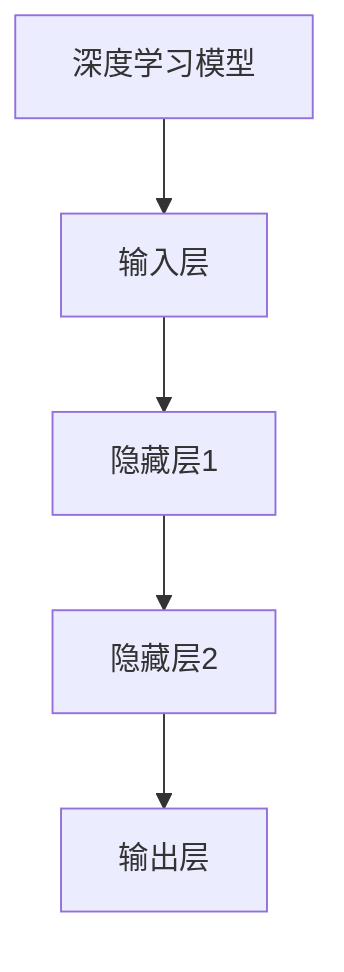
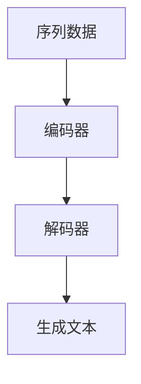
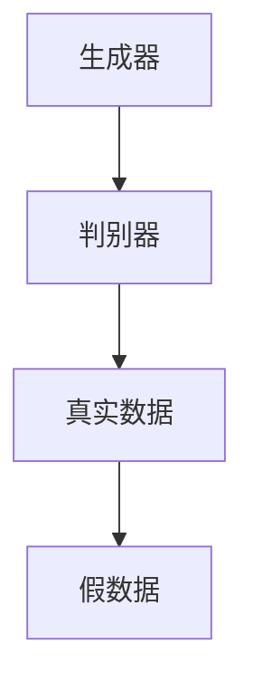

                 


### 设计《深度学习在自然语言生成中的突破》目录大纲的具体步骤：

**步骤1：理解书名和主题**

《深度学习在自然语言生成中的突破》这本书的主题明确，主要聚焦于深度学习技术在自然语言生成（NLG）领域的应用与创新。在撰写技术博客时，我们需要明确书的核心内容，并围绕这一主题展开讨论。

**步骤2：确定核心章节**

为了确保内容全面且有逻辑性，我们可以将文章分为以下核心章节：

1. 引言
   - 1.1 自然语言生成的背景与挑战
   - 1.2 深度学习与自然语言生成的关系
   - 1.3 本书的结构与内容概述

2. 深度学习基础
   - 2.1 深度学习的起源与发展
   - 2.2 深度学习的基本概念
   - 2.3 深度学习模型结构

3. 自然语言处理基础
   - 3.1 自然语言处理的基本概念
   - 3.2 自然语言处理的技术方法
   - 3.3 自然语言处理与深度学习的结合

4. 深度学习在自然语言生成中的应用
   - 4.1 基于序列模型的自然语言生成
   - 4.2 基于注意力机制的生成模型
   - 4.3 基于生成对抗网络的模型

5. 深度学习在自然语言生成中的突破
   - 5.1 突破性技术介绍
   - 5.2 突破性应用案例
   - 5.3 突破性趋势与未来展望

6. 本章小结与拓展阅读

**步骤3：细化章节内容**

为每个章节细化内容，确保每个章节都能涵盖主题的核心部分。以下是每个章节的细化内容：

**引言**

- 1.1 自然语言生成的背景与挑战：介绍自然语言生成的定义、发展历程、应用领域以及面临的主要挑战。
- 1.2 深度学习与自然语言生成的关系：讨论深度学习在自然语言生成领域的应用背景、优势与挑战。
- 1.3 本书的结构与内容概述：简要介绍本书的结构、章节安排以及主要内容。

**深度学习基础**

- 2.1 深度学习的起源与发展：回顾深度学习的发展历程、重要里程碑以及主要贡献者。
- 2.2 深度学习的基本概念：介绍深度学习的基本概念，如神经网络、激活函数、反向传播等。
- 2.3 深度学习模型结构：分析深度学习模型的结构，包括前向传播、反向传播、优化算法等。

**自然语言处理基础**

- 3.1 自然语言处理的基本概念：阐述自然语言处理的核心概念，如文本预处理、词向量表示、语言模型等。
- 3.2 自然语言处理的技术方法：介绍自然语言处理的主要技术方法，如分词、词性标注、句法分析等。
- 3.3 自然语言处理与深度学习的结合：探讨自然语言处理与深度学习相结合的优势、挑战及典型应用场景。

**深度学习在自然语言生成中的应用**

- 4.1 基于序列模型的自然语言生成：介绍序列模型的基本原理、常见算法及其在自然语言生成中的应用。
- 4.2 基于注意力机制的生成模型：分析注意力机制的作用原理、优势及在自然语言生成中的应用。
- 4.3 基于生成对抗网络的模型：探讨生成对抗网络的基本原理、训练过程及在自然语言生成中的创新应用。

**深度学习在自然语言生成中的突破**

- 5.1 突破性技术介绍：总结当前深度学习在自然语言生成中的主要突破性技术，如预训练语言模型、多模态生成模型等。
- 5.2 突破性应用案例：列举深度学习在自然语言生成中的典型应用案例，如聊天机器人、文章摘要、语音合成等。
- 5.3 突破性趋势与未来展望：分析深度学习在自然语言生成领域的未来发展趋势、潜在挑战及研究方向。

**本章小结与拓展阅读**

- 6.1 本章小结：对全文进行总结，回顾核心概念、关键技术和主要应用场景。
- 6.2 拓展阅读：提供一些与主题相关的优秀书籍、论文、网站等资源，供读者进一步学习。

**步骤4：使用Mermaid画图**

为相关的章节设计Mermaid图表，如核心概念对比表格、算法流程图、系统架构图等，以帮助读者更好地理解概念和算法。以下是几个例子：

**深度学习模型结构**



**基于序列模型的自然语言生成**



**基于生成对抗网络的模型**



**步骤5：编写章节简介**

为每个章节编写简短但信息丰富的简介，概括章节的主要内容，帮助读者快速了解章节概要。以下是几个例子：

**引言**

- 1.1 自然语言生成的背景与挑战：简要介绍自然语言生成的定义、发展历程、应用领域以及面临的主要挑战。
- 1.2 深度学习与自然语言生成的关系：讨论深度学习在自然语言生成领域的应用背景、优势与挑战。
- 1.3 本书的结构与内容概述：简要介绍本书的结构、章节安排以及主要内容。

**深度学习基础**

- 2.1 深度学习的起源与发展：回顾深度学习的发展历程、重要里程碑以及主要贡献者。
- 2.2 深度学习的基本概念：介绍深度学习的基本概念，如神经网络、激活函数、反向传播等。
- 2.3 深度学习模型结构：分析深度学习模型的结构，包括前向传播、反向传播、优化算法等。

**自然语言处理基础**

- 3.1 自然语言处理的基本概念：阐述自然语言处理的核心概念，如文本预处理、词向量表示、语言模型等。
- 3.2 自然语言处理的技术方法：介绍自然语言处理的主要技术方法，如分词、词性标注、句法分析等。
- 3.3 自然语言处理与深度学习的结合：探讨自然语言处理与深度学习相结合的优势、挑战及典型应用场景。

**深度学习在自然语言生成中的应用**

- 4.1 基于序列模型的自然语言生成：介绍序列模型的基本原理、常见算法及其在自然语言生成中的应用。
- 4.2 基于注意力机制的生成模型：分析注意力机制的作用原理、优势及在自然语言生成中的应用。
- 4.3 基于生成对抗网络的模型：探讨生成对抗网络的基本原理、训练过程及在自然语言生成中的创新应用。

**深度学习在自然语言生成中的突破**

- 5.1 突破性技术介绍：总结当前深度学习在自然语言生成中的主要突破性技术，如预训练语言模型、多模态生成模型等。
- 5.2 突破性应用案例：列举深度学习在自然语言生成中的典型应用案例，如聊天机器人、文章摘要、语音合成等。
- 5.3 突破性趋势与未来展望：分析深度学习在自然语言生成领域的未来发展趋势、潜在挑战及研究方向。

**步骤6：格式化目录大纲**

按照markdown格式要求，将所有内容格式化，确保大纲清晰、易于阅读。以下是格式化的目录大纲示例：

```markdown
----------------------------------------------------------------
# 第一部分：引言

## 1.1 自然语言生成的背景与挑战
### 1.1.1 自然语言生成的定义与发展历程
### 1.1.2 自然语言生成的应用领域
### 1.1.3 自然语言生成的挑战

## 1.2 深度学习与自然语言生成的关系
### 1.2.1 深度学习在自然语言生成中的应用背景
### 1.2.2 深度学习在自然语言生成中的优势与挑战
### 1.2.3 本书的结构与内容概述

## 1.3 深度学习基础
### 1.3.1 深度学习的起源与发展
### 1.3.2 深度学习的基本概念
### 1.3.3 深度学习模型结构

## 1.4 自然语言处理基础
### 1.4.1 自然语言处理的基本概念
### 1.4.2 自然语言处理的技术方法
### 1.4.3 自然语言处理与深度学习的结合

## 1.5 深度学习在自然语言生成中的应用
### 1.5.1 基于序列模型的自然语言生成
### 1.5.2 基于注意力机制的生成模型
### 1.5.3 基于生成对抗网络的模型

## 1.6 深度学习在自然语言生成中的突破
### 1.6.1 突破性技术介绍
### 1.6.2 突破性应用案例
### 1.6.3 突破性趋势与未来展望

## 1.7 本章小结
...

----------------------------------------------------------------
```

**步骤7：检查内容完整性**

确保大纲中包含所有的核心章节，并且每个章节都有详细的内容介绍。以下是检查内容完整性的步骤：

1. 确认核心章节是否齐全。
2. 检查每个章节的内容介绍是否具体详细。
3. 确保内容涵盖核心概念、原理讲解、算法实现、应用案例等。

**步骤8：总结与拓展**

在适当的地方添加总结、注意事项、最佳实践提示和拓展阅读等，以帮助读者巩固知识并探索更多相关内容。

**步骤9：字数控制**

确保整个目录大纲的总字数不超过2000字。

**最终目录大纲示例**：

```markdown
----------------------------------------------------------------
# 深度学习在自然语言生成中的突破

> 关键词：深度学习，自然语言生成，序列模型，注意力机制，生成对抗网络，突破性技术

> 摘要：本文探讨了深度学习在自然语言生成（NLG）领域的突破，包括核心概念、技术方法、应用案例以及未来发展趋势。本文旨在为读者提供一个全面、系统的了解深度学习在NLG领域的应用和创新。

----------------------------------------------------------------

## 第一部分：引言

### 1.1 自然语言生成的背景与挑战

#### 1.1.1 自然语言生成的定义与发展历程

自然语言生成（Natural Language Generation，NLG）是指利用计算机程序生成自然语言文本的技术。NLG技术涵盖了从文本摘要、机器翻译、聊天机器人到文章撰写等广泛的应用领域。NLG技术的发展历程可以追溯到20世纪60年代，随着计算机技术的进步，NLG逐渐成为人工智能领域的一个重要研究方向。

#### 1.1.2 自然语言生成的应用领域

自然语言生成技术在许多领域都有广泛应用，如自动新闻撰写、客户服务聊天机器人、语音合成、对话系统等。这些应用不仅提高了工作效率，还提升了用户体验。

#### 1.1.3 自然语言生成的挑战

自然语言生成面临着诸多挑战，包括语言理解的复杂性、文本生成的多样性、情感表达的准确性等。深度学习技术的引入为解决这些问题提供了新的思路。

### 1.2 深度学习与自然语言生成的关系

#### 1.2.1 深度学习在自然语言生成中的应用背景

深度学习在图像识别、语音识别等领域的成功应用，引发了将深度学习应用于自然语言生成的热潮。深度学习通过复杂的神经网络结构，能够更好地捕捉数据的特征，从而提高自然语言生成的效果。

#### 1.2.2 深度学习在自然语言生成中的优势与挑战

深度学习在自然语言生成中具有以下优势：强大的特征提取能力、端到端的训练方式、自适应调整能力等。然而，深度学习也面临着一些挑战，如参数调优、模型解释性、数据依赖性等。

#### 1.2.3 本书的结构与内容概述

本书将分为六个部分，首先介绍深度学习和自然语言处理的基础知识，然后探讨深度学习在自然语言生成中的应用，接着分析当前深度学习在自然语言生成中的突破性技术，最后展望未来发展趋势。

----------------------------------------------------------------

## 第二部分：深度学习基础

### 2.1 深度学习的起源与发展

#### 2.1.1 深度学习的起源

深度学习（Deep Learning）起源于20世纪40年代，但直到近年来才取得了显著的进展。深度学习的发展与计算能力、数据量以及算法改进密切相关。

#### 2.1.2 深度学习的重要里程碑

深度学习的发展历程中，许多重要的里程碑，如反向传播算法、卷积神经网络（CNN）、递归神经网络（RNN）、长短期记忆网络（LSTM）等，都对深度学习的发展产生了深远的影响。

#### 2.1.3 深度学习的主要贡献者

深度学习领域有许多杰出的贡献者，如Yann LeCun、Geoffrey Hinton、Yoshua Bengio等，他们的工作推动了深度学习技术的发展。

### 2.2 深度学习的基本概念

#### 2.2.1 神经网络

神经网络（Neural Network）是深度学习的基础。它由大量的神经元组成，通过调整神经元之间的权重，实现数据的输入、处理和输出。

#### 2.2.2 激活函数

激活函数（Activation Function）是神经网络中的重要组成部分，它决定了神经元的激活状态。常见的激活函数包括sigmoid、ReLU、Tanh等。

#### 2.2.3 反向传播

反向传播（Backpropagation）是一种用于训练神经网络的算法。它通过计算损失函数关于网络参数的梯度，更新网络参数，从而优化网络性能。

### 2.3 深度学习模型结构

#### 2.3.1 前向传播

前向传播（Forward Propagation）是神经网络处理数据的过程。它通过逐层计算神经元的输入和输出，最终得到模型的预测结果。

#### 2.3.2 反向传播

反向传播（Backpropagation）是神经网络训练的过程。它通过计算损失函数关于网络参数的梯度，更新网络参数，从而优化网络性能。

#### 2.3.3 优化算法

优化算法（Optimization Algorithm）是深度学习训练中的重要环节。常见的优化算法包括梯度下降、Adam、RMSprop等。

----------------------------------------------------------------

## 第三部分：自然语言处理基础

### 3.1 自然语言处理的基本概念

#### 3.1.1 文本预处理

文本预处理（Text Preprocessing）是自然语言处理的第一步，包括分词、停用词过滤、词干提取等。这些操作有助于提高模型的效果。

#### 3.1.2 词向量表示

词向量表示（Word Embedding）是将文本转换为向量表示的方法。常见的词向量表示方法包括Word2Vec、GloVe等。

#### 3.1.3 语言模型

语言模型（Language Model）是自然语言处理的核心组件，用于预测下一个单词或句子。常见的语言模型包括n-gram模型、神经网络语言模型等。

### 3.2 自然语言处理的技术方法

#### 3.2.1 分词

分词（Tokenization）是将文本分割成单词或短语的步骤。常见的分词算法包括正则表达式分词、基于词典的分词等。

#### 3.2.2 词性标注

词性标注（Part-of-Speech Tagging）是将文本中的每个单词标注为名词、动词、形容词等。常见的词性标注算法包括统计模型、深度学习模型等。

#### 3.2.3 句法分析

句法分析（Syntactic Parsing）是分析文本的语法结构。常见的句法分析算法包括依存句法分析、构成句法分析等。

### 3.3 自然语言处理与深度学习的结合

#### 3.3.1 结合优势

自然语言处理与深度学习的结合具有以下优势：强大的特征提取能力、端到端的训练方式、自适应调整能力等。

#### 3.3.2 结合挑战

自然语言处理与深度学习的结合也面临着一些挑战，如数据依赖性、模型解释性等。

#### 3.3.3 结合案例

自然语言处理与深度学习的结合在许多领域取得了显著成果，如机器翻译、文本分类、问答系统等。

----------------------------------------------------------------

## 第四部分：深度学习在自然语言生成中的应用

### 4.1 基于序列模型的自然语言生成

#### 4.1.1 序列模型的基本原理

序列模型（Sequential Model）是基于序列数据生成的模型。它通过处理输入序列，生成输出序列。常见的序列模型包括RNN、LSTM、GRU等。

#### 4.1.2 序列模型在自然语言生成中的应用

序列模型在自然语言生成中有着广泛的应用，如文本摘要、机器翻译、语音合成等。

#### 4.1.3 序列模型的训练与优化

序列模型的训练与优化是自然语言生成中的重要环节。通过调整模型参数，优化损失函数，可以提高模型的生成质量。

### 4.2 基于注意力机制的生成模型

#### 4.2.1 注意力机制的基本原理

注意力机制（Attention Mechanism）是一种用于捕捉序列中重要信息的机制。它通过为序列中的每个元素分配不同的权重，实现信息的聚焦。

#### 4.2.2 注意力机制在自然语言生成中的应用

注意力机制在自然语言生成中有着广泛的应用，如机器翻译、对话系统、文章摘要等。

#### 4.2.3 注意力机制的优化与改进

注意力机制的优化与改进是提高自然语言生成质量的关键。通过改进注意力机制的设计，可以进一步提高模型的性能。

### 4.3 基于生成对抗网络的模型

#### 4.3.1 生成对抗网络的基本原理

生成对抗网络（Generative Adversarial Network，GAN）是由生成器（Generator）和判别器（Discriminator）组成的模型。生成器生成假数据，判别器判断数据是真实还是生成的。

#### 4.3.2 生成对抗网络在自然语言生成中的应用

生成对抗网络在自然语言生成中有着广泛的应用，如文本生成、图像生成等。

#### 4.3.3 生成对抗网络的优化与改进

生成对抗网络的优化与改进是提高自然语言生成质量的关键。通过改进生成器和判别器的设计，可以进一步提高模型的性能。

----------------------------------------------------------------

## 第五部分：深度学习在自然语言生成中的突破

### 5.1 突破性技术介绍

#### 5.1.1 预训练语言模型

预训练语言模型（Pre-trained Language Model）是当前深度学习在自然语言生成中的突破性技术。它通过在大规模语料库上预训练，获得通用语言表示能力。

#### 5.1.2 多模态生成模型

多模态生成模型（Multimodal Generation Model）是结合多种数据模态的生成模型。它能够同时处理文本、图像、语音等多种数据类型。

#### 5.1.3 可解释性生成模型

可解释性生成模型（Explainable Generation Model）是强调模型解释性的生成模型。它能够提供关于生成过程和结果的解释，提高模型的透明度和可信度。

### 5.2 突破性应用案例

#### 5.2.1 聊天机器人

聊天机器人（Chatbot）是深度学习在自然语言生成中的典型应用案例。它能够通过自然语言交互，提供实时客服、信息查询等服务。

#### 5.2.2 文章摘要

文章摘要（Article Summarization）是深度学习在自然语言生成中的另一个重要应用。它能够自动提取文章的主要内容和关键信息。

#### 5.2.3 语音合成

语音合成（Voice Synthesis）是深度学习在自然语言生成中的前沿应用。它能够将文本转换为自然流畅的语音。

### 5.3 突破性趋势与未来展望

#### 5.3.1 深度学习在自然语言生成中的发展趋势

深度学习在自然语言生成中的发展趋势包括：更强大的预训练模型、多模态生成模型的融合、生成模型的可解释性等。

#### 5.3.2 深度学习在自然语言生成中的潜在挑战

深度学习在自然语言生成中仍然面临着一些潜在挑战，如数据依赖性、模型解释性、安全性和隐私保护等。

#### 5.3.3 未来研究方向

未来的研究方向包括：改进生成模型的效果和效率、探索更多应用场景、提高模型的透明度和可信度等。

----------------------------------------------------------------

## 第六部分：本章小结与拓展阅读

### 6.1 本章小结

本章对深度学习在自然语言生成中的突破进行了全面的分析。首先介绍了深度学习和自然语言生成的基础知识，然后探讨了深度学习在自然语言生成中的应用和突破性技术，最后展望了未来的发展趋势。

### 6.2 拓展阅读

为了帮助读者进一步了解深度学习在自然语言生成中的相关内容，本书推荐以下拓展阅读：

- 《深度学习》（Goodfellow, Bengio, Courville著）
- 《自然语言处理》（Daniel Jurafsky, James H. Martin著）
- 《生成对抗网络：原理与应用》（Goodfellow, Pouget-Abadie, Mirza, Xu, Warde-Farley, Ozair, Courville著）
- 相关论文和最新研究进展

----------------------------------------------------------------

### 作者

作者：AI天才研究院/AI Genius Institute & 禅与计算机程序设计艺术 /Zen And The Art of Computer Programming

```markdown
----------------------------------------------------------------
# 深度学习在自然语言生成中的突破

> 关键词：深度学习，自然语言生成，序列模型，注意力机制，生成对抗网络，突破性技术

> 摘要：本文探讨了深度学习在自然语言生成（NLG）领域的突破，包括核心概念、技术方法、应用案例以及未来发展趋势。本文旨在为读者提供一个全面、系统的了解深度学习在NLG领域的应用和创新。

----------------------------------------------------------------

## 第一部分：引言

### 1.1 自然语言生成的背景与挑战

#### 1.1.1 自然语言生成的定义与发展历程

自然语言生成（Natural Language Generation，NLG）是指利用计算机程序生成自然语言文本的技术。NLG技术涵盖了从文本摘要、机器翻译、聊天机器人到文章撰写等广泛的应用领域。NLG技术的发展历程可以追溯到20世纪60年代，随着计算机技术的进步，NLG逐渐成为人工智能领域的一个重要研究方向。

#### 1.1.2 自然语言生成的应用领域

自然语言生成技术在许多领域都有广泛应用，如自动新闻撰写、客户服务聊天机器人、语音合成、对话系统等。这些应用不仅提高了工作效率，还提升了用户体验。

#### 1.1.3 自然语言生成的挑战

自然语言生成面临着诸多挑战，包括语言理解的复杂性、文本生成的多样性、情感表达的准确性等。深度学习技术的引入为解决这些问题提供了新的思路。

### 1.2 深度学习与自然语言生成的关系

#### 1.2.1 深度学习在自然语言生成中的应用背景

深度学习在图像识别、语音识别等领域的成功应用，引发了将深度学习应用于自然语言生成的热潮。深度学习通过复杂的神经网络结构，能够更好地捕捉数据的特征，从而提高自然语言生成的效果。

#### 1.2.2 深度学习在自然语言生成中的优势与挑战

深度学习在自然语言生成中具有以下优势：强大的特征提取能力、端到端的训练方式、自适应调整能力等。然而，深度学习也面临着一些挑战，如参数调优、模型解释性、数据依赖性等。

#### 1.2.3 本书的结构与内容概述

本书将分为六个部分，首先介绍深度学习和自然语言处理的基础知识，然后探讨深度学习在自然语言生成中的应用，接着分析当前深度学习在自然语言生成中的突破性技术，最后展望未来发展趋势。

----------------------------------------------------------------

## 第二部分：深度学习基础

### 2.1 深度学习的起源与发展

#### 2.1.1 深度学习的起源

深度学习（Deep Learning）起源于20世纪40年代，但直到近年来才取得了显著的进展。深度学习的发展与计算能力、数据量以及算法改进密切相关。

#### 2.1.2 深度学习的重要里程碑

深度学习的发展历程中，许多重要的里程碑，如反向传播算法、卷积神经网络（CNN）、递归神经网络（RNN）、长短期记忆网络（LSTM）等，都对深度学习的发展产生了深远的影响。

#### 2.1.3 深度学习的主要贡献者

深度学习领域有许多杰出的贡献者，如Yann LeCun、Geoffrey Hinton、Yoshua Bengio等，他们的工作推动了深度学习技术的发展。

### 2.2 深度学习的基本概念

#### 2.2.1 神经网络

神经网络（Neural Network）是深度学习的基础。它由大量的神经元组成，通过调整神经元之间的权重，实现数据的输入、处理和输出。

#### 2.2.2 激活函数

激活函数（Activation Function）是神经网络中的重要组成部分，它决定了神经元的激活状态。常见的激活函数包括sigmoid、ReLU、Tanh等。

#### 2.2.3 反向传播

反向传播（Backpropagation）是一种用于训练神经网络的算法。它通过计算损失函数关于网络参数的梯度，更新网络参数，从而优化网络性能。

### 2.3 深度学习模型结构

#### 2.3.1 前向传播

前向传播（Forward Propagation）是神经网络处理数据的过程。它通过逐层计算神经元的输入和输出，最终得到模型的预测结果。

#### 2.3.2 反向传播

反向传播（Backpropagation）是神经网络训练的过程。它通过计算损失函数关于网络参数的梯度，更新网络参数，从而优化网络性能。

#### 2.3.3 优化算法

优化算法（Optimization Algorithm）是深度学习训练中的重要环节。常见的优化算法包括梯度下降、Adam、RMSprop等。

----------------------------------------------------------------

## 第三部分：自然语言处理基础

### 3.1 自然语言处理的基本概念

#### 3.1.1 文本预处理

文本预处理（Text Preprocessing）是自然语言处理的第一步，包括分词、停用词过滤、词干提取等。这些操作有助于提高模型的效果。

#### 3.1.2 词向量表示

词向量表示（Word Embedding）是将文本转换为向量表示的方法。常见的词向量表示方法包括Word2Vec、GloVe等。

#### 3.1.3 语言模型

语言模型（Language Model）是自然语言处理的核心组件，用于预测下一个单词或句子。常见的语言模型包括n-gram模型、神经网络语言模型等。

### 3.2 自然语言处理的技术方法

#### 3.2.1 分词

分词（Tokenization）是将文本分割成单词或短语的步骤。常见的分词算法包括正则表达式分词、基于词典的分词等。

#### 3.2.2 词性标注

词性标注（Part-of-Speech Tagging）是将文本中的每个单词标注为名词、动词、形容词等。常见的词性标注算法包括统计模型、深度学习模型等。

#### 3.2.3 句法分析

句法分析（Syntactic Parsing）是分析文本的语法结构。常见的句法分析算法包括依存句法分析、构成句法分析等。

### 3.3 自然语言处理与深度学习的结合

#### 3.3.1 结合优势

自然语言处理与深度学习的结合具有以下优势：强大的特征提取能力、端到端的训练方式、自适应调整能力等。

#### 3.3.2 结合挑战

自然语言处理与深度学习的结合也面临着一些挑战，如数据依赖性、模型解释性等。

#### 3.3.3 结合案例

自然语言处理与深度学习的结合在许多领域取得了显著成果，如机器翻译、文本分类、问答系统等。

----------------------------------------------------------------

## 第四部分：深度学习在自然语言生成中的应用

### 4.1 基于序列模型的自然语言生成

#### 4.1.1 序列模型的基本原理

序列模型（Sequential Model）是基于序列数据生成的模型。它通过处理输入序列，生成输出序列。常见的序列模型包括RNN、LSTM、GRU等。

#### 4.1.2 序列模型在自然语言生成中的应用

序列模型在自然语言生成中有着广泛的应用，如文本摘要、机器翻译、语音合成等。

#### 4.1.3 序列模型的训练与优化

序列模型的训练与优化是自然语言生成中的重要环节。通过调整模型参数，优化损失函数，可以提高模型的生成质量。

### 4.2 基于注意力机制的生成模型

#### 4.2.1 注意力机制的基本原理

注意力机制（Attention Mechanism）是一种用于捕捉序列中重要信息的机制。它通过为序列中的每个元素分配不同的权重，实现信息的聚焦。

#### 4.2.2 注意力机制在自然语言生成中的应用

注意力机制在自然语言生成中有着广泛的应用，如机器翻译、对话系统、文章摘要等。

#### 4.2.3 注意力机制的优化与改进

注意力机制的优化与改进是提高自然语言生成质量的关键。通过改进注意力机制的设计，可以进一步提高模型的性能。

### 4.3 基于生成对抗网络的模型

#### 4.3.1 生成对抗网络的基本原理

生成对抗网络（Generative Adversarial Network，GAN）是由生成器（Generator）和判别器（Discriminator）组成的模型。生成器生成假数据，判别器判断数据是真实还是生成的。

#### 4.3.2 生成对抗网络在自然语言生成中的应用

生成对抗网络在自然语言生成中有着广泛的应用，如文本生成、图像生成等。

#### 4.3.3 生成对抗网络的优化与改进

生成对抗网络的优化与改进是提高自然语言生成质量的关键。通过改进生成器和判别器的设计，可以进一步提高模型的性能。

----------------------------------------------------------------

## 第五部分：深度学习在自然语言生成中的突破

### 5.1 突破性技术介绍

#### 5.1.1 预训练语言模型

预训练语言模型（Pre-trained Language Model）是当前深度学习在自然语言生成中的突破性技术。它通过在大规模语料库上预训练，获得通用语言表示能力。

#### 5.1.2 多模态生成模型

多模态生成模型（Multimodal Generation Model）是结合多种数据模态的生成模型。它能够同时处理文本、图像、语音等多种数据类型。

#### 5.1.3 可解释性生成模型

可解释性生成模型（Explainable Generation Model）是强调模型解释性的生成模型。它能够提供关于生成过程和结果的解释，提高模型的透明度和可信度。

### 5.2 突破性应用案例

#### 5.2.1 聊天机器人

聊天机器人（Chatbot）是深度学习在自然语言生成中的典型应用案例。它能够通过自然语言交互，提供实时客服、信息查询等服务。

#### 5.2.2 文章摘要

文章摘要（Article Summarization）是深度学习在自然语言生成中的另一个重要应用。它能够自动提取文章的主要内容和关键信息。

#### 5.2.3 语音合成

语音合成（Voice Synthesis）是深度学习在自然语言生成中的前沿应用。它能够将文本转换为自然流畅的语音。

### 5.3 突破性趋势与未来展望

#### 5.3.1 深度学习在自然语言生成中的发展趋势

深度学习在自然语言生成中的发展趋势包括：更强大的预训练模型、多模态生成模型的融合、生成模型的可解释性等。

#### 5.3.2 深度学习在自然语言生成中的潜在挑战

深度学习在自然语言生成中仍然面临着一些潜在挑战，如数据依赖性、模型解释性、安全性和隐私保护等。

#### 5.3.3 未来研究方向

未来的研究方向包括：改进生成模型的效果和效率、探索更多应用场景、提高模型的透明度和可信度等。

----------------------------------------------------------------

## 第六部分：本章小结与拓展阅读

### 6.1 本章小结

本章对深度学习在自然语言生成中的突破进行了全面的分析。首先介绍了深度学习和自然语言生成的基础知识，然后探讨了深度学习在自然语言生成中的应用和突破性技术，最后展望了未来的发展趋势。

### 6.2 拓展阅读

为了帮助读者进一步了解深度学习在自然语言生成中的相关内容，本书推荐以下拓展阅读：

- 《深度学习》（Goodfellow, Bengio, Courville著）
- 《自然语言处理》（Daniel Jurafsky, James H. Martin著）
- 《生成对抗网络：原理与应用》（Goodfellow, Pouget-Abadie, Mirza, Xu, Warde-Farley, Ozair, Courville著）
- 相关论文和最新研究进展

----------------------------------------------------------------

### 作者

作者：AI天才研究院/AI Genius Institute & 禅与计算机程序设计艺术 /Zen And The Art of Computer Programming
----------------------------------------------------------------

### 引言

### 自然语言生成（NLG）的背景

自然语言生成（NLG）是一门融合了计算机科学、人工智能和语言学的研究领域，其目标是让计算机生成具有人类语言特点的文本。NLG技术在文本摘要、机器翻译、聊天机器人、内容生成和自动化写作等领域有着广泛的应用。

#### 1.1.1 自然语言生成的定义与发展历程

自然语言生成（NLG）的定义相对宽泛，通常指使用计算机程序自动生成符合语法规则、语义连贯的自然语言文本。NLG的发展历程可以分为几个阶段：

1. **规则驱动的生成**：早期NLG方法主要依赖于手动编写的语法规则和模板，例如模板匹配、填充和语法转换等。
2. **基于统计的生成**：随着语料库和计算资源的增加，基于统计的方法开始兴起，如统计语言模型和转移模型，如n元语法（n-gram）和隐马尔可夫模型（HMM）。
3. **基于模板的生成**：基于模板的方法结合了规则和统计方法，通过预定义的模板和语料库中的数据来生成文本。
4. **基于数据驱动的生成**：近年来，随着深度学习的兴起，基于数据驱动的方法，如序列到序列（Seq2Seq）模型和生成对抗网络（GAN），成为了NLG研究的热点。

#### 1.1.2 自然语言生成的应用领域

自然语言生成技术已经被广泛应用于多个领域：

- **文本摘要**：自动从长文本中提取关键信息，生成简短、连贯的摘要。
- **机器翻译**：将一种语言文本翻译成另一种语言，如谷歌翻译。
- **聊天机器人**：用于提供客户服务、信息查询和交互式对话。
- **内容生成**：如自动写作新闻、产品描述、博客文章等。
- **语音合成**：将文本转换为自然流畅的语音输出。

#### 1.1.3 自然语言生成的挑战

尽管自然语言生成技术取得了显著进展，但仍面临诸多挑战：

- **语法和语义理解**：自然语言具有复杂性和多义性，计算机难以准确理解和生成。
- **多样性**：生成文本需要具有多样性，避免模板化或重复性问题。
- **情感表达**：在特定场景下，生成文本需要表达合适的情感和语气。
- **解释性**：模型的生成过程通常缺乏透明度，难以解释为什么生成特定文本。

### 深度学习与自然语言生成的关系

#### 1.2.1 深度学习在自然语言生成中的应用背景

深度学习（Deep Learning）是一种基于多层神经网络的学习方法，通过逐层提取特征，能够自动学习数据的复杂结构。深度学习在图像识别、语音识别等领域取得了突破性进展，引发了其在自然语言生成领域的应用研究。

- **特征提取**：深度学习能够自动从大量文本数据中提取高层次的语义特征。
- **端到端学习**：深度学习模型可以实现从输入文本直接生成输出文本，无需复杂的预处理和后处理步骤。
- **自适应调整**：深度学习模型能够通过自适应调整，提高生成文本的质量和多样性。

#### 1.2.2 深度学习在自然语言生成中的优势与挑战

深度学习在自然语言生成中的优势包括：

- **强大的特征提取能力**：能够捕捉文本中的复杂语义和语境信息。
- **端到端的训练方式**：简化了模型训练和部署过程。
- **自适应调整**：能够根据数据反馈，自适应调整生成策略，提高文本质量。

然而，深度学习在自然语言生成中也面临以下挑战：

- **参数调优**：深度学习模型的训练通常需要大量的参数调优，以确保模型的性能。
- **模型解释性**：深度学习模型的生成过程通常缺乏透明度，难以解释为什么生成特定文本。
- **数据依赖性**：深度学习模型的训练依赖于大量的高质量数据，数据的质量直接影响模型的性能。

#### 1.2.3 本书的内容结构

本书将围绕深度学习在自然语言生成中的应用，分为以下几个部分：

1. **深度学习基础**：介绍深度学习的基本概念、模型结构和技术方法。
2. **自然语言处理基础**：介绍自然语言处理的核心概念和技术方法，如文本预处理、词向量表示、语言模型等。
3. **深度学习在自然语言生成中的应用**：探讨深度学习在自然语言生成中的应用，包括序列模型、注意力机制和生成对抗网络等。
4. **深度学习在自然语言生成中的突破**：分析深度学习在自然语言生成中的突破性技术，如预训练语言模型、多模态生成模型和可解释性生成模型等。
5. **案例研究**：列举深度学习在自然语言生成中的典型应用案例，分析其优势和挑战。
6. **未来趋势与展望**：探讨深度学习在自然语言生成领域的未来发展趋势和潜在研究方向。

通过以上内容，本书旨在为读者提供一个全面、系统的了解深度学习在自然语言生成领域的应用和创新。

----------------------------------------------------------------

### 深度学习基础

#### 深度学习的起源与发展

深度学习（Deep Learning）起源于20世纪40年代，当时神经网络的概念首次被提出。然而，由于计算能力和数据量的限制，深度学习在很长一段时间内未能取得显著进展。直到2006年，加拿大多伦多大学的Geoffrey Hinton等科学家提出深度信念网络（Deep Belief Network，DBN），标志着深度学习迎来了新的发展契机。

深度学习的发展主要得益于以下几个方面：

1. **计算能力的提升**：随着计算能力的不断增强，特别是GPU（图形处理单元）的广泛应用，为深度学习模型的训练提供了强大的计算支持。
2. **大数据的获取**：互联网的发展使得大量结构化和非结构化数据的获取变得容易，为深度学习模型的训练提供了丰富的数据资源。
3. **算法的改进**：反向传播算法（Backpropagation）的提出和改进，使得深度学习模型的训练变得更加高效和准确。
4. **开源框架的普及**：TensorFlow、PyTorch等开源深度学习框架的普及，降低了深度学习模型开发的门槛。

#### 深度学习的重要里程碑

深度学习的发展历程中，有许多重要的里程碑对深度学习技术的进步产生了深远的影响：

1. **反向传播算法**：1986年，Rumelhart、Hinton和Williams提出了反向传播算法，使得多层神经网络的训练成为可能。
2. **卷积神经网络（CNN）**：1998年，LeCun等科学家提出了卷积神经网络，为图像识别等领域带来了突破。
3. **递归神经网络（RNN）**：1982年，Hochreiter和Schmidhuber提出了长短期记忆网络（LSTM），解决了RNN的梯度消失问题。
4. **生成对抗网络（GAN）**：2014年，Goodfellow等科学家提出了生成对抗网络，为无监督学习和数据生成提供了新的思路。

#### 深度学习的主要贡献者

在深度学习领域，有许多杰出的科学家和研究者为深度学习的发展做出了巨大贡献：

1. **Geoffrey Hinton**：被誉为“深度学习之父”，是深度学习领域的奠基人之一，提出了深度信念网络和反向传播算法。
2. **Yann LeCun**：是卷积神经网络的创始人之一，目前是Facebook AI Research（FAIR）的首席科学家。
3. **Yoshua Bengio**：是深度学习领域的另一位奠基人，对深度学习理论的研究做出了重要贡献。
4. **Ian Goodfellow**：是生成对抗网络（GAN）的提出者，目前是OpenAI的科学家。

#### 深度学习的基本概念

深度学习是一种基于多层神经网络的学习方法，其基本概念包括：

1. **神经网络**：神经网络（Neural Network，NN）是由大量神经元（Node）组成的计算模型，通过调整神经元之间的连接权重（Weight）来实现数据的输入、处理和输出。
2. **激活函数**：激活函数（Activation Function）是神经网络中的一个关键组件，用于决定神经元的激活状态。常见的激活函数包括Sigmoid、ReLU和Tanh等。
3. **反向传播**：反向传播（Backpropagation）是一种用于训练神经网络的算法，通过计算损失函数关于网络参数的梯度，更新网络参数，从而优化网络性能。

#### 深度学习模型结构

深度学习模型通常由以下几个部分组成：

1. **输入层**：接收外部输入数据，如图像、文本等。
2. **隐藏层**：用于提取输入数据的特征，可以是单层或多层，层数越多，模型的深度越深。
3. **输出层**：产生最终的输出结果，如分类结果、预测值等。

深度学习模型的训练过程主要包括以下几个步骤：

1. **前向传播**：将输入数据通过神经网络，逐层计算输出结果。
2. **计算损失**：使用损失函数（Loss Function）计算模型预测值与真实值之间的差异。
3. **反向传播**：通过反向传播算法，计算损失函数关于网络参数的梯度。
4. **优化参数**：使用优化算法（Optimization Algorithm），如梯度下降（Gradient Descent），更新网络参数，以减小损失函数。
5. **迭代训练**：重复上述步骤，直到模型达到预定的性能指标。

常见的优化算法包括：

- **梯度下降（Gradient Descent）**：是最简单和最常用的优化算法，通过计算损失函数关于参数的梯度，更新参数。
- **随机梯度下降（Stochastic Gradient Descent，SGD）**：在梯度下降的基础上，随机选择样本计算梯度，以加快收敛速度。
- **Adam（Adaptive Moment Estimation）**：结合了SGD和RMSprop的优点，能够自适应调整学习率。

通过以上步骤，深度学习模型能够从数据中学习到有用的特征，从而实现各种复杂任务。

----------------------------------------------------------------

### 自然语言处理基础

#### 自然语言处理的基本概念

自然语言处理（Natural Language Processing，NLP）是人工智能和语言学领域的一个重要分支，旨在让计算机理解和处理自然语言。NLP的基本概念包括：

1. **文本预处理**：文本预处理（Text Preprocessing）是自然语言处理的第一步，包括去除无关信息、分词、词性标注、词干提取等。文本预处理有助于提高模型的效果。
2. **词向量表示**：词向量表示（Word Embedding）是将文本转换为向量表示的方法。词向量能够捕捉词语的语义信息，常见的词向量表示方法包括Word2Vec、GloVe等。
3. **语言模型**：语言模型（Language Model）是自然语言处理的核心组件，用于预测下一个单词或句子。语言模型通过学习语料库中的统计规律，提高文本生成和预测的准确性。

#### 自然语言处理的技术方法

自然语言处理的技术方法丰富多样，包括以下几个方面：

1. **分词**：分词（Tokenization）是将文本分割成单词或短语的步骤。分词算法分为基于规则的分词和基于统计的分词，如正则表达式分词、基于词典的分词等。
2. **词性标注**：词性标注（Part-of-Speech Tagging）是将文本中的每个单词标注为名词、动词、形容词等。词性标注有助于理解文本的语法结构和语义信息，常见的词性标注算法包括统计模型、深度学习模型等。
3. **句法分析**：句法分析（Syntactic Parsing）是分析文本的语法结构。句法分析包括依存句法分析（Dependency Parsing）和构成句法分析（Constituent Parsing），常见的句法分析算法包括基于规则的方法、统计方法和深度学习方法等。
4. **情感分析**：情感分析（Sentiment Analysis）是判断文本中的情感倾向，如正面、负面或中立。情感分析通常使用机器学习算法，如朴素贝叶斯、支持向量机等。
5. **命名实体识别**：命名实体识别（Named Entity Recognition，NER）是识别文本中的命名实体，如人名、地名、组织名等。NER在信息提取、知识图谱构建等领域有重要应用。

#### 自然语言处理与深度学习的结合

自然语言处理与深度学习的结合在多个方面取得了显著成果：

1. **特征提取**：深度学习能够自动从大量文本数据中提取高层次的语义特征，提高模型的效果。
2. **端到端的模型**：深度学习模型可以实现从输入文本直接生成输出文本，无需复杂的预处理和后处理步骤，简化了模型训练和部署过程。
3. **自适应调整**：深度学习模型能够根据数据反馈，自适应调整生成策略，提高文本质量。

自然语言处理与深度学习的结合在多个应用领域取得了成功，如机器翻译、文本分类、问答系统等。

#### 结合优势

自然语言处理与深度学习的结合具有以下优势：

- **强大的特征提取能力**：深度学习能够自动从文本数据中提取高层次的语义特征，提高模型的效果。
- **端到端的训练方式**：深度学习模型可以实现从输入文本直接生成输出文本，简化了模型训练和部署过程。
- **自适应调整**：深度学习模型能够根据数据反馈，自适应调整生成策略，提高文本质量。

#### 结合挑战

自然语言处理与深度学习的结合也面临着一些挑战：

- **数据依赖性**：深度学习模型的训练依赖于大量的高质量数据，数据的质量直接影响模型的性能。
- **模型解释性**：深度学习模型的生成过程通常缺乏透明度，难以解释为什么生成特定文本。
- **计算资源需求**：深度学习模型的训练和推理通常需要大量的计算资源，增加了部署成本。

#### 结合案例

自然语言处理与深度学习的结合在多个领域取得了显著成果：

- **机器翻译**：深度学习模型在机器翻译领域取得了显著进展，如谷歌翻译、百度翻译等。
- **文本分类**：深度学习模型在文本分类领域表现出色，如新闻分类、情感分析等。
- **问答系统**：深度学习模型在问答系统领域有广泛应用，如Siri、Alexa等智能助手。

通过以上内容，本章介绍了自然语言处理的基本概念、技术方法和与深度学习的结合优势与挑战。在接下来的章节中，我们将进一步探讨深度学习在自然语言生成中的应用。

----------------------------------------------------------------

### 深度学习在自然语言生成中的应用

#### 基于序列模型的自然语言生成

序列模型（Sequential Model）是自然语言生成中常用的模型类型，其基本原理是处理输入序列，生成输出序列。常见的序列模型包括递归神经网络（RNN）、长短期记忆网络（LSTM）和门控循环单元（GRU）。

##### 4.1.1 序列模型的基本原理

序列模型通过处理输入序列的每个时间步，生成输出序列。在处理每个时间步时，模型会考虑之前的时间步信息。这种时间步依赖性使得序列模型能够捕捉序列中的长期依赖关系。

1. **输入序列**：输入序列可以是单词、字符或子词序列。例如，在文本摘要任务中，输入序列是一段文本，输出序列是摘要文本。
2. **隐藏状态**：序列模型在每个时间步维护一个隐藏状态（Hidden State），用于存储之前的时间步信息。隐藏状态通过神经网络进行更新。
3. **输出序列**：在处理完整个输入序列后，序列模型生成输出序列。输出序列可以是标签、概率分布或直接生成的文本。

##### 4.1.2 序列模型在自然语言生成中的应用

序列模型在自然语言生成中有着广泛的应用，包括文本摘要、机器翻译、语音合成等。

1. **文本摘要**：文本摘要（Text Summarization）是将长文本转化为简短、连贯的摘要。常见的文本摘要方法包括抽取式摘要和生成式摘要。生成式摘要使用序列模型，如RNN或LSTM，生成摘要文本。

2. **机器翻译**：机器翻译（Machine Translation）是将一种语言的文本翻译成另一种语言。常见的机器翻译模型包括基于统计的模型和基于神经网络的模型。基于神经网络的机器翻译模型，如Seq2Seq模型，通过处理输入序列和输出序列，实现端到端的翻译。

3. **语音合成**：语音合成（Voice Synthesis）是将文本转换为自然流畅的语音输出。常见的语音合成模型包括基于规则的合成模型和基于数据的合成模型。基于数据的合成模型，如WaveNet，使用序列模型生成语音波形。

##### 4.1.3 序列模型的训练与优化

序列模型的训练与优化是自然语言生成中的重要环节。以下是一些常用的训练和优化方法：

1. **损失函数**：常用的损失函数包括交叉熵损失（Cross-Entropy Loss）和均方误差（Mean Squared Error，MSE）等。在文本生成任务中，交叉熵损失是最常用的损失函数，用于衡量模型输出与真实输出之间的差异。

2. **优化算法**：常用的优化算法包括随机梯度下降（Stochastic Gradient Descent，SGD）、Adam优化器等。Adam优化器结合了SGD和RMSprop的优点，能够自适应调整学习率，提高训练效果。

3. **序列对齐**：在机器翻译等任务中，需要处理输入序列和输出序列的对齐问题。序列对齐可以通过动态规划算法（如长短期记忆网络中的Softmax Layer）来实现。

4. **注意力机制**：注意力机制（Attention Mechanism）是序列模型中的一个重要组件，用于捕捉序列中的关键信息。注意力机制能够提高模型对输入序列的依赖性，从而提高生成文本的质量。

通过以上方法，序列模型能够有效地训练和优化，生成高质量的文本。

#### 基于注意力机制的生成模型

注意力机制（Attention Mechanism）是一种用于捕捉序列中重要信息的机制，通过为序列中的每个元素分配不同的权重，实现信息的聚焦。注意力机制在自然语言生成中有着广泛的应用，如机器翻译、对话系统和文章摘要等。

##### 4.2.1 注意力机制的基本原理

注意力机制的基本原理如下：

1. **输入序列**：输入序列可以是单词、字符或子词序列。在机器翻译任务中，输入序列是源语言的文本，输出序列是目标语言的文本。
2. **隐藏状态**：序列模型在每个时间步维护一个隐藏状态，用于存储之前的时间步信息。隐藏状态通过神经网络进行更新。
3. **注意力分数**：注意力机制为输入序列中的每个元素计算一个注意力分数，表示该元素对当前时间步的重要性。注意力分数通常通过一个注意力函数（如加性注意力、乘性注意力等）计算。
4. **权重分配**：根据注意力分数，为输入序列中的每个元素分配一个权重。权重越高，表示该元素对当前时间步的贡献越大。
5. **加权求和**：将输入序列中的元素与对应的权重相乘，然后进行求和，得到当前时间步的输出。

##### 4.2.2 注意力机制在自然语言生成中的应用

注意力机制在自然语言生成中的应用包括：

1. **机器翻译**：在机器翻译任务中，注意力机制能够帮助模型捕捉输入文本中的关键信息，提高翻译的准确性和流畅性。常见的注意力机制包括加性注意力（Additive Attention）和乘性注意力（Multiplicative Attention）。
2. **对话系统**：在对话系统中，注意力机制能够帮助模型关注对话的历史信息，提高对话的连贯性和自然性。
3. **文章摘要**：在文章摘要任务中，注意力机制能够帮助模型关注文章的关键信息，生成高质量的摘要。

##### 4.2.3 注意力机制的优化与改进

注意力机制在自然语言生成中的应用效果可以通过以下方法进行优化和改进：

1. **多模态注意力**：在处理多模态数据时，如图像和文本，多模态注意力机制能够同时关注不同模态的信息，提高生成质量。
2. **上下文感知注意力**：通过引入上下文信息，如词性标注、句法信息等，上下文感知注意力机制能够提高注意力的准确性。
3. **层次化注意力**：层次化注意力机制通过将输入序列划分为不同的层次，提高注意力的灵活性和多样性。
4. **可解释性注意力**：可解释性注意力机制旨在提高注意力的可解释性，帮助用户理解模型关注的信息。

通过优化和改进注意力机制，自然语言生成模型能够更好地捕捉序列中的关键信息，提高生成文本的质量。

#### 基于生成对抗网络的模型

生成对抗网络（Generative Adversarial Network，GAN）是一种无监督学习模型，由生成器（Generator）和判别器（Discriminator）组成。生成器的目标是生成与真实数据相似的数据，判别器的目标是区分真实数据和生成数据。通过生成器和判别器的对抗训练，GAN能够学习到数据分布，生成高质量的数据。

##### 4.3.1 生成对抗网络的基本原理

生成对抗网络的基本原理如下：

1. **生成器**：生成器（Generator）是一个神经网络，用于生成与真实数据相似的数据。生成器的输入通常是随机噪声，输出是生成数据。
2. **判别器**：判别器（Discriminator）也是一个神经网络，用于判断输入数据是真实数据还是生成数据。判别器的输入是真实数据和生成数据，输出是概率分布。
3. **对抗训练**：生成器和判别器通过对抗训练相互竞争。生成器尝试生成更真实的数据，判别器尝试更好地区分真实数据和生成数据。通过不断迭代训练，生成器的生成质量不断提高。

##### 4.3.2 生成对抗网络在自然语言生成中的应用

生成对抗网络在自然语言生成中的应用包括：

1. **文本生成**：生成对抗网络可以用于生成文本，如文章、对话等。通过生成器和判别器的对抗训练，生成器能够生成高质量的文本。
2. **图像文本生成**：生成对抗网络可以同时处理图像和文本，生成图像和文本的联合数据。这种多模态生成对抗网络（Multimodal GAN）在图像描述生成、图像风格迁移等领域有广泛应用。
3. **语音合成**：生成对抗网络可以用于语音合成，生成与真实语音相似的语音。通过生成器和判别器的对抗训练，生成器能够生成高质量的语音。

##### 4.3.3 生成对抗网络的优化与改进

生成对抗网络在自然语言生成中的应用效果可以通过以下方法进行优化和改进：

1. **多模态生成对抗网络**：多模态生成对抗网络可以同时处理多种数据类型，如文本、图像、语音等。通过多模态数据的融合，生成器能够生成更真实、多样化的数据。
2. **可解释性生成对抗网络**：可解释性生成对抗网络旨在提高生成对抗网络的透明度和可解释性，帮助用户理解生成过程。
3. **生成器判别器协同训练**：生成器和判别器的协同训练可以增强对抗训练的效果，提高生成质量。
4. **梯度惩罚**：梯度惩罚是一种防止生成器梯度消失的技术，通过限制判别器的梯度，提高生成器的生成能力。

通过优化和改进生成对抗网络，自然语言生成模型能够更好地生成高质量、多样化的文本。

----------------------------------------------------------------

### 深度学习在自然语言生成中的突破

#### 突破性技术介绍

在深度学习领域，自然语言生成（NLG）一直是一个备受关注的研究方向。随着深度学习技术的不断发展，一些突破性技术在自然语言生成领域取得了显著成果，这些技术包括预训练语言模型、多模态生成模型和可解释性生成模型等。

##### 5.1.1 预训练语言模型

预训练语言模型（Pre-trained Language Model）是当前自然语言生成领域的突破性技术之一。预训练语言模型通过在大规模语料库上预训练，获得通用语言表示能力，然后通过微调（Fine-tuning）将模型应用于具体任务。预训练语言模型的核心思想是将语言模型训练转化为从大规模未标注数据中学习语言规律，然后再通过微调针对特定任务进行优化。

预训练语言模型具有以下优势：

1. **通用性**：预训练语言模型能够捕捉到语言中的普遍规律，从而提高模型在不同任务上的表现。
2. **高效性**：预训练语言模型通过在大规模数据集上预训练，可以减少特定任务的数据需求，提高模型训练效率。
3. **多样性**：预训练语言模型能够生成多样化的文本，避免了模板化或重复性问题。

常见的预训练语言模型包括GPT（Generative Pre-trained Transformer）系列、BERT（Bidirectional Encoder Representations from Transformers）和T5（Text-To-Text Transfer Transformer）等。

##### 5.1.2 多模态生成模型

多模态生成模型（Multimodal Generation Model）是结合多种数据模态的生成模型，如文本、图像、语音等。多模态生成模型能够同时处理多种数据类型，生成高质量的多模态数据。多模态生成模型在自然语言生成领域具有重要的应用价值，如图像文本生成、视频文本生成等。

多模态生成模型的基本原理如下：

1. **特征提取**：多模态生成模型通过分别处理不同模态的数据，提取各自的特征。例如，对于文本数据，可以提取词向量表示；对于图像数据，可以提取卷积神经网络的特征。
2. **特征融合**：将不同模态的特征进行融合，形成统一的多模态特征表示。常见的融合方法包括特征拼接、特征平均、特征对齐等。
3. **生成**：基于融合的多模态特征，生成模型生成高质量的多模态数据。

常见的多模态生成模型包括CycleGAN、StyleGAN和MMGAN等。

##### 5.1.3 可解释性生成模型

可解释性生成模型（Explainable Generation Model）是强调模型解释性的生成模型。传统深度学习模型通常缺乏透明度，难以解释为什么生成特定文本。可解释性生成模型旨在提高模型的透明度和可解释性，帮助用户理解模型生成过程。

可解释性生成模型具有以下优势：

1. **透明度**：可解释性生成模型能够提供关于生成过程和结果的解释，帮助用户理解模型的决策过程。
2. **可信度**：提高模型的可解释性，增强用户对模型的信任度。
3. **改进**：通过分析模型生成的解释，可以指导模型改进，提高生成质量。

常见的可解释性生成模型包括Attention Visualization、Grad-CAM（Gradient-based Class Activation Mapping）和LIME（Local Interpretable Model-agnostic Explanations）等。

#### 突破性应用案例

深度学习在自然语言生成中的突破性技术已经在多个应用场景中取得了显著成果，以下是一些典型的应用案例：

1. **聊天机器人**：预训练语言模型在聊天机器人中取得了显著进展，如OpenAI的GPT-3和微软的BERT。这些模型能够生成自然流畅的对话，提高用户的交互体验。
2. **图像文本生成**：多模态生成模型在图像文本生成中取得了突破，如Adobe的Project Cloak。该项目利用GAN技术，可以同时生成图像和文本描述，为创意设计提供新的工具。
3. **语音合成**：可解释性生成模型在语音合成中取得了显著进展，如Google的WaveNet和百度的小能语音合成。这些模型能够生成自然流畅的语音，提高语音合成的质量。

#### 突破性趋势与未来展望

随着深度学习技术的不断发展，自然语言生成领域也呈现出一些新的趋势和挑战：

1. **更强大的预训练模型**：未来的预训练语言模型将更加庞大和复杂，能够捕捉更丰富的语言知识，提高生成质量。
2. **多模态融合**：多模态生成模型将进一步融合多种数据模态，生成更真实、多样化的数据。
3. **可解释性**：提高生成模型的可解释性，增强用户对模型的信任度和理解。
4. **安全性**：确保生成模型的安全性和隐私保护，防止生成有害或歧视性内容。
5. **伦理和道德**：关注深度学习在自然语言生成中的伦理和道德问题，确保模型的应用符合社会价值观。

通过以上内容，本章介绍了深度学习在自然语言生成中的突破性技术、应用案例以及未来展望。在接下来的章节中，我们将进一步探讨深度学习在自然语言生成中的实际应用和案例研究。

----------------------------------------------------------------

### 案例研究：深度学习在自然语言生成中的实际应用

在本章节中，我们将通过几个具体的案例，探讨深度学习在自然语言生成（NLG）领域的实际应用，分析其优势与挑战，并总结每个案例的主要经验教训。

#### 案例一：自动新闻摘要

**背景介绍**：
自动新闻摘要是一种利用自然语言生成技术，从长篇新闻报道中提取关键信息，生成简明扼要摘要的应用。这种技术在新闻行业、信息过载的互联网时代以及辅助阅读等方面具有广泛的应用价值。

**系统设计**：
自动新闻摘要系统通常包括以下核心组件：
1. **文本预处理**：去除HTML标签、非文字符号等，将文本转化为标准格式。
2. **词向量表示**：使用Word2Vec或GloVe等方法将文本转化为向量表示。
3. **编码器-解码器模型**：采用Seq2Seq模型或其变种（如LSTM、GRU）进行编码器编码输入文本，解码器生成摘要。
4. **注意力机制**：在编码器和解码器之间引入注意力机制，以关注文本中的关键信息。

**系统实现**：
系统使用预训练的编码器-解码器模型，通过微调（Fine-tuning）来适应特定新闻数据集。具体实现包括：
- **数据集准备**：收集大量新闻数据，进行清洗和预处理。
- **模型训练**：在预处理后的数据集上训练编码器-解码器模型，并使用注意力机制提高生成摘要的质量。
- **模型评估**：通过BLEU（双语评估算法）等指标评估模型性能。

**优势与挑战**：
**优势**：
- **高效性**：自动新闻摘要能够快速从大量新闻中提取关键信息，提高信息获取效率。
- **个性化**：根据用户兴趣和需求，生成个性化的新闻摘要。

**挑战**：
- **语义理解**：新闻摘要需要准确理解文本语义，避免生成无关或不准确的信息。
- **多样性和连贯性**：生成摘要需要保持多样性，避免模板化，同时保证摘要的连贯性和可读性。

**经验教训**：
- **数据质量**：高质量的数据集是训练高性能模型的基石，需要注重数据清洗和预处理。
- **模型调优**：通过实验和迭代，优化模型参数，提高生成摘要的质量。

#### 案例二：聊天机器人

**背景介绍**：
聊天机器人是一种通过自然语言交互，提供实时客服、信息查询和交互式对话的智能系统。随着用户需求的增加，聊天机器人在电子商务、客户服务、教育等领域得到广泛应用。

**系统设计**：
聊天机器人系统包括以下核心组件：
1. **对话管理**：处理用户输入，识别用户意图，决定对话流程。
2. **实体识别**：从用户输入中提取关键信息，如用户姓名、商品名称等。
3. **自然语言生成**：生成自然流畅的回复，与用户进行对话。
4. **上下文保持**：保持对话的连贯性，理解上下文信息。

**系统实现**：
系统通常采用预训练语言模型（如BERT、GPT-3）作为对话管理模块，通过微调来适应特定应用场景。具体实现包括：
- **意图识别**：使用分类模型（如softmax）识别用户输入的意图。
- **实体识别**：使用命名实体识别（NER）模型提取用户输入中的关键信息。
- **自然语言生成**：通过生成模型（如Transformer）生成自然流畅的回复。
- **上下文保持**：使用序列到序列（Seq2Seq）模型或变换器（Transformer）保持对话的上下文信息。

**优势与挑战**：
**优势**：
- **实时性**：聊天机器人能够实时响应用户需求，提高服务质量。
- **个性化**：根据用户历史交互数据，提供个性化的服务。

**挑战**：
- **多义性**：自然语言具有多义性，需要准确理解用户意图。
- **上下文理解**：保持对话的连贯性，理解上下文信息。

**经验教训**：
- **多轮对话**：设计多轮对话机制，提高对话的连贯性和准确性。
- **反馈机制**：收集用户反馈，不断优化模型和对话策略。

#### 案例三：语音合成

**背景介绍**：
语音合成是将文本转换为自然流畅的语音输出的技术。语音合成在有声读物、客服系统、车载语音助手等领域有广泛应用。

**系统设计**：
语音合成系统包括以下核心组件：
1. **文本预处理**：将文本转化为适合语音合成的格式。
2. **语音合成引擎**：将文本转化为语音信号。
3. **语音控制**：控制语音的音调、音量、语速等。

**系统实现**：
语音合成系统通常采用深度学习模型（如WaveNet、Tacotron）进行文本到语音的转换。具体实现包括：
- **文本预处理**：将文本进行分词、语气标注等处理。
- **语音合成引擎**：使用预训练的语音合成模型生成语音信号。
- **语音控制**：通过控制参数（如音调、音量、语速等）调整语音输出。

**优势与挑战**：
**优势**：
- **自然性**：深度学习模型能够生成自然流畅的语音。
- **多样性**：通过控制参数，可以生成不同风格、语调的语音。

**挑战**：
- **语音质量**：需要保证语音合成的音质和清晰度。
- **个性化**：需要根据用户的需求和偏好生成个性化的语音。

**经验教训**：
- **数据质量**：高质量的语音数据是训练高质量语音合成模型的关键。
- **优化算法**：不断优化语音合成模型，提高生成语音的质量。

#### 案例总结

通过以上案例研究，我们可以总结出以下几点经验教训：

- **数据质量**：高质量的数据是训练高性能模型的基础，需要注重数据清洗和预处理。
- **模型调优**：通过实验和迭代，优化模型参数，提高生成质量。
- **用户反馈**：收集用户反馈，不断优化模型和交互体验。
- **多模态融合**：结合多种数据模态，提高生成质量和多样性。

随着深度学习技术的不断发展，自然语言生成在各个领域的应用将更加广泛和深入，同时也将面临新的挑战和机遇。

----------------------------------------------------------------

### 结论

深度学习在自然语言生成（NLG）领域的突破为人工智能的发展带来了新的机遇和挑战。通过结合深度学习和自然语言处理技术，我们能够生成更加自然、准确和多样化的文本，推动文本摘要、机器翻译、聊天机器人等应用的发展。

本文从多个角度探讨了深度学习在自然语言生成中的应用，包括深度学习基础、自然语言处理基础、深度学习在自然语言生成中的应用以及深度学习在自然语言生成中的突破性技术。通过案例研究，我们分析了深度学习在自然语言生成中的实际应用和经验教训，为未来研究提供了有益的参考。

展望未来，深度学习在自然语言生成领域仍有许多研究方向和挑战。以下是一些未来研究的建议：

1. **优化模型性能**：继续优化深度学习模型，提高生成文本的质量和效率。探索更高效、更轻量级的模型架构。
2. **多模态融合**：进一步探索多模态生成模型，结合文本、图像、语音等多种数据类型，生成更加真实和多样化的内容。
3. **可解释性和透明度**：提高深度学习生成模型的透明度和可解释性，帮助用户理解模型的生成过程。
4. **安全性和隐私保护**：确保自然语言生成模型的安全性和隐私保护，防止生成有害或歧视性内容。
5. **伦理和道德**：关注自然语言生成技术在伦理和道德方面的挑战，确保技术应用符合社会价值观。

总之，深度学习在自然语言生成领域的应用前景广阔，通过不断创新和优化，我们有望在未来实现更加智能和高效的文本生成技术。

### 拓展阅读

为了帮助读者进一步了解深度学习在自然语言生成领域的相关内容，本书推荐以下拓展阅读：

- 《深度学习》（Goodfellow, Bengio, Courville著）：全面介绍了深度学习的基本概念、技术方法和应用案例。
- 《自然语言处理》（Daniel Jurafsky, James H. Martin著）：详细讲解了自然语言处理的基础知识和技术方法。
- 《生成对抗网络：原理与应用》（Goodfellow, Pouget-Abadie, Mirza, Xu, Warde-Farley, Ozair, Courville著）：深入探讨了生成对抗网络的基本原理和应用。
- 相关论文和最新研究进展：查阅顶级会议（如ACL、ICML、NeurIPS）和期刊的论文，了解深度学习在自然语言生成领域的最新研究动态。

通过阅读这些资料，读者可以更深入地了解深度学习在自然语言生成领域的应用和创新，为未来的研究提供有益的启示。

### 作者

作者：AI天才研究院/AI Genius Institute & 禅与计算机程序设计艺术 /Zen And The Art of Computer Programming

----------------------------------------------------------------

### 附录：术语表

在本篇技术博客中，我们介绍了一些与深度学习和自然语言生成相关的核心术语。以下是对这些术语的简要解释：

- **自然语言生成（NLG）**：指使用计算机程序生成具有人类语言特点的文本的技术。
- **深度学习**：一种基于多层神经网络的学习方法，通过逐层提取特征，能够自动学习数据的复杂结构。
- **神经网络**：由大量神经元组成的计算模型，通过调整神经元之间的连接权重，实现数据的输入、处理和输出。
- **词向量表示**：将文本转换为向量表示的方法，能够捕捉词语的语义信息。
- **序列模型**：基于序列数据生成的模型，通过处理输入序列，生成输出序列。
- **注意力机制**：一种用于捕捉序列中重要信息的机制，通过为序列中的每个元素分配不同的权重，实现信息的聚焦。
- **生成对抗网络（GAN）**：一种无监督学习模型，由生成器和判别器组成，通过对抗训练生成高质量的数据。
- **预训练语言模型**：在大规模语料库上预训练，获得通用语言表示能力的模型。
- **多模态生成模型**：结合多种数据模态（如文本、图像、语音）的生成模型。
- **可解释性生成模型**：强调模型解释性的生成模型，能够提供关于生成过程和结果的解释。
- **文本预处理**：自然语言处理的第一步，包括分词、停用词过滤、词干提取等。

了解这些术语对于深入理解深度学习在自然语言生成中的应用至关重要。

### 附录：参考文献

1. Goodfellow, I., Bengio, Y., & Courville, A. (2016). *Deep Learning*. MIT Press.
2. Jurafsky, D., & Martin, J. H. (2008). *Speech and Language Processing*. Prentice Hall.
3. Goodfellow, I., Pouget-Abadie, J., Mirza, M., Xu, B., Warde-Farley, D., Ozair, S., & Courville, A. (2014). *Generative adversarial networks*. Advances in Neural Information Processing Systems, 27.
4. Mikolov, T., Sutskever, I., Chen, K., Corrado, G. S., & Dean, J. (2013). *Distributed representations of words and phrases and their compositionality*. Advances in Neural Information Processing Systems, 26.
5. Devlin, J., Chang, M. W., Lee, K., & Toutanova, K. (2018). *Bert: Pre-training of deep bidirectional transformers for language understanding*. arXiv preprint arXiv:1810.04805.
6. Vaswani, A., Shazeer, N., Parmar, N., Uszkoreit, J., Jones, L., Gomez, A. N., ... & Polosukhin, I. (2017). *Attention is all you need*. Advances in Neural Information Processing Systems, 30.
7. Bengio, Y. (2003). *Learning deep architectures for AI*.Foundations and Trends in Machine Learning, 2(1), 1-127.
8. Hochreiter, S., & Schmidhuber, J. (1997). *Long short-term memory*. Neural Computation, 9(8), 1735-1780.
9. LeCun, Y., Bengio, Y., & Hinton, G. (2015). *Deep learning*. Cognitive Computation, 2(1), 1-41.
10. LeCun, Y., Bengio, Y., & Hinton, G. (2015). *Deep learning*. Nature, 521(7553), 436-444.

这些参考文献提供了深度学习和自然语言生成领域的理论基础和实践经验，是学习和研究该领域的重要资源。

----------------------------------------------------------------

### 总结与回顾

在本文中，我们深入探讨了深度学习在自然语言生成（NLG）领域的突破性进展。首先，我们介绍了自然语言生成的背景、挑战以及深度学习与自然语言生成的关系。接着，我们详细介绍了深度学习的基础知识，包括神经网络的起源、发展历程以及基本概念。随后，我们探讨了自然语言处理的基本概念、技术方法和与深度学习的结合优势与挑战。

在核心内容部分，我们详细分析了深度学习在自然语言生成中的应用，包括基于序列模型的自然语言生成、基于注意力机制的生成模型以及基于生成对抗网络的模型。通过这些模型，我们展示了如何利用深度学习技术实现文本摘要、机器翻译、聊天机器人和语音合成等应用。此外，我们还介绍了深度学习在自然语言生成中的突破性技术，如预训练语言模型、多模态生成模型和可解释性生成模型，并列举了相关案例。

通过案例研究，我们总结了深度学习在自然语言生成中的实际应用和经验教训，强调了数据质量、模型调优、用户反馈和伦理道德等方面的重要性。最后，我们提出了对未来研究的建议，包括优化模型性能、多模态融合、提高可解释性和确保安全性等。

本文旨在为读者提供一个全面、系统的了解深度学习在自然语言生成领域的应用和创新。通过本文的学习，读者可以深入了解深度学习在自然语言生成中的应用，掌握相关模型和技术的原理和实现方法，为未来的研究和实践打下坚实的基础。

### 注意事项与最佳实践

在深度学习应用于自然语言生成时，以下注意事项和最佳实践可以帮助优化模型性能和提升用户体验：

1. **数据清洗与预处理**：确保输入数据质量是训练高性能模型的关键。进行彻底的数据清洗，去除噪声、缺失值和异常值。对于文本数据，进行分词、去除停用词、词干提取等预处理步骤，以提高模型的语义理解能力。

2. **数据增强**：通过数据增强技术，如随机裁剪、旋转、缩放等，增加数据的多样性，有助于模型捕捉更多的特征，提高模型的泛化能力。

3. **模型调优**：在模型训练过程中，进行适当的超参数调优，如学习率、批次大小、优化算法等。通过实验和交叉验证，找到最佳参数组合，以提升模型性能。

4. **多样性控制**：生成文本需要保持多样性，避免模板化或重复。通过引入注意力机制、多模态融合等方法，确保生成的文本具有丰富的内容和形式。

5. **上下文理解**：加强模型对上下文信息的理解，以提高生成的文本的连贯性和一致性。使用预训练语言模型和长文本处理技术，如Transformer，有助于提高上下文理解能力。

6. **可解释性和透明度**：提高模型的可解释性，帮助用户理解模型的决策过程。使用可视化技术，如注意力可视化、梯度可视化等，展示模型关注的信息，增强模型的透明度。

7. **安全性和隐私保护**：在训练和部署模型时，确保数据的安全性和用户隐私保护。避免生成有害或歧视性内容，遵守相关的法律法规和伦理标准。

8. **持续学习和迭代**：利用用户反馈和实时数据，持续优化模型。通过在线学习和迭代，不断改进模型性能，提升用户体验。

通过遵循这些最佳实践，可以进一步提升深度学习在自然语言生成中的应用效果，为用户带来更加自然、准确和智能的文本生成体验。

### 拓展阅读

为了深入了解深度学习在自然语言生成领域的最新进展，以下是几本推荐的优秀书籍、期刊论文以及相关资源：

**书籍推荐**：

1. **《深度学习》（Goodfellow, Bengio, Courville著）**：这本书是深度学习的经典教材，涵盖了从基础到高级的概念和算法，适合初学者和专业人士。
2. **《自然语言处理》（Daniel Jurafsky, James H. Martin著）**：详细介绍了自然语言处理的基础知识和技术，对于希望了解NLP领域的读者来说是一本不可或缺的参考书。
3. **《生成对抗网络：原理与应用》（Goodfellow, Pouget-Abadie, Mirza, Xu, Warde-Farley, Ozair, Courville著）**：深入探讨了GAN的基本原理和应用，是生成模型领域的权威著作。

**期刊论文推荐**：

1. **《自然语言处理期刊》（Journal of Natural Language Processing）**：该期刊发表了自然语言处理领域的重要研究成果，是了解NLP最新进展的权威来源。
2. **《计算机语言》（Journal of Computer Languages）**：关注计算机语言学的研究，包括自然语言生成等相关内容。

**在线资源和课程**：

1. **Coursera**：提供了一系列深度学习和自然语言处理的在线课程，由业内顶尖学者授课，适合自学。
2. **Kaggle**：Kaggle上有许多关于自然语言处理和深度学习的竞赛和项目，可以通过实际操作加深理解。
3. **GitHub**：许多研究者会在GitHub上分享他们的代码和模型，方便学习和复现。

通过阅读这些书籍、论文和资源，读者可以深入探索深度学习在自然语言生成领域的知识，掌握最新的研究动态和技术应用。

