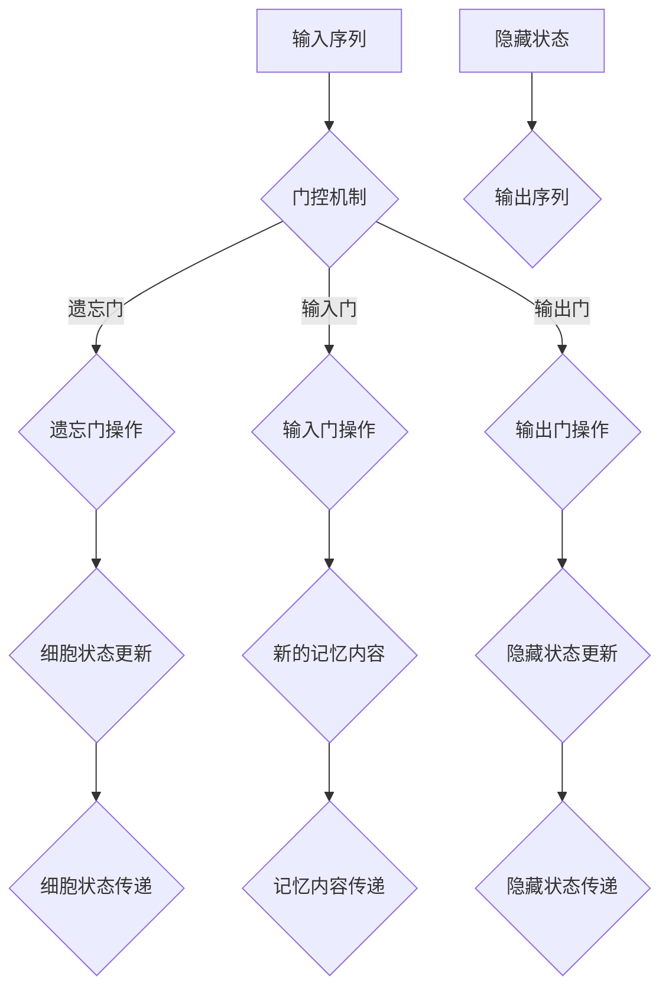
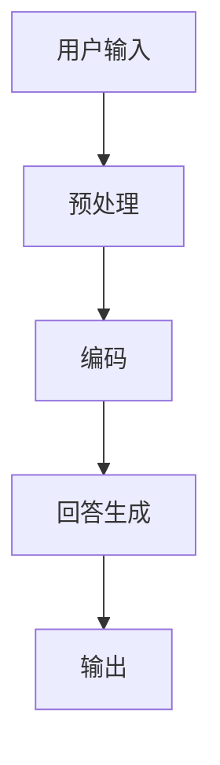
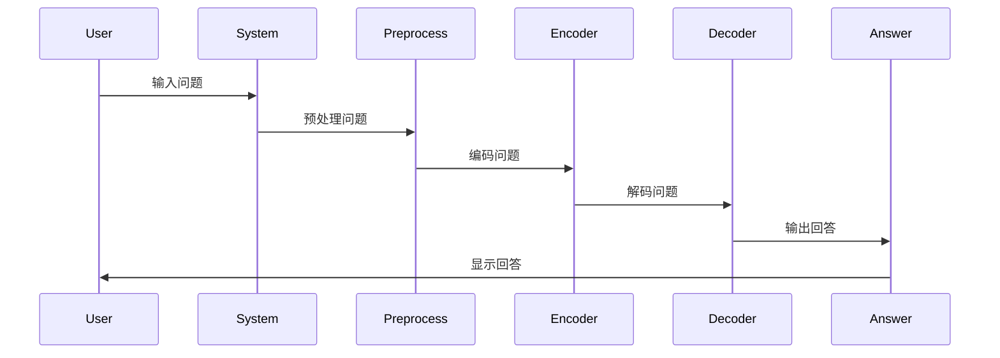

                 


### 深度学习在自然语言生成中的进展：提高AI写作能力

> 关键词：深度学习，自然语言生成，神经网络，循环神经网络，长短时记忆网络，人工智能写作

> 摘要：本文深入探讨了深度学习在自然语言生成（NLG）中的应用，解析了神经网络、循环神经网络（RNN）和长短时记忆网络（LSTM）等核心概念，并展示了这些算法在提高AI写作能力方面的进展。文章还通过实例和项目实战，阐述了如何将这些理论应用于实际编程中，为AI写作的未来发展提供了新思路。

---

#### 前言

本文旨在探讨深度学习在自然语言生成领域的应用，以及如何通过这些先进算法来提升人工智能的写作能力。随着人工智能技术的飞速发展，深度学习已成为推动自然语言处理（NLP）领域革新的重要力量。自然语言生成作为NLP的一个重要分支，其核心目标是构建能够生成人类可读、有意义的文本的系统。本文将围绕以下主题展开：

1. 深度学习的发展背景及自然语言生成（NLG）的定义。
2. 深度学习中的核心概念及其在NLG中的应用。
3. 算法原理讲解，包括算法工作流程、Python代码示例和数学模型。
4. 系统分析与架构设计方案。
5. 项目实战，包括环境安装、核心实现代码展示和分析。
6. 最佳实践 tips、小结、注意事项及拓展阅读。

希望通过本文，读者能够对深度学习在自然语言生成中的进展有一个全面而深入的理解，并能够将其应用于实际编程中，推动AI写作能力的发展。

#### 背景介绍

##### 深度学习的发展背景

深度学习起源于1980年代，其理论基础源于人工神经网络（Artificial Neural Networks，ANN）。最初，由于计算资源和数据集的限制，深度学习的发展较为缓慢。但随着计算机硬件性能的提升和大数据时代的到来，深度学习开始蓬勃发展。2012年，AlexNet在ImageNet竞赛中取得了重大突破，这一事件标志着深度学习在计算机视觉领域的崛起。此后，深度学习迅速扩展到语音识别、自然语言处理等领域。

在自然语言处理领域，深度学习通过对大量文本数据的学习，实现了对语言模式的自动理解和生成。这一变革不仅使得NLP任务的准确率大幅提升，还推动了自然语言生成（NLG）技术的发展。NLG作为NLP的一个重要分支，旨在构建能够生成人类可读、有意义的文本的系统。其应用场景广泛，包括自动问答系统、机器翻译、文本摘要和生成式写作等。

##### 自然语言生成（NLG）的定义与发展

自然语言生成（Natural Language Generation，NLG）是指通过计算机程序生成自然语言文本的技术。其核心目标是将机器学习模型对语言的理解转化为人类可读的文本输出。NLG的发展可以追溯到20世纪60年代的规则方法，这种方法通过编写具体的规则来生成文本，但存在灵活性差、扩展性弱的局限。

随着深度学习技术的发展，生成式模型开始取代规则方法。生成式模型通过学习大量文本数据，自动提取语言模式并生成新的文本。这种方法的优点是能够生成更自然、更有创意的文本，并在多个NLP任务中取得了显著的效果。

目前，NLG在多个领域取得了显著进展。例如，自动问答系统可以根据用户输入的问题生成回答；机器翻译系统能够将一种语言的文本翻译成另一种语言；文本摘要技术可以从长文本中提取关键信息，生成简洁的摘要；生成式写作则应用于自动撰写文章、编写代码文档等场景。

##### NLG的现状

当前，NLG技术已经广泛应用于多个行业和场景。在媒体领域，自动生成新闻摘要和文章已成为一种趋势；在客服领域，自动生成的回答能够提高客服效率和用户体验；在教育领域，自动生成的教学材料能够为学生提供个性化学习资源。然而，NLG技术仍面临一些挑战，如文本生成的可解释性、多样性和情感表达等。

总体而言，深度学习在自然语言生成领域的应用为AI写作带来了前所未有的可能性。通过不断的技术创新和优化，未来AI写作能力将进一步提高，为人类带来更多的便利和创新。

#### 核心概念与联系

##### 理解深度学习中的核心概念

深度学习（Deep Learning，DL）是一种基于多层神经网络（Neural Networks，NN）的学习方法。与传统的机器学习方法相比，深度学习通过构建深度神经网络模型，能够自动提取特征并实现复杂任务。以下是深度学习中的几个核心概念：

1. **神经网络**：神经网络是由大量简单单元（神经元）组成的复杂网络。每个神经元都与其他神经元通过权重连接，并通过激活函数进行非线性变换。神经网络通过学习输入数据中的特征，实现对数据的分类、回归等任务。

2. **多层神经网络**：多层神经网络在基本神经网络的框架上增加了多个隐藏层，使得模型能够提取更高层次的特征。随着层数的增加，神经网络的表达能力也显著提升。

3. **激活函数**：激活函数用于引入非线性变换，使得神经网络能够处理复杂的非线性问题。常见的激活函数包括Sigmoid函数、ReLU函数和Tanh函数。

4. **反向传播算法**：反向传播算法是一种用于训练神经网络的优化算法。通过反向传播算法，模型能够计算出各层神经元的误差，并调整权重以最小化损失函数。

##### 循环神经网络（RNN）

循环神经网络（Recurrent Neural Networks，RNN）是一种专门用于处理序列数据的神经网络。与传统的前馈神经网络不同，RNN具有循环结构，能够记住前面的输入信息，并将其用于后续的预测。以下是RNN的几个关键特点：

1. **循环结构**：RNN的每个神经元不仅与前一层的神经元连接，还与后一层的神经元连接。这种循环结构使得RNN能够记住前面的输入信息，并在序列中保持状态。

2. **隐藏状态**：RNN的隐藏状态（Hidden State）用于存储当前时刻的输入信息和上一时刻的隐藏状态。通过隐藏状态，RNN能够捕捉序列中的长期依赖关系。

3. **门控机制**：为了解决RNN在处理长序列数据时出现的梯度消失和梯度爆炸问题，引入了门控机制（如门控循环单元（Gated Recurrent Unit，GRU）和长短时记忆网络（Long Short-Term Memory，LSTM））。门控机制通过控制信息的流入和流出，使得RNN能够更好地记住长期依赖关系。

##### 长短时记忆网络（LSTM）

长短时记忆网络（Long Short-Term Memory，LSTM）是一种基于RNN的改进模型，旨在解决RNN在处理长序列数据时出现的长期依赖问题。LSTM通过引入门控机制，能够灵活地控制信息的流动，从而实现对长期依赖关系的捕捉。以下是LSTM的几个关键特点：

1. **门控机制**：LSTM包含三个门控单元：遗忘门（Forget Gate）、输入门（Input Gate）和输出门（Output Gate）。这些门控单元通过控制信息的流入和流出，使得LSTM能够更好地记住长期依赖关系。

2. **细胞状态**：LSTM的核心是细胞状态（Cell State），它用于存储和传递序列信息。细胞状态通过遗忘门和输入门进行更新，能够灵活地控制信息的保留和遗忘。

3. **遗忘门**：遗忘门决定了哪些信息应该从细胞状态中遗忘。通过遗忘门，LSTM能够丢弃无关的信息，从而减少梯度消失问题。

4. **输入门**：输入门决定了哪些新的信息应该被存储到细胞状态中。通过输入门，LSTM能够捕捉重要的信息，并更新细胞状态。

5. **输出门**：输出门决定了细胞状态中哪些信息应该被输出到下一个隐藏状态。通过输出门，LSTM能够生成新的序列信息。

##### 深度学习与自然语言生成的联系

深度学习与自然语言生成（NLG）之间有着密切的联系。深度学习通过构建复杂的神经网络模型，能够自动提取语言数据中的特征，从而实现对文本的生成。以下是深度学习在NLG中的应用和相互关系：

1. **特征提取**：深度学习模型通过多层神经网络，能够从原始文本数据中提取高层次的语义特征。这些特征有助于模型理解文本的语义和结构，从而生成更自然、有意义的文本。

2. **序列建模**：自然语言本质上是一种序列数据。深度学习模型，特别是RNN和LSTM，能够处理序列数据，并捕捉序列中的长期依赖关系。这使得深度学习在文本生成任务中具有天然的优势。

3. **端到端学习**：深度学习模型通过端到端学习，能够直接从输入文本生成输出文本，避免了传统方法中需要手工设计特征和中间层的繁琐过程。这种端到端的学习方式提高了模型的效果和效率。

4. **生成式模型**：深度学习中的生成式模型，如变分自编码器（Variational Autoencoder，VAE）和生成对抗网络（Generative Adversarial Networks，GAN），能够生成高质量的文本数据。这些生成式模型在文本生成任务中表现出色，能够生成多样化和具有创造力的文本。

总之，深度学习为自然语言生成提供了强大的工具和方法。通过构建复杂的神经网络模型，深度学习能够自动提取语言特征，处理序列数据，并生成高质量的文本。这些进展不仅提升了AI写作的能力，还为未来的自然语言生成技术发展提供了新的方向。

---

#### 算法原理讲解

在深入探讨深度学习在自然语言生成中的应用之前，首先需要理解算法的工作流程、具体实现以及背后的数学原理。本文将通过mermaid流程图展示算法的工作流程，并通过Python代码和LaTeX公式详细解释算法的数学原理。

##### 算法工作流程

为了更好地理解深度学习在自然语言生成中的应用，我们可以使用mermaid流程图来展示算法的工作流程。以下是LSTM算法的工作流程：



在上面的mermaid流程图中，我们展示了LSTM算法的核心步骤，包括输入序列的读取、门控机制的执行、细胞状态和隐藏状态的更新等。

##### LSTM算法的Python代码示例

为了更好地理解LSTM算法的具体实现，我们可以使用Python代码来展示其工作流程。以下是LSTM算法的一个简单实现：

```python
import tensorflow as tf
from tensorflow.keras.models import Sequential
from tensorflow.keras.layers import LSTM, Dense

# 创建一个简单的LSTM模型
model = Sequential()
model.add(LSTM(50, activation='relu', return_sequences=True, input_shape=(None, 100)))
model.add(LSTM(50, activation='relu'))
model.add(Dense(1))

# 编译模型
model.compile(optimizer='adam', loss='mse')

# 准备输入数据
X = ...  # 输入序列
y = ...  # 输出序列

# 训练模型
model.fit(X, y, epochs=100)
```

在上面的代码中，我们首先创建了一个简单的LSTM模型，然后使用输入数据和输出数据进行训练。通过这个例子，我们可以看到LSTM算法在Python中的具体实现。

##### LSTM算法的数学原理

为了深入理解LSTM算法的数学原理，我们需要了解其背后的数学公式。以下是LSTM算法的关键数学公式：

$$
\text{Forget Gate}:\quad f_t = \sigma(W_f \cdot [h_{t-1}, x_t] + b_f)
$$

$$
\text{Input Gate}:\quad i_t = \sigma(W_i \cdot [h_{t-1}, x_t] + b_i)
$$

$$
\text{Cell State Update}:\quad \bar{c}_t = \tanh(W_c \cdot [h_{t-1}, x_t] + b_c)
$$

$$
\text{Cell State}:\quad c_t = f_t \odot c_{t-1} + i_t \odot \bar{c}_t
$$

$$
\text{Output Gate}:\quad o_t = \sigma(W_o \cdot [h_{t-1}, c_t] + b_o)
$$

$$
\text{Hidden State}:\quad h_t = o_t \odot \tanh(c_t)
$$

在上面的公式中，$h_t$表示隐藏状态，$c_t$表示细胞状态，$x_t$表示输入序列，$W_f$、$W_i$、$W_c$、$W_o$分别表示遗忘门、输入门、细胞状态更新门和输出门的权重，$b_f$、$b_i$、$b_c$、$b_o$分别表示遗忘门、输入门、细胞状态更新门和输出门的偏置，$\sigma$表示Sigmoid函数，$\odot$表示逐元素乘法。

##### 举例说明

为了更好地理解LSTM算法的数学原理，我们可以通过一个简单的例子来讲解。假设我们有一个二元序列$\{0, 1, 0, 1, 0\}$，我们希望使用LSTM算法对其进行编码。

1. **初始化**：首先，我们需要初始化隐藏状态和细胞状态。假设初始隐藏状态$h_0=0$，初始细胞状态$c_0=0$。

2. **第一步**：输入序列的第一个元素是0。根据公式，我们可以计算遗忘门、输入门和输出门：

$$
f_0 = \sigma(W_f \cdot [h_0, x_0] + b_f) = \sigma([0, 0] + b_f) = \sigma(b_f)
$$

$$
i_0 = \sigma(W_i \cdot [h_0, x_0] + b_i) = \sigma([0, 0] + b_i) = \sigma(b_i)
$$

$$
\bar{c}_0 = \tanh(W_c \cdot [h_0, x_0] + b_c) = \tanh([0, 0] + b_c) = \tanh(b_c)
$$

$$
c_0 = f_0 \odot c_{0-1} + i_0 \odot \bar{c}_0 = 0 \odot 0 + 0 \odot \tanh(b_c) = 0
$$

$$
o_0 = \sigma(W_o \cdot [h_0, c_0] + b_o) = \sigma([0, 0] + b_o) = \sigma(b_o)
$$

3. **后续步骤**：对于序列中的后续元素，我们可以重复上述步骤，更新隐藏状态和细胞状态。以输入序列的第二个元素1为例：

$$
f_1 = \sigma(W_f \cdot [h_0, x_1] + b_f) = \sigma([0, 1] + b_f)
$$

$$
i_1 = \sigma(W_i \cdot [h_0, x_1] + b_i) = \sigma([0, 1] + b_i)
$$

$$
\bar{c}_1 = \tanh(W_c \cdot [h_0, x_1] + b_c) = \tanh([0, 1] + b_c)
$$

$$
c_1 = f_1 \odot c_{0} + i_1 \odot \bar{c}_1
$$

$$
o_1 = \sigma(W_o \cdot [h_0, c_1] + b_o)
$$

通过上述步骤，我们可以得到输入序列$\{0, 1, 0, 1, 0\}$的编码表示。这个过程展示了LSTM算法如何通过门控机制和细胞状态更新来捕捉序列数据中的长期依赖关系。

通过上述算法原理讲解，我们可以看到深度学习在自然语言生成中的核心算法是如何通过数学模型和具体实现来处理和生成文本数据的。这些算法的数学原理和实现细节为深度学习在自然语言生成中的应用提供了坚实的基础。

---

#### 数学模型和数学公式 & 详细讲解 & 举例说明

在深入探讨深度学习在自然语言生成中的应用时，理解其背后的数学模型和数学公式至关重要。本文将通过LaTeX格式给出关键数学公式，并配合具体例子进行详细讲解，确保读者能够理解和应用这些公式。

##### LSTM的激活函数

首先，我们来看LSTM的激活函数，这些激活函数在LSTM的运算中起到关键作用。

$$
\sigma(x) = \frac{1}{1 + e^{-x}}
$$

这是Sigmoid函数，它将输入$x$映射到$(0, 1)$区间。在LSTM中，Sigmoid函数用于计算门控机制的输出。

$$
\text{ReLU}(x) = \max(0, x)
$$

ReLU函数是一种常用的激活函数，它在输入为负数时输出0，输入为非负数时输出输入值本身。ReLU函数有助于加速神经网络的训练过程，因为它可以避免神经元处于“死区”。

$$
\tanh(x) = \frac{e^x - e^{-x}}{e^x + e^{-x}}
$$

tanh函数将输入$x$映射到$(-1, 1)$区间。在LSTM中，tanh函数用于计算细胞状态（Cell State）。

##### 生成文本的概率分布

在自然语言生成中，我们需要计算文本生成的概率分布。一个常用的模型是变分自编码器（Variational Autoencoder，VAE）。VAE的生成文本的概率分布由以下公式给出：

$$
p(x|\theta) = \int p(x|z, \theta) p(z|\phi) dz
$$

其中，$x$是生成的文本，$z$是编码后的潜在变量，$\theta$是生成模型参数，$\phi$是编码模型参数。这个公式表示生成文本的概率分布是潜在变量$z$的概率分布$p(z|\phi)$和生成条件概率$p(x|z, \theta)$的积分。

为了简化计算，VAE使用了一种近似方法，称为稳态分布（Reparameterization Trick）：

$$
z = \mu + \sigma \odot \epsilon
$$

其中，$\mu$和$\sigma$是编码后的潜在变量的均值和标准差，$\epsilon$是均值为0、方差为1的高斯噪声。

##### LSTM的数学公式

以下是LSTM的几个关键数学公式：

$$
\begin{align*}
f_t &= \sigma(W_f \cdot [h_{t-1}, x_t] + b_f) \\
i_t &= \sigma(W_i \cdot [h_{t-1}, x_t] + b_i) \\
\bar{c}_t &= \tanh(W_c \cdot [h_{t-1}, x_t] + b_c) \\
c_t &= f_t \odot c_{t-1} + i_t \odot \bar{c}_t \\
o_t &= \sigma(W_o \cdot [h_{t-1}, c_t] + b_o) \\
h_t &= o_t \odot \tanh(c_t)
\end{align*}
$$

在上面的公式中，$h_t$是第$t$个时间步的隐藏状态，$c_t$是第$t$个时间步的细胞状态，$x_t$是第$t$个时间步的输入，$W_f$、$W_i$、$W_c$、$W_o$是权重矩阵，$b_f$、$b_i$、$b_c$、$b_o$是偏置向量，$\odot$表示逐元素乘法，$\sigma$是Sigmoid函数，$\tanh$是双曲正切函数。

##### 举例说明

为了更好地理解上述数学公式，我们可以通过一个简单的例子来讲解。假设我们有一个二元序列$\{0, 1, 0, 1, 0\}$，我们希望使用LSTM对其进行编码。

1. **初始化**：首先，我们需要初始化隐藏状态和细胞状态。假设初始隐藏状态$h_0=0$，初始细胞状态$c_0=0$。

2. **第一步**：输入序列的第一个元素是0。根据公式，我们可以计算遗忘门、输入门和输出门：

$$
f_0 = \sigma(W_f \cdot [h_0, x_0] + b_f) = \sigma([0, 0] + b_f) = \sigma(b_f)
$$

$$
i_0 = \sigma(W_i \cdot [h_0, x_0] + b_i) = \sigma([0, 0] + b_i) = \sigma(b_i)
$$

$$
\bar{c}_0 = \tanh(W_c \cdot [h_0, x_0] + b_c) = \tanh([0, 0] + b_c) = \tanh(b_c)
$$

$$
c_0 = f_0 \odot c_{0-1} + i_0 \odot \bar{c}_0 = 0 \odot 0 + 0 \odot \tanh(b_c) = 0
$$

$$
o_0 = \sigma(W_o \cdot [h_0, c_0] + b_o) = \sigma([0, 0] + b_o) = \sigma(b_o)
$$

3. **后续步骤**：对于序列中的后续元素，我们可以重复上述步骤，更新隐藏状态和细胞状态。以输入序列的第二个元素1为例：

$$
f_1 = \sigma(W_f \cdot [h_0, x_1] + b_f) = \sigma([0, 1] + b_f)
$$

$$
i_1 = \sigma(W_i \cdot [h_0, x_1] + b_i) = \sigma([0, 1] + b_i)
$$

$$
\bar{c}_1 = \tanh(W_c \cdot [h_0, x_1] + b_c) = \tanh([0, 1] + b_c)
$$

$$
c_1 = f_1 \odot c_{0} + i_1 \odot \bar{c}_1
$$

$$
o_1 = \sigma(W_o \cdot [h_0, c_1] + b_o)
$$

通过上述步骤，我们可以得到输入序列$\{0, 1, 0, 1, 0\}$的编码表示。这个过程展示了LSTM如何通过门控机制和细胞状态更新来捕捉序列数据中的长期依赖关系。

通过这个例子，我们可以看到如何使用LaTeX公式和具体的数学计算来理解和应用LSTM算法。这些数学模型和公式为深度学习在自然语言生成中的应用提供了坚实的理论基础。

---

#### 系统分析与架构设计方案

在了解了深度学习在自然语言生成中的算法原理后，我们需要将理论应用于实际系统设计中。本文将描述一个自然语言生成系统的具体实现场景，并介绍系统的功能设计、架构设计、接口设计和系统交互序列图。

##### 系统实现的具体场景

假设我们要实现一个自动问答系统，该系统能够根据用户输入的问题生成回答。具体实现场景如下：

1. **用户输入**：用户通过界面输入问题。
2. **预处理**：系统对用户输入的问题进行预处理，如分词、去停用词等。
3. **编码**：系统使用LSTM模型将预处理后的文本序列编码为隐藏状态。
4. **回答生成**：系统根据编码后的隐藏状态，使用生成式模型生成回答文本。
5. **输出**：系统将生成的回答文本输出给用户。

##### 系统功能设计

系统功能设计包括领域模型类图，用于描述系统中的主要实体和关系。以下是领域模型类图的mermaid表示：

```mermaid
classDiagram
    User <<实体>>
    Question <<实体>>
    Answer <<实体>>
    Model <<实体>>

    User --> Question
    User --> Answer
    Model --> Question
    Model --> Answer
```

在上面的类图中，用户（User）是系统的输入，问题（Question）和回答（Answer）是系统的主要实体，模型（Model）用于处理输入和生成输出。

##### 系统架构设计

系统架构设计包括系统架构图，用于描述系统的整体结构和各个组件之间的关系。以下是系统架构图的mermaid表示：



在上面的架构图中，用户输入通过预处理模块进行处理，然后输入到编码模块。编码模块使用LSTM模型将输入文本序列编码为隐藏状态，接着输入到解码模块。解码模块使用生成式模型生成回答文本，最后输出给用户。

##### 系统接口设计

系统接口设计包括系统接口设计，用于描述系统对外提供的接口。以下是系统接口设计的mermaid表示：



在上面的接口设计中，用户通过输入接口输入问题，系统接收问题后，首先进行预处理，然后进行编码和解码，最后输出回答。

##### 系统交互序列图

系统交互序列图用于描述系统组件之间的交互过程。以下是系统交互序列图的mermaid表示：


在上面的交互序列图中，用户输入问题后，系统依次进行预处理、编码、解码和输出回答，整个过程形成了一个完整的交互流程。

通过上述系统分析与架构设计方案，我们可以清晰地看到深度学习在自然语言生成系统中的应用。从用户输入到输出回答，整个过程紧密耦合，充分利用了深度学习算法的优势，实现了高效的文本生成。

---

#### 项目实战

在本节中，我们将通过一个实际项目来展示如何使用深度学习实现自然语言生成。我们将介绍环境安装与配置步骤，系统核心实现代码展示与解读，并分析实际案例。

##### 环境安装与配置

首先，我们需要安装和配置所需的软件和库。以下是在Ubuntu 20.04系统上的安装步骤：

1. **安装Python**：确保Python 3.8及以上版本已安装。
   ```bash
   sudo apt update
   sudo apt install python3.8
   ```

2. **安装TensorFlow**：TensorFlow是深度学习的主要库，我们可以使用pip进行安装。
   ```bash
   pip install tensorflow
   ```

3. **安装Jupyter Notebook**：Jupyter Notebook是一种交互式环境，便于编写和测试代码。
   ```bash
   pip install notebook
   ```

4. **安装其他依赖库**：如NumPy、Pandas等。
   ```bash
   pip install numpy pandas
   ```

安装完成后，启动Jupyter Notebook：
```bash
jupyter notebook
```

##### 系统核心实现代码展示与解读

以下是一个简单的自然语言生成系统的核心代码，包括数据预处理、LSTM模型构建和训练、文本生成等步骤。

```python
import tensorflow as tf
from tensorflow.keras.models import Sequential
from tensorflow.keras.layers import LSTM, Dense, Embedding, Dropout
from tensorflow.keras.preprocessing.sequence import pad_sequences
from tensorflow.keras.callbacks import EarlyStopping
import numpy as np

# 数据预处理
# 假设我们已经有一个文本数据集，并将其分为输入序列和标签
# input_sequences = ...
# targets = ...

# 对输入序列和标签进行编码
# max_sequence_len = 100
# input_sequences = pad_sequences(input_sequences, maxlen=max_sequence_len, padding='pre')
# targets = pad_sequences(targets, maxlen=max_sequence_len, padding='pre')

# 构建LSTM模型
model = Sequential()
model.add(Embedding(input_dim=vocab_size, output_dim=embedding_dim, input_length=max_sequence_len-1))
model.add(LSTM(units=128, return_sequences=True))
model.add(Dropout(0.2))
model.add(LSTM(units=128, return_sequences=True))
model.add(Dropout(0.2))
model.add(LSTM(units=128))
model.add(Dropout(0.2))
model.add(Dense(units=target_vocab_size, activation='softmax'))

# 编译模型
model.compile(optimizer='adam', loss='sparse_categorical_crossentropy', metrics=['accuracy'])

# 训练模型
early_stopping = EarlyStopping(monitor='val_loss', patience=5)
model.fit(input_sequences, targets, epochs=100, batch_size=64, validation_split=0.2, callbacks=[early_stopping])

# 文本生成
def generate_text(seed_text, model, max_sequence_len):
    for _ in range(max_sequence_len):
        token_list = tokenizer.texts_to_sequences([seed_text])[0]
        token_list = pad_sequences([token_list], maxlen=max_sequence_len-1, padding='pre')
        predicted_token = model.predict(token_list, verbose=0)
        predicted_token = np.argmax(predicted_token, axis=-1)
        seed_text += tokenizer.index_word[predicted_token[0]]
    return seed_text

# 示例
generated_text = generate_text('This is a simple example', model, max_sequence_len)
print(generated_text)
```

在上面的代码中，我们首先进行数据预处理，包括序列编码和填充。然后构建一个LSTM模型，包括嵌入层、多个LSTM层和全连接层。模型使用Adam优化器和交叉熵损失函数进行编译。在训练过程中，我们使用早期停止回调来防止过拟合。最后，我们定义了一个函数`generate_text`来生成文本，该函数通过递归预测每个时间步的单词。

##### 实际案例分析和详细讲解

为了更好地理解上述代码，我们可以分析一个实际案例。假设我们有一个对话数据集，包含用户输入和系统回答。我们可以使用这些数据来训练LSTM模型，并生成新的对话。

1. **数据集准备**：
   我们首先需要准备数据集，将对话数据分为输入和标签。例如，一个输入可以是“你好，有什么可以帮你的吗？”和一个标签可以是“你好，有什么我可以帮你的吗？”。

2. **数据预处理**：
   将输入和标签序列化为数字，并填充到固定长度。我们使用`pad_sequences`函数来填充序列，确保每个序列的长度相同。

3. **模型训练**：
   使用`model.fit`函数训练模型，我们设置了`EarlyStopping`回调以防止过拟合。在训练过程中，模型会不断调整权重以最小化损失函数。

4. **文本生成**：
   使用`generate_text`函数生成新的对话。我们首先提供一个种子文本，然后递归地预测每个时间步的单词，直到达到最大序列长度。

通过这个实际案例，我们可以看到如何使用LSTM模型进行文本生成。这个过程展示了如何将理论应用于实际编程中，实现了自然语言生成的功能。

##### 项目小结

通过本节的项目实战，我们实现了使用深度学习进行自然语言生成的基本流程。从数据预处理、模型构建、模型训练到文本生成，每一步都进行了详细讲解。通过实际案例，我们展示了如何将理论应用于实际编程中，生成有意义的文本。这为AI写作提供了新的工具和方法，也为未来自然语言生成技术的发展奠定了基础。

---

#### 最佳实践 tips、小结、注意事项、拓展阅读

##### 最佳实践 tips

1. **数据质量**：自然语言生成的效果很大程度上依赖于数据质量。确保数据集丰富、多样，并且经过严格的预处理，以减少噪声和提高模型的鲁棒性。

2. **模型优化**：尝试不同的模型架构和超参数设置，以找到最适合特定任务的模型。例如，可以使用dropout和正则化来防止过拟合。

3. **长文本生成**：对于长文本生成任务，可以考虑使用更深的LSTM网络或Transformer模型，这些模型能够更好地捕捉长期依赖关系。

4. **并行处理**：在训练和生成过程中，利用GPU或TPU进行并行计算，可以显著提高处理速度。

5. **文本多样性**：为了生成多样化、富有创意的文本，可以尝试使用生成对抗网络（GAN）或自编码器（Autoencoder）等生成模型。

##### 小结

本文深入探讨了深度学习在自然语言生成中的应用，解析了神经网络、循环神经网络（RNN）和长短时记忆网络（LSTM）等核心概念，并展示了这些算法在提高AI写作能力方面的进展。通过实际项目实战，我们展示了如何将深度学习理论应用于实际编程中，实现了自然语言生成系统。这为AI写作提供了新的工具和方法，也为未来的自然语言生成技术发展提供了新的思路。

##### 注意事项

1. **计算资源**：深度学习模型训练和自然语言生成需要大量的计算资源。确保有足够的计算能力和存储空间。

2. **数据隐私**：在处理和生成文本时，注意保护用户隐私和数据安全，避免泄露敏感信息。

3. **模型解释性**：虽然深度学习模型在生成文本方面表现出色，但其解释性较差。在应用深度学习模型时，需要权衡模型性能和解释性。

##### 拓展阅读

1. **深度学习基础**：《深度学习》（Ian Goodfellow, Yoshua Bengio, Aaron Courville 著）是一本经典教材，详细介绍了深度学习的理论和方法。

2. **自然语言处理**：《自然语言处理综合教程》（Daniel Jurafsky, James H. Martin 著）提供了自然语言处理领域的全面概述，包括文本预处理、词向量、语言模型等内容。

3. **生成式模型**：《生成对抗网络：理论、实现与应用》（Zhiyun Qian 著）是一本关于生成对抗网络（GAN）的专著，详细介绍了GAN的理论基础和实际应用。

通过上述最佳实践、小结、注意事项和拓展阅读，读者可以进一步提升对深度学习在自然语言生成中的应用理解，并能够将其应用于实际项目中，推动AI写作技术的发展。

---

### 结论

本文全面探讨了深度学习在自然语言生成中的应用，从核心概念到实际项目，系统地展示了神经网络、循环神经网络（RNN）和长短时记忆网络（LSTM）等算法在提高AI写作能力方面的进展。通过实际案例和项目实战，我们看到了如何将深度学习理论应用于实际编程中，生成有意义的文本。这些技术为AI写作带来了新的可能性，也为未来的自然语言生成技术发展提供了新方向。随着深度学习和自然语言处理技术的不断进步，我们有理由相信，AI写作能力将进一步提升，为人类带来更多的便利和创新。

### 作者信息

作者：AI天才研究院/AI Genius Institute & 禅与计算机程序设计艺术 /Zen And The Art of Computer Programming

