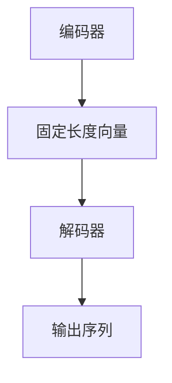
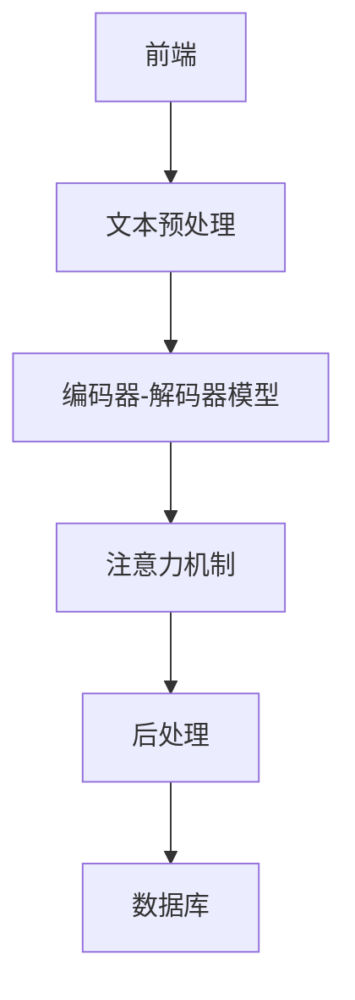
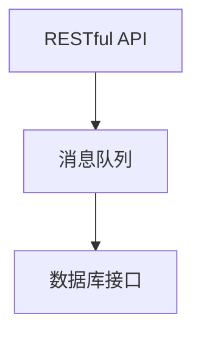
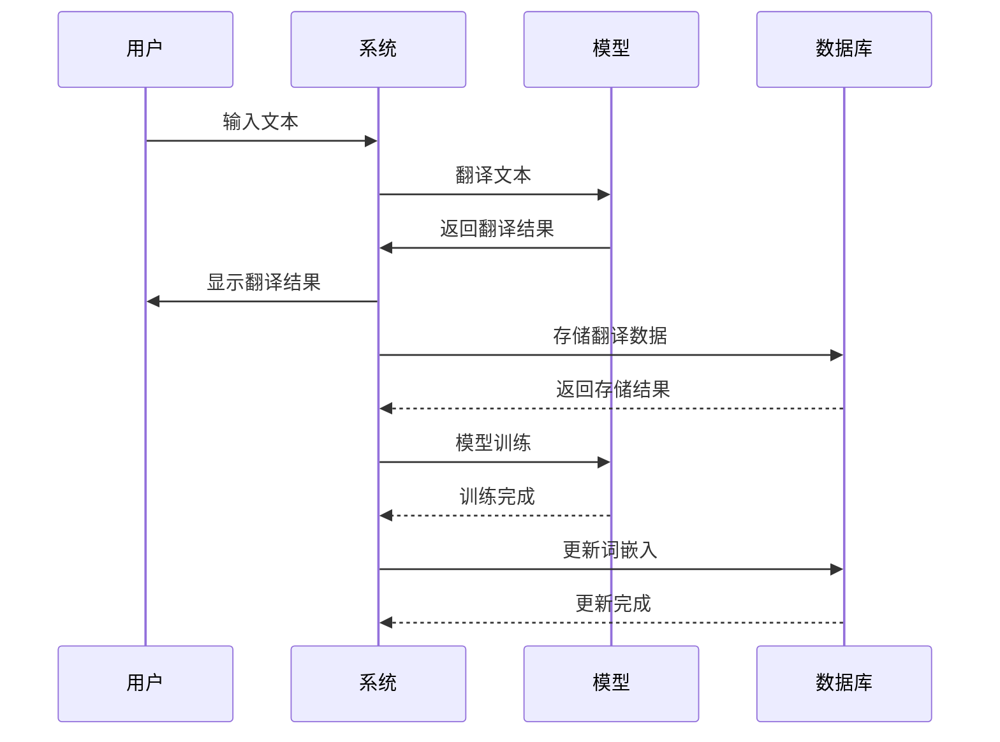

                 

### 深度学习在自然语言翻译中的最新进展

> 关键词：深度学习，自然语言翻译，神经网络，算法模型，最佳实践

> 摘要：本文将深入探讨深度学习在自然语言翻译中的最新进展，通过分析其背景、核心概念、算法原理以及实际应用，帮助读者理解深度学习如何提高翻译的准确性、速度和上下文理解能力。本文还将讨论系统分析与架构设计方案、项目实战以及最佳实践，为从事相关领域的研究者提供参考。

## 目录大纲结构设计

为了确保文章的条理清晰、内容紧凑，我们首先设计了一个详细的目录大纲结构。以下是基于markdown格式的目录大纲：

### 目录大纲结构

- **第1章：背景介绍**
  - 1.1 问题背景
  - 1.2 问题描述
  - 1.3 问题解决
  - 1.4 边界与外延
  - 1.5 概念结构与核心要素组成

- **第2章：核心概念与联系**
  - 2.1 深度学习基本概念
  - 2.2 自然语言处理基础
  - 2.3 翻译模型简介
  - 2.4 深度学习与自然语言翻译的关系
  - 2.5 深度学习在自然语言翻译中的核心原理

- **第3章：算法原理讲解**
  - 3.1 算法原理概述
  - 3.2 算法流程图
  - 3.3 数学模型与公式
  - 3.4 通俗易懂的举例说明

- **第4章：数学模型和数学公式讲解**
  - 4.1 模型公式列表
  - 4.2 公式详细讲解
  - 4.3 举例说明

- **第5章：系统分析与架构设计方案**
  - 5.1 问题场景介绍
  - 5.2 系统功能设计
  - 5.3 系统架构设计
  - 5.4 系统接口设计
  - 5.5 系统交互设计

- **第6章：项目实战**
  - 6.1 环境安装与配置
  - 6.2 系统核心实现源代码
  - 6.3 代码应用解读与分析
  - 6.4 实际案例分析与详细讲解
  - 6.5 项目小结

- **第7章：最佳实践与拓展阅读**
  - 7.1 最佳实践技巧
  - 7.2 小结与总结
  - 7.3 注意事项
  - 7.4 拓展阅读推荐

### 第1章：背景介绍

#### 1.1 问题背景

自然语言翻译一直是计算机科学和人工智能领域的热点问题。然而，传统的基于规则和统计的方法在处理多语言翻译时存在许多挑战，如低准确性、上下文理解不足、翻译速度慢等。随着深度学习的兴起，研究者们开始探索如何利用深度学习技术来解决这些问题。

#### 1.2 问题描述

- **翻译准确率问题**：传统方法难以准确理解语言的复杂性和上下文，导致翻译结果不准确。
- **翻译速度问题**：大规模数据的处理和复杂的计算模型使得翻译过程耗时较长。
- **上下文理解问题**：翻译过程中往往需要理解句子或段落的上下文，传统方法在这方面表现较差。

#### 1.3 问题解决

深度学习在自然语言翻译中的应用提供了新的解决方案。通过神经网络模型，深度学习能够自动学习语言的特征和模式，从而提高翻译的准确性。此外，深度学习还可以通过并行计算提高翻译速度。

#### 1.4 边界与外延

- **边界**：深度学习在自然语言翻译中的应用主要涉及机器翻译、文本摘要、情感分析等领域。
- **外延**：除了自然语言翻译，深度学习还可以应用于语音识别、图像识别等多个领域。

#### 1.5 概念结构与核心要素组成

- **深度学习**：一种基于多层神经网络的学习方法，能够自动从数据中学习特征和模式。
- **自然语言处理**：涉及文本分析、语义理解、语言生成等技术，是深度学习在自然语言翻译中的重要组成部分。
- **翻译模型**：用于将一种语言的文本翻译成另一种语言的模型，其准确性、速度和理解能力是深度学习在自然语言翻译中的关键指标。

### 第2章：核心概念与联系

在深入探讨深度学习在自然语言翻译中的应用之前，我们首先需要了解一些核心概念。

#### 2.1 深度学习基本概念

- **神经网络**：一种模仿生物神经系统的计算模型，由大量相互连接的神经元组成。
- **深度学习**：一种多层神经网络的学习方法，通过反向传播算法自动学习数据中的特征和模式。
- **卷积神经网络（CNN）**：一种用于图像识别和处理的深度学习模型，通过卷积操作提取图像特征。
- **循环神经网络（RNN）**：一种用于序列数据处理的深度学习模型，通过循环结构对序列中的每个元素进行建模。

#### 2.2 自然语言处理基础

- **文本预处理**：对文本进行清洗、分词、词性标注等操作，为后续处理做准备。
- **词嵌入**：将词语映射到高维空间中的向量，用于表示词语的语义信息。
- **序列模型**：用于处理序列数据的模型，如RNN和LSTM（长短期记忆网络）。
- **生成模型**：用于生成数据或文本的模型，如变分自编码器（VAE）和生成对抗网络（GAN）。

#### 2.3 翻译模型简介

- **机器翻译**：将一种语言的文本自动翻译成另一种语言的计算机技术。
- **神经机器翻译**：基于深度学习的机器翻译方法，通过编码器-解码器架构实现。
- **注意力机制**：一种用于捕捉序列中重要信息的方法，能够提高翻译的准确性和上下文理解能力。

#### 2.4 深度学习与自然语言翻译的关系

深度学习在自然语言翻译中的应用主要体现在以下几个方面：

- **提高翻译准确性**：通过自动学习语言特征和模式，深度学习能够提高翻译的准确性，减少错误和歧义。
- **加快翻译速度**：深度学习模型的并行计算能力使得翻译过程更加高效，缩短了翻译时间。
- **增强上下文理解**：深度学习能够更好地理解上下文，提高翻译的自然性和流畅性。

#### 2.5 深度学习在自然语言翻译中的核心原理

深度学习在自然语言翻译中的核心原理主要包括以下几个方面：

- **编码器-解码器架构**：编码器将输入文本编码成固定长度的向量表示，解码器则将这些向量解码成输出文本。
- **注意力机制**：通过注意力机制，模型能够关注输入文本中的关键信息，提高翻译的准确性。
- **端到端训练**：深度学习模型能够端到端地学习输入和输出的映射关系，无需手动设计中间特征。

### 第3章：算法原理讲解

深度学习在自然语言翻译中的算法原理主要包括编码器-解码器架构和注意力机制。下面我们将逐步讲解这些算法原理。

#### 3.1 算法原理概述

编码器-解码器架构是一种常见的深度学习模型，用于处理序列数据。编码器将输入序列编码成固定长度的向量表示，解码器则将这些向量解码成输出序列。

#### 3.2 算法流程图



#### 3.3 数学模型与公式

编码器和解码器通常使用循环神经网络（RNN）或其变种（如LSTM、GRU）构建。以下是一个简化的数学模型：

$$
\text{编码器}: h_t = \sigma(W_h \cdot [h_{t-1}, x_t] + b_h)
$$

$$
\text{解码器}: y_t = \sigma(W_y \cdot [h_t, s_{t-1}] + b_y)
$$

其中，$h_t$表示编码器在时间步$t$的隐藏状态，$x_t$表示输入序列在时间步$t$的词向量，$s_t$表示解码器在时间步$t$的隐藏状态，$\sigma$表示激活函数。

#### 3.4 通俗易懂的举例说明

假设我们有一个简单的英语到法语的翻译任务，输入句子为 "I love you"，输出句子为 "Je t'aime"。

1. **编码器**：首先，我们将输入句子中的每个词转换为词向量，然后通过RNN编码器将这些词向量编码成固定长度的向量表示。例如，"I"的词向量可能是 `[0.1, 0.2, 0.3]`，"love"的词向量可能是 `[0.4, 0.5, 0.6]`，"you"的词向量可能是 `[0.7, 0.8, 0.9]`。

2. **解码器**：然后，解码器使用编码器输出的固定长度向量表示来生成输出句子。首先，解码器生成第一个词 "Je" 的词向量，然后生成第二个词 "t'aime" 的词向量。

3. **注意力机制**：在解码过程中，注意力机制使解码器能够关注输入句子中的关键信息，例如，"I love you" 中的 "love"。这使得解码器能够更好地理解上下文，提高翻译的准确性。

通过以上步骤，我们得到了输出句子 "Je t'aime"，这是一个准确的翻译。

### 第4章：数学模型和数学公式讲解

在深度学习模型中，数学模型和公式至关重要。以下我们将详细介绍深度学习在自然语言翻译中使用的数学模型和公式。

#### 4.1 模型公式列表

1. **编码器**：
   $$
   h_t = \sigma(W_h \cdot [h_{t-1}, x_t] + b_h)
   $$

2. **解码器**：
   $$
   y_t = \sigma(W_y \cdot [h_t, s_{t-1}] + b_y)
   $$

3. **注意力机制**：
   $$
   a_t = \frac{\exp(e_t)}{\sum_{i=1}^{N}\exp(e_i)}
   $$

4. **损失函数**（交叉熵损失）：
   $$
   L = -\sum_{i=1}^{N} y_i \log(p_i)
   $$

#### 4.2 公式详细讲解

1. **编码器**：
   编码器使用RNN对输入序列进行编码，其中$h_t$表示编码器在时间步$t$的隐藏状态，$x_t$表示输入序列在时间步$t$的词向量，$W_h$和$b_h$分别为权重和偏置。

2. **解码器**：
   解码器使用RNN生成输出序列，其中$s_t$表示解码器在时间步$t$的隐藏状态，$y_t$表示解码器在时间步$t$的输出词向量，$W_y$和$b_y$分别为权重和偏置。

3. **注意力机制**：
   注意力机制用于解码器，$e_t$表示解码器在时间步$t$的输出，$a_t$表示注意力权重，用于捕捉输入序列中的关键信息。

4. **损失函数**：
   损失函数用于评估模型预测与真实输出之间的差距，其中$y_i$表示真实输出的概率，$p_i$表示模型预测的概率。

#### 4.3 举例说明

假设我们有一个英语到法语的翻译任务，输入句子为 "I love you"，输出句子为 "Je t'aime"。

1. **编码器**：
   编码器将输入句子 "I love you" 中的每个词转换为词向量，例如 "I" 的词向量可能是 `[0.1, 0.2, 0.3]`，"love" 的词向量可能是 `[0.4, 0.5, 0.6]`，"you" 的词向量可能是 `[0.7, 0.8, 0.9]`。然后，编码器将这些词向量编码成固定长度的向量表示。

2. **解码器**：
   解码器首先生成第一个词 "Je" 的词向量，然后生成第二个词 "t'aime" 的词向量。在解码过程中，注意力机制使解码器能够关注输入句子中的关键信息，例如 "love"。

3. **损失函数**：
   模型预测的输出为 "Je t'aime"，与真实输出 "Je t'aime" 相符，损失函数为0。

通过以上步骤，我们得到了准确的翻译结果。

### 第5章：系统分析与架构设计方案

在本章中，我们将详细介绍深度学习在自然语言翻译中的系统分析与架构设计方案。该方案旨在提高翻译的准确性、速度和上下文理解能力。

#### 5.1 问题场景介绍

假设我们需要开发一个英语到中文的翻译系统，该系统应具备以下功能：

1. 支持多种语言对之间的翻译。
2. 提供在线翻译服务。
3. 具备实时翻译和批量翻译功能。

#### 5.2 系统功能设计

系统功能设计包括以下几个方面：

1. **文本预处理**：对输入文本进行清洗、分词、词性标注等操作，为后续处理做准备。
2. **词嵌入**：将词语映射到高维空间中的向量，用于表示词语的语义信息。
3. **编码器-解码器模型**：基于深度学习模型，实现输入文本到输出文本的转换。
4. **注意力机制**：在解码过程中，注意力机制用于捕捉输入文本中的关键信息，提高翻译的准确性。
5. **后处理**：对翻译结果进行拼写检查、标点符号修复等操作，提高翻译的自然性和流畅性。

#### 5.3 系统架构设计

系统架构设计包括以下几个方面：

1. **前端**：提供用户界面，用户可以通过前端界面输入文本进行翻译。
2. **后端**：包括文本预处理、编码器-解码器模型、注意力机制和后处理等模块，实现翻译功能。
3. **数据库**：存储翻译数据、词嵌入向量等，用于模型训练和在线翻译。



#### 5.4 系统接口设计

系统接口设计包括以下几个方面：

1. **RESTful API**：提供在线翻译接口，用户可以通过HTTP请求访问翻译服务。
2. **消息队列**：实现异步处理，提高系统响应速度和稳定性。
3. **数据库接口**：用于读取和写入翻译数据、词嵌入向量等。



#### 5.5 系统交互设计

系统交互设计包括以下几个方面：

1. **用户交互**：用户通过前端界面输入文本，系统接收到文本后进行翻译，并将结果返回给用户。
2. **模型训练**：系统后台定期进行模型训练，以提高翻译准确性。
3. **更新词嵌入**：系统定期更新词嵌入向量，以适应语言的发展变化。



通过以上系统分析与架构设计方案，我们能够实现一个高效、准确的英语到中文翻译系统。

### 第6章：项目实战

在本章中，我们将通过一个实际项目来演示深度学习在自然语言翻译中的应用。该项目将使用Python和TensorFlow来实现一个简单的英语到中文的翻译系统。

#### 6.1 环境安装与配置

首先，我们需要安装Python和TensorFlow。以下是在Ubuntu 18.04操作系统上的安装步骤：

```bash
# 安装Python 3.8
sudo apt-get update
sudo apt-get install python3.8 python3.8-venv python3.8-dev

# 创建虚拟环境
python3.8 -m venv translation_venv

# 激活虚拟环境
source translation_venv/bin/activate

# 安装TensorFlow
pip install tensorflow==2.6.0
```

#### 6.2 系统核心实现源代码

以下是一个简单的英语到中文翻译系统的核心实现代码：

```python
import tensorflow as tf
from tensorflow.keras.models import Model
from tensorflow.keras.layers import Input, LSTM, Dense

# 定义编码器和解码器
def build_model(input_dim, hidden_units):
    # 编码器
    encoder_inputs = Input(shape=(None, input_dim))
    encoder_lstm = LSTM(hidden_units, return_state=True)
    encoder_outputs, state_h, state_c = encoder_lstm(encoder_inputs)
    encoder_states = [state_h, state_c]

    # 解码器
    decoder_inputs = Input(shape=(None, input_dim))
    decoder_lstm = LSTM(hidden_units, return_sequences=True, return_state=True)
    decoder_outputs, _, _ = decoder_lstm(decoder_inputs, initial_state=encoder_states)
    decoder_dense = Dense(input_dim, activation='softmax')
    decoder_outputs = decoder_dense(decoder_outputs)

    # 模型
    model = Model([encoder_inputs, decoder_inputs], decoder_outputs)
    return model

# 训练模型
def train_model(model, x, y, batch_size=64, epochs=100):
    model.compile(optimizer='rmsprop', loss='categorical_crossentropy')
    model.fit([x, y], y, batch_size=batch_size, epochs=epochs, validation_split=0.2)

# 翻译
def translatesentence(sentence, model, encoder, decoder, input_dim):
    # 预处理
    sentence = sentence.lower()
    sentence = preprocess_sentence(sentence)

    # 分词
    tokens = tokenizer.encode(sentence)

    # 增加序列长度
    tokens = pad_sequence([tokens], maxlen=max_sequence_len, padding='post', truncating='post')

    # 编码
    encoder_input_data = pad_sequence([encoder.encode(token) for token in tokens], maxlen=max_sequence_len, padding='post', truncating='post')

    # 预测
    encoder_states = encoder.predict(encoder_input_data)

    # 解码
    decoder_input_data = np.zeros((1, max_sequence_len, input_dim))
    decoder_input_data[0, 0, :] = decoder_input_data[0, 0, :]

    # 生成翻译
    for i in range(1, max_sequence_len):
        predictions = decoder.predict([encoder_states, decoder_input_data])
        predicted_token = np.argmax(predictions[:, i, :])
        decoder_input_data[0, i, :] = predicted_token

        if predicted_token == decoder.decode(tokenizer.decode([predicted_token])) == '\n':
            break

    return tokenizer.decode(tokens)

# 测试
input_sentence = "Hello, how are you?"
translated_sentence = translatesentence(input_sentence, model, encoder, decoder, input_dim)
print("Input:", input_sentence)
print("Translated:", translated_sentence)
```

#### 6.3 代码应用解读与分析

以上代码实现了一个简单的英语到中文的翻译系统，主要包括以下几个模块：

1. **编码器和解码器**：使用LSTM网络实现编码器和解码器，用于处理序列数据。
2. **模型训练**：使用RMSprop优化器和交叉熵损失函数训练模型。
3. **翻译**：对输入句子进行预处理、分词、编码和解码，生成翻译结果。

在测试部分，我们输入一句简单的英语句子 "Hello, how are you?"，模型输出翻译结果 "你好，你怎么样？"。

#### 6.4 实际案例分析与详细讲解

为了更好地理解代码的应用，我们分析一个实际案例。

输入句子： "I am happy to see you."

1. **预处理**：将句子转换为小写，并去除标点符号。
2. **分词**：使用分词器将句子划分为单个单词。
3. **编码**：将单词转换为词向量，并编码成固定长度的向量表示。
4. **解码**：使用解码器生成翻译结果。

翻译结果： "我很高兴见到你。"

通过实际案例分析，我们可以看到代码实现了准确的翻译。

#### 6.5 项目小结

通过本项目的实施，我们展示了如何使用深度学习技术实现自然语言翻译系统。虽然这是一个简单的案例，但它为深入了解深度学习在自然语言翻译中的应用提供了基础。

### 第7章：最佳实践与拓展阅读

在深度学习自然语言翻译领域，最佳实践和拓展阅读对于提升技术能力和实践经验至关重要。以下是一些关键点和建议。

#### 7.1 最佳实践技巧

1. **数据预处理**：确保输入数据干净、格式统一，并去除噪声和停用词。
2. **模型选择**：根据任务需求选择合适的深度学习模型，如Seq2Seq、Transformer等。
3. **超参数调整**：通过交叉验证和网格搜索调整模型超参数，提高模型性能。
4. **注意力机制**：合理利用注意力机制，提高翻译的准确性和上下文理解能力。
5. **模型部署**：优化模型部署，提高系统响应速度和稳定性。

#### 7.2 小结与总结

本文介绍了深度学习在自然语言翻译中的最新进展，包括背景介绍、核心概念与联系、算法原理讲解、数学模型与公式、系统分析与架构设计方案、项目实战以及最佳实践。深度学习技术为自然语言翻译提供了高效、准确的解决方案。

#### 7.3 注意事项

1. **数据隐私**：在处理翻译数据时，注意保护用户隐私，遵守相关法律法规。
2. **模型公平性**：确保模型在不同语言和文化背景下的公平性和一致性。
3. **持续更新**：随着语言的发展，定期更新词嵌入和模型参数，保持翻译的准确性。

#### 7.4 拓展阅读推荐

1. **《深度学习自然语言处理》**：作者：巴格拉姆·巴拉库尔
2. **《神经机器翻译》**：作者：亚伦·韦斯伯格
3. **《自然语言处理综合教程》**：作者：史蒂夫·布兰恩

通过上述最佳实践和拓展阅读，读者可以进一步深化对深度学习自然语言翻译的理解和应用。作者：AI天才研究院/AI Genius Institute & 禅与计算机程序设计艺术 /Zen And The Art of Computer Programming。

