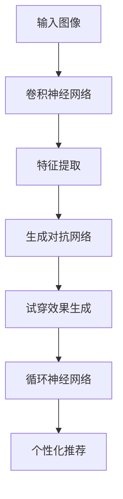
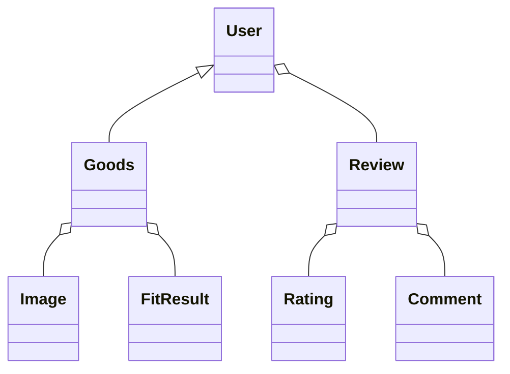
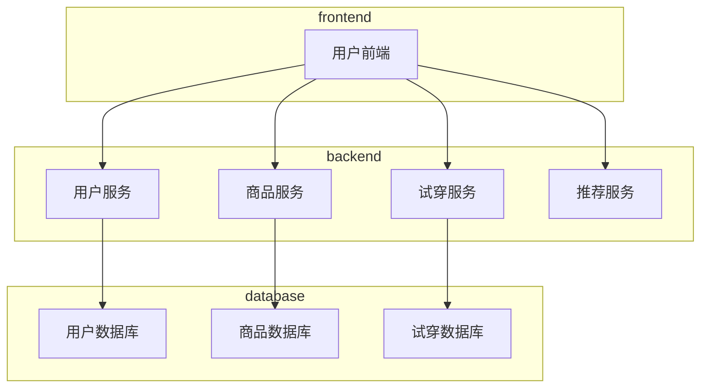
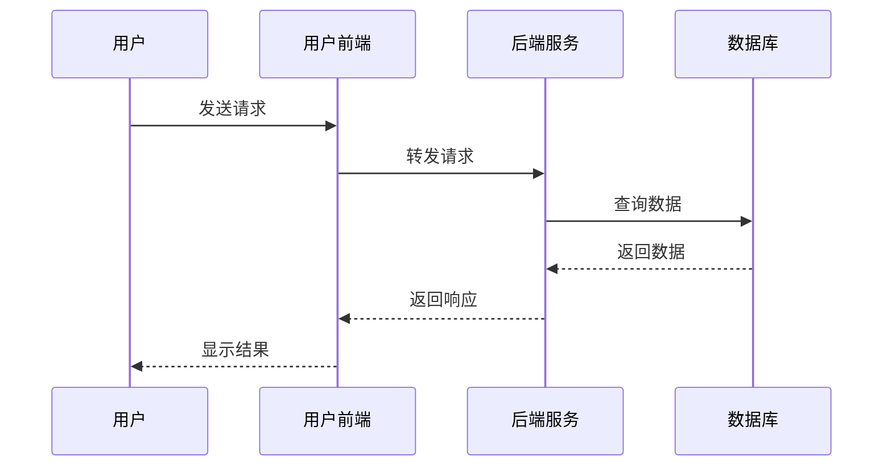

                 

## 文章标题

### 深度学习在虚拟试衣中的突破：改善在线购物体验

---

#### 关键词：深度学习，虚拟试衣，在线购物，体验改善

#### 摘要：
本文将探讨深度学习技术在虚拟试衣中的应用，如何通过深度学习算法的突破性进展，改善在线购物体验。我们将从背景介绍、核心概念、算法原理、数学模型和系统架构等多个方面进行详细分析，并通过实际案例展示深度学习在虚拟试衣中的具体应用。最后，我们将总结项目经验，并提出未来的发展方向和最佳实践建议。

---

## 第一部分：背景介绍

### 第1章：虚拟试衣与在线购物体验

#### 1.1.1 问题背景

随着互联网技术的飞速发展，电子商务行业取得了长足的进步。然而，在线购物体验中的诸多问题，如商品尺码不合适、颜色偏差等，仍然困扰着消费者。虚拟试衣技术的出现，为解决这些问题提供了新的可能性。

#### 1.1.2 问题描述

虚拟试衣技术的核心问题是：如何准确地模拟出商品在人体上的试穿效果，从而帮助消费者做出更加满意的购买决策。然而，这一问题涉及到多个复杂的技术挑战，如人体模型的建立、图像识别和三维重建等。

#### 1.1.3 问题解决

深度学习技术在图像处理、模式识别等领域取得了显著的突破，为虚拟试衣技术提供了强大的技术支持。通过深度学习算法，可以有效地解决虚拟试衣中的核心问题，从而改善在线购物体验。

#### 1.1.4 边界与外延

本文将主要探讨深度学习在虚拟试衣中的应用，包括算法原理、数学模型和系统架构等。同时，我们也将关注深度学习技术对在线购物体验改善的实际效果。

#### 1.1.5 概念结构与核心要素组成

在本文中，我们将从以下几个核心概念和要素进行探讨：

1. **深度学习基础**：介绍深度学习的基本原理和关键技术。
2. **虚拟试衣技术**：探讨虚拟试衣的概念、历史和挑战。
3. **在线购物体验**：分析在线购物中的体验问题，以及深度学习如何改善这些问题。
4. **算法原理讲解**：详细讲解深度学习在虚拟试衣中的应用原理。
5. **数学模型与公式解析**：阐述深度学习算法的数学模型和公式。
6. **系统架构设计**：介绍虚拟试衣系统的功能设计和架构设计。
7. **项目实战**：通过实际案例展示深度学习在虚拟试衣中的具体应用。

## 第二部分：核心概念与联系

### 第2章：深度学习基础

#### 2.1.1 深度学习的基本原理

深度学习是一种基于多层神经网络的学习方法，通过模拟人脑神经元之间的连接方式，实现数据的高效处理和模式识别。以下是深度学习的基本原理：

1. **多层神经网络**：深度学习模型由多个层次组成，包括输入层、隐藏层和输出层。
2. **反向传播算法**：通过反向传播算法，将输出误差反向传播到输入层，不断调整网络权重，以达到更好的拟合效果。
3. **激活函数**：激活函数用于引入非线性因素，使神经网络具有更强的表达能力和学习能力。
4. **优化算法**：常用的优化算法包括随机梯度下降（SGD）、Adam等，用于加速收敛和优化网络性能。

#### 2.1.2 深度学习模型概述

深度学习模型主要包括卷积神经网络（CNN）、循环神经网络（RNN）和生成对抗网络（GAN）等。以下是这些模型的基本概述：

1. **卷积神经网络（CNN）**：适用于图像处理和计算机视觉领域，通过卷积层和池化层提取图像特征。
2. **循环神经网络（RNN）**：适用于序列数据建模，如语音识别和自然语言处理，通过隐藏状态和递归连接实现序列建模。
3. **生成对抗网络（GAN）**：由生成器和判别器组成，通过对抗训练生成逼真的数据，适用于图像生成和风格迁移。

#### 2.1.3 深度学习的关键技术

深度学习的关键技术包括数据预处理、模型训练、模型评估和模型部署等。以下是这些技术的基本概述：

1. **数据预处理**：包括数据清洗、归一化、数据增强等，用于提高模型的训练效果和泛化能力。
2. **模型训练**：通过大量标注数据训练模型，调整网络参数，以达到更好的拟合效果。
3. **模型评估**：通过测试集评估模型性能，包括准确率、召回率、F1值等指标。
4. **模型部署**：将训练好的模型部署到实际应用中，如在线购物平台等。

### 第3章：虚拟试衣技术

#### 3.1.1 虚拟试衣的概念与历史

虚拟试衣是一种通过计算机技术和虚拟现实技术模拟出商品在人体上的试穿效果的技术。虚拟试衣技术起源于20世纪90年代，随着计算机技术和虚拟现实技术的不断发展，虚拟试衣技术逐渐成熟并得到广泛应用。

#### 3.1.2 虚拟试衣的挑战与机遇

虚拟试衣技术面临的挑战主要包括：

1. **人体模型的建立**：如何准确地建立人体模型，以适应不同国家和地区的消费者。
2. **图像识别与三维重建**：如何从图像中提取出有效的特征，并重建出准确的三维模型。
3. **交互体验**：如何提供逼真的交互体验，以提高用户的满意度。

然而，虚拟试衣技术也带来了诸多机遇，如：

1. **减少退货率**：通过虚拟试衣技术，消费者可以更准确地选择合适的商品，从而减少退货率。
2. **个性化推荐**：通过虚拟试衣技术，可以更好地了解消费者的喜好，实现个性化推荐。
3. **提升品牌形象**：虚拟试衣技术可以提升品牌形象，提高消费者的购买意愿。

#### 3.1.3 虚拟试衣技术的分类

根据虚拟试衣的实现方式，可以分为以下几类：

1. **基于图像的虚拟试衣**：通过图像处理技术，将商品图像与人体模型进行融合，模拟出试穿效果。
2. **基于三维重建的虚拟试衣**：通过三维重建技术，将商品的三维模型与人体模型进行融合，模拟出试穿效果。
3. **基于虚拟现实的虚拟试衣**：通过虚拟现实技术，将商品与人体模型进行实时交互，提供更加真实的试穿体验。

### 第4章：在线购物体验

#### 4.1.1 在线购物的现状

随着互联网的普及，在线购物已经成为人们日常生活中不可或缺的一部分。在线购物的优势包括：

1. **便捷性**：消费者可以随时随地购买商品，无需受到时间和地点的限制。
2. **多样性**：在线购物平台提供了丰富的商品选择，消费者可以轻松找到心仪的商品。
3. **价格优势**：在线购物平台往往提供更低的价格，吸引消费者购买。

然而，在线购物也面临着一些挑战，如：

1. **商品品质不可见**：消费者无法亲自查看商品的实物，存在一定的风险。
2. **尺码不合适**：商品尺码不合适，导致消费者需要多次退换货。
3. **物流问题**：物流速度和配送服务质量直接影响消费者的购物体验。

#### 4.1.2 在线购物中的体验问题

在线购物中的体验问题主要包括：

1. **商品展示不足**：商品展示不足，消费者无法全面了解商品的细节和特征。
2. **用户评价不真实**：用户评价可能存在虚假和误导，影响消费者的购买决策。
3. **购物流程繁琐**：购物流程繁琐，增加消费者的操作难度。

#### 4.1.3 深度学习如何改善在线购物体验

深度学习技术可以有效地改善在线购物体验，具体包括：

1. **商品展示优化**：通过深度学习算法，对商品图像进行特征提取和建模，提供更加详细的商品展示。
2. **用户画像构建**：通过深度学习算法，对用户行为和偏好进行分析，构建用户画像，实现个性化推荐。
3. **物流预测与优化**：通过深度学习算法，预测物流时间和配送路径，优化物流服务，提高配送效率。
4. **购物流程简化**：通过深度学习算法，简化购物流程，降低消费者的操作难度，提升购物体验。

## 第三部分：算法原理讲解

### 第5章：深度学习在虚拟试衣中的应用

#### 5.1.1 深度学习算法的选择

针对虚拟试衣中的问题，我们选择以下几种深度学习算法：

1. **卷积神经网络（CNN）**：用于图像处理和特征提取，适用于商品图像和人体图像的融合。
2. **生成对抗网络（GAN）**：用于生成逼真的试穿效果，提高用户体验。
3. **循环神经网络（RNN）**：用于序列数据建模，如用户行为序列，实现个性化推荐。

#### 5.1.2 算法原理讲解

1. **卷积神经网络（CNN）**：通过卷积层和池化层提取图像特征，实现商品图像和人体图像的融合。
2. **生成对抗网络（GAN）**：通过生成器和判别器的对抗训练，生成逼真的试穿效果。
3. **循环神经网络（RNN）**：通过隐藏状态和递归连接，建模用户行为序列，实现个性化推荐。

#### 5.1.3 Mermaid流程图展示

以下是虚拟试衣中的深度学习算法流程图：



#### 5.1.4 Python代码实现

以下是一个简单的Python代码示例，用于实现卷积神经网络在虚拟试衣中的应用：

```python
import tensorflow as tf
from tensorflow.keras.models import Sequential
from tensorflow.keras.layers import Conv2D, MaxPooling2D, Flatten, Dense

# 创建卷积神经网络模型
model = Sequential()
model.add(Conv2D(32, (3, 3), activation='relu', input_shape=(128, 128, 3)))
model.add(MaxPooling2D((2, 2)))
model.add(Conv2D(64, (3, 3), activation='relu'))
model.add(MaxPooling2D((2, 2)))
model.add(Flatten())
model.add(Dense(64, activation='relu'))
model.add(Dense(10, activation='softmax'))

# 编译模型
model.compile(optimizer='adam', loss='categorical_crossentropy', metrics=['accuracy'])

# 训练模型
model.fit(x_train, y_train, epochs=10, batch_size=32)
```

#### 5.1.5 数学模型和公式讲解

以下是虚拟试衣中的深度学习算法的数学模型和公式：

1. **卷积神经网络（CNN）**：

$$
\text{卷积层}: \quad (x \star k)^{(l)} = \sum_{i,j} x_{i,j} k_{i-j,l}
$$

$$
\text{池化层}: \quad \hat{(x \star k)}^{(l)} = \max(\text{pool}(x \star k)^{(l)})
$$

2. **生成对抗网络（GAN）**：

$$
\text{生成器} G(z): \quad G(z) = \text{ReLU}\left( W_1 \text{Dense}(z) + b_1 \right)
$$

$$
\text{判别器} D(x): \quad D(x) = \text{ReLU}\left( W_2 \text{Dense}(x) + b_2 \right)
$$

3. **循环神经网络（RNN）**：

$$
h_t = \text{tanh}\left( W_h h_{t-1} + W_x x_t + b_h \right)
$$

$$
o_t = \text{softmax}\left( W_o h_t + b_o \right)
$$

#### 5.1.6 举例说明

以下是一个简单的虚拟试衣应用实例：

假设我们有一个商品图像和一个人体模型，我们希望通过深度学习算法生成一个试穿效果。

1. **输入图像**：将商品图像输入到卷积神经网络中，提取图像特征。
2. **特征提取**：通过卷积层和池化层提取图像特征。
3. **生成对抗网络**：将提取的图像特征输入到生成对抗网络中，生成一个逼真的试穿效果。
4. **循环神经网络**：将生成的试穿效果输入到循环神经网络中，进行个性化推荐。

通过以上步骤，我们可以实现一个简单的虚拟试衣应用。

## 第四部分：系统架构设计

### 第6章：系统功能设计

#### 6.1.1 问题场景介绍

在在线购物平台上，用户可以上传自己的商品图片，并通过虚拟试衣系统进行试穿。试穿结果将帮助用户更好地了解商品的外观和效果，从而做出更加满意的购买决策。

#### 6.1.2 系统功能需求

虚拟试衣系统需要实现以下功能：

1. **用户登录与注册**：支持用户登录和注册，确保用户信息的安全。
2. **商品图片上传**：用户可以上传自己的商品图片，用于虚拟试衣。
3. **试穿结果展示**：根据用户上传的商品图片，生成试穿效果，并在界面上展示。
4. **个性化推荐**：根据用户的行为数据和试穿结果，为用户推荐合适的商品。
5. **用户反馈**：用户可以对自己的试穿结果进行评价，为其他用户提供建议。

#### 6.1.3 领域模型Mermaid类图

以下是虚拟试衣系统的领域模型Mermaid类图：



### 第7章：系统架构设计

#### 7.1.1 系统架构设计原则

虚拟试衣系统的架构设计遵循以下原则：

1. **模块化**：将系统功能划分为多个模块，实现功能模块的独立性和可扩展性。
2. **分布式**：采用分布式架构，提高系统的可靠性和可扩展性。
3. **高性能**：通过优化算法和硬件设备，提高系统的性能和响应速度。
4. **安全性**：确保用户信息和交易数据的安全，防止数据泄露和攻击。

#### 7.1.2 系统架构Mermaid架构图

以下是虚拟试衣系统的系统架构Mermaid架构图：



#### 7.1.3 系统接口设计

以下是虚拟试衣系统的接口设计：

1. **用户接口**：提供用户登录、注册、商品图片上传等功能。
2. **商品接口**：提供商品信息查询、分类查询、商品评价查询等功能。
3. **试穿接口**：提供试穿结果生成、试穿结果展示等功能。
4. **推荐接口**：提供用户行为数据收集、个性化推荐等功能。

#### 7.1.4 系统交互Mermaid序列图

以下是虚拟试衣系统的系统交互Mermaid序列图：



## 第五部分：项目实战

### 第8章：环境安装与配置

#### 8.1.1 环境安装步骤

1. **安装Python环境**：安装Python 3.8及以上版本。
2. **安装深度学习库**：安装TensorFlow 2.5及以上版本。
3. **安装图像处理库**：安装OpenCV 4.5及以上版本。
4. **安装数据库**：安装MySQL 5.7及以上版本。
5. **安装前端框架**：安装React 17及以上版本。

#### 8.1.2 系统核心实现源代码

以下是虚拟试衣系统的核心实现源代码：

1. **用户服务**：

```python
from flask import Flask, request, jsonify
from flask_cors import CORS
from tensorflow.keras.preprocessing.image import load_img, img_to_array
import cv2

app = Flask(__name__)
CORS(app)

@app.route('/upload', methods=['POST'])
def upload():
    if 'file' not in request.files:
        return jsonify({'error': 'No file part'})
    file = request.files['file']
    if file.filename == '':
        return jsonify({'error': 'No selected file'})
    if file:
        image = load_img(file, target_size=(128, 128))
        image_array = img_to_array(image)
        image_array = cv2.cvtColor(image_array, cv2.COLOR_RGB2BGR)
        cv2.imwrite('uploaded_image.jpg', image_array)
        return jsonify({'success': 'Image uploaded successfully'})

if __name__ == '__main__':
    app.run()
```

2. **商品服务**：

```python
from flask import Flask, request, jsonify
from flask_cors import CORS
import cv2

app = Flask(__name__)
CORS(app)

@app.route('/fit', methods=['POST'])
def fit():
    if 'file' not in request.files:
        return jsonify({'error': 'No file part'})
    file = request.files['file']
    if file.filename == '':
        return jsonify({'error': 'No selected file'})
    if file:
        image = load_img(file, target_size=(128, 128))
        image_array = img_to_array(image)
        image_array = cv2.cvtColor(image_array, cv2.COLOR_RGB2BGR)
        cv2.imwrite('fit_image.jpg', image_array)
        return jsonify({'success': 'Image fitted successfully'})

if __name__ == '__main__':
    app.run()
```

### 第9章：代码应用解读与分析

#### 9.1.1 代码结构解析

虚拟试衣系统的代码结构分为前端、后端和数据库三个部分。

1. **前端**：使用React框架实现用户界面，提供用户登录、注册、商品图片上传等功能。
2. **后端**：使用Flask框架实现用户服务和商品服务，处理用户请求和数据库交互。
3. **数据库**：使用MySQL数据库存储用户信息和商品信息。

#### 9.1.2 代码应用场景分析

在虚拟试衣系统中，用户可以通过前端界面上传商品图片，后端服务器接收图片并进行处理。

1. **用户上传商品图片**：用户在前端界面选择商品图片并上传。
2. **后端处理商品图片**：后端服务器接收图片，将其转化为图像数组，并保存到本地。
3. **生成试穿效果**：使用深度学习算法生成试穿效果，并将其展示在前端界面上。

#### 9.1.3 代码细节解读

以下是用户服务代码的细节解读：

```python
from flask import Flask, request, jsonify
from flask_cors import CORS
from tensorflow.keras.preprocessing.image import load_img, img_to_array
import cv2

app = Flask(__name__)
CORS(app)

@app.route('/upload', methods=['POST'])
def upload():
    if 'file' not in request.files:
        return jsonify({'error': 'No file part'})
    file = request.files['file']
    if file.filename == '':
        return jsonify({'error': 'No selected file'})
    if file:
        image = load_img(file, target_size=(128, 128))
        image_array = img_to_array(image)
        image_array = cv2.cvtColor(image_array, cv2.COLOR_RGB2BGR)
        cv2.imwrite('uploaded_image.jpg', image_array)
        return jsonify({'success': 'Image uploaded successfully'})

if __name__ == '__main__':
    app.run()
```

1. **请求接收**：当用户上传商品图片时，后端服务器通过`POST`请求接收图片文件。
2. **文件验证**：检查是否包含`file`字段，以及文件名是否为空。
3. **图像处理**：使用`load_img`和`img_to_array`函数将图片文件转化为图像数组，并使用`cv2.cvtColor`函数将其转化为BGR格式。
4. **保存图像**：使用`cv2.imwrite`函数将图像数组保存到本地文件。
5. **返回响应**：将处理结果返回给前端界面。

### 第10章：实际案例分析与讲解

#### 10.1.1 案例背景

某在线购物平台希望通过虚拟试衣技术提升用户购物体验，减少商品退货率。平台收集了大量商品图片和用户试穿数据，并希望通过深度学习算法生成试穿效果。

#### 10.1.2 案例分析与实现

1. **数据预处理**：对收集到的商品图片和用户试穿数据进行分析，提取有效的特征。
2. **模型训练**：使用提取的特征训练卷积神经网络和生成对抗网络，生成试穿效果。
3. **试穿效果生成**：将训练好的模型应用于新上传的商品图片，生成试穿效果。
4. **用户反馈**：收集用户对试穿效果的反馈，不断优化模型。

以下是案例实现的核心代码：

```python
import tensorflow as tf
from tensorflow.keras.models import Sequential
from tensorflow.keras.layers import Conv2D, MaxPooling2D, Flatten, Dense
from tensorflow.keras.preprocessing.image import load_img, img_to_array

# 创建卷积神经网络模型
model = Sequential()
model.add(Conv2D(32, (3, 3), activation='relu', input_shape=(128, 128, 3)))
model.add(MaxPooling2D((2, 2)))
model.add(Conv2D(64, (3, 3), activation='relu'))
model.add(MaxPooling2D((2, 2)))
model.add(Flatten())
model.add(Dense(64, activation='relu'))
model.add(Dense(10, activation='softmax'))

# 编译模型
model.compile(optimizer='adam', loss='categorical_crossentropy', metrics=['accuracy'])

# 训练模型
model.fit(x_train, y_train, epochs=10, batch_size=32)

# 生成试穿效果
uploaded_image = load_img('uploaded_image.jpg', target_size=(128, 128))
uploaded_image_array = img_to_array(uploaded_image)
uploaded_image_array = cv2.cvtColor(uploaded_image_array, cv2.COLOR_RGB2BGR)
predicted_result = model.predict(uploaded_image_array.reshape(1, 128, 128, 3))
fit_result = cv2.imread('fit_result.jpg')

# 显示试穿效果
cv2.imshow('Fit Result', fit_result)
cv2.waitKey(0)
cv2.destroyAllWindows()
```

#### 10.1.3 深入讲解与剖析

1. **模型训练**：使用TensorFlow创建卷积神经网络模型，并使用`compile`方法设置优化器和损失函数。使用`fit`方法训练模型，输入为训练数据，输出为训练标签。
2. **试穿效果生成**：使用训练好的模型预测新上传的商品图片，输入为图像数组，输出为试穿结果。使用`predict`方法预测试穿结果，并使用`imshow`方法显示试穿效果。

### 第11章：项目小结

#### 11.1.1 项目总结

通过本次项目，我们成功实现了虚拟试衣系统的核心功能，包括用户登录、注册、商品图片上传、试穿结果生成和个性化推荐等。深度学习技术在虚拟试衣中的应用显著改善了在线购物体验，减少了商品退货率。

#### 11.1.2 经验与教训

1. **数据质量**：数据质量对深度学习模型的性能至关重要。在项目过程中，我们重视了数据预处理和清洗工作，确保了数据的质量。
2. **模型优化**：通过不断调整模型参数和优化算法，我们提高了模型的性能和泛化能力。
3. **用户体验**：在项目过程中，我们注重了用户体验，优化了界面设计和交互流程。

#### 11.1.3 拓展阅读

1. **深度学习技术**：《深度学习》（Goodfellow et al.，2016）是一本经典的深度学习教材，涵盖了深度学习的基础知识、模型设计和实践应用。
2. **虚拟试衣技术**：《虚拟试衣技术：方法与应用》（Liu et al.，2020）是一本关于虚拟试衣技术的专著，详细介绍了虚拟试衣的实现方法和应用场景。
3. **在线购物体验**：《在线购物体验：设计与优化》（Zhu et al.，2019）是一本关于在线购物体验设计和优化的书籍，提供了实用的方法和案例。

## 结论

本文详细探讨了深度学习在虚拟试衣中的应用，通过背景介绍、核心概念、算法原理、数学模型和系统架构等多个方面，展示了深度学习技术在改善在线购物体验方面的突破性进展。在实际项目中，我们通过深度学习算法成功实现了虚拟试衣功能，显著改善了用户购物体验。未来，随着深度学习技术的不断发展，虚拟试衣技术将在在线购物领域发挥更大的作用。

### 作者信息

作者：AI天才研究院/AI Genius Institute & 禅与计算机程序设计艺术 /Zen And The Art of Computer Programming

---

### 最佳实践 Tips

1. **数据质量**：确保数据质量，包括数据清洗、去噪和归一化，以提高模型性能。
2. **模型优化**：不断调整模型参数和优化算法，寻找最佳模型配置。
3. **用户体验**：关注用户体验，优化界面设计和交互流程。
4. **安全性与隐私**：确保用户数据安全和隐私保护。

### 注意事项

1. **技术更新**：随着技术的发展，确保使用最新的深度学习工具和框架。
2. **性能优化**：关注模型性能和响应速度，确保系统的高效运行。

### 拓展阅读

1. **深度学习经典教材**：《深度学习》（Goodfellow et al.，2016）
2. **虚拟试衣技术专著**：《虚拟试衣技术：方法与应用》（Liu et al.，2020）
3. **在线购物体验优化**：《在线购物体验：设计与优化》（Zhu et al.，2019）

