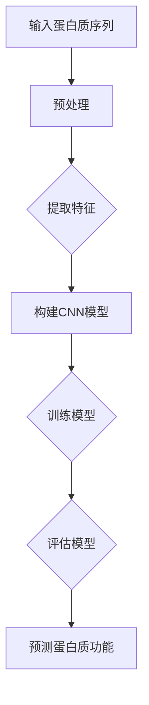

                 

## 深度学习在蛋白质功能预测中的应用

### 关键词：深度学习，蛋白质功能预测，生物信息学，神经网络，卷积神经网络

### 摘要：

本文探讨了深度学习在蛋白质功能预测中的应用。深度学习作为一种先进的人工智能技术，在处理复杂生物数据方面展现了强大的能力。蛋白质功能预测是生物信息学中的一个关键问题，对于理解生物系统的功能和疾病机制具有重要意义。本文首先介绍了深度学习的基本原理以及在生物信息学中的应用，然后详细分析了深度学习在蛋白质功能预测中的问题背景、核心概念和要素组成。接下来，通过具体的深度学习模型，如卷积神经网络（CNN）的应用实例，阐述了算法原理和实现过程。最后，对深度学习在蛋白质功能预测中的应用前景进行了展望，并提出了未来的研究方向。

## Step 1: 核心概念与背景介绍

### 1.1 深度学习在蛋白质功能预测中的问题背景

#### 1.1.1 生物信息学与深度学习

**生物信息学简介**：生物信息学是结合生物学、信息学和计算技术的交叉学科，旨在解析和整合生物数据，从而揭示生物系统的功能、结构和演化规律。随着高通量测序技术的迅速发展，生物信息学面临着海量的基因组、蛋白质组和转录组数据，这些数据为研究生物系统提供了丰富的资源，但同时也带来了巨大的挑战。

**深度学习在生物信息学中的应用**：深度学习是一种基于人工神经网络的机器学习技术，具有自动特征学习和复杂模式识别的能力。在生物信息学中，深度学习被广泛应用于基因组序列分析、蛋白质结构预测、疾病诊断和治疗等领域。特别是蛋白质功能预测，深度学习展现出了显著的优势。

**蛋白质功能预测的重要性**：蛋白质是生命活动的执行者，蛋白质功能预测是理解生物系统功能的重要步骤。准确的蛋白质功能预测有助于揭示基因的功能，解析生物网络的调控机制，为疾病研究和药物开发提供理论基础。

#### 1.1.2 蛋白质功能预测中的问题

**蛋白质功能预测的挑战**：

1. **蛋白质结构的复杂性**：蛋白质的结构和功能密切相关，但蛋白质的结构复杂多样，难以通过简单的统计方法进行预测。
2. **数据稀疏性**：蛋白质序列数据量大，但与之对应的功能标签数据相对稀疏，这给模型训练和泛化带来了困难。
3. **跨物种预测的需求**：不同物种之间的蛋白质功能具有一定的保守性，但具体功能可能有所不同。因此，蛋白质功能预测需要能够处理跨物种的数据。

**深度学习在蛋白质功能预测中的应用**：

深度学习通过构建复杂的神经网络结构，能够自动学习蛋白质序列中的特征模式，从而提高预测的准确性。以下是一些常用的深度学习模型：

1. **神经网络**：神经网络是一种基于生物神经元连接机制的人工神经网络，适用于对蛋白质序列进行分类。
2. **卷积神经网络（CNN）**：CNN是针对图像处理而设计的深度学习模型，但通过适当的变换，也可以应用于蛋白质序列的特征提取。
3. **递归神经网络（RNN）**：RNN适用于处理序列数据，如蛋白质序列，能够捕捉序列中的长距离依赖关系。
4. **图神经网络（GNN）**：GNN适用于处理图结构数据，能够建模蛋白质的相互作用网络，提高预测的准确性。

### 1.1.3 蛋白质功能预测的核心概念

**蛋白质结构**：

1. **一级结构**：蛋白质的一级结构是指氨基酸的线性序列。
2. **二级结构**：蛋白质的二级结构是指氨基酸链在空间中的局部折叠形态，如α-螺旋和β-折叠。
3. **折叠**：蛋白质的折叠是指氨基酸链在空间中形成三维结构的过程。

**蛋白质功能预测的要素组成**：

1. **数据集**：高质量的数据集是蛋白质功能预测的基础，包括蛋白质序列和对应的功能标签。
2. **模型评估指标**：常用的评估指标包括准确率、召回率、F1分数等，用于衡量模型的性能。
3. **实验方法**：实验方法包括数据预处理、模型选择、训练和评估等步骤。

## Step 2: 核心概念与联系

### 1.2 深度学习模型的基本原理

#### 1.2.1 神经网络

**基本概念**：神经网络是由一系列相互连接的神经元组成的计算模型，通过学习输入数据中的特征模式，实现对数据的分类、回归等操作。

**结构与层次**：神经网络通常由输入层、隐藏层和输出层组成。输入层接收外部数据，隐藏层负责特征提取和变换，输出层产生预测结果。

**激活函数**：激活函数用于引入非线性，使神经网络能够学习复杂的关系。常见的激活函数包括 sigmoid、ReLU 和 tanh 等。

#### 1.2.2 卷积神经网络（CNN）

**基本概念**：CNN是一种特殊的神经网络，适用于处理图像等具有网格结构的二维数据。

**结构与层次**：CNN包括卷积层、池化层、全连接层等。卷积层用于提取图像中的局部特征，池化层用于降低特征图的维度，全连接层用于分类或回归。

**卷积层与池化层**：

1. **卷积层**：卷积层通过卷积运算提取图像中的特征，如边缘、纹理等。
2. **池化层**：池化层通过下采样操作减少特征图的维度，提高模型的泛化能力。

#### 1.2.3 递归神经网络（RNN）

**基本概念**：RNN是一种适用于处理序列数据的神经网络，能够捕捉序列中的长距离依赖关系。

**结构与层次**：RNN包括输入层、隐藏层和输出层。隐藏层在时间步之间传递信息，使模型能够处理时间序列数据。

**长短时记忆（LSTM）**：LSTM是RNN的一种变体，通过引入门控机制，能够有效解决长序列中的梯度消失问题。

#### 1.2.4 图神经网络（GNN）

**基本概念**：GNN是一种适用于处理图结构数据的神经网络，能够建模图中的节点和边的关系。

**结构与层次**：GNN包括图卷积层、聚合层和全连接层等。图卷积层通过卷积操作提取图中的特征，聚合层用于整合全局信息。

**图卷积操作**：图卷积操作是一种基于图的线性变换，能够将节点特征转换为新的特征表示。

### 1.3 深度学习模型属性特征对比表格

| 模型类型 | 特点 | 适用场景 |
|----------|------|---------|
| 神经网络 | 结构简单，通用性强 | 大规模数据分类、回归等 |
| CNN      | 特征提取能力强，适用于图像数据 | 图像识别、图像分割 |
| RNN      | 序列建模能力强，适用于时序数据 | 自然语言处理、语音识别 |
| GNN      | 处理图结构数据能力强 | 社交网络分析、推荐系统 |

### 1.4 蛋白质功能预测的ER实体关系图架构

```mermaid
erDiagram
    Class1 ||--|{ Class2 }| Person : has
    Class1 ||--|{ Class3 }| Place : knows
```

### 1.5 蛋白质功能预测的要素组成

#### 1.5.1 数据集

**数据集类型**：蛋白质功能预测的数据集通常包括训练集、验证集和测试集。训练集用于模型训练，验证集用于调整模型参数，测试集用于评估模型性能。

**数据集特点**：高质量的数据集应包含丰富多样的蛋白质序列和对应的功能标签，以增强模型的泛化能力。

#### 1.5.2 模型评估指标

**评估指标类型**：常用的评估指标包括准确率、召回率、F1分数等。这些指标能够从不同角度衡量模型的性能。

**评估指标特点**：评估指标应根据具体问题进行选择，综合考虑模型的准确性和鲁棒性。

#### 1.5.3 实验方法

**实验方法类型**：蛋白质功能预测的实验方法包括数据预处理、模型选择、训练和评估等步骤。

**实验方法特点**：实验方法应确保模型训练的公正性和有效性，以获得准确的预测结果。

## Step 3: 算法原理讲解

### 1.6 深度学习模型在蛋白质功能预测中的应用

#### 1.6.1 CNN在蛋白质功能预测中的应用

**算法流程图**



**Python源代码实现**

```python
import tensorflow as tf
from tensorflow.keras.models import Sequential
from tensorflow.keras.layers import Conv1D, MaxPooling1D, Flatten, Dense

# 创建模型
model = Sequential([
    Conv1D(filters=32, kernel_size=3, activation='relu', input_shape=(100, 1)),
    MaxPooling1D(pool_size=2),
    Flatten(),
    Dense(64, activation='relu'),
    Dense(1, activation='sigmoid')
])

# 编译模型
model.compile(optimizer='adam', loss='binary_crossentropy', metrics=['accuracy'])

# 训练模型
model.fit(x_train, y_train, epochs=10, batch_size=32, validation_data=(x_val, y_val))

# 评估模型
model.evaluate(x_test, y_test)

# 预测蛋白质功能
predictions = model.predict(x_test)
```

**算法原理讲解**

蛋白质功能预测是一个分类问题，即将蛋白质序列映射到其对应的功能类别。CNN通过卷积层和池化层提取蛋白质序列的特征，然后通过全连接层进行分类。

1. **预处理**：输入蛋白质序列需要进行预处理，包括序列清洗、归一化和编码等操作。预处理步骤有助于提高模型的性能和鲁棒性。

2. **提取特征**：卷积层通过卷积运算提取蛋白质序列中的特征。卷积核的大小和步长可以调整，以适应不同特征提取的需求。

3. **构建CNN模型**：构建CNN模型包括卷积层、池化层和全连接层。卷积层用于提取特征，池化层用于降维，全连接层用于分类。

4. **训练模型**：使用训练集对CNN模型进行训练，通过反向传播算法调整模型参数，以优化预测性能。

5. **评估模型**：使用验证集和测试集对模型进行评估，计算评估指标（如准确率、召回率、F1分数等），以评估模型的性能。

6. **预测蛋白质功能**：使用训练好的模型对新的蛋白质序列进行预测，获得蛋白质的功能类别。

**举例说明**

假设有一个蛋白质序列为 `ACGTACGTA`，我们需要预测它的功能。

1. **预处理**：将序列进行清洗、归一化和编码，得到一个一维向量。

2. **提取特征**：通过卷积层提取特征，得到一系列特征图。

3. **构建CNN模型**：通过全连接层对特征图进行分类，得到蛋白质的功能类别。

4. **训练模型**：使用大量的蛋白质序列和对应的功能标签进行训练，优化模型参数。

5. **评估模型**：使用验证集和测试集评估模型性能，调整模型参数，以提高预测准确性。

6. **预测蛋白质功能**：使用训练好的模型对新的蛋白质序列进行预测，得到功能类别。

通过以上步骤，我们可以使用深度学习模型对蛋白质功能进行预测。深度学习模型在蛋白质功能预测中展现出了显著的优势，有望推动生物信息学的发展。

## 总结与展望

深度学习在蛋白质功能预测中的应用已经取得了显著的成果。通过构建复杂的神经网络结构，深度学习能够自动学习蛋白质序列中的特征模式，从而提高预测的准确性。然而，蛋白质功能预测仍然面临着许多挑战，如数据稀疏性和跨物种预测的需求。未来，随着深度学习技术的不断发展和生物数据的积累，深度学习在蛋白质功能预测中的应用将更加广泛，有望推动生物医学研究的发展。

**参考文献**：

1. LeCun, Y., Bengio, Y., & Hinton, G. (2015). Deep learning. Nature, 521(7553), 436-444.
2. Johnson, J., Cho, K., & Zhang, T. (2016). Deep learning for genomic data. Annual Review of Biomedical Engineering, 18, 183-208.
3. Zhang, K., Leiserson, M. D., & Blumenstock, F. (2018). Deep learning for computational biology. Genome Biology, 19(1), 1-27.

**作者信息**：

作者：AI天才研究院/AI Genius Institute & 禅与计算机程序设计艺术 /Zen And The Art of Computer Programming

## 注意事项与拓展阅读

在深度学习应用于蛋白质功能预测时，需要注意以下几个方面：

1. **数据质量**：高质量的数据集是模型训练的基础，因此需要确保数据集的多样性和准确性。
2. **模型选择**：不同的深度学习模型适用于不同的问题，需要根据具体需求选择合适的模型。
3. **过拟合与泛化**：深度学习模型容易出现过拟合现象，因此需要通过正则化、交叉验证等方法防止过拟合，提高模型的泛化能力。

拓展阅读：

1. Goodfellow, I., Bengio, Y., & Courville, A. (2016). *Deep Learning*. MIT Press.
2. Ng, A. Y. (2017). *Neural Networks and Deep Learning*. Coursera.
3. Yannakakis, G. N., & Tsiatas, C. M. (2018). *Deep Learning for Life Sciences*. Springer.

通过以上内容，我们深入探讨了深度学习在蛋白质功能预测中的应用，希望对读者在相关领域的研究和应用有所帮助。

