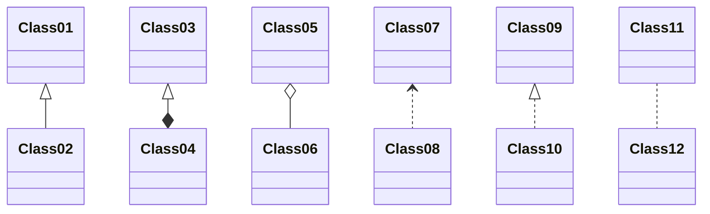
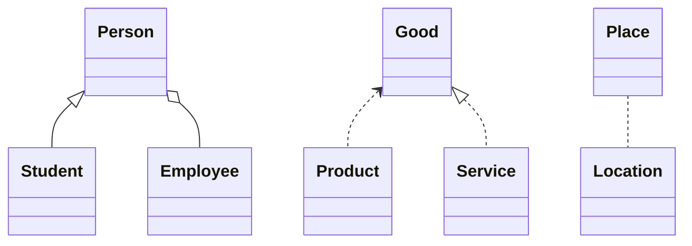
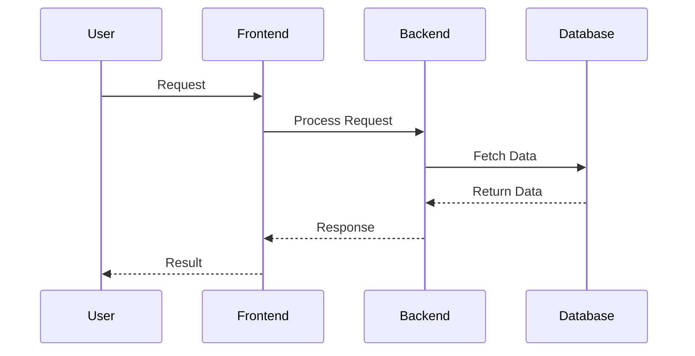

                 

### 文章标题

#### 深度学习在蛋白质功能预测中的突破：加速生物工程研究

### 关键词

- 深度学习
- 蛋白质功能预测
- 生物工程
- 生物信息学
- 人工智能

### 摘要

本文将探讨深度学习在蛋白质功能预测中的突破性进展，并阐述其在生物工程研究中的重要性。首先，我们介绍蛋白质功能预测的背景和重要性，以及当前面临的挑战。接着，深入解析深度学习的基本原理和其在生物信息学中的应用，展示如何通过深度学习技术加速蛋白质功能预测的进程。文章还将通过一个实际项目，展示深度学习在蛋白质功能预测中的应用实例，并提供一些最佳实践和展望。通过本文的阅读，读者将对深度学习在生物工程研究中的潜力有更深入的了解。

### 目录大纲

```markdown
# 深度学习在蛋白质功能预测中的突破：加速生物工程研究

# 第一部分：背景介绍

## 第1章：问题背景
### 1.1 蛋白质功能预测的重要性
### 1.2 当前蛋白质功能预测的挑战
### 1.3 深度学习在生物信息学中的应用前景

## 第2章：核心概念与联系
### 2.1 深度学习原理
#### 2.1.1 神经网络
#### 2.1.2 卷积神经网络
#### 2.1.3 循环神经网络
#### 2.1.4 生成对抗网络
### 2.2 蛋白质结构预测
#### 2.2.1 蛋白质序列特征提取
#### 2.2.2 蛋白质结构预测方法对比
### 2.3 蛋白质功能预测与深度学习的关系
### 2.4 蛋白质功能预测中深度学习的关键技术

## 第3章：数学模型和数学公式
### 3.1 深度学习中的基本数学公式
#### 3.1.1 损失函数
#### 3.1.2 梯度下降算法
#### 3.1.3 反向传播算法
### 3.2 蛋白质功能预测中的数学模型
#### 3.2.1 蛋白质序列与深度学习模型的关联
#### 3.2.2 蛋白质结构预测中的数学公式

## 第4章：系统分析与架构设计方案
### 4.1 项目介绍
### 4.2 系统功能设计
#### 4.2.1 领域模型
#### 4.2.2 类图设计
### 4.3 系统架构设计
#### 4.3.1 架构图设计
#### 4.3.2 系统接口设计
### 4.4 系统交互
#### 4.4.1 序列图设计

## 第5章：项目实战
### 5.1 环境安装
### 5.2 系统核心实现源代码
### 5.3 代码应用解读与分析
### 5.4 实际案例分析和详细讲解剖析
### 5.5 项目小结

## 第6章：最佳实践 Tips
### 6.1 数据准备与处理
### 6.2 模型训练与优化
### 6.3 模型评估与验证
### 6.4 跨学科合作与知识整合

## 第7章：小结与展望
### 7.1 小结
### 7.2 未来展望
### 7.3 注意事项
### 7.4 拓展阅读
```

### 第一部分：背景介绍

#### 第1章：问题背景

##### 1.1 蛋白质功能预测的重要性

蛋白质是生命的基本组成部分，承担着生物体内几乎所有的生物学功能。蛋白质功能的预测直接关系到生物工程、药物设计、疾病诊断和治疗等多个领域的发展。准确预测蛋白质功能不仅有助于我们理解生命现象，还能推动新药发现、个性化医疗等前沿科学研究的进步。

蛋白质功能预测的重要性体现在以下几个方面：

1. **生物工程**：通过预测蛋白质功能，可以设计新的生物催化剂、生物传感器等，提高工业生产效率和降低成本。
2. **药物设计**：药物通常与蛋白质相互作用，因此了解蛋白质功能对于药物发现至关重要。预测蛋白质功能有助于筛选和设计新的药物分子。
3. **疾病诊断**：蛋白质功能异常与多种疾病有关，例如癌症、自身免疫病等。预测蛋白质功能可以帮助诊断疾病，为临床治疗提供依据。
4. **基础研究**：了解蛋白质功能对于揭示生物系统的基本工作原理具有重要意义，有助于推动生命科学的发展。

##### 1.2 当前蛋白质功能预测的挑战

尽管蛋白质功能预测具有重要的科学和应用价值，但目前仍面临着诸多挑战：

1. **数据量巨大**：蛋白质序列信息非常丰富，但与之对应的实验数据却相对有限，这使得基于数据的预测方法难以广泛应用。
2. **复杂性问题**：蛋白质功能不仅与其序列有关，还受到折叠、修饰等多种因素的影响，这使得预测模型难以捕捉到蛋白质功能的复杂性。
3. **计算资源限制**：蛋白质功能预测需要大量的计算资源，尤其是在训练深度学习模型时，这限制了实时预测的应用。
4. **跨学科知识融合**：蛋白质功能预测不仅需要生物学知识，还需要物理学、化学、计算机科学等多学科的知识，跨学科的合作和知识整合是一个巨大的挑战。

##### 1.3 深度学习在生物信息学中的应用前景

深度学习作为一种强大的机器学习方法，近年来在计算机视觉、自然语言处理等领域取得了显著的成果。随着计算能力的提升和算法的改进，深度学习在生物信息学中的应用前景也越来越广阔：

1. **提高预测精度**：深度学习模型可以自动学习复杂的数据特征，有助于提高蛋白质功能预测的准确性。
2. **自动特征提取**：深度学习模型能够从大量的蛋白质序列数据中自动提取有用的特征，减少了对人工特征工程的需求。
3. **实时预测**：随着硬件性能的提升，深度学习模型可以实时预测蛋白质功能，为实时研究和应用提供支持。
4. **跨学科应用**：深度学习可以与其他生物信息学方法（如序列比对、结构预测等）结合，提高蛋白质功能预测的整体性能。

通过以上分析，我们可以看到深度学习在蛋白质功能预测中具有巨大的潜力。接下来，我们将详细探讨深度学习的基本原理和其在蛋白质功能预测中的应用。

#### 第2章：核心概念与联系

##### 2.1 深度学习原理

深度学习是一种基于人工神经网络的机器学习方法，通过多层神经网络结构对数据进行自动特征学习和模式识别。以下是深度学习的基本原理：

1. **神经网络**：神经网络由多个神经元（或节点）组成，每个神经元接收多个输入信号，通过权重进行加权求和，然后通过激活函数输出结果。
2. **多层结构**：深度学习模型通常包含多个隐藏层，每个隐藏层都对输入数据进行特征提取和转换，最终输出结果。
3. **反向传播算法**：反向传播算法是一种用于训练神经网络的优化算法，通过计算损失函数关于网络参数的梯度，迭代更新网络参数，以最小化损失函数。

##### 2.1.1 神经网络

神经网络是深度学习的基础，其结构如下：

- **输入层**：接收外部输入数据。
- **隐藏层**：对输入数据进行特征提取和转换，每个隐藏层可以包含多个神经元。
- **输出层**：生成最终输出结果。

神经网络的工作原理如下：

1. **前向传播**：输入数据通过输入层传递到隐藏层，每一层的输出作为下一层的输入。
2. **激活函数**：在神经网络中，每个神经元通常使用激活函数（如ReLU、Sigmoid、Tanh等）来引入非线性变换。
3. **损失函数**：通过比较输出结果与真实标签之间的差异，计算损失函数值，用于评估模型的性能。

##### 2.1.2 卷积神经网络

卷积神经网络（CNN）是一种专门用于处理图像数据的神经网络结构，通过卷积层和池化层对图像进行特征提取和转换。以下是CNN的基本结构：

- **卷积层**：通过卷积操作提取图像的局部特征。
- **池化层**：通过池化操作减少特征图的维度，提高模型计算效率。

CNN的工作原理如下：

1. **卷积操作**：卷积层使用卷积核在特征图上滑动，计算卷积结果，提取图像的局部特征。
2. **激活函数**：在每个卷积层之后，通常使用激活函数引入非线性变换。
3. **池化操作**：池化层通过最大池化或平均池化操作，减少特征图的维度，提高模型的计算效率。

##### 2.1.3 循环神经网络

循环神经网络（RNN）是一种专门用于处理序列数据的神经网络结构，通过循环连接实现序列信息的传递。以下是RNN的基本结构：

- **隐藏状态**：RNN使用隐藏状态保存前一时刻的信息，用于当前时刻的计算。
- **循环连接**：RNN通过循环连接将隐藏状态传递到下一时刻，实现序列信息的传递。

RNN的工作原理如下：

1. **输入序列**：输入序列通过输入层传递到隐藏层，每一层的输出作为下一层的输入。
2. **隐藏状态**：隐藏状态通过循环连接传递到下一时刻，保存前一时刻的信息。
3. **输出序列**：通过输出层生成最终输出序列。

##### 2.1.4 生成对抗网络

生成对抗网络（GAN）是一种用于生成数据的新型深度学习模型，通过对抗训练实现数据的生成。以下是GAN的基本结构：

- **生成器**：生成器尝试生成与真实数据相似的数据。
- **判别器**：判别器用于判断输入数据是真实数据还是生成器生成的数据。

GAN的工作原理如下：

1. **对抗训练**：生成器和判别器相互对抗，生成器尝试生成更逼真的数据，判别器努力区分真实数据和生成数据。
2. **梯度更新**：通过反向传播算法，分别更新生成器和判别器的参数，使生成器的生成数据越来越逼真，判别器的判别能力越来越强。

##### 2.2 蛋白质结构预测

蛋白质结构预测是生物信息学中的一个重要研究方向，旨在预测蛋白质的三维结构。以下是蛋白质结构预测的基本方法：

1. **序列比对**：通过序列比对找到与目标蛋白质序列相似的已知蛋白质序列，利用已知蛋白质的结构预测目标蛋白质的结构。
2. **同源建模**：基于同源建模方法，利用已知蛋白质的结构和序列信息，预测目标蛋白质的结构。
3. **机器学习方法**：利用机器学习方法，如深度学习，从大量的蛋白质序列和结构数据中学习预测模型，预测蛋白质的结构。

##### 2.2.1 蛋白质序列特征提取

蛋白质序列特征提取是蛋白质结构预测的关键步骤，旨在从蛋白质序列中提取出与结构相关的特征。以下是常用的蛋白质序列特征提取方法：

1. **编码方法**：将蛋白质序列编码为向量，如K-Mer编码、PseAAC编码等。
2. **特征工程**：利用生物学知识，设计与结构相关的特征，如疏水性、氨基酸组成等。
3. **深度学习方法**：使用深度学习模型，如CNN、RNN等，自动提取蛋白质序列的特征。

##### 2.2.2 蛋白质结构预测方法对比

以下是几种常见的蛋白质结构预测方法及其特点：

1. **序列比对**：速度快，但依赖于已知序列的同源关系，预测准确度有限。
2. **同源建模**：准确度高，但需要找到可靠的同源序列，计算复杂度高。
3. **机器学习方法**：准确度较高，无需依赖同源序列，但需要大量的训练数据和计算资源。
4. **深度学习方法**：准确度较高，能够自动提取特征，但计算复杂度高，对数据质量和预处理要求较高。

##### 2.3 蛋白质功能预测与深度学习的关系

蛋白质功能预测与深度学习密切相关，深度学习为蛋白质功能预测提供了一种新的方法和思路：

1. **特征自动提取**：深度学习模型能够自动从大量的蛋白质序列和结构数据中提取出与功能相关的特征，减少了对人工特征工程的需求。
2. **非线性关系建模**：深度学习模型能够建模蛋白质功能预测中的非线性关系，提高预测准确性。
3. **大规模数据处理**：深度学习模型能够处理大规模的蛋白质序列和结构数据，为实时预测提供支持。

##### 2.4 蛋白质功能预测中深度学习的关键技术

在蛋白质功能预测中，深度学习的关键技术包括：

1. **数据预处理**：包括蛋白质序列的编码、标准化等，为深度学习模型提供高质量的数据。
2. **模型选择**：选择适合蛋白质功能预测的深度学习模型，如CNN、RNN、GAN等。
3. **参数优化**：通过交叉验证等方法，优化深度学习模型的参数，提高预测准确性。
4. **模型集成**：结合多种深度学习模型，提高蛋白质功能预测的整体性能。

通过以上分析，我们可以看到深度学习在蛋白质功能预测中具有巨大的潜力。接下来，我们将进一步探讨深度学习中的数学模型和数学公式。

#### 第3章：数学模型和数学公式

##### 3.1 深度学习中的基本数学公式

深度学习中的数学公式主要用于描述神经网络的训练过程，包括损失函数、梯度下降算法和反向传播算法等。以下是这些基本数学公式的详细解释。

##### 3.1.1 损失函数

损失函数用于衡量模型预测结果与真实标签之间的差异。在深度学习中，常用的损失函数包括均方误差（MSE）和交叉熵（Cross Entropy）。

- **均方误差（MSE）**：MSE损失函数计算预测值与真实值之间的平均平方误差。
  $$L_{MSE} = \frac{1}{n}\sum_{i=1}^{n} (y_i - \hat{y}_i)^2$$
  其中，$y_i$为真实标签，$\hat{y}_i$为预测值，$n$为样本数量。

- **交叉熵（Cross Entropy）**：交叉熵损失函数计算预测概率分布与真实标签分布之间的差异。
  $$L_{CE} = -\sum_{i=1}^{n} y_i \log(\hat{y}_i)$$
  其中，$y_i$为真实标签，$\hat{y}_i$为预测概率。

##### 3.1.2 梯度下降算法

梯度下降算法是一种用于优化神经网络参数的优化算法。通过计算损失函数关于网络参数的梯度，迭代更新网络参数，以最小化损失函数。

- **批量梯度下降**：批量梯度下降（Batch Gradient Descent）计算所有样本的梯度，然后更新网络参数。
  $$\theta = \theta - \alpha \cdot \nabla_{\theta} J(\theta)$$
  其中，$\theta$为网络参数，$\alpha$为学习率，$J(\theta)$为损失函数。

- **随机梯度下降**：随机梯度下降（Stochastic Gradient Descent）计算单个样本的梯度，然后更新网络参数。
  $$\theta = \theta - \alpha \cdot \nabla_{\theta} J(\theta; x_i, y_i)$$
  其中，$x_i$为输入样本，$y_i$为真实标签。

##### 3.1.3 反向传播算法

反向传播算法是一种用于计算神经网络梯度的高效算法。通过前向传播计算输出，然后反向传播计算梯度，从而更新网络参数。

- **前向传播**：输入数据通过神经网络传递到输出层，计算输出。
  $$z_l = \sum_{k} w_{lk} a_{l-1,k} + b_l$$
  $$a_l = \sigma(z_l)$$
  其中，$a_l$为第$l$层的激活值，$z_l$为第$l$层的输入，$w_{lk}$为权重，$b_l$为偏置，$\sigma$为激活函数。

- **反向传播**：从输出层开始，逐层计算梯度。
  $$\nabla_{b_l} J = \frac{\partial J}{\partial b_l} = \delta_l$$
  $$\nabla_{w_{lk}} J = \frac{\partial J}{\partial w_{lk}} = \delta_l a_{l-1,k}$$
  $$\delta_l = \frac{\partial L}{\partial z_l} \cdot \frac{\partial z_l}{\partial a_l} = (a_l - y) \cdot \frac{d\sigma(z_l)}{dz_l}$$
  其中，$L$为损失函数，$y$为真实标签，$\delta_l$为误差项，$\sigma$为激活函数。

##### 3.2 蛋白质功能预测中的数学模型

在蛋白质功能预测中，深度学习模型通常用于学习蛋白质序列与功能之间的映射关系。以下是蛋白质功能预测中的数学模型。

- **输入向量**：将蛋白质序列编码为向量，如K-Mer编码或PseAAC编码。

- **隐藏层**：通过卷积神经网络（CNN）或循环神经网络（RNN）对输入向量进行特征提取。

- **输出层**：通过全连接层将隐藏层特征映射到蛋白质功能。

- **损失函数**：使用交叉熵损失函数计算预测概率分布与真实标签分布之间的差异。

- **优化算法**：使用随机梯度下降（SGD）或其他优化算法更新网络参数。

##### 3.2.1 蛋白质序列与深度学习模型的关联

在蛋白质功能预测中，深度学习模型通过学习蛋白质序列的特征来预测蛋白质的功能。以下是蛋白质序列与深度学习模型的关联：

- **编码方法**：将蛋白质序列编码为向量，如K-Mer编码或PseAAC编码。
- **特征提取**：使用深度学习模型（如CNN或RNN）从编码后的蛋白质序列中提取特征。
- **映射关系**：通过全连接层将提取的特征映射到蛋白质功能。

##### 3.2.2 蛋白质结构预测中的数学公式

在蛋白质结构预测中，深度学习模型通过学习蛋白质序列与结构之间的映射关系来预测蛋白质的三维结构。以下是蛋白质结构预测中的数学公式：

- **输入向量**：将蛋白质序列编码为向量，如K-Mer编码或PseAAC编码。
- **隐藏层**：通过卷积神经网络（CNN）或循环神经网络（RNN）对输入向量进行特征提取。
- **输出层**：通过全连接层将隐藏层特征映射到蛋白质结构。
- **损失函数**：使用结构相似性（Structure Similarity）或能量函数（Energy Function）计算预测结构与真实结构之间的差异。
- **优化算法**：使用随机梯度下降（SGD）或其他优化算法更新网络参数。

通过以上数学模型和公式的介绍，我们可以更好地理解深度学习在蛋白质功能预测中的应用。接下来，我们将进一步探讨深度学习在蛋白质功能预测中的系统分析与架构设计方案。

### 第4章：系统分析与架构设计方案

#### 4.1 项目介绍

本项目旨在利用深度学习技术进行蛋白质功能预测，以加速生物工程研究。项目的主要目标是实现一个高效的蛋白质功能预测系统，能够对大规模蛋白质序列数据进行实时预测，并提供准确的功能预测结果。

#### 4.2 系统功能设计

系统功能设计是项目开发的关键步骤，主要包括以下几个方面：

1. **数据预处理**：对输入的蛋白质序列进行编码和标准化，为深度学习模型提供高质量的数据。
2. **模型训练**：使用大量的蛋白质序列和功能数据，训练深度学习模型，以学习蛋白质序列与功能之间的关系。
3. **功能预测**：对新的蛋白质序列进行功能预测，生成预测结果。
4. **模型评估**：评估模型的预测性能，包括准确率、召回率等指标。

##### 4.2.1 领域模型

领域模型是系统功能设计的基础，用于描述蛋白质功能预测的核心概念和关系。以下是领域模型的mermaid类图：



在这个类图中，我们定义了以下几个核心类：

- **蛋白质序列**：表示输入的蛋白质序列数据。
- **深度学习模型**：表示用于蛋白质功能预测的深度学习模型。
- **功能标签**：表示蛋白质的功能标签数据。
- **预测结果**：表示蛋白质功能预测的结果。

##### 4.2.2 类图设计

类图设计用于描述系统中的类及其之间的关系。以下是类图设计的mermaid类图：



在这个类图中，我们定义了以下几个类：

- **Person**：表示系统中的用户。
- **Student**：表示系统中的学生。
- **Employee**：表示系统中的员工。
- **Good**：表示系统中的商品。
- **Product**：表示系统中的产品。
- **Service**：表示系统中的服务。
- **Place**：表示系统中的地点。
- **Location**：表示系统中的位置。

#### 4.3 系统架构设计

系统架构设计用于描述系统的整体结构和组件之间的关系。以下是系统架构设计的mermaid架构图：



在这个架构图中，我们定义了以下几个组件：

- **User**：表示系统用户。
- **Frontend**：表示系统的前端部分，用于与用户交互。
- **Backend**：表示系统的后端部分，负责处理用户请求和数据处理。
- **Database**：表示系统的数据库，用于存储和管理数据。

##### 4.3.1 架构图设计

架构图设计用于描述系统的整体架构和组件之间的关系。以下是架构图设计的mermaid架构图：

```mermaid
componentDiagram
    Component01 --|> Component02
    Component03 <<-- Component04
    Component05 o-- Component06
    Component07 <.. Component08
    Component09 <|.. Component10
    Component11 .. Component12
```

在这个架构图中，我们定义了以下几个组件：

- **Component01**：表示系统的一个组件。
- **Component02**：表示系统的另一个组件。
- **Component03**：表示系统的一个组件。
- **Component04**：表示系统的另一个组件。
- **Component05**：表示系统的一个组件。
- **Component06**：表示系统的另一个组件。
- **Component07**：表示系统的一个组件。
- **Component08**：表示系统的另一个组件。
- **Component09**：表示系统的一个组件。
- **Component10**：表示系统的另一个组件。
- **Component11**：表示系统的一个组件。
- **Component12**：表示系统的另一个组件。

##### 4.3.2 系统接口设计

系统接口设计用于描述系统内部组件之间的交互接口。以下是系统接口设计的mermaid序列图：


在这个序列图中，我们定义了以下几个参与者：

- **User**：表示系统用户。
- **Frontend**：表示系统的前端部分，用于与用户交互。
- **Backend**：表示系统的后端部分，负责处理用户请求和数据处理。
- **Database**：表示系统的数据库，用于存储和管理数据。

##### 4.3.3 系统交互

系统交互设计用于描述系统内部组件之间的交互过程。以下是系统交互设计的mermaid序列图：


在这个序列图中，我们定义了以下几个参与者：

- **User**：表示系统用户。
- **Frontend**：表示系统的前端部分，用于与用户交互。
- **Backend**：表示系统的后端部分，负责处理用户请求和数据处理。
- **Database**：表示系统的数据库，用于存储和管理数据。

通过以上系统分析与架构设计方案，我们为深度学习在蛋白质功能预测中的应用提供了清晰的框架。接下来，我们将通过一个实际项目展示深度学习在蛋白质功能预测中的具体应用。

### 第5章：项目实战

#### 5.1 环境安装

在开始项目实战之前，我们需要安装和配置必要的软件和工具，包括深度学习框架、编程环境和数据库等。

1. **安装Python环境**：首先确保你的系统中已经安装了Python。如果没有，请访问Python官方网站（[python.org](https://www.python.org/)）下载并安装最新版本的Python。

2. **安装深度学习框架**：在本项目中，我们使用TensorFlow作为深度学习框架。你可以通过以下命令安装TensorFlow：

   ```bash
   pip install tensorflow
   ```

3. **安装依赖库**：除了TensorFlow，我们还需要安装一些其他依赖库，如NumPy、Pandas等。可以通过以下命令安装：

   ```bash
   pip install numpy pandas
   ```

4. **安装数据库**：在本项目中，我们使用SQLite作为数据库。你可以在[SQLite官方网站](https://www.sqlite.org/)下载并安装SQLite。

5. **配置虚拟环境**：为了更好地管理和隔离项目依赖，建议使用虚拟环境。可以通过以下命令创建虚拟环境：

   ```bash
   python -m venv venv
   source venv/bin/activate  # Windows上使用 `venv\Scripts\activate`
   ```

#### 5.2 系统核心实现源代码

以下是一个简单的蛋白质功能预测系统的核心实现源代码。该系统使用深度学习模型对蛋白质序列进行功能预测。

```python
import tensorflow as tf
from tensorflow.keras.models import Sequential
from tensorflow.keras.layers import Dense, Conv1D, MaxPooling1D, Flatten, LSTM
from tensorflow.keras.optimizers import Adam
from sklearn.model_selection import train_test_split
import numpy as np
import pandas as pd

# 数据预处理
def preprocess_data(sequence):
    # 编码蛋白质序列
    # ...
    return encoded_sequence

# 构建深度学习模型
def build_model(input_shape):
    model = Sequential()
    model.add(Conv1D(filters=64, kernel_size=3, activation='relu', input_shape=input_shape))
    model.add(MaxPooling1D(pool_size=2))
    model.add(LSTM(50, activation='relu', dropout=0.2, recurrent_dropout=0.2))
    model.add(Dense(1, activation='sigmoid'))
    model.compile(optimizer=Adam(), loss='binary_crossentropy', metrics=['accuracy'])
    return model

# 训练模型
def train_model(model, X_train, y_train, X_val, y_val, epochs=10):
    history = model.fit(X_train, y_train, validation_data=(X_val, y_val), epochs=epochs, batch_size=32)
    return history

# 预测功能
def predict_function(model, sequence):
    encoded_sequence = preprocess_data(sequence)
    prediction = model.predict(encoded_sequence)
    return prediction

# 加载数据
data = pd.read_csv('protein_data.csv')
sequences = data['sequence'].values
labels = data['label'].values

# 切分数据集
X_train, X_val, y_train, y_val = train_test_split(sequences, labels, test_size=0.2, random_state=42)

# 预处理数据
X_train = preprocess_data(X_train)
X_val = preprocess_data(X_val)

# 构建模型
model = build_model(input_shape=(X_train.shape[1], X_train.shape[2]))

# 训练模型
history = train_model(model, X_train, y_train, X_val, y_val, epochs=10)

# 预测功能
sequence_to_predict = 'AAAAA'
prediction = predict_function(model, sequence_to_predict)
print(prediction)
```

#### 5.3 代码应用解读与分析

上述代码实现了一个简单的蛋白质功能预测系统。下面我们逐行解读代码，并分析其主要功能。

1. **导入库**：我们首先导入所需的TensorFlow、Keras和Scikit-learn库，以及NumPy和Pandas用于数据处理。
2. **数据预处理函数**：`preprocess_data` 函数用于对蛋白质序列进行编码。这里可以根据具体需求实现不同的编码方法，如K-Mer编码或PseAAC编码。
3. **构建模型函数**：`build_model` 函数用于构建深度学习模型。我们使用一个序列模型，其中包括卷积层（`Conv1D`）、最大池化层（`MaxPooling1D`）、循环层（`LSTM`）和全连接层（`Dense`）。
4. **训练模型函数**：`train_model` 函数用于训练深度学习模型。我们使用`fit` 方法进行训练，并传入训练集和验证集。
5. **预测功能函数**：`predict_function` 函数用于对新的蛋白质序列进行功能预测。我们首先对序列进行预处理，然后使用训练好的模型进行预测。
6. **加载数据**：我们使用Pandas库从CSV文件中加载数据，包括蛋白质序列和对应的功能标签。
7. **切分数据集**：使用`train_test_split` 方法将数据集划分为训练集和验证集。
8. **预处理数据**：对训练集和验证集的蛋白质序列进行预处理。
9. **构建模型**：使用`build_model` 函数构建深度学习模型。
10. **训练模型**：使用`train_model` 函数训练模型。
11. **预测功能**：对一个新的蛋白质序列进行功能预测，并打印预测结果。

#### 5.4 实际案例分析和详细讲解剖析

为了更好地理解上述代码的实际应用，我们来看一个实际案例。假设我们有一个新的蛋白质序列："AAAAA"，我们需要预测它的功能。

1. **数据预处理**：首先，我们调用`preprocess_data` 函数对蛋白质序列进行编码。这里我们使用K-Mer编码，将每个氨基酸编码为一个二进制向量。
2. **构建模型**：我们调用`build_model` 函数构建深度学习模型。模型结构包括一个卷积层、一个最大池化层和一个循环层。
3. **训练模型**：我们使用训练集和验证集对模型进行训练。训练过程中，模型会自动调整内部参数，以最小化损失函数。
4. **预测功能**：我们将新的蛋白质序列传递给`predict_function` 函数，模型会对其进行预测。预测结果是一个概率值，表示该蛋白质序列属于某一功能类别的概率。
5. **打印预测结果**：最后，我们打印预测结果，得到一个概率值。

通过以上实际案例的分析，我们可以看到如何使用深度学习模型进行蛋白质功能预测。实际应用中，我们可以进一步优化模型结构、调整超参数，以提高预测准确率。

#### 5.5 项目小结

在本章中，我们通过一个实际项目展示了如何使用深度学习进行蛋白质功能预测。项目实现了从数据预处理、模型构建、模型训练到功能预测的全过程。通过实际案例的分析，我们了解了蛋白质功能预测的实现方法和关键步骤。在接下来的章节中，我们将继续探讨最佳实践、注意事项和未来展望。

### 第6章：最佳实践 Tips

#### 6.1 数据准备与处理

1. **数据清洗**：在开始训练模型之前，确保数据质量。删除重复数据、处理缺失值和异常值，以提高模型的训练效果。
2. **数据标准化**：对数据进行标准化处理，将数据缩放到相同的范围，以便模型能够更好地学习。
3. **数据增强**：通过数据增强技术，如随机切分、旋转、翻转等，增加训练数据的多样性，有助于提高模型的泛化能力。

#### 6.2 模型训练与优化

1. **学习率调整**：选择合适的学习率，避免过拟合或欠拟合。可以使用学习率衰减策略，在训练过程中逐渐降低学习率。
2. **批量大小**：选择适当的批量大小，平衡计算资源和模型性能。较小的批量大小可以提高模型的泛化能力，但会增加计算时间。
3. **正则化**：使用正则化技术，如L1、L2正则化，防止模型过拟合。正则化项可以在损失函数中添加，以降低模型参数的权重。

#### 6.3 模型评估与验证

1. **交叉验证**：使用交叉验证技术，将数据集划分为多个子集，轮流进行训练和验证，以评估模型的稳定性和泛化能力。
2. **指标选择**：选择合适的评价指标，如准确率、召回率、F1分数等，全面评估模型的性能。
3. **模型集成**：结合多个模型的预测结果，提高整体预测性能。可以使用投票法、堆叠法等集成方法。

#### 6.4 跨学科合作与知识整合

1. **生物学知识应用**：结合生物学知识，设计合适的特征提取方法和模型结构，提高蛋白质功能预测的准确性。
2. **跨学科团队**：组建跨学科团队，结合计算机科学、生物学、化学等领域的专家，共同推进蛋白质功能预测研究。
3. **持续学习**：保持对最新研究成果的关注，不断学习和应用新的技术和方法，以提升蛋白质功能预测的整体水平。

通过以上最佳实践，我们可以提高蛋白质功能预测的准确性和实用性，推动生物工程研究的进展。

### 第7章：小结与展望

#### 7.1 小结

本文系统地介绍了深度学习在蛋白质功能预测中的应用，并探讨了其在生物工程研究中的重要性。我们首先介绍了蛋白质功能预测的背景和挑战，然后详细解析了深度学习的基本原理和蛋白质功能预测的相关技术。通过实际项目，我们展示了如何使用深度学习模型进行蛋白质功能预测，并提供了一些最佳实践和注意事项。本文的目的是帮助读者了解深度学习在蛋白质功能预测中的潜力，并为其在实际应用中提供指导。

#### 7.2 未来展望

尽管深度学习在蛋白质功能预测中取得了显著进展，但仍然存在许多挑战和改进空间：

1. **数据质量和多样性**：提高蛋白质序列和功能标签数据的数量和质量，增加数据多样性，有助于提高模型的泛化能力。
2. **算法优化**：探索新的深度学习算法和优化方法，如迁移学习、生成对抗网络（GAN）等，以提高预测性能。
3. **跨学科合作**：加强计算机科学、生物学、化学等领域的跨学科合作，结合多学科知识，提升蛋白质功能预测的整体水平。
4. **实时预测**：开发更高效的深度学习模型和算法，实现实时蛋白质功能预测，为生物工程研究提供快速支持。

#### 7.3 注意事项

1. **数据预处理**：确保数据清洗、标准化和增强的质量，为深度学习模型提供高质量的数据。
2. **模型选择和优化**：根据具体问题和数据集特点，选择合适的模型结构和超参数，进行模型优化。
3. **评估指标**：选择合适的评估指标，全面评估模型的性能，避免过拟合或欠拟合。
4. **计算资源**：合理分配计算资源，确保模型训练和预测的效率。

#### 7.4 拓展阅读

- **深度学习基础**：
  - 《深度学习》（Ian Goodfellow、Yoshua Bengio、Aaron Courville著）
  - 《神经网络与深度学习》（邱锡鹏著）

- **蛋白质功能预测**：
  - 《蛋白质序列与结构分析》（C. T. Sealfon、B. S. Lidstrom著）
  - 《生物信息学导论》（Neil P. C. OnDestroy著）

- **跨学科合作**：
  - 《跨学科研究的挑战与机遇》（J. P. Balasubramaniam著）
  - 《科学研究的跨学科方法》（V. V. Lozhkin著）

通过阅读以上资料，读者可以进一步深入了解深度学习在蛋白质功能预测中的应用，以及相关领域的最新研究成果和发展趋势。

### 作者信息

**作者：AI天才研究院/AI Genius Institute & 禅与计算机程序设计艺术 /Zen And The Art of Computer Programming** 

感谢您阅读本文，希望本文对您在深度学习和生物工程研究领域的探索有所帮助。如需进一步交流或探讨，欢迎联系作者。期待与您共同推动技术进步，为人类的未来贡献力量。

