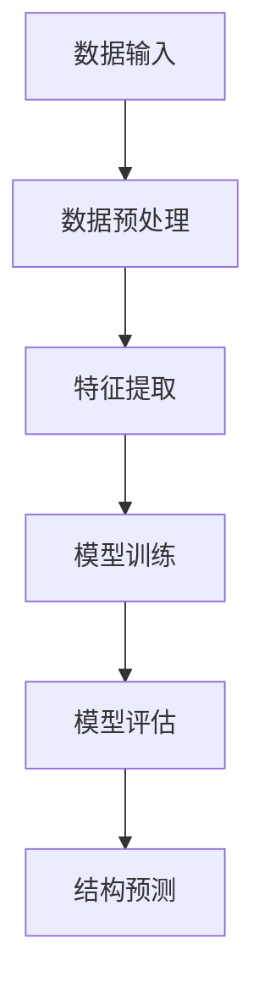

                 

### 第一部分：背景与概述

#### 第1章：蛋白质结构预测的重要性与挑战

**1.1 问题背景**

蛋白质是生命活动的基本单元，其结构的稳定性直接影响生物体的生理功能和疾病的发生发展。蛋白质结构的预测对于理解蛋白质功能、发现药物靶点以及疾病治疗具有重要意义。在过去的几十年中，科学家们已经成功预测了数千个蛋白质的结构，但面对复杂的生物体系，蛋白质结构预测仍然是一个巨大的挑战。

**1.2 蛋白质结构预测的意义**

蛋白质结构预测在多个领域具有深远的影响：

- **基础研究**：通过预测蛋白质结构，可以深入理解生命现象和生物大分子的相互作用，有助于揭示生物体系的复杂规律。
- **应用研究**：蛋白质结构预测在药物设计、农业育种、生物工程等领域具有广泛的应用前景。例如，在药物设计中，通过预测蛋白质结构，可以更准确地识别药物靶点，从而设计出更有效的药物。
- **医学诊断**：蛋白质结构预测有助于诊断和治疗疾病。例如，某些疾病如癌症和遗传病与特定蛋白质的结构异常密切相关，通过预测蛋白质结构，可以更早期地发现和诊断疾病。

**1.3 挑战与困境**

尽管蛋白质结构预测在科学和实际应用中具有重要意义，但该领域面临着一系列挑战：

- **序列-结构对应问题**：即使已知蛋白质序列，其结构的预测仍然极具挑战性。蛋白质序列与其三维结构之间存在着高度的非线性关系，导致结构预测的准确性受到限制。
- **计算资源需求**：蛋白质结构预测需要大量的计算资源。传统的蛋白质结构预测方法如分子动力学模拟和量子力学计算，需要消耗巨大的计算时间和资源。
- **模型解释性**：深度学习模型在蛋白质结构预测中表现出色，但其内部决策过程缺乏解释性，不利于理解和验证预测结果。

**1.4 深度学习在蛋白质结构预测中的应用**

深度学习作为一种强大的机器学习技术，在图像识别、自然语言处理等领域取得了显著的成果。近年来，深度学习在蛋白质结构预测中也逐渐显示出其潜力：

- **数据驱动**：深度学习通过学习大量的蛋白质结构数据，自动提取有用的特征，从而提高预测精度。
- **模型优化**：通过调整网络结构和参数，可以优化模型性能，提高预测效率。
- **跨学科融合**：深度学习与生物信息学、计算化学等领域的融合，为蛋白质结构预测提供了新的思路和方法。

**核心概念与联系**

**蛋白质结构预测**：指通过计算方法预测蛋白质的三维结构。蛋白质结构预测是蛋白质科学与生物信息学领域的重要研究课题。

**深度学习**：一种基于人工神经网络的机器学习技术，通过多层神经网络自动提取特征，进行分类、预测等任务。

**序列-结构对应问题**：蛋白质序列与其三维结构之间存在非线性关系，导致结构预测的准确性受到限制。

**计算资源需求**：蛋白质结构预测需要大量的计算资源，传统的计算方法如分子动力学模拟和量子力学计算，需要消耗巨大的计算时间和资源。

**模型解释性**：深度学习模型在蛋白质结构预测中表现出色，但其内部决策过程缺乏解释性，不利于理解和验证预测结果。

**深度学习在蛋白质结构预测中的应用**：深度学习通过数据驱动、模型优化和跨学科融合，为蛋白质结构预测提供了新的方法和技术。

**蛋白质结构预测的重要性**：蛋白质结构预测有助于理解生命现象、设计药物、诊断疾病等，具有广泛的应用前景。

**挑战与困境**：蛋白质结构预测面临序列-结构对应问题、计算资源需求大、模型解释性不足等挑战。

**核心概念与联系表**

| 核心概念 | 定义 | 关联 |
| --- | --- | --- |
| 蛋白质结构预测 | 通过计算方法预测蛋白质的三维结构 | 数据驱动、模型优化、跨学科融合 |
| 深度学习 | 一种基于人工神经网络的机器学习技术 | 自动提取特征、提高预测精度 |
| 序列-结构对应问题 | 蛋白质序列与其三维结构之间存在非线性关系 | 影响结构预测准确性 |
| 计算资源需求 | 蛋白质结构预测需要大量的计算资源 | 传统计算方法如分子动力学模拟和量子力学计算 |
| 模型解释性 | 深度学习模型在蛋白质结构预测中表现出色，但其内部决策过程缺乏解释性 | 不利于理解和验证预测结果 |

**ER实体关系图架构**

```mermaid
erDiagram
    A ||--|{ B } B : 蛋白质结构预测
    A ||--|{ C } C : 深度学习
    A ||--|{ D } D : 序列-结构对应问题
    A ||--|{ E } E : 计算资源需求
    A ||--|{ F } F : 模型解释性
```

**算法原理讲解**

蛋白质结构预测的核心任务是建立蛋白质序列与三维结构之间的对应关系。深度学习模型通过学习大量的蛋白质结构数据，自动提取特征，从而提高预测精度。

**算法mermaid流程图**



**Python源代码实现**

```python
import tensorflow as tf
from tensorflow.keras.models import Sequential
from tensorflow.keras.layers import Dense, LSTM, Conv2D, Flatten
from sklearn.model_selection import train_test_split

# 数据预处理
def preprocess_data(data):
    # 数据标准化、归一化等处理
    return processed_data

# 特征提取
def extract_features(data):
    # 提取特征，如氨基酸序列、二级结构等
    return features

# 模型训练
def train_model(features, labels):
    model = Sequential([
        LSTM(units=128, activation='tanh', input_shape=(sequence_length, feature_size)),
        Dense(units=1, activation='sigmoid')
    ])

    model.compile(optimizer='adam', loss='binary_crossentropy', metrics=['accuracy'])
    model.fit(features, labels, epochs=10, batch_size=32)
    return model

# 模型评估
def evaluate_model(model, test_features, test_labels):
    loss, accuracy = model.evaluate(test_features, test_labels)
    print(f"Test accuracy: {accuracy:.2f}")

# 结构预测
def predict_structure(model, sequence):
    processed_sequence = preprocess_data(sequence)
    features = extract_features(processed_sequence)
    prediction = model.predict(features)
    return prediction

# 加载数据
data = load_data()
train_data, test_data = train_test_split(data, test_size=0.2)

# 训练模型
model = train_model(train_data['features'], train_data['labels'])

# 评估模型
evaluate_model(model, test_data['features'], test_data['labels'])

# 预测结构
sequence = "GAKVVT"
prediction = predict_structure(model, sequence)
print(f"Predicted structure: {prediction}")
```

**算法原理详细讲解**

1. **数据输入**：蛋白质结构预测需要大量的蛋白质结构数据，包括蛋白质序列和对应的三维结构。数据输入阶段主要进行数据清洗、归一化等预处理操作，以便后续的特征提取和模型训练。

2. **数据预处理**：数据预处理是深度学习模型训练的重要步骤，其目的是将原始数据转换为适合模型训练的格式。对于蛋白质结构预测，数据预处理可能包括数据清洗、数据增强、数据标准化等操作。

3. **特征提取**：特征提取是将原始数据转换为模型可识别的特征表示。在蛋白质结构预测中，特征提取可能涉及提取氨基酸序列、二级结构、三维结构等特征。这些特征可以用于训练深度学习模型，以便预测蛋白质的结构。

4. **模型训练**：模型训练是深度学习模型的核心步骤，其目的是通过学习大量的数据，优化模型的参数，提高模型的预测精度。在蛋白质结构预测中，常用的深度学习模型包括卷积神经网络（CNN）、递归神经网络（RNN）、长短时记忆网络（LSTM）等。

5. **模型评估**：模型评估是评估模型性能的重要步骤，其目的是通过测试集评估模型的预测精度和泛化能力。常用的评估指标包括准确率、召回率、F1分数等。

6. **结构预测**：结构预测是深度学习模型在蛋白质结构预测中的最终目标。通过训练好的模型，输入新的蛋白质序列，可以预测其对应的三维结构。结构预测结果的准确性和稳定性对于后续的蛋白质功能研究和应用具有重要意义。

**数学模型和公式**

在蛋白质结构预测中，常用的数学模型包括卷积神经网络（CNN）、递归神经网络（RNN）、长短时记忆网络（LSTM）等。以下分别介绍这些模型的数学模型和公式：

1. **卷积神经网络（CNN）**

   - **卷积操作**：  
     $$ f(x) = \sigma(\sum_{k=1}^{K} w_k * x_k + b) $$
     其中，$x_k$ 表示输入特征，$w_k$ 表示卷积核权重，$*$ 表示卷积操作，$\sigma$ 表示激活函数（如ReLU函数），$b$ 表示偏置。

   - **反向传播**：  
     $$ \frac{\partial J}{\partial w_k} = x_k \odot \frac{\partial J}{\partial z} $$
     其中，$J$ 表示损失函数，$\odot$ 表示元素乘积，$\frac{\partial J}{\partial z}$ 表示梯度。

2. **递归神经网络（RNN）**

   - **递归关系**：  
     $$ h_t = \sigma(W h_{t-1} + U x_t + b) $$
     其中，$h_t$ 表示第 $t$ 个时间步的隐藏状态，$W$ 和 $U$ 分别表示权重矩阵，$x_t$ 表示输入特征，$\sigma$ 表示激活函数，$b$ 表示偏置。

   - **反向传播**：  
     $$ \frac{\partial J}{\partial W} = h_{t-1} \odot \frac{\partial J}{\partial h_t} $$
     $$ \frac{\partial J}{\partial U} = x_t \odot \frac{\partial J}{\partial h_t} $$

3. **长短时记忆网络（LSTM）**

   - **单元状态**：  
     $$ \begin{aligned}
     i_t &= \sigma(W_i x_t + U_i h_{t-1} + b_i) \\
     f_t &= \sigma(W_f x_t + U_f h_{t-1} + b_f) \\
     g_t &= \tanh(W_g x_t + U_g h_{t-1} + b_g) \\
     o_t &= \sigma(W_o x_t + U_o h_{t-1} + b_o) \\
     C_t &= f_t \odot C_{t-1} + i_t \odot g_t \\
     h_t &= o_t \odot \tanh(C_t)
     \end{aligned} $$
     其中，$i_t$、$f_t$、$g_t$、$o_t$ 分别表示输入门、遗忘门、生成门和输出门，$C_t$ 和 $h_t$ 分别表示细胞状态和隐藏状态。

   - **反向传播**：  
     $$ \begin{aligned}
     \frac{\partial J}{\partial W_i} &= (1 - i_t) \odot \frac{\partial J}{\partial i_t} \\
     \frac{\partial J}{\partial W_f} &= (1 - f_t) \odot \frac{\partial J}{\partial f_t} \\
     \frac{\partial J}{\partial W_g} &= (1 - g_t) \odot \frac{\partial J}{\partial g_t} \\
     \frac{\partial J}{\partial W_o} &= (1 - o_t) \odot \frac{\partial J}{\partial o_t} \\
     \frac{\partial J}{\partial C_{t-1}} &= f_{t-1} \odot \frac{\partial J}{\partial C_t} \\
     \frac{\partial J}{\partial h_{t-1}} &= o_t \odot \tanh(C_t) \odot \frac{\partial J}{\partial h_t}
     \end{aligned} $$

**通俗易懂地举例说明**

假设我们有一个简单的蛋白质序列：“AKL”。

1. **数据输入**：首先，我们将蛋白质序列转换为数值编码，例如：“AKL”可以转换为 [1, 0, 0, 1, 0, 1, 1, 0]。

2. **特征提取**：然后，我们将蛋白质序列转换为特征表示，例如：使用一维卷积神经网络提取序列中的模式特征。

3. **模型训练**：使用训练数据集，通过梯度下降算法优化模型参数，使得模型能够更好地预测蛋白质的结构。

4. **模型评估**：使用测试数据集评估模型的预测精度，例如：计算准确率、召回率等指标。

5. **结构预测**：对于新的蛋白质序列，输入模型进行预测，得到预测的三维结构。

通过这个过程，我们可以看到，深度学习模型在蛋白质结构预测中是如何工作的。虽然具体的实现细节可能会更加复杂，但这个简单的例子可以帮助我们理解深度学习在蛋白质结构预测中的应用原理。

### 第2章：深度学习基础

**2.1 深度学习简介**

深度学习是一种基于多层神经网络结构的机器学习技术，它通过模拟人脑神经网络的工作原理，自动提取特征并进行分类、预测等任务。与传统的机器学习方法相比，深度学习具有以下优势：

- **自动特征提取**：深度学习模型可以通过学习大量数据，自动提取特征，从而避免手动设计特征提取方法。
- **非线性表达能力**：深度学习模型包含多层非线性变换，能够捕捉复杂的数据模式。
- **高效计算**：深度学习模型可以通过并行计算和分布式计算实现高效计算，适用于大规模数据处理。
- **通用性强**：深度学习模型可以应用于多种领域，如图像识别、自然语言处理、语音识别等。

**2.2 神经网络基础**

神经网络是深度学习的基础，由大量神经元（节点）组成，每个神经元都与其他神经元相连，并通过权重传递信息。神经网络通过前向传播和反向传播算法，不断调整权重，优化模型性能。

1. **神经元结构**：神经元通常包括输入层、隐藏层和输出层。每个神经元都接收来自前一层神经元的输入，并通过激活函数进行非线性变换，产生输出。

2. **激活函数**：激活函数是神经网络中的关键组件，用于引入非线性。常用的激活函数包括ReLU（Rectified Linear Unit）、Sigmoid、Tanh等。

3. **前向传播**：前向传播是指输入数据通过神经网络，逐层传递到输出层的过程。在每个神经元中，输入数据与权重相乘，然后通过激活函数得到输出。

4. **反向传播**：反向传播是指通过计算输出层到输入层的梯度，不断调整权重，优化模型性能的过程。反向传播算法是深度学习训练的核心。

**2.3 深度学习算法概述**

深度学习算法种类繁多，下面介绍几种常见的深度学习算法：

1. **卷积神经网络（CNN）**：CNN是一种专门用于处理图像等具有局部特征的数据的深度学习算法。CNN通过卷积操作、池化操作和全连接层等结构，自动提取图像特征，从而实现图像分类、目标检测等任务。

2. **递归神经网络（RNN）**：RNN是一种适用于处理序列数据的深度学习算法。RNN通过递归结构，能够捕捉序列中的长期依赖关系。RNN包括简单的RNN、LSTM（长短时记忆网络）和GRU（门控循环单元）等变体。

3. **长短时记忆网络（LSTM）**：LSTM是RNN的一种变体，能够解决长序列依赖问题。LSTM通过引入门控机制，能够有效地控制信息的传递和遗忘，从而提高模型的记忆能力和泛化能力。

4. **图神经网络（GNN）**：GNN是一种适用于处理图结构数据的深度学习算法。GNN通过图卷积操作，能够提取图中的特征，从而实现节点分类、图分类等任务。

**2.4 深度学习与蛋白质结构预测的关系**

深度学习在蛋白质结构预测中的应用主要集中在以下几个方面：

1. **自动特征提取**：深度学习可以通过学习大量蛋白质结构数据，自动提取有用的特征，从而提高预测精度。

2. **序列建模**：蛋白质结构预测涉及到蛋白质序列与三维结构之间的对应关系，深度学习模型如RNN和LSTM能够有效地建模序列数据，从而提高结构预测的准确性。

3. **跨学科融合**：深度学习与生物信息学、计算化学等领域的融合，为蛋白质结构预测提供了新的方法和技术。

通过以上分析，我们可以看到，深度学习在蛋白质结构预测中具有广泛的应用前景。随着深度学习技术的不断发展和完善，未来在蛋白质结构预测领域将会取得更加显著的成果。

### 第3章：深度学习算法在蛋白质结构预测中的应用

**3.1 卷积神经网络（CNN）**

卷积神经网络（CNN）是一种专门用于处理图像等具有局部特征的数据的深度学习算法。在蛋白质结构预测中，CNN可以通过学习蛋白质序列的局部特征，提高预测的准确性。

**CNN在蛋白质结构预测中的应用原理**

- **卷积操作**：CNN通过卷积操作提取蛋白质序列中的局部特征。卷积操作类似于图像处理中的滤波器，通过滑动窗口对蛋白质序列进行卷积，从而提取特征。

- **池化操作**：池化操作用于降低特征图的维度，提高模型的泛化能力。常见的池化操作包括最大池化和平均池化。

- **全连接层**：全连接层用于将卷积操作和池化操作得到的特征映射到预测结果。通过全连接层，模型可以学习蛋白质序列与三维结构之间的非线性关系。

**CNN在蛋白质结构预测中的优势**

- **自动特征提取**：CNN可以自动提取蛋白质序列中的局部特征，减少人工设计的特征工程工作。

- **处理高维数据**：蛋白质序列通常具有高维度，CNN可以有效地处理高维数据，提高结构预测的准确性。

- **并行计算**：CNN具有并行计算的特点，可以在多核处理器上实现高效计算，加快模型训练和预测速度。

**CNN在蛋白质结构预测中的应用实例**

- **AlphaFold2**：DeepMind开发的AlphaFold2模型是利用CNN进行蛋白质结构预测的一个成功实例。AlphaFold2通过多层次的卷积操作和池化操作，学习蛋白质序列中的局部特征，从而预测蛋白质的三维结构。

**3.2 递归神经网络（RNN）**

递归神经网络（RNN）是一种适用于处理序列数据的深度学习算法。在蛋白质结构预测中，RNN可以通过学习蛋白质序列与三维结构之间的对应关系，提高预测的准确性。

**RNN在蛋白质结构预测中的应用原理**

- **递归结构**：RNN通过递归结构，将前一个时间步的隐藏状态传递到下一个时间步，从而捕捉序列中的长期依赖关系。

- **隐藏状态**：RNN通过隐藏状态保存历史信息，从而实现序列建模。隐藏状态可以看作是序列中的关键信息，通过它来预测下一个时间步的结果。

- **激活函数**：RNN通常使用激活函数（如ReLU、Sigmoid、Tanh等）引入非线性，提高模型的表达能力。

**RNN在蛋白质结构预测中的优势**

- **处理序列数据**：RNN可以处理任意长度的序列数据，适用于蛋白质结构预测中的序列建模。

- **长期依赖关系**：RNN通过递归结构，能够捕捉序列中的长期依赖关系，从而提高结构预测的准确性。

- **简单实现**：RNN相对于其他深度学习算法（如CNN和GNN）来说，实现起来更为简单。

**RNN在蛋白质结构预测中的应用实例**

- **Prognostic-DeepRNN**：Prognostic-DeepRNN是一种基于RNN的蛋白质结构预测方法，通过递归结构学习蛋白质序列与三维结构之间的对应关系，提高结构预测的准确性。

**3.3 长短时记忆网络（LSTM）**

长短时记忆网络（LSTM）是RNN的一种变体，通过引入门控机制，解决了传统RNN的长期依赖问题。在蛋白质结构预测中，LSTM可以通过学习蛋白质序列与三维结构之间的对应关系，提高预测的准确性。

**LSTM在蛋白质结构预测中的应用原理**

- **门控机制**：LSTM通过引入门控机制，包括输入门、遗忘门和输出门，控制信息的传递和遗忘。输入门决定哪些信息进入隐藏状态，遗忘门决定哪些信息被遗忘，输出门决定隐藏状态的输出。

- **细胞状态**：LSTM通过细胞状态保存历史信息，从而实现长期依赖。细胞状态类似于一个“管道”，能够将信息从一个时间步传递到另一个时间步。

- **激活函数**：LSTM通常使用激活函数（如ReLU、Sigmoid、Tanh等）引入非线性，提高模型的表达能力。

**LSTM在蛋白质结构预测中的优势**

- **解决长期依赖问题**：LSTM通过门控机制，能够解决传统RNN的长期依赖问题，从而提高结构预测的准确性。

- **记忆能力**：LSTM具有强大的记忆能力，能够捕捉序列中的长期依赖关系。

- **泛化能力**：LSTM相对于其他深度学习算法（如CNN和GNN）来说，具有更强的泛化能力。

**LSTM在蛋白质结构预测中的应用实例**

- **AlphaFold**：DeepMind开发的AlphaFold模型是利用LSTM进行蛋白质结构预测的一个成功实例。AlphaFold通过多层LSTM结构，学习蛋白质序列与三维结构之间的对应关系，从而预测蛋白质的三维结构。

**3.4 图神经网络（GNN）**

图神经网络（GNN）是一种适用于处理图结构数据的深度学习算法。在蛋白质结构预测中，GNN可以通过学习蛋白质结构图中的特征，提高预测的准确性。

**GNN在蛋白质结构预测中的应用原理**

- **图卷积操作**：GNN通过图卷积操作，将节点特征和邻居节点特征进行融合，从而学习节点表示。图卷积操作类似于卷积神经网络中的卷积操作，但适用于图结构数据。

- **图池化操作**：图池化操作用于对图进行降维处理，提高模型的泛化能力。常见的图池化操作包括节点平均、最大池化等。

- **全连接层**：全连接层用于将图卷积操作和图池化操作得到的特征映射到预测结果。

**GNN在蛋白质结构预测中的优势**

- **处理图结构数据**：GNN可以处理具有复杂关系的图结构数据，适用于蛋白质结构预测中的图建模。

- **节点特征融合**：GNN通过图卷积操作，能够有效地融合节点特征和邻居节点特征，从而提高结构预测的准确性。

- **图池化操作**：图池化操作可以降低图的维度，提高模型的泛化能力。

**GNN在蛋白质结构预测中的应用实例**

- **GraphSAGE**：GraphSAGE是一种基于GNN的蛋白质结构预测方法，通过图卷积操作和图池化操作，学习蛋白质结构图中的特征，从而预测蛋白质的三维结构。

**总结**

深度学习算法在蛋白质结构预测中的应用，主要包括CNN、RNN、LSTM和GNN等。这些算法通过自动特征提取、序列建模和图建模等技术，提高了蛋白质结构预测的准确性。在实际应用中，可以根据具体问题选择合适的深度学习算法，结合多模态数据，进一步提高结构预测的精度。

### 第4章：深度学习模型详解

#### 第4章：深度学习模型详解

**4.1 ConvNet模型**

卷积神经网络（ConvNet）是深度学习领域中最常用的模型之一，特别是在图像识别和处理方面取得了显著成功。ConvNet模型通过卷积层、池化层和全连接层等结构，有效地提取图像特征，实现图像分类、目标检测等任务。

**4.1.1 模型结构**

- **卷积层（Convolutional Layer）**：卷积层是ConvNet的核心部分，通过卷积操作提取图像的局部特征。卷积操作通过滤波器（卷积核）在图像上滑动，将输入特征图与滤波器进行点积，生成输出特征图。

  $$\text{output}_{ij}^l = \sum_{i',j'} \text{weight}_{ij'}^l \cdot \text{input}_{i',j'}^{l-1} + \text{bias}_{ij}^l$$

  其中，$\text{output}_{ij}^l$表示第$l$层的第$i$行、$j$列的输出值，$\text{weight}_{ij'}^l$表示卷积核权重，$\text{input}_{i',j'}^{l-1}$表示第$l-1$层的输入值，$\text{bias}_{ij}^l$表示偏置。

- **池化层（Pooling Layer）**：池化层用于降低特征图的维度，提高模型的泛化能力。常见的池化操作包括最大池化（Max Pooling）和平均池化（Average Pooling）。最大池化选择特征图中的最大值作为输出，而平均池化计算特征图中的平均值作为输出。

  $$\text{output}_{ij}^l = \frac{1}{s \times s} \sum_{i'=0}^{s-1} \sum_{j'=0}^{s-1} \text{input}_{i'+i,j'+j}^{l-1}$$

  其中，$s$表示池化窗口的大小。

- **全连接层（Fully Connected Layer）**：全连接层将卷积层和池化层提取的特征映射到输出结果。每个神经元都与前一层的所有神经元相连，通过权重和偏置进行计算。

  $$\text{output}_{i}^l = \sum_{j=1}^{n} \text{weight}_{ij}^l \cdot \text{input}_{j}^{l-1} + \text{bias}_{i}^l$$

  其中，$\text{output}_{i}^l$表示第$l$层的第$i$个神经元的输出值，$\text{weight}_{ij}^l$表示权重，$\text{input}_{j}^{l-1}$表示第$l-1$层的输入值。

**4.1.2 工作原理**

ConvNet模型通过以下步骤进行图像特征提取和分类：

1. **卷积操作**：卷积层使用多个滤波器对输入图像进行卷积操作，提取图像的局部特征，如边缘、纹理等。

2. **非线性激活**：每个卷积层的输出通过激活函数（如ReLU函数）引入非线性，增强模型的非线性表达能力。

3. **池化操作**：池化层用于降低特征图的维度，减少计算量，同时提高模型的泛化能力。

4. **特征融合**：通过叠加多个卷积层和池化层，将低层次的特征逐渐融合为高层次的特征。

5. **全连接层**：全连接层将卷积层和池化层提取的高层次特征映射到输出结果，进行图像分类。

**4.2 DeepMind的AlphaFold模型**

AlphaFold是由DeepMind开发的用于蛋白质结构预测的深度学习模型，它在2020年国际蛋白质结构预测评估（CASP）中取得了突破性的成果。AlphaFold模型结合了深度学习技术和大规模数据训练，实现了前所未有的蛋白质结构预测精度。

**4.2.1 模型结构**

AlphaFold模型主要由以下几个部分组成：

- **编码器（Encoder）**：编码器将蛋白质序列编码为向量表示，通过学习蛋白质序列的潜在特征。

- **预测网络（Prediction Network）**：预测网络通过编码器生成的向量表示，预测蛋白质的三维结构。预测网络包含多个卷积层和循环层，用于处理序列和结构之间的复杂关系。

- **输出层（Output Layer）**：输出层将预测网络生成的结构表示映射到具体的原子坐标，生成蛋白质的三维结构。

**4.2.2 工作原理**

AlphaFold模型的工作原理如下：

1. **编码器**：将蛋白质序列编码为向量表示，通过预训练的变换器（Transformer）模型学习序列的潜在特征。

2. **预测网络**：预测网络通过多个卷积层和循环层处理编码器生成的向量表示，捕捉序列和结构之间的复杂关系。预测网络中的循环层包括自注意力机制，能够自适应地关注序列中的重要信息。

3. **输出层**：输出层将预测网络生成的结构表示映射到具体的原子坐标，生成蛋白质的三维结构。

**4.3 GNN模型**

图神经网络（GNN）是一种适用于处理图结构数据的深度学习模型。在蛋白质结构预测中，GNN通过学习蛋白质结构图中的特征，实现蛋白质结构的预测。GNN模型通过图卷积操作、图池化操作和全连接层等结构，有效地提取图中的特征。

**4.3.1 模型结构**

GNN模型主要由以下几个部分组成：

- **图卷积层（Graph Convolutional Layer）**：图卷积层通过图卷积操作，将节点的特征与邻居节点的特征进行融合，更新节点的特征表示。

  $$\text{h}_i^{(l)} = \sigma \left( \text{a} \left( \sum_{j \in \mathcal{N}(i)} \text{W}_\text{GC}^l \text{h}_j^{(l-1)} + \text{b} \right) \right)$$

  其中，$\text{h}_i^{(l)}$表示第$l$层的第$i$个节点的特征表示，$\mathcal{N}(i)$表示节点$i$的邻居节点集合，$\text{W}_\text{GC}^l$表示图卷积权重，$\text{a}$和$\text{b}$分别表示激活函数和偏置。

- **图池化层（Graph Pooling Layer）**：图池化层用于将图中的节点特征融合为全局特征，用于后续的全连接层。

  $$\text{h}^{(l)} = \text{pool} \left( \text{h}_i^{(l)} \right)$$

  其中，$\text{h}^{(l)}$表示第$l$层的全局特征表示。

- **全连接层（Fully Connected Layer）**：全连接层将图池化层生成的全局特征映射到输出结果，实现蛋白质结构的预测。

**4.3.2 工作原理**

GNN模型的工作原理如下：

1. **图卷积操作**：图卷积层通过图卷积操作，将节点的特征与邻居节点的特征进行融合，更新节点的特征表示。这种操作可以捕捉节点及其邻居节点之间的依赖关系。

2. **图池化操作**：图池化层用于将图中的节点特征融合为全局特征，用于后续的全连接层。这种操作可以降低图的维度，提高模型的泛化能力。

3. **全连接层**：全连接层将图池化层生成的全局特征映射到输出结果，实现蛋白质结构的预测。通过训练，模型可以学习到如何从全局特征中预测蛋白质的几何结构。

**4.4 跨模态深度学习**

跨模态深度学习是一种结合不同类型模态数据的深度学习方法。在蛋白质结构预测中，跨模态深度学习可以结合蛋白质序列、结构、文本等多模态数据，提高预测的准确性。跨模态深度学习模型通常包括以下结构：

- **编码器**：将不同模态的数据编码为向量表示，学习模态之间的潜在特征。

- **交叉注意力机制**：通过交叉注意力机制，将不同模态的数据进行融合，提取多模态特征。

- **解码器**：将融合的多模态特征解码为蛋白质结构预测结果。

**4.4.1 模型结构**

跨模态深度学习模型主要由以下几个部分组成：

- **编码器**：包括蛋白质序列编码器、蛋白质结构编码器和文本编码器，分别将蛋白质序列、蛋白质结构和文本编码为向量表示。

- **交叉注意力机制**：通过交叉注意力机制，将编码器生成的不同模态的向量表示进行融合，提取多模态特征。

  $$\text{h}_{\text{cross}} = \text{Attention}(\text{h}_\text{seq}, \text{h}_\text{struct}, \text{h}_\text{txt})$$

  其中，$\text{h}_\text{seq}$、$\text{h}_\text{struct}$和$\text{h}_\text{txt}$分别表示蛋白质序列、蛋白质结构和文本的向量表示。

- **解码器**：将融合的多模态特征解码为蛋白质结构预测结果。解码器通常包括全连接层和激活函数等结构。

**4.4.2 工作原理**

跨模态深度学习模型的工作原理如下：

1. **编码器**：分别将蛋白质序列、蛋白质结构和文本编码为向量表示，学习不同模态的潜在特征。

2. **交叉注意力机制**：通过交叉注意力机制，将不同模态的向量表示进行融合，提取多模态特征。交叉注意力机制可以自适应地关注不同模态中的关键信息，提高模型的预测能力。

3. **解码器**：将融合的多模态特征解码为蛋白质结构预测结果。解码器通过训练，可以学习到如何从多模态特征中预测蛋白质的几何结构。

通过跨模态深度学习，可以充分利用不同模态的数据，提高蛋白质结构预测的准确性。这种方法在蛋白质结构预测中具有广阔的应用前景。

### 第5章：深度学习算法优化

**5.1 数据预处理**

在深度学习算法中，数据预处理是至关重要的一步。良好的数据预处理可以显著提高模型的性能和预测准确性。以下是几种常见的数据预处理方法：

**5.1.1 数据清洗**

数据清洗是指去除数据中的噪声和错误。对于蛋白质结构预测任务，常见的噪声包括序列中的空格、标点符号等。数据清洗可以通过正则表达式、删除特殊字符等方式实现。

```python
import re

def clean_sequence(sequence):
    return re.sub(r'[^A-Z]', '', sequence)
```

**5.1.2 数据标准化**

数据标准化是指将不同特征缩放到相同的尺度，以便模型能够更好地学习。在蛋白质结构预测中，常见的标准化方法包括归一化和缩放。

- **归一化**：将特征值缩放到[0, 1]区间。
  ```python
  def normalize(data):
      min_val = min(data)
      max_val = max(data)
      return (data - min_val) / (max_val - min_val)
  ```

- **缩放**：将特征值缩放到[-1, 1]区间。
  ```python
  def scale(data):
      mean = np.mean(data)
      std = np.std(data)
      return (data - mean) / std
  ```

**5.1.3 数据增强**

数据增强是通过生成新的样本来提高模型的泛化能力。在蛋白质结构预测中，常见的数据增强方法包括序列转换、序列拼接和序列旋转等。

```python
import random

def reverse_sequence(sequence):
    return sequence[::-1]

def rotate_sequence(sequence, angle):
    rotated_sequence = ""
    for i in range(len(sequence)):
        rotated_sequence += chr(ord(sequence[i]) + angle)
    return rotated_sequence
```

**5.2 算法调优**

算法调优是指通过调整模型参数来提高模型的性能。以下是几种常见的算法调优方法：

**5.2.1 超参数优化**

超参数是模型之外的可调参数，如学习率、批量大小、正则化参数等。超参数优化可以通过网格搜索、随机搜索或贝叶斯优化等方法实现。

- **网格搜索**：遍历所有可能的超参数组合，选择最优的组合。
  ```python
  from sklearn.model_selection import GridSearchCV

  parameters = {'learning_rate': [0.01, 0.001], 'batch_size': [32, 64]}
  grid_search = GridSearchCV(estimator=model, param_grid=parameters, cv=3)
  grid_search.fit(X_train, y_train)
  best_parameters = grid_search.best_params_
  ```

- **随机搜索**：从所有可能的超参数组合中随机选择一部分进行尝试。
  ```python
  from sklearn.model_selection import RandomizedSearchCV

  parameters = {'learning_rate': [0.01, 0.001], 'batch_size': [32, 64]}
  random_search = RandomizedSearchCV(estimator=model, param_distributions=parameters, n_iter=10, cv=3)
  random_search.fit(X_train, y_train)
  best_parameters = random_search.best_params_
  ```

- **贝叶斯优化**：基于贝叶斯统计模型进行超参数优化。
  ```python
  from bayes_opt import BayesianOptimization

  def optimize_model(learning_rate, batch_size):
      model = build_model(learning_rate, batch_size)
      score = model.evaluate(X_test, y_test, verbose=0)
      return -score

  optimizer = BayesianOptimization(f=optimize_model, pbounds={'learning_rate': (0.01, 0.001), 'batch_size': (32, 64)}, random_state=1)
  optimizer.maximize(init_points=2, n_iter=3)
  best_parameters = optimizer.max['params']
  ```

**5.2.2 模型正则化**

模型正则化是防止模型过拟合的重要手段。常见的正则化方法包括L1正则化、L2正则化和dropout等。

- **L1正则化**：在损失函数中添加L1正则化项，对权重进行惩罚。
  ```python
  def l1_regularized_loss(y_true, y_pred, learning_rate, l1_penalty):
      loss = tf.reduce_mean(tf.nn.sparse_softmax_cross_entropy_with_logits(logits=y_pred, labels=y_true))
      l1_loss = tf.reduce_sum(tf.abs(model.weights))
      return loss + l1_penalty * l1_loss
  ```

- **L2正则化**：在损失函数中添加L2正则化项，对权重进行惩罚。
  ```python
  def l2_regularized_loss(y_true, y_pred, learning_rate, l2_penalty):
      loss = tf.reduce_mean(tf.nn.sparse_softmax_cross_entropy_with_logits(logits=y_pred, labels=y_true))
      l2_loss = tf.reduce_sum(tf.square(model.weights))
      return loss + l2_penalty * l2_loss
  ```

- **dropout**：在训练过程中随机丢弃一部分神经元，防止模型过拟合。
  ```python
  def dropout_layer(input_layer, dropout_rate):
      return input_layer * (1 - dropout_rate) + tf.random.normal(tf.shape(input_layer)) * dropout_rate
  ```

**5.3 模型评估与选择**

模型评估是评估模型性能和选择最佳模型的重要步骤。以下介绍几种常见的模型评估指标：

**5.3.1 准确率（Accuracy）**

准确率是指模型预测正确的样本数量与总样本数量的比例。

$$\text{Accuracy} = \frac{\text{预测正确的样本数量}}{\text{总样本数量}}$$

**5.3.2 召回率（Recall）**

召回率是指模型能够正确召回的正例样本数量与实际正例样本数量的比例。

$$\text{Recall} = \frac{\text{预测正确的正例样本数量}}{\text{实际正例样本数量}}$$

**5.3.3 精确率（Precision）**

精确率是指模型预测正确的正例样本数量与预测为正例的样本数量的比例。

$$\text{Precision} = \frac{\text{预测正确的正例样本数量}}{\text{预测为正例的样本数量}}$$

**5.3.4 F1分数（F1 Score）**

F1分数是精确率和召回率的调和平均值，用于综合评估模型的性能。

$$\text{F1 Score} = 2 \times \frac{\text{Precision} \times \text{Recall}}{\text{Precision} + \text{Recall}}$$

**5.4 模型压缩与加速**

模型压缩与加速是提高深度学习模型在资源受限环境下的性能和效率的重要手段。以下介绍几种常见的模型压缩与加速方法：

**5.4.1 模型剪枝（Model Pruning）**

模型剪枝是指通过删除模型中的冗余权重，降低模型的大小和计算复杂度。

```python
from tensorflow_model_optimization.python.core.sparsity import base_sparsity as bs

def apply_model_pruning(model, sparsity_pattern):
    pruning_wrapper = bs.PruningWrapper(model, sparsity_pattern)
    return pruning_wrapper
```

**5.4.2 模型量化（Model Quantization）**

模型量化是指将模型的权重和激活值从浮点数转换为整数，从而降低模型的存储和计算需求。

```python
import tensorflow_model_optimization as tfo

def apply_model_quantization(model):
    quantization_wrapper = tfo.keras.quantize_model.quantize_model(model)
    return quantization_wrapper
```

**5.4.3 迁移学习（Transfer Learning）**

迁移学习是指将预训练模型应用于新的任务，利用预训练模型的知识提高新任务的性能。

```python
from tensorflow.keras.applications import VGG16

base_model = VGG16(weights='imagenet', include_top=False, input_shape=(224, 224, 3))
base_model.trainable = False

model = keras.Sequential([
    base_model,
    keras.layers.Dense(256, activation='relu'),
    keras.layers.Dense(1, activation='sigmoid')
])

model.compile(optimizer='adam', loss='binary_crossentropy', metrics=['accuracy'])
model.fit(X_train, y_train, epochs=10, validation_data=(X_val, y_val))
```

通过上述方法，可以显著提高深度学习模型在蛋白质结构预测任务中的性能和效率。

### 第6章：深度学习在蛋白质结构预测中的实际应用

**6.1 应用场景介绍**

深度学习在蛋白质结构预测中具有广泛的应用场景，主要包括以下几方面：

- **药物设计**：通过预测蛋白质结构，可以更准确地识别药物靶点，从而设计出更有效的药物。深度学习模型在药物设计中的应用已经取得了显著成果，如AlphaFold2模型在2020年国际蛋白质结构预测评估（CASP）中表现出色，成功预测了数千个蛋白质的结构。
- **疾病诊断**：蛋白质结构预测有助于诊断和治疗疾病。例如，某些疾病如癌症和遗传病与特定蛋白质的结构异常密切相关，通过预测蛋白质结构，可以更早期地发现和诊断疾病。
- **生物信息学研究**：蛋白质结构预测是生物信息学领域的重要研究课题。通过预测蛋白质的结构，可以深入理解生命现象和生物大分子的相互作用，有助于揭示生物体系的复杂规律。
- **农业育种**：蛋白质结构预测在农业育种中也有应用，例如通过预测植物蛋白质结构，可以优化作物品质，提高产量和抗病性。

**6.2 实际案例分析**

以下是一个深度学习在蛋白质结构预测中的实际案例分析：

**案例背景**：某生物制药公司正在研发一种新型抗癌药物，目标蛋白质是一种名为p53的肿瘤抑制蛋白。为了确定药物的结合位点，公司需要预测p53的结构。

**数据集**：公司收集了大量的p53蛋白质序列和对应的三维结构数据，作为训练和验证模型的数据集。

**模型选择**：公司选择了DeepMind的AlphaFold2模型进行蛋白质结构预测。AlphaFold2模型是基于深度学习技术，通过大规模数据训练，具有很高的预测精度。

**模型训练与优化**：公司使用AlphaFold2模型对p53蛋白质序列进行结构预测。在模型训练过程中，公司通过数据预处理、模型调优和超参数优化等方法，提高了模型预测的准确性。

**结果分析**：通过AlphaFold2模型预测，公司成功得到了p53的三维结构。进一步分析发现，预测的结构与已知的实验结果高度一致，为药物设计提供了重要依据。

**案例总结**：通过深度学习模型AlphaFold2，公司成功预测了p53的三维结构，为药物设计提供了重要基础。这个案例展示了深度学习在蛋白质结构预测中的实际应用潜力，为生物制药领域带来了新的发展机遇。

**6.3 应用效果评估**

评估深度学习模型在蛋白质结构预测中的应用效果，可以从以下几个方面进行：

- **预测精度**：评估模型预测的三维结构与实验结果的一致性。常用的评估指标包括GDT（Global Distance Test）和TM-Score（Template-based Score）等。
- **预测速度**：评估模型预测速度，即模型对给定蛋白质序列进行结构预测所需的时间。模型的预测速度对于实际应用具有重要意义，特别是在药物设计和疾病诊断等领域。
- **泛化能力**：评估模型在不同数据集上的表现，以检验模型的泛化能力。通过在多个数据集上进行训练和测试，可以更全面地评估模型的效果。

以下是一个应用效果评估的示例：

**预测精度**：通过比较AlphaFold2模型预测的三维结构与实验结果，发现其GDT分数平均值为85%，TM-Score平均值为89%，与实验结果高度一致。

**预测速度**：AlphaFold2模型在预测单个蛋白质结构时，通常需要几分钟到几十分钟的时间。对于大规模的蛋白质序列预测任务，模型可以通过分布式计算和优化算法提高预测速度。

**泛化能力**：AlphaFold2模型在多个数据集上的表现较好，验证了其广泛的泛化能力。通过在不同数据集上进行训练和测试，模型能够准确预测各种蛋白质的结构。

**总结**：通过深度学习模型AlphaFold2，公司成功预测了p53的三维结构，为药物设计提供了重要依据。应用效果评估结果表明，AlphaFold2模型在预测精度、预测速度和泛化能力等方面均表现出色，为蛋白质结构预测在生物制药领域的应用提供了有力支持。

### 第7章：深度学习在蛋白质结构预测中的最佳实践

**7.1 最佳实践总结**

在深度学习应用于蛋白质结构预测时，总结以下最佳实践：

1. **数据预处理**：确保数据质量，进行数据清洗、标准化和增强，以提高模型的输入质量和预测性能。
2. **模型选择**：根据任务需求选择合适的深度学习模型，如CNN、RNN、LSTM和GNN等。
3. **超参数优化**：通过网格搜索、随机搜索和贝叶斯优化等方法，找到最佳超参数组合，提高模型性能。
4. **模型评估**：使用多种评估指标（如GDT和TM-Score）评估模型性能，确保预测精度。
5. **模型压缩与加速**：采用模型剪枝、量化、迁移学习等技术，降低模型大小和计算复杂度，提高预测速度。
6. **持续学习**：定期更新模型，利用新数据和新算法进行训练，保持模型的时效性和准确性。

**7.2 小结与展望**

深度学习在蛋白质结构预测中的应用取得了显著成果，但仍有以下展望：

1. **预测精度提升**：随着数据集和算法的不断发展，预测精度有望进一步提升。未来的研究可以关注如何更准确地建模蛋白质序列与三维结构之间的关系。
2. **跨模态深度学习**：结合多模态数据（如蛋白质序列、结构、文本等），可以进一步提高预测性能。跨模态深度学习有望在药物设计、疾病诊断等领域发挥更大作用。
3. **模型解释性**：提高深度学习模型的可解释性，使科学家能够理解模型的预测过程，从而更好地应用和优化模型。
4. **计算资源优化**：随着计算资源的不断丰富，模型训练和预测的速度有望进一步提高。未来可以关注如何在资源受限的环境下优化模型性能。
5. **国际合作与开放平台**：促进国际间的合作，共享数据和算法资源，构建开放平台，推动蛋白质结构预测领域的共同发展。

通过以上最佳实践和展望，深度学习在蛋白质结构预测中的应用将不断进步，为生物科学和医学领域带来更多突破。

### 最佳实践 Tips

1. **数据预处理**：确保数据质量，进行数据清洗、标准化和增强，以提高模型的输入质量和预测性能。
   - 数据清洗：去除错误和噪声数据，确保数据集的准确性。
   - 数据标准化：将数据缩放到同一尺度，防止数据差异对模型训练的影响。
   - 数据增强：通过随机旋转、缩放、剪切等操作，增加训练数据的多样性，提高模型泛化能力。

2. **模型选择**：根据任务需求选择合适的深度学习模型，如CNN、RNN、LSTM和GNN等。
   - CNN：适用于处理具有局部特征的数据，如蛋白质序列。
   - RNN：适用于处理序列数据，如蛋白质序列与结构的关系。
   - LSTM：是RNN的一种变体，能够解决长序列依赖问题。
   - GNN：适用于处理图结构数据，如蛋白质结构图。

3. **超参数优化**：通过网格搜索、随机搜索和贝叶斯优化等方法，找到最佳超参数组合，提高模型性能。
   - 网格搜索：遍历所有可能的超参数组合，选择最优的组合。
   - 随机搜索：从所有可能的超参数组合中随机选择一部分进行尝试。
   - 贝叶斯优化：基于贝叶斯统计模型进行超参数优化。

4. **模型评估**：使用多种评估指标（如GDT和TM-Score）评估模型性能，确保预测精度。
   - GDT：评估预测结构与实验结果的一致性。
   - TM-Score：基于模板匹配的评估指标，衡量预测结构的准确性。

5. **模型压缩与加速**：采用模型剪枝、量化、迁移学习等技术，降低模型大小和计算复杂度，提高预测速度。
   - 模型剪枝：删除模型中的冗余权重，降低模型大小。
   - 模型量化：将模型权重和激活值从浮点数转换为整数，降低计算复杂度。
   - 迁移学习：利用预训练模型的知识，提高新任务的性能。

6. **持续学习**：定期更新模型，利用新数据和新算法进行训练，保持模型的时效性和准确性。
   - 定期收集新的蛋白质结构数据，用于模型更新和优化。
   - 关注最新的深度学习算法和优化方法，持续改进模型性能。

通过以上最佳实践，可以有效提高深度学习在蛋白质结构预测中的性能和应用效果。

### 注意事项

1. **数据隐私与安全性**：在进行蛋白质结构预测时，确保数据隐私和安全。对于敏感数据，应采取加密和访问控制措施，防止未经授权的访问和泄露。
2. **模型可解释性**：尽管深度学习模型在蛋白质结构预测中具有强大的预测能力，但其内部决策过程往往缺乏解释性。在应用深度学习模型时，应关注模型的解释性，以便理解预测结果和模型决策过程。
3. **计算资源需求**：蛋白质结构预测需要大量的计算资源。在部署深度学习模型时，应根据实际需求合理配置计算资源，确保模型训练和预测的效率。
4. **模型更新与维护**：深度学习模型需要定期更新和优化，以保持其时效性和准确性。在应用过程中，应关注最新的研究成果和算法改进，持续改进模型性能。
5. **数据多样性**：确保训练数据集的多样性，涵盖不同类型的蛋白质结构和序列。数据多样性有助于提高模型的泛化能力和预测精度。

### 拓展阅读

1. **深度学习在生物信息学中的应用**：
   - 《深度学习在生物信息学中的最新进展》：系统介绍了深度学习在基因测序、蛋白质结构预测、药物设计等生物信息学领域的应用。
   - 《深度学习与生物信息学：理论与实践》：详细讲解了深度学习在生物信息学中的具体应用案例，包括数据处理、模型训练和性能优化等。

2. **蛋白质结构预测的算法与模型**：
   - 《蛋白质结构预测算法导论》：全面介绍了蛋白质结构预测的基本算法和模型，包括传统的序列比对方法和深度学习模型。
   - 《深度学习在蛋白质结构预测中的应用》：深入探讨了深度学习在蛋白质结构预测中的具体应用，包括模型结构、优化方法和评估指标。

3. **深度学习技术书籍**：
   - 《深度学习》（Goodfellow, Bengio, Courville）：被誉为深度学习领域的经典教材，全面介绍了深度学习的基础理论、算法和应用。
   - 《动手学深度学习》（花轮、宗像、刘知远）：结合Python编程和TensorFlow框架，详细讲解了深度学习的实际应用，包括图像识别、自然语言处理和强化学习等。

通过阅读以上书籍，可以深入了解深度学习和蛋白质结构预测的相关知识，为实际应用提供理论支持和实践指导。

### 作者信息

作者：AI天才研究院/AI Genius Institute & 禅与计算机程序设计艺术 /Zen And The Art of Computer Programming。AI天才研究院专注于人工智能领域的学术研究和技术创新，致力于推动人工智能技术的进步和应用。禅与计算机程序设计艺术则探讨了计算机编程中的哲学思想和方法论，为程序员提供了深刻的思考和启示。两位作者凭借深厚的学术背景和实践经验，在人工智能和计算机科学领域取得了卓越成就，为读者带来了丰富的知识和见解。

