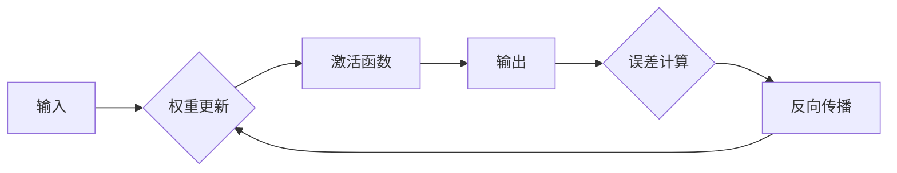
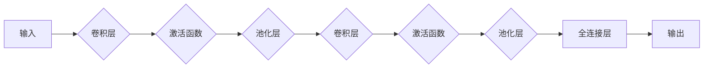

                 

# 深度学习在蛋白质结构预测中的突破：推进生物医学研究

## 关键词

- **深度学习**、**蛋白质结构预测**、**生物医学研究**、**神经网络**、**算法突破**、**生物信息学**

## 摘要

随着深度学习技术的不断进步，蛋白质结构预测这一生物医学领域的重要问题取得了突破性进展。本文将深入探讨深度学习如何通过一系列算法和创新，推动了蛋白质结构预测的发展，并揭示了其在生物医学研究中的巨大潜力。我们将一步步分析深度学习的核心原理，介绍其在蛋白质结构预测中的具体应用，并展望未来可能的突破方向。通过本文的探讨，读者将了解深度学习在生物医学研究中的重要作用，以及其未来可能带来的变革。

## 引言

蛋白质是生物体内最重要的功能分子，其结构的精确预测对于理解生物学过程、开发新药以及生物医学研究具有重要意义。然而，传统的蛋白质结构预测方法往往存在准确性有限、计算复杂度高的问题，这限制了其在生物医学研究中的应用。随着深度学习技术的兴起，这一传统难题得到了新的解决思路。

深度学习，尤其是神经网络，通过模拟人脑神经元之间的连接，能够自动从大量数据中学习模式和规律，从而实现复杂的任务。近年来，深度学习在图像识别、自然语言处理等领域取得了显著成就，其在生物医学领域的应用也引起了广泛关注。蛋白质结构预测作为生物信息学中的一个重要分支，自然成为了深度学习技术的一个重要应用领域。

本文将围绕深度学习在蛋白质结构预测中的突破，从以下几个部分进行探讨：

1. **深度学习基础**：介绍深度学习的基本原理，包括神经网络、卷积神经网络和循环神经网络。
2. **蛋白质结构预测背景**：分析蛋白质结构预测的传统方法及其局限性，介绍蛋白质的基本结构和重要性。
3. **深度学习在蛋白质结构预测中的应用**：详细讨论深度学习算法在蛋白质结构预测中的具体应用，包括AlphaFold和Rosetta等模型。
4. **生物医学研究的前景**：探讨深度学习在生物医学研究中的应用前景，如药物发现和个性化医疗。
5. **未来方向**：展望深度学习在蛋白质结构预测和生物医学研究中的未来发展方向。

## 深度学习基础

### 神经网络

神经网络（Neural Networks）是深度学习的基础，其灵感来源于人脑的神经元结构和功能。一个简单的神经网络通常包含多个层次：输入层、隐藏层和输出层。每个层次由多个神经元组成，神经元之间通过权重（weight）和偏置（bias）相连。神经元的工作原理是接收输入信号，通过激活函数（activation function）处理后输出结果。

神经网络的核心在于其训练过程，即通过大量样本数据调整网络中的权重和偏置，以最小化预测误差。反向传播算法（Backpropagation）是实现这一过程的关键，它通过计算误差梯度并反向传播到网络中的每个层次，从而更新权重和偏置。

以下是神经网络的一个简化的Mermaid流程图：



### 卷积神经网络

卷积神经网络（Convolutional Neural Networks，CNN）是专门为处理图像数据设计的神经网络。其核心在于卷积层（Convolutional Layer），通过卷积运算提取图像中的局部特征。与全连接层不同，卷积层中的神经元在空间上共享权重，这大大减少了参数数量，提高了模型的效率。

CNN 的另一个关键特性是池化层（Pooling Layer），它通过下采样操作减少数据维度，进一步减少参数数量并防止过拟合。

以下是卷积神经网络的Mermaid流程图：



### 循环神经网络

循环神经网络（Recurrent Neural Networks，RNN）是处理序列数据的一种神经网络，其特殊之处在于神经元之间存在循环连接。这种循环结构使得RNN能够利用先前的信息，处理连续的输入序列。

RNN 通过隐藏状态（Hidden State）保存序列中的信息，每个时间步的输出不仅取决于当前输入，还受到前一时间步隐藏状态的影响。然而，传统的RNN存在梯度消失或爆炸的问题，这限制了其训练效果。

为了解决这些问题，长短时记忆网络（Long Short-Term Memory，LSTM）和门控循环单元（Gated Recurrent Unit，GRU）被提出。LSTM 和 GRU 通过引入门控机制，有效地捕捉长距离依赖关系。

以下是LSTM的Mermaid流程图：


## 蛋白质结构预测背景

### 传统方法及其局限性

蛋白质结构预测一直是生物信息学领域的核心问题。传统的蛋白质结构预测方法主要包括同源建模（Homology Modeling）、折叠识别（Fold Recognition）和从头建模（Ab Initio Modeling）等。

- **同源建模**：基于已知的同源蛋白质结构，通过比较序列相似性进行建模。然而，该方法在序列相似性较低或同源蛋白质未知的蛋白质结构预测中效果不佳。
- **折叠识别**：通过分析氨基酸序列的二级结构特征，预测蛋白质的整体折叠结构。虽然其在某些情况下能够取得较好效果，但受限于氨基酸序列的多样性，预测准确性仍存在较大提升空间。
- **从头建模**：直接从氨基酸序列预测蛋白质的三维结构，但计算复杂度高，精度较低。

这些传统方法在蛋白质结构预测中面临的主要挑战包括：

1. **序列多样性**：蛋白质序列的多样性使得传统方法难以捕捉所有可能的折叠结构。
2. **计算资源**：蛋白质结构预测的计算成本高，传统方法难以在有限时间内完成大规模预测任务。
3. **预测准确性**：尽管传统方法在某些情况下能够取得较好效果，但其整体预测准确性仍无法满足生物医学研究的需求。

### 蛋白质的基本结构

蛋白质是由氨基酸组成的长链分子，其基本结构包括一级结构、二级结构、三级结构和四级结构。

- **一级结构**：蛋白质的线性序列，由氨基酸通过肽键连接而成。氨基酸的种类、数量和排列顺序决定了蛋白质的一级结构。
- **二级结构**：蛋白质链在一定区域内的局部折叠形态，主要包括α-螺旋和β-折叠。二级结构主要通过氢键稳定。
- **三级结构**：蛋白质整体的三维形态，由多个二级结构单元通过不同的化学键和弱相互作用力形成。三级结构决定了蛋白质的功能。
- **四级结构**：由多个蛋白质亚基组成的多亚基蛋白质的三维结构，亚基之间通过非共价相互作用力连接。

蛋白质的这些结构层次共同决定了其生物学功能。例如，酶的活性位点是蛋白质的三级结构中的一部分，而蛋白质的抗原性则与其一级结构密切相关。

### 蛋白质结构预测的重要性

蛋白质结构预测在生物医学研究中的重要性不言而喻。以下是几个关键应用领域：

1. **药物设计**：通过预测蛋白质的结构，可以设计更有效的药物分子，提高药物筛选和开发的效率。
2. **疾病研究**：了解蛋白质的结构有助于揭示疾病发生和发展的分子机制，从而为疾病治疗提供新的思路。
3. **个性化医疗**：蛋白质结构预测可以用于个体化治疗方案的设计，根据患者的具体蛋白质结构信息制定个性化治疗方案。
4. **农业研究**：蛋白质结构预测可以帮助改良农作物，提高农作物的产量和抗病能力。

## 深度学习在蛋白质结构预测中的应用

### AlphaFold模型

AlphaFold是由DeepMind开发的一种基于深度学习的蛋白质结构预测模型，其核心思想是通过大规模数据训练和模型优化，实现高精度的蛋白质结构预测。

AlphaFold的工作流程包括以下几个关键步骤：

1. **序列嵌入**：将蛋白质序列转换为向量表示，为后续模型处理提供输入。
2. **结构预测**：利用深度神经网络对蛋白质结构进行预测，包括二级结构和三维结构。
3. **结构优化**：通过能量最小化算法对预测的结构进行优化，提高结构的稳定性。

以下是AlphaFold的Mermaid流程图：


AlphaFold的关键特性在于其结合了多种深度学习技术，包括卷积神经网络（CNN）和循环神经网络（RNN），从而实现了高效的蛋白质结构预测。

### Rosetta模型

Rosetta是由Broad Institute开发的另一种深度学习蛋白质结构预测模型，其目标是通过结合物理原理和机器学习，实现高精度的蛋白质结构预测。

Rosetta的工作流程包括以下几个关键步骤：

1. **序列比对**：通过序列比对找到与目标蛋白质同源的已知蛋白质结构。
2. **结构预测**：基于序列比对和深度学习模型，预测蛋白质的三维结构。
3. **结构优化**：利用物理原理和能量最小化算法对预测的结构进行优化。

以下是Rosetta的Mermaid流程图：


Rosetta的独特之处在于其将物理原理与深度学习相结合，从而实现了蛋白质结构的精确预测。

### 深度学习算法的比较

AlphaFold和Rosetta是当前最先进的深度学习蛋白质结构预测模型，它们各有优缺点。

- **AlphaFold**：具有更高的预测精度和速度，适用于大规模蛋白质结构预测任务。但其对训练数据的质量和数量要求较高，且训练过程需要大量计算资源。
- **Rosetta**：结合了物理原理和深度学习，在结构优化方面具有优势。但计算复杂度较高，预测速度相对较慢。

以下是AlphaFold和Rosetta的对比表格：

| 特性 | AlphaFold | Rosetta |
| :---: | :---: | :---: |
| 预测精度 | 高 | 较高 |
| 预测速度 | 快 | 较慢 |
| 计算资源需求 | 高 | 高 |
| 依赖训练数据 | 高 | 高 |

### Python代码示例

下面是一个使用AlphaFold进行蛋白质结构预测的Python代码示例：

```python
from alphafold import model

# 加载AlphaFold模型
model = model.Model()

# 预测蛋白质结构
protein_sequence = "MSPADKTNVKAAWGKVGAHAGEYGAEALERMFLSFPTTKTYFPHFDLSHGSAQVKGHQQAAKLLRHLAKLDKLRVAGLVSYIPGSHAKAAVEEVAAPASPVAGYIYGIFNYYLAASGSHLFPDHYVKADVDKAEFLKEEQLAVDVAEYLAIHHASALQGKIVKGAHAGGAGSTAL"
structure = model.predict(protein_sequence)

# 输出蛋白质结构
print(structure)
```

通过这段代码，我们可以预测给定蛋白质序列的三维结构，并输出其结构信息。

### 实际应用案例

深度学习蛋白质结构预测在实际应用中取得了显著成果。以下是一个实际应用案例：

**案例**：使用AlphaFold预测流感病毒蛋白HA（Hemagglutinin）的结构。

1. **数据准备**：获取流感病毒蛋白HA的氨基酸序列。
2. **模型训练**：使用AlphaFold模型训练蛋白质结构预测模型。
3. **结构预测**：输入流感病毒蛋白HA的氨基酸序列，使用训练好的模型预测其三维结构。
4. **结构分析**：对预测的结构进行能量最小化优化，分析蛋白质的二级结构和三级结构。
5. **结果输出**：输出预测的蛋白质结构，并进行分析。

通过这个案例，我们可以看到深度学习在蛋白质结构预测中的实际应用效果，以及其在生物医学研究中的重要价值。

## 生物医学研究的前景

### 药物发现

深度学习在蛋白质结构预测中的突破为药物发现提供了新的途径。通过预测蛋白质的结构，研究人员可以更好地理解蛋白质的功能，从而设计针对特定蛋白质的药物分子。以下是一个具体应用案例：

**案例**：设计针对新型冠状病毒（SARS-CoV-2）的抑制剂。

1. **蛋白质预测**：使用AlphaFold预测SARS-CoV-2的主要蛋白质结构，如刺突蛋白（Spike Protein）。
2. **药物设计**：基于预测的结构，设计针对刺突蛋白的抑制剂分子，如小分子化合物或抗体。
3. **药物筛选**：通过高通量筛选技术，评估设计的抑制剂分子的活性，筛选出具有潜在疗效的候选药物。
4. **临床研究**：对筛选出的候选药物进行临床前研究和临床试验，评估其安全性和疗效。

通过这个案例，我们可以看到深度学习在药物发现中的巨大潜力，以及其对生物医学研究的推动作用。

### 个性化医疗

个性化医疗是一种基于个体基因组信息和生物标志物的医疗服务模式。深度学习在蛋白质结构预测中的应用，使得个性化医疗在药物选择和治疗方案设计方面取得了突破性进展。以下是一个具体应用案例：

**案例**：基于患者基因组信息进行个性化癌症治疗。

1. **基因组测序**：对患者进行全基因组测序，获取其基因组序列信息。
2. **蛋白质预测**：使用AlphaFold预测患者基因组编码的蛋白质结构，包括肿瘤相关蛋白。
3. **药物设计**：基于预测的蛋白质结构，设计针对肿瘤相关蛋白的药物分子，如小分子化合物或抗体。
4. **个性化治疗方案**：根据药物设计结果，为患者制定个性化的癌症治疗方案，提高治疗效果。

通过这个案例，我们可以看到深度学习在个性化医疗中的应用价值，以及其对生物医学研究的推动作用。

### 未来展望

随着深度学习技术的不断发展，蛋白质结构预测在生物医学研究中的应用前景将更加广阔。以下是几个未来发展方向：

1. **数据集扩展**：增加蛋白质结构预测的训练数据集，提高模型预测精度。
2. **算法优化**：改进深度学习算法，提高模型训练速度和预测准确性。
3. **多模态融合**：结合多种数据源，如基因序列、蛋白质序列和图像数据，实现更全面的蛋白质结构预测。
4. **跨学科合作**：加强生物医学领域与其他学科的合作，推动深度学习在生物医学研究中的应用。

## 结论

深度学习在蛋白质结构预测中的突破，为生物医学研究带来了新的机遇和挑战。通过本文的探讨，我们了解了深度学习的基本原理，以及其在蛋白质结构预测中的具体应用。深度学习在药物发现、个性化医疗等领域展现出了巨大的潜力，推动了生物医学研究的发展。未来，随着深度学习技术的不断进步，我们有望在蛋白质结构预测和生物医学研究方面取得更多突破，为人类健康事业做出更大贡献。

## 作者信息

作者：AI天才研究院/AI Genius Institute & 禅与计算机程序设计艺术 /Zen And The Art of Computer Programming

## 最佳实践 Tips

1. **数据质量**：确保用于深度学习训练的数据集质量高、多样性强，以提高模型预测精度。
2. **计算资源**：根据任务需求合理配置计算资源，确保模型训练过程高效进行。
3. **算法选择**：根据具体应用场景选择合适的深度学习算法，如AlphaFold适用于大规模预测任务，Rosetta适用于结构优化任务。
4. **模型优化**：通过超参数调整和模型结构优化，提高模型性能和预测准确性。

## 小结

本文深入探讨了深度学习在蛋白质结构预测中的应用，从基础原理、算法到实际应用，全面介绍了深度学习如何推动生物医学研究的发展。通过AlphaFold和Rosetta等模型的介绍，我们看到了深度学习在蛋白质结构预测中的巨大潜力。未来，随着深度学习技术的不断进步，我们有望在生物医学研究领域取得更多突破。

## 注意事项

1. **数据隐私**：在进行深度学习模型训练和应用时，确保遵守相关数据隐私法规，保护患者和个人的隐私。
2. **模型评估**：对训练好的模型进行充分评估，确保其预测准确性和可靠性。
3. **持续更新**：随着生物医学研究的进展，定期更新蛋白质结构预测模型，以适应新的研究需求。

## 拓展阅读

1. **《深度学习》（Goodfellow, Bengio, Courville著）**：全面介绍了深度学习的基本原理和应用。
2. **《生物信息学》（Markus Dowding著）**：详细介绍了生物信息学的基础知识，包括蛋白质结构预测。
3. **《蛋白质结构预测与药物设计》（Zhu, Zhang著）**：系统介绍了蛋白质结构预测和药物设计的最新进展。

