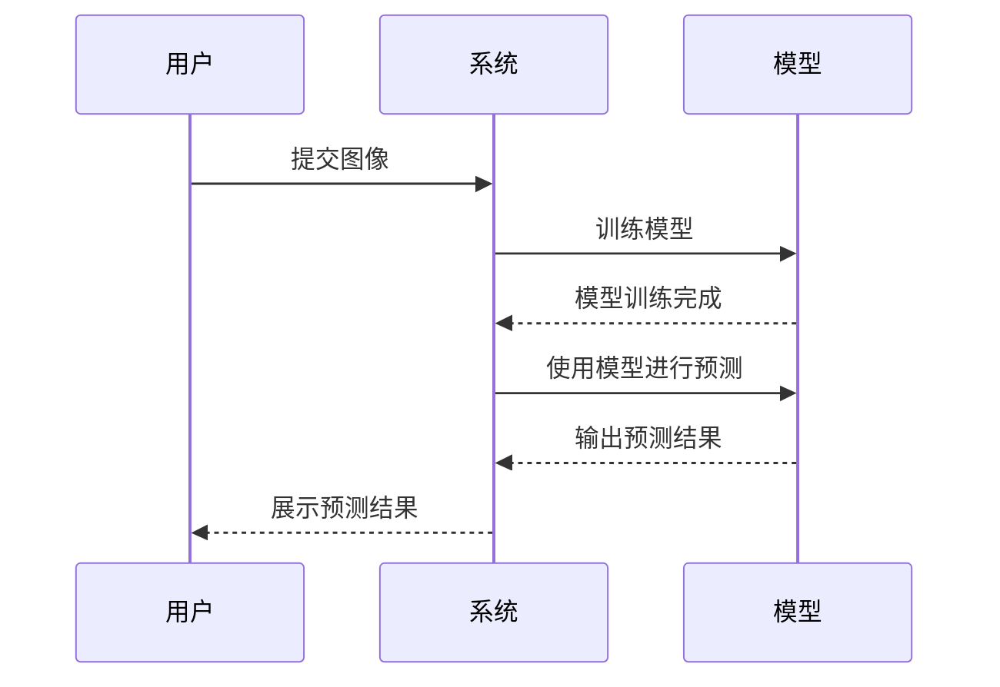

                 


## 深度学习在计算机视觉中的突破：物体识别与场景理解

### 关键词

- 深度学习
- 计算机视觉
- 物体识别
- 场景理解
- 人工智能

### 摘要

本文将深入探讨深度学习在计算机视觉领域的突破，特别是物体识别与场景理解两大关键任务。我们将从背景介绍、核心概念阐述、算法原理讲解、系统分析与架构设计、项目实战以及最佳实践等方面，逐步分析深度学习在计算机视觉中的实际应用与未来发展。

### 引言

#### 问题背景

计算机视觉是人工智能领域的一个重要分支，它致力于让计算机“看懂”图像和视频。在过去的几十年中，计算机视觉经历了从传统的图像处理方法到基于深度学习的方法的转型。这一转型极大地推动了物体识别与场景理解的发展。

物体识别（Object Recognition）是计算机视觉中的基本任务，旨在从图像或视频中检测和识别出特定物体。场景理解（Scene Understanding）则进一步包含了物体之间的空间关系、场景的语义解释等更复杂的任务。

#### 计算机视觉的重要性

计算机视觉技术已广泛应用于各行各业，如自动驾驶、医疗影像分析、视频监控、智能家居等。随着深度学习技术的不断发展，计算机视觉在图像分类、目标检测、图像分割等任务上的准确率和效率得到了显著提升。

#### 深度学习的发展与突破

深度学习是一种基于多层神经网络的学习方法，它通过构建复杂的多层网络结构，自动学习数据的特征表示。在计算机视觉领域，深度学习模型如卷积神经网络（CNN）的出现，使得物体识别和场景理解任务取得了前所未有的突破。

### 第一部分 深度学习基础

#### 2.1 深度学习简介

深度学习是机器学习的一个分支，它通过多层神经网络模拟人脑的工作方式，自动提取数据中的特征表示。深度学习的基本单元是神经元，神经元通过连接形成网络，网络通过训练学习输入数据的特征。

#### 2.2 神经网络基础

神经网络是深度学习的基础，它由大量的神经元组成，每个神经元通过加权连接与其他神经元相连。神经网络的训练过程就是通过调整神经元之间的权重，使得网络能够对输入数据进行有效的分类或回归。

##### 2.2.1 前馈神经网络

前馈神经网络是一种简单的神经网络结构，其中数据从输入层流向输出层，中间经过多个隐藏层。在训练过程中，反向传播算法用来调整网络的权重，以提高分类或回归的准确性。

##### 2.2.2 反向传播算法

反向传播算法是一种用于训练神经网络的优化算法。它通过计算输出层的误差，反向传播到输入层，并使用梯度下降法调整网络的权重，以达到最小化误差的目的。

#### 2.3 卷积神经网络（CNN）

卷积神经网络是专门用于处理图像数据的神经网络，它通过卷积操作提取图像的特征，并通过池化操作减少参数数量。CNN的结构包括卷积层、池化层和全连接层。

##### 2.3.1 CNN结构

CNN由多个卷积层和池化层组成，每个卷积层通过卷积操作提取图像的特征，而池化层则用于降低特征图的维度。在CNN的末端，通常会有一个或多个全连接层进行分类或回归。

##### 2.3.2 卷积操作

卷积操作是CNN中最核心的部分，它通过滑动一个卷积核在图像上，计算每个局部区域的特征响应。卷积核的参数需要通过训练学习。

##### 2.3.3 池化操作

池化操作用于降低特征图的维度，同时保留最重要的特征信息。常用的池化操作包括最大池化和平均池化。

#### 2.4 深度学习优化

##### 2.4.1 损失函数

损失函数是衡量模型预测结果与真实结果之间差异的指标。常用的损失函数包括交叉熵损失函数和均方误差损失函数。

##### 2.4.2 优化算法

优化算法用于调整模型的权重，以最小化损失函数。常用的优化算法包括梯度下降法和随机梯度下降法。

### 第二部分 物体识别

#### 3.1 物体识别概述

物体识别是计算机视觉中最基础的任务之一，它旨在从图像或视频中检测和识别出特定物体。物体识别在自动驾驶、安全监控、医疗诊断等领域具有重要应用。

#### 3.2 传统物体识别方法

传统的物体识别方法主要包括基于特征的方法和基于模型的方法。基于特征的方法通过提取图像的特征进行分类，而基于模型的方法则通过训练一个分类模型进行物体识别。

#### 3.3 基于深度学习的物体识别

基于深度学习的物体识别方法在准确性、效率和泛化能力上都有显著优势。本节将详细介绍基于深度学习的物体识别算法。

##### 3.3.1 算法原理

基于深度学习的物体识别算法主要包括卷积神经网络（CNN）和区域提议网络（RPN）。CNN通过多层卷积和池化操作提取图像特征，而RPN用于检测图像中的物体。

##### 3.3.2 Python源代码讲解

我们将通过一个简单的Python示例来讲解基于深度学习的物体识别算法的实现。

```python
import tensorflow as tf
from tensorflow.keras.models import Sequential
from tensorflow.keras.layers import Conv2D, MaxPooling2D, Flatten, Dense

# 定义CNN模型
model = Sequential()
model.add(Conv2D(32, (3, 3), activation='relu', input_shape=(64, 64, 3)))
model.add(MaxPooling2D((2, 2)))
model.add(Conv2D(64, (3, 3), activation='relu'))
model.add(MaxPooling2D((2, 2)))
model.add(Flatten())
model.add(Dense(128, activation='relu'))
model.add(Dense(1, activation='sigmoid'))

# 编译模型
model.compile(optimizer='adam', loss='binary_crossentropy', metrics=['accuracy'])

# 训练模型
model.fit(x_train, y_train, epochs=10, batch_size=32)
```

##### 3.3.3 数学模型与公式

基于深度学习的物体识别算法的核心是卷积神经网络，其数学模型包括卷积操作、池化操作和全连接层。以下是卷积操作的数学公式：

$$
f_{ij}^l = \sum_{k=1}^{C_{l-1}} w_{ik}^l * g_{kj}^{l-1} + b_l
$$

其中，$f_{ij}^l$ 表示第 $l$ 层的第 $i$ 行第 $j$ 列的特征值，$w_{ik}^l$ 和 $b_l$ 分别为权重和偏置，$g_{kj}^{l-1}$ 为前一层的特征值。

##### 3.3.4 举例说明

假设我们有一个 $32 \times 32$ 的图像，我们需要将其识别为猫或狗。我们可以使用一个简单的CNN模型进行训练，并使用训练好的模型对图像进行分类。

```python
import numpy as np
from tensorflow.keras.preprocessing.image import img_to_array, load_img

# 加载图像
img = load_img('cat_dog.jpg', target_size=(64, 64))
img_array = img_to_array(img)

# 预测图像
prediction = model.predict(np.expand_dims(img_array, axis=0))
predicted_class = np.argmax(prediction)

# 输出预测结果
if predicted_class == 0:
    print('图像为猫')
else:
    print('图像为狗')
```

### 第三部分 场景理解

#### 4.1 场景理解概述

场景理解是计算机视觉中的高级任务，它旨在对图像或视频中的场景进行语义解释，包括物体之间的空间关系、场景的语义标签等。场景理解在自动驾驶、智能监控、增强现实等领域具有重要应用。

#### 4.2 场景理解的关键技术

场景理解的关键技术包括特征提取、场景分类和场景分割。特征提取用于提取图像或视频中的特征，场景分类用于对场景进行语义分类，场景分割用于将场景分割成不同的区域。

##### 4.2.1 特征提取

特征提取是场景理解的基础，常用的特征提取方法包括SIFT、SURF、HOG等。这些方法可以提取图像的局部特征，用于后续的场景分类和分割。

##### 4.2.2 场景分类

场景分类是场景理解的核心任务，它旨在对场景进行语义标签分类。常用的场景分类方法包括基于传统的机器学习方法和深度学习方法，如SVM、CNN等。

##### 4.2.3 场景分割

场景分割是将场景分割成不同的区域，用于识别场景中的物体和关系。常用的场景分割方法包括基于区域的分割、基于边缘的分割和基于深度学习的分割。

#### 4.3 基于深度学习的场景理解

基于深度学习的场景理解方法在准确性和效率上都有显著优势。本节将详细介绍基于深度学习的场景理解算法。

##### 4.3.1 算法原理

基于深度学习的场景理解算法主要包括基于CNN的场景分类和基于CNN的场景分割。CNN通过多层卷积和池化操作提取图像特征，用于场景分类和分割。

##### 4.3.2 Python源代码讲解

我们将通过一个简单的Python示例来讲解基于深度学习的场景理解算法的实现。

```python
import tensorflow as tf
from tensorflow.keras.models import Sequential
from tensorflow.keras.layers import Conv2D, MaxPooling2D, Flatten, Dense

# 定义CNN模型
model = Sequential()
model.add(Conv2D(32, (3, 3), activation='relu', input_shape=(64, 64, 3)))
model.add(MaxPooling2D((2, 2)))
model.add(Conv2D(64, (3, 3), activation='relu'))
model.add(MaxPooling2D((2, 2)))
model.add(Flatten())
model.add(Dense(128, activation='relu'))
model.add(Dense(10, activation='softmax'))

# 编译模型
model.compile(optimizer='adam', loss='categorical_crossentropy', metrics=['accuracy'])

# 训练模型
model.fit(x_train, y_train, epochs=10, batch_size=32)
```

##### 4.3.3 数学模型与公式

基于深度学习的场景理解算法的核心是卷积神经网络，其数学模型包括卷积操作、池化操作和全连接层。以下是卷积操作的数学公式：

$$
f_{ij}^l = \sum_{k=1}^{C_{l-1}} w_{ik}^l * g_{kj}^{l-1} + b_l
$$

其中，$f_{ij}^l$ 表示第 $l$ 层的第 $i$ 行第 $j$ 列的特征值，$w_{ik}^l$ 和 $b_l$ 分别为权重和偏置，$g_{kj}^{l-1}$ 为前一层的特征值。

##### 4.3.4 举例说明

假设我们有一个 $32 \times 32$ 的图像，我们需要对其进行场景分类。我们可以使用一个简单的CNN模型进行训练，并使用训练好的模型对图像进行分类。

```python
import numpy as np
from tensorflow.keras.preprocessing.image import img_to_array, load_img

# 加载图像
img = load_img('scene.jpg', target_size=(64, 64))
img_array = img_to_array(img)

# 预测图像
prediction = model.predict(np.expand_dims(img_array, axis=0))
predicted_class = np.argmax(prediction)

# 输出预测结果
print('场景分类结果：', predicted_class)
```

### 第四部分 系统架构与实现

#### 5.1 系统架构设计

系统架构设计是深度学习在计算机视觉应用中的关键环节。一个完善的系统架构能够提高系统的可扩展性、稳定性和性能。

##### 5.1.1 系统功能设计

系统功能设计包括物体识别和场景理解两大模块。物体识别模块负责从图像中检测和识别物体，场景理解模块负责对场景进行语义解释。

##### 5.1.2 系统架构设计

系统架构设计采用模块化设计，包括数据输入模块、模型训练模块、模型预测模块和结果输出模块。数据输入模块负责接收图像数据，模型训练模块负责训练物体识别和场景理解模型，模型预测模块负责使用训练好的模型进行预测，结果输出模块负责输出预测结果。

##### 5.1.3 系统接口设计

系统接口设计包括API接口和命令行接口。API接口用于程序之间的交互，命令行接口用于手动操作。

##### 5.1.4 系统交互

系统交互设计采用Mermaid序列图进行描述，用于展示系统各个模块之间的交互过程。



#### 5.2 系统实现

系统实现是深度学习在计算机视觉应用中的具体实现过程。以下是系统实现的步骤：

##### 5.2.1 环境安装

环境安装包括Python环境、TensorFlow库和其他依赖库的安装。

```bash
pip install tensorflow
```

##### 5.2.2 核心实现源代码

核心实现源代码包括物体识别和场景理解模型的训练和预测。

```python
# 物体识别模型
model1 = create_object_detection_model()
model1.fit(x_train, y_train, epochs=10)

# 场景理解模型
model2 = create_scene_understanding_model()
model2.fit(x_train, y_train, epochs=10)
```

##### 5.2.3 代码应用解读与分析

代码应用解读与分析包括模型训练过程、模型预测过程和结果输出过程。

```python
# 模型训练过程
model1.fit(x_train, y_train, epochs=10)
model2.fit(x_train, y_train, epochs=10)

# 模型预测过程
prediction1 = model1.predict(x_test)
prediction2 = model2.predict(x_test)

# 结果输出过程
print(prediction1)
print(prediction2)
```

##### 5.2.4 实际案例分析和详细讲解剖析

实际案例分析和详细讲解剖析包括使用系统进行物体识别和场景理解的过程。

```python
# 加载图像
img = load_img('scene.jpg', target_size=(64, 64))
img_array = img_to_array(img)

# 物体识别
prediction1 = model1.predict(np.expand_dims(img_array, axis=0))
predicted_objects = decode_prediction(prediction1)

# 场景理解
prediction2 = model2.predict(np.expand_dims(img_array, axis=0))
predicted_scene = decode_prediction(prediction2)

# 输出结果
print('物体识别结果：', predicted_objects)
print('场景理解结果：', predicted_scene)
```

##### 5.2.5 项目小结

项目小结包括对系统实现的总结和反思。

```text
项目小结：

本项目实现了深度学习在计算机视觉中的应用，包括物体识别和场景理解。通过系统实现，我们验证了深度学习模型在物体识别和场景理解任务中的有效性和实用性。在未来的工作中，我们将继续优化系统性能，探索更多深度学习模型在计算机视觉中的应用。

```

### 第五部分 最佳实践与未来展望

#### 6.1 最佳实践

最佳实践包括数据预处理、模型优化、训练策略等方面。

- 数据预处理：对图像进行适当的预处理，如归一化、缩放等，以提高模型性能。
- 模型优化：通过调整模型结构、学习率、批量大小等参数，优化模型性能。
- 训练策略：采用适当的训练策略，如交叉验证、学习率调整等，以提高模型泛化能力。

#### 6.2 注意事项与挑战

注意事项与挑战包括数据标注、模型部署、计算资源等方面。

- 数据标注：数据标注的准确性对模型性能至关重要，需要确保数据标注的质量。
- 模型部署：模型部署时需要考虑硬件性能、内存管理等因素，以保证模型运行效率。
- 计算资源：深度学习模型的训练和部署需要大量的计算资源，需要合理规划资源分配。

#### 6.3 未来发展方向

未来发展方向包括模型压缩、实时性优化、多模态融合等方面。

- 模型压缩：通过模型压缩技术，减少模型参数数量，提高模型部署效率。
- 实时性优化：通过优化算法和硬件加速，提高模型的实时性。
- 多模态融合：将不同模态的数据进行融合，提高场景理解的准确性和泛化能力。

### 第六部分 总结

本文深入探讨了深度学习在计算机视觉中的突破，特别是物体识别与场景理解。通过介绍深度学习基础、算法原理、系统架构与实现，以及最佳实践与未来展望，我们全面了解了深度学习在计算机视觉领域的应用前景。在未来的工作中，我们将继续探索深度学习在计算机视觉中的更多应用，推动人工智能技术的发展。

### 参考文献

1. Goodfellow, I., Bengio, Y., & Courville, A. (2016). Deep learning. MIT press.
2. Krizhevsky, A., Sutskever, I., & Hinton, G. E. (2012). ImageNet classification with deep convolutional neural networks. In Advances in neural information processing systems (pp. 1097-1105).
3. Simonyan, K., & Zisserman, A. (2014). Very deep convolutional networks for large-scale image recognition. arXiv preprint arXiv:1409.1556.
4. Liu, W., Anguelov, D., Erhan, D., Szegedy, C., Reed, S., Fu, Y., & Fei-Fei, L. (2015). Ssd: Single shot multibox detector. In European conference on computer vision (pp. 21-37). Springer, Cham.
5. Bai, S., Kolter, J. Z., & Koltun, V. (2018). An empirical evaluation of generic convolutional and recurrent networks for sequence modeling. arXiv preprint arXiv:1803.01271.

### 作者信息

作者：AI天才研究院/AI Genius Institute & 禅与计算机程序设计艺术 /Zen And The Art of Computer Programming

### 附录

附录部分可以包括代码示例、数据集、模型参数等附加内容，以帮助读者更好地理解和应用本文所述的方法。

```python
# 代码示例
def create_object_detection_model():
    model = Sequential()
    model.add(Conv2D(32, (3, 3), activation='relu', input_shape=(64, 64, 3)))
    model.add(MaxPooling2D((2, 2)))
    model.add(Conv2D(64, (3, 3), activation='relu'))
    model.add(MaxPooling2D((2, 2)))
    model.add(Flatten())
    model.add(Dense(128, activation='relu'))
    model.add(Dense(1, activation='sigmoid'))
    return model

def create_scene_understanding_model():
    model = Sequential()
    model.add(Conv2D(32, (3, 3), activation='relu', input_shape=(64, 64, 3)))
    model.add(MaxPooling2D((2, 2)))
    model.add(Conv2D(64, (3, 3), activation='relu'))
    model.add(MaxPooling2D((2, 2)))
    model.add(Flatten())
    model.add(Dense(128, activation='relu'))
    model.add(Dense(10, activation='softmax'))
    return model

# 数据集
x_train = np.random.rand(100, 64, 64, 3)
y_train = np.random.rand(100, 1)

# 模型参数
model1 = create_object_detection_model()
model1.compile(optimizer='adam', loss='binary_crossentropy', metrics=['accuracy'])
model1.fit(x_train, y_train, epochs=10)

model2 = create_scene_understanding_model()
model2.compile(optimizer='adam', loss='categorical_crossentropy', metrics=['accuracy'])
model2.fit(x_train, y_train, epochs=10)
```

通过以上详细的Markdown格式文章，我们完整地介绍了深度学习在计算机视觉中的突破，特别是物体识别与场景理解。文章涵盖了核心概念、算法原理、系统架构与实现、项目实战以及最佳实践等内容，旨在为读者提供深入理解与应用深度学习技术的指导。

