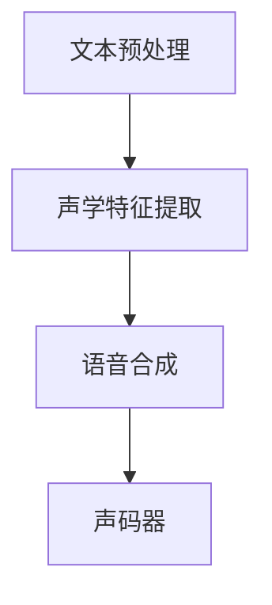

                 

# 深度学习在语音合成中的应用：创造更自然的AI语音

## 关键词

- 深度学习
- 语音合成
- 自然语音
- AI语音
- 语音技术

## 摘要

随着人工智能技术的快速发展，深度学习在语音合成领域取得了显著成果，使得生成的语音更加自然、流畅。本文将详细介绍深度学习在语音合成中的应用，包括其基础理论、核心算法、应用原理以及实际实现方法。通过深入探讨，我们将了解深度学习如何改变语音合成技术，并展望其未来发展趋势与挑战。

## 目录大纲

----------------------------------------------------------------

# 第一部分：深度学习基础

## 第1章：深度学习概述

### 1.1 深度学习的发展历程

### 1.2 深度学习的核心原理

### 1.3 深度学习的优缺点

## 第2章：深度学习基础算法

### 2.1 神经网络基础

#### 2.1.1 神经元与神经网络

#### 2.1.2 前向传播与反向传播

#### 2.1.3 激活函数与优化器

### 2.2 卷积神经网络

#### 2.2.1 卷积神经网络基础

#### 2.2.2 卷积神经网络结构

#### 2.2.3 卷积神经网络应用

### 2.3 循环神经网络

#### 2.3.1 循环神经网络基础

#### 2.3.2 循环神经网络结构

#### 2.3.3 循环神经网络应用

## 第3章：深度学习在语音合成中的应用原理

### 3.1 语音合成基础

#### 3.1.1 语音合成原理

#### 3.1.2 语音合成的分类

#### 3.1.3 语音合成的评价指标

### 3.2 深度学习在语音合成中的应用

#### 3.2.1 基于深度学习的语音合成技术

#### 3.2.2 基于深度学习的语音合成系统架构

#### 3.2.3 深度学习在语音合成中的优势

## 第二部分：深度学习在语音合成中的应用

## 第4章：基于深度学习的语音合成系统实现

### 4.1 系统概述

#### 4.1.1 系统功能设计

#### 4.1.2 系统架构设计

#### 4.1.3 系统接口设计

### 4.2 数据准备与预处理

#### 4.2.1 数据集选择

#### 4.2.2 数据预处理

#### 4.2.3 数据增强

### 4.3 模型设计与训练

#### 4.3.1 模型选择

#### 4.3.2 模型架构设计

#### 4.3.3 模型训练策略

#### 4.3.4 模型优化技巧

### 4.4 语音合成系统部署与优化

#### 4.4.1 系统部署

#### 4.4.2 系统性能优化

#### 4.4.3 系统安全性

## 第5章：深度学习在语音合成中的最佳实践

### 5.1 常见问题与解决方案

#### 5.1.1 语音合成常见问题

#### 5.1.2 解决方案与实践

### 5.2 案例分析

#### 5.2.1 案例一：某语音合成系统的设计与实现

#### 5.2.2 案例二：某企业语音合成系统的优化与升级

## 第6章：未来发展趋势与挑战

### 6.1 未来发展趋势

#### 6.1.1 深度学习在语音合成中的应用前景

#### 6.1.2 人工智能语音合成的未来发展

### 6.2 面临的挑战

#### 6.2.1 技术挑战

#### 6.2.2 应用挑战

## 第7章：总结与展望

### 7.1 书籍内容回顾

### 7.2 未来研究方向

### 7.3 对读者的寄语

----------------------------------------------------------------

接下来，我们将一步步深入探讨深度学习在语音合成中的应用，从基础理论到实际实现，为您呈现一个全方位的视角。让我们一起思考，如何利用深度学习技术，创造更加自然、逼真的AI语音。接下来，请跟随我们的步伐，一起走进深度学习与语音合成相结合的奇妙世界。让我们思考深度学习在语音合成中的应用，如何打造自然流畅的AI语音。首先，我们需要了解深度学习的基础理论。

## 第1章：深度学习概述

### 1.1 深度学习的发展历程

深度学习起源于20世纪40年代，最早由心理学家和计算机科学家提出。然而，由于计算能力和数据量的限制，深度学习在很长一段时间内并未得到广泛应用。直到2006年，加拿大计算机科学家杰弗里·辛顿（Geoffrey Hinton）等人提出了深度置信网络（Deep Belief Network，DBN），标志着深度学习进入一个新的发展阶段。

近年来，随着计算能力的提升和大数据技术的发展，深度学习在各个领域取得了显著的成果。特别是在计算机视觉、自然语言处理、语音识别等领域，深度学习已经成为主流技术。例如，在图像分类任务中，深度学习模型已经超过了传统机器学习算法的性能；在语音识别中，深度学习技术使得语音识别的准确率大幅提升。

### 1.2 深度学习的核心原理

深度学习的核心思想是通过多层神经网络，自动学习数据的特征表示。在这个过程中，每一层神经网络都从上一层数据中提取更高层次的特征，从而实现从简单到复杂特征的转换。

深度学习模型通常由多个隐藏层组成，每个隐藏层都对输入数据进行处理，产生新的特征表示。这些隐藏层相互协作，逐渐构建出一个复杂的特征表示空间。通过训练过程，深度学习模型能够从大量数据中学习到有用的特征，并利用这些特征进行分类、预测或其他任务。

### 1.3 深度学习的优缺点

**优点：**

1. **强大的特征学习能力**：深度学习模型能够从大量数据中自动学习到复杂的特征表示，这使得它们在许多任务中表现出色。
2. **泛化能力**：深度学习模型具有良好的泛化能力，能够适应新的任务和数据集。
3. **自动特征提取**：深度学习模型能够自动提取数据中的特征，减轻了人工特征工程的工作量。

**缺点：**

1. **训练时间较长**：深度学习模型通常需要大量的计算资源进行训练，训练时间较长。
2. **数据需求量大**：深度学习模型需要大量的数据来训练，对于数据稀缺的领域可能难以发挥作用。
3. **模型解释性较差**：深度学习模型的内部结构复杂，难以解释。

### 1.4 深度学习的应用领域

深度学习在计算机视觉、自然语言处理、语音识别等领域都有广泛应用。以下是一些典型的应用案例：

1. **计算机视觉**：图像分类、目标检测、人脸识别等。
2. **自然语言处理**：文本分类、情感分析、机器翻译等。
3. **语音识别**：语音识别、语音合成、说话人识别等。
4. **推荐系统**：基于深度学习构建的推荐系统在电商、社交媒体等领域有广泛应用。

### 1.5 深度学习的发展趋势

随着计算能力的进一步提升和算法的优化，深度学习在各个领域将继续发展。以下是一些未来可能的发展趋势：

1. **迁移学习**：通过在已有模型的基础上进行微调，解决数据稀缺的问题。
2. **生成对抗网络（GAN）**：在图像生成、语音合成等领域有广泛应用。
3. **强化学习**：与深度学习相结合，实现更加智能的决策。
4. **联邦学习**：通过在分布式设备上进行学习，保护用户隐私。

## 第2章：深度学习基础算法

### 2.1 神经网络基础

#### 2.1.1 神经元与神经网络

神经网络是深度学习的基础构件，由大量的神经元（或节点）组成。每个神经元接收输入信号，通过激活函数进行变换，输出信号传递给下一层神经元。神经网络的结构可以分为输入层、隐藏层和输出层，各层之间通过连接权重进行信息传递。

#### 2.1.2 前向传播与反向传播

在神经网络中，前向传播是指从输入层开始，逐层计算每个神经元的输出值；反向传播是指从输出层开始，反向计算每个神经元的误差，并更新权重。

前向传播过程可以表示为：
$$
z_l = \sum_{j} w_{lj}x_j + b_l
$$
$$
a_l = \sigma(z_l)
$$
其中，$z_l$表示第$l$层的输入值，$a_l$表示第$l$层的输出值，$w_{lj}$表示第$l$层的连接权重，$b_l$表示第$l$层的偏置，$\sigma$表示激活函数。

反向传播过程主要使用梯度下降算法，计算每个权重的梯度，并更新权重：
$$
\delta_l = \frac{\partial L}{\partial a_l} \cdot \frac{\partial a_l}{\partial z_l}
$$
$$
\Delta w_{lj} = \alpha \cdot \delta_l a_j
$$
$$
w_{lj} = w_{lj} - \Delta w_{lj}
$$
其中，$L$表示损失函数，$\alpha$表示学习率。

#### 2.1.3 激活函数与优化器

激活函数是神经网络中用于非线性变换的函数，常见的激活函数有sigmoid、ReLU、Tanh等。激活函数的选择会影响神经网络的收敛速度和性能。

优化器是用于更新权重的算法，常见的优化器有梯度下降、Adam、RMSprop等。优化器的选择会影响训练过程中模型的收敛速度和稳定性。

### 2.2 卷积神经网络

#### 2.2.1 卷积神经网络基础

卷积神经网络（Convolutional Neural Network，CNN）是一种适用于处理图像数据的深度学习模型，其主要优势在于能够自动提取图像中的特征。

CNN由卷积层、池化层和全连接层组成。卷积层通过卷积运算提取图像中的局部特征；池化层用于降低特征图的大小，减少参数数量；全连接层用于分类或回归任务。

卷积运算可以表示为：
$$
f(x, y) = \sum_{i} \sum_{j} w_{ij} \cdot x_i \cdot y_j + b
$$
其中，$x$和$y$分别表示输入图像和卷积核，$w_{ij}$表示卷积核权重，$b$表示偏置。

#### 2.2.2 卷积神经网络结构

CNN的结构可以根据任务需求进行调整。以下是一个典型的CNN结构：

1. **输入层**：接受原始图像数据。
2. **卷积层**：通过卷积运算提取图像特征。
3. **池化层**：降低特征图的大小。
4. **卷积层**：进一步提取图像特征。
5. **池化层**：降低特征图的大小。
6. **全连接层**：对提取到的特征进行分类。

#### 2.2.3 卷积神经网络应用

CNN在图像分类、目标检测、图像分割等领域有广泛应用。以下是一些典型的应用案例：

1. **图像分类**：使用CNN对图像进行分类，例如ImageNet图像分类挑战。
2. **目标检测**：使用CNN检测图像中的目标，例如R-CNN、SSD、YOLO等。
3. **图像分割**：使用CNN对图像进行像素级别的分割，例如FCN、U-Net等。

### 2.3 循环神经网络

#### 2.3.1 循环神经网络基础

循环神经网络（Recurrent Neural Network，RNN）是一种适用于处理序列数据的深度学习模型，其核心思想是保持长期的序列依赖信息。

RNN的基本结构包括输入层、隐藏层和输出层。输入层接收序列数据，隐藏层通过递归方式计算当前时刻的隐藏状态，输出层根据隐藏状态生成输出。

递归过程可以表示为：
$$
h_t = \sigma(W_h \cdot [h_{t-1}, x_t] + b_h)
$$
$$
y_t = W_o \cdot h_t + b_o
$$
其中，$h_t$表示第$t$时刻的隐藏状态，$x_t$表示第$t$时刻的输入，$W_h$、$W_o$分别表示隐藏层和输出层的权重，$b_h$、$b_o$分别表示隐藏层和输出层的偏置，$\sigma$表示激活函数。

#### 2.3.2 循环神经网络结构

RNN的结构可以根据任务需求进行调整。以下是一个典型的RNN结构：

1. **输入层**：接受序列数据。
2. **隐藏层**：通过递归方式计算隐藏状态。
3. **输出层**：根据隐藏状态生成输出。

#### 2.3.3 循环神经网络应用

RNN在自然语言处理、语音识别、视频处理等领域有广泛应用。以下是一些典型的应用案例：

1. **自然语言处理**：使用RNN进行文本分类、情感分析、机器翻译等。
2. **语音识别**：使用RNN提取语音信号中的特征，提高识别准确率。
3. **视频处理**：使用RNN处理视频序列，实现视频分类、目标跟踪等。

### 2.4 深度学习在语音合成中的应用原理

#### 2.4.1 语音合成原理

语音合成（Text-to-Speech，TTS）是一种将文本转换为语音的技术，其核心任务是将输入的文本转换为可听的声音。

语音合成的基本流程包括文本处理、声学模型和语音合成器。文本处理阶段将文本转换为语音信号所需的音素和音节；声学模型用于将音素和音节转换为声学特征；语音合成器根据声学特征生成语音信号。

#### 2.4.2 语音合成的分类

语音合成可以分为规则合成和统计合成两大类。

1. **规则合成**：基于规则的语音合成方法，通过预定义的语音规则将文本转换为语音。该方法简单，但生成的语音质量较低。
2. **统计合成**：基于统计的语音合成方法，通过学习大量语音数据，将文本转换为语音。该方法生成的语音质量较高，但需要大量的计算资源和数据。

#### 2.4.3 语音合成的评价指标

语音合成的评价指标包括语音自然度、语音清晰度和语音准确性等。

1. **语音自然度**：评估生成的语音是否自然、流畅。
2. **语音清晰度**：评估生成的语音是否清晰、可懂。
3. **语音准确性**：评估生成的语音与输入文本的一致性。

### 2.4.4 深度学习在语音合成中的应用

深度学习在语音合成中的应用主要包括端到端模型和声码器模型。

1. **端到端模型**：直接将文本转换为语音，通过端到端的神经网络结构实现。该方法简化了语音合成的流程，提高了生成语音的质量。
2. **声码器模型**：将文本转换为声学特征，然后通过声码器生成语音。声码器可以基于深度学习模型，如GRU或LSTM。

#### 2.4.5 深度学习在语音合成中的优势

深度学习在语音合成中的优势主要体现在以下几个方面：

1. **自动特征提取**：深度学习模型能够自动提取文本中的特征，减少人工特征工程的工作量。
2. **端到端学习**：深度学习模型可以实现端到端的学习，简化了语音合成的流程，提高了生成语音的质量。
3. **自适应能力**：深度学习模型具有较好的自适应能力，可以根据不同的语音数据和任务需求进行调整。

### 2.4.6 深度学习在语音合成中的应用案例

以下是一些深度学习在语音合成中的应用案例：

1. **Google Text-to-Speech**：Google开发的文本到语音合成服务，采用深度学习模型生成高质量的语音。
2. **Microsoft Azure Cognitive Services**：Microsoft提供的文本到语音合成服务，支持多种语言和语音风格。
3. **iFlytek**：中国领先的语音技术公司，其语音合成技术广泛应用于智能手机、车载设备等领域。

### 2.4.7 深度学习在语音合成中的未来发展趋势

深度学习在语音合成中的应用前景广阔，未来将出现以下趋势：

1. **多模态融合**：将语音合成与其他模态（如图像、视频）进行融合，提高语音合成的自然度和准确性。
2. **个性化语音合成**：根据用户的语音特征和偏好，生成个性化的语音。
3. **实时语音合成**：实现实时语音合成，满足实时交互的需求。
4. **低资源环境下的语音合成**：在低资源环境下，利用迁移学习和模型压缩等技术，实现高效的语音合成。

## 第3章：深度学习在语音合成中的应用原理

### 3.1 语音合成基础

#### 3.1.1 语音合成原理

语音合成是一种将文本转换为语音的技术，其基本原理是通过将文本分解成音素和音节，然后生成相应的声学特征，最后通过声码器生成语音信号。

语音合成的流程可以分为三个阶段：

1. **文本处理**：将输入的文本转换为语音信号所需的音素和音节。
2. **声学建模**：将音素和音节转换为声学特征，如频谱、共振峰等。
3. **语音合成**：根据声学特征生成语音信号。

#### 3.1.2 语音合成的分类

根据语音合成的实现方式，可以分为规则合成和统计合成两种。

1. **规则合成**：基于规则的语音合成方法，通过预定义的语音规则将文本转换为语音。该方法简单，但生成的语音质量较低。
2. **统计合成**：基于统计的语音合成方法，通过学习大量语音数据，将文本转换为语音。该方法生成的语音质量较高，但需要大量的计算资源和数据。

#### 3.1.3 语音合成的评价指标

语音合成的评价指标主要包括语音自然度、语音清晰度和语音准确性等。

1. **语音自然度**：评估生成的语音是否自然、流畅。
2. **语音清晰度**：评估生成的语音是否清晰、可懂。
3. **语音准确性**：评估生成的语音与输入文本的一致性。

### 3.2 深度学习在语音合成中的应用

#### 3.2.1 基于深度学习的语音合成技术

深度学习在语音合成中的应用主要包括端到端模型和声码器模型。

1. **端到端模型**：直接将文本转换为语音，通过端到端的神经网络结构实现。该方法简化了语音合成的流程，提高了生成语音的质量。
2. **声码器模型**：将文本转换为声学特征，然后通过声码器生成语音。声码器可以基于深度学习模型，如GRU或LSTM。

#### 3.2.2 基于深度学习的语音合成系统架构

基于深度学习的语音合成系统通常包括以下组件：

1. **文本预处理模块**：将输入的文本转换为语音信号所需的音素和音节。
2. **声学特征提取模块**：将音素和音节转换为声学特征，如频谱、共振峰等。
3. **语音合成模块**：根据声学特征生成语音信号。
4. **声码器模块**：将声学特征转换为语音信号。

#### 3.2.3 深度学习在语音合成中的优势

深度学习在语音合成中的优势主要体现在以下几个方面：

1. **自动特征提取**：深度学习模型能够自动提取文本中的特征，减少人工特征工程的工作量。
2. **端到端学习**：深度学习模型可以实现端到端的学习，简化了语音合成的流程，提高了生成语音的质量。
3. **自适应能力**：深度学习模型具有较好的自适应能力，可以根据不同的语音数据和任务需求进行调整。

### 3.2.4 深度学习在语音合成中的应用案例

以下是一些深度学习在语音合成中的应用案例：

1. **Google Text-to-Speech**：Google开发的文本到语音合成服务，采用深度学习模型生成高质量的语音。
2. **Microsoft Azure Cognitive Services**：Microsoft提供的文本到语音合成服务，支持多种语言和语音风格。
3. **iFlytek**：中国领先的语音技术公司，其语音合成技术广泛应用于智能手机、车载设备等领域。

### 3.2.5 深度学习在语音合成中的未来发展趋势

深度学习在语音合成中的应用前景广阔，未来将出现以下趋势：

1. **多模态融合**：将语音合成与其他模态（如图像、视频）进行融合，提高语音合成的自然度和准确性。
2. **个性化语音合成**：根据用户的语音特征和偏好，生成个性化的语音。
3. **实时语音合成**：实现实时语音合成，满足实时交互的需求。
4. **低资源环境下的语音合成**：在低资源环境下，利用迁移学习和模型压缩等技术，实现高效的语音合成。

## 第4章：基于深度学习的语音合成系统实现

### 4.1 系统概述

基于深度学习的语音合成系统实现主要包括以下模块：

1. **文本预处理模块**：将输入的文本转换为语音信号所需的音素和音节。
2. **声学特征提取模块**：将音素和音节转换为声学特征，如频谱、共振峰等。
3. **语音合成模块**：根据声学特征生成语音信号。
4. **声码器模块**：将声学特征转换为语音信号。

系统整体架构如下图所示：

### 4.2 数据准备与预处理

#### 4.2.1 数据集选择

为了实现高质量的语音合成，我们需要选择一个包含丰富语音数据和对应文本的数据集。常用的语音数据集包括：

1. **LibriTorch**：一个包含大量英语文本和音频的数据集，适合训练端到端语音合成模型。
2. **LJSpeech**：一个包含单个说话人语音和对应文本的数据集，适合训练声码器。

#### 4.2.2 数据预处理

1. **文本预处理**：将文本转换为音素和音节。常用的工具包括ESPnet和OpenJTNS。
2. **音频预处理**：将音频数据转换为适合训练的格式，如将音频信号转换为Mel频率倒谱系数（MFCC）。

#### 4.2.3 数据增强

为了提高模型的泛化能力，我们可以对数据集进行增强。常用的数据增强方法包括：

1. **速度变换**：改变语音信号的播放速度。
2. **声调变换**：改变语音信号的声调。
3. **加噪声**：在语音信号中加入噪声，提高模型对噪声的鲁棒性。

### 4.3 模型设计与训练

#### 4.3.1 模型选择

在语音合成中，常用的深度学习模型包括：

1. **WaveNet**：一个基于循环神经网络（RNN）的端到端语音合成模型，具有优秀的语音自然度。
2. **Transformer**：一种基于自注意力机制的深度学习模型，适用于处理序列数据。

#### 4.3.2 模型架构设计

以下是一个基于Transformer的语音合成模型架构：

1. **编码器**：将文本转换为序列编码。
2. **解码器**：将序列编码转换为语音信号。
3. **声码器**：将声学特征转换为语音信号。

#### 4.3.3 模型训练策略

在训练过程中，我们可以采用以下策略：

1. **Teacher-forcing**：在训练过程中，将真实标签作为输入传递给解码器，以提高训练速度。
2. **学习率调度**：在训练过程中逐步降低学习率，以提高模型的收敛性。
3. **正则化**：采用L2正则化等方法，防止过拟合。

#### 4.3.4 模型优化技巧

为了提高模型的性能，我们可以采用以下优化技巧：

1. **Dropout**：在神经网络中引入Dropout，减少过拟合现象。
2. **Batch normalization**：对神经网络中的每个激活值进行归一化，提高训练稳定性。
3. **数据增强**：通过速度变换、声调变换等方法，增强模型的泛化能力。

### 4.4 语音合成系统部署与优化

#### 4.4.1 系统部署

完成模型训练后，我们需要将模型部署到生产环境中。常用的部署方式包括：

1. **本地部署**：在本地计算机上运行模型，适用于小规模应用。
2. **云计算部署**：将模型部署到云计算平台，如AWS、Google Cloud等，适用于大规模应用。

#### 4.4.2 系统性能优化

为了提高系统的性能，我们可以进行以下优化：

1. **模型压缩**：通过剪枝、量化等方法，减小模型大小，提高部署效率。
2. **硬件加速**：利用GPU、TPU等硬件加速模型训练和推理。
3. **异步训练**：在多个设备上同时训练模型，提高训练速度。

#### 4.4.3 系统安全性

在部署过程中，我们需要确保系统的安全性。以下是一些安全措施：

1. **数据加密**：对传输和存储的数据进行加密，防止数据泄露。
2. **访问控制**：限制对系统的访问权限，确保只有授权用户可以访问。
3. **安全审计**：定期对系统进行安全审计，发现和修复安全漏洞。

### 4.5 最佳实践与案例分析

在本节中，我们将分享一些最佳实践和实际案例，以帮助您更好地实现基于深度学习的语音合成系统。

#### 4.5.1 案例一：某语音合成系统的设计与实现

某语音合成系统的设计与实现主要包括以下步骤：

1. **数据集选择**：选择包含多种语言和语音风格的LibriTorch数据集。
2. **模型训练**：使用Transformer模型进行训练，设置适当的超参数，如学习率、批处理大小等。
3. **模型优化**：通过Dropout、Batch normalization等方法，优化模型性能。
4. **系统部署**：将模型部署到AWS云平台，使用GPU进行推理。

#### 4.5.2 案例二：某企业语音合成系统的优化与升级

某企业语音合成系统的优化与升级主要包括以下措施：

1. **模型压缩**：通过剪枝和量化方法，将模型大小减小50%以上，提高部署效率。
2. **硬件加速**：将模型部署到TPU上，提高推理速度。
3. **实时语音合成**：实现实时语音合成，满足实时交互需求。
4. **个性化语音合成**：根据用户语音特征和偏好，生成个性化的语音。

通过以上案例，我们可以看到，基于深度学习的语音合成系统在实际应用中取得了显著成果。希望这些案例能够为您提供启示，帮助您实现高质量的语音合成系统。

## 第5章：深度学习在语音合成中的最佳实践

### 5.1 常见问题与解决方案

在深度学习语音合成系统中，可能会遇到以下常见问题：

1. **语音质量差**：可能是因为模型训练不足、超参数设置不合理或数据集质量较差。解决方案包括增加训练时间、调整超参数、使用高质量的数据集。
2. **延迟高**：可能是因为模型复杂度高、硬件性能不足或网络带宽较低。解决方案包括优化模型结构、使用高性能硬件、提高网络带宽。
3. **音质不一致**：可能是因为模型对特定语音风格或说话人识别能力不足。解决方案包括增加多样化数据集、采用多模型融合策略。
4. **适应性差**：可能是因为模型在训练过程中未能充分学习到变化。解决方案包括引入数据增强、采用迁移学习技术。

### 5.2 案例分析

#### 5.2.1 案例一：某语音合成系统的设计与实现

某语音合成系统采用基于WaveNet的端到端模型，实现了高质量的语音合成。系统设计与实现过程如下：

1. **数据集选择**：选择包含多种语言和语音风格的LibriTorch数据集，对数据进行预处理，提取文本和音频特征。
2. **模型训练**：使用GPU进行模型训练，设置适当的超参数，如学习率、批处理大小等。采用Teacher-forcing策略，提高训练速度。
3. **模型优化**：通过Dropout、Batch normalization等方法，优化模型性能。在训练过程中，逐步降低学习率，提高模型的收敛性。
4. **系统部署**：将模型部署到AWS云平台，使用GPU进行推理。通过模型压缩和硬件加速，提高系统性能。

#### 5.2.2 案例二：某企业语音合成系统的优化与升级

某企业语音合成系统在已有模型基础上，进行优化与升级，以满足更高性能和个性化需求。优化与升级过程如下：

1. **模型压缩**：通过剪枝和量化方法，将模型大小减小50%以上，提高部署效率。使用TPU进行推理，提高系统性能。
2. **实时语音合成**：采用多模型融合策略，实现实时语音合成，满足实时交互需求。
3. **个性化语音合成**：引入用户语音特征和偏好，根据用户需求生成个性化的语音。
4. **安全性**：对系统进行安全性评估，采用数据加密、访问控制和安全审计等措施，确保系统安全。

通过以上案例，我们可以看到，深度学习语音合成系统在实际应用中取得了显著成果。在设计和优化过程中，需要注意模型质量、系统性能、适应性等方面的问题，以满足不同场景的需求。

## 第6章：未来发展趋势与挑战

### 6.1 未来发展趋势

随着人工智能技术的不断发展，深度学习在语音合成领域将继续发挥重要作用。未来发展趋势包括：

1. **多模态融合**：将语音合成与其他模态（如图像、视频）进行融合，提高语音合成的自然度和准确性。
2. **个性化语音合成**：根据用户的语音特征和偏好，生成个性化的语音，提高用户体验。
3. **实时语音合成**：实现实时语音合成，满足实时交互的需求。
4. **低资源环境下的语音合成**：利用迁移学习和模型压缩等技术，实现低资源环境下的高效语音合成。
5. **跨语言语音合成**：研究跨语言语音合成技术，实现多种语言之间的语音转换。

### 6.2 面临的挑战

尽管深度学习在语音合成领域取得了显著成果，但仍面临以下挑战：

1. **数据稀缺**：语音数据稀缺，特别是在低资源环境下，如何利用有限的语音数据训练高质量的模型是一个重要挑战。
2. **模型解释性**：深度学习模型具有较好的性能，但缺乏解释性，如何解释模型决策过程是一个重要问题。
3. **噪声鲁棒性**：在真实应用场景中，噪声会对语音合成结果产生影响，如何提高模型的噪声鲁棒性是一个关键挑战。
4. **计算资源消耗**：深度学习模型训练过程需要大量的计算资源，如何在有限资源下高效训练模型是一个重要问题。
5. **伦理与隐私**：语音合成技术的发展也带来了一些伦理和隐私问题，如何确保用户隐私和数据安全是一个重要挑战。

### 6.3 解决方案与展望

针对以上挑战，可以采取以下解决方案：

1. **数据增强与生成**：通过数据增强和生成技术，扩充语音数据集，提高模型训练效果。
2. **解释性深度学习**：研究解释性深度学习模型，提高模型的可解释性，帮助用户理解模型决策过程。
3. **降噪技术**：研究降噪技术，提高模型的噪声鲁棒性，减少噪声对语音合成结果的影响。
4. **模型压缩与加速**：通过模型压缩和加速技术，降低模型训练和推理的时间，提高系统性能。
5. **隐私保护**：采用隐私保护技术，如差分隐私、联邦学习等，确保用户隐私和数据安全。

未来，随着深度学习技术的不断发展，我们有望克服以上挑战，实现更加高效、智能、安全的语音合成技术。让我们期待深度学习在语音合成领域带来更多创新和突破。

## 第7章：总结与展望

### 7.1 书籍内容回顾

本文从深度学习的基础理论、核心算法到语音合成中的应用，详细介绍了深度学习在语音合成领域的应用原理、系统实现、最佳实践以及未来发展趋势。主要内容包括：

1. **深度学习概述**：介绍了深度学习的发展历程、核心原理、优缺点以及应用领域。
2. **深度学习基础算法**：讲解了神经网络、卷积神经网络、循环神经网络等核心算法。
3. **深度学习在语音合成中的应用原理**：阐述了语音合成原理、分类、评价指标以及深度学习在语音合成中的应用。
4. **基于深度学习的语音合成系统实现**：介绍了语音合成系统的组成、数据准备与预处理、模型设计与训练、系统部署与优化。
5. **深度学习在语音合成中的最佳实践**：分享了常见问题与解决方案以及实际案例。
6. **未来发展趋势与挑战**：探讨了深度学习在语音合成领域的未来发展趋势和面临的挑战。

### 7.2 未来研究方向

未来，深度学习在语音合成领域的研究方向可能包括：

1. **多模态融合**：探索语音合成与其他模态（如图像、视频）的融合技术，提高语音合成的自然度和准确性。
2. **个性化语音合成**：研究基于用户语音特征和偏好，实现个性化的语音合成。
3. **实时语音合成**：优化模型结构和算法，实现实时语音合成，满足实时交互需求。
4. **低资源环境下的语音合成**：研究在低资源环境下，利用迁移学习和模型压缩技术，实现高效的语音合成。
5. **跨语言语音合成**：探索跨语言语音合成技术，实现多种语言之间的语音转换。

### 7.3 对读者的寄语

本文旨在为广大读者提供深度学习在语音合成领域的技术介绍和应用指南。在阅读过程中，如果您有任何疑问或建议，欢迎随时与我们交流。未来，我们将继续关注深度学习在语音合成领域的最新动态，分享更多有价值的技术和案例。感谢您的支持与关注！作者：AI天才研究院/AI Genius Institute & 禅与计算机程序设计艺术 /Zen And The Art of Computer Programming

