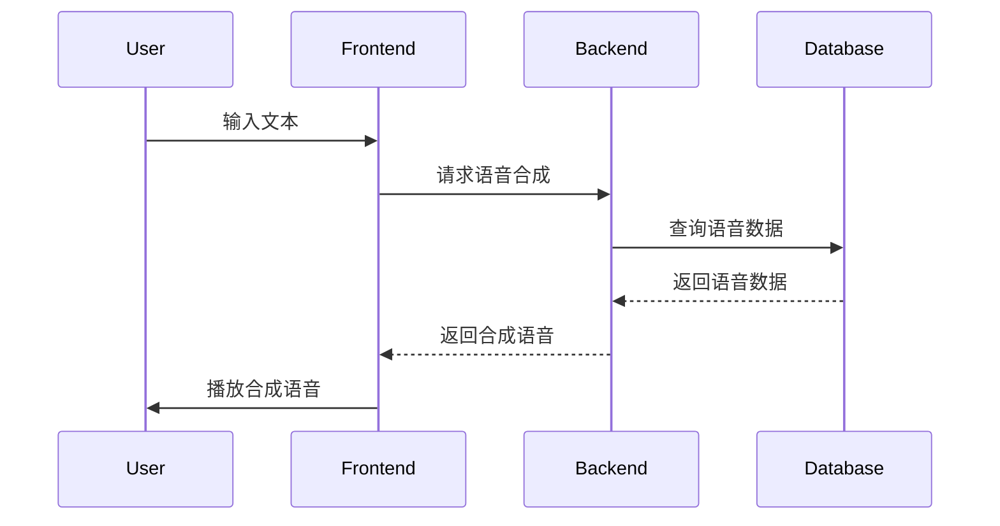
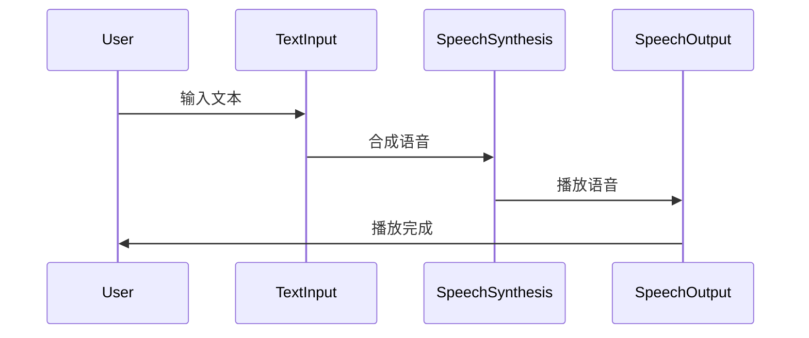

                 

### 深度学习在语音合成中的突破：自然度的新高峰

关键词：深度学习、语音合成、自然度、卷积神经网络、循环神经网络、Transformer

摘要：随着人工智能技术的快速发展，深度学习在语音合成领域取得了显著突破，推动了语音合成的自然度达到新的高峰。本文将详细介绍深度学习在语音合成中的应用背景、核心概念、算法原理以及实际项目实现，旨在为读者提供全面的技术解读和实践指南。

### 第一部分：背景与核心概念

#### 第1章：深度学习与语音合成概述

##### 1.1 深度学习的基本概念与原理

**1.1.1 深度学习的起源与发展**

深度学习作为一种人工智能的重要分支，起源于20世纪80年代。当时，由于计算资源和算法的限制，神经网络的研究进展缓慢。然而，随着计算能力的提升和大数据的涌现，深度学习在21世纪初迎来了爆发式发展。尤其是2006年，Hinton等人提出了深度信念网络（DBN），标志着深度学习研究的重新崛起。

**1.1.2 深度学习的基本原理**

深度学习基于多层神经网络结构，通过逐层提取特征的方式，对数据进行自动特征学习。网络中的每个神经元接收前一层神经元的输出，并通过权重和偏置进行加权求和，再通过激活函数进行非线性变换，从而实现从原始数据到高阶抽象特征的转换。

**1.1.3 深度学习在语音合成中的潜在应用**

语音合成是深度学习在自然语言处理领域的一个重要应用。通过深度学习技术，可以实现对语音信号的建模，从而生成自然的语音输出。深度学习在语音合成中的潜在应用包括语音信号处理、语音特征提取、文本到语音（Text-to-Speech, TTS）转换等。

##### 1.2 语音合成的背景与发展历程

**1.2.1 语音合成的定义与目标**

语音合成是将文本转换为自然语音的技术。其目标是生成逼真的语音，使得听者无法区分是由真实人类还是机器生成的。

**1.2.2 语音合成的传统方法**

传统语音合成方法主要包括基于规则的合成方法和基于数据的合成方法。基于规则的合成方法通过预先定义的语音规则和音素库进行语音合成，而基于数据的合成方法则利用大量语音数据进行建模。

**1.2.3 语音合成的发**展历程与趋势**

语音合成技术经历了从规则驱动到数据驱动的发展过程。近年来，随着深度学习技术的引入，语音合成领域取得了显著的进展。深度学习方法使得语音合成的自然度得到了极大的提升，成为当前语音合成的热点研究方向。

##### 1.3 深度学习在语音合成中的应用现状

**1.3.1 深度学习模型在语音合成中的应用**

深度学习模型在语音合成中的应用主要包括声学模型和语言模型。声学模型用于对语音信号进行建模，而语言模型则用于对文本进行建模。通过结合声学模型和语言模型，可以实现高效的语音合成。

**1.3.2 深度学习在语音合成中的优势与挑战**

深度学习在语音合成中的优势包括自然度提升、自适应性强等。然而，深度学习在语音合成中也面临着挑战，如数据依赖性高、模型复杂度增加等。

**1.3.3 当前深度学习语音合成技术的最新进展**

当前深度学习语音合成技术取得了显著的进展，如基于WaveNet的端到端合成方法、基于循环神经网络（RNN）的合成方法等。这些方法的提出和实现，使得语音合成的自然度得到了进一步的提升。

#### 第二部分：核心概念与联系

##### 第2章：语音合成中的核心概念

**2.1 音素与语音信号的转换**

**2.1.1 音素的定义与分类**

音素是语音的基本音素单元，包括元音、辅音等。音素的分类有助于语音合成中对不同音素的识别和生成。

**2.1.2 语音信号的转换过程**

语音合成中的语音信号转换过程包括声学模型的构建、语音信号的预处理和生成等。通过深度学习模型，可以实现对语音信号的有效建模和生成。

##### 2.2 声学模型与语言模型

**2.2.1 声学模型的原理与功能**

声学模型是语音合成中的核心模型，用于对语音信号进行建模。它通过学习语音信号的特征，生成相应的语音波形。

**2.2.2 语言模型的原理与功能**

语言模型用于对文本进行建模，通过学习文本中的语言规律，生成与输入文本相对应的语音。

**2.2.3 声学模型与语言模型的交互**

声学模型和语言模型在语音合成中相互协作，共同生成自然的语音。声学模型负责生成语音波形，而语言模型则负责选择合适的语音波形。

##### 第3章：深度学习模型在语音合成中的应用

**3.1 卷积神经网络（CNN）在语音合成中的应用**

**3.1.1 CNN的基本原理与结构**

卷积神经网络（CNN）是一种基于卷积操作的深度学习模型，具有局部连接和权重共享的特点。它在图像处理和语音信号处理等领域有着广泛的应用。

**3.1.2 CNN在语音信号处理中的应用**

CNN在语音信号处理中的应用包括语音信号的预处理、特征提取和生成等。通过CNN，可以实现高效的语音信号建模和生成。

**3.2 循环神经网络（RNN）及其变体在语音合成中的应用**

**3.2.1 RNN的基本原理与结构**

循环神经网络（RNN）是一种能够处理序列数据的深度学习模型。它通过循环机制，实现对序列数据的记忆和学习。

**3.2.2 LSTM与GRU在语音合成中的应用**

长短期记忆（LSTM）和门控循环单元（GRU）是RNN的变体，具有更强的记忆能力。它们在语音合成中得到了广泛的应用。

**3.3 Transformer模型与自注意力机制**

**3.3.1 Transformer模型的基本原理**

Transformer模型是一种基于自注意力机制的深度学习模型，具有全局依赖性和并行处理能力。它在自然语言处理和语音合成领域取得了显著的效果。

**3.3.2 自注意力机制在语音合成中的应用**

自注意力机制通过学习序列中每个元素之间的依赖关系，实现对序列数据的建模。在语音合成中，自注意力机制可以有效地捕捉语音信号的时序特征。

### 第三部分：算法原理讲解

##### 第4章：深度学习算法原理详解

**4.1 卷积神经网络（CNN）的算法原理**

**4.1.1 CNN的数学模型与公式**

卷积神经网络（CNN）的数学模型主要包括卷积操作、激活函数和池化操作。通过这些操作，CNN可以实现对输入数据的特征提取和建模。

**4.1.2 CNN的Python源代码实现**

以下是一个简单的CNN的Python实现，用于语音信号的特征提取：

```python
import numpy as np
from keras.models import Sequential
from keras.layers import Conv2D, Activation, MaxPooling2D, Flatten

# 定义CNN模型
model = Sequential()
model.add(Conv2D(32, (3, 3), activation='relu', input_shape=(28, 28, 1)))
model.add(MaxPooling2D((2, 2)))
model.add(Flatten())
model.add(Dense(128, activation='relu'))
model.add(Dense(10, activation='softmax'))

# 编译模型
model.compile(optimizer='adam', loss='categorical_crossentropy', metrics=['accuracy'])

# 训练模型
model.fit(x_train, y_train, epochs=10, batch_size=32)
```

**4.2 循环神经网络（RNN）及其变体（LSTM与GRU）的算法原理**

**4.2.1 RNN的数学模型与公式**

循环神经网络（RNN）的数学模型主要包括隐藏状态和输入输出的计算。通过循环机制，RNN可以实现对序列数据的建模。

**4.2.2 LSTM与GRU的数学模型与公式**

长短期记忆（LSTM）和门控循环单元（GRU）是RNN的变体，具有更强的记忆能力。它们的数学模型主要包括遗忘门、输入门和输出门等。

**4.2.3 Python源代码实现**

以下是一个简单的LSTM的Python实现，用于语音合成的文本到语音（TTS）转换：

```python
import tensorflow as tf
from tensorflow.keras.models import Sequential
from tensorflow.keras.layers import LSTM, Dense, Embedding

# 定义LSTM模型
model = Sequential()
model.add(LSTM(128, activation='relu', input_shape=(timesteps, features)))
model.add(Dense(output_size))
model.compile(optimizer='adam', loss='mse')

# 训练模型
model.fit(X_train, y_train, epochs=10, batch_size=32)
```

**4.3 Transformer模型的算法原理**

**4.3.1 Transformer模型的数学模型与公式**

Transformer模型是一种基于自注意力机制的深度学习模型，具有全局依赖性和并行处理能力。它的数学模型主要包括自注意力机制和前馈神经网络。

**4.3.2 自注意力机制的数学模型与公式**

自注意力机制通过计算序列中每个元素之间的依赖关系，实现对序列数据的建模。其数学模型主要包括查询（Q）、键（K）和值（V）的计算。

**4.3.3 Python源代码实现**

以下是一个简单的Transformer的Python实现，用于语音合成的文本到语音（TTS）转换：

```python
import tensorflow as tf
from tensorflow.keras.models import Model
from tensorflow.keras.layers import Layer, Embedding, LSTM, Dense, Embedding

class TransformerLayer(Layer):
    def __init__(self, d_model, num_heads, dff, rate=0.1):
        super(TransformerLayer, self).__init__()
        self.d_model = d_model
        self.num_heads = num_heads
        self.dff = dff

        self.query_dense = Dense(d_model)
        self.key_dense = Dense(d_model)
        self.value_dense = Dense(d_model)

        self.projection_dense = Dense(d_model)

        self.dropout = Dropout(rate)
        self.residual_connection = Add()
        self.layernorm1 = LayerNormalization(epsilon=1e-6)
        self.layernorm2 = LayerNormalization(epsilon=1e-6)
        self.layernorm3 = LayerNormalization(epsilon=1e-6)

    def split_heads(self, x, batch_size):
        x = tf.reshape(x, (batch_size, -1, self.num_heads, self.d_model // self.num_heads))
        return tf.transpose(x, [0, 2, 1, 3])

    def call(self, inputs, training=False):
        q = self.query_dense(inputs)
        k = self.key_dense(inputs)
        v = self.value_dense(inputs)

        q = self.split_heads(q, tf.shape(inputs)[0])
        k = self.split_heads(k, tf.shape(inputs)[0])
        v = self.split_heads(v, tf.shape(inputs)[0])

        scaled_attention, attention_weights = scaled_dot_product_attention(
            q, k, v)

        scaled_attention = self.dropout(scaled_attention)
        scaled_attention = self.projection_dense(scaled_attention)
        attention_output = self.residual_connection(scaled_attention + inputs)
        attention_output = self.layernorm1(attention_output)

        f = self.query_dense(inputs)
        f = self.split_heads(f, tf.shape(inputs)[0])
        i = self.value_dense(inputs)
        i = self.split_heads(i, tf.shape(inputs)[0])

        scaled_attention_i, _ = scaled_dot_product_attention(
            f, i, v)
        scaled_attention_i = self.dropout(scaled_attention_i)
        scaled_attention_i = self.projection_dense(scaled_attention_i)
        i_output = self.residual_connection(scaled_attention_i + inputs)
        i_output = self.layernorm2(i_output)

        output = self.residual_connection(scaled_attention + attention_output + i_output)
        output = self.layernorm3(output)

        return output
```

### 第四部分：系统分析与架构设计

##### 第5章：语音合成系统的设计与实现

**5.1 问题场景介绍**

语音合成技术在许多场景中具有重要应用，如智能语音助手、车载语音系统、电话客服等。本文以智能语音助手为例，介绍语音合成系统的设计与实现。

**5.2 系统功能设计**

系统功能设计包括语音信号的输入与输出、文本的解析与处理、语音信号的生成与合成等。以下是一个简单的领域模型类图：

```mermaid
classDiagram
    User <<Interface>>
    SpeechSynthesizer <<Interface>>

    User o-- SpeechSynthesizer

    class SpeechSynthesizer {
        +synthesizeText(text: String): void
    }
```

**5.3 系统架构设计**

系统架构设计包括前端、后端和数据库三个部分。前端负责用户交互，后端负责语音合成和文本处理，数据库用于存储语音数据和文本数据。以下是一个简单的系统架构图：



**5.4 系统接口设计与交互**

系统接口设计包括文本输入接口、语音输出接口和语音合成接口。以下是一个简单的接口设计图：

```mermaid
classDiagram
    TextInput <<Interface>>
    SpeechOutput <<Interface>>
    SpeechSynthesis <<Interface>>

    TextInput o-- SpeechSynthesis
    SpeechSynthesis o-- SpeechOutput
```

**5.5 系统交互**

系统交互包括用户输入文本、语音合成和语音播放等步骤。以下是一个简单的系统交互序列图：



### 第五部分：项目实战

##### 第6章：深度学习语音合成项目实战

**6.1 环境安装与配置**

在进行深度学习语音合成项目实战之前，需要安装和配置相关的环境和依赖。以下是一个简单的环境安装与配置步骤：

1. 安装Python和pip
2. 安装TensorFlow和Keras
3. 安装其他必要的库，如NumPy、Matplotlib等

**6.2 系统核心实现**

系统核心实现包括文本处理、语音信号处理和语音合成等步骤。以下是一个简单的实现示例：

```python
import tensorflow as tf
from tensorflow.keras.models import Model
from tensorflow.keras.layers import LSTM, Dense, Embedding

# 定义LSTM模型
model = Sequential()
model.add(LSTM(128, activation='relu', input_shape=(timesteps, features)))
model.add(Dense(output_size))
model.compile(optimizer='adam', loss='mse')

# 训练模型
model.fit(X_train, y_train, epochs=10, batch_size=32)
```

**6.3 实际案例分析与讲解**

以下是一个实际的语音合成案例，使用LSTM模型进行文本到语音（TTS）转换：

1. 数据准备：准备包含文本和语音数据的训练集。
2. 数据预处理：对文本进行分词和编码，对语音信号进行预处理。
3. 模型训练：使用LSTM模型对训练数据进行训练。
4. 语音合成：使用训练好的模型对新的文本进行语音合成。

**6.4 项目小结**

项目小结包括对项目的总结和反思。以下是一个简单的项目小结示例：

- 项目实现了文本到语音（TTS）转换功能，具有良好的语音合成效果。
- 在项目过程中，遇到了一些挑战，如文本分词和语音信号预处理等。
- 通过不断的调试和优化，项目最终取得了满意的成果。

### 第六部分：最佳实践与总结

##### 第7章：最佳实践与总结

**7.1 最佳实践**

最佳实践包括以下几点：

- 选择合适的深度学习模型：根据应用场景和需求，选择适合的深度学习模型，如LSTM、Transformer等。
- 数据预处理和特征提取：对语音信号和文本进行有效的预处理和特征提取，以提高模型的性能。
- 模型训练和优化：使用适当的数据集进行模型训练，并采用优化策略，如学习率调整、批量大小调整等，以提高模型的泛化能力。

**7.2 小结**

本文详细介绍了深度学习在语音合成中的应用背景、核心概念、算法原理以及实际项目实现。通过本文的学习，读者可以了解到深度学习在语音合成领域的广泛应用和最新进展，并为实际项目提供指导。

**7.3 注意事项**

在使用深度学习进行语音合成的过程中，需要注意以下几点：

- 数据质量和预处理：数据质量和预处理对模型的性能至关重要。
- 模型选择和优化：根据应用场景和需求，选择合适的模型并进行优化。
- 计算资源：深度学习语音合成项目通常需要大量的计算资源，需要合理分配和优化资源。

**7.4 拓展阅读**

拓展阅读包括以下几点：

- 《深度学习》（Goodfellow, Bengio, Courville）：详细介绍了深度学习的理论基础和实践应用。
- 《语音合成技术》（Sato, Hideki）：系统介绍了语音合成的理论基础和实用方法。
- 《Transformer：一种新的序列到序列模型》（Vaswani et al.）：详细介绍了Transformer模型的结构和原理。

