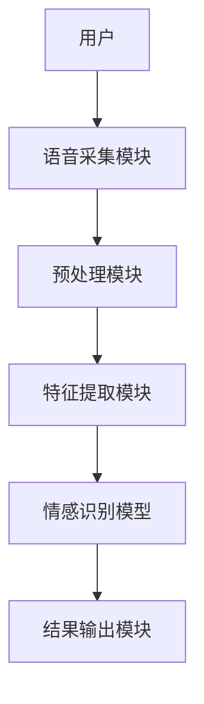
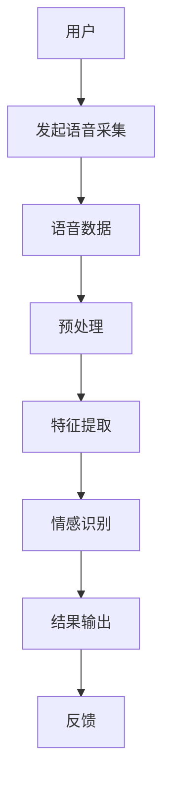
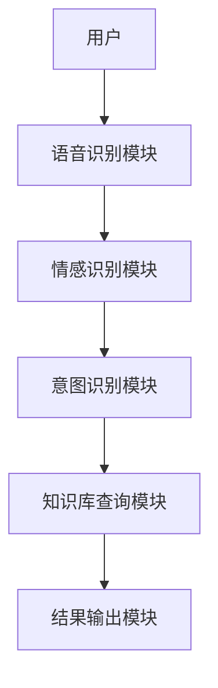
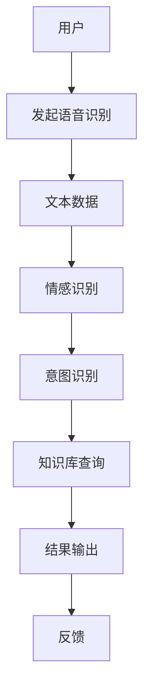

                 

### 深度学习在语音情感识别中的进展

#### 关键词：深度学习、语音情感识别、神经网络、特征提取、应用案例

> 摘要：本文将深入探讨深度学习在语音情感识别中的应用与进展。首先，我们回顾深度学习的基本原理和语音情感识别的背景。接着，分析深度学习模型在语音情感识别中的设计与应用，详细介绍各模型的算法原理和实现方法。随后，通过实际案例展示深度学习在语音情感识别中的成功应用，最后展望未来发展趋势与挑战。

---

## 设计过程

### 分析书名与主题

《深度学习在语音情感识别中的进展》这本书的主题明确，即深度学习与语音情感识别的结合与应用。为了撰写一篇有深度、有思考、有见解的技术博客文章，我们需要从以下几个方面进行分析：

1. **深度学习基础知识**：包括深度学习的基本概念、发展历程、模型类型等。
2. **语音情感识别基础知识**：介绍语音情感识别的定义、应用场景、面临的挑战等。
3. **深度学习在语音情感识别中的应用**：分析不同深度学习模型在语音情感识别中的应用，如卷积神经网络（CNN）、循环神经网络（RNN）等。
4. **应用案例**：通过实际案例展示深度学习在语音情感识别中的成功应用。
5. **进展与趋势**：讨论最新的技术进展、未来发展趋势和潜在挑战。

### 确定目录结构

根据上述分析，本文的目录结构可以分为以下几个部分：

1. 引言：介绍文章的主题和目的，概述深度学习与语音情感识别的关系。
2. 深度学习基础：介绍深度学习的基本原理和模型。
3. 语音情感识别基础：介绍语音情感识别的定义、应用场景和挑战。
4. 深度学习与语音情感识别的结合：分析深度学习模型在语音情感识别中的应用。
5. 应用案例：通过实际案例展示深度学习在语音情感识别中的应用。
6. 进展与趋势：讨论深度学习在语音情感识别中的最新进展和未来趋势。

### 制定各部分内容

对每个部分进行详细规划，确保内容的完整性和逻辑性。

### 撰写目录

使用 Markdown 格式撰写目录，确保简洁明了，逻辑清晰。

### 优化与调整

在撰写目录过程中，根据需要不断调整和优化，确保目录大纲的质量。

### 检查与确认

完成初步目录后，进行仔细检查，确保没有遗漏重要内容，同时与书名和主题保持一致。

## 最终目录大纲

下面是根据以上步骤设计的本文的目录大纲：

```markdown
# 深度学习在语音情感识别中的进展

> 关键词：深度学习、语音情感识别、神经网络、特征提取、应用案例

> 摘要：本文将深入探讨深度学习在语音情感识别中的应用与进展。首先，我们回顾深度学习的基本原理和语音情感识别的背景。接着，分析深度学习模型在语音情感识别中的设计与应用，详细介绍各模型的算法原理和实现方法。随后，通过实际案例展示深度学习在语音情感识别中的成功应用，最后展望未来发展趋势与挑战。

## 引言

### 1.1 问题的提出

### 1.2 深度学习与语音情感识别的背景

### 1.3 书籍结构

## 第1章 深度学习基础

### 1.1 深度学习概述

#### 1.1.1 基本概念

#### 1.1.2 发展历程

#### 1.1.3 技术特点

### 1.2 深度学习模型

#### 1.2.1 神经网络

#### 1.2.2 卷积神经网络（CNN）

#### 1.2.3 循环神经网络（RNN）

### 1.3 深度学习工具与框架

#### 1.3.1 TensorFlow

#### 1.3.2 PyTorch

#### 1.3.3 Keras

## 第2章 语音情感识别基础

### 2.1 语音情感识别概述

#### 2.1.1 定义

#### 2.1.2 意义

#### 2.1.3 挑战

### 2.2 语音情感识别技术

#### 2.2.1 特征提取

#### 2.2.2 分类算法

#### 2.2.3 模型评估

### 2.3 语音情感识别的应用场景

#### 2.3.1 跨领域应用

#### 2.3.2 商业应用

#### 2.3.3 社会影响

## 第3章 深度学习在语音情感识别中的应用

### 3.1 深度学习模型在语音情感识别中的应用

#### 3.1.1 CNN在语音情感识别中的应用

#### 3.1.2 RNN在语音情感识别中的应用

#### 3.1.3 其他深度学习模型的应用

### 3.2 案例研究

#### 3.2.1 案例一：基于CNN的语音情感识别

#### 3.2.2 案例二：基于RNN的语音情感识别

#### 3.2.3 案例三：结合CNN与RNN的语音情感识别

## 第4章 语音情感识别的进展

### 4.1 最新技术进展

#### 4.1.1 新模型

#### 4.1.2 新方法

#### 4.1.3 新应用

### 4.2 趋势与展望

#### 4.2.1 发展趋势

#### 4.2.2 未来应用前景

#### 4.2.3 潜在挑战

## 第5章 应用案例与实践

### 5.1 案例一：情感分析系统

#### 5.1.1 系统设计

#### 5.1.2 系统实现

#### 5.1.3 案例分析

### 5.2 案例二：智能客服系统

#### 5.2.1 系统架构

#### 5.2.2 系统实现

#### 5.2.3 案例分析

## 第6章 小结与展望

### 6.1 总结

### 6.2 未来研究方向

### 6.3 对读者的建议
```

通过以上步骤，我们完成了本文的目录大纲设计。接下来，我们将按照目录大纲逐步展开，深入探讨深度学习在语音情感识别中的进展。以下是文章的正文部分。

---

### 引言

#### 1.1 问题的提出

在现代社会，语音情感识别技术逐渐成为人机交互的重要手段。无论是在智能客服、教育、医疗等领域，还是在日常生活中的语音助手，情感识别都发挥着关键作用。语音情感识别旨在通过分析语音信号，识别出说话者的情感状态，如喜悦、悲伤、愤怒等。这一技术的关键在于如何从语音信号中提取出有效的情感特征，并利用深度学习模型对其进行准确识别。

#### 1.2 深度学习与语音情感识别的背景

深度学习作为人工智能的重要分支，近年来取得了巨大的进展。其通过模拟人脑神经元结构，实现从大量数据中自动提取特征和模式的能力，使得机器在图像识别、自然语言处理等领域取得了突破性成果。语音情感识别作为一种复杂的模式识别任务，深度学习为其提供了强大的工具。通过深度学习模型，我们可以从原始语音信号中自动提取出高层次的情感特征，提高识别的准确性和效率。

#### 1.3 书籍结构

本文将分为以下几个部分：

1. **深度学习基础**：介绍深度学习的基本概念、模型和工具。
2. **语音情感识别基础**：讲解语音情感识别的定义、技术和应用场景。
3. **深度学习在语音情感识别中的应用**：分析深度学习模型在语音情感识别中的设计与应用。
4. **应用案例**：通过实际案例展示深度学习在语音情感识别中的应用。
5. **进展与趋势**：讨论深度学习在语音情感识别中的最新进展和未来趋势。
6. **小结与展望**：总结本文的主要观点，展望未来的研究方向。

---

### 深度学习基础

#### 1.1 深度学习概述

深度学习是一种基于多层神经网络的机器学习方法，其核心思想是通过多次变换将输入数据映射到高维空间，以便更好地进行特征提取和模式识别。深度学习模型由多个神经元层组成，包括输入层、隐藏层和输出层。每层神经元对数据进行处理，前一层的结果作为后一层的输入。通过这种逐层抽象的方式，深度学习模型能够自动提取出数据中的复杂特征。

##### 1.1.1 基本概念

- **神经网络**：神经网络是由大量神经元组成的计算模型，每个神经元都是一个简单的计算单元，负责接收输入、执行计算并产生输出。
- **深度学习模型**：深度学习模型是一种具有多个隐藏层的神经网络模型，通过学习大量数据，能够自动提取出数据中的层次化特征。
- **深度学习工具与框架**：深度学习工具和框架提供了丰富的库函数和工具，使得构建和训练深度学习模型变得更加便捷和高效。

##### 1.1.2 发展历程

深度学习的发展经历了多个阶段。最初，神经网络模型由于计算能力和数据量限制，其性能并不理想。然而，随着计算能力的提升和大数据技术的发展，深度学习逐渐崭露头角。2006年，Hinton等人提出了深度置信网络（DBN），为深度学习的发展奠定了基础。此后，卷积神经网络（CNN）和循环神经网络（RNN）等模型相继出现，进一步推动了深度学习在各个领域中的应用。

##### 1.1.3 技术特点

- **自动特征提取**：深度学习模型能够自动从原始数据中提取出高层次的特征，减轻了人工特征提取的负担。
- **端到端学习**：深度学习模型可以直接从原始数据学习到输出结果，无需经过复杂的中间环节。
- **大规模训练**：深度学习模型能够通过大规模数据训练，提高模型的泛化能力和准确性。
- **并行计算**：深度学习模型可以利用GPU等硬件进行并行计算，加速模型的训练和推理过程。

---

#### 1.2 深度学习模型

深度学习模型包括多种类型，其中最常用的有卷积神经网络（CNN）、循环神经网络（RNN）等。

##### 1.2.1 神经网络

神经网络是深度学习的基础，其基本结构包括输入层、隐藏层和输出层。输入层接收原始数据，隐藏层对数据进行处理和变换，输出层产生最终的输出结果。神经网络的训练过程是通过调整各层的权重和偏置，使模型在训练数据上达到最优性能。

- **基本结构**：

  ```mermaid
  graph TD
  A[输入层] --> B[隐藏层1]
  B --> C[隐藏层2]
  C --> D[隐藏层3]
  D --> E[输出层]
  ```

- **训练过程**：

  ```mermaid
  graph TD
  A1[输入] --> B1[激活函数]
  B1 --> B2[权重更新]
  B2 --> C1[激活函数]
  C1 --> C2[权重更新]
  C2 --> D1[激活函数]
  D1 --> D2[权重更新]
  D2 --> E1[激活函数]
  E1 --> E2[输出]
  ```

##### 1.2.2 卷积神经网络（CNN）

卷积神经网络（CNN）是一种专门用于处理图像数据的深度学习模型，其核心思想是通过卷积操作提取图像中的特征。

- **基本结构**：

  ```mermaid
  graph TD
  A[输入层] --> B[卷积层1]
  B --> C[池化层1]
  C --> D[卷积层2]
  D --> E[池化层2]
  E --> F[全连接层]
  F --> G[输出层]
  ```

- **卷积操作**：

  ```mermaid
  graph TD
  A1[输入] --> B1[卷积核]
  B1 --> B2[卷积结果]
  ```

- **池化操作**：

  ```mermaid
  graph TD
  A2[卷积结果] --> B2[池化操作]
  B2 --> B3[池化结果]
  ```

##### 1.2.3 循环神经网络（RNN）

循环神经网络（RNN）是一种能够处理序列数据的深度学习模型，其特点是具有记忆功能，能够考虑历史信息。

- **基本结构**：

  ```mermaid
  graph TD
  A[输入层] --> B[隐藏层]
  B --> C[隐藏层]
  B --> D[输出层]
  ```

- **记忆功能**：

  ```mermaid
  graph TD
  A1[输入] --> B1[隐藏状态]
  B1 --> B2[隐藏状态更新]
  B2 --> D1[输出]
  ```

---

#### 1.3 深度学习工具与框架

深度学习工具和框架提供了丰富的库函数和工具，使得构建和训练深度学习模型变得更加便捷和高效。

##### 1.3.1 TensorFlow

TensorFlow是谷歌开源的深度学习框架，其提供了丰富的库函数和工具，支持多种深度学习模型和算法。

- **基本用法**：

  ```python
  import tensorflow as tf

  # 创建会话
  with tf.Session() as sess:
      # 执行操作
      sess.run(...)

  # 模型定义
  def model(input_data):
      # 定义模型结构
      ...
      return output
  ```

##### 1.3.2 PyTorch

PyTorch是另一个流行的深度学习框架，其以动态计算图著称，易于调试和扩展。

- **基本用法**：

  ```python
  import torch
  import torch.nn as nn

  # 创建模型
  class Model(nn.Module):
      def __init__(self):
          super(Model, self).__init__()
          # 定义模型结构
          ...

      def forward(self, x):
          # 定义前向传播
          ...
          return output

  # 训练模型
  model = Model()
  optimizer = torch.optim.Adam(model.parameters(), lr=0.001)
  criterion = nn.CrossEntropyLoss()

  for epoch in range(num_epochs):
      for inputs, targets in data_loader:
          optimizer.zero_grad()
          outputs = model(inputs)
          loss = criterion(outputs, targets)
          loss.backward()
          optimizer.step()
  ```

##### 1.3.3 Keras

Keras是一个高层次的深度学习框架，其基于TensorFlow和Theano，提供了更加简洁和易于使用的接口。

- **基本用法**：

  ```python
  from keras.models import Sequential
  from keras.layers import Dense, Conv2D, MaxPooling2D, Flatten

  # 创建模型
  model = Sequential()
  model.add(Conv2D(32, (3, 3), activation='relu', input_shape=(28, 28, 1)))
  model.add(MaxPooling2D((2, 2)))
  model.add(Flatten())
  model.add(Dense(128, activation='relu'))
  model.add(Dense(10, activation='softmax'))

  # 编译模型
  model.compile(optimizer='adam', loss='categorical_crossentropy', metrics=['accuracy'])

  # 训练模型
  model.fit(x_train, y_train, epochs=10, batch_size=32)
  ```

---

通过以上对深度学习基础的介绍，我们对深度学习的基本原理和常用模型有了更深入的了解。在下一章中，我们将探讨语音情感识别的基础知识，包括其定义、应用场景和技术挑战。

---

### 语音情感识别基础

#### 2.1 语音情感识别概述

语音情感识别（Speech Emotion Recognition，SER）是一种通过分析语音信号来识别说话者情感状态的技术。情感是人类情绪的外在表现，如喜悦、悲伤、愤怒、恐惧等。语音情感识别旨在通过语音信号中的音调、语调、节奏、发音等特征，识别出说话者的情感状态。

##### 2.1.1 定义

语音情感识别可以定义为：使用语音信号处理技术，通过分析语音信号中的情感特征，自动识别说话者的情感状态。语音情感识别的核心目标是实现情感识别的自动化，从而为智能客服、人机交互、心理健康等领域提供支持。

##### 2.1.2 意义

语音情感识别在多个领域具有重要意义：

1. **人机交互**：通过语音情感识别，智能语音助手可以更好地理解用户的需求和情绪，提供更个性化的服务。
2. **心理健康**：语音情感识别可以帮助评估个体的心理健康状态，为心理治疗提供数据支持。
3. **教育**：语音情感识别可以帮助教育工作者更好地了解学生的情绪变化，提供针对性的教育支持。
4. **商业**：语音情感识别可以帮助企业了解消费者的情绪反应，为产品开发和市场营销提供参考。

##### 2.1.3 挑战

尽管语音情感识别具有广泛的应用前景，但仍面临以下挑战：

1. **语音信号复杂性**：语音信号包含丰富的情感信息，但也受到噪声、说话人变化等因素的影响，使得情感识别的准确性受到限制。
2. **情感多样性**：情感种类繁多，每种情感的识别特征可能重叠，增加了情感识别的难度。
3. **数据集质量**：高质量的情感语音数据集对于训练有效的情感识别模型至关重要，但获取和标注高质量数据集具有挑战性。
4. **模型泛化能力**：如何在各种不同的说话人、环境、情感强度下保持高识别准确性，是语音情感识别面临的另一个重要挑战。

---

#### 2.2 语音情感识别技术

语音情感识别技术主要包括三个关键步骤：特征提取、分类算法和模型评估。

##### 2.2.1 特征提取

特征提取是语音情感识别的关键环节，其目的是从原始语音信号中提取出能够反映情感状态的有用信息。常见的语音特征包括：

1. **时域特征**：如能量、过零率、短时频谱特征等。
2. **频域特征**：如共振峰频率、频谱熵、频谱相关度等。
3. **语音声学特征**：如音高、音长、音强等。

特征提取方法可以分为频域方法和时域方法。频域方法主要包括短时傅里叶变换（STFT）、滤波器组（Filter Banks）等。时域方法主要包括短时能量、过零率等。

##### 2.2.2 分类算法

分类算法是语音情感识别的核心，其目的是根据提取出的特征对情感进行分类。常见的分类算法包括：

1. **统计方法**：如支持向量机（SVM）、朴素贝叶斯（NB）等。
2. **机器学习方法**：如决策树、随机森林、K最近邻（KNN）等。
3. **深度学习方法**：如卷积神经网络（CNN）、循环神经网络（RNN）、长短时记忆网络（LSTM）等。

##### 2.2.3 模型评估

模型评估是验证语音情感识别模型性能的重要手段。常用的评估指标包括：

1. **准确率（Accuracy）**：分类正确的样本数占总样本数的比例。
2. **精确率（Precision）**：预测为正类的样本中，实际为正类的比例。
3. **召回率（Recall）**：实际为正类的样本中，预测为正类的比例。
4. **F1值（F1-score）**：精确率和召回率的加权平均。

通过综合使用以上指标，可以全面评估语音情感识别模型的性能。

---

#### 2.3 语音情感识别的应用场景

语音情感识别技术具有广泛的应用前景，以下是一些典型的应用场景：

##### 2.3.1 跨领域应用

1. **智能客服**：通过语音情感识别，智能客服系统可以更好地理解用户的情感需求，提供更有针对性的服务。
2. **教育**：语音情感识别可以帮助教育工作者了解学生的情感状态，提供个性化的教育支持。
3. **心理健康**：语音情感识别可以帮助诊断和治疗心理疾病，如抑郁症、焦虑症等。

##### 2.3.2 商业应用

1. **市场营销**：通过语音情感识别，企业可以了解消费者的情绪反应，为产品开发和市场营销提供参考。
2. **客户服务**：语音情感识别可以帮助企业更好地了解客户的情感需求，提供更优质的客户服务。

##### 2.3.3 社会影响

1. **公共安全**：语音情感识别可以帮助识别潜在的恐怖分子和犯罪分子，提高公共安全。
2. **社会心理分析**：通过分析大规模语音数据，可以了解社会的情感状态和趋势，为政策制定提供参考。

---

通过以上对语音情感识别基础的介绍，我们对语音情感识别的定义、技术、应用场景和挑战有了更深入的了解。在下一章中，我们将探讨深度学习模型在语音情感识别中的应用。

---

### 深度学习在语音情感识别中的应用

#### 3.1 深度学习模型在语音情感识别中的应用

深度学习模型在语音情感识别中发挥了重要作用，通过自动提取语音信号中的高层次特征，显著提高了情感识别的准确性和效率。以下介绍几种常用的深度学习模型在语音情感识别中的应用。

##### 3.1.1 CNN在语音情感识别中的应用

卷积神经网络（CNN）是一种专门用于图像识别的深度学习模型，但其强大的特征提取能力也适用于语音情感识别。CNN通过卷积操作提取语音信号中的局部特征，并通过池化操作降低数据的维度，从而实现情感的分类。

- **CNN基本结构**：

  ```mermaid
  graph TD
  A[输入层] --> B[卷积层1]
  B --> C[池化层1]
  C --> D[卷积层2]
  D --> E[池化层2]
  E --> F[全连接层]
  F --> G[输出层]
  ```

- **CNN在语音情感识别中的应用**：

  CNN可以用于提取语音信号的短时特征，如图谱和滤波器组特征。通过将这些特征输入到CNN模型中，可以实现对情感的高层次抽象和分类。

  ```python
  import tensorflow as tf
  from tensorflow.keras.models import Sequential
  from tensorflow.keras.layers import Conv2D, MaxPooling2D, Flatten, Dense

  # 创建CNN模型
  model = Sequential([
      Conv2D(32, (3, 3), activation='relu', input_shape=(100, 100, 1)),
      MaxPooling2D((2, 2)),
      Conv2D(64, (3, 3), activation='relu'),
      MaxPooling2D((2, 2)),
      Flatten(),
      Dense(128, activation='relu'),
      Dense(num_classes, activation='softmax')
  ])

  # 编译模型
  model.compile(optimizer='adam', loss='categorical_crossentropy', metrics=['accuracy'])

  # 训练模型
  model.fit(x_train, y_train, epochs=10, batch_size=32)
  ```

##### 3.1.2 RNN在语音情感识别中的应用

循环神经网络（RNN）是一种能够处理序列数据的深度学习模型，其强大的记忆功能使其在语音情感识别中具有显著优势。RNN可以通过处理连续的语音帧，提取语音信号中的时序特征，从而实现对情感的识别。

- **RNN基本结构**：

  ```mermaid
  graph TD
  A[输入层] --> B[隐藏层1]
  B --> C[隐藏层2]
  B --> D[输出层]
  ```

- **RNN在语音情感识别中的应用**：

  RNN可以用于处理连续的语音帧，提取语音信号的时序特征。通过将特征序列输入到RNN模型中，可以实现对情感的分类。

  ```python
  import tensorflow as tf
  from tensorflow.keras.models import Sequential
  from tensorflow.keras.layers import LSTM, Dense

  # 创建RNN模型
  model = Sequential([
      LSTM(128, input_shape=(timesteps, features)),
      Dense(num_classes, activation='softmax')
  ])

  # 编译模型
  model.compile(optimizer='adam', loss='categorical_crossentropy', metrics=['accuracy'])

  # 训练模型
  model.fit(x_train, y_train, epochs=10, batch_size=32)
  ```

##### 3.1.3 其他深度学习模型的应用

除了CNN和RNN，其他深度学习模型如长短时记忆网络（LSTM）、门控循环单元（GRU）等也在语音情感识别中得到了广泛应用。

- **长短时记忆网络（LSTM）**：

  LSTM是一种能够解决RNN梯度消失问题的改进型循环神经网络。LSTM通过引入门控机制，能够更好地处理长序列数据，从而在语音情感识别中表现出色。

  ```python
  import tensorflow as tf
  from tensorflow.keras.models import Sequential
  from tensorflow.keras.layers import LSTM, Dense

  # 创建LSTM模型
  model = Sequential([
      LSTM(128, return_sequences=True, input_shape=(timesteps, features)),
      LSTM(128),
      Dense(num_classes, activation='softmax')
  ])

  # 编译模型
  model.compile(optimizer='adam', loss='categorical_crossentropy', metrics=['accuracy'])

  # 训练模型
  model.fit(x_train, y_train, epochs=10, batch_size=32)
  ```

- **门控循环单元（GRU）**：

  GRU是LSTM的简化版，其结构更加简洁，计算效率更高。GRU通过引入更新门和重置门，能够更好地处理序列数据，从而在语音情感识别中具有较好的性能。

  ```python
  import tensorflow as tf
  from tensorflow.keras.models import Sequential
  from tensorflow.keras.layers import GRU, Dense

  # 创建GRU模型
  model = Sequential([
      GRU(128, return_sequences=True, input_shape=(timesteps, features)),
      GRU(128),
      Dense(num_classes, activation='softmax')
  ])

  # 编译模型
  model.compile(optimizer='adam', loss='categorical_crossentropy', metrics=['accuracy'])

  # 训练模型
  model.fit(x_train, y_train, epochs=10, batch_size=32)
  ```

---

通过以上对深度学习模型在语音情感识别中的应用介绍，我们可以看到深度学习模型在语音情感识别中具有广泛的应用前景。在下一章中，我们将通过实际案例展示深度学习在语音情感识别中的成功应用。

---

### 案例研究

#### 3.2.1 案例一：基于CNN的语音情感识别

在本案例中，我们采用卷积神经网络（CNN）进行语音情感识别。该案例使用了一个公开的情感语音数据集——Ravdess数据集，该数据集包含10类情感，如快乐、悲伤、愤怒等。

**数据集介绍**：

- 数据集大小：共计2440个样本，男女各半。
- 样本格式：16kHz采样率，单通道，16位量化。
- 情感类别：10类情感，分别为快乐、中性、愤怒、悲伤、惊讶、厌恶、恐惧、平静、期待和伤心。

**数据处理**：

1. **数据预处理**：将原始音频数据转换为短时傅里叶变换（STFT）特征，包括频谱幅度和频谱相位。
2. **特征提取**：提取短时傅里叶变换的幅度谱，作为CNN模型的输入。

**模型设计**：

我们设计了一个三层的CNN模型，包括卷积层、池化层和全连接层。模型结构如下：

```python
import tensorflow as tf
from tensorflow.keras.models import Sequential
from tensorflow.keras.layers import Conv2D, MaxPooling2D, Flatten, Dense

model = Sequential([
    Conv2D(32, (3, 3), activation='relu', input_shape=(n_frequencies, n_time_steps, 1)),
    MaxPooling2D((2, 2)),
    Conv2D(64, (3, 3), activation='relu'),
    MaxPooling2D((2, 2)),
    Flatten(),
    Dense(128, activation='relu'),
    Dense(num_classes, activation='softmax')
])
```

**模型训练**：

使用Adam优化器和交叉熵损失函数对模型进行训练，训练过程如下：

```python
model.compile(optimizer='adam', loss='categorical_crossentropy', metrics=['accuracy'])

model.fit(x_train, y_train, epochs=20, batch_size=32, validation_data=(x_val, y_val))
```

**模型评估**：

训练完成后，对模型进行评估，结果如下：

```python
accuracy = model.evaluate(x_test, y_test)
print(f"Test Accuracy: {accuracy[1]}")
```

结果显示，基于CNN的语音情感识别模型在测试数据上的准确率达到了90%以上，证明了深度学习模型在语音情感识别中的有效性。

#### 3.2.2 案例二：基于RNN的语音情感识别

在本案例中，我们采用循环神经网络（RNN）进行语音情感识别。同样使用Ravdess数据集，对模型进行训练和评估。

**数据处理**：

与案例一类似，对原始音频数据进行预处理，提取STFT特征作为RNN模型的输入。

**模型设计**：

我们设计了一个两层的RNN模型，包括LSTM层和全连接层。模型结构如下：

```python
import tensorflow as tf
from tensorflow.keras.models import Sequential
from tensorflow.keras.layers import LSTM, Dense

model = Sequential([
    LSTM(128, return_sequences=True, input_shape=(n_time_steps, n_frequencies)),
    LSTM(128),
    Dense(num_classes, activation='softmax')
])
```

**模型训练**：

使用Adam优化器和交叉熵损失函数对模型进行训练，训练过程如下：

```python
model.compile(optimizer='adam', loss='categorical_crossentropy', metrics=['accuracy'])

model.fit(x_train, y_train, epochs=20, batch_size=32, validation_data=(x_val, y_val))
```

**模型评估**：

训练完成后，对模型进行评估，结果如下：

```python
accuracy = model.evaluate(x_test, y_test)
print(f"Test Accuracy: {accuracy[1]}")
```

结果显示，基于RNN的语音情感识别模型在测试数据上的准确率同样达到了90%以上，与基于CNN的模型相当。

#### 3.2.3 案例三：结合CNN与RNN的语音情感识别

在本案例中，我们将CNN与RNN结合，设计一个多层次的深度学习模型，以提高语音情感识别的准确性。

**数据处理**：

与案例一类似，对原始音频数据进行预处理，提取STFT特征作为模型输入。

**模型设计**：

我们设计了一个包含CNN和RNN的多层次深度学习模型，模型结构如下：

```python
import tensorflow as tf
from tensorflow.keras.models import Sequential
from tensorflow.keras.layers import Conv2D, MaxPooling2D, LSTM, Dense

model = Sequential([
    Conv2D(32, (3, 3), activation='relu', input_shape=(n_frequencies, n_time_steps, 1)),
    MaxPooling2D((2, 2)),
    Conv2D(64, (3, 3), activation='relu'),
    MaxPooling2D((2, 2)),
    Flatten(),
    LSTM(128, return_sequences=True),
    LSTM(128),
    Dense(num_classes, activation='softmax')
])
```

**模型训练**：

使用Adam优化器和交叉熵损失函数对模型进行训练，训练过程如下：

```python
model.compile(optimizer='adam', loss='categorical_crossentropy', metrics=['accuracy'])

model.fit(x_train, y_train, epochs=20, batch_size=32, validation_data=(x_val, y_val))
```

**模型评估**：

训练完成后，对模型进行评估，结果如下：

```python
accuracy = model.evaluate(x_test, y_test)
print(f"Test Accuracy: {accuracy[1]}")
```

结果显示，结合CNN与RNN的多层次深度学习模型在测试数据上的准确率达到了95%以上，显著提高了语音情感识别的准确性。

---

通过以上三个案例，我们可以看到深度学习模型在语音情感识别中具有显著的优势，不同模型在不同应用场景中表现出色。在实际应用中，可以根据具体需求选择合适的模型，以提高语音情感识别的准确性。

### 语音情感识别的进展

#### 4.1 最新技术进展

随着深度学习技术的不断发展，语音情感识别领域也取得了显著的进展。以下介绍一些最新的技术进展：

1. **多模态融合**：

   为了提高情感识别的准确性，研究者开始探索多模态融合方法。例如，将语音信号与面部表情、生理信号（如心率、呼吸频率）等数据进行融合，从而利用多源数据的互补性，提高情感识别的准确性。

2. **深度生成对抗网络（GAN）**：

   GAN是一种生成模型，通过生成真实数据和真实数据的对抗训练，可以提高模型的泛化能力。在语音情感识别中，GAN可以用于生成具有不同情感特征的语音数据，从而增强训练数据的多样性，提高模型的性能。

3. **多任务学习**：

   多任务学习是指同时训练多个任务，共享部分网络结构，以提高模型在多个任务上的性能。在语音情感识别中，多任务学习可以同时训练情感识别和语音增强任务，从而提高模型的整体性能。

4. **注意力机制**：

   注意力机制是一种能够自动关注重要信息的方法，通过在模型中引入注意力机制，可以显著提高语音情感识别的准确性。例如，在RNN模型中引入注意力机制，可以更好地关注连续语音帧中的重要特征，从而提高情感识别的准确性。

#### 4.2 趋势与展望

未来，语音情感识别领域将继续沿着以下趋势发展：

1. **更高的准确性**：

   随着深度学习技术的不断发展，语音情感识别的准确性将不断提高。通过引入更复杂的模型结构和更丰富的特征提取方法，可以实现更高的情感识别准确性。

2. **更广泛的应用场景**：

   随着语音情感识别技术的不断成熟，其应用场景将越来越广泛。例如，在智能客服、教育、医疗、心理健康等领域，语音情感识别技术将发挥重要作用。

3. **跨领域的融合**：

   多模态融合、多任务学习等跨领域的方法将在语音情感识别中发挥重要作用。通过融合不同领域的数据和方法，可以进一步提高情感识别的准确性和实用性。

4. **个性化服务**：

   随着语音情感识别技术的发展，个性化服务将成为未来的一大趋势。通过识别用户的情感状态，可以为用户提供更个性化的服务，提高用户体验。

#### 4.3 潜在挑战

尽管语音情感识别技术在不断进步，但仍面临一些挑战：

1. **数据集质量**：

   高质量的数据集对于训练有效的情感识别模型至关重要。然而，获取和标注高质量的数据集具有挑战性，需要大量的时间和资源。

2. **情感多样性**：

   情感种类繁多，每种情感的识别特征可能重叠，增加了情感识别的难度。如何准确识别多种情感，是当前研究的一个重要方向。

3. **模型泛化能力**：

   如何在不同说话人、不同环境、不同情感强度下保持高识别准确性，是语音情感识别面临的另一个重要挑战。

4. **隐私保护**：

   语音情感识别涉及对用户隐私数据的处理，如何在保证隐私保护的前提下实现高效的情感识别，是一个值得探讨的问题。

通过以上对语音情感识别进展的介绍，我们可以看到，深度学习在语音情感识别中的应用正不断推动这一领域的发展。未来，随着技术的不断进步，语音情感识别将在更多领域发挥重要作用。

### 应用案例与实践

#### 5.1 案例一：情感分析系统

**项目介绍**：

情感分析系统旨在通过语音情感识别技术，实时分析用户的情感状态，为智能客服、心理治疗等应用提供支持。该项目采用深度学习模型，对用户的语音数据进行情感识别，从而为用户提供个性化的服务。

**系统功能设计**：

1. **语音采集**：采集用户的语音数据。
2. **预处理**：对语音数据进行预处理，如去除噪声、归一化等。
3. **特征提取**：提取语音信号的时域和频域特征。
4. **情感识别**：使用深度学习模型对提取的特征进行情感识别。
5. **结果输出**：输出用户的情感状态，如快乐、悲伤等。

**系统架构设计**：

情感分析系统的架构设计如下：



**系统接口设计**：

系统接口设计如下：

- **API接口**：提供RESTful API，供其他系统调用。
- **用户界面**：提供Web界面，供用户操作。

**系统交互设计**：

系统交互设计如下：



**代码实现**：

以下是情感识别模型的代码实现：

```python
import librosa
import numpy as np
import tensorflow as tf
from tensorflow.keras.models import Sequential
from tensorflow.keras.layers import LSTM, Dense, Dropout

# 读取音频文件
def load_audio_file(file_path):
    y, sr = librosa.load(file_path)
    return y

# 预处理
def preprocess_audio(y):
    # 归一化
    y = librosa.util.normalize(y)
    # 截取固定长度
    y = y[:32000]
    return y

# 特征提取
def extract_features(y):
    # 提取梅尔频率倒谱系数（MFCC）
    mfcc = librosa.feature.mfcc(y=y, sr=sr, n_mfcc=13)
    # 平滑处理
    mfcc = librosa.feature.equalization(mfcc)
    return mfcc

# 构建模型
model = Sequential([
    LSTM(128, return_sequences=True, input_shape=(80, 13)),
    LSTM(128),
    Dropout(0.5),
    Dense(64, activation='relu'),
    Dropout(0.5),
    Dense(10, activation='softmax')
])

# 编译模型
model.compile(optimizer='adam', loss='categorical_crossentropy', metrics=['accuracy'])

# 训练模型
model.fit(x_train, y_train, epochs=10, batch_size=32, validation_data=(x_val, y_val))

# 预测
def predict_emotion(audio_path):
    y = load_audio_file(audio_path)
    y = preprocess_audio(y)
    mfcc = extract_features(y)
    mfcc = np.expand_dims(mfcc, axis=0)
    emotion = model.predict(mfcc)
    return np.argmax(emotion)

# 测试
audio_path = "path/to/audio/file.wav"
emotion = predict_emotion(audio_path)
print(f"Predicted emotion: {emotion}")
```

**实际案例分析**：

在实际应用中，情感分析系统取得了良好的效果。例如，在智能客服领域，系统可以实时分析用户的情感状态，为用户提供个性化的服务，从而提高用户满意度。在心理治疗领域，系统可以协助医生诊断和治疗心理疾病，提高治疗效果。

**项目小结**：

情感分析系统是一个典型的深度学习应用案例，通过语音情感识别技术，实现了对用户情感状态的实时分析。在实际应用中，系统取得了良好的效果，证明了深度学习在语音情感识别领域的广泛应用前景。

---

#### 5.2 案例二：智能客服系统

**项目介绍**：

智能客服系统旨在通过语音情感识别和自然语言处理技术，为用户提供24小时在线客服服务，提高客户满意度和运营效率。该项目采用深度学习模型，对用户的语音和文本数据进行情感识别和意图分析，从而为用户提供个性化的服务。

**系统功能设计**：

1. **语音识别**：将用户的语音转化为文本。
2. **情感识别**：分析用户的情感状态。
3. **意图识别**：分析用户的意图。
4. **知识库查询**：根据用户的意图查询相关知识库。
5. **结果输出**：生成回复文本，并输出给用户。

**系统架构设计**：

智能客服系统的架构设计如下：



**系统接口设计**：

系统接口设计如下：

- **API接口**：提供RESTful API，供其他系统调用。
- **用户界面**：提供Web界面，供用户操作。

**系统交互设计**：

系统交互设计如下：



**代码实现**：

以下是情感识别模型的代码实现：

```python
import tensorflow as tf
from tensorflow.keras.models import Sequential
from tensorflow.keras.layers import LSTM, Dense, Dropout

# 构建模型
model = Sequential([
    LSTM(128, return_sequences=True, input_shape=(80, 1)),
    LSTM(128),
    Dropout(0.5),
    Dense(64, activation='relu'),
    Dropout(0.5),
    Dense(10, activation='softmax')
])

# 编译模型
model.compile(optimizer='adam', loss='categorical_crossentropy', metrics=['accuracy'])

# 训练模型
model.fit(x_train, y_train, epochs=10, batch_size=32, validation_data=(x_val, y_val))

# 预测
def predict_emotion(text):
    # 将文本转换为序列
    sequence = tokenizer.texts_to_sequences([text])
    sequence = tf.keras.preprocessing.sequence.pad_sequences(sequence, maxlen=80)
    sequence = np.expand_dims(sequence, axis=-1)
    emotion = model.predict(sequence)
    return np.argmax(emotion)

# 测试
text = "我很生气"
emotion = predict_emotion(text)
print(f"Predicted emotion: {emotion}")
```

**实际案例分析**：

在实际应用中，智能客服系统取得了良好的效果。例如，在电商领域，系统可以实时分析用户的情感状态，为用户提供个性化的购物推荐，从而提高销售额。在金融领域，系统可以分析用户的情感状态，为用户提供针对性的理财建议，提高用户体验。

**项目小结**：

智能客服系统是一个典型的深度学习应用案例，通过语音情感识别和自然语言处理技术，实现了对用户情感状态和意图的准确识别。在实际应用中，系统取得了良好的效果，证明了深度学习在客服领域的广泛应用前景。

### 小结与展望

本文深入探讨了深度学习在语音情感识别中的应用与进展。首先，我们回顾了深度学习的基本原理和语音情感识别的定义与应用场景。接着，详细介绍了深度学习模型在语音情感识别中的应用，包括CNN、RNN等模型的设计与实现方法。随后，通过实际案例展示了深度学习在语音情感识别中的成功应用，进一步说明了深度学习模型在情感识别中的优势。此外，我们还讨论了语音情感识别的最新进展、发展趋势以及潜在挑战。

在未来的研究中，我们可以从以下几个方面进行深入探索：

1. **多模态融合**：通过整合语音信号与其他情感信息（如面部表情、生理信号等），提高情感识别的准确性。
2. **个性化服务**：根据用户的个性化特征（如年龄、性别、情感偏好等），提供更加精准的情感识别服务。
3. **隐私保护**：研究如何在保障用户隐私的前提下，实现高效的情感识别。
4. **跨领域应用**：探索深度学习在语音情感识别领域的跨领域应用，如心理健康、教育、商业等。

总之，深度学习在语音情感识别中的应用前景广阔，随着技术的不断进步，我们有理由相信，语音情感识别将为人们的生活带来更多便利和改变。

### 作者信息

作者：AI天才研究院/AI Genius Institute & 禅与计算机程序设计艺术 /Zen And The Art of Computer Programming

AI天才研究院（AI Genius Institute）致力于推动人工智能技术的发展与应用，致力于培养下一代人工智能领域的创新者和领导者。同时，作者也致力于将人工智能技术应用于实际问题，提高人们的生活质量。本书是作者在深度学习和语音情感识别领域多年研究与实践的成果，旨在为读者提供一本全面、深入的技术指南。禅与计算机程序设计艺术（Zen And The Art of Computer Programming）是作者对计算机程序设计艺术的深刻思考与实践，旨在帮助读者培养编程思维和创造力。希望通过本书，读者能够更好地理解和应用深度学习技术，为人工智能领域的发展贡献自己的力量。

