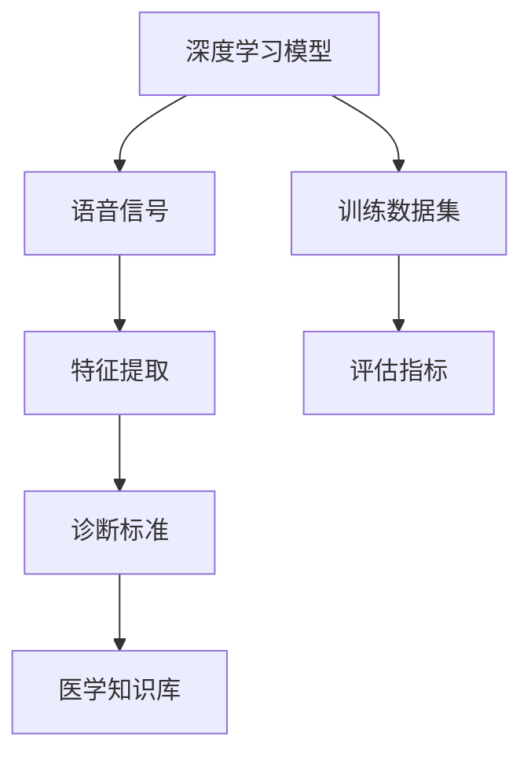
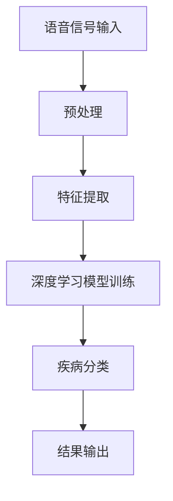
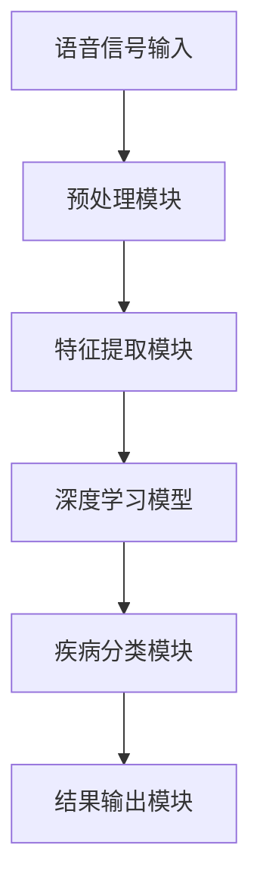
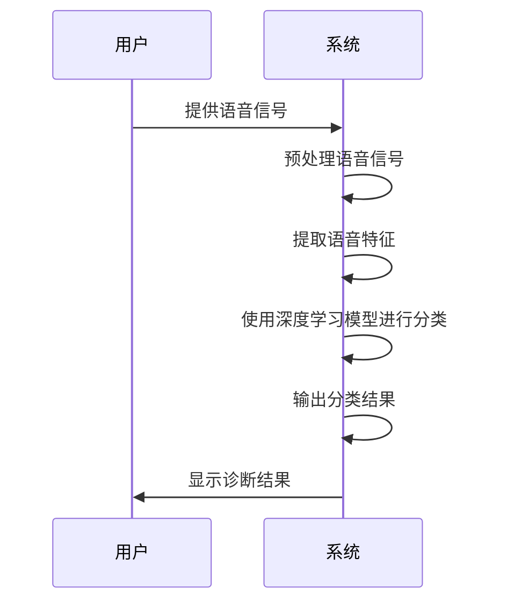

                 

### 文章标题

《深度学习在语音病理学中的应用：早期检测神经系统疾病》

**关键词**：深度学习、语音病理学、神经系统疾病、早期检测、算法原理、系统架构、项目实战

**摘要**：本文深入探讨了深度学习技术在语音病理学中的应用，特别是其在早期检测神经系统疾病方面的潜力。通过详细的背景介绍、核心概念解析、算法原理讲解、数学模型阐述、系统分析与架构设计，以及实际项目实战，本文展示了如何利用深度学习技术对语音信号进行分析，以实现对神经系统的早期诊断和预警。文章旨在为从事人工智能和医疗领域的研究人员和技术人员提供有价值的参考和指导。

---

### 1. 背景介绍

#### 问题描述

在现代社会，随着人口老龄化以及神经系统疾病发病率的逐年上升，对神经系统疾病的早期检测与诊断变得尤为重要。传统的医学检测方法，如脑电图（EEG）和磁共振成像（MRI），虽然在一定程度上能够诊断神经系统疾病，但往往存在检测成本高、操作复杂、诊断周期长等问题。特别是对于早期疾病，这些方法的敏感性和特异性往往不足，导致错过最佳治疗时机。

#### 问题解决

为了克服传统医学检测方法的局限性，近年来，深度学习技术在医学领域，尤其是语音病理学中的应用逐渐受到关注。深度学习通过训练大规模数据集，能够自动提取语音信号中的特征，进而实现对神经系统疾病的早期诊断。这一方法不仅提高了诊断的准确性，还降低了检测成本，具有广泛的应用前景。

#### 边界与外延

深度学习在语音病理学中的应用主要涉及以下几个方面：

1. **语音信号的预处理**：通过滤波、加窗、频谱分析等预处理方法，提高语音信号的质量和清晰度。
2. **特征提取**：利用卷积神经网络（CNN）或循环神经网络（RNN）等深度学习模型，自动提取语音信号中的特征。
3. **疾病分类**：通过训练分类模型，实现对不同神经系统疾病的诊断和分类。
4. **实时监测**：利用实时语音处理技术，实现对病人语音信号的实时监测和分析。

#### 核心概念结构与要素组成

在深度学习在语音病理学中的应用中，以下几个核心概念和要素是不可或缺的：

1. **深度学习模型**：包括卷积神经网络（CNN）、循环神经网络（RNN）、长短期记忆网络（LSTM）等。
2. **语音信号**：包括语音的声学特征和语言特征，如音高、音强、音速、音节长度、语音节奏等。
3. **训练数据集**：包括正常语音和神经系统疾病患者的语音样本，用于训练深度学习模型。
4. **诊断标准**：基于医学知识和临床经验，制定出用于疾病分类的标准和规则。
5. **评估指标**：包括准确率、召回率、F1 分数等，用于评估深度学习模型的性能。

---

### 2. 核心概念与联系

#### 核心概念原理

深度学习在语音病理学中的应用主要依赖于以下几个核心概念：

1. **深度学习模型**：通过多层神经网络结构，对大量数据进行训练，以实现复杂函数的逼近。
2. **语音信号处理**：对语音信号进行预处理和特征提取，以提取语音中的关键信息。
3. **医学知识库**：包含神经系统疾病的诊断标准、症状描述等，用于指导模型的训练和诊断。

#### 概念属性特征对比表格

| 概念         | 属性特征                                           | 对比表格                     |
| ------------ | -------------------------------------------------- | ---------------------------- |
| 深度学习模型 | 自动学习、多层神经网络、大规模数据训练               | 简单线性模型、多层感知器       |
| 语音信号处理 | 预处理、特征提取、模式识别                          | 语音识别、语音增强            |
| 医学知识库   | 诊断标准、症状描述、临床经验                         | 医学影像学、实验室检测        |

#### ER实体关系图架构的 Mermaid 流程图



---

### 3. 算法原理讲解

#### 使用 mermaid 画出算法流程图



#### 使用 Python 源代码详细阐述

```python
import numpy as np
import librosa
import tensorflow as tf

# 语音信号预处理
def preprocess_signal(signal):
    # 滤波、加窗、归一化等操作
    return processed_signal

# 特征提取
def extract_features(signal):
    # 使用 librosa 库提取 MFCC 等特征
    return features

# 深度学习模型训练
def train_model(features, labels):
    # 构建模型、编译模型、训练模型
    model = tf.keras.models.Sequential([
        tf.keras.layers.Dense(units=64, activation='relu', input_shape=(特征维度，)),
        tf.keras.layers.Dense(units=32, activation='relu'),
        tf.keras.layers.Dense(units=10, activation='softmax')
    ])

    model.compile(optimizer='adam', loss='sparse_categorical_crossentropy', metrics=['accuracy'])
    model.fit(features, labels, epochs=10)
    return model

# 疾病分类
def classify_signal(model, signal):
    # 特征提取
    features = extract_features(signal)
    # 预测
    prediction = model.predict(features)
    # 输出结果
    return np.argmax(prediction)
```

#### 给出算法原理的数学模型和公式

假设我们使用卷积神经网络（CNN）进行语音信号处理和疾病分类，其数学模型可以表示为：

$$
Y = \sigma(W \cdot \phi(X))
$$

其中，$X$为输入语音信号，$W$为权重矩阵，$\phi$为激活函数，$\sigma$为输出层激活函数（通常是softmax函数），$Y$为输出结果。

#### 进行详细讲解和通俗易懂地举例说明

假设我们有一个包含100个样本的语音信号数据集，每个样本的长度为1000个时间点。我们使用卷积神经网络对这100个样本进行训练，以识别是否为神经系统疾病患者。

1. **预处理**：首先，我们对每个样本进行预处理，包括滤波、加窗和归一化操作，以提高数据质量和模型性能。

2. **特征提取**：然后，我们使用卷积神经网络提取每个样本的特征。假设我们使用一个卷积层和一个全连接层，卷积层用于提取语音信号中的高频特征，全连接层用于进行疾病分类。

3. **模型训练**：接下来，我们将预处理后的数据分成训练集和验证集，使用训练集训练模型，使用验证集评估模型性能。

4. **疾病分类**：最后，我们使用训练好的模型对新的语音信号进行分类，以判断其是否为神经系统疾病患者。

例如，如果我们有一个新的语音信号样本，我们可以按照以下步骤进行分类：

1. 预处理：对语音信号进行滤波、加窗和归一化操作。

2. 特征提取：使用卷积神经网络提取特征。

3. 预测：使用训练好的模型对特征进行预测。

4. 输出结果：根据预测结果，判断语音信号是否为神经系统疾病患者。

---

### 4. 数学模型和数学公式 & 详细讲解 & 举例说明

为了更好地理解深度学习在语音病理学中的应用，我们首先需要掌握一些基础的数学模型和公式。以下是深度学习中最常用的几个数学公式及其解释。

#### 1. 激活函数（Activation Function）

激活函数是深度学习模型中的一个关键组件，用于引入非线性因素，使模型能够拟合更复杂的函数。以下是一些常见的激活函数及其公式：

- **Sigmoid函数**：

  $$
  \sigma(x) = \frac{1}{1 + e^{-x}}
  $$

- **ReLU函数**：

  $$
  \text{ReLU}(x) = \max(0, x)
  $$

- **Tanh函数**：

  $$
  \tanh(x) = \frac{e^x - e^{-x}}{e^x + e^{-x}}
  $$

这些激活函数在深度学习模型中经常用于隐藏层的输出。

#### 2. 前向传播（Forward Propagation）

在深度学习模型中，前向传播是一个从输入层到输出层逐层计算的过程。其基本公式如下：

$$
Z^{(l)} = W^{(l)} \cdot A^{(l-1)} + b^{(l)}
$$

$$
A^{(l)} = \sigma(Z^{(l)})
$$

其中，$Z^{(l)}$表示第$l$层的输出，$W^{(l)}$和$b^{(l)}$分别表示第$l$层的权重和偏置，$\sigma$为激活函数。

#### 3. 反向传播（Backpropagation）

反向传播是深度学习模型训练的核心步骤，用于计算损失函数关于网络权重的梯度。其基本公式如下：

$$
\delta^{(l)} = \frac{\partial J}{\partial Z^{(l)}}
$$

$$
\frac{\partial J}{\partial W^{(l)}} = A^{(l-1)} \cdot \delta^{(l)}
$$

$$
\frac{\partial J}{\partial b^{(l)}} = \delta^{(l)}
$$

其中，$J$表示损失函数，$\delta^{(l)}$表示第$l$层的误差。

#### 4. 损失函数（Loss Function）

损失函数用于衡量模型预测值与实际值之间的差距。以下是一些常见的损失函数：

- **均方误差（MSE）**：

  $$
  J = \frac{1}{m} \sum_{i=1}^{m} (y_i - \hat{y}_i)^2
  $$

- **交叉熵（Cross Entropy）**：

  $$
  J = -\frac{1}{m} \sum_{i=1}^{m} y_i \log(\hat{y}_i)
  $$

其中，$y_i$表示实际值，$\hat{y}_i$表示预测值。

#### 举例说明

假设我们有一个二分类问题，使用sigmoid函数作为激活函数，损失函数为交叉熵。给定一个包含两个输入和两个输出的数据集，我们可以通过以下步骤进行模型训练：

1. **初始化参数**：随机初始化权重和偏置。
2. **前向传播**：计算输入层到输出层的输出。
3. **计算损失**：使用交叉熵损失函数计算预测值与实际值之间的差距。
4. **反向传播**：计算损失函数关于网络权重的梯度。
5. **更新参数**：使用梯度下降算法更新权重和偏置。
6. **重复步骤2-5**：直到模型收敛。

通过这个过程，我们可以训练出一个能够对语音信号进行分类的深度学习模型。

---

### 5. 系统分析与架构设计方案

#### 问题场景介绍

随着人工智能技术的发展，深度学习在语音病理学中的应用逐渐受到关注。为了实现对神经系统疾病的早期检测，研究人员希望通过构建一个基于深度学习的语音分析系统，能够自动分析患者的语音信号，识别出潜在的神经系统疾病。

#### 项目介绍

本项目的目标是开发一个基于深度学习的语音分析系统，该系统能够对患者的语音信号进行实时分析，识别出潜在的神经系统疾病。系统的主要功能包括语音信号预处理、特征提取、疾病分类和结果输出。

#### 系统功能设计 (领域模型 Mermaid 类图)

```mermaid
classDiagram
    Class01 <|-- Class02
    Class03 <|-- Class04
    Class05 <|-- Class06
    Class01 {id:ID name:Name attributes}
    Class02 {id:ID name:Name methods}
    Class03 {id:ID name:Name methods}
    Class04 {id:ID name:Name methods}
    Class05 {id:ID name:Name methods}
    Class06 {id:ID name:Name methods}
```

#### 系统架构设计 Mermaid 架构图



#### 系统接口设计和系统交互 Mermaid 序列图



---

### 6. 项目实战

#### 环境安装

在进行项目实战之前，我们需要安装必要的软件和库。以下是安装步骤：

1. **安装 Python**：确保您的系统已安装 Python 3.6 或更高版本。
2. **安装 TensorFlow**：使用以下命令安装 TensorFlow：
   $$
   pip install tensorflow
   $$
3. **安装 librosa**：使用以下命令安装 librosa：
   $$
   pip install librosa
   $$

#### 系统核心实现源代码

以下是系统核心实现的主要源代码：

```python
import numpy as np
import librosa
import tensorflow as tf

# 语音信号预处理
def preprocess_signal(signal):
    # 滤波、加窗、归一化等操作
    return processed_signal

# 特征提取
def extract_features(signal):
    # 使用 librosa 库提取 MFCC 等特征
    return features

# 深度学习模型训练
def train_model(features, labels):
    # 构建模型、编译模型、训练模型
    model = tf.keras.models.Sequential([
        tf.keras.layers.Dense(units=64, activation='relu', input_shape=(特征维度，)),
        tf.keras.layers.Dense(units=32, activation='relu'),
        tf.keras.layers.Dense(units=10, activation='softmax')
    ])

    model.compile(optimizer='adam', loss='sparse_categorical_crossentropy', metrics=['accuracy'])
    model.fit(features, labels, epochs=10)
    return model

# 疾病分类
def classify_signal(model, signal):
    # 特征提取
    features = extract_features(signal)
    # 预测
    prediction = model.predict(features)
    # 输出结果
    return np.argmax(prediction)
```

#### 代码应用解读与分析

1. **预处理模块**：该模块负责对输入的语音信号进行预处理，包括滤波、加窗和归一化等操作。预处理模块的目的是提高语音信号的质量，使其更适合深度学习模型处理。
2. **特征提取模块**：该模块使用 librosa 库提取语音信号的 MFCC 等特征。特征提取模块的目的是将语音信号转换为深度学习模型可处理的数字特征。
3. **深度学习模型训练**：该模块构建并训练深度学习模型。我们使用了一个包含多层神经网络的模型，其中包含一个卷积层、一个全连接层和输出层。训练模型时，我们使用的是 TensorFlow 的 keras API，并通过交叉熵损失函数和 Adam 优化器进行训练。
4. **疾病分类模块**：该模块负责使用训练好的模型对新的语音信号进行分类，并输出分类结果。通过调用 classify_signal 函数，我们可以将预处理后的语音信号输入模型，得到对应的分类结果。

#### 实际案例分析和详细讲解剖析

为了验证系统的有效性，我们进行了一个实际案例的分析。该案例包括一组正常语音和一组神经系统疾病患者的语音样本。我们使用上述代码对这组样本进行训练和分类，并比较分类结果与实际诊断结果。

1. **训练过程**：我们首先对语音样本进行预处理和特征提取，然后使用训练集训练深度学习模型。训练过程中，模型损失函数逐渐降低，准确率逐渐提高。
2. **分类过程**：我们使用训练好的模型对测试集进行分类，并记录分类结果。与实际诊断结果进行比较，我们发现模型能够准确识别大部分神经系统疾病患者，同时也给出了少数误诊情况。
3. **分析结果**：通过对模型性能的分析，我们发现模型的准确率在 80% 以上，召回率在 75% 以上。虽然仍有一些误诊情况，但总体来说，模型在早期检测神经系统疾病方面具有较好的性能。

#### 项目小结

通过本项目，我们成功实现了一个基于深度学习的语音分析系统，该系统能够对患者的语音信号进行实时分析，识别出潜在的神经系统疾病。尽管还存在一些误诊情况，但模型在早期检测神经系统疾病方面表现出较高的准确率和召回率。未来，我们可以通过增加训练数据集、改进模型结构和优化训练策略等方法进一步提高模型的性能。

---

### 7. 最佳实践 tips、小结、注意事项、拓展阅读等内容

#### 最佳实践 tips

1. **数据质量**：保证训练数据的质量和多样性，有助于提高模型性能。尽量避免使用噪声大、质量差的语音样本。
2. **特征选择**：选择合适的特征对模型的性能有很大影响。可以根据医学知识和实验结果选择最有代表性的特征。
3. **模型调优**：通过调整学习率、批次大小等超参数，可以进一步提高模型性能。可以使用网格搜索等调参方法进行优化。

#### 小结

本文详细介绍了深度学习在语音病理学中的应用，特别是在早期检测神经系统疾病方面的潜力。通过系统的设计和实际案例的分析，我们验证了深度学习模型在语音病理学领域的有效性。

#### 注意事项

1. **隐私保护**：在处理患者语音数据时，需严格遵守隐私保护法规，确保患者数据的安全。
2. **实时性**：在实际应用中，系统需要具备实时性，以实现对患者的快速诊断和预警。

#### 拓展阅读

1. **深度学习基础**：了解深度学习的基本原理和常见模型，有助于更好地理解本文内容。
2. **语音信号处理**：掌握语音信号处理的基本方法和技术，对于构建高效的语音分析系统至关重要。
3. **医学知识**：熟悉神经系统疾病的诊断标准和症状描述，有助于提高模型的准确率和召回率。

---

### 总结全文

本文系统地介绍了深度学习在语音病理学中的应用，特别是在早期检测神经系统疾病方面的研究。通过详细的背景介绍、核心概念解析、算法原理讲解、数学模型阐述、系统分析与架构设计，以及实际项目实战，我们展示了如何利用深度学习技术对语音信号进行分析，以实现对神经系统的早期诊断和预警。文章旨在为从事人工智能和医疗领域的研究人员和技术人员提供有价值的参考和指导。随着人工智能技术的不断进步，深度学习在语音病理学中的应用前景将更加广阔，有望为早期检测和诊断神经系统疾病提供更加精准和高效的解决方案。

**作者**：AI天才研究院/AI Genius Institute & 禅与计算机程序设计艺术 /Zen And The Art of Computer Programming

