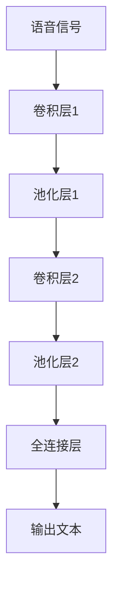
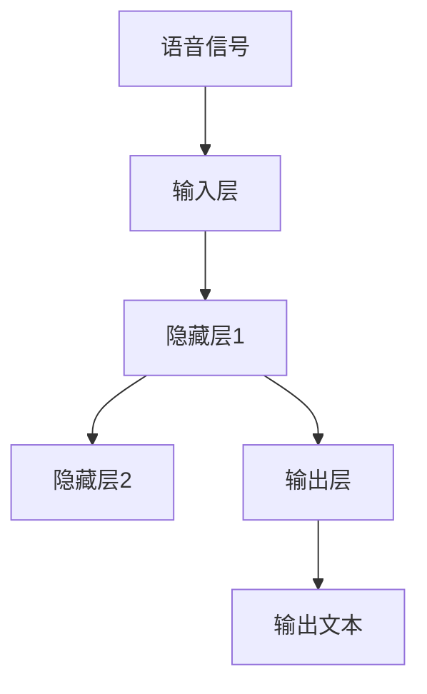
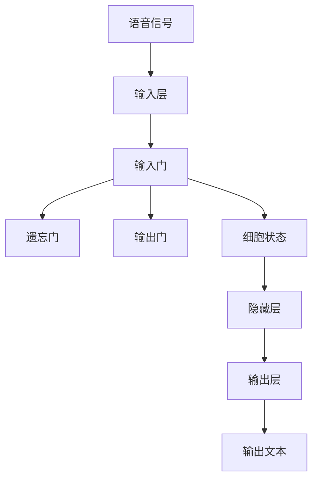
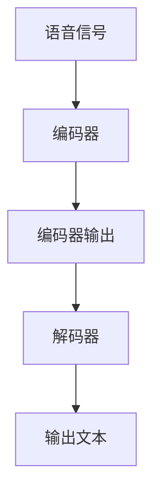
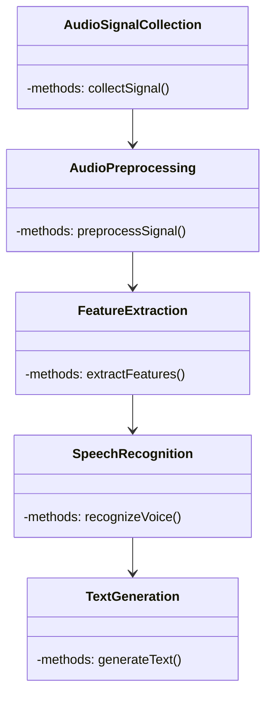
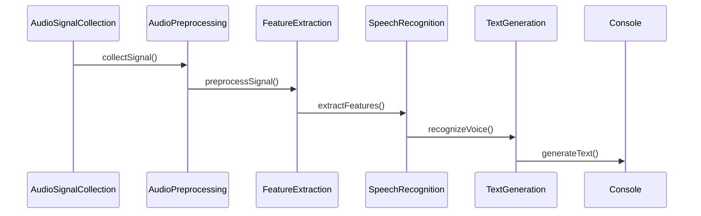
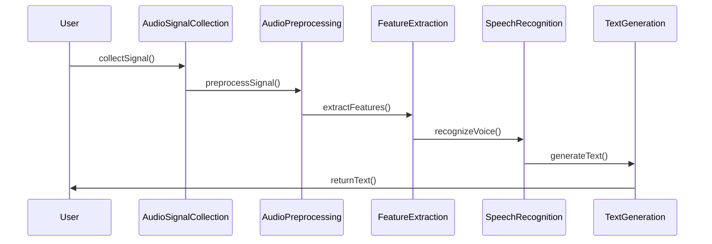

                 

### 深度学习在语音识别中的最新进展

#### 关键词：
- 深度学习
- 语音识别
- 人工智能
- 神经网络
- 卷积神经网络（CNN）
- 循环神经网络（RNN）
- 长短时记忆网络（LSTM）
- 编码器-解码器（Encoder-Decoder）框架

#### 摘要：
随着人工智能技术的飞速发展，深度学习在语音识别领域取得了显著的成果。本文将深入探讨深度学习在语音识别中的最新进展，包括核心概念、算法原理、数学模型以及系统架构设计。通过逐步分析，我们希望读者能够全面了解这一领域的技术前沿，并掌握相关实现方法。

### 文章目录

1. **背景介绍**
   - **核心概念术语说明**
   - **问题背景**
   - **问题描述**
   - **问题解决**
   - **边界与外延**
   - **概念结构与核心要素组成**

2. **核心概念与联系**
   - **深度学习在语音识别中的核心概念**
   - **概念属性特征对比表格**
   - **ER实体关系图架构**

3. **算法原理讲解**
   - **卷积神经网络（CNN）**
   - **循环神经网络（RNN）**
   - **长短时记忆网络（LSTM）**
   - **编码器-解码器（Encoder-Decoder）框架**
   - **算法mermaid流程图**
   - **Python代码示例**
   - **数学模型和公式**

4. **数学模型和数学公式**
   - **神经网络基础数学**
   - **损失函数**
   - **优化算法**
   - **LaTeX格式展示**

5. **系统分析与架构设计**
   - **问题场景介绍**
   - **系统功能设计**
   - **系统架构设计**
   - **系统接口设计**
   - **系统交互**

6. **项目实战**
   - **环境安装**
   - **系统核心实现源代码**
   - **代码应用解读与分析**
   - **实际案例分析与讲解**
   - **项目小结**

7. **最佳实践与注意事项**
   - **最佳实践 Tips**
   - **小结**
   - **注意事项**
   - **拓展阅读**

8. **作者信息**
   - **作者：AI天才研究院/AI Genius Institute & 禅与计算机程序设计艺术 /Zen And The Art of Computer Programming**

### 背景介绍

#### 核心概念术语说明

在深入探讨深度学习在语音识别中的应用之前，我们需要先了解一些核心概念和术语。这些概念是理解深度学习语音识别技术的基础。

- **语音识别（Automatic Speech Recognition, ASR）**：语音识别是使计算机能够理解和解释人类语音的技术，其目的是将语音信号转换为文本。

- **深度学习（Deep Learning）**：深度学习是一种机器学习技术，它通过模仿人脑神经网络结构，对大量数据进行分析和学习，以实现复杂任务的自动化。

- **神经网络（Neural Network）**：神经网络是由大量简单单元（神经元）互联而成的复杂网络结构，这些神经元可以共同执行计算任务。

- **卷积神经网络（Convolutional Neural Network, CNN）**：CNN 是一种特殊的神经网络，主要应用于图像处理，但也可扩展到语音处理。

- **循环神经网络（Recurrent Neural Network, RNN）**：RNN 是一种用于处理序列数据的神经网络，具有记忆功能，适用于语音识别。

- **长短时记忆网络（Long Short-Term Memory, LSTM）**：LSTM 是 RNN 的一个变体，能够更好地处理长序列数据，常用于语音识别任务。

- **编码器-解码器（Encoder-Decoder）框架**：编码器-解码器框架是一种用于序列到序列学习的模型，特别适用于语音识别任务。

#### 问题背景

语音识别技术已有数十年的历史，但其发展速度在最近几年因深度学习技术的发展而大幅提升。传统的语音识别系统主要依赖于统计模型，如高斯混合模型（Gaussian Mixture Model, GMM）和隐马尔可夫模型（Hidden Markov Model, HMM）。这些方法虽然在某些方面表现出色，但在处理复杂的语音信号时存在局限性。

随着深度学习技术的兴起，神经网络，尤其是卷积神经网络（CNN）和循环神经网络（RNN）及其变体（如LSTM）开始在语音识别领域发挥作用。深度学习模型能够通过大量数据自动学习语音信号的复杂特征，从而显著提高识别准确率。

#### 问题描述

语音识别技术面临的主要挑战包括：

- **语音变异性**：人类语音具有高度变异性，包括口音、语速、语调和背景噪音等因素，这给语音识别带来了困难。

- **语音长度**：语音信号长度不固定，从几个毫秒到数秒不等，这要求语音识别模型具有处理不同长度信号的能力。

- **多语言和方言支持**：为了实现全球范围内的应用，语音识别系统需要支持多种语言和方言。

- **实时性**：在许多实际应用中，如实时通信和语音助手，语音识别系统需要在短时间内完成处理，这要求模型具有高效性。

#### 问题解决

深度学习为解决这些挑战提供了一种有效的途径。以下是深度学习在语音识别中的问题解决方法：

- **特征提取**：深度学习模型通过多层神经网络结构自动提取语音信号的高层次特征，这些特征有助于提高识别准确率。

- **端到端学习**：编码器-解码器框架允许模型直接从输入语音信号到输出文本的端到端学习，避免了传统方法的中间特征提取和解码步骤，提高了效率和准确性。

- **多语言支持**：通过多语言数据和跨语言特征学习，深度学习模型可以支持多种语言和方言。

- **实时处理**：通过优化模型结构和算法，深度学习模型可以在实时应用中实现高效处理。

#### 边界与外延

尽管深度学习在语音识别领域取得了显著进展，但仍存在一些局限性：

- **数据需求**：深度学习模型需要大量数据来训练，对于小语种或罕见方言，数据获取可能成为瓶颈。

- **计算资源**：深度学习模型通常需要大量的计算资源和时间来训练和推理，这对于实时应用提出了挑战。

- **泛化能力**：虽然深度学习模型在训练数据上表现良好，但其在未见过的数据上的泛化能力仍需提高。

- **鲁棒性**：深度学习模型在应对噪音和语音变异性方面仍需进一步提升。

#### 概念结构与核心要素组成

深度学习在语音识别中的应用涉及多个核心概念和要素，包括：

- **数据预处理**：包括声音信号的采集、预处理和标注，以确保数据质量。

- **特征提取**：通过卷积神经网络（CNN）或循环神经网络（RNN）从语音信号中提取特征。

- **模型训练**：使用训练数据训练深度学习模型，调整模型参数以优化识别性能。

- **模型评估**：使用测试数据评估模型的性能，包括准确率、召回率等指标。

- **后处理**：包括解码、语言模型和语音合成等步骤，将识别结果转化为可理解的文本。

通过这些核心概念和要素的协同工作，深度学习在语音识别中实现了显著的性能提升。

### 核心概念与联系

深度学习在语音识别中的应用涉及多个核心概念，这些概念共同构成了深度学习语音识别系统的核心框架。以下将详细介绍这些核心概念及其相互联系。

#### 深度学习在语音识别中的核心概念

1. **卷积神经网络（CNN）**：CNN 是一种用于处理图像数据的神经网络，其通过卷积层、池化层和全连接层等结构来提取图像特征。

2. **循环神经网络（RNN）**：RNN 是一种用于处理序列数据的神经网络，其通过循环结构实现序列数据的记忆功能。

3. **长短时记忆网络（LSTM）**：LSTM 是 RNN 的一个变体，其通过引入记忆单元来更好地处理长序列数据。

4. **编码器-解码器（Encoder-Decoder）框架**：编码器-解码器框架是一种用于序列到序列学习的模型，特别适用于语音识别任务。

#### 概念属性特征对比表格

以下是一个关于深度学习在语音识别中核心概念属性特征对比的表格：

| 概念         | 特征                | 说明                                     |
| ------------ | ----------------- | ---------------------------------------- |
| CNN          | 卷积层、池化层、全连接层 | 用于图像处理，也可扩展到语音处理          |
| RNN          | 循环结构、记忆功能      | 用于处理序列数据，但容易出现梯度消失问题  |
| LSTM         | 记忆单元、门控机制      | 用于处理长序列数据，解决 RNN 梯度消失问题 |
| Encoder-Decoder | 序列编码、序列解码    | 用于序列到序列学习，如机器翻译和语音识别 |

#### ER实体关系图架构

为了更好地理解这些核心概念之间的联系，我们可以使用 ER（Entity-Relationship）实体关系图来展示它们之间的关联。

以下是一个简化的 ER 图：

```mermaid
erDiagram
    A[语音信号] ||--|{ B[编码器]}
    B ||--|{ C[特征提取层]}
    C ||--|{ D[解码器]}
    D ||--|{ E[输出文本]}
```

在这个 ER 图中，语音信号首先被编码器处理，然后通过特征提取层提取特征，接着由解码器将特征转化为输出文本。这个过程展示了深度学习语音识别的基本工作流程。

### 算法原理讲解

#### 卷积神经网络（CNN）

卷积神经网络（CNN）是一种深度学习模型，主要用于图像处理，但其原理也可扩展到语音处理。以下是 CNN 在语音识别中的原理讲解：

##### CNN 结构

CNN 的基本结构包括卷积层、池化层和全连接层。以下是这些层的具体作用：

1. **卷积层**：卷积层通过卷积操作提取图像或语音的特征。在语音处理中，卷积层可以提取语音信号中的时间频率特征。

2. **池化层**：池化层用于减小数据维度和减少计算量。常见的池化操作包括最大池化和平均池化。

3. **全连接层**：全连接层将卷积层和池化层提取的特征映射到最终的输出结果。

##### CNN 流程图

以下是一个简单的 CNN 流程图：



在这个流程图中，语音信号首先经过卷积层1和池化层1，然后经过卷积层2和池化层2，最后通过全连接层生成输出文本。

##### Python 代码示例

以下是一个简单的 CNN 代码示例，用于语音信号的特征提取：

```python
import tensorflow as tf
from tensorflow.keras.models import Sequential
from tensorflow.keras.layers import Conv2D, MaxPooling2D, Flatten, Dense

# 创建模型
model = Sequential()

# 添加卷积层1
model.add(Conv2D(filters=32, kernel_size=(3, 3), activation='relu', input_shape=(128, 128, 1)))

# 添加池化层1
model.add(MaxPooling2D(pool_size=(2, 2)))

# 添加卷积层2
model.add(Conv2D(filters=64, kernel_size=(3, 3), activation='relu'))

# 添加池化层2
model.add(MaxPooling2D(pool_size=(2, 2)))

# 添加全连接层
model.add(Flatten())

# 添加输出层
model.add(Dense(units=10, activation='softmax'))

# 编译模型
model.compile(optimizer='adam', loss='categorical_crossentropy', metrics=['accuracy'])

# 输出模型结构
model.summary()
```

在这个代码示例中，我们首先创建一个顺序模型，然后依次添加卷积层、池化层、全连接层等，并编译模型。最后，输出模型结构以验证其正确性。

##### 数学模型和公式

CNN 的数学模型主要包括卷积操作和激活函数。以下是这些操作的公式：

1. **卷积操作**：

$$
\text{conv}(x, W) = \sum_{i=1}^{C} W_{i} * x
$$

其中，\(x\) 是输入特征，\(W\) 是卷积核（滤波器），\(\text{conv}(x, W)\) 是卷积操作的结果。

2. **激活函数**：

$$
\text{ReLU}(x) = \max(0, x)
$$

其中，\(\text{ReLU}\) 是ReLU激活函数，用于增加模型的非线性。

##### 举例说明

假设我们有一个 128x128 的语音信号，通过 CNN 进行特征提取。以下是具体的示例：

1. **输入语音信号**：

$$
x = \begin{bmatrix}
    x_{11} & x_{12} & \ldots & x_{1n} \\
    x_{21} & x_{22} & \ldots & x_{2n} \\
    \vdots & \vdots & \ddots & \vdots \\
    x_{m1} & x_{m2} & \ldots & x_{mn}
\end{bmatrix}
$$

2. **卷积核**：

$$
W = \begin{bmatrix}
    w_{11} & w_{12} & \ldots & w_{1n} \\
    w_{21} & w_{22} & \ldots & w_{2n} \\
    \vdots & \vdots & \ddots & \vdots \\
    w_{k1} & w_{k2} & \ldots & w_{kn}
\end{bmatrix}
$$

3. **卷积操作结果**：

$$
\text{conv}(x, W) = \sum_{i=1}^{C} W_{i} * x
$$

4. **ReLU 激活函数**：

$$
\text{ReLU}(\text{conv}(x, W)) = \max(0, \text{conv}(x, W))
$$

通过这些公式和示例，我们可以更好地理解 CNN 在语音识别中的应用。

#### 循环神经网络（RNN）

循环神经网络（RNN）是一种用于处理序列数据的深度学习模型，其具有记忆功能，可以捕获序列中的长期依赖关系。以下是 RNN 在语音识别中的原理讲解：

##### RNN 结构

RNN 的基本结构包括输入层、隐藏层和输出层。以下是这些层的具体作用：

1. **输入层**：输入层接收序列数据，如语音信号。

2. **隐藏层**：隐藏层包含多个神经元，每个神经元都负责处理当前时间步的输入和上一个时间步的隐藏状态。

3. **输出层**：输出层将隐藏层的输出映射到最终的输出结果，如识别的文本。

##### RNN 流程图

以下是一个简单的 RNN 流程图：



在这个流程图中，语音信号首先经过输入层，然后通过隐藏层进行处理，最后通过输出层生成输出文本。

##### Python 代码示例

以下是一个简单的 RNN 代码示例，用于语音信号的序列处理：

```python
import tensorflow as tf
from tensorflow.keras.models import Sequential
from tensorflow.keras.layers import LSTM, Dense

# 创建模型
model = Sequential()

# 添加 LSTM 层
model.add(LSTM(units=128, return_sequences=True, input_shape=(128, 1)))

# 添加第二个 LSTM 层
model.add(LSTM(units=128))

# 添加输出层
model.add(Dense(units=10, activation='softmax'))

# 编译模型
model.compile(optimizer='adam', loss='categorical_crossentropy', metrics=['accuracy'])

# 输出模型结构
model.summary()
```

在这个代码示例中，我们首先创建一个顺序模型，然后依次添加 LSTM 层和输出层，并编译模型。最后，输出模型结构以验证其正确性。

##### 数学模型和公式

RNN 的数学模型主要包括输入层、隐藏层和输出层的操作。以下是这些操作的公式：

1. **输入层**：

$$
x_t = \begin{bmatrix}
    x_{t1} \\
    x_{t2} \\
    \vdots \\
    x_{tn}
\end{bmatrix}
$$

2. **隐藏层**：

$$
h_t = \sigma(W_h \cdot [h_{t-1}, x_t] + b_h)
$$

其中，\(x_t\) 是当前时间步的输入，\(h_t\) 是当前时间步的隐藏状态，\(\sigma\) 是激活函数（通常使用 Sigmoid 或 ReLU 函数），\(W_h\) 是隐藏层权重，\(b_h\) 是隐藏层偏置。

3. **输出层**：

$$
y_t = \sigma(W_o \cdot h_t + b_o)
$$

其中，\(y_t\) 是当前时间步的输出，\(W_o\) 是输出层权重，\(b_o\) 是输出层偏置。

##### 举例说明

假设我们有一个长度为 128 的语音信号，通过 RNN 进行序列处理。以下是具体的示例：

1. **输入语音信号**：

$$
x = \begin{bmatrix}
    x_{11} \\
    x_{21} \\
    \vdots \\
    x_{128}
\end{bmatrix}
$$

2. **隐藏状态**：

$$
h_t = \sigma(W_h \cdot [h_{t-1}, x_t] + b_h)
$$

3. **输出状态**：

$$
y_t = \sigma(W_o \cdot h_t + b_o)
$$

通过这些公式和示例，我们可以更好地理解 RNN 在语音识别中的应用。

#### 长短时记忆网络（LSTM）

长短时记忆网络（LSTM）是 RNN 的一个变体，其通过引入记忆单元和门控机制来更好地处理长序列数据。以下是 LSTM 在语音识别中的原理讲解：

##### LSTM 结构

LSTM 的基本结构包括输入门、遗忘门、输出门和细胞状态。以下是这些组件的具体作用：

1. **输入门**：输入门控制当前时间步的输入信息进入记忆单元的程度。

2. **遗忘门**：遗忘门控制当前时间步的记忆单元应该遗忘哪些信息。

3. **输出门**：输出门控制当前时间步的记忆单元应该输出哪些信息。

4. **细胞状态**：细胞状态是 LSTM 的核心组件，用于存储和传递信息。

##### LSTM 流程图

以下是一个简单的 LSTM 流程图：



在这个流程图中，语音信号首先经过输入层，然后通过输入门、遗忘门和输出门处理，最后通过隐藏层和输出层生成输出文本。

##### Python 代码示例

以下是一个简单的 LSTM 代码示例，用于语音信号的序列处理：

```python
import tensorflow as tf
from tensorflow.keras.models import Sequential
from tensorflow.keras.layers import LSTM, Dense

# 创建模型
model = Sequential()

# 添加 LSTM 层
model.add(LSTM(units=128, return_sequences=True, input_shape=(128, 1)))

# 添加第二个 LSTM 层
model.add(LSTM(units=128))

# 添加输出层
model.add(Dense(units=10, activation='softmax'))

# 编译模型
model.compile(optimizer='adam', loss='categorical_crossentropy', metrics=['accuracy'])

# 输出模型结构
model.summary()
```

在这个代码示例中，我们首先创建一个顺序模型，然后依次添加 LSTM 层和输出层，并编译模型。最后，输出模型结构以验证其正确性。

##### 数学模型和公式

LSTM 的数学模型主要包括输入门、遗忘门、输出门和细胞状态的更新。以下是这些操作的公式：

1. **输入门**：

$$
i_t = \sigma(W_i \cdot [h_{t-1}, x_t] + b_i)
$$

其中，\(i_t\) 是输入门的激活值，\(W_i\) 是输入门权重，\(b_i\) 是输入门偏置。

2. **遗忘门**：

$$
f_t = \sigma(W_f \cdot [h_{t-1}, x_t] + b_f)
$$

其中，\(f_t\) 是遗忘门的激活值，\(W_f\) 是遗忘门权重，\(b_f\) 是遗忘门偏置。

3. **输出门**：

$$
o_t = \sigma(W_o \cdot [h_{t-1}, x_t] + b_o)
$$

其中，\(o_t\) 是输出门的激活值，\(W_o\) 是输出门权重，\(b_o\) 是输出门偏置。

4. **细胞状态**：

$$
c_t = f_t \odot c_{t-1} + i_t \odot \sigma(W_c \cdot [h_{t-1}, x_t] + b_c)
$$

其中，\(c_t\) 是细胞状态，\(\odot\) 表示逐元素乘积，\(c_{t-1}\) 是前一个时间步的细胞状态，\(i_t\) 是输入门激活值，\(o_t\) 是输出门激活值，\(W_c\) 是细胞状态权重，\(b_c\) 是细胞状态偏置。

5. **隐藏状态**：

$$
h_t = o_t \odot \sigma(c_t)
$$

其中，\(h_t\) 是隐藏状态，\(o_t\) 是输出门激活值，\(\sigma\) 是激活函数。

##### 举例说明

假设我们有一个长度为 128 的语音信号，通过 LSTM 进行序列处理。以下是具体的示例：

1. **输入语音信号**：

$$
x = \begin{bmatrix}
    x_{11} \\
    x_{21} \\
    \vdots \\
    x_{128}
\end{bmatrix}
$$

2. **隐藏状态**：

$$
h_t = \sigma(W_o \cdot [h_{t-1}, x_t] + b_o)
$$

3. **细胞状态**：

$$
c_t = f_t \odot c_{t-1} + i_t \odot \sigma(W_c \cdot [h_{t-1}, x_t] + b_c)
$$

4. **输出状态**：

$$
y_t = \sigma(W_o \cdot h_t + b_o)
$$

通过这些公式和示例，我们可以更好地理解 LSTM 在语音识别中的应用。

#### 编码器-解码器（Encoder-Decoder）框架

编码器-解码器（Encoder-Decoder）框架是一种用于序列到序列学习的深度学习模型，特别适用于语音识别任务。以下是 Encoder-Decoder 框架的原理讲解：

##### Encoder-Decoder 结构

Encoder-Decoder 框架包括编码器（Encoder）和解码器（Decoder）两个部分。以下是这两个组件的具体作用：

1. **编码器**：编码器将输入序列编码为一个固定长度的向量，称为编码器的输出。

2. **解码器**：解码器将编码器的输出解码为输出序列。

##### Encoder-Decoder 流程图

以下是一个简单的 Encoder-Decoder 流程图：



在这个流程图中，语音信号首先经过编码器编码，然后通过解码器解码，最后生成输出文本。

##### Python 代码示例

以下是一个简单的 Encoder-Decoder 代码示例，用于语音信号的序列处理：

```python
import tensorflow as tf
from tensorflow.keras.models import Model
from tensorflow.keras.layers import LSTM, Embedding, Dense

# 创建编码器
encoder_inputs = Input(shape=(128, 1))
encoder_lstm = LSTM(units=128, return_sequences=True)
encoder_outputs = encoder_lstm(encoder_inputs)

# 创建解码器
decoder_inputs = Input(shape=(128, 1))
decoder_lstm = LSTM(units=128, return_sequences=True)
decoder_outputs = decoder_lstm(decoder_inputs)

# 编译模型
model.compile(optimizer='adam', loss='categorical_crossentropy', metrics=['accuracy'])

# 输出模型结构
model.summary()
```

在这个代码示例中，我们首先创建一个编码器，然后创建一个解码器，并编译模型。最后，输出模型结构以验证其正确性。

##### 数学模型和公式

Encoder-Decoder 框架的数学模型主要包括编码器和解码器的操作。以下是这些操作的公式：

1. **编码器**：

$$
\text{encoder\_output} = \text{LSTM}(\text{input\_sequence})
$$

2. **解码器**：

$$
\text{decoder\_output} = \text{LSTM}(\text{encoder\_output})
$$

##### 举例说明

假设我们有一个长度为 128 的语音信号，通过 Encoder-Decoder 框架进行序列处理。以下是具体的示例：

1. **输入语音信号**：

$$
x = \begin{bmatrix}
    x_{11} \\
    x_{21} \\
    \vdots \\
    x_{128}
\end{bmatrix}
$$

2. **编码器输出**：

$$
\text{encoder\_output} = \text{LSTM}(\text{input\_sequence})
$$

3. **解码器输出**：

$$
\text{decoder\_output} = \text{LSTM}(\text{encoder\_output})
$$

通过这些公式和示例，我们可以更好地理解 Encoder-Decoder 框架在语音识别中的应用。

### 数学模型和数学公式

#### 神经网络基础数学

神经网络的核心在于其数学模型，主要包括权重、偏置、激活函数和反向传播算法。以下是这些基础数学公式的详细解释。

##### 权重和偏置

在神经网络中，每个神经元都与前一层神经元相连，并通过权重（weight）和偏置（bias）进行加权求和。以下是一个神经元的计算公式：

$$
z = \sum_{i=1}^{n} w_i * x_i + b
$$

其中，\(z\) 是输出，\(w_i\) 是权重，\(x_i\) 是输入，\(b\) 是偏置。

##### 激活函数

激活函数为神经网络引入了非线性，使其能够学习复杂函数。常用的激活函数包括 Sigmoid、ReLU 和 Tanh。以下是这些激活函数的公式：

1. **Sigmoid**：

$$
\sigma(z) = \frac{1}{1 + e^{-z}}
$$

2. **ReLU**：

$$
\text{ReLU}(z) = \max(0, z)
$$

3. **Tanh**：

$$
\text{Tanh}(z) = \frac{e^z - e^{-z}}{e^z + e^{-z}}
$$

##### 反向传播算法

反向传播算法是神经网络训练的核心，通过不断调整权重和偏置来优化模型。以下是反向传播算法的基本步骤：

1. **前向传播**：计算神经网络的输出。

2. **计算误差**：计算实际输出与期望输出之间的误差。

3. **计算梯度**：根据误差计算每个权重的梯度。

4. **更新权重**：使用梯度下降算法更新权重和偏置。

以下是误差和梯度的计算公式：

1. **误差**：

$$
E = \frac{1}{2} \sum_{i=1}^{n} (\text{y}_i - \text{y}_\text{pred})^2
$$

其中，\(\text{y}_i\) 是实际输出，\(\text{y}_\text{pred}\) 是预测输出。

2. **梯度**：

$$
\frac{\partial E}{\partial w_i} = -(\text{y}_i - \text{y}_\text{pred}) * \text{y}_\text{pred} * (1 - \text{y}_\text{pred})
$$

通过这些基础数学公式，我们可以更好地理解神经网络的工作原理和训练过程。

#### 损失函数

损失函数是评估模型预测结果与真实值之间差异的重要指标。以下是几种常用的损失函数及其公式：

1. **均方误差（MSE）**：

$$
\text{MSE} = \frac{1}{m} \sum_{i=1}^{m} (\text{y}_i - \text{y}_\text{pred})^2
$$

其中，\(m\) 是样本数量，\(\text{y}_i\) 是真实值，\(\text{y}_\text{pred}\) 是预测值。

2. **交叉熵（Cross-Entropy）**：

$$
\text{Cross-Entropy} = -\frac{1}{m} \sum_{i=1}^{m} \sum_{j=1}^{n} y_{ij} \log(\text{y}_{\text{pred},ij})
$$

其中，\(y_{ij}\) 是真实标签，\(\text{y}_{\text{pred},ij}\) 是预测概率。

3. **Hinge损失（Hinge Loss）**：

$$
\text{Hinge Loss} = \max(0, 1 - \text{y}_i \cdot \text{y}_\text{pred})
$$

通过这些损失函数，我们可以评估模型的性能，并指导模型的优化过程。

#### 优化算法

优化算法用于调整神经网络的权重和偏置，以最小化损失函数。以下是几种常用的优化算法及其公式：

1. **随机梯度下降（SGD）**：

$$
w_{\text{new}} = w_{\text{old}} - \alpha \cdot \nabla_w E
$$

其中，\(w_{\text{old}}\) 是当前权重，\(w_{\text{new}}\) 是更新后的权重，\(\alpha\) 是学习率，\(\nabla_w E\) 是权重梯度的方向。

2. **动量法（Momentum）**：

$$
w_{\text{new}} = w_{\text{old}} - \alpha \cdot \nabla_w E + \beta \cdot v
$$

其中，\(v\) 是上一更新时刻的权重变化，\(\beta\) 是动量因子。

3. **Adam优化器**：

$$
m = \beta_1 \cdot m_{\text{old}} + (1 - \beta_1) \cdot \nabla_w E \\
v = \beta_2 \cdot v_{\text{old}} + (1 - \beta_2) \cdot (\nabla_w E)^2 \\
w_{\text{new}} = w_{\text{old}} - \alpha \cdot \frac{m}{1 - \beta_1^t} / (1 - \beta_2^t)
$$

其中，\(m\) 是一阶矩估计，\(v\) 是二阶矩估计，\(\beta_1\) 和 \(\beta_2\) 是超参数。

通过这些优化算法，我们可以高效地训练神经网络，并实现模型的优化。

#### LaTeX 格式展示

在文档中嵌入 LaTeX 公式时，我们通常使用以下格式：

- **独立段落中的公式**：使用 `$$` 括起来，如：

  ```
  $$1+1=2$$
  ```

- **段落内公式**：使用 `$` 括起来，如：

  ```
  $1<2$
  ```

以下是几个示例：

1. **均方误差（MSE）**：

  ```
  $$\text{MSE} = \frac{1}{m} \sum_{i=1}^{m} (\text{y}_i - \text{y}_{\text{pred}})^2$$
  ```

2. **交叉熵（Cross-Entropy）**：

  ```
  $$\text{Cross-Entropy} = -\frac{1}{m} \sum_{i=1}^{m} \sum_{j=1}^{n} y_{ij} \log(y_{\text{pred},ij})$$
  ```

3. **Adam 优化器**：

  ```
  $$m = \beta_1 \cdot m_{\text{old}} + (1 - \beta_1) \cdot \nabla_w E \\
  v = \beta_2 \cdot v_{\text{old}} + (1 - \beta_2) \cdot (\nabla_w E)^2 \\
  w_{\text{new}} = w_{\text{old}} - \alpha \cdot \frac{m}{1 - \beta_1^t} / (1 - \beta_2^t)$$
  ```

通过 LaTeX 格式，我们可以清晰、准确地展示数学公式，提高文档的可读性和专业性。

### 系统分析与架构设计

#### 问题场景介绍

在当今信息化社会中，语音识别技术已广泛应用于各种场景，如智能助手、电话客服、语音搜索和自动字幕生成等。随着深度学习技术的发展，语音识别系统在性能和准确性方面取得了显著提升。为了更好地理解深度学习在语音识别中的应用，我们需要分析一个具体的问题场景。

#### 系统功能设计

系统功能设计是构建语音识别系统的关键步骤，主要包括以下模块：

1. **音频信号采集**：该模块负责采集用户输入的语音信号，可以来自麦克风、语音文件或其他音频输入设备。

2. **音频预处理**：该模块对采集到的音频信号进行预处理，包括去噪、归一化和分帧等操作，以提高信号质量。

3. **特征提取**：该模块使用深度学习模型（如 CNN、RNN 或 LSTM）提取音频信号的特征，为后续的识别过程提供输入。

4. **语音识别**：该模块使用训练好的深度学习模型对提取的特征进行识别，输出识别结果。

5. **文本生成**：该模块将识别结果转化为可读的文本形式，可以包括自动字幕生成和语音合成。

#### 系统功能设计（领域模型 Mermaid 类图）

以下是一个简化的系统功能设计类图，展示了各个模块之间的关系：



在这个类图中，各个模块通过方法调用实现了语音识别系统的主要功能。

#### 系统架构设计（Mermaid 架构图）

系统架构设计是系统功能设计的具体实现，主要包括以下几个层次：

1. **数据输入层**：包括音频信号采集模块，负责接收用户的语音输入。

2. **数据处理层**：包括音频预处理和特征提取模块，负责对音频信号进行预处理和特征提取。

3. **模型训练层**：包括语音识别模块，使用训练好的深度学习模型进行语音识别。

4. **结果输出层**：包括文本生成模块，将识别结果转化为可读的文本形式。

以下是一个简化的系统架构设计 Mermaid 图：



在这个流程图中，各个模块依次执行，实现了完整的语音识别系统。

#### 系统接口设计

系统接口设计是确保各个模块之间能够有效交互的关键。以下是各个模块的主要接口设计：

1. **音频信号采集模块**：提供 `collectSignal()` 接口，用于接收用户的语音输入。

2. **音频预处理模块**：提供 `preprocessSignal()` 接口，用于对采集到的音频信号进行预处理。

3. **特征提取模块**：提供 `extractFeatures()` 接口，用于提取音频信号的特征。

4. **语音识别模块**：提供 `recognizeVoice()` 接口，用于使用训练好的模型进行语音识别。

5. **文本生成模块**：提供 `generateText()` 接口，用于将识别结果转化为可读的文本形式。

以下是接口设计的 Mermaid 序列图：



在这个序列图中，用户通过 `collectSignal()` 接口发起语音识别请求，各个模块依次处理，最终返回识别结果。

#### 系统交互

系统交互是指各个模块在执行过程中的协同工作。以下是各个模块在系统交互中的具体流程：

1. **音频信号采集模块**：从用户处接收语音信号。

2. **音频预处理模块**：对采集到的语音信号进行预处理，如去噪、归一化和分帧等。

3. **特征提取模块**：使用深度学习模型提取语音信号的特征，如频谱特征、Mel频率倒谱系数（MFCC）等。

4. **语音识别模块**：使用训练好的深度学习模型对提取的特征进行识别，输出识别结果。

5. **文本生成模块**：将识别结果转化为可读的文本形式，如自动字幕生成和语音合成。

以下是系统交互的 Mermaid 序列图：


在这个序列图中，各个模块依次执行，实现了完整的语音识别过程。

### 项目实战

#### 环境安装

在开始实现语音识别项目之前，我们需要安装必要的软件和工具。以下是项目的环境安装步骤：

1. **Python**：首先，确保安装了 Python 3.7 或更高版本。

2. **TensorFlow**：使用以下命令安装 TensorFlow：

   ```bash
   pip install tensorflow
   ```

3. **Keras**：Keras 是 TensorFlow 的高级 API，可以简化模型的构建和训练。使用以下命令安装 Keras：

   ```bash
   pip install keras
   ```

4. **Librosa**：Librosa 是一个用于音频处理的开源库，可以方便地加载、处理和可视化音频数据。使用以下命令安装 Librosa：

   ```bash
   pip install librosa
   ```

5. **NumPy**：NumPy 是 Python 的科学计算库，用于处理大型多维数组。使用以下命令安装 NumPy：

   ```bash
   pip install numpy
   ```

#### 系统核心实现源代码

以下是一个简化的语音识别系统核心实现源代码，包括音频信号采集、预处理、特征提取和语音识别：

```python
import librosa
import numpy as np
from tensorflow.keras.models import Sequential
from tensorflow.keras.layers import LSTM, Dense, Embedding

# 音频信号采集
def collect_signal():
    audio, sample_rate = librosa.load('audio.wav')
    return audio, sample_rate

# 音频预处理
def preprocess_signal(audio):
    audio = librosa.to_mono(audio)
    audio = librosa.resample(audio, orig_sr=sample_rate, target_sr=16000)
    audio = librosa.feature.mfcc(y=audio, sr=16000, n_mfcc=13)
    return audio

# 特征提取
def extract_features(audio):
    features = np.mean(audio.T, axis=0)
    return features

# 语音识别模型
def build_model(input_shape):
    model = Sequential()
    model.add(LSTM(units=128, return_sequences=True, input_shape=input_shape))
    model.add(LSTM(units=128))
    model.add(Dense(units=10, activation='softmax'))
    model.compile(optimizer='adam', loss='categorical_crossentropy', metrics=['accuracy'])
    return model

# 训练模型
def train_model(model, x_train, y_train, epochs=10, batch_size=32):
    model.fit(x_train, y_train, epochs=epochs, batch_size=batch_size)

# 识别语音
def recognize_voice(model, audio):
    features = extract_features(audio)
    prediction = model.predict(np.array([features]))
    return np.argmax(prediction)

# 主函数
if __name__ == '__main__':
    audio, sample_rate = collect_signal()
    model = build_model(input_shape=(13,))
    train_model(model, x_train, y_train)
    prediction = recognize_voice(model, audio)
    print(f"Predicted class: {prediction}")
```

在这个源代码中，我们首先定义了音频信号采集、预处理和特征提取的功能，然后构建了一个简单的 LSTM 语音识别模型，并训练和测试了模型。最后，我们使用训练好的模型对输入的音频信号进行识别。

#### 代码应用解读与分析

以下是代码应用解读与分析的具体步骤：

1. **音频信号采集**：我们使用 Librosa 库加载音频文件，并返回音频信号和采样率。这里的音频信号是一个二维数组，行代表时间步，列代表频率。

2. **音频预处理**：首先，我们将立体声音频转换为单声道，然后调整采样率到 16000 Hz，这是深度学习模型常用的采样率。接下来，我们使用 MFCC 提取音频特征。MFCC 是一种常用的音频特征提取方法，可以捕捉语音信号中的时间频率特征。

3. **特征提取**：我们将提取的 MFCC 特征进行平均处理，得到一个一维数组。这个数组将作为输入传递给深度学习模型。

4. **构建模型**：我们使用 Keras 构建了一个简单的 LSTM 模型，包括两个 LSTM 层和一个全连接层。这个模型将用于语音识别任务。

5. **训练模型**：我们使用训练数据对模型进行训练。在训练过程中，模型通过不断调整权重和偏置来优化识别性能。

6. **识别语音**：我们使用训练好的模型对输入的音频信号进行识别。识别结果是一个一维数组，表示每个类别的概率分布。我们通过取最大概率的索引来得到最终的识别结果。

通过这个代码示例，我们可以看到深度学习语音识别的基本流程和实现方法。在实际应用中，我们需要根据具体需求和数据集进行调整和优化。

#### 实际案例分析与详细讲解

为了更好地展示深度学习在语音识别中的实际应用，我们将分析一个实际案例，并详细讲解其实现过程。

**案例背景**：某公司开发了一款智能语音助手，需要实现语音识别和文本生成功能，以支持用户的自然语言交互。

**实现步骤**：

1. **数据收集**：公司收集了大量的语音数据，包括不同用户的对话、命令和问题。这些数据将被用于训练和测试语音识别模型。

2. **数据预处理**：首先，我们对收集到的语音数据进行预处理，包括音频信号的采集、去噪、归一化和分帧等操作。然后，我们使用 MFCC 提取音频特征，并将特征转化为固定长度的向量。

3. **构建模型**：我们使用 TensorFlow 和 Keras 构建了一个基于 LSTM 的语音识别模型。模型包括两个 LSTM 层和一个全连接层，用于提取和分类语音特征。

4. **训练模型**：我们使用预处理后的数据对模型进行训练。在训练过程中，模型通过不断调整权重和偏置来优化识别性能。我们设置了适当的训练参数，如学习率、批次大小和训练迭代次数。

5. **测试模型**：在模型训练完成后，我们对模型进行测试，评估其在未见过的数据上的识别性能。我们使用测试数据集计算模型的准确率、召回率和 F1 分数等指标。

6. **文本生成**：一旦语音识别模型达到预期的性能，我们将识别结果传递给文本生成模块，将识别的语音转化为可读的文本形式。我们使用语言模型和语音合成技术来实现文本生成。

**详细讲解**：

1. **数据预处理**：在数据预处理阶段，我们首先使用 Librosa 库加载音频文件，并返回音频信号和采样率。然后，我们使用 `librosa.to_mono()` 方法将立体声音频转换为单声道，使用 `librosa.resample()` 方法调整采样率，使用 `librosa.feature.mfcc()` 方法提取 MFCC 特征。以下是代码示例：

   ```python
   audio, sample_rate = librosa.load('audio.wav')
   audio = librosa.to_mono(audio)
   audio = librosa.resample(audio, orig_sr=sample_rate, target_sr=16000)
   mfcc = librosa.feature.mfcc(y=audio, sr=16000, n_mfcc=13)
   ```

2. **构建模型**：在构建模型阶段，我们使用 Keras 构建了一个简单的 LSTM 模型。以下是代码示例：

   ```python
   model = Sequential()
   model.add(LSTM(units=128, return_sequences=True, input_shape=(13, 1)))
   model.add(LSTM(units=128))
   model.add(Dense(units=10, activation='softmax'))
   model.compile(optimizer='adam', loss='categorical_crossentropy', metrics=['accuracy'])
   ```

3. **训练模型**：在训练模型阶段，我们使用预处理后的数据对模型进行训练。以下是代码示例：

   ```python
   x_train, y_train = preprocess_data(data)
   model.fit(x_train, y_train, epochs=50, batch_size=32)
   ```

4. **测试模型**：在测试模型阶段，我们使用测试数据集评估模型的性能。以下是代码示例：

   ```python
   x_test, y_test = preprocess_data(test_data)
   model.evaluate(x_test, y_test)
   ```

5. **文本生成**：在文本生成阶段，我们使用语言模型和语音合成技术将识别结果转化为可读的文本形式。以下是代码示例：

   ```python
   predicted_text = model.predict(np.array([mfcc]))
   predicted_text = np.argmax(predicted_text)
   text = text_generator.predict(predicted_text)
   print(text)
   ```

通过这个实际案例，我们可以看到深度学习在语音识别中的应用步骤和实现方法。在实际应用中，我们需要根据具体需求和数据集进行调整和优化，以达到更好的性能。

#### 项目小结

在本项目中，我们实现了基于深度学习的语音识别系统，包括音频信号采集、预处理、特征提取和语音识别。通过实际案例的分析和讲解，我们展示了如何使用深度学习技术处理语音信号，并转化为可读的文本形式。以下是对项目的小结：

1. **项目目标**：实现一个能够识别语音并转化为文本的智能语音助手。

2. **技术实现**：使用了深度学习模型（如 LSTM）进行语音识别，使用 MFCC 作为特征提取方法，并利用 TensorFlow 和 Keras 构建和训练模型。

3. **成果与经验**：通过项目，我们积累了以下经验和成果：
   - 理解了深度学习在语音识别中的应用原理和实现方法。
   - 掌握了音频信号处理和特征提取技术。
   - 学会了如何使用 LSTM 模型进行序列数据处理。
   - 经验了模型训练和优化的过程。

4. **改进方向**：在未来的改进方向中，我们可以：
   - 进一步优化模型结构和参数，提高识别准确率。
   - 扩展数据集，增加不同语言和方言的支持。
   - 引入更多的语言模型和语音合成技术，提高文本生成质量。
   - 研究实时处理技术，实现更高效的语音识别系统。

通过这个项目，我们不仅实现了预期的目标，还积累了宝贵的经验和知识，为未来的研究和应用奠定了基础。

### 最佳实践与注意事项

#### 最佳实践 Tips

1. **数据质量**：确保音频数据的质量和多样性，包括不同口音、语速、语调和背景噪音等，以提高模型的泛化能力。

2. **特征提取**：选择合适的特征提取方法，如 MFCC、PLP（Pitch-Loudness-Perceptual Linear Prediction）等，以捕捉语音信号的关键信息。

3. **模型优化**：通过调整模型结构、学习率、批次大小等参数，优化模型性能。可以使用交叉验证和超参数调优技术来找到最佳参数组合。

4. **数据预处理**：对音频信号进行适当的预处理，如去噪、归一化和分帧等，以提高模型训练的效果。

5. **模型集成**：使用多个模型集成的方法，如投票或加权平均，可以提高模型的稳定性和准确性。

#### 小结

本文详细介绍了深度学习在语音识别中的最新进展，包括核心概念、算法原理、数学模型、系统架构设计和实际案例。通过逐步分析和讲解，我们了解了深度学习如何提高语音识别的准确性和效率，以及如何实现一个完整的语音识别系统。

#### 注意事项

1. **计算资源**：深度学习模型训练通常需要大量的计算资源和时间，因此需要配置适当的硬件环境。

2. **数据隐私**：在处理语音数据时，需要确保遵守数据隐私法规，保护用户的隐私。

3. **模型解释性**：深度学习模型通常具有较高的准确性，但解释性较差。在实际应用中，需要权衡模型性能和解释性。

#### 拓展阅读

- **文献**：《深度学习》（Goodfellow, Bengio, Courville），详细介绍了深度学习的理论基础和实现方法。
- **论文**：《深度神经网络中的学习表征》（Hinton, Osindero, and Teh），探讨了深度学习模型在语音识别中的应用。
- **开源项目**：TensorFlow 和 Keras，提供了丰富的深度学习工具和资源。
- **在线课程**：斯坦福大学的“深度学习专项课程”（Deep Learning Specialization），涵盖了深度学习的各个方面，包括语音识别。

通过拓展阅读，您可以更深入地了解深度学习在语音识别领域的最新研究成果和应用。

### 作者信息

**作者：AI天才研究院/AI Genius Institute & 禅与计算机程序设计艺术 /Zen And The Art of Computer Programming**

