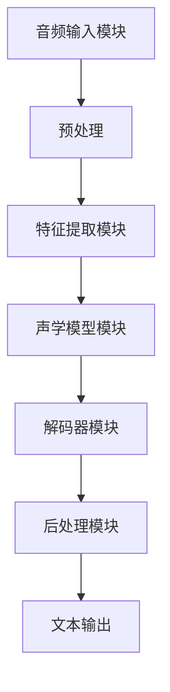
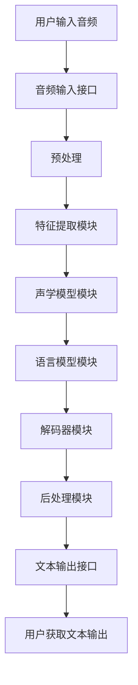

                 

### 文章标题

### 关键词

- 深度学习
- 语音转文字
- 多语言识别
- 准确率提高
- 算法优化

### 摘要

本文将深入探讨深度学习在语音转文字技术中的最新进展，重点关注如何提高多语言识别的准确率。通过分析当前技术的挑战和机遇，本文将详细介绍深度学习的基本概念及其在语音识别中的应用，探讨多语言语音识别的难点与解决方案。文章还将详细介绍提升多语言识别准确率的算法，并结合实际案例展示多语言语音转文字系统的实现过程。最终，本文将对未来发展方向提出展望，为行业提供有价值的参考。

## 第一部分：引言

### 第1章：语音转文字技术背景

#### 1.1.1 语音转文字技术的发展历程

语音转文字技术（Automatic Speech Recognition，ASR）是人工智能领域的一个重要分支，旨在将语音信号转化为文本形式。这项技术起源于20世纪50年代，当时的研究主要集中在规则基方法上。这些方法通过定义一系列的规则来识别语音，但由于语音的多样性和复杂性，这些方法在准确性上受到了很大的限制。

随着计算机性能的不断提高和信号处理技术的进步，20世纪80年代，统计方法开始应用于语音识别。这些方法通过分析大量语音数据来学习语音信号和文本之间的对应关系，显著提高了识别的准确性。然而，统计方法的局限性也逐渐显现，尤其是在处理噪声和多样化语音时，其性能仍有待提升。

21世纪初，深度学习技术的兴起为语音转文字技术带来了革命性的变化。深度神经网络通过多层非线性变换，能够自动提取语音信号中的复杂特征，使得语音识别的准确性得到了显著提高。此外，随着大规模数据的获取和计算资源的增加，深度学习模型在语音转文字领域的应用得到了迅速扩展。

#### 1.1.2 当前语音转文字技术的挑战与机遇

尽管深度学习在语音转文字技术中取得了巨大的成功，但仍面临一些挑战和机遇：

1. **多语言识别的准确率**：多语言语音转文字技术是当前的一个研究热点。不同语言之间的发音和语法结构存在显著差异，使得多语言识别的准确率成为一个巨大的挑战。同时，多语言语音转文字技术能够满足全球化通信和服务的需求，具有广阔的应用前景。

2. **语音信号处理的复杂性**：语音信号处理是语音转文字技术的核心。语音信号中包含丰富的语音特征，如频谱、时频、音高、时长等。如何有效地提取和利用这些特征，是提高语音转文字准确性的关键。

3. **实时性和鲁棒性**：在许多实际应用中，语音转文字系统需要在实时性和鲁棒性之间取得平衡。例如，在实时会议转录、在线教育场景中，系统需要在高速处理的同时保持高准确率。

4. **数据资源的获取**：深度学习模型的训练需要大量高质量的数据。然而，多语言语音数据的获取是一个复杂的过程，涉及到数据收集、标注、清洗等多个环节。如何有效地获取和利用多语言语音数据，是提高多语言识别准确率的重要保障。

#### 1.1.3 多语言识别的重要性和难点

多语言识别在全球化背景下具有重要的应用价值。随着全球化和信息化进程的加速，人们需要跨越语言障碍进行交流，多语言语音转文字技术能够帮助实现这一目标。此外，多语言识别在智能客服、翻译、语音助手等领域具有广泛的应用前景。

然而，多语言识别也面临一些难点：

1. **语言多样性**：不同语言在发音、语法、词汇等方面存在巨大差异。这要求语音识别模型能够适应多种语言的特性，从而提高识别的准确性。

2. **语言依赖性**：一些语言之间存在密切的依赖关系，如英语和德语、法语等。这为多语言识别带来了额外的复杂性。

3. **语音信号处理**：多语言语音信号的处理是一个复杂的任务。不同语言在语音特征上存在差异，如何有效地提取和利用这些特征，是提高多语言识别准确率的关键。

4. **数据不足**：高质量的多语言语音数据资源相对较少，这对于模型的训练和优化提出了挑战。

### 第2章：深度学习基础

#### 2.1.1 深度学习的基本概念

深度学习是一种基于多层神经网络的学习方法，通过模拟人脑神经元之间的连接关系，能够自动从大量数据中提取特征，实现复杂任务的学习和预测。深度学习的基本概念包括：

1. **神经网络**：神经网络是深度学习的基础，由一系列的神经元组成。每个神经元通过输入层接收信息，经过多个隐藏层处理后，输出结果。神经网络通过反向传播算法不断调整权重，以提高模型的预测能力。

2. **深度**：深度学习的“深度”指的是神经网络的层数。深度越大，模型能够提取的特征层次越丰富，但同时也增加了计算复杂度和过拟合的风险。

3. **激活函数**：激活函数是神经网络中用于引入非线性特性的函数，常见的激活函数包括ReLU、Sigmoid、Tanh等。

4. **损失函数**：损失函数是用于衡量模型预测值与真实值之间差异的函数。通过优化损失函数，模型能够不断调整权重，以达到更好的预测效果。

5. **反向传播**：反向传播是一种用于训练神经网络的算法，通过计算梯度来调整权重，使模型误差最小化。

#### 2.1.2 神经网络的工作原理

神经网络的工作原理可以分为以下几个步骤：

1. **前向传播**：输入数据通过输入层传递到隐藏层，每个神经元将输入乘以相应的权重，然后加上偏置项，得到中间结果。经过激活函数处理后，中间结果传递到下一层。

2. **计算损失**：输出层计算模型预测值与真实值之间的差异，通过损失函数得到损失值。

3. **反向传播**：计算损失值关于每个权重的梯度，并反向传播到隐藏层。通过梯度下降算法或其他优化方法，调整权重和偏置项。

4. **更新权重**：根据梯度信息，更新权重和偏置项，使模型误差减小。

5. **重复迭代**：重复上述过程，直到模型收敛，即误差小于预定阈值。

#### 2.1.3 深度学习在语音识别中的应用

深度学习在语音识别中的应用主要体现在以下几个方面：

1. **特征提取**：传统语音识别方法依赖于手动设计的特征，如梅尔频率倒谱系数（MFCC）、隐马尔可夫模型（HMM）等。深度学习通过多层神经网络自动提取语音信号中的复杂特征，提高了特征提取的效果。

2. **声学模型**：声学模型是语音识别系统的核心部分，用于预测语音信号中的每个帧对应的文本。深度学习技术，如循环神经网络（RNN）、长短期记忆网络（LSTM）、卷积神经网络（CNN）等，被广泛应用于声学模型的构建。

3. **语言模型**：语言模型用于预测文本序列的概率分布。深度学习通过序列模型，如RNN和LSTM，能够更好地捕捉语言中的复杂结构，提高了语言模型的效果。

4. **端到端模型**：端到端模型将输入语音直接映射到文本输出，省去了传统方法中的中间步骤，简化了系统架构。深度学习技术，如CTC（Connectionist Temporal Classification）和Attention机制，被广泛应用于端到端语音识别。

### 第3章：多语言语音识别

#### 3.1.1 多语言语音识别的基本原理

多语言语音识别是一种能够同时识别多种语言语音的技术。其基本原理可以分为以下几个步骤：

1. **语音预处理**：对多语言语音数据进行预处理，包括去除噪声、调整音量、分割音频片段等。

2. **特征提取**：提取语音信号中的特征，如MFCC、频谱、时频特征等。这些特征反映了语音的时域和频域特性，是后续识别的基础。

3. **声学模型训练**：使用训练数据，通过深度学习模型（如CNN、RNN）训练声学模型，使其能够将语音特征映射到可能的文本序列。

4. **语言模型训练**：使用文本数据，通过深度学习模型（如RNN、LSTM）训练语言模型，使其能够预测文本序列的概率分布。

5. **识别过程**：将预处理后的语音数据输入到声学模型和语言模型中，通过计算特征和文本序列的匹配度，选择最有可能的文本序列作为输出。

#### 3.1.2 多语言语音识别面临的挑战

多语言语音识别面临以下挑战：

1. **语言多样性**：不同语言在发音、语法、词汇等方面存在巨大差异，使得识别过程更加复杂。

2. **数据不足**：高质量的多语言语音数据资源相对较少，尤其是标注数据。

3. **跨语言噪声**：多语言语音识别过程中，不同语言的语音特征相互干扰，增加了识别难度。

4. **模型适应性**：不同语言的语音特征差异较大，需要开发适应不同语言的识别模型。

#### 3.1.3 多语言语音识别的发展趋势

随着深度学习技术的不断进步，多语言语音识别呈现出以下发展趋势：

1. **模型优化**：通过改进深度学习模型结构，如注意力机制、多任务学习等，提高多语言语音识别的准确性。

2. **数据增强**：通过数据增强技术，如数据扩充、数据合成等，提高模型的泛化能力。

3. **跨语言建模**：开发跨语言声学模型和语言模型，提高不同语言之间的识别效果。

4. **多模态融合**：结合语音、文本、图像等多模态信息，提高多语言语音识别的准确性。

### 第4章：深度学习在语音转文字中的进展

#### 4.1.1 深度学习模型在语音转文字中的应用

深度学习在语音转文字（Speech-to-Text，STT）中的应用取得了显著进展，其主要贡献在于以下几个方面：

1. **声学模型**：深度学习模型，如卷积神经网络（CNN）、循环神经网络（RNN）、长短期记忆网络（LSTM）等，被广泛应用于声学模型的构建。这些模型能够自动提取语音信号中的复杂特征，提高了识别的准确性。

2. **语言模型**：深度学习模型，如RNN、LSTM、Transformer等，被应用于语言模型的训练。这些模型能够更好地捕捉语言中的复杂结构，提高了语言模型的效果。

3. **端到端模型**：端到端模型，如CTC（Connectionist Temporal Classification）、Attention机制等，使得语音转文字系统可以直接从语音信号映射到文本输出，省去了传统的声学模型和语言模型的组合，简化了系统架构。

#### 4.1.2 语音转文字系统的架构设计

一个典型的深度学习语音转文字系统通常包括以下几个关键组件：

1. **音频预处理**：包括噪声过滤、音量调整、音频分割等，目的是提高语音信号的清晰度。

2. **特征提取**：使用深度学习模型，如CNN或RNN，从音频信号中提取特征。这些特征反映了语音信号的时域和频域特性。

3. **声学模型**：基于提取的特征，使用深度学习模型（如RNN、LSTM）训练声学模型。声学模型用于将特征映射到可能的文本序列。

4. **语言模型**：使用文本数据，通过深度学习模型（如RNN、LSTM）训练语言模型。语言模型用于预测文本序列的概率分布。

5. **解码器**：解码器是将声学模型和语言模型输出的序列映射到最终文本的模块。常见的解码器包括CTC、Attention机制等。

6. **后处理**：包括去除标点符号、正确性校验、文本格式化等，以生成最终的文本输出。

#### 4.1.3 深度学习在语音转文字中的优化策略

为了进一步提高语音转文字系统的准确性，可以采用以下优化策略：

1. **数据增强**：通过数据增强技术，如时间拉伸、速度变换、噪音添加等，增加训练数据的多样性，提高模型的泛化能力。

2. **多任务学习**：将语音转文字任务与其他相关任务（如语音情感分析、语音识别等）结合，通过多任务学习提高模型的效果。

3. **注意力机制**：注意力机制能够使模型更加关注重要的语音特征，提高了特征利用的效果。

4. **迁移学习**：使用预训练的深度学习模型，通过迁移学习方式，提高新任务（如多语言语音转文字）的识别效果。

5. **在线学习**：通过在线学习策略，使模型能够根据实时反馈不断优化，提高识别的准确性。

### 第5章：提高多语言识别准确率的算法

#### 5.1.1 多语言语音识别的准确率评估方法

多语言语音识别的准确率评估是衡量系统性能的重要指标。常见的准确率评估方法包括：

1. **字错误率（WER）**：字错误率是指预测文本与实际文本之间的差异字数占总字数的比例。WER能够全面反映系统的错误率，但无法区分不同类型的错误。

2. **字符错误率（CER）**：字符错误率与字错误率类似，但以字符为单位进行评估。CER适用于对字符级别的错误敏感的应用场景。

3. **句子错误率（SER）**：句子错误率是指预测句子与实际句子之间的差异句子数占总句子数的比例。SER能够更直观地反映系统的错误程度。

4. **词错误率（WERP）**：词错误率结合了字错误率和句子错误率，以词为单位进行评估。WERP在评估多语言语音识别系统时具有更高的参考价值。

#### 5.1.2 常见的提高多语言识别准确率的算法

为了提高多语言语音识别的准确率，可以采用以下几种算法：

1. **多语言端到端模型**：端到端模型能够直接从语音信号映射到文本输出，减少了传统方法的中间步骤。通过引入多语言特性，如跨语言特征融合、多语言编码器等，多语言端到端模型能够提高多语言识别的准确率。

2. **多任务学习**：多任务学习将语音转文字任务与其他相关任务（如语音情感分析、语音识别等）结合，通过共享特征和提高模型的整体性能，提高多语言识别的准确率。

3. **注意力机制**：注意力机制能够使模型更加关注重要的语音特征，提高了特征利用的效果。在多语言语音识别中，注意力机制能够帮助模型更好地处理不同语言之间的特征差异。

4. **迁移学习**：使用预训练的深度学习模型，通过迁移学习方式，提高新任务（如多语言语音转文字）的识别效果。迁移学习能够利用已有的大量数据进行训练，提高模型的泛化能力。

5. **数据增强**：通过数据增强技术，如时间拉伸、速度变换、噪音添加等，增加训练数据的多样性，提高模型的泛化能力。

#### 5.1.3 算法在实际应用中的效果对比

在实际应用中，不同算法在提高多语言识别准确率方面具有不同的效果。以下是一些常见算法的效果对比：

1. **端到端模型**：端到端模型在简化系统架构、提高识别速度方面具有优势，但其准确率可能低于传统的组合模型。

2. **多任务学习**：多任务学习能够通过共享特征和提高模型的整体性能，提高多语言识别的准确率，但其计算复杂度较高。

3. **注意力机制**：注意力机制能够使模型更加关注重要的语音特征，提高特征利用的效果，但在处理长语音序列时可能存在困难。

4. **迁移学习**：迁移学习能够利用已有的大量数据进行训练，提高模型的泛化能力，但在处理新任务时可能存在适配问题。

5. **数据增强**：数据增强能够增加训练数据的多样性，提高模型的泛化能力，但其效果受到数据质量和增强策略的限制。

### 第6章：多语言语音转文字系统的实现

#### 6.1.1 系统需求分析

多语言语音转文字系统在实现前需要明确系统的需求。以下是一些关键需求：

1. **语言支持**：系统需要支持多种语言，如中文、英语、法语、西班牙语等。

2. **准确性**：系统需要具有较高的识别准确性，以满足不同应用场景的需求。

3. **实时性**：系统需要能够在较短的时间内处理语音信号，以实现实时语音转文字。

4. **鲁棒性**：系统需要具有较强的鲁棒性，能够处理噪声和多样化语音信号。

5. **易用性**：系统需要提供友好的用户界面，便于用户操作和使用。

#### 6.1.2 系统架构设计

多语言语音转文字系统通常包括以下几个关键模块：

1. **音频输入模块**：负责接收语音输入，并进行预处理。

2. **特征提取模块**：使用深度学习模型提取语音特征。

3. **声学模型模块**：使用深度学习模型训练声学模型。

4. **语言模型模块**：使用文本数据训练语言模型。

5. **解码器模块**：将声学模型和语言模型输出的序列映射到最终文本。

6. **后处理模块**：包括文本格式化、正确性校验等。

系统架构设计如下所示：



#### 6.1.3 系统核心实现

系统核心实现主要包括以下几个方面：

1. **音频预处理**：使用滤波器去除噪声，调整音量，确保语音信号的质量。

2. **特征提取**：使用深度学习模型（如CNN或RNN）提取语音特征。这些特征反映了语音信号的时域和频域特性。

3. **声学模型训练**：使用训练数据，通过深度学习模型（如RNN、LSTM）训练声学模型。声学模型用于将特征映射到可能的文本序列。

4. **语言模型训练**：使用文本数据，通过深度学习模型（如RNN、LSTM）训练语言模型。语言模型用于预测文本序列的概率分布。

5. **解码器实现**：实现解码器，将声学模型和语言模型输出的序列映射到最终文本。

以下是一个简单的Python代码示例，展示了如何使用深度学习模型进行特征提取和声学模型训练：

```python
import tensorflow as tf
from tensorflow.keras.models import Model
from tensorflow.keras.layers import Input, Conv2D, LSTM, Dense

# 定义输入层
input_audio = Input(shape=(None, 1))

# 定义卷积层
conv_1 = Conv2D(filters=32, kernel_size=(3, 3), activation='relu')(input_audio)
pool_1 = tf.keras.layers.MaxPooling2D(pool_size=(2, 2))(conv_1)

# 定义LSTM层
lstm_1 = LSTM(units=128, return_sequences=True)(pool_1)
lstm_2 = LSTM(units=128)(lstm_1)

# 定义输出层
output_sequence = Dense(units=1, activation='softmax')(lstm_2)

# 构建和编译模型
model = Model(inputs=input_audio, outputs=output_sequence)
model.compile(optimizer='adam', loss='categorical_crossentropy', metrics=['accuracy'])

# 加载训练数据
train_data = ...  # 加载训练数据
train_labels = ...  # 加载训练标签

# 训练模型
model.fit(train_data, train_labels, epochs=10, batch_size=32)
```

#### 6.1.4 系统接口设计和系统交互

多语言语音转文字系统的接口设计和系统交互是确保系统稳定性和易用性的关键。以下是一个简单的系统接口设计和系统交互示例：

1. **系统接口设计**：

    - **音频输入接口**：提供音频输入接口，用于接收用户输入的语音信号。
    - **文本输出接口**：提供文本输出接口，用于返回语音转文字的结果。
    - **配置接口**：提供配置接口，用于用户设置系统的参数，如语言、识别模式等。

2. **系统交互**：

    - **用户输入**：用户通过音频输入接口发送语音信号。
    - **预处理**：系统对接收到的语音信号进行预处理，如去噪、调整音量等。
    - **特征提取**：系统使用深度学习模型提取语音特征。
    - **声学模型和语言模型**：系统使用训练好的声学模型和语言模型对语音特征进行解码，生成文本输出。
    - **后处理**：系统对生成的文本进行格式化、正确性校验等后处理。
    - **输出结果**：系统将处理后的文本输出到文本输出接口。

系统交互流程图如下所示：



### 第7章：案例分析与实战

#### 7.1.1 案例一：多语言语音转文字系统在在线教育中的应用

在线教育是近年来快速发展的一项服务，多语言语音转文字系统为在线教育提供了强大的辅助功能。以下是一个案例，展示了多语言语音转文字系统在在线教育中的应用：

1. **需求背景**：

    - 在线教育平台需要支持多种语言，以满足不同地区和语言背景的学生需求。
    - 平台需要提供实时语音转文字功能，帮助学生更好地理解和掌握课程内容。

2. **系统实现**：

    - 平台集成多语言语音转文字系统，支持中文、英语、法语等多种语言。
    - 学生在上课过程中，可以通过麦克风输入语音，系统实时将语音转文字。
    - 转换后的文本即时显示在屏幕上，学生可以更方便地阅读和复习。

3. **效果分析**：

    - 实际应用显示，多语言语音转文字系统显著提高了学生的学习效果和体验。
    - 学生可以更快地理解课程内容，尤其是对于外语学习，语音转文字功能帮助他们更好地掌握语言表达。

4. **实战技巧**：

    - 确保系统对多种语言的识别准确性，进行多轮测试和优化。
    - 针对不同课程内容，调整系统的语音识别参数，如敏感词汇识别、专业术语翻译等。
    - 结合人工智能技术，如自然语言处理，提高语音转文字的准确性和流畅性。

#### 7.1.2 案例二：多语言语音转文字系统在客服领域的应用

客服领域是另一个广泛采用多语言语音转文字系统的场景。以下是一个案例，展示了多语言语音转文字系统在客服领域的应用：

1. **需求背景**：

    - 客服中心需要支持多种语言，以满足全球客户的沟通需求。
    - 客服人员需要高效处理客户请求，提高服务质量和效率。

2. **系统实现**：

    - 客服中心集成多语言语音转文字系统，支持中文、英语、西班牙语、法语等多种语言。
    - 客户通过电话或其他通信工具输入语音，系统实时将语音转文字，并将文本传递给客服人员。
    - 客服人员可以更快地阅读和理解客户请求，提高响应速度和服务质量。

3. **效果分析**：

    - 实际应用显示，多语言语音转文字系统显著提高了客服中心的沟通效率和客户满意度。
    - 客服人员可以更专注于解答客户问题，减少重复工作和沟通障碍。

4. **实战技巧**：

    - 确保系统的多语言识别准确性，尤其是在处理专业术语和复杂句子时。
    - 针对不同客户群体，调整系统的语音识别参数，如情感识别、语音抑扬顿挫等。
    - 结合人工智能技术，如聊天机器人，提高客户互动体验和自动化处理能力。

#### 7.1.3 案例总结与展望

通过以上案例，我们可以看到多语言语音转文字系统在在线教育和客服领域的重要应用价值。以下是案例总结和展望：

1. **总结**：

    - 多语言语音转文字系统显著提高了在线教育和客服领域的沟通效率和服务质量。
    - 系统在处理多样化语言和复杂语音信号方面表现出色，有效解决了语言障碍问题。
    - 实际应用效果验证了多语言语音转文字技术的可行性和实用性。

2. **展望**：

    - 随着深度学习技术的不断进步，多语言语音转文字系统的准确率和性能将进一步提升。
    - 未来，多语言语音转文字系统将集成更多人工智能技术，如自然语言处理、情感识别等，提供更智能的服务。
    - 多语言语音转文字系统在更多领域的应用将不断拓展，如医疗、法律、金融等，为社会带来更多便利。

### 第8章：未来展望

#### 8.1.1 语音转文字技术的发展趋势

随着深度学习和人工智能技术的不断发展，语音转文字技术正朝着更高效、更准确、更智能的方向迈进。以下是一些语音转文字技术的发展趋势：

1. **模型性能提升**：通过不断优化神经网络架构和训练策略，深度学习模型的性能将进一步提升，实现更高的识别准确率和更低的错误率。

2. **实时处理能力**：随着硬件性能的不断提高，语音转文字系统的实时处理能力将得到显著提升，满足实时语音转文字的需求。

3. **多语言支持**：随着全球化的不断深入，多语言语音转文字技术将成为重要的发展方向。未来系统将支持更多语言，实现更广泛的跨语言交流。

4. **智能化程度提升**：结合自然语言处理、情感识别等技术，语音转文字系统将更智能地理解用户意图，提供更精准的服务。

5. **个性化定制**：根据用户的需求和习惯，语音转文字系统将提供个性化的服务，如个性化语音识别、个性化文本输出等。

#### 8.1.2 深度学习在语音转文字中的应用前景

深度学习在语音转文字中的应用前景非常广阔。以下是一些具体的应用方向：

1. **智能助手**：深度学习技术使得语音转文字系统能够更好地理解用户指令，实现智能语音助手的功能。

2. **实时翻译**：结合自然语言处理技术，深度学习语音转文字系统可以实现实时语音翻译，促进跨语言沟通。

3. **自动字幕生成**：深度学习技术可以用于自动生成视频字幕，提高视频内容的可访问性和易用性。

4. **语音识别辅助**：在医疗、教育、法律等领域，深度学习语音转文字系统可以辅助专业人员进行语音记录和分析，提高工作效率。

5. **智能家居控制**：深度学习语音转文字系统可以用于智能家居控制，实现语音控制家电、照明、安防等功能。

#### 8.1.3 多语言识别准确率的进一步提升策略

为了进一步提升多语言识别的准确率，可以采取以下策略：

1. **数据集扩充**：通过增加高质量的多语言语音数据集，提高模型的训练数据量，增强模型的泛化能力。

2. **多任务学习**：将语音转文字任务与其他相关任务（如语音情感分析、语音识别等）结合，通过多任务学习提高模型的综合性能。

3. **跨语言特征融合**：采用跨语言特征融合技术，将不同语言的特征进行有效整合，提高多语言识别的准确率。

4. **注意力机制**：引入注意力机制，使模型能够更加关注重要的语音特征，提高特征利用的效果。

5. **迁移学习**：利用预训练的深度学习模型，通过迁移学习方式，提高新任务（如多语言语音转文字）的识别效果。

6. **实时优化**：通过在线学习策略，使模型能够根据实时反馈不断优化，提高识别的准确性。

### 结论

本文全面探讨了深度学习在语音转文字技术中的最新进展，重点关注了如何提高多语言识别的准确率。从技术背景、基础理论、应用实践到未来展望，本文系统地分析了语音转文字技术的发展趋势和应用前景。通过案例分析，本文展示了多语言语音转文字系统在在线教育和客服领域的实际应用价值，提出了进一步提升准确率的策略。随着深度学习技术的不断进步，语音转文字技术将不断突破，为各行各业带来更多创新和便利。作者：AI天才研究院/AI Genius Institute & 禅与计算机程序设计艺术 /Zen And The Art of Computer Programming。

