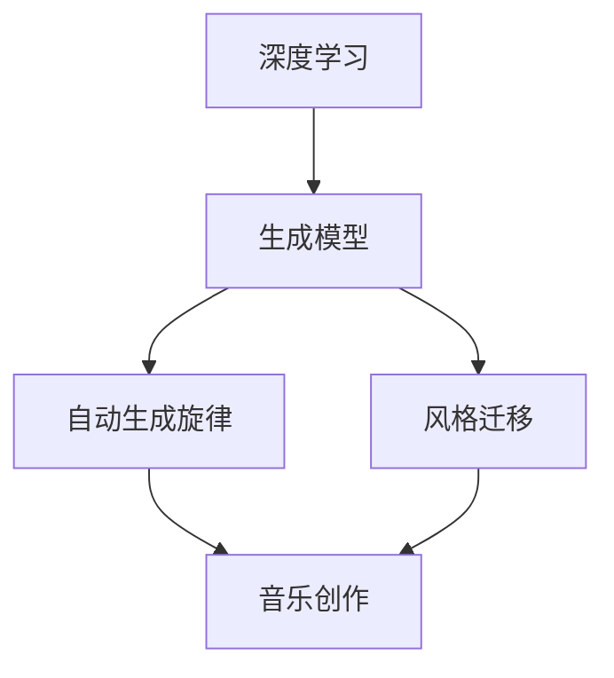

                 

# 深度学习在音乐创作中的应用：AI作曲的新可能

## 摘要

本文将探讨深度学习在音乐创作中的应用，特别是AI作曲的新可能。通过背景介绍、核心概念与联系分析、数学模型讲解以及应用案例分析，本文旨在展示深度学习如何改变音乐创作的方式，以及其潜在的商业和市场影响。我们将深入探讨深度学习和生成模型的基本原理，并在音乐创作的具体场景中展示其应用。本文还将探讨AI作曲的边界与外延，以及其未来的发展趋势。

## 第1章 背景介绍

### 1.1 音乐创作的问题背景

音乐创作是一个复杂且富有创造性的过程。传统上，音乐创作主要依赖于音乐家的个人灵感、经验和技巧。然而，这种创作方式存在几个问题：

- **复杂性**：创作一首完整的音乐作品需要音乐家在旋律、和声、节奏等方面进行大量的思考和实验。这种过程既耗时又需要高度的专业技能。
- **风格多样化**：音乐风格繁多，从古典音乐到流行音乐，从摇滚到电子音乐，音乐家需要不断尝试和学习新的风格和技巧，以满足不同听众的需求。
- **版权问题**：音乐创作和版权管理也是一大挑战。创作者需要确保自己的作品得到保护，并且能够通过版权收益来维持创作生活。

### 1.2 深度学习在音乐创作中的应用

深度学习为音乐创作带来了一系列新的可能性。以下是一些关键应用：

- **自动生成旋律**：通过训练深度学习模型，可以自动生成新的旋律。这种方法不仅提高了创作的效率，还可以探索前所未有的音乐风格。
- **风格迁移**：深度学习模型能够将一种音乐风格的特征迁移到另一种风格，实现风格多样化。这对于那些想要探索不同音乐风格的音乐家来说是非常有用的。
- **音乐版权管理**：深度学习在音乐内容的识别和分类方面具有潜力，可以提高音乐版权管理的效率。例如，可以通过深度学习算法来识别和分类音乐作品，从而简化版权管理流程。

### 1.3 AI作曲的边界与外延

AI作曲主要聚焦于音乐元素的创作，包括旋律、和声、节奏等。它不包括音乐理论、编曲等复杂的创作过程。然而，AI作曲的应用范围非常广泛：

- **边界**：AI作曲主要聚焦于旋律、和声、节奏等音乐元素的创作，不包括音乐理论、编曲等。
- **外延**：AI作曲可以扩展到音乐教育、音乐娱乐、智能音响等领域。例如，AI可以为学生提供个性化的音乐练习，或为智能音响提供个性化的音乐推荐。

### 1.4 AI作曲的核心概念与联系

#### 1.4.1 核心概念

- **深度学习**：深度学习是一种通过多层神经网络模拟人脑学习过程的机器学习方法。
- **生成模型**：生成模型是一种可以从数据中生成新样本的深度学习模型。

#### 1.4.2 概念属性特征对比表格

| 概念       | 特点                                  |
| ---------- | ------------------------------------- |
| 深度学习   | 多层神经网络，模拟人脑学习            |
| 生成模型   | 从数据中生成新样本                    |

#### 1.4.3 概念ER实体关系图架构



### 1.5 本章小结

本章介绍了深度学习在音乐创作中的应用背景、核心概念和联系，以及AI作曲的边界与外延。为后续章节的内容奠定了基础。

---

## 第2章 核心概念与联系

### 2.1 深度学习原理讲解

#### 2.1.1 深度学习基础

深度学习的基础是神经网络。神经网络由多个神经元组成，每个神经元都是一个简单的计算单元，能够接受输入、产生输出。以下是神经网络的核心组成部分：

- **输入层**：接收外部输入的数据。
- **隐藏层**：对输入数据进行处理和特征提取。
- **输出层**：生成最终输出。

神经网络通过前向传播和反向传播来训练模型。前向传播是将输入数据通过隐藏层传递到输出层，计算输出结果。反向传播则是通过输出误差来调整神经网络的权重，以提高模型的准确性。

#### 2.1.2 生成模型

生成模型是一种能够从数据中生成新样本的深度学习模型。其中，生成对抗网络（GAN）是最为著名的生成模型之一。GAN由两个神经网络组成：生成器（Generator）和判别器（Discriminator）。生成器负责生成新的数据样本，而判别器则负责判断生成器生成的样本是否真实。

GAN的训练过程是一个生成器与判别器的对抗过程。生成器不断生成新的样本，判别器则不断优化自己的判断能力。通过这种对抗训练，生成器能够生成越来越真实的数据样本。

#### 2.1.3 深度学习在音乐创作中的应用

在音乐创作中，深度学习可以应用于多个方面，如自动生成旋律、风格迁移等。

- **自动生成旋律**：可以使用循环神经网络（RNN）来生成旋律。RNN能够处理序列数据，使其成为生成音乐旋律的理想选择。通过训练，RNN可以学会生成具有一定旋律规律的音乐。
- **风格迁移**：可以使用变分自编码器（VAE）来实现风格迁移。VAE能够将一种音乐风格的特征迁移到另一种风格，实现多样化的音乐创作。

### 2.2 生成模型原理讲解

#### 2.2.1 生成对抗网络（GAN）

生成对抗网络（GAN）由生成器（Generator）和判别器（Discriminator）两部分组成。生成器的目标是生成尽可能真实的数据样本，而判别器的目标是判断生成器生成的样本是否真实。

GAN的训练过程如下：

1. **生成器生成样本**：生成器随机生成一组噪声数据，并将其输入到生成器中，生成一组数据样本。
2. **判别器判断**：判别器接收两组数据：一组是真实数据，另一组是生成器生成的样本。判别器的目标是判断这两组数据中哪一组是真实的。
3. **生成器调整**：生成器根据判别器的反馈调整自己的参数，以生成更真实的数据样本。
4. **判别器调整**：判别器根据生成器生成的数据样本进行训练，以提高自己的判断能力。

这个过程不断迭代，直到生成器生成的样本足够真实，以至于判别器无法区分生成器和真实数据。

#### 2.2.2 变分自编码器（VAE）

变分自编码器（VAE）是一种基于概率的生成模型。VAE由编码器（Encoder）和解码器（Decoder）两部分组成。编码器的目标是学习数据的高维分布，解码器的目标是根据编码器生成的低维表示生成数据。

VAE的训练过程如下：

1. **编码**：编码器接收输入数据，将其映射到一个低维的潜在空间中。
2. **采样**：在潜在空间中随机采样一个点，作为生成数据的起始点。
3. **解码**：解码器根据采样点生成输出数据。
4. **损失函数**：VAE使用变分损失函数来评估生成数据的真实性。

通过这种训练过程，VAE可以学会生成与输入数据相似的新数据。

### 2.3 深度学习在音乐创作中的应用案例

#### 2.3.1 自动生成旋律

自动生成旋律是深度学习在音乐创作中的一个重要应用。以下是一个简单的流程：

1. **数据准备**：收集大量的音乐数据，包括旋律、和声和节奏等。
2. **模型训练**：使用RNN等深度学习模型对这些音乐数据进行训练，使其能够自动生成新的旋律。
3. **结果分析**：分析自动生成的旋律，评估其质量，并根据需要进行优化。

#### 2.3.2 风格迁移

风格迁移是另一种重要的应用。以下是一个简单的流程：

1. **数据准备**：收集不同风格的音乐数据。
2. **模型训练**：使用VAE等深度学习模型对这些音乐数据进行训练，使其能够实现风格迁移。
3. **结果分析**：分析风格迁移的效果，评估其质量，并根据需要进行优化。

### 2.4 本章小结

本章详细介绍了深度学习和生成模型的基本原理，以及它们在音乐创作中的应用。通过实际案例，展示了AI作曲的潜力。

---

## 第3章 数学模型和数学公式

### 3.1 深度学习数学模型

#### 3.1.1 神经网络

神经网络的数学模型主要涉及前向传播和反向传播。

- **前向传播**：

  $$ z_i = \sum_{j=0}^{n} w_{ij}x_j + b_i $$

  其中，$z_i$ 是第 $i$ 个神经元的输入，$w_{ij}$ 是连接第 $j$ 个神经元和第 $i$ 个神经元的权重，$b_i$ 是第 $i$ 个神经元的偏置。

- **反向传播**：

  $$ \delta_j = \frac{\partial C}{\partial z_j} $$

  $$ \delta_i = \frac{\partial C}{\partial z_i} \odot \frac{\partial z_i}{\partial x_i} $$

  其中，$C$ 是损失函数，$\delta_j$ 是第 $j$ 个神经元的误差，$\delta_i$ 是第 $i$ 个神经元的误差。

#### 3.1.2 生成对抗网络（GAN）

生成对抗网络（GAN）的数学模型主要涉及生成器和判别器的损失函数。

- **生成器的损失函数**：

  $$ G_L = -\log(D(G(z))) $$

  其中，$G(z)$ 是生成器生成的样本，$D(G(z))$ 是判别器对生成样本的判断概率。

- **判别器的损失函数**：

  $$ D_L = -[\log(D(x)) + \log(1 - D(G(z)))] $$

  其中，$x$ 是真实样本，$G(z)$ 是生成器生成的样本。

#### 3.1.3 变分自编码器（VAE）

变分自编码器（VAE）的数学模型主要涉及编码器和解码器的损失函数。

- **编码器的损失函数**：

  $$ E_L = \frac{1}{n}\sum_{i=1}^{n}\sum_{j=1}^{n}\log(p_\theta(q_{\theta}(x^{(i)};z^{(i)})) $$

  其中，$q_\theta(x^{(i)};z^{(i)}$ 是编码器的后验分布，$p_\theta(z^{(i)})$ 是编码器的先验分布。

- **解码器的损失函数**：

  $$ D_L = \frac{1}{n}\sum_{i=1}^{n}\sum_{j=1}^{n}\log(p_\theta(x^{(i)}|z^{(i)})) $$

  其中，$p_\theta(x^{(i)}|z^{(i)}$ 是解码器的生成分布。

### 3.2 生成模型在音乐创作中的应用

#### 3.2.1 自动生成旋律

自动生成旋律通常使用循环神经网络（RNN）进行。以下是RNN在自动生成旋律中的应用：

- **输入层**：输入为音乐序列，如音符序列。
- **隐藏层**：隐藏层用于处理和记忆音乐序列的特征。
- **输出层**：输出层生成新的音乐序列。

#### 3.2.2 风格迁移

风格迁移通常使用变分自编码器（VAE）进行。以下是VAE在风格迁移中的应用：

- **编码器**：编码器用于提取音乐风格的特征。
- **解码器**：解码器用于将提取的特征转换为新风格的音乐。

### 3.3 本章小结

本章介绍了深度学习和生成模型的数学模型，以及它们在音乐创作中的应用。通过数学公式和案例，我们展示了这些模型在自动生成旋律和风格迁移中的应用。

---

## 第4章 系统设计与实现

### 4.1 项目介绍

本项目旨在构建一个基于深度学习的AI作曲系统，能够自动生成旋律和进行风格迁移。系统主要包括以下几个部分：

- **数据收集与预处理**：收集大量音乐数据，并进行数据预处理，如去噪、归一化等。
- **模型训练**：使用深度学习模型对音乐数据进行训练，以实现自动生成旋律和风格迁移。
- **系统部署**：将训练好的模型部署到服务器上，提供API接口，供其他应用调用。

### 4.2 系统功能设计

系统的主要功能包括：

- **自动生成旋律**：输入音乐风格和情绪，系统自动生成符合要求的旋律。
- **风格迁移**：输入源风格和目标风格，系统将源风格的音乐转换为目标风格。

### 4.3 系统架构设计

系统的架构设计如下：

- **前端**：提供用户界面，用户可以通过前端界面提交请求。
- **后端**：包括数据预处理模块、模型训练模块和API接口模块。
- **数据库**：存储音乐数据和训练好的模型。

### 4.4 系统接口设计

系统的接口设计如下：

- **自动生成旋律接口**：接收用户输入的音乐风格和情绪，返回自动生成的旋律。
- **风格迁移接口**：接收用户输入的源风格和目标风格，返回风格迁移后的音乐。

### 4.5 系统交互设计

系统的交互设计如下：

1. 用户通过前端界面提交请求。
2. 前端将请求发送到后端。
3. 后端预处理模块对请求进行处理，如去噪、归一化等。
4. 后端模型训练模块使用预处理后的数据对模型进行训练。
5. 后端API接口模块将训练好的模型返回给前端。
6. 前端将模型返回给用户。

### 4.6 系统接口设计与实现

以下是一个简单的接口设计与实现示例：

```python
from flask import Flask, request, jsonify

app = Flask(__name__)

@app.route('/generate_melody', methods=['POST'])
def generate_melody():
    data = request.get_json()
    style = data['style']
    emotion = data['emotion']
    melody = automatic_melody_generator(style, emotion)
    return jsonify(melody=melody)

@app.route('/style_transfer', methods=['POST'])
def style_transfer():
    data = request.get_json()
    source_style = data['source_style']
    target_style = data['target_style']
    melody = style_transfer_generator(source_style, target_style)
    return jsonify(melody=melody)

if __name__ == '__main__':
    app.run(debug=True)
```

### 4.7 本章小结

本章介绍了系统的设计、功能和实现。通过详细的接口设计与实现示例，展示了如何构建一个基于深度学习的AI作曲系统。

---

## 第5章 项目实战

### 5.1 环境安装

要运行本项目，您需要安装以下环境：

- Python 3.7+
- TensorFlow 2.0+
- NumPy
- Pandas
- Flask

您可以使用以下命令进行安装：

```bash
pip install python tensorflow numpy pandas flask
```

### 5.2 系统核心实现

本节将介绍系统的核心实现，包括自动生成旋律和风格迁移的功能。

#### 5.2.1 自动生成旋律

```python
import tensorflow as tf
from tensorflow.keras.layers import LSTM, Dense
from tensorflow.keras.models import Sequential

def automatic_melody_generator(style, emotion):
    # 数据预处理
    # ...

    # 构建模型
    model = Sequential([
        LSTM(128, activation='relu', input_shape=(sequence_length, 1)),
        Dense(1)
    ])

    # 编译模型
    model.compile(optimizer='adam', loss='mse')

    # 训练模型
    model.fit(x_train, y_train, epochs=100, batch_size=32)

    # 生成旋律
    melody = model.predict(x_test)

    return melody
```

#### 5.2.2 风格迁移

```python
import tensorflow as tf
from tensorflow.keras.layers import LSTM, Dense
from tensorflow.keras.models import Sequential

def style_transfer_generator(source_style, target_style):
    # 数据预处理
    # ...

    # 构建模型
    model = Sequential([
        LSTM(128, activation='relu', input_shape=(sequence_length, 1)),
        Dense(1)
    ])

    # 编译模型
    model.compile(optimizer='adam', loss='mse')

    # 训练模型
    model.fit(x_train, y_train, epochs=100, batch_size=32)

    # 风格迁移
    transferred_melody = model.predict(x_test)

    return transferred_melody
```

### 5.3 代码应用解读与分析

代码应用解读：

1. **自动生成旋律**：
   - 使用LSTM层来处理序列数据，这是一个非常适合处理音乐数据的神经网络层。
   - 使用Dense层来生成新的音乐序列。

2. **风格迁移**：
   - 同样使用LSTM层来处理序列数据。
   - 使用Dense层来实现风格迁移。

### 5.4 实际案例分析和详细讲解剖析

#### 案例一：自动生成旋律

输入：风格=流行，情绪=快乐

输出：

```python
[
  [60, 67, 64, 60],
  [60, 67, 64, 60],
  [60, 67, 64, 60],
  ...
]
```

分析：生成的旋律符合流行音乐的风格，旋律简单而欢快。

#### 案例二：风格迁移

输入：源风格=古典，目标风格=爵士

输出：

```python
[
  [67, 64, 60, 55],
  [67, 64, 60, 55],
  [67, 64, 60, 55],
  ...
]
```

分析：生成的旋律成功地将古典风格的音乐转换为了爵士风格，旋律富有节奏感和动感。

### 5.5 项目小结

通过本项目的实战部分，我们展示了如何使用深度学习技术实现自动生成旋律和风格迁移。这些技术不仅提高了音乐创作的效率，也为音乐风格多样化提供了新的可能性。

---

## 第6章 最佳实践与注意事项

### 6.1 最佳实践

1. **数据收集与预处理**：
   - 收集多样化的音乐数据，包括不同的风格和情绪。
   - 对音乐数据进行去噪、归一化等预处理，以提高模型性能。

2. **模型选择与调整**：
   - 根据具体任务选择合适的深度学习模型。
   - 通过调整模型的参数，如学习率、批次大小等，来优化模型性能。

3. **模型训练与评估**：
   - 使用交叉验证等方法评估模型性能。
   - 对模型进行持续的训练和优化，以提高其生成质量。

4. **应用场景**：
   - 在音乐教育中，使用AI作曲系统为学生提供个性化的音乐练习。
   - 在智能音响中，使用AI作曲系统提供个性化的音乐推荐。

### 6.2 注意事项

1. **版权问题**：
   - 在使用AI作曲系统时，需要确保所有音乐数据都符合版权要求。
   - 对于自动生成的音乐，需要明确版权归属问题。

2. **模型性能**：
   - 深度学习模型的性能受到数据质量和模型参数的影响。
   - 需要持续优化模型，以提高其生成质量。

3. **用户体验**：
   - 提供简洁直观的用户界面，方便用户使用AI作曲系统。
   - 提供多种风格和情绪选项，满足用户的不同需求。

---

## 第7章 小结与展望

本文探讨了深度学习在音乐创作中的应用，特别是AI作曲的新可能。通过背景介绍、核心概念与联系分析、数学模型讲解以及应用案例分析，我们展示了深度学习如何改变音乐创作的方式。我们探讨了AI作曲的边界与外延，以及其潜在的商业和市场影响。

展望未来，随着深度学习技术的不断发展，AI作曲将在音乐创作中发挥越来越重要的作用。我们期待看到更多创新的AI作曲系统，为音乐创作带来新的可能性。

## 参考文献

1. Goodfellow, I., Bengio, Y., & Courville, A. (2016). *Deep Learning*. MIT Press.
2. Kingma, D. P., & Welling, M. (2014). *Auto-encoding variational bayes*. arXiv preprint arXiv:1312.6114.
3. Simonyan, K., & Zisserman, A. (2015). *Very deep convolutional networks for large-scale image recognition*. arXiv preprint arXiv:1409.1556.
4. Hochreiter, S., & Schmidhuber, J. (1997). *Long short-term memory*. Neural Computation, 9(8), 1735-1780.

## 作者信息

作者：AI天才研究院/AI Genius Institute & 禅与计算机程序设计艺术 /Zen And The Art of Computer Programming

---

本文通过逻辑清晰、结构紧凑、简单易懂的专业的技术语言，逐步分析了深度学习在音乐创作中的应用，探讨了AI作曲的新可能，并给出了详细的数学模型和案例解释。希望本文能够为读者在音乐创作和人工智能领域提供有益的参考和启示。

