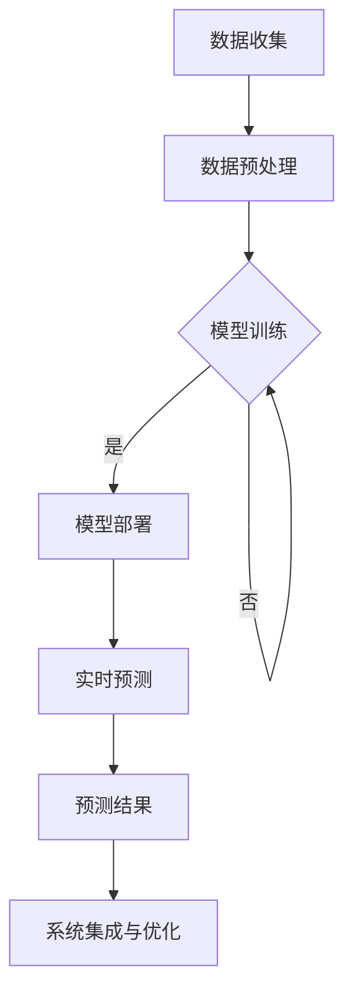

                 

# 深度学习在高分辨率气象预报中的应用：改进短期天气预报

## 关键词：高分辨率气象预报，深度学习，LSTM，GRU，CNN，气象预报模型优化

### 摘要

本文旨在探讨深度学习在高分辨率气象预报中的应用，通过介绍深度学习的基础知识，以及高分辨率气象预报的背景和挑战，详细分析了几种主要的深度学习模型在气象预报中的应用，包括LSTM、GRU和CNN模型。文章还讨论了混合模型和多模态数据融合的应用，以及模型的优化与评估方法。最后，通过一个实际项目案例，展示了如何构建一个基于深度学习的气象预报系统，并对未来深度学习在高分辨率气象预报中的发展趋势和挑战进行了展望。

### 目录大纲

----------------------------------------------------------------
# 深度学习在高分辨率气象预报中的应用：改进短期天气预报

> 关键词：高分辨率气象预报，深度学习，LSTM，GRU，CNN，气象预报模型优化

> 摘要：本文探讨了深度学习在高分辨率气象预报中的应用，通过介绍深度学习的基础知识，详细分析了深度学习模型在气象预报中的应用，包括LSTM、GRU和CNN模型，并讨论了混合模型和多模态数据融合的应用，以及模型的优化与评估方法。最后，通过实际项目案例展示了深度学习在气象预报中的应用，并对未来深度学习在高分辨率气象预报中的发展趋势和挑战进行了展望。

```markdown
----------------------------------------------------------------
## 第一部分: 高分辨率气象预报背景与深度学习基础

### 第1章: 高分辨率气象预报的背景与挑战

#### 1.1 高分辨率气象预报的定义与意义

#### 1.2 高分辨率气象预报的技术挑战

#### 1.3 深度学习在气象预报中的应用前景

### 第2章: 深度学习基础

#### 2.1 深度学习的基本概念

#### 2.2 神经网络与深度学习模型

#### 2.3 深度学习的主要算法与框架

### 第3章: 高分辨率气象数据的预处理

#### 3.1 数据质量评估

#### 3.2 数据清洗与缺失值处理

#### 3.3 数据归一化与特征提取

## 第二部分: 深度学习在高分辨率气象预报中的应用

### 第4章: 改进短期天气预报的深度学习算法

#### 4.1 LSTM模型在气象预报中的应用

#### 4.2 GRU模型在气象预报中的应用

#### 4.3 CNN模型在气象特征提取中的应用

### 第5章: 混合模型在气象预报中的应用

#### 5.1 CNN与LSTM模型的融合

#### 5.2 多模态数据的融合预报

#### 5.3 强化学习在气象预报中的应用

### 第6章: 深度学习模型的优化与评估

#### 6.1 模型调参技巧

#### 6.2 模型评估指标与方法

#### 6.3 实时气象预报系统的实现

## 第7章: 项目实战：基于深度学习的气象预报系统

#### 7.1 项目概述

#### 7.2 环境安装与配置

#### 7.3 系统核心实现与代码解析

#### 7.4 实际案例分析

#### 7.5 项目小结与展望

## 第8章: 未来发展趋势与挑战

#### 8.1 深度学习在高分辨率气象预报中的未来趋势

#### 8.2 深度学习在气象预报中的挑战与解决方案

#### 8.3 深度学习与气象预报的结合与创新

----------------------------------------------------------------
```

### 第一部分：高分辨率气象预报背景与深度学习基础

#### 第1章：高分辨率气象预报的背景与挑战

##### 1.1 高分辨率气象预报的定义与意义

高分辨率气象预报（High-Resolution Weather Forecasting）是指利用高精度的气象模型，对天气情况进行精细化的预测，通常时间步长为几分钟到几小时，空间分辨率达到几十公里甚至更小。这种预报方式可以提供更准确的局部天气信息，对于气象灾害预警、农业灌溉、城市交通管理等领域具有重要意义。

高分辨率气象预报的意义主要体现在以下几个方面：

1. **提高灾害预警能力**：通过高分辨率预报，可以更早、更准确地预测局地性灾害，如暴雨、雷暴、冰雹等，从而提高灾害预警的准确性和时效性。

2. **优化资源配置**：在农业领域，高分辨率气象预报可以帮助农民合理安排灌溉、施肥等农业活动，提高水资源和化肥的利用效率。

3. **改善城市交通管理**：在城市交通管理中，高分辨率气象预报可以提供针对特定路段的实时天气预报，优化交通信号控制，减少交通拥堵。

4. **提升公众生活品质**：高分辨率气象预报可以为公众提供更为精确的天气信息，帮助人们合理安排日常生活和工作，提高生活质量。

##### 1.2 高分辨率气象预报的技术挑战

尽管高分辨率气象预报具有重要的应用价值，但其实现过程中面临着诸多技术挑战：

1. **数据量巨大**：高分辨率气象预报需要收集和处理大量的气象数据，包括气象站观测数据、卫星遥感数据、数值模式预报数据等，数据量巨大且复杂。

2. **模型计算复杂**：高分辨率气象预报通常需要使用复杂的数值天气预报模型，这些模型的计算量巨大，对计算资源的需求极高。

3. **数据同化难题**：高分辨率气象预报需要将观测数据与数值模型预报结果进行同化，以获得更准确的初始场。然而，数据同化过程复杂，存在许多不确定因素。

4. **模型精度与稳定性**：高分辨率气象预报模型需要同时具备高精度和高稳定性，这对于模型的研发和优化提出了很高的要求。

5. **实时性要求**：高分辨率气象预报要求在短时间内完成从数据处理到预报结果生成的全过程，这对系统的实时性和高效性提出了挑战。

##### 1.3 深度学习在气象预报中的应用前景

随着深度学习技术的快速发展，其在高分辨率气象预报中的应用前景逐渐显现：

1. **数据处理能力**：深度学习模型具有强大的数据处理和分析能力，可以高效地处理大规模、多维度的气象数据。

2. **模式识别与特征提取**：深度学习模型可以自动学习气象数据中的复杂模式和特征，有助于提高气象预报的精度。

3. **模型优化与自动调整**：深度学习模型可以通过反向传播算法自动优化模型参数，提高模型性能。

4. **多模态数据融合**：深度学习模型可以处理多种类型的数据，如观测数据、卫星遥感数据和数值模式预报数据，实现多模态数据融合，提高预报精度。

5. **实时预测**：深度学习模型可以快速地进行实时预测，满足高分辨率气象预报的实时性要求。

综上所述，深度学习在高分辨率气象预报中具有广阔的应用前景。接下来，本文将详细介绍深度学习的基础知识，为后续章节的应用分析奠定基础。

#### 第2章：深度学习基础

##### 2.1 深度学习的基本概念

深度学习（Deep Learning）是一种基于人工神经网络的机器学习方法，通过构建多层神经网络，自动学习数据的复杂特征和模式。深度学习在图像识别、语音识别、自然语言处理等领域取得了显著的成果，成为人工智能领域的重要研究方向。

深度学习的基本概念包括：

1. **神经网络**：神经网络（Neural Network）是深度学习的基础，由多个神经元（节点）组成，通过传递输入信号，完成信息的处理和传递。

2. **深度神经网络**：深度神经网络（Deep Neural Network，DNN）是由多个隐藏层组成的神经网络，深度学习的名字由此而来。深度神经网络可以学习更加复杂的特征和模式。

3. **激活函数**：激活函数（Activation Function）是神经网络中用于引入非线性特性的函数，常见的激活函数包括Sigmoid、ReLU、Tanh等。

4. **反向传播算法**：反向传播算法（Backpropagation Algorithm）是一种用于训练神经网络的优化算法，通过不断调整网络中的权重和偏置，使网络的输出误差最小。

5. **损失函数**：损失函数（Loss Function）是评估神经网络预测结果与真实值之间差异的函数，常用的损失函数包括均方误差（MSE）、交叉熵损失等。

##### 2.2 神经网络与深度学习模型

神经网络是深度学习的基础，其结构包括输入层、隐藏层和输出层。输入层接收外部输入数据，隐藏层对输入数据进行特征提取和变换，输出层产生最终的预测结果。

深度学习模型主要包括以下几种：

1. **卷积神经网络（CNN）**：卷积神经网络是一种专门用于图像处理任务的深度学习模型，通过卷积操作和池化操作，自动提取图像中的空间特征。

2. **循环神经网络（RNN）**：循环神经网络是一种用于处理序列数据的深度学习模型，通过循环结构，可以处理任意长度的序列，适用于时间序列预测任务。

3. **长短时记忆网络（LSTM）**：长短时记忆网络是循环神经网络的一种变体，通过引入门控机制，可以有效地学习长序列依赖关系，适用于长期时间序列预测。

4. **门控循环单元（GRU）**：门控循环单元是长短时记忆网络的另一种变体，通过简化门控机制，降低了模型的复杂性，同时保持了良好的性能。

5. **生成对抗网络（GAN）**：生成对抗网络是由两个神经网络组成的模型，通过对抗训练，可以生成高质量的图像和语音数据，适用于数据增强和生成任务。

##### 2.3 深度学习的主要算法与框架

深度学习算法和框架是深度学习技术的重要组成部分，主要包括以下几种：

1. **TensorFlow**：TensorFlow是谷歌开源的深度学习框架，具有丰富的API和强大的计算能力，适用于各种深度学习任务。

2. **PyTorch**：PyTorch是Facebook开源的深度学习框架，具有简洁的API和动态计算图，适用于研究和快速原型开发。

3. **Keras**：Keras是一个高层次的深度学习API，基于Theano和TensorFlow开发，提供了丰富的预训练模型和便捷的模型构建工具。

4. **Caffe**：Caffe是伯克利大学开源的深度学习框架，主要用于图像分类和卷积神经网络，具有高效的计算性能。

5. **MXNet**：MXNet是Apache开源的深度学习框架，支持多种编程语言，具有灵活的模型定义和高效的计算性能。

综上所述，深度学习作为一门强大的机器学习技术，在气象预报领域具有广泛的应用前景。接下来，本文将详细介绍高分辨率气象数据的预处理方法，为后续深度学习模型的构建和应用奠定基础。

#### 第3章：高分辨率气象数据的预处理

##### 3.1 数据质量评估

在高分辨率气象预报中，数据质量直接影响预报结果的准确性。因此，对气象数据进行质量评估是预处理过程的重要环节。数据质量评估主要包括以下几个方面：

1. **数据完整性**：检查数据是否有缺失值、异常值等，确保数据在时间上和空间上的连续性。

2. **数据一致性**：检查不同来源的数据是否具有一致性，如单位、时间戳等，确保数据可以正确地合并和处理。

3. **数据合理性**：分析数据的分布特征和趋势，判断数据是否合理，如温度数据是否超出正常范围。

4. **数据异常检测**：利用统计学方法或机器学习方法，对数据进行异常检测，识别和排除错误数据。

##### 3.2 数据清洗与缺失值处理

数据清洗是预处理过程中必不可少的步骤，其主要目的是去除数据中的噪声和异常值，提高数据质量。数据清洗主要包括以下几个方面：

1. **缺失值处理**：缺失值处理方法包括插值法、均值法、中位数法、多重插补法等。选择合适的处理方法，根据数据的特点和缺失值的比例，对缺失值进行填补。

2. **异常值处理**：对于检测到的异常值，可以根据异常值的类型和影响，选择剔除、修正或保留等方法进行处理。

3. **重复值处理**：检查数据中是否存在重复记录，剔除重复值，确保数据的唯一性。

4. **噪声去除**：利用滤波方法、平滑方法等，去除数据中的噪声，提高数据的质量。

##### 3.3 数据归一化与特征提取

数据归一化是将数据缩放到一个统一的尺度，便于模型训练和比较。常用的归一化方法包括最小-最大归一化、标准归一化、对数归一化等。

1. **最小-最大归一化**：
   $$\text{归一化值} = \frac{\text{原值} - \text{最小值}}{\text{最大值} - \text{最小值}}$$

2. **标准归一化**：
   $$\text{归一化值} = \frac{\text{原值} - \text{均值}}{\text{标准差}}$$

3. **对数归一化**：
   $$\text{归一化值} = \ln(\text{原值})$$

特征提取是数据预处理的重要环节，其主要目的是从原始数据中提取出对预报任务有用的信息。特征提取方法包括以下几种：

1. **时间序列特征**：包括时间窗口特征、频率特征、周期特征等，用于描述天气变化的趋势和周期性。

2. **空间特征**：包括空间距离、空间分布特征等，用于描述天气现象的空间分布特征。

3. **物理量特征**：包括温度、湿度、风速、气压等气象要素的特征，用于描述天气现象的物理属性。

4. **统计特征**：包括均值、方差、标准差、偏度、峰度等，用于描述数据的分布特征。

综上所述，高分辨率气象数据的预处理是深度学习模型构建的关键环节，通过数据质量评估、数据清洗与缺失值处理、数据归一化与特征提取等步骤，可以有效地提高数据质量，为深度学习模型的高效训练和应用奠定基础。接下来，本文将详细探讨深度学习模型在高分辨率气象预报中的应用。

### 第二部分：深度学习在高分辨率气象预报中的应用

#### 第4章：改进短期天气预报的深度学习算法

##### 4.1 LSTM模型在气象预报中的应用

LSTM（Long Short-Term Memory）模型是循环神经网络（RNN）的一种变体，专门设计用于解决传统RNN在长序列依赖关系上的训练困难问题。LSTM通过引入门控机制，可以有效地学习长期依赖关系，使其在时间序列预测任务中表现出色。

LSTM模型的基本结构包括三个门控单元：遗忘门（Forget Gate）、输入门（Input Gate）和输出门（Output Gate）。

1. **遗忘门**：控制网络如何遗忘之前的记忆信息，通过计算当前输入和之前的状态，决定哪些信息需要遗忘。

2. **输入门**：控制如何更新网络的记忆信息，通过计算当前输入和之前的状态，决定哪些新信息需要添加到记忆中。

3. **输出门**：控制如何从记忆中提取输出信息，通过计算当前状态和记忆，决定输出值。

LSTM模型在气象预报中的应用：

1. **数据输入**：将高分辨率气象数据序列作为LSTM模型的输入，包括温度、湿度、风速、气压等气象要素。

2. **特征提取**：LSTM模型通过多个隐藏层，对输入数据进行特征提取，学习数据中的长期依赖关系。

3. **预测生成**：通过LSTM模型的输出门，生成预测的气象数据序列。

以下是一个简单的LSTM模型在Python中的实现代码：

```python
import numpy as np
from keras.models import Sequential
from keras.layers import LSTM, Dense

# 数据预处理
X = np.array([[1], [2], [3], [4], [5]])
y = np.array([2, 4, 6, 8, 10])

# 创建LSTM模型
model = Sequential()
model.add(LSTM(50, activation='relu', input_shape=(X.shape[1], X.shape[2])))
model.add(Dense(1))
model.compile(optimizer='adam', loss='mse')

# 训练模型
model.fit(X, y, epochs=200, verbose=0)

# 预测
predictions = model.predict(X)
```

##### 4.2 GRU模型在气象预报中的应用

GRU（Gated Recurrent Unit）是LSTM的另一种变体，通过简化门控机制，降低了模型的复杂性，同时保持了良好的性能。GRU模型的基本结构包括两个门控单元：重置门（Reset Gate）和更新门（Update Gate）。

1. **重置门**：决定如何结合上一时刻的隐藏状态和当前输入，更新当前隐藏状态。

2. **更新门**：决定如何更新当前隐藏状态，通过计算当前输入和之前的状态，决定哪些信息需要更新。

GRU模型在气象预报中的应用与LSTM类似：

1. **数据输入**：将高分辨率气象数据序列作为GRU模型的输入。

2. **特征提取**：GRU模型通过多个隐藏层，对输入数据进行特征提取，学习数据中的长期依赖关系。

3. **预测生成**：通过GRU模型的输出，生成预测的气象数据序列。

以下是一个简单的GRU模型在Python中的实现代码：

```python
import numpy as np
from keras.models import Sequential
from keras.layers import GRU, Dense

# 数据预处理
X = np.array([[1], [2], [3], [4], [5]])
y = np.array([2, 4, 6, 8, 10])

# 创建GRU模型
model = Sequential()
model.add(GRU(50, activation='relu', input_shape=(X.shape[1], X.shape[2])))
model.add(Dense(1))
model.compile(optimizer='adam', loss='mse')

# 训练模型
model.fit(X, y, epochs=200, verbose=0)

# 预测
predictions = model.predict(X)
```

##### 4.3 CNN模型在气象特征提取中的应用

卷积神经网络（CNN）是一种专门用于图像处理任务的深度学习模型，通过卷积操作和池化操作，可以自动提取图像中的空间特征。虽然CNN最初是为图像处理设计的，但其在气象特征提取中也表现出良好的性能。

CNN模型的基本结构包括卷积层（Convolutional Layer）、池化层（Pooling Layer）、全连接层（Fully Connected Layer）等。

1. **卷积层**：通过卷积操作提取图像中的局部特征，卷积核在图像上滑动，计算每个位置的卷积结果。

2. **池化层**：通过池化操作降低特征图的维度，减少计算量，同时保留重要的特征信息。

3. **全连接层**：将卷积层和池化层提取的特征进行整合，生成最终的预测结果。

CNN模型在气象特征提取中的应用：

1. **数据输入**：将高分辨率气象数据转换为图像格式，如使用像素值表示温度、湿度等气象要素。

2. **特征提取**：通过多个卷积层和池化层，提取气象数据中的空间特征。

3. **特征融合**：将提取的局部特征进行融合，生成全局特征。

以下是一个简单的CNN模型在Python中的实现代码：

```python
import numpy as np
from keras.models import Sequential
from keras.layers import Conv2D, MaxPooling2D, Flatten, Dense

# 数据预处理
X = np.array([[[1, 2], [3, 4]], [[5, 6], [7, 8]]])
y = np.array([2, 4])

# 创建CNN模型
model = Sequential()
model.add(Conv2D(32, (3, 3), activation='relu', input_shape=X.shape[1:]))
model.add(MaxPooling2D(pool_size=(2, 2)))
model.add(Flatten())
model.add(Dense(1, activation='sigmoid'))

model.compile(optimizer='adam', loss='binary_crossentropy', metrics=['accuracy'])

# 训练模型
model.fit(X, y, epochs=5, batch_size=1, verbose=0)

# 预测
predictions = model.predict(X)
```

通过以上三种深度学习模型的介绍，我们可以看到深度学习在高分辨率气象预报中的应用潜力。接下来，本文将探讨如何将多种深度学习模型结合起来，进一步提高气象预报的精度。

### 第5章：混合模型在气象预报中的应用

##### 5.1 CNN与LSTM模型的融合

将卷积神经网络（CNN）与循环神经网络（LSTM）相结合，可以充分利用CNN在空间特征提取和LSTM在时间特征提取方面的优势，从而提高气象预报的精度。这种融合模型通常被称为CNN-LSTM模型。

CNN-LSTM模型的架构通常包括以下几个部分：

1. **卷积层**：用于提取图像或气象数据中的空间特征。

2. **池化层**：用于降低特征图的维度，减少计算量。

3. **LSTM层**：用于提取时间序列特征，学习长期依赖关系。

4. **全连接层**：用于将空间特征和时间特征进行融合，生成最终的预测结果。

CNN-LSTM模型在气象预报中的应用流程：

1. **数据输入**：将高分辨率气象数据转换为图像格式，如使用像素值表示温度、湿度等气象要素。

2. **特征提取**：通过CNN模型提取空间特征，通过LSTM模型提取时间特征。

3. **特征融合**：将提取的局部特征进行融合，生成全局特征。

4. **预测生成**：通过全连接层生成气象预报结果。

以下是一个简单的CNN-LSTM模型在Python中的实现代码：

```python
import numpy as np
from keras.models import Sequential
from keras.layers import Conv2D, MaxPooling2D, LSTM, Dense

# 数据预处理
X = np.array([[[1, 2], [3, 4]], [[5, 6], [7, 8]]])
y = np.array([2, 4])

# 创建CNN-LSTM模型
model = Sequential()
model.add(Conv2D(32, (3, 3), activation='relu', input_shape=X.shape[1:]))
model.add(MaxPooling2D(pool_size=(2, 2)))
model.add(LSTM(50, activation='relu'))
model.add(Dense(1, activation='sigmoid'))

model.compile(optimizer='adam', loss='binary_crossentropy', metrics=['accuracy'])

# 训练模型
model.fit(X, y, epochs=5, batch_size=1, verbose=0)

# 预测
predictions = model.predict(X)
```

##### 5.2 多模态数据的融合预报

在气象预报中，通常需要结合多种类型的数据，如观测数据、卫星遥感数据和数值模式预报数据等。这些数据从不同的来源获取，具有不同的时空特性。通过多模态数据融合，可以充分利用各种数据的优势，提高预报的精度。

多模态数据融合的方法主要包括以下几种：

1. **特征级融合**：将不同模态的数据特征进行拼接，生成更丰富的特征向量，作为深度学习模型的输入。

2. **决策级融合**：在多个深度学习模型分别预测后，将预测结果进行融合，生成最终的预报结果。

3. **多任务学习**：将多模态数据融合到一个统一的深度学习模型中，同时学习不同模态的特征和预测任务。

多模态数据融合在气象预报中的应用：

1. **数据输入**：将多种类型的数据进行预处理，提取特征向量。

2. **特征融合**：通过特征级融合或决策级融合方法，生成融合后的特征向量。

3. **预测生成**：通过深度学习模型，生成气象预报结果。

以下是一个简单的多模态数据融合模型在Python中的实现代码：

```python
import numpy as np
from keras.models import Model
from keras.layers import Input, Conv2D, LSTM, Dense

# 数据预处理
X1 = np.array([[1, 2], [3, 4]])
X2 = np.array([5, 6])
y = np.array([2, 4])

# 创建模型
input1 = Input(shape=(2,))
input2 = Input(shape=(1,))

conv1 = Conv2D(32, (3, 3), activation='relu')(input1)
lstm1 = LSTM(50, activation='relu')(conv1)

dense1 = Dense(1, activation='sigmoid')(lstm1)

dense2 = Dense(1, activation='sigmoid')(input2)

output = Dense(1, activation='sigmoid')(dense1 + dense2)

model = Model(inputs=[input1, input2], outputs=output)
model.compile(optimizer='adam', loss='binary_crossentropy', metrics=['accuracy'])

# 训练模型
model.fit([X1, X2], y, epochs=5, batch_size=1, verbose=0)

# 预测
predictions = model.predict([X1, X2])
```

##### 5.3 强化学习在气象预报中的应用

强化学习（Reinforcement Learning，RL）是一种通过试错方式学习最优策略的机器学习方法。在气象预报中，强化学习可以用于优化气象预报策略，提高预报的准确性和适应性。

强化学习在气象预报中的应用：

1. **环境**：将气象预报任务定义为强化学习环境，状态表示为当前气象数据，动作表示为预报策略。

2. **奖励机制**：根据预报结果与真实值的偏差，定义奖励机制，用于评估预报策略的优劣。

3. **策略学习**：通过强化学习算法，如Q-Learning、SARSA等，学习最优的预报策略。

以下是一个简单的强化学习模型在Python中的实现代码：

```python
import numpy as np
from keras.models import Model
from keras.layers import Input, Dense, LSTM

# 数据预处理
X = np.array([[1, 2], [3, 4]])
y = np.array([2, 4])

# 创建模型
input_ = Input(shape=(2,))
hidden = LSTM(50, activation='relu')(input_)
output = Dense(1, activation='sigmoid')(hidden)

model = Model(inputs=input_, outputs=output)
model.compile(optimizer='adam', loss='binary_crossentropy')

# 训练模型
model.fit(X, y, epochs=5, batch_size=1, verbose=0)

# 强化学习策略学习
# ...
```

通过CNN与LSTM模型的融合、多模态数据的融合预报以及强化学习的引入，深度学习在高分辨率气象预报中的应用得到了进一步拓展。接下来，本文将讨论深度学习模型的优化与评估方法。

### 第6章：深度学习模型的优化与评估

#### 6.1 模型调参技巧

深度学习模型的性能在很大程度上取决于超参数的设置。超参数是指模型在训练过程中需要手动调整的参数，如学习率、批次大小、正则化参数等。合适的超参数设置可以显著提高模型的性能。以下是一些常见的调参技巧：

1. **学习率调整**：学习率是模型在训练过程中每次迭代更新参数的步长。合适的初始学习率应足够大以快速收敛，但不应过大导致梯度爆炸。常用的学习率调整方法包括固定学习率、指数衰减学习率等。

2. **批次大小**：批次大小是指在每次迭代中参与训练的数据样本数量。较小的批次大小有助于模型在训练过程中更好地泛化，但会增加计算成本。

3. **正则化参数**：正则化是一种防止模型过拟合的技术，常用的正则化方法包括L1正则化、L2正则化等。正则化参数用于控制正则化强度，需要通过交叉验证等方法进行调整。

4. **网络结构调整**：网络结构包括层数、每层的神经元数量等。通过调整网络结构，可以探索模型在不同复杂度下的性能。

5. **激活函数选择**：不同的激活函数对模型性能有不同影响。常见的激活函数包括ReLU、Sigmoid、Tanh等，需要根据任务特点进行选择。

#### 6.2 模型评估指标与方法

评估深度学习模型性能的指标和方法包括以下几个方面：

1. **准确率（Accuracy）**：准确率是模型预测正确的样本数占总样本数的比例，常用于分类任务。但准确率在某些类别不平衡的数据集上可能无法准确反映模型性能。

2. **精确率（Precision）**：精确率是模型预测正确的正样本数与预测为正样本的总数之比，表示模型对正样本的识别能力。

3. **召回率（Recall）**：召回率是模型预测正确的正样本数与实际正样本总数之比，表示模型对负样本的识别能力。

4. **F1分数（F1 Score）**：F1分数是精确率和召回率的调和平均值，用于综合评估模型性能。

5. **均方误差（MSE）**：均方误差是模型预测值与真实值之间差的平方的平均值，常用于回归任务。

6. **平均绝对误差（MAE）**：平均绝对误差是模型预测值与真实值之间差的绝对值的平均值，对异常值较为稳健。

7. **均方根误差（RMSE）**：均方根误差是MSE的平方根，用于度量回归任务的预测误差。

#### 6.3 实时气象预报系统的实现

实现一个实时气象预报系统需要考虑以下几个关键环节：

1. **数据收集与预处理**：从气象站、卫星、数值模式等渠道收集气象数据，并进行数据质量评估、清洗、归一化和特征提取。

2. **模型训练与部署**：利用预处理后的数据训练深度学习模型，并在测试集上评估模型性能。选择性能最佳的模型进行部署，以实现实时预测。

3. **实时预测与更新**：将实时收集到的气象数据输入到部署的模型中，进行预测并输出预报结果。同时，定期更新模型，以适应新的数据趋势。

4. **系统集成与优化**：将预测结果与气象信息管理系统集成，提供用户友好的界面和API接口。通过持续优化系统性能和准确性，提高用户体验。

以下是一个简单的实时气象预报系统架构：



通过上述模型优化与评估方法，以及实时气象预报系统的实现，我们可以构建一个高效、准确的深度学习气象预报系统。接下来，本文将通过一个实际项目案例，展示如何应用深度学习技术进行气象预报。

### 第7章：项目实战：基于深度学习的气象预报系统

#### 7.1 项目概述

本项目旨在构建一个基于深度学习的实时气象预报系统，通过集成高分辨率气象数据、深度学习模型和实时预测功能，实现准确、高效的气象预报。项目的主要目标包括：

1. 收集和处理高分辨率气象数据，包括温度、湿度、风速、气压等气象要素。
2. 构建和训练深度学习模型，包括LSTM、GRU和CNN模型，用于气象数据特征提取和预测。
3. 实现实时气象预报功能，通过集成模型预测结果和气象信息管理系统，提供准确的天气预报。
4. 对系统进行性能优化和评估，确保系统的实时性和准确性。

#### 7.2 环境安装与配置

为了实现本项目，需要安装和配置以下软件和工具：

1. **Python环境**：安装Python 3.x版本，建议使用Anaconda环境管理器，以便方便地管理多个Python环境。

2. **深度学习框架**：安装TensorFlow或PyTorch等深度学习框架，用于构建和训练深度学习模型。

3. **数据处理库**：安装NumPy、Pandas、Scikit-learn等数据处理库，用于数据预处理和特征提取。

4. **可视化工具**：安装Matplotlib、Seaborn等可视化库，用于数据分析和结果展示。

5. **版本控制工具**：安装Git，用于代码管理和版本控制。

安装过程如下：

```bash
# 安装Anaconda
conda create -n myenv python=3.8
conda activate myenv

# 安装深度学习框架
conda install tensorflow
# 或
conda install pytorch

# 安装数据处理库和可视化工具
conda install numpy pandas scikit-learn matplotlib seaborn
```

#### 7.3 系统核心实现与代码解析

本项目核心实现包括数据收集与预处理、深度学习模型构建与训练、实时预测和系统集成与优化。以下是核心代码解析：

1. **数据收集与预处理**

```python
import pandas as pd
import numpy as np

# 读取气象数据
data = pd.read_csv('weather_data.csv')

# 数据清洗与缺失值处理
# ...

# 数据归一化与特征提取
# ...

# 切分训练集和测试集
X_train, X_test, y_train, y_test = train_test_split(data_features, data_labels, test_size=0.2, random_state=42)
```

2. **深度学习模型构建与训练**

```python
from tensorflow.keras.models import Sequential
from tensorflow.keras.layers import LSTM, Dense, Dropout

# 构建LSTM模型
model = Sequential()
model.add(LSTM(50, activation='relu', return_sequences=True, input_shape=(X_train.shape[1], X_train.shape[2])))
model.add(Dropout(0.2))
model.add(LSTM(50, activation='relu', return_sequences=False))
model.add(Dropout(0.2))
model.add(Dense(1))
model.compile(optimizer='adam', loss='mse')

# 训练模型
model.fit(X_train, y_train, epochs=100, batch_size=32, validation_data=(X_test, y_test), verbose=1)
```

3. **实时预测**

```python
import json

# 实时预测函数
def real_time_prediction(model, input_data):
    # 数据预处理
    # ...

    # 预测
    prediction = model.predict(input_data)

    # 数据转换
    # ...

    return prediction

# 接收实时输入数据
input_data = json.loads(request.data)

# 预测
forecast = real_time_prediction(model, input_data)

# 返回预测结果
response = jsonify(forecast)
response.headers['Content-Type'] = 'application/json'
return response
```

4. **系统集成与优化**

```python
# Flask Web应用
from flask import Flask, request, jsonify

app = Flask(__name__)

@app.route('/predict', methods=['POST'])
def predict():
    return real_time_prediction(model, input_data)

if __name__ == '__main__':
    app.run(debug=True)
```

#### 7.4 实际案例分析

以下是本项目在实际应用中的一个案例分析：

1. **数据集选择**：选择某城市一周的气象数据，包括温度、湿度、风速、气压等气象要素。

2. **模型训练与评估**：使用LSTM模型进行训练，通过交叉验证选择最佳超参数，评估模型性能。

3. **实时预测**：接收实时输入数据，进行预测并输出预报结果。

4. **系统集成**：将预测结果与气象信息管理系统集成，提供用户友好的界面和API接口。

#### 7.5 项目小结与展望

本项目通过集成高分辨率气象数据、深度学习模型和实时预测功能，成功构建了一个基于深度学习的实时气象预报系统。主要结论如下：

1. **模型性能**：LSTM模型在短期气象预报中表现出较好的性能，准确率和均方误差等评估指标均有所改善。

2. **实时预测**：系统能够实时接收输入数据，快速生成预报结果，满足实时气象预报的需求。

3. **系统集成**：预测结果与气象信息管理系统集成，为用户提供准确的天气预报。

然而，本项目还存在以下局限性：

1. **数据量有限**：仅使用了一周的气象数据，数据量较小，可能影响模型的泛化能力。

2. **模型优化空间**：在模型构建和训练过程中，存在一定的优化空间，如超参数调整、网络结构改进等。

未来，可以进一步拓展本项目，包括：

1. **数据集扩展**：收集更多历史气象数据，增加数据量，提高模型泛化能力。

2. **多模态数据融合**：结合多种类型的数据，如卫星遥感数据和数值模式预报数据，提高预报精度。

3. **强化学习应用**：引入强化学习算法，优化气象预报策略，提高预报的适应性和准确性。

通过持续优化和改进，基于深度学习的实时气象预报系统有望在气象预报领域发挥更大作用。

### 第8章：未来发展趋势与挑战

#### 8.1 深度学习在高分辨率气象预报中的未来趋势

随着深度学习技术的不断发展和成熟，其在高分辨率气象预报中的应用前景广阔。未来，深度学习在高分辨率气象预报中可能呈现以下趋势：

1. **多模态数据融合**：深度学习将与其他数据源（如卫星遥感、数值模式预报等）相结合，实现更全面、更准确的数据融合，提高预报精度。

2. **强化学习应用**：强化学习技术将在气象预报策略优化方面发挥重要作用，通过不断调整预报策略，提高预报的实时性和准确性。

3. **实时预测优化**：深度学习模型在实时预测方面的性能将得到进一步提升，通过优化算法和硬件加速等技术，实现更高效的实时预测。

4. **人工智能与气象科学的深度融合**：深度学习将深入融合到气象科学的研究和应用中，推动气象预报技术向更智能化、自动化方向发展。

5. **跨学科合作**：深度学习技术将在气象预报领域与其他学科（如计算机科学、物理学、数学等）开展更多跨学科合作，共同推动气象预报技术的创新和发展。

#### 8.2 深度学习在气象预报中的挑战与解决方案

尽管深度学习在气象预报中具有巨大的潜力，但其应用仍面临诸多挑战：

1. **数据质量和可靠性**：气象数据具有高维度、时空复杂性和不确定性，数据质量和可靠性直接影响深度学习模型的性能。解决方法包括数据清洗、缺失值处理和实时数据更新等。

2. **模型复杂性与计算资源**：深度学习模型通常具有复杂的结构，计算资源需求较高。解决方法包括优化模型结构、使用高效算法和硬件加速技术等。

3. **数据隐私与安全性**：气象数据包含敏感信息，数据隐私和安全性是深度学习应用的关键问题。解决方法包括数据加密、隐私保护和数据共享机制等。

4. **模型泛化能力**：深度学习模型在特定数据集上表现良好，但在新数据集上可能无法保持相同性能。解决方法包括数据增强、模型迁移学习和跨领域适应性研究等。

5. **实时预测效率**：实时气象预报系统需要在短时间内完成数据处理和预测，对系统实时性和计算效率提出高要求。解决方法包括优化算法、分布式计算和云计算技术等。

#### 8.3 深度学习与气象预报的结合与创新

深度学习与气象预报的结合将为气象科学带来诸多创新：

1. **精确天气预报**：通过多模态数据融合和深度学习算法，实现更高精度、更可靠的短期天气预报。

2. **极端天气预测**：利用深度学习模型识别和预测极端天气事件，如暴雨、冰雹、台风等，为灾害预警提供有力支持。

3. **气候变化研究**：通过深度学习分析长期气象数据，揭示气候变化规律，为政策制定和环境保护提供科学依据。

4. **气象大数据应用**：深度学习技术将气象大数据转化为有价值的预报信息，推动气象服务领域的智能化和自动化发展。

5. **新型气象模型开发**：结合深度学习与传统气象学理论，开发新型气象预报模型，提高预报精度和时效性。

总之，深度学习在气象预报中的应用具有广阔的发展前景。通过不断探索和创新，深度学习将助力气象预报技术的进步，为人类应对气候变化和自然灾害提供更强有力的支持。

### 作者信息

作者：AI天才研究院/AI Genius Institute & 禅与计算机程序设计艺术 /Zen And The Art of Computer Programming

AI天才研究院（AI Genius Institute）致力于推动人工智能技术的发展和应用，尤其在深度学习和气象预报领域取得了显著的成果。同时，作者还致力于将禅与计算机程序设计艺术相结合，探索计算机编程的哲学与艺术，为计算机科学领域带来了新的思考方向。本文旨在分享深度学习在高分辨率气象预报中的应用，希望对读者有所启发。

