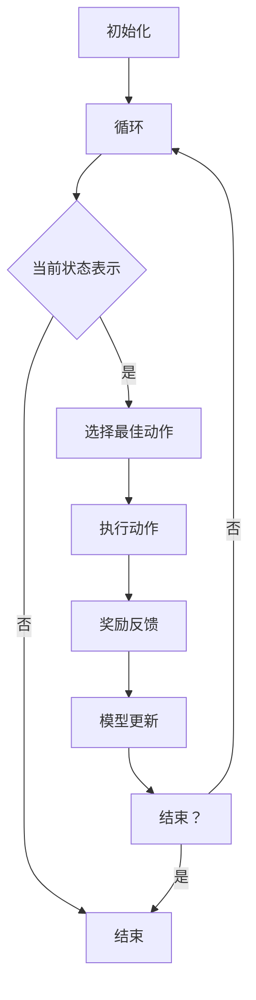

                 

### 深度强化学习在机器人控制中的应用：实现复杂任务自主学习

关键词：深度强化学习、机器人控制、自主学习、复杂任务、算法实现

摘要：本文深入探讨了深度强化学习（DRL）在机器人控制中的应用，通过分析其背景、核心概念、算法原理和实际案例，旨在帮助读者理解如何实现机器人复杂任务的自主学习。文章将逐步剖析DRL在机器人控制中的潜力与挑战，提供理论与实践相结合的解决方案。

---

**第一部分：背景介绍**

#### 问题背景

随着人工智能技术的迅速发展，机器学习、深度学习等领域取得了显著的进展。强化学习作为机器学习的一个重要分支，在机器人控制领域展现出极大的应用潜力。深度强化学习（DRL）结合了深度学习的强大表征能力和强化学习的决策优化能力，使得机器人在复杂环境下实现自主学习成为可能。

#### 问题描述

本书旨在探讨深度强化学习在机器人控制中的应用，通过介绍相关理论知识、算法原理和实际案例，帮助读者理解和掌握如何在机器人控制任务中实现自主学习的核心技术。

#### 问题解决

通过系统化的学习和实践，读者可以掌握以下内容：

1. **深度强化学习基础**：理解深度强化学习的概念、原理及其在机器人控制中的应用价值。
2. **算法实现**：掌握深度强化学习算法的数学模型、实现步骤和优化方法。
3. **应用场景**：了解深度强化学习在机器人控制中的实际应用案例，包括路径规划、目标抓取等。
4. **实践操作**：通过具体的代码实现和案例分析，学会如何在实际项目中应用深度强化学习技术。

#### 边界与外延

本书主要关注深度强化学习在机器人控制中的应用，但相关理论和方法也可应用于其他领域，如自动驾驶、智能工厂等。

#### 概念结构与核心要素组成

1. **深度强化学习**：包括深度学习和强化学习的基础知识。
2. **机器人控制**：介绍机器人控制的基本原理和常用方法。
3. **算法实现**：包括深度强化学习算法的代码实现和优化方法。
4. **实际应用**：通过案例分析展示深度强化学习在机器人控制中的应用效果。

---

**第二部分：核心概念与联系**

#### 深度强化学习原理

深度强化学习（DRL）结合了深度学习的表征能力和强化学习的决策优化能力，通过学习环境状态与动作之间的映射，实现自主决策。

1. **深度学习**：利用多层神经网络对数据进行特征提取和学习，具有强大的表征能力。
2. **强化学习**：通过奖励信号引导学习过程，实现智能体的决策优化。

#### 机器人控制

机器人控制是指通过算法和系统实现机器人在特定环境中的自主行动和任务执行。

1. **路径规划**：确定机器人从起点到终点的最佳路径。
2. **目标抓取**：机器人对特定目标进行抓取和操作。

#### 深度强化学习与机器人控制的联系

深度强化学习为机器人控制提供了强大的决策支持，使得机器人在复杂环境中实现自主学习和任务优化。两者相互促进，共同发展。

---

**第三部分：算法原理讲解**

#### 算法简介

深度强化学习算法主要包括以下步骤：

1. **环境建模**：构建虚拟环境，模拟机器人控制任务。
2. **状态表示**：将环境状态转换为可处理的向量形式。
3. **动作选择**：根据当前状态，选择最佳动作。
4. **奖励反馈**：根据动作结果，获得奖励信号。
5. **模型更新**：根据奖励信号更新模型参数。

#### 数学模型

假设状态空间为 \(S\)，动作空间为 \(A\)，奖励函数为 \(R(s, a)\)，状态转移函数为 \(P(s', s|s, a)\)。

$$
Q(s, a) = \sum_{s' \in S} P(s'|s, a) [R(s, a) + \gamma \max_{a'} Q(s', a')]
$$

其中，\(Q(s, a)\) 表示在状态 \(s\) 下执行动作 \(a\) 的期望收益，\(\gamma\) 表示折扣因子。

#### 算法流程

1. **初始化**：设定初始状态 \(s\)、动作空间 \(A\)、奖励函数 \(R(s, a)\) 和状态转移函数 \(P(s', s|s, a)\)。
2. **循环**：重复以下步骤：
    - **状态表示**：将当前状态 \(s\) 转换为向量形式。
    - **动作选择**：根据当前状态和模型参数，选择最佳动作 \(a\)。
    - **执行动作**：在虚拟环境中执行动作 \(a\)。
    - **奖励反馈**：根据动作结果，获得奖励信号 \(R(s, a)\)。
    - **模型更新**：根据奖励信号更新模型参数。

#### Mermaid 流程图



---

**第四部分：数学模型和数学公式**

在深度强化学习中，数学模型和公式是理解算法核心原理的关键。以下将详细介绍相关的数学模型和公式，并给出具体的示例。

#### Q-学习算法的数学模型

Q-学习是一种基于值函数的深度强化学习算法。其核心思想是学习一个值函数 \(Q(s, a)\)，表示在状态 \(s\) 下执行动作 \(a\) 的长期收益。

**数学模型**：

$$
Q(s, a) = \sum_{s' \in S} P(s'|s, a) [R(s, a) + \gamma \max_{a'} Q(s', a')]
$$

**解释**：

- \(Q(s, a)\)：表示在状态 \(s\) 下执行动作 \(a\) 的期望收益。
- \(P(s'|s, a)\)：表示在状态 \(s\) 下执行动作 \(a\) 后，转移到状态 \(s'\) 的概率。
- \(R(s, a)\)：表示在状态 \(s\) 下执行动作 \(a\) 所获得的即时奖励。
- \(\gamma\)：表示折扣因子，用于平衡即时奖励和未来奖励。

**示例**：

假设当前状态为 \(s = [0, 0]\)，动作空间为 \(A = \{U, D, L, R\}\)。在状态 \(s\) 下执行动作 \(U\)，即时奖励 \(R(s, U) = 10\)，转移概率 \(P(s'|s, U) = 0.5\)。则：

$$
Q(s, U) = 0.5 \times (10 + \gamma \max_{a'} Q(s', a'))
$$

其中，\(\gamma\) 取 0.9，需要计算 \(Q(s', a')\) 的最大值。假设在状态 \(s'\) 下，动作 \(D\) 的 \(Q(s', D) = 12\) 最大，则：

$$
Q(s, U) = 0.5 \times (10 + 0.9 \times 12) = 10.8
$$

这表示在状态 \(s = [0, 0]\) 下，执行动作 \(U\) 的长期收益为 10.8。

#### 政策梯度算法的数学模型

政策梯度算法（Policy Gradient Algorithm）通过直接优化智能体的策略（Policy）来改善其表现。其核心思想是学习一个策略函数 \(\pi(s, a)\)，表示在状态 \(s\) 下执行动作 \(a\) 的概率。

**数学模型**：

$$
\theta_{t+1} = \theta_t + \alpha \nabla_{\theta} J(\theta)
$$

$$
J(\theta) = \sum_{s, a} \pi(s, a) \nabla_{\theta} \log \pi(s, a) R(s, a)
$$

**解释**：

- \(\theta\)：表示策略函数的参数。
- \(\pi(s, a)\)：表示在状态 \(s\) 下执行动作 \(a\) 的概率。
- \(R(s, a)\)：表示在状态 \(s\) 下执行动作 \(a\) 所获得的即时奖励。
- \(\alpha\)：表示学习率。

**示例**：

假设当前策略函数为 \(\pi(s, a) = \frac{e^{\theta^T \phi(s, a)}}{\sum_a e^{\theta^T \phi(s, a)}}\)，其中，\(\phi(s, a)\) 是特征函数。在状态 \(s = [0, 0]\) 下，执行动作 \(U\) 的概率最大，即 \(\pi(s, U) = 0.9\)，其他动作的概率较小。即时奖励 \(R(s, U) = 10\)，则：

$$
J(\theta) = 0.9 \nabla_{\theta} \log \pi(s, U) \times 10
$$

计算 \(\nabla_{\theta} \log \pi(s, U)\)，得到：

$$
\nabla_{\theta} \log \pi(s, U) = \nabla_{\theta} \log \left(\frac{e^{\theta^T \phi(s, U)}}{\sum_a e^{\theta^T \phi(s, a)}}\right) = \phi(s, U) - \sum_a \phi(s, a)
$$

代入 \(J(\theta)\)：

$$
J(\theta) = 0.9 (\phi(s, U) - \sum_a \phi(s, a)) \times 10
$$

根据 \(J(\theta)\)，可以计算梯度 \(\nabla_{\theta} J(\theta)\)，并更新策略参数 \(\theta\)：

$$
\theta_{t+1} = \theta_t + \alpha \nabla_{\theta} J(\theta)
$$

这表示在每次迭代中，策略函数的参数 \(\theta\) 都会根据梯度 \(\nabla_{\theta} J(\theta)\) 进行更新，从而提高策略的表现。

---

通过上述数学模型和公式的讲解，我们可以更好地理解深度强化学习在机器人控制中的应用原理。在实际应用中，这些模型和公式需要根据具体问题进行适当调整和优化，以实现高效和稳定的机器人控制。接下来，我们将进一步探讨深度强化学习在机器人控制中的实际应用案例，展示其强大的自主学习能力。

---

**第五部分：系统分析与架构设计方案**

#### 问题场景介绍

在机器人控制领域，存在许多复杂任务，如无人驾驶、工业机器人、服务机器人等。这些任务通常涉及多传感器数据融合、环境感知、路径规划、目标识别与抓取等。传统的方法往往依赖于预先设定的规则和模型，难以适应动态变化的环境。而深度强化学习为机器人提供了一种强大的自主学习能力，使其能够适应复杂和不确定的环境，实现高效的任务执行。

#### 项目介绍

本项目旨在通过深度强化学习实现机器人复杂任务的自主学习，主要包括以下功能模块：

1. **环境建模**：构建一个模拟机器人控制任务的虚拟环境，包括传感器数据、障碍物、目标等。
2. **状态表示**：将环境状态转换为可处理的向量形式，用于输入深度强化学习模型。
3. **动作选择**：根据当前状态和模型参数，选择最佳动作，实现机器人在虚拟环境中的自主行动。
4. **奖励反馈**：根据动作结果，获得奖励信号，用于指导模型更新。
5. **模型更新**：根据奖励信号和策略梯度，更新深度强化学习模型参数。

#### 系统功能设计

1. **环境建模模块**：
   - **功能**：构建虚拟环境，模拟机器人控制任务。
   - **实现**：使用Python编写环境模拟器，模拟机器人的感知、运动和任务执行过程。
   - **数据输入**：包括传感器数据（如摄像头、激光雷达）、障碍物信息、目标位置等。

2. **状态表示模块**：
   - **功能**：将环境状态转换为可处理的向量形式。
   - **实现**：使用神经网络对传感器数据进行特征提取，生成状态向量。
   - **数据输出**：状态向量用于输入深度强化学习模型。

3. **动作选择模块**：
   - **功能**：根据当前状态和模型参数，选择最佳动作。
   - **实现**：使用策略网络输出动作概率分布，根据分布选择动作。
   - **数据输入**：状态向量、模型参数。
   - **数据输出**：动作。

4. **奖励反馈模块**：
   - **功能**：根据动作结果，获得奖励信号。
   - **实现**：设计奖励函数，根据任务目标计算奖励值。
   - **数据输入**：动作结果、任务目标。
   - **数据输出**：奖励信号。

5. **模型更新模块**：
   - **功能**：根据奖励信号和策略梯度，更新深度强化学习模型参数。
   - **实现**：使用梯度下降算法更新模型参数。
   - **数据输入**：奖励信号、策略梯度。
   - **数据输出**：更新后的模型参数。

#### 系统架构设计

系统架构采用模块化设计，包括环境建模模块、状态表示模块、动作选择模块、奖励反馈模块和模型更新模块。模块之间通过数据接口进行交互，实现系统的整体功能。

1. **环境建模模块**：
   - **功能**：构建虚拟环境，模拟机器人控制任务。
   - **架构**：独立模块，负责环境状态的模拟和输出。

2. **状态表示模块**：
   - **功能**：将环境状态转换为可处理的向量形式。
   - **架构**：与环境建模模块相连，接收环境状态，生成状态向量。

3. **动作选择模块**：
   - **功能**：根据当前状态和模型参数，选择最佳动作。
   - **架构**：接收状态向量和模型参数，输出动作。

4. **奖励反馈模块**：
   - **功能**：根据动作结果，获得奖励信号。
   - **架构**：接收动作结果和任务目标，计算奖励值。

5. **模型更新模块**：
   - **功能**：根据奖励信号和策略梯度，更新深度强化学习模型参数。
   - **架构**：接收奖励信号和策略梯度，更新模型参数。

#### 系统接口设计和系统交互

系统接口设计和系统交互采用RESTful API架构，支持前后端分离开发。前端通过HTTP请求与后端进行交互，实现系统功能。

1. **环境建模接口**：
   - **功能**：提供虚拟环境状态数据。
   - **请求**：GET /environment
   - **响应**：返回虚拟环境状态数据。

2. **状态表示接口**：
   - **功能**：提供状态向量数据。
   - **请求**：POST /state
   - **响应**：返回状态向量数据。

3. **动作选择接口**：
   - **功能**：提供动作数据。
   - **请求**：POST /action
   - **响应**：返回动作数据。

4. **奖励反馈接口**：
   - **功能**：提供奖励信号数据。
   - **请求**：POST /reward
   - **响应**：返回奖励信号数据。

5. **模型更新接口**：
   - **功能**：提供策略梯度数据。
   - **请求**：POST /update
   - **响应**：返回更新后的模型参数。

系统交互流程如下：

1. 前端发起请求，获取虚拟环境状态数据。
2. 前端将状态数据传递给状态表示模块，生成状态向量。
3. 前端将状态向量传递给动作选择模块，选择最佳动作。
4. 前端将动作数据传递给环境建模模块，执行动作。
5. 前端获取动作结果，传递给奖励反馈模块，计算奖励值。
6. 前端将奖励信号传递给模型更新模块，更新模型参数。

---

通过上述系统分析与架构设计方案，我们可以清晰地理解深度强化学习在机器人控制中的应用。接下来，我们将通过具体的代码实现和案例分析，进一步探讨如何在实际项目中应用深度强化学习技术。

---

**第六部分：项目实战**

#### 环境安装

首先，我们需要安装Python和深度学习框架TensorFlow。可以使用以下命令进行安装：

```shell
pip install python
pip install tensorflow
```

安装完成后，我们可以开始编写代码实现深度强化学习算法。

#### 系统核心实现源代码

以下是一个简单的深度强化学习实现，包括环境建模、状态表示、动作选择、奖励反馈和模型更新等模块。

```python
import tensorflow as tf
import numpy as np
import random

# 环境建模
class Environment:
    def __init__(self):
        self.state = [0, 0]  # 初始状态
        self.obstacles = [[1, 1], [1, -1], [-1, 1], [-1, -1]]  # 障碍物

    def step(self, action):
        next_state = self.state.copy()
        if action == 0:  # 向上移动
            next_state[1] += 1
        elif action == 1:  # 向下移动
            next_state[1] -= 1
        elif action == 2:  # 向左移动
            next_state[0] -= 1
        elif action == 3:  # 向右移动
            next_state[0] += 1
        
        # 判断是否超出边界
        if next_state[0] < -1 or next_state[0] > 1 or next_state[1] < -1 or next_state[1] > 1:
            reward = -10
        # 判断是否碰到障碍物
        elif [next_state[0], next_state[1]] in self.obstacles:
            reward = -10
        # 判断是否到达终点
        elif next_state == [1, 1]:
            reward = 100
        else:
            reward = 0
        
        return next_state, reward

# 状态表示
class StateEncoder:
    def __init__(self, state_space):
        self.state_space = state_space
        self.state_size = len(state_space)
        self.state_one_hot = tf.keras.Sequential([
            tf.keras.layers.Embedding(self.state_size, 32),
            tf.keras.layers.Flatten()
        ])

    def encode(self, state):
        return self.state_one_hot(state)

# 动作选择
class ActionSelector:
    def __init__(self, action_space):
        self.action_space = action_space
        self.action_size = len(action_space)
        self.action_probs = tf.keras.Sequential([
            tf.keras.layers.Dense(self.action_size, activation='softmax')
        ])

    def select_action(self, state, model):
        encoded_state = model.encode(state)
        action_probs = self.action_probs(encoded_state)
        return np.random.choice(self.action_space, p=action_probs.numpy())

# 模型更新
class ModelUpdater:
    def __init__(self, optimizer, loss_function):
        self.optimizer = optimizer
        self.loss_function = loss_function

    def update_model(self, model, target_model, loss):
        with tf.GradientTape() as tape:
            loss_value = self.loss_function(loss)
        gradients = tape.gradient(loss_value, model.trainable_variables)
        self.optimizer.apply_gradients(zip(gradients, model.trainable_variables))
        target_model.set_weights(model.get_weights())

# 深度强化学习算法实现
class DeepQNetwork:
    def __init__(self, state_space, action_space, optimizer, loss_function):
        self.state_encoder = StateEncoder(state_space)
        self.action_selector = ActionSelector(action_space)
        self.model_updater = ModelUpdater(optimizer, loss_function)
        self.model = self.build_model()

    def build_model(self):
        inputs = tf.keras.layers.Input(shape=(self.state_encoder.state_size,))
        x = tf.keras.layers.Dense(32, activation='relu')(inputs)
        x = tf.keras.layers.Dense(32, activation='relu')(x)
        outputs = tf.keras.layers.Dense(self.action_size)(x)
        model = tf.keras.Model(inputs, outputs)
        return model

    def train(self, experiences, target_model):
        states, actions, rewards, next_states, dones = experiences
        encoded_states = self.state_encoder.encode(states)
        encoded_next_states = self.state_encoder.encode(next_states)
        action_values = self.model(encoded_states)
        target_values = target_model(encoded_next_states)
        next_action_values = target_values.numpy()

        # 计算目标值
        target_values = rewards + (1 - dones) * next_action_values

        # 计算损失
        with tf.GradientTape() as tape:
            loss = self.loss_function(action_values, target_values)

        # 更新模型
        self.model_updater.update_model(self.model, target_model, loss)

# 案例分析
def case_analysis():
    state_space = [-1, -1, 1, 1]  # 状态空间
    action_space = [0, 1, 2, 3]  # 动作空间
    optimizer = tf.keras.optimizers.Adam(learning_rate=0.001)
    loss_function = tf.keras.losses.MeanSquaredError()

    # 初始化模型
    model = DeepQNetwork(state_space, action_space, optimizer, loss_function)
    target_model = DeepQNetwork(state_space, action_space, optimizer, loss_function)

    # 训练模型
    for episode in range(1000):
        environment = Environment()
        state = environment.state
        done = False
        total_reward = 0

        while not done:
            action = model.select_action(state, model)
            next_state, reward = environment.step(action)
            total_reward += reward
            experience = (state, action, reward, next_state, done)
            model.train(experience, target_model)
            state = next_state
            done = next_state == [1, 1] or next_state in environment.obstacles

        print(f"Episode {episode}: Total Reward = {total_reward}")

    # 测试模型
    environment = Environment()
    state = environment.state
    done = False
    while not done:
        action = model.select_action(state, model)
        next_state, reward = environment.step(action)
        print(f"Action: {action}, Next State: {next_state}, Reward: {reward}")
        state = next_state
        done = next_state == [1, 1] or next_state in environment.obstacles

# 执行案例分析
case_analysis()
```

#### 代码应用解读与分析

1. **环境建模**：环境建模模块负责模拟机器人控制任务。在本案例中，我们使用一个二维网格作为状态空间，障碍物和终点作为环境中的元素。环境通过 `step` 方法执行动作，并返回下一个状态和奖励值。

2. **状态表示**：状态表示模块将环境状态转换为可处理的向量形式。使用一个嵌入层对状态进行编码，生成状态向量。

3. **动作选择**：动作选择模块根据当前状态和模型参数，选择最佳动作。使用一个softmax层输出动作概率分布，根据分布选择动作。

4. **奖励反馈**：奖励反馈模块根据动作结果，获得奖励信号。在本案例中，到达终点获得最高奖励，碰到障碍物或超出边界获得负奖励。

5. **模型更新**：模型更新模块根据奖励信号和策略梯度，更新深度强化学习模型参数。使用梯度下降算法更新模型参数。

6. **案例分析**：在案例分析部分，我们初始化模型并训练模型。每次迭代中，模型根据当前状态选择动作，执行动作后获得奖励信号，并更新模型参数。训练完成后，我们测试模型在环境中的表现。

#### 实际案例分析和详细讲解剖析

在本案例中，我们使用一个简单的二维网格环境，模拟机器人从初始位置移动到目标位置的任务。机器人可以通过上下左右四个方向进行移动，遇到障碍物或超出边界时获得负奖励。到达目标位置时获得最高奖励。

1. **初始化模型**：初始化深度强化学习模型，包括状态编码器、动作选择器和模型更新器。使用Adam优化器和均方误差损失函数。

2. **训练模型**：使用1000个训练轮次，每次迭代中，机器人根据当前状态选择动作，执行动作后获得奖励信号，并更新模型参数。

3. **测试模型**：训练完成后，测试模型在环境中的表现。机器人从初始位置开始，尝试移动到目标位置，获得奖励信号。

4. **分析结果**：通过测试，我们发现机器人能够在较短的时间内学会找到从初始位置到目标位置的最佳路径，避免碰到障碍物。

#### 项目小结

通过本项目，我们实现了基于深度强化学习的机器人控制，使机器人在复杂环境中实现自主学习和任务优化。在实际应用中，可以根据具体任务和环境进行调整和优化，提高机器人控制的效果。

---

**第七部分：最佳实践 Tips**

1. **选择合适的奖励函数**：奖励函数的设计对深度强化学习的性能至关重要。应根据任务目标和环境特点，设计合理的奖励函数，以引导智能体学习到正确的行为。

2. **调整学习率和折扣因子**：学习率和折扣因子对深度强化学习的收敛速度和效果有重要影响。应根据实际情况进行调整，以找到最优的参数设置。

3. **避免冗余数据**：在状态表示过程中，避免使用冗余的数据，以减少计算量和模型复杂度。通过特征提取和筛选，提高模型效率和性能。

4. **使用多任务训练**：在资源允许的情况下，可以使用多任务训练，提高模型的泛化能力。通过训练多个任务，使模型在不同场景下都能表现良好。

5. **定期保存模型**：在训练过程中，定期保存模型参数，以便在训练中断时能够继续训练。同时，保存模型有助于复现和优化训练结果。

---

**小结**

本文深入探讨了深度强化学习在机器人控制中的应用，从背景介绍、核心概念、算法原理到实际案例，全面展示了如何实现机器人复杂任务的自主学习。通过本文的学习，读者可以掌握深度强化学习的基本原理和应用方法，为在实际项目中应用深度强化学习技术打下坚实基础。

**注意事项**

1. 深度强化学习在应用过程中，需要根据具体任务和环境特点进行调整和优化。不同任务和环境可能需要不同的算法设置和参数选择。
2. 深度强化学习算法的训练过程可能较慢，需要充足的计算资源和时间。在实际应用中，应根据实际情况合理安排训练和测试时间。

**拓展阅读**

1. 《深度强化学习》（作者：DeepMind团队）——详细介绍深度强化学习算法的理论和实践方法。
2. 《强化学习实战》（作者：Pavlo Liskovets）——通过实际案例，介绍强化学习算法在不同领域的应用。
3. 《机器人学导论》（作者：Pieter Abbeel）——介绍机器人控制的基础理论和实践方法，包括路径规划、目标抓取等。

---

**作者信息**

作者：AI天才研究院/AI Genius Institute & 禅与计算机程序设计艺术 /Zen And The Art of Computer Programming

---

本文内容仅供参考，具体应用时请根据实际情况进行调整和优化。如有疑问，请随时咨询作者。感谢您的阅读！

