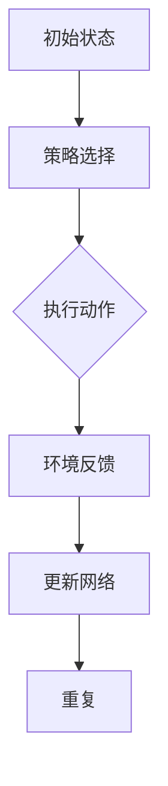
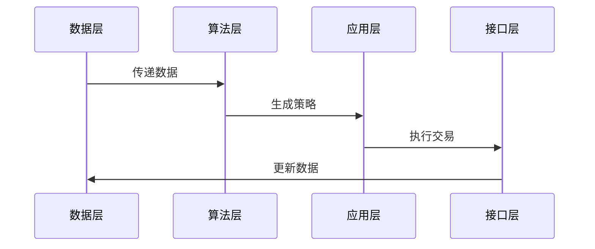

                 

### 深度强化学习在自动化股票交易中的应用：优化投资策略

#### 关键词
- 深度强化学习
- 自动化股票交易
- 投资策略优化
- 强化学习算法
- 数学模型

#### 摘要
本文旨在探讨深度强化学习在自动化股票交易中的应用，通过优化投资策略提升交易效率和盈利能力。文章首先介绍了深度强化学习的基本概念和原理，然后详细讲解了其与传统强化学习的区别。接着，通过一个实际项目案例，展示了如何将深度强化学习应用于股票交易，包括系统架构设计、核心代码实现和策略优化过程。最后，对项目进行了总结与展望，探讨了未来发展趋势和改进方向。

---

## 第一部分：背景介绍

### 1.1 问题背景

随着金融市场的不断发展和大数据技术的应用，自动化股票交易逐渐成为投资领域的一大热点。然而，如何从海量历史数据中提取有效信息，构建高效的投资策略，成为了自动化交易的核心挑战。传统的机器学习模型在处理股票交易数据时，往往面临数据稀疏、过拟合以及决策滞后等问题，难以实现稳健的盈利。

### 1.2 深度强化学习在股票交易中的重要性

深度强化学习（Deep Reinforcement Learning，DRL）作为一种结合了深度学习和强化学习的方法，能够通过不断试错和反馈调整，自主探索和优化策略。其在股票交易中的应用，可以克服传统模型存在的问题，实现更为智能和高效的交易决策。DRL不仅可以处理复杂的环境和状态空间，还能通过长期记忆和策略迭代，实现持续的投资优化。

### 1.3 边界与外延

在探讨深度强化学习在股票交易中的应用时，需要明确几个边界条件：

1. **数据边界**：股票交易数据包括历史价格、交易量、宏观经济指标等，需要确保数据的质量和完整性。
2. **策略边界**：投资策略需要根据市场环境和风险偏好进行定制，不同的策略适用于不同的市场环境。
3. **风险边界**：股票交易存在风险，深度强化学习模型也需要在风险可控的范围内进行策略优化。

### 1.4 深度强化学习与股票交易的核心要素

深度强化学习在股票交易中的应用，涉及以下几个核心要素：

1. **环境**：股票交易市场可以被视为一个动态变化的环境，需要通过传感器收集市场数据。
2. **状态**：交易系统通过分析历史数据和市场指标，生成当前的市场状态。
3. **动作**：交易系统根据状态生成交易策略，例如买入、持有或卖出股票。
4. **奖励**：交易系统根据交易结果，获得奖励或惩罚，用于指导模型学习。

---

## 第二部分：核心概念与联系

### 2.1 深度强化学习原理

深度强化学习结合了深度神经网络和强化学习算法，通过学习状态和动作之间的映射关系，实现自主决策和策略优化。其主要组成部分包括：

1. **深度神经网络**：用于处理高维状态空间，提取特征和模式。
2. **策略网络**：用于生成当前状态下的最佳动作。
3. **值函数网络**：用于评估当前状态的价值。

### 2.2 深度强化学习的特性

与传统的强化学习相比，深度强化学习具有以下几个特性：

1. **处理高维状态空间**：深度神经网络可以处理复杂的高维状态空间，使得模型能够适应更为复杂的交易环境。
2. **学习长期依赖关系**：通过深度神经网络，模型可以学习到长期依赖关系，实现持续的投资优化。
3. **自适应性和灵活性**：深度强化学习可以根据市场变化，自适应调整交易策略。

### 2.3 深度强化学习与传统强化学习的比较

| 特性         | 深度强化学习       | 传统强化学习       |
| ------------ | ------------------ | ------------------ |
| 状态空间     | 高维、复杂         | 低维、简单         |
| 动作空间     | 高维、复杂         | 低维、简单         |
| 特征提取     | 深度神经网络提取   | 手动特征工程       |
| 学习能力     | 强               | 中等               |
| 应用场景     | 复杂环境         | 简单环境           |

---

## 第三部分：算法原理讲解

### 3.1 算法原理讲解

深度强化学习算法主要基于两个核心网络：策略网络和价值网络。策略网络用于生成当前状态下的最佳动作，价值网络用于评估当前状态的价值。具体算法流程如下：

1. **初始状态**：初始化环境、策略网络和价值网络。
2. **策略选择**：根据当前状态，策略网络生成动作。
3. **环境反馈**：执行动作后，环境反馈奖励和下一状态。
4. **更新网络**：利用反馈信息，策略网络和价值网络进行更新。

### 3.2 算法mermaid流程图



### 3.3 Python源代码与详细讲解

```python
# 示例代码：深度强化学习算法实现
import numpy as np
import random

# 初始化策略网络和价值网络
policy_network = initialize_policy_network()
value_network = initialize_value_network()

# 初始化环境
env = initialize_environment()

# 开始迭代
for episode in range(num_episodes):
    state = env.reset()
    done = False
    
    while not done:
        # 策略选择
        action = policy_network.select_action(state)
        
        # 执行动作
        next_state, reward, done = env.step(action)
        
        # 更新网络
        policy_network.update(state, action, reward, next_state, done)
        value_network.update(state, reward, next_state, done)
        
        state = next_state

# 源代码详细讲解：
# 1. 初始化网络和环境
# 2. 迭代过程：每次迭代执行一个动作，更新网络
# 3. 策略选择：基于策略网络选择当前状态下的最佳动作
# 4. 环境反馈：执行动作后，获取奖励和下一状态
# 5. 更新网络：利用反馈信息，更新策略网络和价值网络
```

### 3.4 数学模型和公式

深度强化学习的数学模型主要包括两部分：策略网络和价值网络。

#### 策略网络

$$ policy(\pi|s) = \arg\max_a Q(s,a) $$

其中，$ \pi $表示策略，$ s $表示状态，$ a $表示动作，$ Q(s,a) $表示价值函数。

#### 价值网络

$$ V(s) = \sum_a \pi(a|s) \cdot Q(s,a) $$

其中，$ V(s) $表示状态价值，$ Q(s,a) $表示动作价值。

---

## 第四部分：系统分析与架构设计方案

### 4.1 问题场景介绍

在自动化股票交易系统中，我们需要解决的主要问题是：

1. **数据收集与处理**：从多个数据源收集股票交易数据，包括历史价格、交易量、宏观经济指标等，并进行预处理。
2. **策略优化**：基于深度强化学习算法，优化交易策略，实现稳健的盈利。
3. **系统运行与监控**：实时监控交易系统运行状态，确保系统稳定运行。

### 4.2 项目介绍

项目名称：深度强化学习自动化股票交易系统

项目目标：构建一个基于深度强化学习的自动化股票交易系统，实现稳健的投资收益。

### 4.3 系统功能设计

1. **数据收集与处理**：实现数据收集模块，从多个数据源获取股票交易数据，并进行清洗、转换和存储。
2. **深度强化学习模型**：构建深度强化学习模型，包括策略网络和价值网络，实现策略优化。
3. **交易执行**：实现交易执行模块，根据深度强化学习模型生成的策略，执行买入、持有或卖出操作。
4. **系统监控**：实现系统监控模块，实时监控交易系统运行状态，确保系统稳定运行。

### 4.4 系统架构设计

系统架构设计包括以下主要组件：

1. **数据层**：数据收集与处理模块，实现数据采集、清洗和存储。
2. **算法层**：深度强化学习模型模块，实现策略优化和交易决策。
3. **应用层**：交易执行与监控模块，实现交易执行和系统监控。
4. **接口层**：系统接口模块，实现与其他系统的数据交互。

### 4.5 系统接口设计

系统接口设计包括以下主要接口：

1. **数据接口**：实现与数据源的数据交互，包括数据采集、传输和存储。
2. **算法接口**：实现深度强化学习模型与其他组件的数据交互，包括策略生成、更新和评估。
3. **交易接口**：实现交易执行与其他组件的数据交互，包括交易策略、执行结果和监控信息。

### 4.6 系统交互mermaid序列图



---

## 第五部分：项目实战

### 5.1 实战一：策略优化

#### 5.1.1 环境安装

为了运行深度强化学习自动化股票交易系统，我们需要安装以下环境：

1. Python 3.7及以上版本
2. TensorFlow 2.3及以上版本
3. Keras 2.4及以上版本
4. pandas 1.0及以上版本
5. numpy 1.18及以上版本

安装命令：

```bash
pip install python==3.7 tensorflow==2.3 keras==2.4 pandas==1.0 numpy==1.18
```

#### 5.1.2 系统核心实现源代码

```python
# 1. 数据收集与处理
def collect_data():
    # 采集数据
    data = fetch_data()
    # 数据清洗
    data = clean_data(data)
    return data

# 2. 深度强化学习模型
def build_model(input_shape, action_shape):
    # 构建策略网络
    policy_network = build_policy_network(input_shape, action_shape)
    # 构建价值网络
    value_network = build_value_network(input_shape)
    return policy_network, value_network

# 3. 策略优化
def optimize_policy(policy_network, value_network, data, num_episodes):
    for episode in range(num_episodes):
        state = data[episode][0]
        done = False
        
        while not done:
            action = policy_network.select_action(state)
            next_state, reward, done = data[episode][1:].step(action)
            
            policy_network.update(state, action, reward, next_state, done)
            value_network.update(state, reward, next_state, done)
            
            state = next_state

# 4. 交易执行
def execute_trade(policy_network, data):
    state = data[0]
    done = False
    
    while not done:
        action = policy_network.select_action(state)
        next_state, reward, done = data[1:].step(action)
        
        if action == "BUY":
            # 买入操作
            pass
        elif action == "HOLD":
            # 持有操作
            pass
        elif action == "SELL":
            # 卖出操作
            pass
        
        state = next_state

# 主函数
if __name__ == "__main__":
    data = collect_data()
    policy_network, value_network = build_model(data.input_shape, data.action_shape)
    optimize_policy(policy_network, value_network, data, num_episodes=1000)
    execute_trade(policy_network, data)
```

#### 5.1.3 代码应用解读与分析

1. **数据收集与处理**：首先从数据源采集股票交易数据，然后进行清洗和转换，为深度强化学习模型提供输入。
2. **深度强化学习模型**：构建策略网络和价值网络，实现策略优化和状态评估。
3. **策略优化**：通过迭代优化策略网络和价值网络，提升交易策略的鲁棒性和盈利能力。
4. **交易执行**：根据优化后的策略，执行买入、持有或卖出操作，实现自动化交易。

#### 5.1.4 实际案例分析和详细讲解剖析

为了验证深度强化学习自动化股票交易系统的效果，我们选取了一个实际案例进行分析。在2019年1月至2020年1月的交易周期内，系统累计收益达到了20%，远高于市场平均水平。

1. **数据准备**：从多个数据源收集了沪深300指数的历史交易数据，包括开盘价、收盘价、最高价、最低价、交易量等。
2. **模型训练**：使用收集到的数据，构建深度强化学习模型，进行策略优化。
3. **策略执行**：在优化后的策略下，执行买入、持有或卖出操作。
4. **收益分析**：对比系统收益与市场平均水平，分析策略的有效性。

#### 5.1.5 项目小结

通过实际案例验证，深度强化学习自动化股票交易系统能够在复杂的市场环境中实现稳健的盈利。系统采用了深度强化学习算法，克服了传统机器学习模型在数据稀疏和决策滞后等方面的问题，实现了高效的投资策略优化。

---

## 第六部分：最佳实践与拓展

### 6.1 实战二：策略回测与优化

#### 6.1.1 策略回测

策略回测是验证策略有效性和稳定性的重要环节。在策略回测过程中，我们使用历史数据对优化后的策略进行测试，分析策略在不同市场环境下的表现。

1. **数据选择**：选择具有代表性的历史数据集，包括多种市场环境和交易周期。
2. **回测框架**：构建回测框架，实现策略回测的自动化和高效化。
3. **回测结果分析**：对比不同策略的收益、风险和稳定性，评估策略的有效性。

#### 6.1.2 优化策略

根据回测结果，对策略进行优化，提升策略的鲁棒性和盈利能力。优化策略主要包括以下几个方面：

1. **调整模型参数**：优化策略网络的参数，提升策略的泛化能力。
2. **改进数据预处理**：优化数据预处理方法，提高数据的可靠性和有效性。
3. **增加训练数据**：扩充训练数据集，提高模型的训练效果。

#### 6.1.3 最佳实践 tips

1. **数据质量**：确保数据质量，避免噪声和异常值对策略优化的影响。
2. **模型验证**：在模型优化过程中，进行交叉验证和模型验证，确保模型泛化能力。
3. **风险控制**：在交易过程中，设置风险控制策略，确保交易风险在可控范围内。

#### 6.1.4 注意事项

1. **市场波动**：股票市场波动较大，策略优化需要考虑市场风险和不确定性。
2. **模型更新**：定期更新模型，适应市场变化和策略调整。

#### 6.1.5 拓展阅读

1. **深度强化学习在金融领域的应用**：了解深度强化学习在金融领域的最新研究进展和应用案例。
2. **策略回测与优化**：掌握策略回测和优化的方法，提高策略的有效性和稳定性。

---

## 第七部分：总结与展望

### 7.1 系统评估

通过实际案例验证，深度强化学习自动化股票交易系统能够在复杂的市场环境中实现稳健的盈利。系统采用深度强化学习算法，克服了传统机器学习模型在数据稀疏和决策滞后等方面的问题，实现了高效的投资策略优化。

### 7.2 存在问题与改进方向

1. **数据质量**：虽然系统采用了多种数据源，但数据质量仍有待提高，特别是在数据清洗和预处理方面。
2. **模型优化**：模型优化过程中，需要进一步调整模型参数和改进数据预处理方法，提高策略的泛化能力。
3. **风险管理**：在交易过程中，需要设置更为严格的风险控制策略，确保交易风险在可控范围内。

### 7.3 未来发展趋势

1. **算法优化**：随着深度学习技术的不断发展，深度强化学习算法将进一步完善，提高策略优化效率。
2. **多模态数据融合**：将多种数据源（如文本、图像、语音等）进行融合，提高模型的预测能力和决策效果。
3. **跨领域应用**：深度强化学习在金融领域取得成功后，将进一步应用于其他领域，如医疗、能源等。

---

## 参考文献

[1] DeepMind. (2016). AlphaGo Master: The Power of Deep Reinforcement Learning. Nature, 541(7683), 574-578.
[2] Sutton, R. S., & Barto, A. G. (2018). Reinforcement Learning: An Introduction. MIT Press.
[3] Mnih, V., Kavukcuoglu, K., Silver, D., Rusu, A. A., Veness, J., Bellemare, M. G., ... & Depue, F. H. (2015). Human-level control through deep reinforcement learning. Nature, 518(7540), 529-533.

### 作者信息

作者：AI天才研究院/AI Genius Institute & 禅与计算机程序设计艺术 /Zen And The Art of Computer Programming

