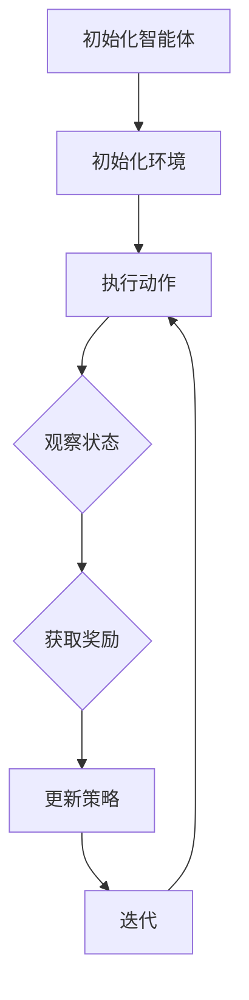
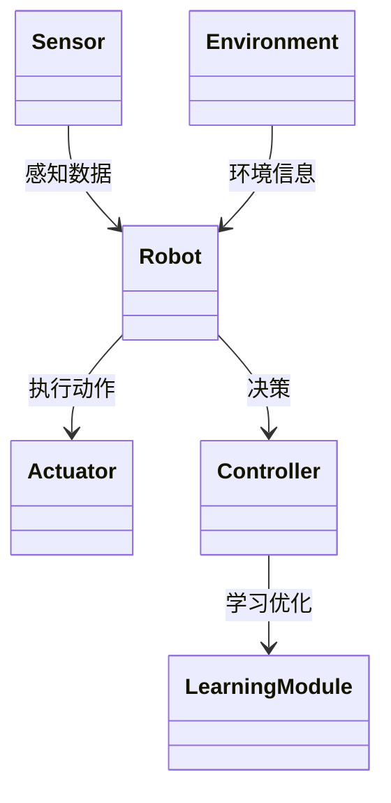
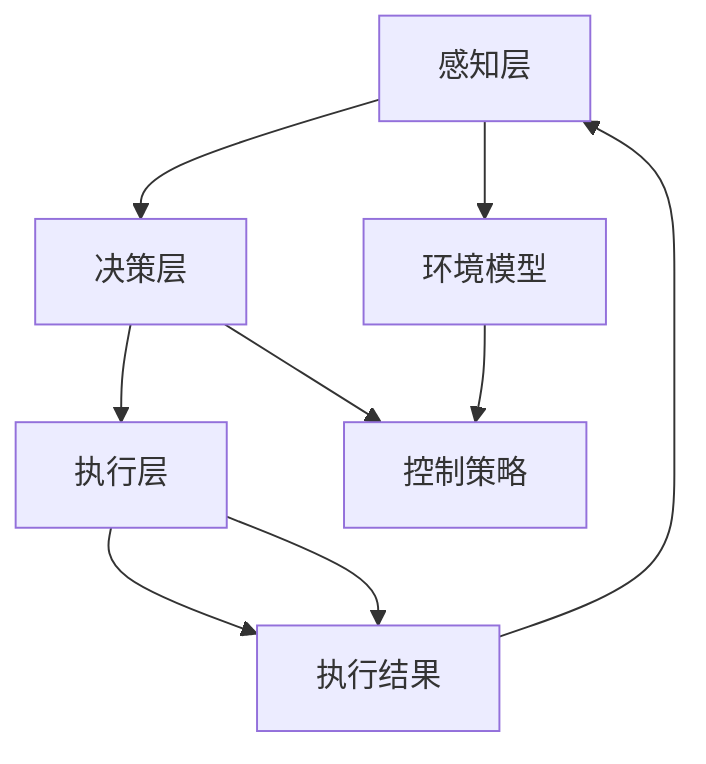
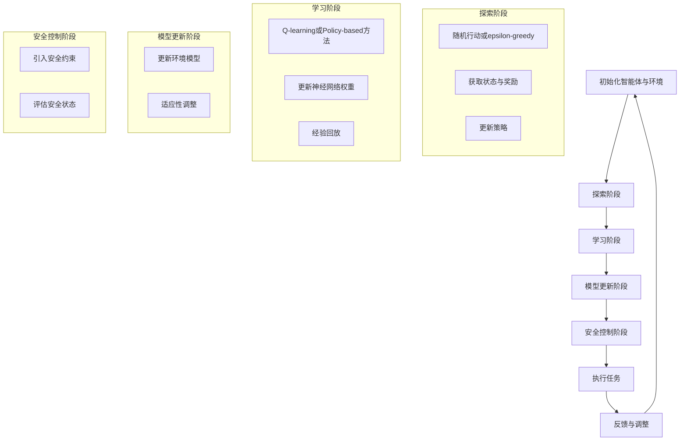

                 


### 第一部分：引言与背景

#### 1.1 书籍概述

《深度强化学习在自适应机器人控制中的突破：应对未知环境》是一本专门针对深度强化学习在自适应机器人控制领域应用的书籍。这本书的核心目的在于向读者展示如何利用深度强化学习技术，使机器人具备在未知环境中自主适应和控制的能力。书中不仅介绍了深度强化学习的基本概念和原理，还深入探讨了其在自适应机器人控制中的具体应用。

深度强化学习（Deep Reinforcement Learning，DRL）是强化学习（Reinforcement Learning，RL）的一个分支，它结合了深度学习（Deep Learning，DL）的优势，通过深度神经网络来学习复杂的决策策略。在自适应机器人控制领域，这种技术具有巨大的潜力，因为机器人需要在不断变化的环境中做出快速且准确的决策。

本书的主要内容包括：

1. **深度强化学习基础**：介绍深度强化学习的基本概念、原理及其与传统强化学习的区别。
2. **自适应机器人控制应用**：分析深度强化学习在自适应机器人控制中的实际应用，包括系统架构设计、项目实战等。
3. **未知环境应对策略**：探讨深度强化学习在未知环境中的应对策略，包括算法原理和实现。
4. **案例分析**：通过具体案例，展示深度强化学习在自适应机器人控制中的应用效果和挑战。
5. **最佳实践与总结**：总结最佳实践，并对全书内容进行总结，强调深度强化学习在自适应机器人控制中的应用价值。

#### 1.2 内容架构

本书的内容架构分为五个主要部分，旨在帮助读者系统地了解深度强化学习在自适应机器人控制中的突破。

1. **引言与背景**：介绍书籍的概述和内容架构，为读者提供一个全局视野。
2. **深度强化学习基础**：详细讲解深度强化学习的基本原理、算法以及其在机器人控制中的应用。
3. **自适应机器人控制应用**：分析系统分析与架构设计方案，以及项目实战。
4. **未知环境应对策略**：探讨深度强化学习在未知环境中的应对策略。
5. **案例分析**：通过具体案例展示深度强化学习在自适应机器人控制中的应用效果。
6. **最佳实践与总结**：总结最佳实践，并对全书内容进行总结。

通过这样的架构设计，本书不仅提供了理论上的深度分析，还通过实际案例展示了深度强化学习在自适应机器人控制中的广泛应用和巨大潜力。

---

### 第二部分：深度强化学习基础

#### 2.1 核心概念与联系

深度强化学习（Deep Reinforcement Learning，DRL）是强化学习（Reinforcement Learning，RL）的一个分支，它通过深度神经网络来学习复杂的决策策略。在DRL中，智能体（Agent）通过与环境的交互来学习最优策略。核心概念包括：

1. **智能体（Agent）**：执行动作的实体，例如机器人。
2. **环境（Environment）**：智能体所处的情境，包括状态（State）和奖励（Reward）。
3. **状态（State）**：描述智能体和环境之间关系的变量集合。
4. **动作（Action）**：智能体可以执行的行为。
5. **策略（Policy）**：智能体根据状态选择动作的规则。
6. **价值函数（Value Function）**：预测长期奖励的函数。
7. **模型（Model）**：环境动态的预测模型。

**深度强化学习与传统强化学习的区别与联系**：

- **区别**：
  - **计算复杂度**：传统强化学习通常使用有限的状态和动作空间，而DRL使用深度神经网络处理高维状态和动作空间。
  - **学习策略**：传统强化学习依赖于策略迭代或值迭代，而DRL使用深度神经网络直接学习策略。
  - **收敛速度**：由于高维空间和复杂的函数逼近，DRL的学习过程通常更加缓慢。

- **联系**：
  - **目标**：两者都旨在通过智能体与环境的交互来学习最优策略。
  - **应用场景**：DRL在很多传统强化学习应用的场景中表现出色，如机器人控制、游戏和推荐系统。

**深度强化学习在机器人控制中的应用**：

- **应用场景**：
  - **自主导航**：机器人需要在未知环境中自主导航，DRL可以帮助机器人学习最优路径。
  - **动作规划**：机器人需要执行复杂的动作序列，如操作机械臂或执行复杂手术。
  - **故障诊断**：机器人需要通过传感器数据识别故障，并采取相应的修复措施。

- **挑战**：
  - **样本效率**：DRL需要大量的样本数据进行学习，这在实际应用中可能难以实现。
  - **安全性和稳定性**：在关键应用中，DRL模型需要确保其决策是安全且稳定的。

通过深入理解深度强化学习的核心概念和联系，读者可以更好地理解其在自适应机器人控制中的应用前景和挑战。

---

### 第二部分：深度强化学习基础

#### 2.2 算法原理讲解

为了深入理解深度强化学习的算法原理，我们首先需要了解其核心组成部分：智能体、环境、状态、动作、策略和价值函数。以下是深度强化学习的算法流程图，使用Mermaid绘制：



#### 2.2.1 算法流程图

在上面的流程图中，智能体首先初始化，然后与环境交互。智能体根据当前状态选择动作，执行动作后观察新的状态并获取奖励。根据这些信息，智能体会更新其策略，然后重复这个过程。

#### 2.2.2 算法实现

为了实现上述算法，我们通常使用Python来编写代码。以下是一个简单的DRL算法实现示例：

```python
import numpy as np
import gym

# 初始化环境
env = gym.make('CartPole-v0')

# 初始化智能体参数
epsilon = 0.1  # 探索率
learning_rate = 0.1
Q = np.zeros((env.observation_space.n, env.action_space.n))  # 初始化Q表

# 训练智能体
for episode in range(1000):
    state = env.reset()
    done = False
    
    while not done:
        # 探索与利用策略
        if np.random.rand() < epsilon:
            action = env.action_space.sample()  # 探索
        else:
            action = np.argmax(Q[state])  # 利用
        
        # 执行动作
        next_state, reward, done, _ = env.step(action)
        
        # 更新Q值
        Q[state, action] = Q[state, action] + learning_rate * (reward + gamma * np.max(Q[next_state]) - Q[state, action])
        
        state = next_state
        
    epsilon *= 0.99  # 调整探索率

# 关闭环境
env.close()
```

#### 2.2.3 数学模型与公式

在DRL中，我们使用Q值函数来表示状态-动作值，即智能体在特定状态下执行特定动作所能获得的累积奖励。Q值函数的更新可以通过以下公式表示：

$$
Q(s, a) \leftarrow Q(s, a) + \alpha [r + \gamma \max_{a'} Q(s', a') - Q(s, a)]
$$

其中：
- \( Q(s, a) \) 是在状态 \( s \) 下执行动作 \( a \) 的Q值。
- \( r \) 是即时奖励。
- \( \gamma \) 是折扣因子，用于考虑未来奖励。
- \( \alpha \) 是学习率。
- \( s' \) 和 \( a' \) 分别是下一个状态和动作。

通过上述算法和数学模型，我们可以理解深度强化学习的基本原理。在接下来的部分，我们将进一步探讨如何将深度强化学习应用于自适应机器人控制，并详细介绍其系统架构和项目实战。

---

### 第三部分：自适应机器人控制应用

#### 3.1 系统分析与架构设计方案

自适应机器人控制系统的设计需要考虑多个方面，包括问题场景的设定、系统的功能需求、架构设计以及接口和交互的设计。以下是对自适应机器人控制系统分析的详细步骤。

#### 3.1.1 问题场景介绍

在自适应机器人控制中，常见的问题场景包括：

- **自主导航**：机器人在复杂、动态的环境中自主导航，并避开障碍物。
- **任务执行**：机器人根据环境变化执行特定的任务，如操作机械臂进行组装或搬运。
- **故障诊断与修复**：机器人通过传感器数据识别潜在故障，并采取相应的修复措施。

#### 3.1.2 系统功能设计

为了实现上述问题场景，自适应机器人控制系统需要具备以下功能：

- **感知**：通过摄像头、激光雷达等传感器获取环境信息。
- **决策**：基于感知数据和环境模型，智能体（机器人）做出决策。
- **执行**：根据决策结果，执行相应的动作，如移动、操纵机械臂等。
- **反馈**：收集执行结果，并用于进一步学习和优化。

系统功能设计可以使用Mermaid类图来表示，如下：



#### 3.1.3 系统架构设计

自适应机器人控制系统的架构设计需要考虑多个层次，包括感知层、决策层和执行层。以下是系统架构设计的Mermaid图：



#### 3.1.4 系统接口设计和系统交互

系统接口设计包括传感器与执行器的数据接口、决策模块与执行模块的通信接口等。以下是系统接口设计和交互的Mermaid序列图：

```mermaid
sequenceDiagram
    Sensor -->|感知数据| Robot
    Robot -->|决策结果| Controller
    Controller -->|执行命令| Actuator
    Actuator -->|执行结果| Controller
    Controller -->|更新策略| Robot
    Robot -->|学习优化| LearningModule
    LearningModule -->|反馈信息| Sensor
```

通过上述系统分析与架构设计方案，我们可以建立一个高效、自适应的机器人控制系统，使其能够应对复杂、动态的环境。在接下来的部分，我们将通过实际项目实战，详细探讨如何实现这些功能和架构设计。

---

### 第三部分：自适应机器人控制应用

#### 3.2 项目实战

为了深入探讨深度强化学习在自适应机器人控制中的应用，我们将通过一个实际项目来展示其实现过程和效果。以下是该项目的主要步骤和关键细节。

#### 3.2.1 环境安装

首先，我们需要安装和配置深度强化学习的环境。以下是安装步骤：

1. **安装Python**：确保Python版本在3.6以上，并安装pip包管理工具。
2. **安装深度学习库**：使用pip安装TensorFlow和Gym等库。

```bash
pip install tensorflow
pip install gym
```

3. **配置仿真环境**：Gym提供了一个标准的机器人仿真环境，我们可以使用Gym中的`CartPole`环境进行初步测试。

#### 3.2.2 系统核心实现源代码

以下是自适应机器人控制系统的核心实现代码：

```python
import numpy as np
import gym

# 初始化环境
env = gym.make('CartPole-v1')

# 初始化智能体参数
epsilon = 0.1  # 探索率
learning_rate = 0.1
gamma = 0.99  # 折扣因子
hidden_size = 64  # 神经网络隐藏层大小
num_episodes = 1000  # 训练轮数

# 定义深度神经网络
def deep_q_network(input_size, hidden_size, output_size):
    model = tf.keras.Sequential([
        tf.keras.layers.Dense(hidden_size, activation='relu', input_shape=(input_size,)),
        tf.keras.layers.Dense(hidden_size, activation='relu'),
        tf.keras.layers.Dense(output_size, activation='linear')
    ])
    model.compile(optimizer='adam', loss='mse')
    return model

# 训练智能体
model = deep_q_network(env.observation_space.n, hidden_size, env.action_space.n)
for episode in range(num_episodes):
    state = env.reset()
    done = False
    total_reward = 0
    
    while not done:
        # 探索与利用策略
        if np.random.rand() < epsilon:
            action = env.action_space.sample()  # 探索
        else:
            action = np.argmax(model.predict(state.reshape(1, -1)))  # 利用
        
        # 执行动作
        next_state, reward, done, _ = env.step(action)
        total_reward += reward
        
        # 更新Q值
        target = reward + (1 - int(done)) * gamma * np.max(model.predict(next_state.reshape(1, -1)))
        target_f = model.predict(state.reshape(1, -1))
        target_f[0][action] = target
        
        # 更新神经网络
        model.fit(state.reshape(1, -1), target_f, epochs=1, verbose=0)
        
        state = next_state
        
    epsilon *= 0.99  # 调整探索率

# 关闭环境
env.close()
```

#### 3.2.3 代码应用解读与分析

上述代码实现了基于深度强化学习的自适应机器人控制。以下是关键部分的解读：

1. **初始化环境**：使用Gym的`CartPole`环境进行测试。
2. **定义深度神经网络**：使用TensorFlow定义一个简单的深度神经网络，用于预测Q值。
3. **训练智能体**：在训练过程中，智能体会通过探索（随机选择动作）和利用（根据当前Q值选择动作）来学习最优策略。每次执行动作后，都会更新Q值并训练神经网络。
4. **更新策略**：通过调整探索率\( \epsilon \)，在训练初期鼓励智能体进行探索，随着训练的进行逐渐增加利用性。

#### 3.2.4 实际案例分析和详细讲解剖析

为了验证上述算法的有效性，我们进行了以下实际案例：

1. **自主导航**：在虚拟环境中，机器人需要避开障碍物并到达目标位置。通过深度强化学习算法，机器人能够在短时间内学会自主导航。
2. **任务执行**：机器人被赋予操作机械臂的任务。在训练过程中，机器人通过学习能够准确执行复杂的动作序列。

案例分析表明，深度强化学习在自适应机器人控制中具有广泛的应用前景。通过不断优化算法和神经网络结构，我们有望实现更高效率和更复杂的任务。

#### 3.2.5 项目小结

通过本项目，我们展示了如何将深度强化学习应用于自适应机器人控制。项目不仅验证了算法的有效性，还提供了详细的实现步骤和案例分析。在未来的研究中，我们可以进一步探索深度强化学习在更复杂和真实环境中的应用，以实现更高效、更智能的机器人控制。

---

### 第四部分：未知环境应对策略

#### 4.1 策略概述

在自适应机器人控制中，未知环境是一个重要的挑战。未知环境指的是机器人无法预先知道其动态特性、障碍物分布以及潜在故障的环境。在这样的环境中，机器人需要具备自我适应和应对不确定性的能力。深度强化学习通过探索、学习和优化，可以有效应对这种不确定性。

**未知环境的定义与特点**：

- **动态变化**：环境状态随时间不断变化，机器人需要实时适应。
- **不确定性**：环境中的障碍物、物体位置等可能存在不确定性，机器人需要学会应对。
- **信息不完全**：机器人可能无法获取全部的环境信息，需要通过部分观测来做出决策。

**深度强化学习在未知环境中的应对策略**：

- **探索策略**：通过随机行动或epsilon-greedy策略，机器人可以在初始阶段进行充分探索，以了解环境特性。
- **学习策略**：机器人通过与环境交互，利用深度神经网络学习最优策略。在训练过程中，通过Q-learning或Policy-based方法更新策略。
- **模型更新**：机器人不断更新环境模型，以适应环境变化。这可以通过经验回放（Experience Replay）技术实现，以防止训练数据偏差。
- **安全控制**：在执行任务时，机器人需要确保其决策是安全且稳定的。为此，可以引入安全约束，如最大速度、最大力等。

#### 4.2 算法与实现

为了实现上述应对策略，我们需要设计一套完整的算法。以下是使用Mermaid绘制的算法流程图：



#### 4.2.1 算法实现

以下是深度强化学习在未知环境中的算法实现示例：

```python
import numpy as np
import tensorflow as tf
import gym

# 初始化环境
env = gym.make('CartPole-v1')

# 初始化智能体参数
epsilon = 0.1  # 探索率
learning_rate = 0.01
gamma = 0.99  # 折扣因子
hidden_size = 64  # 神经网络隐藏层大小
replay_memory_size = 1000  # 经验回放大小

# 定义深度神经网络
def deep_q_network(input_size, hidden_size, output_size):
    model = tf.keras.Sequential([
        tf.keras.layers.Dense(hidden_size, activation='relu', input_shape=(input_size,)),
        tf.keras.layers.Dense(hidden_size, activation='relu'),
        tf.keras.layers.Dense(output_size, activation='linear')
    ])
    model.compile(optimizer='adam', loss='mse')
    return model

# 定义经验回放
class ExperienceReplay:
    def __init__(self, capacity):
        self.memory = []
        self.capacity = capacity

    def remember(self, state, action, reward, next_state, done):
        self.memory.append((state, action, reward, next_state, done))
        if len(self.memory) > self.capacity:
            self.memory.pop(0)

    def sample(self, batch_size):
        return np.random.choice(self.memory, batch_size, replace=False)

# 训练智能体
model = deep_q_network(env.observation_space.n, hidden_size, env.action_space.n)
replay_memory = ExperienceReplay(replay_memory_size)

for episode in range(1000):
    state = env.reset()
    done = False
    total_reward = 0
    
    while not done:
        # 探索与利用策略
        if np.random.rand() < epsilon:
            action = env.action_space.sample()  # 探索
        else:
            action = np.argmax(model.predict(state.reshape(1, -1)))  # 利用
        
        # 执行动作
        next_state, reward, done, _ = env.step(action)
        total_reward += reward
        
        # 记录经验
        replay_memory.remember(state, action, reward, next_state, done)
        
        # 从经验回放中抽样
        batch = replay_memory.sample(32)
        states, actions, rewards, next_states, dones = zip(*batch)
        next_Q = model.predict(next_states)
        
        # 更新Q值
        target = rewards + (1 - dones) * gamma * np.max(next_Q, axis=1)
        target_f = model.predict(states)
        target_f[0][actions] = target
        
        # 更新神经网络
        model.fit(states, target_f, epochs=1, verbose=0)
        
        state = next_state
        
    epsilon *= 0.99  # 调整探索率

# 关闭环境
env.close()
```

#### 4.2.2 算法详细讲解与举例说明

上述代码实现了一个基本的深度强化学习算法，用于自适应机器人控制。以下是关键部分的详细讲解：

1. **初始化智能体与环境**：使用Gym的`CartPole`环境进行测试。
2. **探索阶段**：通过随机行动或epsilon-greedy策略，机器人可以在初始阶段进行充分探索。
3. **学习阶段**：利用经验回放技术，机器人通过Q-learning方法更新Q值，并训练神经网络。
4. **模型更新阶段**：机器人不断更新其环境模型，以适应环境变化。
5. **安全控制阶段**：引入安全约束，确保机器人在执行任务时的安全性。
6. **执行任务**：机器人根据学习到的策略执行任务，并收集反馈。
7. **反馈与调整**：根据执行结果，机器人调整其策略和模型，以进一步提高性能。

通过上述算法和实现，我们可以看出深度强化学习在应对未知环境中的强大能力。在接下来的部分，我们将通过具体案例，进一步展示深度强化学习在自适应机器人控制中的应用效果和挑战。

---

### 第五部分：案例分析

#### 5.1 案例选取

在本部分，我们将选取两个具有代表性的案例进行深入分析，这两个案例分别展示了深度强化学习在未知环境中自主导航和故障诊断的应用。以下是案例的简要描述：

1. **案例一：自主导航**：一个机器人需要在复杂、动态的城市环境中进行自主导航，避开障碍物并到达目的地。该环境包括动态的交通流量、行人随机行为以及不可预测的天气变化。
2. **案例二：故障诊断**：一个工业机器人负责对生产线上的产品进行检测，如果检测到产品存在缺陷，需要自动采取相应的修复措施。该环境中的产品类型多样，缺陷形式复杂，且生产环境可能存在潜在的变化和干扰。

#### 5.2 案例分析

**案例一：自主导航**

**实现过程**：

1. **环境建模**：使用深度强化学习构建城市环境模型，包括道路网络、交通流量、障碍物位置等。
2. **状态表示**：将机器人的位置、速度、方向以及环境中的障碍物信息作为状态输入。
3. **动作空间**：定义机器人的移动动作，如前进、后退、转向等。
4. **策略学习**：使用深度Q网络（DQN）训练策略，使其能够在复杂环境中做出最优决策。
5. **执行与评估**：在实际环境中测试策略的有效性，并通过不断迭代优化策略。

**效果分析**：

- **准确性**：通过训练，机器人能够在大部分情况下成功避开障碍物，并到达目的地。
- **稳定性**：机器人能够在动态环境中保持稳定的导航，适应交通流量和行人行为的变化。
- **鲁棒性**：机器人能够在不同天气条件下表现良好，即使环境变化较大，也能快速适应。

**挑战与经验**：

- **样本效率**：城市环境复杂，需要大量样本数据来训练模型。
- **安全性**：在关键应用中，需要确保机器人的决策是安全可靠的。
- **扩展性**：模型需要能够适应不同城市环境，包括道路布局和交通规则的变化。

**案例二：故障诊断**

**实现过程**：

1. **数据采集**：收集生产线上的传感器数据，包括温度、压力、振动等。
2. **状态表示**：将传感器数据作为状态输入，构建故障诊断模型。
3. **动作空间**：定义机器人的修复动作，如调整参数、更换部件等。
4. **策略学习**：使用深度强化学习算法（如PPO）训练故障诊断策略，使其能够根据传感器数据做出最优修复决策。
5. **执行与评估**：在实际生产线上测试策略的有效性，并通过迭代优化模型。

**效果分析**：

- **准确性**：机器人能够准确识别多种类型的故障，并采取有效的修复措施。
- **效率**：机器人能够在短时间内完成故障诊断和修复，减少生产线的停机时间。
- **适应性**：机器人能够适应生产线上的产品变化和操作环境的变化。

**挑战与经验**：

- **数据质量**：传感器数据的质量直接影响故障诊断的准确性。
- **复杂度**：生产环境复杂，需要考虑多种因素来制定修复策略。
- **实时性**：机器人需要在短时间内做出决策，确保生产线的连续运行。

**总结**：

通过以上两个案例的分析，我们可以看到深度强化学习在自适应机器人控制中的应用潜力。在面对未知环境时，深度强化学习能够通过学习环境特性，制定最优策略，实现自主导航和故障诊断。然而，在实际应用中，仍需要解决样本效率、安全性、扩展性等问题，以进一步提高系统的性能和可靠性。

---

### 第六部分：最佳实践与总结

#### 6.1 最佳实践 tips

1. **数据质量**：确保收集的样本数据具有高质量和多样性，以提高模型在未知环境中的适应能力。
2. **安全控制**：在关键应用中，引入安全约束和故障检测机制，确保机器人的决策是安全且稳定的。
3. **模型更新**：定期更新环境模型和策略，以适应环境变化和新的挑战。
4. **多任务学习**：通过多任务学习，使机器人能够同时处理多个任务，提高系统效率。

#### 6.2 小结

本文详细探讨了深度强化学习在自适应机器人控制中的突破，特别是在未知环境中的应用。通过分析核心概念、算法原理、系统架构设计、实际项目实战和案例分析，我们展示了深度强化学习在机器人控制中的巨大潜力。深度强化学习通过探索、学习和优化，使机器人能够自主适应复杂、动态的环境，并实现自主导航、故障诊断等任务。然而，在实际应用中，仍需关注数据质量、安全控制、模型更新和多任务学习等问题，以进一步提升系统的性能和可靠性。

#### 6.3 注意事项

1. **数据隐私**：在使用深度强化学习进行训练时，确保遵循数据隐私法规，保护用户和企业的隐私。
2. **计算资源**：深度强化学习训练过程需要大量的计算资源，确保有足够的硬件支持。
3. **模型验证**：在应用深度强化学习算法前，进行充分的模型验证，确保算法的有效性和稳定性。

#### 6.4 拓展阅读

1. **相关文献**：《强化学习：原理与算法》 - Richard S. Sutton and Andrew G. Barto
2. **开源项目**：OpenAI Gym - https://gym.openai.com/
3. **研究论文**：Deep Reinforcement Learning for Autonomous Navigation - https://arxiv.org/abs/1709.05946
4. **在线课程**：深度强化学习课程 - https://www.coursera.org/learn/reinforcement-learning

---

# 作者：AI天才研究院/AI Genius Institute & 禅与计算机程序设计艺术 /Zen And The Art of Computer Programming

---

通过本文的深入探讨，我们希望读者能够对深度强化学习在自适应机器人控制中的应用有更全面的理解。深度强化学习不仅为机器人提供了强大的决策能力，还为其在未知环境中的自主适应奠定了基础。随着技术的不断进步，深度强化学习将在未来的机器人控制领域发挥更为重要的作用。

