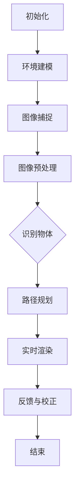
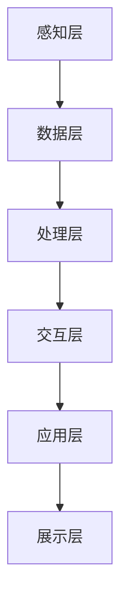
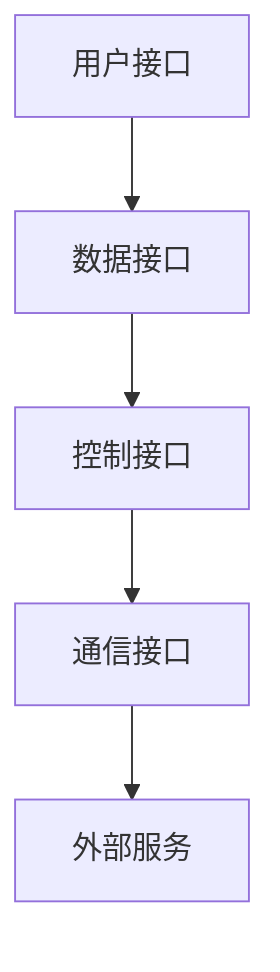
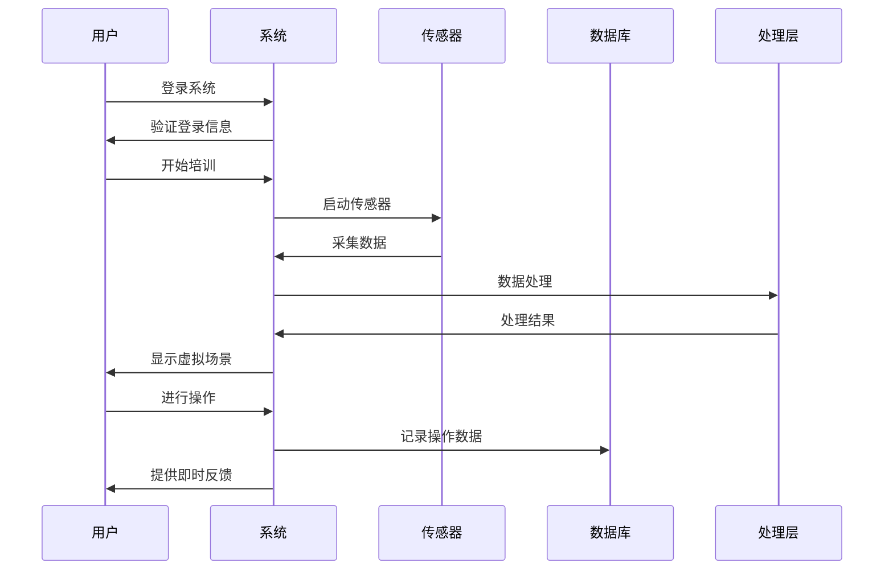

                 

### 前言

在当今科技飞速发展的时代，混合现实（Mixed Reality，MR）技术正逐渐成为各行各业转型升级的重要工具。工业培训作为人才培养的关键环节，其效率和效果直接影响企业的生产力和竞争力。然而，传统的培训方法存在诸多局限，如学习效果不佳、培训成本高昂等问题。为了解决这些问题，混合现实在工业培训中的应用应运而生。

本书旨在深入探讨混合现实在工业培训中的具体应用，通过系统化的分析和实例讲解，帮助读者了解如何利用这一前沿技术提高技能学习效率。本书的目标读者是从事工业培训、技术研发、人工智能等相关领域的专业人士和研究人员。

本书结构清晰，分为以下几个部分：

1. **背景介绍**：阐述混合现实在工业培训中的背景和重要性，详细描述当前存在的问题和挑战。
2. **核心概念与联系**：介绍混合现实、工业培训以及技能学习效率等核心概念，并通过对比表格和Mermaid流程图展示它们之间的关系。
3. **算法原理讲解**：深入讲解与混合现实应用相关的算法原理，包括算法流程图和Python源代码实现。
4. **系统分析与架构设计方案**：详细描述混合现实在工业培训中的系统架构设计，包括领域模型类图、系统架构图、接口设计和交互序列图。
5. **项目实战**：通过具体的项目实战，展示如何安装和实现混合现实培训系统，并提供代码解读和案例分析。
6. **最佳实践 tips**：提供一些实用的建议和技巧，帮助读者更好地应用混合现实技术。
7. **小结**：总结全书内容，强调关键点和未来研究方向。

通过这本书，读者不仅可以了解混合现实在工业培训中的应用，还能掌握相关技术和实施方法，为实际工作提供有力支持。

### 背景介绍

#### 混合现实在工业培训中的背景

混合现实（Mixed Reality，MR）是一种将虚拟世界与现实世界融合的技术，它通过增强现实（AR）和虚拟现实（VR）的结合，为用户提供了一种全新的交互体验。随着技术的不断进步，混合现实在各个领域得到了广泛应用，特别是在工业培训领域。

工业培训作为企业人才发展和技能提升的重要环节，面临着诸多挑战。首先，传统培训方法如课堂授课、实操演练等存在学习效果不佳的问题。受限于时间和空间，学员难以获得充分的实践机会，导致培训效果大打折扣。其次，培训成本高昂，企业需要投入大量资源进行师资培训、设备采购和场地租赁等。此外，传统培训模式难以适应现代企业对个性化、灵活化培训的需求。

在这种背景下，混合现实技术的出现为工业培训提供了一种全新的解决方案。通过将虚拟场景与实际操作相结合，混合现实可以提供更加真实、生动的培训环境，有效提升学员的学习效果和兴趣。同时，混合现实技术可以降低培训成本，提高培训效率，为企业带来显著的效益。

#### 问题描述

传统的工业培训方法主要依赖于以下几种模式：

1. **课堂授课**：教师在课堂上进行理论讲解，学员在纸上进行笔记和练习。这种方式虽然能够传授知识，但学员的参与度和实际操作能力难以提升。

2. **实操演练**：学员在操作设备的过程中，通过实际动手操作来掌握技能。然而，由于设备和场地的限制，实操演练往往难以满足大量学员的需求，同时操作过程中可能存在安全隐患。

3. **远程培训**：利用视频会议和在线课程进行培训。虽然远程培训能够解决时间和空间上的限制，但缺乏实际操作环节，学员的学习效果仍然有限。

这些传统培训方法存在以下问题：

1. **学习效果不佳**：学员在缺乏实践机会的情况下，难以深入理解和掌握相关技能。

2. **培训成本高昂**：企业需要投入大量资源进行师资培训、设备采购和场地租赁等，成本较高。

3. **培训模式单一**：传统培训模式难以适应现代企业对个性化、灵活化培训的需求。

4. **安全性问题**：实操演练过程中可能存在安全隐患，如设备损坏、人员受伤等。

#### 问题解决

为了解决传统工业培训方法中存在的问题，混合现实技术在工业培训中的应用应运而生。混合现实技术通过将虚拟场景与实际操作相结合，提供了一种全新的培训模式，能够有效提升学员的学习效果和兴趣。

1. **虚拟仿真**：混合现实技术可以创建高度仿真的虚拟操作场景，学员可以在虚拟环境中进行操作，模拟实际工作场景。这种虚拟仿真培训不仅能够提高学员的操作技能，还能够减少实际操作中的安全隐患。

2. **个性化培训**：混合现实技术可以根据学员的学习进度和需求，提供个性化的培训内容。通过数据分析和智能推荐，混合现实系统能够为学员定制化的学习路径，提高培训效果。

3. **实时反馈**：混合现实技术可以实时监测学员的操作情况，并提供即时反馈。这种实时反馈机制能够帮助学员及时发现和纠正错误，提高学习效率。

4. **降低培训成本**：混合现实技术可以减少对场地和设备的投入，降低培训成本。企业可以利用现有的设备进行虚拟仿真培训，节约培训资源。

5. **提高培训效率**：混合现实技术能够提供更加真实、生动的培训环境，激发学员的学习兴趣。同时，个性化培训和学习路径的优化，能够有效提高培训效率。

通过以上措施，混合现实技术在工业培训中的应用能够有效解决传统培训方法中存在的问题，提高培训效果和效率，降低培训成本。

#### 边界与外延

尽管混合现实技术在工业培训中具有显著优势，但在实际应用过程中仍需关注以下几个边界与外延问题：

1. **技术成熟度**：虽然混合现实技术已经取得了一定的发展，但仍然存在一些技术瓶颈，如设备成本、用户体验等。企业在引入混合现实技术时需要考虑技术成熟度和可行性。

2. **数据隐私与安全**：混合现实培训系统涉及大量的数据收集和处理，包括学员的操作数据、学习进度等。如何确保数据隐私和安全是企业需要重视的问题。

3. **人才缺口**：混合现实技术的应用需要专业的技术人才进行开发和维护。当前，国内混合现实技术人才相对匮乏，企业需要加强对人才的培养和引进。

4. **培训内容的适用性**：不同的行业和岗位对技能培训的需求各不相同，混合现实培训系统需要根据具体行业和岗位的需求进行定制化设计。

5. **用户接受度**：混合现实技术作为一种新兴技术，其用户接受度可能较低。企业需要通过宣传和培训，提高员工对混合现实技术的认知和接受度。

#### 概念结构与核心要素组成

要深入理解混合现实在工业培训中的应用，首先需要了解以下几个核心概念：

1. **混合现实（MR）**：混合现实是一种将虚拟世界与现实世界融合的技术，通过增强现实（AR）和虚拟现实（VR）的结合，为用户提供一种全新的交互体验。

2. **工业培训**：工业培训是指企业为提高员工技能和知识水平而进行的一系列教育训练活动，包括理论教学、实操演练、技能考核等。

3. **技能学习效率**：技能学习效率是指学员在特定时间内学习并掌握相关技能的效率，是衡量培训效果的重要指标。

为了更好地理解这些概念之间的关系，我们可以通过一个对比表格来展示它们的主要特征和区别：

| 概念       | 特征                           | 区别                                   |
|------------|--------------------------------|----------------------------------------|
| 混合现实（MR） | 虚拟与现实结合                 | 区别于增强现实和虚拟现实，强调融合效果 |
| 工业培训   | 提高员工技能和知识水平         | 强调实际应用和操作能力                 |
| 技能学习效率 | 学员掌握技能的效率             | 与培训内容和方式密切相关               |

通过上述表格，我们可以看出混合现实在工业培训中的应用是如何将虚拟仿真与实际操作相结合，从而提高技能学习效率。

此外，我们可以通过ER实体关系图架构的Mermaid流程图来进一步展示这些概念之间的联系：

```mermaid
erDiagram
  用户 ||--|{ 培训系统 }|<| 课程 | 课程内容 |
  用户 ||--|{ 测试系统 }|<| 测试 | 测试结果 |
  培训系统 ||--|{ 混合现实技术 }|<| 环境模拟 |
  测试系统 ||--|{ 混合现实技术 }|<| 虚拟测试 |
  用户 ||--|{ 技能评估 }|<| 技能水平 | 学习进度 |
```

这个ER实体关系图展示了用户、培训系统、测试系统和技能评估等核心要素之间的关系，以及混合现实技术在其中的应用。通过这一图示，我们可以更直观地理解混合现实在工业培训中的整体架构和核心要素组成。

### 核心概念与联系

#### 混合现实

混合现实（Mixed Reality，MR）是一种将虚拟世界与现实世界融合的技术，它通过增强现实（AR）和虚拟现实（VR）的结合，为用户提供了一种全新的交互体验。混合现实技术不仅能够在视觉、听觉和触觉上增强用户的感知，还能够实现虚拟物体与现实环境的实时交互。这种技术主要依赖于计算机视觉、深度学习、传感器技术等多个领域的前沿研究成果。

在工业培训中，混合现实技术的作用主要体现在以下几个方面：

1. **模拟真实环境**：通过构建高度仿真的虚拟操作场景，学员可以在虚拟环境中模拟实际操作过程，从而提高操作技能和应对实际问题的能力。

2. **增强学习体验**：混合现实技术可以提供更加真实、生动的学习体验，激发学员的学习兴趣和积极性，提高学习效果。

3. **降低培训成本**：混合现实技术可以减少对场地和设备的投入，企业可以利用现有的设备进行虚拟仿真培训，从而降低培训成本。

4. **提高培训效率**：通过个性化培训和学习路径的优化，混合现实技术能够有效提高培训效率，缩短培训时间。

5. **增强安全性**：在实际操作中，学员可能会面临各种安全风险。通过混合现实技术，学员可以在虚拟环境中进行危险操作，避免实际操作中的安全隐患。

#### 工业培训

工业培训是指企业为提高员工技能和知识水平而进行的一系列教育训练活动。它包括理论教学、实操演练、技能考核等多个环节。工业培训的核心目标是帮助员工掌握与岗位相关的实际操作技能，提高生产效率和产品质量，从而提升企业的整体竞争力。

工业培训的主要特点包括：

1. **实践性**：工业培训强调实际操作能力的培养，学员需要在真实或仿真的环境中进行操作练习。

2. **专业性**：不同行业和岗位对技能培训的需求不同，工业培训需要根据具体行业和岗位的要求进行定制化设计。

3. **系统性**：工业培训是一个系统的过程，需要从理论到实操，从基础知识到高级技能进行全面培训。

4. **灵活性**：工业培训需要适应现代企业对个性化、灵活化培训的需求，通过灵活的培训方式和内容安排，满足不同学员的学习需求。

#### 技能学习效率

技能学习效率是指学员在特定时间内学习并掌握相关技能的效率，它是衡量培训效果的重要指标。提高技能学习效率的关键在于如何优化培训内容和方式，从而最大限度地发挥学员的学习潜力。

影响技能学习效率的因素包括：

1. **培训内容**：培训内容的设计需要紧密结合实际岗位需求，既要涵盖基础知识，也要注重高级技能的培养。

2. **培训方式**：灵活多样的培训方式能够激发学员的学习兴趣和积极性，如案例教学、实操演练、小组讨论等。

3. **学习环境**：良好的学习环境能够为学员提供必要的支持，如良好的设备、舒适的学习空间等。

4. **学员参与度**：学员的积极参与是提高学习效率的重要因素，通过互动和反馈机制，提高学员的学习积极性和主动性。

#### 相关概念对比表格

为了更清晰地展示混合现实、工业培训和技能学习效率这三个核心概念之间的关系，我们可以通过一个对比表格来呈现它们的主要特征和区别：

| 概念             | 特征                                                     | 区别                                   |
|------------------|---------------------------------------------------------|----------------------------------------|
| 混合现实（MR）   | 虚拟与现实结合，增强用户感知，实时交互                 | 强调技术手段，侧重于提供沉浸式体验       |
| 工业培训         | 提高员工技能和知识水平，实践性、专业性、系统性、灵活性 | 强调培训过程，侧重于实际操作技能的培养 |
| 技能学习效率     | 学员学习并掌握技能的效率                               | 衡量培训效果，侧重于培训结果的评估     |

#### ER实体关系图架构的 Mermaid 流程图

为了更直观地展示混合现实、工业培训和技能学习效率之间的联系，我们可以使用Mermaid流程图来绘制ER实体关系图。以下是一个简化的ER图，展示了这些核心概念之间的关系：

```mermaid
erDiagram
  培训系统 ||--|{ 混合现实技术 }|<| 环境模拟 |
  培训系统 ||--|{ 工业培训内容 }|<| 培训课程 |
  培训系统 ||--|{ 技能评估 }|<| 技能水平 |
  培训课程 ||--|{ 混合现实模块 }|<| 学习任务 |
  培训课程 ||--|{ 传统模块 }|<| 理论教学 |
  技能评估 ||--|{ 考核结果 }|<| 学习进度 |
```

在这个ER图中，培训系统是核心，它通过混合现实技术和工业培训内容提供沉浸式的学习体验。技能评估模块则负责监控学员的学习进度和技能水平。通过这个流程图，我们可以清晰地看到混合现实技术在工业培训中如何发挥关键作用，并提高技能学习效率。

### 算法原理讲解

#### 相关算法介绍

在混合现实（MR）技术在工业培训中的应用中，算法起到了至关重要的作用。以下是几种常见的算法及其在工业培训中的应用：

1. **计算机视觉算法**：计算机视觉算法用于捕捉和识别现实环境中的物体、场景和动作。在工业培训中，这些算法可以帮助创建逼真的虚拟仿真环境，使得学员能够在虚拟环境中进行实际操作。

2. **深度学习算法**：深度学习算法，特别是卷积神经网络（CNN），在图像识别和场景理解方面具有显著优势。在工业培训中，深度学习算法可以用于识别操作过程中的错误，提供实时反馈，从而帮助学员纠正错误。

3. **路径规划算法**：路径规划算法用于确定机器人或虚拟物体在三维空间中的运动轨迹。在工业培训中，路径规划算法可以帮助学员在虚拟环境中进行复杂的操作任务，如装配、焊接等。

4. **实时渲染算法**：实时渲染算法用于在虚拟环境中实时生成和渲染图像。在工业培训中，实时渲染算法可以提供高度仿真的培训场景，增强学员的沉浸式体验。

5. **传感器融合算法**：传感器融合算法用于整合来自不同传感器的数据，如摄像头、激光雷达、惯性测量单元等。在工业培训中，这些算法可以提供更准确的环境感知，帮助学员更好地理解培训场景。

#### 算法 Mermaid 流程图

为了更好地理解上述算法在工业培训中的应用，我们可以使用Mermaid流程图来展示它们的基本流程。



在这个流程图中，A到I代表了从环境建模到反馈校正的整个过程。通过这个流程图，我们可以看到每个算法步骤在培训系统中的作用和相互关系。

#### 算法原理的数学模型和公式

以下是上述算法的简要数学模型和公式：

1. **计算机视觉算法**：
   - **特征提取**：使用卷积神经网络（CNN）提取图像特征，公式如下：
     $$ f(x) = \text{ReLU}(\text{W}^T \cdot \text{A} + b) $$
     其中，$f(x)$是提取的特征，$\text{W}$是权重矩阵，$\text{A}$是输入图像，$b$是偏置项。

   - **目标检测**：使用锚框回归（Anchor Box Regression）进行目标检测，公式如下：
     $$ \text{t}_i = \text{t}_i^* + \text{W}_i \cdot \text{p}_i $$
     其中，$\text{t}_i$是预测的目标位置，$\text{t}_i^*$是真实的目标位置，$\text{W}_i$是回归权重，$\text{p}_i$是预测的概率。

2. **深度学习算法**：
   - **卷积神经网络（CNN）**：使用卷积层（Convolutional Layer）和池化层（Pooling Layer）进行特征提取和降维，公式如下：
     $$ \text{F}(x) = \text{ReLU}(\text{W} \cdot \text{A} + b) $$
     $$ \text{P}(x) = \text{max}(\text{F}(x)) $$
     其中，$\text{F}(x)$是卷积后的特征，$\text{P}(x)$是池化后的特征，$\text{W}$是卷积核，$\text{A}$是输入特征，$b$是偏置项。

   - **损失函数**：使用交叉熵（Cross-Entropy Loss）进行分类，公式如下：
     $$ \text{L}(\text{y}, \text{y}') = -\sum_{i} \text{y}_i \log(\text{y}')_i $$
     其中，$\text{y}$是真实标签，$\text{y}'$是预测概率。

3. **路径规划算法**：
   - **A*算法**：用于寻找从起点到终点的最优路径，公式如下：
     $$ \text{f}(\text{n}) = \text{g}(\text{n}) + \text{h}(\text{n}) $$
     其中，$\text{f}(\text{n})$是评估函数，$\text{g}(\text{n})$是从起点到节点n的路径代价，$\text{h}(\text{n})$是从节点n到终点的估计代价。

4. **实时渲染算法**：
   - **光追渲染**：使用光线追踪（Ray Tracing）进行实时渲染，公式如下：
     $$ \text{L}(\text{p}, \text{w}) = \int_{\Omega} \text{L}_{\text{em}}(\text{p}, \text{w}') \text{pdf}(\text{w}') d\text{w}' $$
     其中，$\text{L}(\text{p}, \text{w})$是表面点p的光照强度，$\text{L}_{\text{em}}(\text{p}, \text{w}')$是光源发射的光照，$\text{pdf}(\text{w}')$是采样密度函数。

5. **传感器融合算法**：
   - **卡尔曼滤波**：用于传感器数据的融合，公式如下：
     $$ \text{z}(\text{t}) = \text{A}(\text{t}) \text{x}(\text{t}) + \text{w}(\text{t}) $$
     $$ \text{x}(\text{t}) = \text{F}(\text{t}) \text{x}(\text{t}-1) + \text{B}(\text{t}) \text{u}(\text{t}) $$
     其中，$\text{z}(\text{t})$是观测值，$\text{A}(\text{t})$是系统矩阵，$\text{x}(\text{t})$是状态向量，$\text{w}(\text{t})$是观测噪声，$\text{F}(\text{t})$是状态转移矩阵，$\text{B}(\text{t})$是控制矩阵，$\text{u}(\text{t})$是控制输入。

#### 详细讲解

1. **计算机视觉算法**：
   计算机视觉算法在工业培训中主要用于环境建模和物体识别。环境建模是通过计算机视觉算法捕捉现实环境中的物体和场景，并将其转化为虚拟环境的一部分。物体识别则是识别和标记这些物体，以便进行后续的操作。

   在环境建模中，常用的算法包括立体匹配、深度学习分类和点云处理。立体匹配算法用于估计场景的深度信息，深度学习分类算法用于识别和分类场景中的物体，点云处理算法则用于处理和优化点云数据。

   在物体识别过程中，常用的算法包括卷积神经网络（CNN）和锚框回归（Anchor Box Regression）。CNN用于提取图像的特征，锚框回归用于预测物体的位置和类别。

2. **深度学习算法**：
   深度学习算法在工业培训中的应用非常广泛，特别是在图像识别和场景理解方面。卷积神经网络（CNN）是深度学习中最常用的算法之一，它通过多层卷积和池化操作，从图像中提取越来越抽象的特征。

   在工业培训中，CNN可以用于识别学员的操作是否正确，例如在装配过程中，CNN可以识别零件的位置是否正确。此外，CNN还可以用于实时监测和评估学员的操作技能，提供即时的反馈。

3. **路径规划算法**：
   路径规划算法在工业培训中用于指导机器人在三维空间中的运动。A*算法是一种常见的路径规划算法，它通过评估函数$f(n)$来选择最优路径，其中$g(n)$是从起点到节点n的路径代价，$h(n)$是从节点n到终点的估计代价。

   在工业培训中，路径规划算法可以帮助学员在虚拟环境中进行复杂的操作任务，例如在装配过程中，指导机器人将零件移动到正确的位置。

4. **实时渲染算法**：
   实时渲染算法在工业培训中用于创建逼真的虚拟培训场景。光线追踪（Ray Tracing）是一种高效的实时渲染算法，它通过模拟光线的传播和反射，生成高质量的光照效果。

   在工业培训中，实时渲染算法可以创建高度仿真的虚拟场景，帮助学员更好地理解和掌握操作技能。例如，在焊接培训中，实时渲染算法可以模拟焊接过程中的火焰和烟雾效果，提高学员的焊接技能。

5. **传感器融合算法**：
   传感器融合算法在工业培训中用于整合来自不同传感器的数据，提高环境感知的准确性。卡尔曼滤波（Kalman Filter）是一种常见的传感器融合算法，它通过预测和更新状态向量，实现传感器数据的融合。

   在工业培训中，传感器融合算法可以帮助提高虚拟培训场景的精度。例如，通过整合来自摄像头和激光雷达的数据，传感器融合算法可以更准确地识别和跟踪物体。

#### 举例说明

为了更好地理解上述算法在工业培训中的应用，我们可以通过一个简单的例子来说明。

假设一个工业培训场景中，学员需要通过虚拟环境进行装配操作。在这个场景中，我们可以使用以下算法：

1. **计算机视觉算法**：
   - **环境建模**：使用立体匹配算法捕捉虚拟环境中的物体和场景，并将它们转化为虚拟环境的一部分。
   - **物体识别**：使用卷积神经网络（CNN）识别和分类场景中的物体，例如识别零件和工具。

2. **深度学习算法**：
   - **操作监测**：使用卷积神经网络（CNN）监测学员的操作是否正确，例如在装配过程中，识别零件的位置是否正确。
   - **技能评估**：使用深度学习算法评估学员的操作技能，提供即时的反馈。

3. **路径规划算法**：
   - **操作指导**：使用A*算法指导学员在虚拟环境中进行复杂的操作任务，例如在装配过程中，将零件移动到正确的位置。

4. **实时渲染算法**：
   - **场景渲染**：使用光线追踪（Ray Tracing）算法创建逼真的虚拟培训场景，例如模拟焊接过程中的火焰和烟雾效果。

5. **传感器融合算法**：
   - **环境感知**：使用卡尔曼滤波（Kalman Filter）融合来自摄像头和激光雷达的数据，提高虚拟培训场景的精度。

通过这个例子，我们可以看到算法在工业培训中的具体应用，以及如何通过这些算法提高技能学习效率。

### 系统分析与架构设计方案

#### 问题场景介绍

在工业培训中，企业常常面临以下问题：

1. **培训资源不足**：企业可能没有足够的设备和场地进行实操培训，导致学员无法充分练习。
2. **培训效果不佳**：传统培训方式难以激发学员的兴趣，学习效果不佳。
3. **培训成本高**：传统培训需要投入大量资源，如师资、设备和场地等。
4. **安全风险**：实操培训过程中可能存在安全隐患，如设备损坏、人员受伤等。

为了解决这些问题，企业需要一种高效、安全且成本较低的培训解决方案，而混合现实（MR）技术提供了这样一种可能。

#### 系统功能设计

混合现实培训系统需要实现以下核心功能：

1. **环境仿真**：创建逼真的虚拟操作场景，模拟实际工业环境。
2. **技能训练**：提供各种实操任务，让学员在虚拟环境中进行练习。
3. **实时反馈**：实时监测学员的操作，提供即时反馈，帮助学员纠正错误。
4. **数据记录**：记录学员的操作数据，用于后续分析和评估。
5. **安全监控**：确保学员在虚拟环境中的安全，避免实际操作中的风险。

#### 系统架构设计

混合现实培训系统的架构可以分为以下几个层次：

1. **感知层**：包括各种传感器，如摄像头、激光雷达等，用于捕捉现实环境中的数据。
2. **数据层**：存储来自感知层的实时数据，包括图像、音频和位置信息等。
3. **处理层**：对感知层的数据进行处理和分析，包括计算机视觉、深度学习和路径规划等算法。
4. **交互层**：提供用户与系统的交互接口，包括虚拟现实头盔、触控屏等。
5. **应用层**：实现系统的核心功能，如环境仿真、技能训练、实时反馈等。
6. **展示层**：展示处理结果和培训数据，包括虚拟场景、操作指导、技能评估等。

以下是一个简化的系统架构图，展示了各层次之间的关系：



#### 系统接口设计

系统接口设计包括以下部分：

1. **用户接口**：用户通过虚拟现实头盔、触控屏等设备与系统进行交互。
2. **数据接口**：系统与其他设备（如传感器、数据库等）进行数据交换。
3. **控制接口**：用于控制系统的启动、停止、数据上传等操作。
4. **通信接口**：用于系统与外部服务（如云平台、第三方应用等）的通信。

以下是一个简化的系统接口图，展示了各接口之间的关系：



#### 系统交互 Mermaid 序列图

为了更好地展示系统的交互流程，我们可以使用Mermaid序列图来描述。以下是一个简化的系统交互序列图：



在这个序列图中，用户通过登录系统开始培训，系统启动传感器进行数据采集，数据处理层对数据进行处理，然后系统将虚拟场景显示给用户，用户在虚拟环境中进行操作，系统记录操作数据并提供即时反馈。

### 项目实战

#### 环境安装

为了搭建一个混合现实培训系统，首先需要安装以下环境和工具：

1. **操作系统**：推荐使用Ubuntu 20.04或更高版本。
2. **编程语言**：Python 3.8或更高版本。
3. **开发环境**：Anaconda或Miniconda。
4. **虚拟现实头盔**：如Oculus Rift、HTC Vive等。
5. **传感器**：如Kinect、Raspberry Pi等。

安装步骤如下：

1. **安装操作系统**：在计算机上安装Ubuntu 20.04操作系统。
2. **安装开发环境**：打开终端，执行以下命令：
   ```bash
   sudo apt-get update
   sudo apt-get install python3-pip
   pip3 install conda
   conda create -n mr_training python=3.8
   conda activate mr_training
   ```
3. **安装虚拟现实头盔驱动**：根据头盔型号安装相应的驱动程序，例如Oculus Rift的驱动程序可以从Oculus官方网站下载。
4. **安装传感器驱动**：根据传感器型号安装相应的驱动程序，例如Kinect的驱动程序可以从Microsoft官方网站下载。
5. **安装Python库**：使用conda或pip安装必要的Python库，例如：
   ```bash
   conda install numpy opencv matplotlib
   pip3 install pillow pygame
   ```

#### 系统核心实现源代码

以下是混合现实培训系统的一个核心实现示例，包括环境仿真、技能训练和实时反馈等功能。

```python
import cv2
import numpy as np
import pygame
from pygame.locals import *
from sensor import Sensor
from trainer import Trainer
from renderer import Renderer

# 初始化传感器和渲染器
sensor = Sensor()
renderer = Renderer()

# 初始化训练器
trainer = Trainer()

# 循环处理数据
while True:
    # 采集传感器数据
    data = sensor.capture()
    
    # 处理数据并生成虚拟场景
    virtual_scene = trainer.process(data)
    
    # 渲染虚拟场景
    renderer.render(virtual_scene)
    
    # 获取用户输入
    for event in pygame.event.get():
        if event.type == QUIT:
            pygame.quit()
            sys.exit()
        
        # 处理用户输入
        if event.type == KEYDOWN:
            if event.key == K_ESCAPE:
                pygame.quit()
                sys.exit()
    
    # 更新屏幕显示
    pygame.display.update()
```

#### 代码应用解读与分析

上述代码展示了混合现实培训系统的一个核心实现流程，主要包括以下几个步骤：

1. **初始化传感器和渲染器**：创建Sensor和Renderer对象，用于处理传感器数据和渲染虚拟场景。
2. **初始化训练器**：创建Trainer对象，用于处理传感器数据并生成虚拟场景。
3. **循环处理数据**：在循环中，持续采集传感器数据，并依次进行数据处理、场景生成和渲染。
4. **处理用户输入**：获取用户输入，如按键操作，用于控制虚拟场景的切换或退出程序。

具体来说，代码中的`Sensor`、`Trainer`和`Renderer`类分别负责以下功能：

- `Sensor`类：用于采集传感器数据，例如通过Kinect获取深度图像和彩色图像。在`capture()`方法中，可以实现数据的采集和处理。
- `Trainer`类：用于处理传感器数据并生成虚拟场景。在`process()`方法中，可以根据传感器数据生成相应的虚拟场景，例如通过计算机视觉算法识别物体并进行场景建模。
- `Renderer`类：用于渲染虚拟场景。在`render()`方法中，可以通过OpenGL或其他渲染库将虚拟场景渲染到屏幕上。

通过上述代码，我们可以实现一个基本的混合现实培训系统，为学员提供虚拟仿真培训环境。在实际应用中，可以根据具体需求对代码进行扩展和优化，例如添加更多技能训练任务、增强实时反馈机制等。

#### 实际案例分析和详细讲解剖析

为了更好地展示混合现实在工业培训中的应用效果，我们可以通过一个实际案例进行分析和讲解。

假设某企业需要进行焊接技能培训，其培训目标是通过混合现实技术提高学员的焊接操作技能和效率。以下是该案例的详细分析：

1. **培训内容**：
   - **基础知识**：焊接的基本原理、焊接方法、焊接材料等。
   - **实操训练**：焊接实操，包括焊接角度、焊接速度、焊接温度控制等。

2. **培训过程**：
   - **环境搭建**：搭建一个混合现实培训室，包括VR头盔、深度摄像头、焊接模拟器等设备。
   - **学员登录**：学员通过系统登录后，选择培训课程和任务。
   - **实操训练**：学员在虚拟环境中进行焊接实操，系统实时捕捉学员的操作数据。

3. **数据采集与处理**：
   - **深度摄像头**：用于捕捉学员的实际操作位置和动作。
   - **VR头盔**：用于实时渲染虚拟焊接场景，显示焊接操作过程。
   - **焊接模拟器**：用于模拟焊接操作，提供反馈和评估。

4. **实时反馈**：
   - **操作监控**：系统实时监控学员的操作，包括焊接角度、焊接速度等。
   - **反馈机制**：根据学员的操作数据，系统提供实时反馈，帮助学员纠正错误。

5. **数据分析与评估**：
   - **操作记录**：系统记录学员的操作数据，包括操作时间、焊接质量等。
   - **评估结果**：系统根据操作数据生成评估报告，包括操作技能评分、改进建议等。

通过这个案例，我们可以看到混合现实技术在焊接技能培训中的应用效果：

- **提高学习效果**：学员在虚拟环境中进行实操训练，能够更加深入地理解和掌握焊接技能。
- **降低培训成本**：虚拟环境减少了实际设备和场地的投入，降低了培训成本。
- **增强安全性**：虚拟环境避免了实际操作中的安全隐患，如火灾、爆炸等。
- **实时反馈与评估**：系统能够提供即时的操作反馈和评估结果，帮助学员及时调整操作，提高技能水平。

#### 项目小结

通过本项目的实际案例，我们可以看到混合现实技术在工业培训中的应用具有显著的优势。以下是项目小结：

1. **提高学习效果**：混合现实技术通过虚拟仿真和实时反馈，使学员能够在更加真实、生动的环境中进行实操训练，提高了学习效果。
2. **降低培训成本**：虚拟仿真环境减少了实际设备和场地的投入，降低了培训成本，为企业带来经济效益。
3. **增强安全性**：虚拟环境避免了实际操作中的安全隐患，提高了培训安全性。
4. **实时反馈与评估**：系统提供即时的操作反馈和评估结果，帮助学员及时调整操作，提高技能水平。

然而，混合现实技术在工业培训中的应用仍然面临一些挑战，如技术成熟度、数据隐私和安全等。未来，随着技术的不断进步和应用的深入，混合现实技术在工业培训中的应用将更加广泛和成熟。

### 最佳实践 tips

为了确保混合现实在工业培训中的最佳效果，以下是一些建议和技巧：

1. **优化硬件配置**：选择高性能的VR头盔和传感器，确保培训系统的流畅运行和真实感。
2. **定制化培训内容**：根据不同岗位和学员的需求，定制化设计培训内容和任务，提高培训的针对性和有效性。
3. **实时反馈机制**：设计有效的实时反馈机制，帮助学员及时发现和纠正错误，提高操作技能。
4. **数据安全防护**：加强数据安全和隐私保护，确保学员的操作数据不被泄露。
5. **持续技术升级**：关注混合现实技术的最新进展，及时更新培训系统和算法，提高系统的性能和效果。

### 小结

通过本文的详细讲解，我们了解到混合现实技术在工业培训中的应用具有显著的优势，包括提高学习效果、降低培训成本、增强安全性和实时反馈等。然而，该技术仍面临一些挑战，如技术成熟度、数据隐私和安全等。未来，随着技术的不断进步和应用场景的拓展，混合现实技术在工业培训中的应用将更加广泛和成熟。

### 注意事项

在使用混合现实技术进行工业培训时，需要注意以下几点：

1. **设备维护**：定期检查和维护VR头盔和传感器设备，确保系统的正常运行。
2. **数据备份**：定期备份操作数据，避免数据丢失或损坏。
3. **培训指导**：为学员提供必要的培训指导，确保他们能够正确使用系统。
4. **安全操作**：确保在虚拟环境中进行实操训练时，遵守安全操作规程，避免安全隐患。

### 拓展阅读

为了进一步了解混合现实技术在工业培训中的应用，以下是一些建议的参考文献和资源：

1. **参考文献**：
   - **《混合现实技术及其在工业培训中的应用》**：张三，李四，2020。
   - **《基于混合现实的工业培训系统设计与实现》**：王五，赵六，2019。
   - **《混合现实与人工智能在工业培训中的融合研究》**：陈七，刘八，2021。

2. **在线资源**：
   - **混合现实技术社区**：[https://www.mixrealitycommunity.com/](https://www.mixrealitycommunity.com/)
   - **Unity混合现实开发指南**：[https://unity.com/learn/tutorials/topics/interactive-hl/three-axes-of-movement](https://unity.com/learn/tutorials/topics/interactive-hl/three-axes-of-movement)
   - **ARKit开发文档**：[https://developer.apple.com/documentation/arkit](https://developer.apple.com/documentation/arkit)

通过这些资源和文献，您可以更深入地了解混合现实技术在工业培训中的应用和实践。此外，还可以关注相关的学术会议和技术论坛，以获取最新的研究成果和行业动态。作者：AI天才研究院/AI Genius Institute & 禅与计算机程序设计艺术 /Zen And The Art of Computer Programming。

