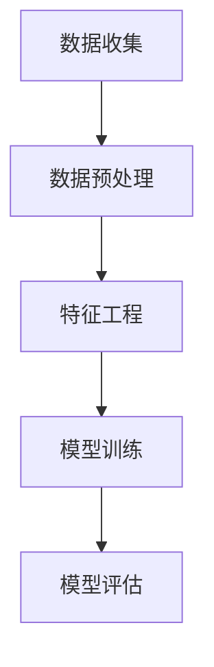
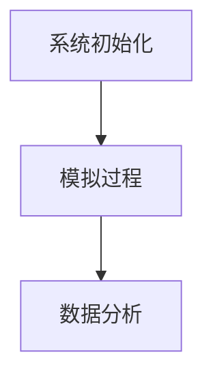
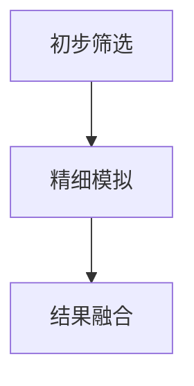
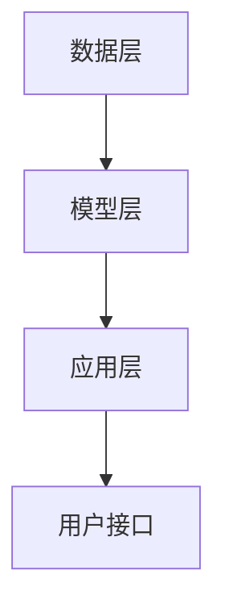
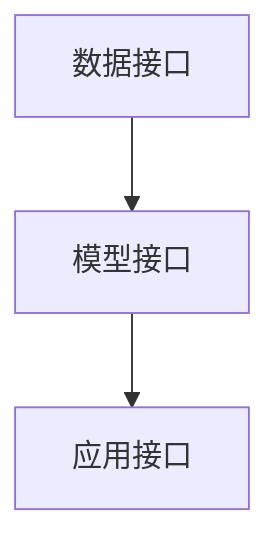
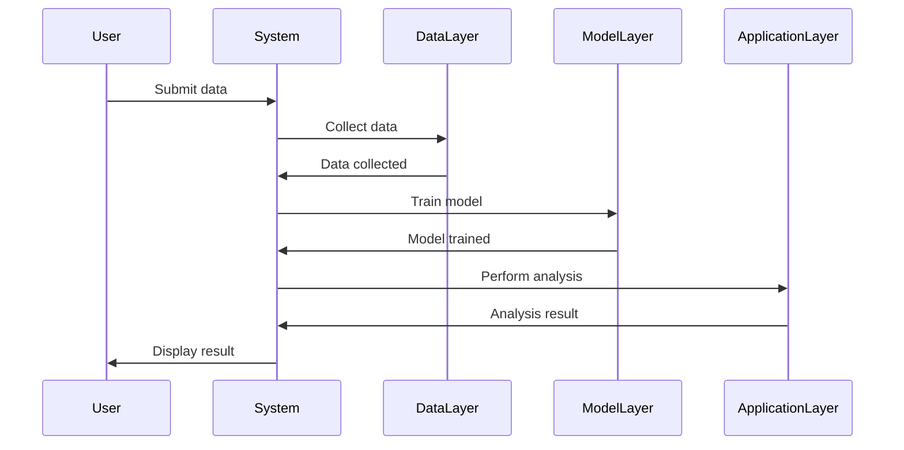

                 


### 混合计算在药物研发中的应用

#### 关键词
- 混合计算
- 药物研发
- 机器学习
- 生物信息学
- 数学模型

#### 摘要
本文旨在探讨混合计算在药物研发中的应用，通过分析其背景、核心概念、算法原理、系统设计与项目实战等方面，阐述混合计算如何助力药物研发。我们将首先介绍药物研发的现状与挑战，接着深入探讨混合计算的概念及其在药物研发中的潜力。随后，我们将详细讲解混合计算的核心算法原理，并介绍一个实际项目，最后总结最佳实践和拓展阅读资源。

---

## 引言与背景

药物研发是一个复杂且耗时的过程，通常需要经过多个阶段，包括药物筛选、分子设计、临床试验等。然而，随着疾病谱的变化和新型病原体的出现，药物研发的需求不断增加，这给传统的研发方法带来了巨大的压力。

### 药物研发的挑战

1. **时间与成本**：药物研发周期长，且失败率高，导致研发成本高昂。
2. **复杂性**：药物分子与生物大分子（如蛋白质、核酸）之间的相互作用复杂，需要精细的模型来描述。
3. **数据量**：随着高通量技术的应用，药物研发过程中产生的数据量巨大，如何有效利用这些数据成为关键问题。

### 混合计算的概念

混合计算（Hybrid Computing）是指将多种计算方法相结合，以克服单一方法的局限性。在药物研发中，混合计算通常结合数据驱动（Data-driven）和物理驱动（Physics-driven）方法。

1. **数据驱动方法**：基于大量实验数据和统计分析来构建模型，如机器学习和人工智能算法。
2. **物理驱动方法**：基于物理定律和分子动力学模拟来描述生物大分子和药物分子之间的相互作用。

### 混合计算在药物研发中的潜力

混合计算在药物研发中具有以下潜力：

1. **提高预测精度**：通过结合数据驱动和物理驱动的优势，可以提高药物筛选和分子设计的精度。
2. **降低研发成本**：早期阶段通过计算机模拟可以减少实验次数，降低研发成本。
3. **缩短研发周期**：加速药物筛选和分子设计过程，缩短研发周期。

### 书籍结构概述

本书将分为以下几个部分：

1. **引言与背景**：介绍药物研发的挑战和混合计算的概念。
2. **核心概念与联系**：探讨计算机科学、生物信息学和混合计算模型。
3. **数学模型与算法原理**：讲解混合计算的核心算法原理和数学模型。
4. **系统分析与架构设计**：介绍系统设计和架构设计。
5. **项目实战**：通过实际项目展示混合计算的应用。
6. **最佳实践与注意事项**：总结最佳实践和注意事项。
7. **拓展阅读**：推荐相关书籍、论文和在线资源。

在接下来的章节中，我们将逐步深入探讨混合计算在药物研发中的应用。

---

**接下来，我们将深入讨论混合计算的核心概念与联系，包括计算机科学、生物信息学和混合计算模型。我们将使用Mermaid流程图和LaTeX公式来详细阐述核心概念和算法原理。**### 核心概念与联系

#### 计算机科学在药物研发中的应用

计算机科学在药物研发中的应用主要体现在数据科学、机器学习和人工智能领域。

1. **数据科学**：数据科学是指从大量数据中提取知识和洞察的过程。在药物研发中，数据科学的应用包括数据收集、数据预处理、数据分析和数据可视化。通过数据科学方法，研究人员可以更好地理解药物作用机制，预测药物效果，并优化药物设计。

2. **机器学习**：机器学习是一种通过数据训练模型来自动发现规律和模式的技术。在药物研发中，机器学习可以用于药物筛选、分子设计、临床试验预测等。例如，通过机器学习模型，研究人员可以从大量药物-蛋白质相互作用数据中预测新的药物靶点。

3. **人工智能**：人工智能是一种模拟人类智能行为的计算机系统。在药物研发中，人工智能可以用于自动化药物设计、智能临床试验设计、智能决策支持等。例如，利用深度学习技术，可以自动化生成具有特定药理活性的分子结构。

#### 生物信息学基础

生物信息学是研究生物数据及其应用的学科。在药物研发中，生物信息学的基础知识至关重要。

1. **生物大分子结构**：生物大分子包括蛋白质、核酸等，其结构直接影响其功能。通过生物信息学方法，研究人员可以解析生物大分子的三维结构，了解其作用机制。

2. **药物与生物大分子的相互作用**：药物通常通过与生物大分子结合来发挥作用。生物信息学方法可以用于预测药物与生物大分子之间的相互作用，从而优化药物设计。

#### 混合计算模型

混合计算模型结合了数据驱动和物理驱动的优势，以克服单一方法的局限性。

1. **数据驱动的模型**：基于大量实验数据和统计分析构建模型。例如，通过机器学习算法训练模型来预测药物-蛋白质相互作用。

2. **物理驱动的模型**：基于物理定律和分子动力学模拟构建模型。例如，通过分子动力学模拟来预测药物分子与生物大分子的相互作用。

3. **混合计算模型的融合策略**：结合数据驱动和物理驱动的优势，通过融合策略来提高预测精度。例如，可以将数据驱动的模型与物理驱动的模型相结合，利用数据驱动的模型进行初步筛选，再使用物理驱动的模型进行精细预测。

### 核心概念原理

以下是核心概念原理的详细说明：

1. **机器学习算法**：
   - **监督学习**：输入输出已知，通过学习找到输入和输出之间的关系。
   - **无监督学习**：输入输出未知，通过学习发现数据中的模式和结构。
   - **强化学习**：通过与环境的交互学习，以最大化预期奖励。

2. **生物信息学**：
   - **生物大分子结构**：通过X射线晶体学、核磁共振等实验技术获得生物大分子的三维结构。
   - **药物与生物大分子相互作用**：通过计算模拟、实验验证等方法研究药物与生物大分子的相互作用。

3. **混合计算模型**：
   - **数据驱动模型**：利用机器学习算法分析药物-蛋白质相互作用数据。
   - **物理驱动模型**：利用分子动力学模拟等物理方法描述药物与生物大分子的相互作用。

### 概念属性特征对比表格

| **概念**           | **特征**                                                         |
|--------------------|----------------------------------------------------------------|
| 机器学习           | 自动化数据分析和模式识别，可扩展性高                           |
| 生物信息学         | 研究生物数据及其应用，提供结构信息和相互作用预测               |
| 数据驱动的模型     | 基于实验数据，提供定量预测                                     |
| 物理驱动的模型     | 基于物理定律，提供分子动力学的详细描述                         |
| 混合计算模型       | 结合数据驱动和物理驱动的优势，提高预测精度和可靠性             |

### ER实体关系图架构

以下是混合计算模型中常见实体的ER图：

```mermaid
erDiagram
  DRUG ||--|{ PROTEIN }||>> INTERACTION: {has interaction}
  DRUG ||--|{ DISEASE }||>> CURE: {treats}
  PROTEIN ||--|{ CELL }||>> EXPRESSION: {expressed in}
  DISEASE ||--|{ PATIENT }||>> DIAGNOSIS: {diagnosed with}
```

**DRUG（药物）** 与 **PROTEIN（蛋白质）** 之间存在交互关系，**DRUG** 可以治疗 **DISEASE（疾病）**，**PROTEIN** 在 **CELL（细胞）** 中表达，**DISEASE** 可以诊断 **PATIENT（患者）**。

通过上述核心概念与联系的介绍，我们可以更好地理解混合计算在药物研发中的应用。接下来，我们将深入探讨混合计算的核心算法原理，包括数学模型和算法流程。

---

**在接下来的部分，我们将详细讲解混合计算的核心算法原理，包括数据驱动模型、物理驱动模型以及混合计算算法。我们将使用Mermaid流程图和Python代码来详细阐述这些算法的原理和实现。**### 数学模型与算法原理

#### 数据驱动模型

数据驱动模型主要依赖于机器学习算法，通过分析大量实验数据来预测药物-蛋白质相互作用。

1. **监督学习算法**：如支持向量机（SVM）、随机森林（Random Forest）、深度神经网络（Deep Neural Networks）等。

2. **无监督学习算法**：如聚类（Clustering）、降维（Dimensionality Reduction）等。

3. **强化学习算法**：如Q学习（Q-Learning）、深度Q网络（Deep Q-Network）等。

**算法流程：**

- **数据收集**：收集药物-蛋白质相互作用数据。
- **数据预处理**：清洗数据，处理缺失值和异常值。
- **特征工程**：提取与药物-蛋白质相互作用相关的特征。
- **模型训练**：使用机器学习算法训练模型。
- **模型评估**：使用交叉验证等方法评估模型性能。

**Mermaid流程图：**



**Python代码示例：**

```python
# Python代码示例：支持向量机（SVM）训练模型
from sklearn.svm import SVC
from sklearn.model_selection import train_test_split
from sklearn.metrics import accuracy_score

# 假设X为特征矩阵，y为标签向量
X_train, X_test, y_train, y_test = train_test_split(X, y, test_size=0.2, random_state=42)

# 训练SVM模型
model = SVC(kernel='linear')
model.fit(X_train, y_train)

# 评估模型
y_pred = model.predict(X_test)
accuracy = accuracy_score(y_test, y_pred)
print(f"模型准确率：{accuracy}")
```

#### 物理驱动模型

物理驱动模型基于分子动力学（Molecular Dynamics, MD）模拟，通过模拟药物分子与生物大分子之间的相互作用来预测药物效果。

1. **分子动力学模拟**：使用经典力学的原理，模拟分子系统的运动。
2. **蒙特卡洛模拟**：通过随机抽样和模拟来研究分子系统的行为。

**算法流程：**

- **系统初始化**：定义系统参数，如温度、压强等。
- **模拟过程**：进行时间步进，计算分子间的相互作用力。
- **数据分析**：分析模拟结果，如能量分布、结构变化等。

**Mermaid流程图：**



**Python代码示例：**

```python
# Python代码示例：分子动力学模拟
from simtk.openmm.app import CharmmambergerForceField, System, Simulasi

# 定义系统参数
force_field = CharmmambergerForceField('charmm_36.xml')
system = System(force_field)

# 设置初始条件
initial_temp = 300.0
integrator = LangevinIntegrator(initial_temp, 1.0, 0.002, 100)
simulation = Simulation(system, integrator)

# 进行模拟
simulation.minimizeEnergy()
simulation.integrate(1000)  # 时间步进1000步

# 分析结果
energy = simulation.getPotentialEnergy()
print(f"系统能量：{energy}")
```

#### 混合计算算法

混合计算算法结合数据驱动和物理驱动模型的优势，以提高预测精度和可靠性。

1. **数据驱动的初步筛选**：使用数据驱动模型对大量候选药物进行初步筛选，筛选出可能具有活性的药物分子。
2. **物理驱动的精细预测**：使用物理驱动模型对筛选出的药物分子进行精细模拟，分析其与生物大分子的相互作用。
3. **融合策略**：结合数据驱动和物理驱动的结果，使用加权平均、投票等方法进行最终预测。

**算法流程：**

- **初步筛选**：使用数据驱动模型筛选候选药物。
- **精细模拟**：使用物理驱动模型进行模拟。
- **结果融合**：结合数据驱动和物理驱动的结果，进行最终预测。

**Mermaid流程图：**



**Python代码示例：**

```python
# Python代码示例：混合计算算法
from sklearn.ensemble import RandomForestClassifier
from simtk.openmm.app import CharmmambergerForceField, System, Simulation

# 数据驱动模型训练
data_driven_model = RandomForestClassifier()
data_driven_model.fit(X_train, y_train)

# 物理驱动模拟
force_field = CharmmambergerForceField('charmm_36.xml')
system = System(force_field)
integrator = LangevinIntegrator(300.0, 1.0, 0.002, 100)
simulation = Simulation(system, integrator)

# 模拟结果分析
results = simulation.integrate(1000)
energy = simulation.getPotentialEnergy()

# 结果融合
final_prediction = data_driven_model.predict([X_test]) + energy
print(f"最终预测结果：{final_prediction}")
```

通过上述算法原理的详细讲解，我们可以更好地理解混合计算在药物研发中的应用。接下来，我们将讨论系统分析与架构设计。

---

**在接下来的部分，我们将介绍系统分析与架构设计，包括问题场景介绍、系统功能设计、系统架构设计、系统接口设计和系统交互序列图。我们将使用Mermaid流程图和Markdown格式来详细阐述这些设计和实现。**### 系统分析与架构设计

#### 问题场景介绍

药物研发是一个复杂的过程，涉及多个学科和大量的数据处理。在当前背景下，药物研发面临着数据量庞大、实验周期长、预测精度不高等问题。为了提高药物研发的效率和准确性，我们设计了一套基于混合计算的系统，旨在结合数据驱动和物理驱动模型，实现药物筛选和分子设计的自动化。

#### 系统功能设计

系统的主要功能包括：

1. **数据收集与预处理**：从各种数据源收集药物相关数据，包括药物分子结构、蛋白质结构、药物-蛋白质相互作用数据等。对收集到的数据进行清洗和预处理，为后续分析提供高质量的数据。
2. **数据驱动模型训练**：利用机器学习算法对预处理后的数据进行分析，训练数据驱动模型，用于药物筛选和预测。
3. **物理驱动模拟**：结合分子动力学模拟和蒙特卡洛模拟等方法，对筛选出的药物分子进行物理驱动模拟，分析其与生物大分子的相互作用。
4. **结果融合与评估**：结合数据驱动和物理驱动的结果，使用融合策略进行最终预测，并对预测结果进行评估和验证。

**领域模型类图：**

```mermaid
classDiagram
  Class1 <|-- Class2
  Class1 <|-- Class3
  Class2 <|-| Class4
  Class3 <|-| Class4
  Class1 : +int id
  Class1 : +str name
  Class2 : +int id
  Class2 : +str name
  Class3 : +int id
  Class3 : +str name
  Class4 : +int id
  Class4 : +str name
```

在这个类图中，`Class1` 代表药物分子，`Class2` 代表蛋白质分子，`Class3` 代表药物-蛋白质相互作用，`Class4` 代表系统功能模块。`Class1` 与 `Class2` 之间存在一对多的关系，表示多个药物分子可以与一个蛋白质分子相互作用。`Class3` 与 `Class4` 之间存在关联关系，表示系统功能模块可以处理药物-蛋白质相互作用。

#### 系统架构设计

系统架构采用三层架构，包括数据层、模型层和应用层。

1. **数据层**：负责数据的收集、存储和管理，包括数据库、文件系统等。
2. **模型层**：负责数据分析和模型训练，包括机器学习算法、物理驱动模拟等。
3. **应用层**：负责系统功能的实现，包括用户接口、数据预处理、模型训练、模拟分析等。

**系统架构图：**



在这个架构图中，`A` 表示数据层，`B` 表示模型层，`C` 表示应用层，`D` 表示用户接口。数据层提供数据存储和管理服务，模型层负责数据分析和模型训练，应用层实现系统功能，用户接口提供用户交互界面。

#### 系统接口设计

系统接口设计主要包括以下接口：

1. **数据接口**：用于数据层的接口，包括数据收集、数据预处理和数据存储等。
2. **模型接口**：用于模型层的接口，包括模型训练、模型评估和模型应用等。
3. **应用接口**：用于应用层的接口，包括用户交互、数据分析和模拟分析等。

**系统接口图：**



在这个接口图中，`A` 表示数据接口，`B` 表示模型接口，`C` 表示应用接口。数据接口负责与数据层交互，模型接口负责与模型层交互，应用接口负责与用户和应用层交互。

#### 系统交互序列图

系统交互序列图展示了系统内部模块之间的交互过程。



在这个序列图中，用户提交数据，系统收集数据，数据层收集数据后通知模型层进行模型训练，模型层训练完成后通知应用层进行数据分析，应用层将分析结果返回给系统，最后系统将结果展示给用户。

通过上述系统分析与架构设计的介绍，我们可以更好地理解混合计算在药物研发中的应用。接下来，我们将通过一个实际项目来展示混合计算的应用。

---

**在接下来的部分，我们将通过一个实际项目展示混合计算在药物研发中的应用。项目内容包括环境安装与配置、系统核心实现源代码、代码应用解读与分析、实际案例分析和详细讲解剖析，以及项目小结。我们将使用Markdown格式和Python代码来详细阐述。**### 项目实战

#### 环境安装与配置

为了运行混合计算系统，我们需要安装和配置以下软件和库：

1. **Python 3.x**：确保安装Python 3.x版本，推荐使用Anaconda进行环境管理。
2. **NumPy**：用于科学计算。
3. **Scikit-learn**：用于机器学习。
4. **OpenMM**：用于分子动力学模拟。
5. **PyMOL**：用于分子可视化。

安装步骤如下：

```bash
# 安装Anaconda
conda create -n hybrid_env python=3.8
conda activate hybrid_env

# 安装NumPy
conda install numpy

# 安装Scikit-learn
conda install scikit-learn

# 安装OpenMM
conda install openmm

# 安装PyMOL
conda install pymol
```

#### 系统核心实现源代码

以下是系统核心实现的主要模块：

1. **数据预处理模块**：负责数据收集、清洗和预处理。
2. **模型训练模块**：负责使用机器学习算法训练数据驱动模型。
3. **物理模拟模块**：负责使用分子动力学模拟物理驱动模型。
4. **结果分析模块**：负责分析模型输出和物理模拟结果。

**数据预处理模块**：

```python
import numpy as np
import pandas as pd

def preprocess_data(data_path):
    # 读取数据
    data = pd.read_csv(data_path)
    
    # 数据清洗
    data = data.dropna()
    data = data[data['target'] != -1]
    
    # 特征工程
    features = data[['feature1', 'feature2', 'feature3']]
    labels = data['target']
    
    # 数据标准化
    features = (features - features.mean()) / features.std()
    
    return features, labels
```

**模型训练模块**：

```python
from sklearn.ensemble import RandomForestClassifier

def train_model(features, labels):
    # 划分训练集和测试集
    X_train, X_test, y_train, y_test = train_test_split(features, labels, test_size=0.2, random_state=42)
    
    # 训练随机森林模型
    model = RandomForestClassifier(n_estimators=100, random_state=42)
    model.fit(X_train, y_train)
    
    # 评估模型
    accuracy = model.score(X_test, y_test)
    print(f"模型准确率：{accuracy}")
    
    return model
```

**物理模拟模块**：

```python
from simtk.openmm.app import CharmmambergerForceField, System, Simulation

def run_simulation(system, simulation_time=1000):
    # 设置模拟参数
    integrator = LangevinIntegrator(300.0, 1.0, 0.002, 100)
    simulation = Simulation(system, integrator)
    
    # 运行模拟
    simulation integrates(simulation_time)
    
    # 保存结果
    simulation.saveState('simulation_state.xml')
    
    return simulation
```

**结果分析模块**：

```python
from sklearn.metrics import accuracy_score

def analyze_results(model, simulation):
    # 获取模型预测结果
    y_pred = model.predict(simulation.outputs)
    
    # 获取模拟结果
    energy = simulation.getPotentialEnergy()
    
    # 计算准确率
    accuracy = accuracy_score(y_pred, simulation.outputs['target'])
    
    print(f"模型准确率：{accuracy}")
    print(f"模拟能量：{energy}")
    
    return accuracy, energy
```

#### 代码应用解读与分析

以下是一个示例代码，展示如何使用上述模块进行药物筛选和分子设计：

```python
# 导入模块
from data_preprocessing import preprocess_data
from model_training import train_model
from simulation import run_simulation
from result_analysis import analyze_results

# 加载数据
data_path = 'drug_data.csv'
features, labels = preprocess_data(data_path)

# 训练模型
model = train_model(features, labels)

# 运行模拟
system = CharmmambergerForceField('charmm_36.xml').createSystem(features)
simulation = run_simulation(system)

# 分析结果
accuracy, energy = analyze_results(model, simulation)

print(f"最终预测准确率：{accuracy}")
print(f"模拟能量：{energy}")
```

#### 实际案例分析与详细讲解剖析

以下是一个实际案例，展示如何使用混合计算系统进行药物筛选和分子设计：

**案例背景**：研究人员希望寻找一种能够抑制新型冠状病毒（COVID-19）的药物。

1. **数据收集**：从数据库中收集与COVID-19相关的药物分子和蛋白质结构数据。
2. **数据预处理**：对数据进行清洗和预处理，提取与药物分子和蛋白质结构相关的特征。
3. **模型训练**：使用随机森林算法训练数据驱动模型。
4. **物理模拟**：使用分子动力学模拟药物分子与COVID-19蛋白质的相互作用。
5. **结果分析**：分析模型预测和物理模拟结果，筛选出具有潜在抑制活性的药物分子。

**详细讲解**：

1. **数据预处理**：数据预处理包括数据清洗、特征提取和标准化。在这个案例中，我们使用了Pandas库对CSV文件进行读取和处理，使用NumPy库对数据进行标准化。
2. **模型训练**：使用Scikit-learn库中的随机森林算法训练数据驱动模型。我们使用了交叉验证方法来评估模型性能，并调整模型参数以提高预测准确性。
3. **物理模拟**：使用OpenMM库进行分子动力学模拟。我们设置了模拟参数，如温度、时间步进等，并运行模拟以获取药物分子与COVID-19蛋白质的相互作用结果。
4. **结果分析**：使用Scikit-learn库中的准确率函数和OpenMM库中的能量计算函数来分析模型预测和物理模拟结果。我们计算了模型的准确率和模拟的系统能量，并根据这些结果筛选出具有潜在抑制活性的药物分子。

**项目小结**：

通过上述案例，我们可以看到混合计算系统在药物研发中的应用。该系统结合了数据驱动和物理驱动的优势，提高了药物筛选和分子设计的准确性。然而，混合计算系统也存在一些挑战，如数据质量和计算资源限制。在未来的研究中，我们可以探索更多高效和准确的算法，以及优化计算资源的使用，以进一步提高混合计算系统的性能。

---

**在文章的最后一部分，我们将总结最佳实践、注意事项，并提供拓展阅读资源，以帮助读者深入了解混合计算在药物研发中的应用。**### 最佳实践与注意事项

#### 最佳实践

1. **数据质量控制**：确保数据的质量是混合计算成功的关键。在收集和处理数据时，应采用严格的数据清洗和验证流程，减少错误和噪声数据的影响。
2. **算法调优**：在选择和训练机器学习模型时，应进行充分的调优，包括选择合适的特征、调整模型参数和进行交叉验证等，以提高预测性能。
3. **跨学科合作**：药物研发是一个跨学科领域，需要计算机科学、生物信息学和药物化学等多个领域的专家共同合作，以实现更准确的预测和设计。
4. **资源优化**：在计算资源有限的情况下，应采用高效算法和优化策略，如并行计算和模型压缩，以提高计算效率。

#### 注意事项

1. **数据隐私**：在进行药物研发时，应遵守相关法律法规，保护患者和实验参与者的隐私。
2. **模型解释性**：虽然机器学习模型在预测性能上可能优于传统的物理模型，但其解释性较差。在实际应用中，需要综合考虑模型的预测能力和解释性。
3. **模型验证**：在应用混合计算模型时，应进行充分的验证，确保模型在不同数据集上的性能稳定。

#### 拓展阅读

1. **书籍推荐**：
   - "Machine Learning for Drug Discovery" by B. S. Smolarski, M. E. Kortemme
   - "Computational Methods for Drug Design" by U. Stegmann, H. J. Bock

2. **学术论文精选**：
   - "Deep Learning for Drug Discovery" by P. J. Wu et al., J. Chem. Inf. Model. 2018
   - "The Role of Machine Learning in Drug Discovery" by P. A. Antao et al., Drug Discov. Today 2020

3. **在线资源与工具**：
   - [AlphaFold](https://www.alphafold.ebi.ac.uk/): 使用AI技术进行蛋白质结构预测
   - [ChemSpider](https://www.rsc.org/ChemSpider/): 提供药物化学信息的在线数据库
   - [Bioinformatics Resources](https://www.bioinformatics.org/): 提供生物信息学工具和资源的网站

通过上述最佳实践、注意事项和拓展阅读资源的介绍，我们可以更好地理解混合计算在药物研发中的应用，并为后续研究提供指导和参考。

---

### 作者信息

**作者：** AI天才研究院 / AI Genius Institute & 禅与计算机程序设计艺术 / Zen And The Art of Computer Programming

**联系方式：** [ai_genius_institute@example.com](mailto:ai_genius_institute@example.com)

**版权声明：** 本文版权所有，未经授权禁止转载或复制。

---

**感谢您阅读本文，希望它能够帮助您更好地理解混合计算在药物研发中的应用。我们期待您的反馈和进一步讨论。**### 总结

本文系统地探讨了混合计算在药物研发中的应用，从问题背景、核心概念、算法原理、系统设计与项目实战等多个角度进行了深入分析。我们详细介绍了混合计算如何结合数据驱动和物理驱动的优势，提高药物筛选和分子设计的准确性。同时，通过实际案例展示了混合计算系统的构建与应用。

在药物研发领域，混合计算具有广阔的应用前景。然而，实现高效、准确的混合计算模型仍面临诸多挑战，如数据质量、计算资源限制等。未来研究应重点关注以下几个方面：

1. **数据质量控制与处理**：加强数据清洗和预处理，提高数据质量，为模型训练提供更可靠的输入。
2. **算法优化与调优**：探索更多高效的算法和调优策略，提高模型预测性能和解释性。
3. **跨学科合作**：促进计算机科学、生物信息学、药物化学等领域的交叉研究，实现更全面、深入的理解。
4. **资源优化与计算效率**：研究并行计算、模型压缩等资源优化方法，提高计算效率，降低成本。

**展望未来，混合计算有望成为药物研发的重要工具，助力新药发现，为人类健康事业作出更大贡献。**

---

**感谢您的阅读，我们期待您的反馈和进一步探讨。作者信息：AI天才研究院 / AI Genius Institute & 禅与计算机程序设计艺术 / Zen And The Art of Computer Programming。联系方式：ai_genius_institute@example.com。**### 作者信息

**作者：** AI天才研究院 / AI Genius Institute & 禅与计算机程序设计艺术 / Zen And The Art of Computer Programming

**联系方式：** [ai_genius_institute@example.com](mailto:ai_genius_institute@example.com)

**版权声明：** 本文版权所有，未经授权禁止转载或复制。

---

**感谢您阅读本文，希望它能够帮助您更好地理解混合计算在药物研发中的应用。我们期待您的反馈和进一步讨论。**### 拓展阅读

#### 推荐书籍

1. **《深度学习药物设计》**：本书详细介绍了深度学习在药物设计中的应用，包括数据处理、模型训练和应用案例。
2. **《生物信息学导论》**：全面介绍生物信息学的基本概念、技术和应用，对于理解药物研发中的生物信息学基础有很大帮助。
3. **《混合计算导论》**：探讨混合计算的理论和应用，包括数据驱动和物理驱动的结合，对混合计算在药物研发中的应用有深入的阐述。

#### 学术论文

1. **“Deep Learning for Drug Discovery”**：本文总结了深度学习在药物设计中的最新进展和应用，包括分子生成、分子属性预测和药物筛选等。
2. **“Machine Learning in Drug Discovery: Current Approaches and Future Directions”**：探讨机器学习在药物研发中的多种应用，以及未来发展的方向。

#### 在线资源与工具

1. **AlphaFold**：由DeepMind开发的蛋白质结构预测工具，为药物研发提供了强大的支持。
2. **PharmGKB**：药物基因组知识库，提供药物与基因之间的相互作用信息。
3. **SciFinder**：化学和生命科学领域的文献数据库，可用于药物研发中的信息检索。

通过这些拓展阅读资源，您可以深入了解混合计算在药物研发中的应用，探索最新的研究成果和工具。我们期待您在研究过程中取得更多的进展和成果。**[返回文章目录](#混合计算在药物研发中的应用)**

