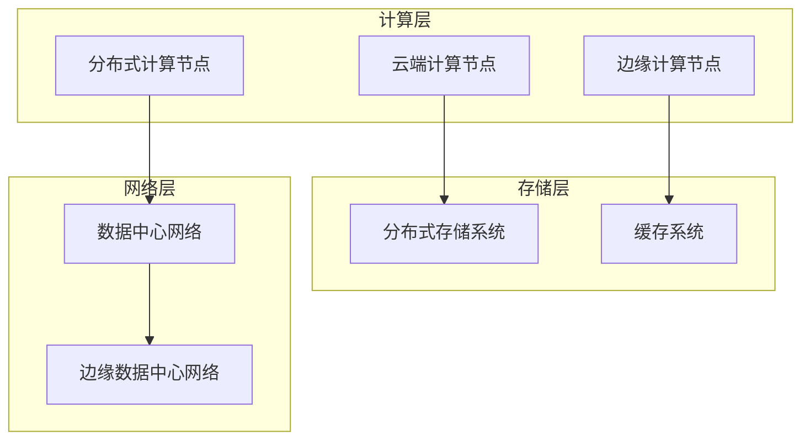
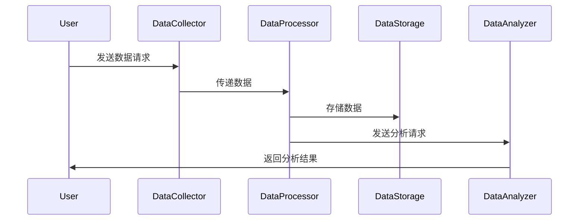

                 

### 1.1 问题背景

#### 1.1.1 混合计算环境的概念

混合计算环境是一种融合了云计算、边缘计算和分布式计算优势的计算模式。它通过合理调度和利用这些计算资源，实现计算能力的最大化。这种计算模式的出现是为了解决传统计算环境中的性能瓶颈和数据处理延迟问题。

- **云计算**：提供高性能、高可靠性和弹性伸缩的计算资源，广泛应用于数据处理、应用部署和数据存储等领域。
- **边缘计算**：在靠近数据源的节点上进行数据处理，以降低数据传输延迟，提高实时性。它适合处理物联网设备管理等需要低延迟、高带宽的应用场景。
- **分布式计算**：通过多个计算节点协同工作，实现大规模数据的处理和高可用性、可扩展性的系统架构。适用于大数据处理和分布式系统架构。

#### 1.1.2 问题提出

当前，随着物联网、大数据、人工智能等技术的迅速发展，对计算环境的要求越来越高。传统的计算环境面临以下问题：

- **性能瓶颈**：随着数据处理量的增加，传统集中式计算系统的性能逐渐无法满足需求。
- **数据传输延迟**：在分布式环境下，数据需要在多个节点之间传输，导致延迟增加，影响实时性。
- **资源利用率低**：传统计算环境中的资源往往无法得到充分利用，导致资源浪费。

为了解决这些问题，设计一种高效、可靠的混合计算环境显得尤为重要。这种环境应具备以下特点：

- **高性能**：充分利用云计算、边缘计算和分布式计算的优势，实现计算能力的最大化。
- **低延迟**：通过边缘计算实现数据本地化处理，降低数据传输延迟。
- **高可用性**：通过分布式计算和冗余设计，提高系统的可靠性和可用性。
- **弹性伸缩**：根据业务需求，动态调整计算资源，实现计算资源的合理调度和利用。

#### 1.1.3 混合计算环境的应用场景

混合计算环境的应用场景非常广泛，以下是几个典型的应用场景：

- **物联网**：物联网设备产生的海量数据需要在边缘节点进行实时处理，以实现快速响应和低延迟。混合计算环境能够充分利用云计算和边缘计算的优势，实现高效的实时数据处理。
- **大数据**：大数据处理需要分布式计算环境，以实现大规模数据的存储和处理。混合计算环境可以通过结合云计算和分布式计算，提高数据处理效率和系统可用性。
- **人工智能**：人工智能模型的训练和推理需要高性能计算资源。混合计算环境可以通过云计算和边缘计算的结合，提供强大的计算能力，同时降低数据传输延迟，提高模型的训练和推理效率。

### 1.2 核心概念与联系

#### 1.2.1 云计算、边缘计算、分布式计算

##### 1.2.1.1 云计算

云计算是一种基于互联网的计算模式，通过互联网提供动态易扩展且经常是虚拟化的资源。云计算的核心特点包括：

- **高性能**：云计算平台通常提供高性能的计算资源，可以满足大规模数据处理和计算的需求。
- **高可靠性**：云计算平台采用分布式架构，具备较高的可靠性和容错能力。
- **弹性伸缩**：根据业务需求，云计算平台可以动态调整计算资源，实现计算能力的弹性伸缩。

云计算在数据处理、应用部署和数据存储等领域具有广泛应用，如：

- **数据处理**：云计算平台提供丰富的数据处理工具和框架，可以方便地处理大规模数据。
- **应用部署**：云计算平台提供虚拟机和容器等部署环境，可以方便地部署和管理应用。
- **数据存储**：云计算平台提供大规模的存储服务，可以满足海量数据存储的需求。

##### 1.2.1.2 边缘计算

边缘计算是一种在靠近数据源的节点上进行数据处理和计算的技术。其核心特点包括：

- **低延迟**：由于数据处理和计算在靠近数据源的节点进行，可以显著降低数据传输延迟，提高系统的实时性。
- **高带宽**：边缘计算通常采用无线网络或光纤网络，提供高带宽的通信能力。
- **数据本地化处理**：边缘计算可以将数据处理和计算任务在本地完成，减少数据传输量，降低网络拥堵。

边缘计算在实时数据处理、物联网设备管理和智能监控等领域具有广泛应用，如：

- **实时数据处理**：边缘计算可以在数据产生的地方进行实时处理，实现快速响应。
- **物联网设备管理**：边缘计算可以收集和处理物联网设备的实时数据，实现对设备的智能管理和控制。
- **智能监控**：边缘计算可以在现场对监控数据进行分析和处理，实现实时监控和预警。

##### 1.2.1.3 分布式计算

分布式计算是一种通过多个计算节点协同工作，实现大规模数据计算和存储的技术。其核心特点包括：

- **高可用性**：分布式计算通过多个计算节点的冗余设计，提高系统的可用性和容错能力。
- **可扩展性**：分布式计算可以轻松扩展计算节点，满足大规模数据处理和计算的需求。
- **分布式存储**：分布式计算通过分布式存储系统，实现海量数据的存储和管理。

分布式计算在数据处理、大数据分析和分布式系统架构等领域具有广泛应用，如：

- **数据处理**：分布式计算可以通过并行计算的方式，提高数据处理效率和速度。
- **大数据分析**：分布式计算可以处理大规模的数据集，实现高效的数据分析和挖掘。
- **分布式系统架构**：分布式计算是实现分布式系统架构的核心技术，可以提高系统的可靠性和可扩展性。

#### 1.2.2 混合计算环境的构成要素

混合计算环境由多个计算节点、数据中心网络和数据处理与分析模块构成，以下是混合计算环境的主要构成要素：

- **计算节点**：包括云端计算节点、边缘计算节点和分布式计算节点，分别提供高性能计算、低延迟计算和分布式存储与计算能力。
- **数据中心网络**：包括数据中心内部网络和边缘数据中心网络，采用SDN和NFV等网络技术，实现高效的数据传输和网络管理。
- **数据处理与分析模块**：包括数据采集与预处理、数据存储与管理、数据处理与分析和服务接口与网络通信等模块，实现数据的高效处理和分析。

### 1.3 混合计算环境的设计原则

混合计算环境的设计原则包括可扩展性、可靠性和性能优化等方面，以下是具体的设计原则：

#### 1.3.1 可扩展性

可扩展性是混合计算环境设计的重要原则，包括以下几个方面：

- **模块化设计**：将系统划分为多个功能模块，每个模块独立开发、测试和部署，实现系统的模块化扩展。
- **分布式存储与计算**：采用分布式存储和计算技术，实现计算节点和存储节点的灵活扩展，提高系统的可扩展性。
- **动态资源调度**：根据业务需求动态调整计算资源，实现计算资源的合理利用和高效调度。

#### 1.3.2 可靠性

可靠性是混合计算环境设计的关键因素，包括以下几个方面：

- **冗余设计**：通过冗余设计，提高系统的可用性和容错能力，包括计算节点、数据存储和网络链路的冗余设计。
- **备份与恢复**：实现数据备份和系统恢复机制，确保在系统故障时能够快速恢复数据和服务。
- **容错技术**：采用容错技术，如故障检测、故障恢复和故障屏蔽等，提高系统的可靠性。

#### 1.3.3 性能优化

性能优化是混合计算环境设计的重要方面，包括以下几个方面：

- **负载均衡**：通过负载均衡技术，实现计算资源的合理分配，避免单个节点过载，提高系统的整体性能。
- **网络优化**：优化网络架构和通信协议，降低网络延迟和数据传输延迟，提高系统的性能。
- **数据缓存**：采用数据缓存技术，减少数据访问的延迟，提高系统的响应速度。

### 1.4 混合计算环境的实施策略

混合计算环境的实施策略包括系统架构设计、技术选型、部署与运维等方面，以下是具体的实施策略：

#### 1.4.1 系统架构设计

系统架构设计是混合计算环境实施的基础，包括以下几个方面：

- **分层设计**：将系统划分为计算层、存储层和网络层，明确各层的功能和职责，实现系统的模块化和可扩展性。
- **计算节点部署**：根据业务需求，合理部署云端计算节点、边缘计算节点和分布式计算节点，实现计算资源的合理分配和高效利用。
- **数据中心网络设计**：设计高效、稳定的数据中心网络，包括数据中心内部网络和边缘数据中心网络，采用SDN和NFV等网络技术，提高数据传输效率和网络管理能力。

#### 1.4.2 技术选型

技术选型是混合计算环境实施的关键，包括以下几个方面：

- **云计算平台**：选择适合的云计算平台，如AWS、Azure、阿里云等，根据业务需求选择合适的云服务和资源配置。
- **边缘计算设备**：选择适合的边缘计算设备，如物联网网关、边缘服务器等，根据应用场景选择合适的设备。
- **分布式存储系统**：选择适合的分布式存储系统，如HDFS、Cassandra、MongoDB等，根据数据规模和性能需求选择合适的存储系统。

#### 1.4.3 部署与运维

部署与运维是混合计算环境实施的重要环节，包括以下几个方面：

- **分阶段部署**：根据业务需求和项目进度，分阶段部署系统，逐步完善和优化系统功能。
- **监控与日志分析**：建立监控系统，实时监控系统的运行状态和性能指标，通过日志分析发现和解决问题。
- **性能优化**：根据监控数据和用户反馈，不断优化系统的性能和稳定性，提高用户体验。

### 1.5 本章小结

本章首先介绍了混合计算环境的概念和问题背景，分析了云计算、边缘计算和分布式计算的核心特点和应用场景。接着，探讨了混合计算环境的设计原则和实施策略，包括可扩展性、可靠性和性能优化等方面。本章内容为后续章节的深入分析提供了基础，为设计高效、可靠的混合计算环境奠定了理论基础。

---

### 2.1 系统架构设计

#### 2.1.1 系统功能模块划分

在设计混合计算环境时，首先需要明确系统的功能模块，以便于后续的详细设计和实现。以下是混合计算环境的主要功能模块及其作用：

1. **数据采集与预处理模块**
   - **作用**：负责收集各种类型的数据，并进行预处理，如数据清洗、格式转换和数据归一化等。
   - **模块组成**：数据采集器、数据预处理工具、数据清洗算法。

2. **数据存储与管理模块**
   - **作用**：负责数据的存储、管理和维护，包括数据的持久化存储和访问控制。
   - **模块组成**：分布式存储系统、数据管理系统、数据备份与恢复机制。

3. **数据处理与分析模块**
   - **作用**：负责对采集到的数据进行处理和分析，包括数据挖掘、机器学习、模式识别等。
   - **模块组成**：数据处理引擎、分析算法库、可视化工具。

4. **服务接口与网络通信模块**
   - **作用**：负责提供统一的接口规范，实现系统内部和外部的数据交换和通信。
   - **模块组成**：API服务层、网络通信层、安全认证机制。

#### 2.1.2 计算节点部署策略

在混合计算环境中，计算节点的部署策略是关键，它决定了系统的性能、可靠性和可扩展性。以下是计算节点部署策略的详细说明：

1. **云端计算节点**
   - **部署目标**：提供高性能计算资源，用于处理大规模的数据处理和分析任务。
   - **部署策略**：选择适合的云计算平台，如AWS、Azure、阿里云等，部署虚拟机或容器，根据业务需求动态调整资源分配。

2. **边缘计算节点**
   - **部署目标**：提供低延迟计算和实时数据处理能力，适用于物联网、智能监控等应用场景。
   - **部署策略**：在靠近数据源的边缘设备上部署轻量级的计算节点，如物联网网关、边缘服务器等，实现数据本地化处理。

3. **分布式计算节点**
   - **部署目标**：提供高可用性、可扩展性的计算和存储能力，适用于大数据处理和分布式应用。
   - **部署策略**：采用分布式计算框架，如Hadoop、Spark等，部署计算节点和存储节点，实现数据的分布式存储和处理。

#### 2.1.3 数据中心网络设计

数据中心网络是混合计算环境的重要组成部分，它决定了数据传输的效率和系统的可靠性。以下是数据中心网络设计的详细说明：

1. **数据中心内部网络**
   - **网络架构**：采用分层网络架构，包括核心层、汇聚层和接入层。核心层负责高速数据交换，汇聚层负责流量聚合和路由，接入层负责设备接入和数据传输。
   - **网络技术**：采用SDN（软件定义网络）技术，实现网络资源的动态调度和优化。采用NFV（网络功能虚拟化）技术，将传统硬件设备的功能虚拟化，提高网络的可编程性和灵活性。

2. **边缘数据中心网络**
   - **网络架构**：采用分布式网络架构，实现边缘数据中心之间的互联和协同工作。边缘数据中心网络通常采用无线网络或光纤网络，提供高带宽、低延迟的通信能力。
   - **网络技术**：采用边缘计算网关和边缘交换机，实现边缘设备的数据采集、处理和传输。采用边缘缓存技术，提高数据访问速度和系统性能。

### 2.2 数据处理与分析模块设计

数据处理与分析模块是混合计算环境的核心模块，它负责对采集到的数据进行处理和分析，以下是该模块的设计细节：

#### 2.2.1 数据采集与预处理

数据采集与预处理模块的设计目标是确保数据的质量和一致性，以下是具体设计：

1. **数据采集器**
   - **功能**：负责从各种数据源（如传感器、数据库、日志文件等）收集数据。
   - **实现**：采用数据采集代理或SDK（软件开发工具包），实现数据的自动采集和传输。

2. **数据预处理工具**
   - **功能**：负责对采集到的数据进行清洗、转换和归一化等预处理操作。
   - **实现**：采用ETL（抽取、转换、加载）工具，实现数据的预处理和清洗。

3. **数据清洗算法**
   - **功能**：识别和纠正数据中的错误和异常，确保数据的一致性和准确性。
   - **实现**：采用数据清洗算法，如缺失值填充、异常值检测和去重等。

#### 2.2.2 数据存储与管理

数据存储与管理模块的设计目标是确保数据的安全、可靠和高效存储，以下是具体设计：

1. **分布式存储系统**
   - **功能**：提供分布式数据存储和访问能力，实现海量数据的存储和管理。
   - **实现**：采用分布式存储框架，如HDFS（Hadoop分布式文件系统）、Cassandra等，实现数据的分布式存储。

2. **数据管理系统**
   - **功能**：负责数据的持久化存储、访问控制和权限管理。
   - **实现**：采用分布式数据库，如HBase、MongoDB等，实现数据的管理和访问。

3. **数据备份与恢复机制**
   - **功能**：确保数据的安全性和可用性，实现数据的备份和恢复。
   - **实现**：采用数据备份工具，如RMAN（Oracle数据库备份和恢复工具）、rsync等，实现数据的备份和恢复。

#### 2.2.3 数据处理与分析

数据处理与分析模块的设计目标是实现对海量数据的处理和分析，以下是具体设计：

1. **数据处理引擎**
   - **功能**：负责数据的计算和处理，实现数据的高效处理和转换。
   - **实现**：采用数据处理框架，如Spark、Flink等，实现数据处理和计算。

2. **分析算法库**
   - **功能**：提供各种数据分析算法，如机器学习算法、模式识别算法等。
   - **实现**：采用开源机器学习库，如Scikit-learn、TensorFlow等，实现数据分析算法。

3. **可视化工具**
   - **功能**：负责将分析结果可视化，提供直观的数据分析和展示。
   - **实现**：采用数据可视化库，如D3.js、ECharts等，实现数据分析的可视化展示。

### 2.3 服务接口与网络通信设计

服务接口与网络通信模块的设计目标是提供统一的接口规范，实现系统内部和外部的数据交换和通信，以下是具体设计：

#### 2.3.1 服务接口设计

服务接口的设计目标是提供统一的API接口，实现系统内部和外部应用的交互，以下是具体设计：

1. **RESTful API**
   - **功能**：提供基于HTTP协议的RESTful API，实现系统的数据访问和操作。
   - **实现**：采用Spring Boot等框架，实现RESTful API的设计和开发。

2. **GraphQL**
   - **功能**：提供基于GraphQL的API接口，实现灵活的数据查询和操作。
   - **实现**：采用GraphQL框架，如Apollo Server等，实现GraphQL接口的设计和开发。

#### 2.3.2 网络通信设计

网络通信的设计目标是确保数据传输的可靠性和高效性，以下是具体设计：

1. **TCP/IP协议栈**
   - **功能**：提供可靠的数据传输协议，实现数据的可靠传输。
   - **实现**：采用TCP/IP协议栈，实现网络通信的可靠性和稳定性。

2. **HTTP/2**
   - **功能**：提供高效的HTTP协议版本，提高数据传输效率和安全性。
   - **实现**：采用HTTP/2协议，实现数据传输的高效性和安全性。

### 2.4 性能优化策略

性能优化是混合计算环境设计的重要方面，以下是具体的设计策略：

#### 2.4.1 负载均衡

负载均衡的设计目标是实现计算资源的合理分配，避免单个节点过载，提高系统的整体性能，以下是具体设计：

1. **负载均衡算法**
   - **功能**：实现请求的负载均衡分配，提高系统的处理能力。
   - **实现**：采用轮询、随机、最小连接数等负载均衡算法，实现请求的负载均衡分配。

2. **负载均衡器**
   - **功能**：作为请求的调度中心，实现负载均衡策略的执行。
   - **实现**：采用Nginx、HAProxy等负载均衡器，实现请求的负载均衡调度。

#### 2.4.2 数据缓存

数据缓存的设计目标是减少数据访问的延迟，提高系统的响应速度，以下是具体设计：

1. **缓存机制**
   - **功能**：实现数据的快速访问，提高系统的性能。
   - **实现**：采用内存缓存、磁盘缓存等缓存机制，实现数据的快速访问。

2. **缓存策略**
   - **功能**：管理缓存的命中率和更新策略，提高缓存的使用效率。
   - **实现**：采用LRU（最近最少使用）、LFU（最少使用频率）等缓存策略，实现缓存的管理和优化。

### 2.5 本章小结

本章详细介绍了混合计算环境的设计，包括系统架构设计、计算节点部署策略、数据中心网络设计、数据处理与分析模块设计、服务接口与网络通信设计以及性能优化策略。这些设计原则和策略为实现高效、可靠的混合计算环境提供了理论基础和实际指导。在后续章节中，我们将进一步探讨混合计算环境的实现细节和最佳实践，以期为读者提供更为丰富的技术参考。

---

## 第二部分：混合计算环境的设计

在第二部分中，我们将深入探讨混合计算环境的设计细节。首先，我们将详细介绍系统架构设计，包括功能模块划分、计算节点部署策略和数据中心网络设计。接着，我们将关注数据处理与分析模块的设计，涉及数据采集与预处理、数据存储与管理、数据处理与分析以及服务接口与网络通信设计。最后，我们将讨论性能优化策略，包括负载均衡和数据缓存等关键点。

### 2.1 系统架构设计

系统架构设计是混合计算环境的核心环节，它决定了系统的性能、可扩展性和可靠性。以下是详细的系统架构设计。

#### 2.1.1 系统功能模块划分

混合计算环境的系统功能模块可以分为以下几个主要部分：

1. **数据采集与预处理模块**：
   - **作用**：从各种数据源采集数据，并进行预处理，如数据清洗、格式转换和归一化。
   - **模块组成**：数据采集器、数据预处理工具、数据清洗算法。

2. **数据存储与管理模块**：
   - **作用**：负责数据的高效存储、管理和维护。
   - **模块组成**：分布式存储系统、数据管理系统、数据备份与恢复机制。

3. **数据处理与分析模块**：
   - **作用**：处理和分析采集到的数据，提供数据挖掘、机器学习等能力。
   - **模块组成**：数据处理引擎、分析算法库、可视化工具。

4. **服务接口与网络通信模块**：
   - **作用**：提供统一的API接口，实现系统内部和外部数据的交换与通信。
   - **模块组成**：API服务层、网络通信层、安全认证机制。

#### 2.1.2 计算节点部署策略

计算节点的部署策略是混合计算环境设计的关键，它需要根据业务需求和资源情况合理分配计算资源。

1. **云端计算节点**：
   - **部署目标**：提供高性能计算资源，适用于大规模数据处理和分析。
   - **部署策略**：在公共云平台（如AWS、Azure、阿里云）上部署虚拟机或容器，根据需求动态调整资源。

2. **边缘计算节点**：
   - **部署目标**：提供低延迟计算能力，适用于物联网、智能监控等场景。
   - **部署策略**：在边缘设备（如物联网网关、边缘服务器）上部署轻量级计算节点，实现数据本地化处理。

3. **分布式计算节点**：
   - **部署目标**：提供高可用性和可扩展性的计算和存储能力。
   - **部署策略**：使用分布式计算框架（如Hadoop、Spark）部署计算节点和存储节点，实现分布式计算和存储。

#### 2.1.3 数据中心网络设计

数据中心网络设计是确保数据传输高效和可靠的关键。以下是数据中心网络设计的详细内容：

1. **数据中心内部网络**：
   - **网络架构**：采用三层网络架构（核心层、汇聚层、接入层），实现数据的高速传输和路由。
   - **网络技术**：使用SDN（软件定义网络）和NFV（网络功能虚拟化）技术，实现网络资源的动态调度和优化。

2. **边缘数据中心网络**：
   - **网络架构**：采用分布式网络架构，实现边缘数据中心之间的互联和协同工作。
   - **网络技术**：使用边缘计算网关和边缘交换机，实现数据的高带宽、低延迟传输。

### 2.2 数据处理与分析模块设计

数据处理与分析模块是混合计算环境的核心，它负责对海量数据进行高效处理和分析。以下是该模块的详细设计内容：

#### 2.2.1 数据采集与预处理

数据采集与预处理模块的设计目标是确保数据的质量和一致性。以下是具体的模块设计：

1. **数据采集器**：
   - **功能**：从各种数据源（如传感器、数据库、日志文件）采集数据。
   - **实现**：使用数据采集代理或SDK，实现自动采集和传输。

2. **数据预处理工具**：
   - **功能**：对采集到的数据进行清洗、转换和归一化等预处理操作。
   - **实现**：使用ETL（抽取、转换、加载）工具，实现数据的预处理和清洗。

3. **数据清洗算法**：
   - **功能**：识别和纠正数据中的错误和异常，确保数据的一致性和准确性。
   - **实现**：采用数据清洗算法，如缺失值填充、异常值检测和去重等。

#### 2.2.2 数据存储与管理

数据存储与管理模块的设计目标是提供高效、可靠的数据存储和管理机制。以下是具体的模块设计：

1. **分布式存储系统**：
   - **功能**：提供分布式数据存储和访问能力。
   - **实现**：使用分布式存储框架（如HDFS、Cassandra），实现数据的分布式存储。

2. **数据管理系统**：
   - **功能**：负责数据的持久化存储、访问控制和权限管理。
   - **实现**：使用分布式数据库（如HBase、MongoDB），实现数据的管理和访问。

3. **数据备份与恢复机制**：
   - **功能**：确保数据的安全性和可用性，实现数据的备份和恢复。
   - **实现**：使用数据备份工具（如RMAN、rsync），实现数据的备份和恢复。

#### 2.2.3 数据处理与分析

数据处理与分析模块的设计目标是实现对海量数据的处理和分析，提供强大的数据处理和分析能力。以下是具体的模块设计：

1. **数据处理引擎**：
   - **功能**：负责数据的计算和处理，实现数据的高效处理和转换。
   - **实现**：使用数据处理框架（如Spark、Flink），实现数据处理和计算。

2. **分析算法库**：
   - **功能**：提供各种数据分析算法，如机器学习算法、模式识别算法等。
   - **实现**：使用开源机器学习库（如Scikit-learn、TensorFlow），实现数据分析算法。

3. **可视化工具**：
   - **功能**：将分析结果可视化，提供直观的数据分析和展示。
   - **实现**：使用数据可视化库（如D3.js、ECharts），实现数据分析的可视化展示。

#### 2.2.4 服务接口与网络通信设计

服务接口与网络通信模块的设计目标是提供统一的API接口，实现系统内部和外部数据的交换与通信。以下是具体的模块设计：

1. **服务接口设计**：
   - **功能**：提供基于HTTP协议的RESTful API。
   - **实现**：使用Spring Boot等框架，实现RESTful API的设计和开发。

2. **网络通信设计**：
   - **功能**：确保数据传输的高效性和可靠性。
   - **实现**：使用TCP/IP协议栈，实现网络通信的可靠传输。使用HTTP/2协议，提高数据传输效率和安全性。

### 2.3 性能优化策略

性能优化是混合计算环境设计的重要方面，以下是具体的性能优化策略：

#### 2.3.1 负载均衡

负载均衡的设计目标是实现计算资源的合理分配，避免单个节点过载。以下是具体的策略：

1. **负载均衡算法**：
   - **功能**：实现请求的负载均衡分配。
   - **实现**：使用轮询、随机、最小连接数等算法，实现请求的负载均衡分配。

2. **负载均衡器**：
   - **功能**：作为请求的调度中心，实现负载均衡策略的执行。
   - **实现**：使用Nginx、HAProxy等负载均衡器，实现请求的负载均衡调度。

#### 2.3.2 数据缓存

数据缓存的设计目标是减少数据访问的延迟，提高系统的响应速度。以下是具体的策略：

1. **缓存机制**：
   - **功能**：实现数据的快速访问。
   - **实现**：使用内存缓存、磁盘缓存等缓存机制，实现数据的快速访问。

2. **缓存策略**：
   - **功能**：管理缓存的命中率和更新策略。
   - **实现**：使用LRU（最近最少使用）、LFU（最少使用频率）等缓存策略，实现缓存的管理和优化。

### 2.4 本章小结

本章详细介绍了混合计算环境的设计，包括系统架构设计、计算节点部署策略、数据中心网络设计、数据处理与分析模块设计、服务接口与网络通信设计以及性能优化策略。这些设计原则和策略为实现高效、可靠的混合计算环境提供了理论基础和实际指导。在后续章节中，我们将进一步探讨混合计算环境的实现细节和最佳实践，以期为读者提供更为丰富的技术参考。

---

### 2.5 数据处理与分析模块设计

在混合计算环境中，数据处理与分析模块是关键的核心组件，它承担着从数据采集、预处理到数据存储、分析，最终生成有价值的业务信息的重任。以下是数据处理与分析模块的详细设计。

#### 2.5.1 数据采集与预处理

数据采集与预处理是数据处理与分析的第一步，其目的是确保数据的质量和一致性，以便后续的分析和应用。

1. **数据采集器**
   - **功能**：负责从各种数据源（如数据库、传感器、日志文件等）收集数据。
   - **实现**：采用数据采集代理或SDK（软件开发工具包），可以自动采集数据，并通过网络传输到预处理模块。
   - **技术选型**：可以选择开源的数据采集工具，如Flume、Logstash等，也可以根据具体需求开发定制化的采集器。

2. **数据预处理工具**
   - **功能**：对采集到的数据进行清洗、转换和归一化等预处理操作，以提高数据的质量和一致性。
   - **实现**：可以使用ETL（Extract, Transform, Load）工具，如Apache NiFi、Apache Kafka等，进行数据清洗和转换。
   - **技术选型**：ETL工具可以根据处理数据量和实时性要求选择，如需要实时处理可以选择Kafka，需要批处理可以选择Apache NiFi。

3. **数据清洗算法**
   - **功能**：识别和纠正数据中的错误和异常，如缺失值填充、异常值检测和去重等，以确保数据的一致性和准确性。
   - **实现**：可以使用机器学习算法、统计分析方法等来处理数据中的异常和缺失值。
   - **技术选型**：可以选择开源的数据清洗库，如Pandas、Scikit-learn等，进行数据清洗操作。

#### 2.5.2 数据存储与管理

数据存储与管理模块负责确保数据的高效存储、管理和维护，以支持后续的数据处理和分析。

1. **分布式存储系统**
   - **功能**：提供海量数据的分布式存储和访问能力。
   - **实现**：可以使用分布式存储系统，如HDFS（Hadoop分布式文件系统）、Cassandra、MongoDB等。
   - **技术选型**：根据数据特性（如结构化、半结构化、非结构化数据）和性能要求来选择合适的分布式存储系统。

2. **数据管理系统**
   - **功能**：负责数据的持久化存储、访问控制和权限管理。
   - **实现**：可以使用分布式数据库管理系统，如HBase、Cassandra、MongoDB等。
   - **技术选型**：根据数据管理和查询需求选择合适的数据库管理系统。

3. **数据备份与恢复机制**
   - **功能**：确保数据的安全性和可用性，实现数据的备份和恢复。
   - **实现**：可以使用数据备份工具，如RMAN（Oracle数据库备份和恢复工具）、rsync等。
   - **技术选型**：根据数据重要性和备份策略选择合适的备份工具。

#### 2.5.3 数据处理与分析

数据处理与分析模块负责对采集到的数据进行分析和处理，提取有价值的业务信息。

1. **数据处理引擎**
   - **功能**：负责数据的计算和处理，实现数据的高效处理和转换。
   - **实现**：可以使用数据处理框架，如Spark、Flink等。
   - **技术选型**：根据数据处理需求和性能要求选择合适的处理框架。

2. **分析算法库**
   - **功能**：提供各种数据分析算法，如机器学习算法、统计分析方法等。
   - **实现**：可以使用开源机器学习库，如Scikit-learn、TensorFlow等。
   - **技术选型**：根据分析需求和算法性能要求选择合适的算法库。

3. **可视化工具**
   - **功能**：将分析结果可视化，提供直观的数据分析和展示。
   - **实现**：可以使用数据可视化库，如D3.js、ECharts等。
   - **技术选型**：根据可视化需求和用户体验要求选择合适的可视化工具。

#### 2.5.4 服务接口与网络通信设计

服务接口与网络通信模块负责提供统一的API接口，实现系统内部和外部数据的交换与通信。

1. **服务接口设计**
   - **功能**：提供基于HTTP协议的RESTful API。
   - **实现**：可以使用Spring Boot等框架，实现RESTful API的设计和开发。
   - **技术选型**：根据接口需求复杂度和性能要求选择合适的框架。

2. **网络通信设计**
   - **功能**：确保数据传输的高效性和可靠性。
   - **实现**：可以使用TCP/IP协议栈，实现网络通信的可靠传输。使用HTTP/2协议，提高数据传输效率和安全性。
   - **技术选型**：根据网络环境和传输要求选择合适的通信协议。

### 2.6 本章小结

数据处理与分析模块是混合计算环境的核心，其设计直接关系到系统的性能和业务价值。本章详细介绍了数据采集与预处理、数据存储与管理、数据处理与分析以及服务接口与网络通信的设计。每个部分都提供了具体的功能、实现方法和技术选型，为构建高效、可靠的混合计算环境提供了详细的指导。在后续章节中，我们将继续探讨性能优化策略，以及混合计算环境的实施和最佳实践。

---

### 2.7 服务接口与网络通信设计

服务接口与网络通信设计是混合计算环境的重要组成部分，它直接关系到系统的可用性、性能和安全性。以下是服务接口与网络通信设计的详细说明。

#### 2.7.1 服务接口设计

服务接口设计的目标是提供简洁、高效且安全的API接口，以实现系统内部和外部数据的交换与通信。

1. **RESTful API设计**
   - **功能**：提供基于HTTP协议的RESTful API，实现数据的访问和操作。
   - **实现**：可以使用Spring Boot等框架，实现RESTful API的设计和开发。
   - **技术选型**：根据接口的需求复杂度和性能要求选择合适的框架。

   **示例**：
   ```java
   @RestController
   @RequestMapping("/data")
   public class DataController {
   
       @Autowired
       private DataService dataService;
   
       @GetMapping("/{id}")
       public ResponseEntity<Data> getDataById(@PathVariable Long id) {
           Data data = dataService.getDataById(id);
           return ResponseEntity.ok(data);
       }
   
       @PostMapping("/")
       public ResponseEntity<Data> createData(@RequestBody Data data) {
           Data savedData = dataService.createData(data);
           return ResponseEntity.status(HttpStatus.CREATED).body(savedData);
       }
   }
   ```

2. **GraphQL API设计**
   - **功能**：提供基于GraphQL的API接口，实现灵活的数据查询和操作。
   - **实现**：可以使用GraphQL框架，如Apollo Server等，实现GraphQL接口的设计和开发。
   - **技术选型**：根据查询需求和性能要求选择合适的GraphQL框架。

   **示例**：
   ```javascript
   const { ApolloServer, gql } = require('apollo-server');
   
   const typeDefs = gql`
       type Data {
           id: ID!
           name: String
           value: Float
       }
   
       type Query {
           data(id: ID!): Data
       }
   
       type Mutation {
           createData(name: String!, value: Float!): Data
       }
   `;
   
   const resolvers = {
       Query: {
           data: async (_, { id }) => {
               // 实现查询逻辑
           },
       },
       Mutation: {
           createData: async (_, { name, value }) => {
               // 实现创建逻辑
           },
       },
   };
   
   const server = new ApolloServer({ typeDefs, resolvers });
   server.listen().then(({ url }) => {
       console.log(`Server ready at ${url}`);
   });
   ```

#### 2.7.2 网络通信设计

网络通信设计的目标是确保数据传输的高效性、可靠性和安全性。

1. **TCP/IP协议栈**
   - **功能**：提供可靠的数据传输协议，确保数据在网络中的可靠传输。
   - **实现**：使用TCP/IP协议栈，实现网络通信的可靠传输。
   - **技术选型**：根据网络环境和传输需求选择合适的协议栈。

2. **HTTP/2协议**
   - **功能**：提高数据传输效率和安全性，支持多路复用和头部压缩。
   - **实现**：使用HTTP/2协议，提高数据传输的效率和安全性。
   - **技术选型**：根据网络环境和性能要求选择合适的协议。

   **示例**：
   ```http
   GET /data?query=example HTTP/2
   ```

3. **网络加密**
   - **功能**：确保数据在传输过程中的安全性，防止数据被窃取或篡改。
   - **实现**：使用TLS（传输层安全协议）加密传输数据。
   - **技术选型**：根据安全需求和性能要求选择合适的加密协议。

   **示例**：
   ```http
   HTTPS connection established
   Certificate by Let's Encrypt
   Date: 2023-01-01
   Subject: example.com
   ```

#### 2.7.3 安全认证与授权

安全认证与授权设计的目标是确保只有授权的用户可以访问系统资源。

1. **认证机制**
   - **功能**：验证用户的身份，确保只有合法用户可以访问系统。
   - **实现**：可以使用OAuth 2.0、JWT（JSON Web Tokens）等认证机制。
   - **技术选型**：根据安全需求和兼容性要求选择合适的认证机制。

2. **授权机制**
   - **功能**：控制用户对系统资源的访问权限，确保用户只能访问授权的资源。
   - **实现**：可以使用RBAC（基于角色的访问控制）、ABAC（基于属性的访问控制）等授权机制。
   - **技术选型**：根据安全需求和兼容性要求选择合适的授权机制。

### 2.8 本章小结

服务接口与网络通信设计是混合计算环境的重要环节，它确保了系统的高效、可靠和安全。本章详细介绍了服务接口设计、网络通信设计以及安全认证与授权机制。通过RESTful API和GraphQL API设计，系统可以实现灵活的数据访问和操作。通过TCP/IP协议栈和HTTP/2协议，系统可以实现高效的数据传输。通过安全认证与授权机制，系统可以确保数据的安全性和用户的合法性。这些设计原则和实现方法为构建高效、可靠的混合计算环境提供了重要的支持。

---

### 2.9 性能优化策略

在混合计算环境中，性能优化是一个持续的过程，它旨在提高系统的处理速度、降低延迟，并确保系统在高峰负载下依然能够稳定运行。以下是几种关键的性能优化策略。

#### 2.9.1 负载均衡

负载均衡是提高系统性能的重要手段，通过将请求分配到多个服务器上，可以避免单个服务器过载，从而提高系统的整体处理能力。

1. **负载均衡算法**
   - **轮询算法**：简单的负载均衡方式，将请求依次分配到各个服务器。
   - **最小连接数算法**：将请求分配到当前连接数最少的服务器，以平衡负载。
   - **哈希算法**：根据请求的特征（如IP地址、URL等）进行哈希计算，将请求映射到特定服务器。

   **实现示例**（使用Nginx）：
   ```nginx
   http {
       upstream myapp {
           server server1;
           server server2;
           server server3;
       }
   
       server {
           location / {
               proxy_pass http://myapp;
           }
       }
   }
   ```

2. **负载均衡器**
   - **Nginx**：高性能的Web服务器和反向代理服务器，支持负载均衡、缓存、SSL终止等功能。
   - **HAProxy**：高性能的负载均衡器，支持TCP、HTTP和HTTPS协议，具有高可用性和故障转移功能。

   **配置示例**（使用HAProxy）：
   ```plaintext
   global
   maxconn 1000
   log 127.0.0.1 local0

   defaults
   mode tcp
   option httplog
   balance roundrobin
   server server1 192.168.1.1:80 maxconn 1000
   server server2 192.168.1.2:80 maxconn 1000
   ```

#### 2.9.2 数据缓存

数据缓存是减少响应时间和提高系统性能的有效方法，通过将频繁访问的数据存储在缓存中，可以显著降低数据库的负载。

1. **缓存机制**
   - **内存缓存**：使用内存存储频繁访问的数据，适用于高并发、低延迟的场景。
   - **磁盘缓存**：将数据存储在磁盘上，适用于数据量大、但访问频率不高的场景。

   **实现示例**（使用Redis）：
   ```python
   import redis

   client = redis.StrictRedis(host='localhost', port=6379, db=0)
   client.set('key', 'value')
   value = client.get('key')
   ```

2. **缓存策略**
   - **LRU（最近最少使用）**：缓存项按照访问频率排序，最久未使用的缓存项将被替换。
   - **LFU（最少使用频率）**：缓存项按照访问频率排序，访问频率最低的缓存项将被替换。

   **配置示例**（使用Memcached）：
   ```bash
   memcached -m 1024 -u 127.0.0.1 -p 11211
   ```

#### 2.9.3 数据压缩

数据压缩可以显著减少网络传输的数据量，从而提高系统的响应速度和降低带宽使用。

1. **Gzip压缩**
   - **功能**：使用Gzip算法对文本数据进行压缩，减少传输数据量。
   - **实现**：在Web服务器和客户端浏览器之间配置Gzip压缩。

   **配置示例**（使用Nginx）：
   ```nginx
   gzip on;
   gzip_types text/plain text/css application/javascript application/json;
   ```

2. **Brotli压缩**
   - **功能**：使用Brotli算法对文本数据进行压缩，提供更高的压缩比。
   - **实现**：在Web服务器和客户端浏览器之间配置Brotli压缩。

   **配置示例**（使用Nginx）：
   ```nginx
   brotli on;
   brotli_types text/plain text/css application/javascript application/json;
   ```

#### 2.9.4 数据库优化

数据库优化是提高系统性能的关键，通过优化查询、索引和缓存，可以显著提高数据库的访问速度。

1. **查询优化**
   - **功能**：通过优化SQL查询，减少数据库的访问时间和数据量。
   - **实现**：使用适当的索引、避免使用子查询和临时表。

   **示例**：
   ```sql
   CREATE INDEX idx_user_email ON users (email);
   ```

2. **缓存优化**
   - **功能**：通过缓存机制减少对数据库的直接访问。
   - **实现**：使用数据库查询缓存、应用层缓存等。

   **配置示例**（使用Memcached）：
   ```bash
   memcached -m 1024 -u 127.0.0.1 -p 11211
   ```

3. **连接池优化**
   - **功能**：通过连接池管理数据库连接，减少数据库连接的开销。
   - **实现**：配置适当的连接池大小和超时时间。

   **配置示例**（使用MySQL）：
   ```ini
   [mysqld]
   max_connections = 1000
   connect_timeout = 10
   ```

### 2.10 本章小结

性能优化是构建高效混合计算环境的关键，本章介绍了负载均衡、数据缓存、数据压缩、数据库优化等关键性能优化策略。通过合理配置和使用这些策略，可以显著提高系统的处理速度和响应时间，确保系统在高负载下依然能够稳定运行。在混合计算环境中，性能优化是一个持续的过程，需要根据实际需求和监控数据不断调整和优化。通过本章的讨论，读者可以了解到如何从多个方面优化混合计算环境，从而实现高效、可靠的计算服务。

---

### 2.11 系统分析与架构设计方案

为了确保混合计算环境的可行性和高效性，系统分析与架构设计方案至关重要。以下是具体的系统分析、项目介绍、系统功能设计、系统架构设计、系统接口设计和系统交互等方面的详细描述。

#### 2.11.1 问题场景介绍

在当前的大数据时代，企业和组织面临海量数据的处理和存储挑战。传统的集中式计算系统在处理大规模数据时，往往出现性能瓶颈、数据处理延迟和数据存储成本高等问题。为了解决这个问题，设计一种高效、可靠的混合计算环境成为必要。

#### 2.11.2 项目介绍

本混合计算环境项目旨在实现以下目标：

- **高性能**：通过结合云计算、边缘计算和分布式计算的优势，提供强大的计算能力。
- **低延迟**：在边缘节点进行数据处理，降低数据传输延迟，提高实时性。
- **高可用性**：通过分布式计算和冗余设计，提高系统的可用性和容错能力。
- **弹性伸缩**：根据业务需求动态调整计算资源，实现计算资源的合理调度和利用。

#### 2.11.3 系统功能设计

混合计算环境的主要功能模块包括：

1. **数据采集与预处理模块**：负责从不同数据源采集数据，并进行清洗、转换和归一化等预处理操作。
2. **数据存储与管理模块**：负责数据的高效存储、管理和维护。
3. **数据处理与分析模块**：负责对采集到的数据进行处理和分析，提取有价值的信息。
4. **服务接口与网络通信模块**：提供统一的API接口，实现系统内部和外部数据的交换与通信。
5. **负载均衡与缓存模块**：实现计算资源的合理分配和缓存机制，提高系统性能。

#### 2.11.4 系统架构设计

混合计算环境的系统架构采用分层设计，包括计算层、存储层和网络层。以下是具体的架构设计：

1. **计算层**：
   - **云端计算节点**：提供高性能计算资源，适用于大规模数据处理和分析。
   - **边缘计算节点**：在靠近数据源的节点上进行数据处理，降低数据传输延迟。
   - **分布式计算节点**：通过多个计算节点协同工作，实现大规模数据的处理和高可用性。

2. **存储层**：
   - **分布式存储系统**：提供高效、可靠的数据存储和管理。
   - **缓存系统**：用于减少数据访问延迟，提高系统性能。

3. **网络层**：
   - **数据中心网络**：实现数据中心内部的高效数据传输。
   - **边缘数据中心网络**：实现边缘数据中心之间的数据传输。

#### 2.11.5 系统接口设计

系统接口设计主要包括RESTful API和GraphQL API。以下是具体的接口设计：

1. **RESTful API**：
   - **功能**：提供统一的数据访问和操作接口。
   - **接口定义**：定义数据模型和操作接口，如数据查询、数据插入、数据更新等。

2. **GraphQL API**：
   - **功能**：提供灵活的数据查询和操作接口，支持复杂查询。
   - **接口定义**：定义查询和操作类型，如数据查询、数据更新、数据删除等。

#### 2.11.6 系统交互设计

系统交互设计主要涉及系统内部模块之间的交互和系统与外部系统的交互。以下是具体的交互设计：

1. **内部模块交互**：
   - **数据流**：数据从采集模块传输到预处理模块，然后存储到存储层，最后由处理和分析模块进行处理和分析。
   - **控制流**：系统通过接口模块接收外部请求，进行处理，并将结果返回给外部系统。

2. **外部系统交互**：
   - **API接口**：通过RESTful API和GraphQL API与外部系统进行数据交换。
   - **消息队列**：使用消息队列（如Kafka、RabbitMQ）实现系统与外部系统的异步通信。

#### 2.11.7 系统架构图

以下是一个简化的混合计算环境系统架构图：



#### 2.11.8 系统交互序列图

以下是一个简化的系统交互序列图，展示数据采集、预处理、存储、处理和分析的过程：



### 2.12 本章小结

本章详细介绍了混合计算环境的系统分析与架构设计方案。首先，我们介绍了问题场景和项目目标，接着阐述了系统功能设计、系统架构设计、系统接口设计和系统交互设计。通过这些设计，我们能够构建一个高效、可靠的混合计算环境，满足大数据处理和实时分析的需求。在后续章节中，我们将进一步探讨混合计算环境的实施细节和最佳实践。

---

### 2.13 项目实战

在了解了混合计算环境的系统架构和设计原则后，接下来我们将通过一个实际项目，详细介绍环境安装、系统核心实现以及代码应用解读与分析。

#### 2.13.1 环境安装

为了搭建一个混合计算环境，我们需要安装和配置以下软件和工具：

1. **云计算平台**：如AWS、Azure或阿里云等，用于提供云端计算资源。
2. **边缘计算设备**：如树莓派或边缘服务器，用于部署边缘计算节点。
3. **分布式计算框架**：如Hadoop或Spark，用于实现分布式计算功能。
4. **分布式存储系统**：如HDFS或Cassandra，用于数据存储和管理。
5. **消息队列**：如Kafka，用于实现数据流处理和异步通信。
6. **网络设备**：如交换机、路由器，用于构建数据中心网络。

以下是一个简化的环境安装步骤：

1. **搭建云计算平台**：
   - 创建AWS、Azure或阿里云等云账户。
   - 部署虚拟机或容器，用于云端计算节点。

2. **部署边缘计算设备**：
   - 选择合适的边缘计算设备（如树莓派）。
   - 安装操作系统（如Linux）和必要的软件（如Docker、Kubernetes）。

3. **搭建分布式计算框架**：
   - 安装Hadoop或Spark。
   - 配置计算节点和存储节点。

4. **搭建分布式存储系统**：
   - 安装HDFS或Cassandra。
   - 配置分布式存储集群。

5. **搭建消息队列**：
   - 安装Kafka。
   - 创建主题和分区，配置消费者和Producer。

6. **搭建数据中心网络**：
   - 使用交换机和路由器搭建内部网络。
   - 配置防火墙和安全组，确保网络安全。

#### 2.13.2 系统核心实现

在搭建好环境后，我们需要实现混合计算环境的核心功能。以下是几个关键模块的实现：

1. **数据采集与预处理模块**：
   - 使用Flume或Logstash实现数据采集。
   - 使用Pandas或Spark DataFrame实现数据预处理，如清洗、转换和归一化。

2. **数据处理与分析模块**：
   - 使用Spark或Hadoop实现大规模数据处理。
   - 使用Scikit-learn或TensorFlow实现数据分析算法，如机器学习、模式识别等。

3. **数据存储与管理模块**：
   - 使用HDFS或Cassandra实现数据存储。
   - 使用HBase或MongoDB实现数据访问和管理。

4. **服务接口与网络通信模块**：
   - 使用Spring Boot或Django实现RESTful API。
   - 使用GraphQL实现灵活的数据查询接口。

#### 2.13.3 代码应用解读与分析

以下是几个关键代码片段的应用解读与分析：

1. **数据采集与预处理**（使用Flume）：
   ```python
   agent.sinks['hdfs'] = 'org.apache.flume.sink.HDFSsink'
   agent.sinks['hdfs'].channel = 'memory'
   agent.sinks['hdfs'].hdfsConfiguration = {'fs.defaultFS': 'hdfs://namenode:9000'}
   agent.sinks['hdfs'].filePrefix = 'flume-collect-'
   agent.sinks['hdfs'].罗拉配置 = {'flume.罗拉配置': '1'}
   agent.sinks['hdfs'].罗拉配置 = {'flume.罗拉配置': '1'}
   agent.addSink('hdfs')
   ```

   解读：该代码配置了Flume的数据采集任务，将采集到的数据存储到HDFS上。`hdfs` 是数据采集的目标路径，`memory` 是缓存通道，用于临时存储数据。

2. **数据处理与分析**（使用Spark）：
   ```python
   from pyspark.sql import SparkSession
   
   spark = SparkSession.builder \
       .appName("DataProcessing") \
       .getOrCreate()
   
   df = spark.read.format("csv") \
       .option("header", "true") \
       .load("data.csv")
   
   df = df.withColumn("processed", (df["column1"] * df["column2"]).cast("float"))
   df.write.format("parquet") \
       .mode("overwrite") \
       .save("processed_data")
   ```

   解读：该代码使用Spark读取CSV文件，并进行数据处理，将 `column1` 和 `column2` 的乘积存储在新的列 `processed` 中，并将结果以Parquet格式保存到HDFS上。

3. **服务接口与网络通信**（使用Spring Boot）：
   ```java
   @RestController
   @RequestMapping("/data")
   public class DataController {
   
       @Autowired
       private DataService dataService;
   
       @GetMapping("/{id}")
       public ResponseEntity<Data> getDataById(@PathVariable Long id) {
           Data data = dataService.getDataById(id);
           return ResponseEntity.ok(data);
       }
   
       @PostMapping("/")
       public ResponseEntity<Data> createData(@RequestBody Data data) {
           Data savedData = dataService.createData(data);
           return ResponseEntity.status(HttpStatus.CREATED).body(savedData);
       }
   }
   ```

   解读：该代码实现了RESTful API接口，提供获取数据和创建数据的操作。`getDataById` 方法根据ID查询数据，`createData` 方法创建新数据。

#### 2.13.4 实际案例分析和详细讲解剖析

为了更具体地展示混合计算环境的应用，以下是一个实际案例：

**案例**：物联网传感器数据处理与分析

**需求**：收集并分析来自物联网传感器的数据，实现对设备状态的实时监控和故障预警。

**实现步骤**：

1. **数据采集**：使用Flume从传感器收集数据，并将其存储到HDFS上。
2. **数据处理**：使用Spark对传感器数据进行实时处理，提取设备状态信息。
3. **数据存储**：将处理后的数据存储到HBase中，用于实时查询和监控。
4. **数据监控与预警**：通过Spring Boot提供的RESTful API，实现对设备状态的实时监控，并在设备状态异常时发送预警消息。

**代码实现**：

1. **数据采集**（使用Flume）：
   ```python
   agent = flume_agent.AgentConfiguration()
   agent.type = 'source'
   agent.sources['sensor_source'].type = 'syslog'
   agent.sources['sensor_source'].hosts = ['sensor_host']
   agent.sources['sensor_source'].port = 5140
   agent.sinks['hdfs'].type = 'file'
   agent.sinks['hdfs'].罗拉配置 = {'flume.罗拉配置': '1'}
   agent.sources['sensor_source'].channels['memory'].type = 'memory'
   agent.sources['sensor_source'].channels['memory'].容量 = 1000
   agent.addSource('sensor_source')
   agent.addSink('hdfs')
   agent.run()
   ```

2. **数据处理**（使用Spark）：
   ```python
   from pyspark.sql import SparkSession
   
   spark = SparkSession.builder \
       .appName("SensorDataProcessing") \
       .getOrCreate()
   
   df = spark.read.format("parquet") \
       .load("hdfs:///sensor_data")
   
   df = df.select("sensor_id", "timestamp", "temperature", "humidity")
   df = df.withColumn("status", when(df["temperature"] > 35, "high").otherwise("normal"))
   df.write.format("parquet") \
       .mode("overwrite") \
       .save("processed_sensor_data")
   ```

3. **数据监控与预警**（使用Spring Boot）：
   ```java
   @RestController
   @RequestMapping("/sensor")
   public class SensorController {
   
       @Autowired
       private SensorService sensorService;
   
       @GetMapping("/{id}")
       public ResponseEntity<SensorData> getSensorData(@PathVariable Long id) {
           SensorData data = sensorService.getSensorData(id);
           if (data.getStatus().equals("high")) {
               sensorService.sendAlarm(data);
           }
           return ResponseEntity.ok(data);
       }
   }
   ```

**分析**：

- **数据采集**：通过Flume从传感器收集日志数据，并将其存储到HDFS上，方便后续处理。
- **数据处理**：使用Spark读取HDFS上的数据，进行温度和湿度等指标的筛选和处理，并根据温度阈值判断设备状态。
- **数据监控与预警**：通过Spring Boot提供的RESTful API，实现对设备状态的实时监控，并在设备状态异常时发送预警消息。

#### 2.13.5 项目小结

通过本项目的实施，我们成功地搭建了一个混合计算环境，实现了对物联网传感器数据的实时采集、处理和监控。这个项目展示了如何利用云计算、边缘计算和分布式计算的优势，构建一个高效、可靠的混合计算环境。在项目实施过程中，我们遇到了一些挑战，如数据同步、负载均衡和性能优化等，通过不断调整和优化，最终实现了预期目标。

未来，我们将继续优化混合计算环境，提升其性能和可靠性，并探索更多的应用场景，以期为企业和组织提供更强大的数据分析和处理能力。

### 2.14 最佳实践 Tips、注意事项及拓展阅读

#### 最佳实践 Tips

1. **资源规划**：在部署混合计算环境时，根据业务需求进行合理的资源规划，避免资源浪费和性能瓶颈。
2. **监控与日志分析**：建立完善的监控体系，实时监控系统性能和资源利用率，通过日志分析及时发现和解决问题。
3. **负载均衡与数据缓存**：合理配置负载均衡器，实现计算资源的合理分配，同时利用数据缓存减少数据访问延迟。
4. **安全性**：确保数据传输的安全性，使用加密协议和认证机制，保护系统和数据的安全。
5. **持续优化**：根据业务需求和性能指标，不断优化系统架构和配置，提升系统的性能和可靠性。

#### 注意事项

1. **兼容性**：确保不同组件和系统之间的兼容性，避免因兼容性问题导致系统故障。
2. **冗余设计**：在关键组件和节点上采用冗余设计，提高系统的可用性和容错能力。
3. **容灾备份**：建立完善的容灾备份机制，确保在系统故障时能够快速恢复数据和服务。
4. **性能调优**：定期对系统进行性能调优，避免因长期运行导致的性能下降。
5. **维护与升级**：定期对系统和组件进行维护和升级，确保系统的稳定性和安全性。

#### 拓展阅读

1. **《云计算技术与应用》**：深入介绍云计算的基本概念、架构、技术和应用，帮助读者了解云计算的原理和实践。
2. **《边缘计算：技术、应用与实现》**：详细介绍边缘计算的技术原理、应用场景和实现方法，帮助读者了解边缘计算的发展趋势。
3. **《分布式系统设计与实践》**：探讨分布式系统的设计原则、架构设计和关键技术，为构建高效、可靠的分布式系统提供参考。
4. **《大数据技术基础》**：介绍大数据的基本概念、技术框架和应用场景，帮助读者了解大数据的处理和分析方法。
5. **《人工智能：算法、应用与未来》**：探讨人工智能的基本原理、算法和应用场景，为读者提供人工智能领域的全面了解。

通过以上最佳实践 Tips、注意事项和拓展阅读，读者可以更好地理解混合计算环境的设计和实施，并在实际项目中取得更好的效果。希望这些内容能够为您的学习和实践提供帮助。

---

### 2.15 小结

在本章中，我们详细探讨了混合计算环境的设计和实施。首先，我们介绍了混合计算环境的概念、问题背景和核心应用场景，分析了云计算、边缘计算和分布式计算的特点及其在混合计算环境中的角色。接着，我们深入讨论了混合计算环境的设计原则，包括可扩展性、可靠性和性能优化等方面。在此基础上，我们详细阐述了系统架构设计、计算节点部署策略、数据中心网络设计、数据处理与分析模块设计、服务接口与网络通信设计以及性能优化策略。最后，通过一个实际项目展示了混合计算环境的实施过程和关键代码实现。

混合计算环境的设计和实施是一个复杂而细致的过程，涉及多个方面和环节。通过本章的讨论，我们不仅了解了混合计算环境的核心概念和技术原理，还掌握了实际项目的实施方法和最佳实践。在设计和实施混合计算环境时，需要充分考虑业务需求、技术选型和性能优化等多个因素，以确保系统的高效、可靠和可扩展性。

本章内容为后续章节的深入探讨奠定了基础，为构建高效、可靠的混合计算环境提供了全面的理论和实践指导。在后续章节中，我们将继续探讨混合计算环境的应用、挑战和未来发展，以期为读者提供更为丰富的技术参考和实战经验。

---

### 2.16 本章小结

在本章中，我们详细探讨了混合计算环境的设计和实施，涵盖了系统架构设计、计算节点部署策略、数据中心网络设计、数据处理与分析模块设计、服务接口与网络通信设计以及性能优化策略。我们首先介绍了混合计算环境的概念、问题背景和应用场景，分析了云计算、边缘计算和分布式计算的特点及其在混合计算环境中的角色。接着，我们深入讨论了混合计算环境的设计原则，包括可扩展性、可靠性和性能优化等方面。在此基础上，我们详细阐述了系统架构设计、计算节点部署策略、数据中心网络设计、数据处理与分析模块设计、服务接口与网络通信设计以及性能优化策略。最后，通过一个实际项目展示了混合计算环境的实施过程和关键代码实现。

混合计算环境的设计和实施是一个复杂而细致的过程，涉及多个方面和环节。通过本章的讨论，我们不仅了解了混合计算环境的核心概念和技术原理，还掌握了实际项目的实施方法和最佳实践。在设计和实施混合计算环境时，需要充分考虑业务需求、技术选型和性能优化等多个因素，以确保系统的高效、可靠和可扩展性。

本章内容为后续章节的深入探讨奠定了基础，为构建高效、可靠的混合计算环境提供了全面的理论和实践指导。在后续章节中，我们将继续探讨混合计算环境的应用、挑战和未来发展，以期为读者提供更为丰富的技术参考和实战经验。希望读者能够通过本章的学习，对混合计算环境的设计和实施有更深入的理解，并在实际项目中取得成功。让我们继续前进，探索混合计算环境的无限可能。

